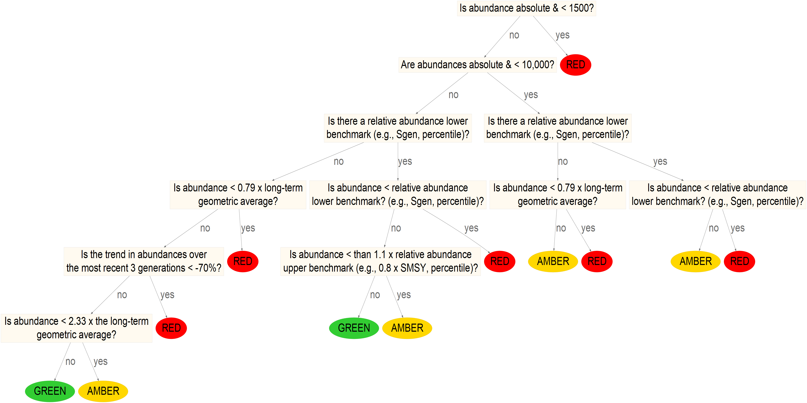

---
output:
  pdf_document: default
  html_document: default
---
# LRP ESTIMATION METHODS

In this section, we provide an overview of methods used to develop LRPs for our three case studies. Detailed methods specific to each case study are provided in Sections 3 (Interior Fraser Coho), 4 (WCVI Chinook), and 5 (South Coast Chum, excluding Fraser). 

All LRP estimation methods first require the status of individual CUs with with an SMU to be assessed as being above or below a lower benchmark. The distribution of CU-level status estimates within a CU is then used as a basis for defining an LRP.

Under Canada's Wild Salmon Policy (WSP), the lower benchmark is defined as a level of abundance high enough to ensure there is a substantial buffer between it and any level of abundance that could lead to a CU being considered at risk of extinction.  A variety of methods are available for estimating lower benchmarks depending on species and data availability (citation needed).  A more thorough discussion of available benchmarks, as well as how these relate to WSP Integrated Status Assessments, is provided in the companion working paper *Guidelines for Defining Limit Reference Points for Pacific Salmon Stock Management Units* (Holt et al. in review).


## PROPORTION-BASED LRPS

A proportion-based LRP is simply the proportion of CUs required to be above CU-level lower benchmarks. For example, the LRP could be set at "100% of CUs with abundance > lower benchmark". In this case, the LRP would be breached anytime a single CU dropped below its lower benchmark. Guidance on how to select the required proportion, including when it may be appropriate to consider proportions < 100%, is provided in the companion working paper *Guidelines for Defining Limit Reference Points for Pacific Salmon Stock Management Units* (Holt et al. in review). We consider two types of proportion-based LRPs in our case studies. The first is based on the proportion of CUs with abundance above abundance-based lower benchmarks, while the second is based on the proportion of CUs for which a multidimensional synoptic status assessment indicates that status is in either the amber or green Wild Salmon Policy status zones.         

### Proportion of CUs above abundance-based lower benchmarks

For SMUs in which CU-level abundance relative to abundance-based lower benchmarks is assessed annually, LRPs can be set at the required proportion of CUs with abundance above their abundance-based lower benchmarks. 


### Proportion of CUs with multidimensional status > lower benchmark 

Canada's Policy for Conservation of Wild Pacific Salmon (Wild Salmon Policy, WSP) sets out requirements for the assessment of status of salmon CUs (@canada_canadas_2005). Peer-reviewed, integrated status assessments require large amounts of time and work. The State of the Salmon program (Fisheries and Oceans Canada) is developing a method of assessing the status of CUs more rapidly (@pestal_algorithms_2021, in prep). Using the inputs and outcomes of status assessments for Fraser River sockeye, Interior Fraser coho, and Southern BC Chinook (@dfo_wild_2015, @dfo_integrated_2016, @dfo_2017_2018,  @grant_2017_2020), this method uses Classification and Regression Tree (CART) analyses to create algorithms that approximate the status of the integrated assessments. Essentially, it uses a decision tree to evaluate status based on data type, quality, abundance, and trends to assign a status to CUs (e.g., Figure \@ref(fig:decision-tree)). An expert review of these statuses is an intentional part of the process. When using this method in the case study, we took the outputs of the algorithms at face value and did not confirm using expert opinion. 


```{r decision-tree, fig.cap="Decision tree to assess status of Conservation Units based on the Wild Salmon Policy, under development by State of the Salmon Program", warning=FALSE, echo=FALSE, fig.align="center"}
source("R/make_tree_diagram.R")

```


## AGGREGATE ABUNDANCE-BASED LRPS

Aggregate abundance-based LRPs represent the SMU-level abundance at which there is a sufficiently high probability that a required proportion of CUs will be above their individual benchmarks.  

- To add: we default to requirement of all CUs > benchamrks for case studies, but cases where the proportion may be < 1 are discussed in guidelines paper
 - To add: probability thresholds considered in case studies: 0.50, 0.66, 0.90, 0.99 based on IPCC. We focus on 0.50 for sensitivity analyses, but show sensitivity to other values.
 
We consider two types of aggregate abundance-based LRPs in our case studies: Logistic regression LRPs and Projected LRPs.

### Logistic regression LRPs

*Question: I am suggesting that we call these "Logistic Regression LRPs" instead of "Empirical LRPs". This is because if we end up using simple proportions of CUs > lower benchmarks as a LRP, these will also be empirical. What do others think?  Other ideas??* *\textcolor{cyan}{LW: I like Logistic Regression LRPs, it's intuitive. Another option could be Aggregate LRPs?}*

Logistic regression LRPs are derived from an empirically estimated relationship between CU-level status and aggregate SMU abundance. Using this approach, the LRP represents the aggregate abundance that has historically been associated with a pre-specified probability of a required proportion of CUs being above their lower benchmarks. In all three case studies, we assume that all CUs are required to be above their lower benchmarks (i.e., proportion = 100%). For each year of observed data, CU-level status is quantified as a Bernoulli variable: 1 (success) = all CUs have spawner abundance greater than their lower benchmark, $S_i > LBM_i$, and 0 (failure) = all CUs did not have $S_i > LBM_i$. A logistic regression is then fit to predict the probability that all CUs will have $S_i > LBM_i$ as a function of aggregate spawner abundance to the SMU using the logistic regression equation:

\begin{equation}
  \log(\frac{p}{1-p}) = B_0 + B_1 \sum_{i}^{i=nCUs} S_{i,t}
   (\#eq:logistic)
\end{equation}

where, $p$ is probability, $B_0$ and $B_1$ are estimated logistic regression parameters and $S_{i,t}$ is spawner abundance to CU $i$ in year $t$. Equation \@ref(eq:logistic) is then re-arranged calculate the LRP as the aggregate spawner abundance associated with the pre-specified probability threshold of $p^*$,

\begin{equation}
  LRP = \frac{log(\frac{p^*}{1-p^*}) - B_0}{B_1}
  (\#eq:logisticLRP)
\end{equation}

An example logistic regression fit is shown in Figure x. We show the estimation of LRPs based on this fit for two possible probability thresholds: $p^*$ = 50% and $p^*$ = 90%. LRP estimates for these two thresholds represent the aggregate abundance that is associated with a 50%, or 95%, probability of all CUs having $S_i > LBM_i$. Alternative $p^*$ values are presented in case-study applications below.

We initially considered an alternative approach to logistic regression in which the LRP represents the aggregate abundance that has historically been associated with a pre-specified *proportion* of CUs being above their lower benchmark ($S_i > LBM_i$, where i = a CU). Using this approach, CU-level status was quantified as the number or CUs with $S_i > LBM_i$ for each year of observed data.  A logistic regression was then fit to predict the proportion of CUs with $S_i > LBM_i$ as a function of aggregate spawner abundance to the SMU (i.e., abundance from nCUs combined). We do not show present this method for our case studies however due to inherent limitations when the required proportion of CUs above their lower benchmarks is 100%. Equation \@ref(eq:logisticLRP) cannot be solved directly for a threshold proportion of $p^*$ = 100%, and LRP estimates were highly sensitive to the choice of $p^*$ value used as a proxy. Using $p^*$ = 99% vs. $p^*$ = 99.9% vs. $p^*$ = 99.99% gave very different LRP estimates. 


#### LOGISTIC REGRESSION MODEL DIAGNOSTICS

There are several assumptions associated with logistic regression, of which four are relevant for our application to LRPs, listed below. Model diagnostics were applied to evaluate the extent to which those assumptions were met, as well as statistical significance of model coefficients, goodness-of-fit, and classification accuracy of LRPs developed from the logistic regression. All analyses were implemented using R v.4.0.4 unless otherwise specified [@r_core_team_r_2021].

1. The relationship between aggregate abundance and log-odds (the logarithm of the odds of all CUs being above their lower benchmark) is linear.

2. The observations are independent of each other (i.e., residuals are not autocorrelated).

3. There are no influential outliers. 

4. The sample size is large. Logistic regression assumes that the sample size of the data set is large enough to draw valid conclusions from the fitted model.


##### Evaluating assumption of linearity (Assumption 1)

A Box-Tidwell test was used to evaluate linearity by assessing the significance of an additional interaction term in the logistic regression, 

\begin{equation}
  \log(\frac{p}{1-p}) = B_0 + B_1 \sum_{i}^{i=nCUs} S_{i,t} + B_2 \sum_{i}^{i=nCUs} S_{i,t} \times \log (\sum_{i}^{i=nCUs} S_{i,t})
   (\#eq:BoxTidwelllogistic)
\end{equation}

A significant interaction term $B_2$, indicates a non-linear relationship between aggregate abundance and log-odds, violating this assumption [@fox_applied_2016].

##### Evaluating independence (Assumption 2)


Deviance residuals, $d$, were estimated for each year,

\begin{equation}
   d = \pm \sqrt { -2 ( y \log(\frac{\mu}{y}) + (1-y)\log(\frac{1-\mu}{1-y}) ) }
   (\#eq:DevianceResid)
\end{equation}

where $\mu$ is the predicted probability of all CUs being above their lower benchmark and $y$ is the observation (1 or 0, indicating all CUs above or not, respectively), in a given year [@fox_applied_2016]. Equation \@ref(eq:DevianceResid) reduces to,

\begin{equation}
   d =  - \sqrt { -2 \log(1-\mu) }
   (\#eq:DevianceResidy0)
\end{equation}

when $y=0$, and to,

\begin{equation}
   d =  \sqrt { -2 \log(\mu)  }
   (\#eq:DevianceResidy1)
\end{equation}

when $y=1$ [@ahmad_diagnostic_2011].


The magnitude of lag-1 autocorrelation was then estimated among deviance residuals and evaluated for statistical significance. 

##### Evaluating outliers (Assumption 3)

As a general rule of thumb, deviance residuals greater than 2 are considered to be to be outliers, since 95% of the distribution is expected to be within 2 standard deviations of the mean. Further identifying influential outliers is recommended, but was not feasible for this application because TMB, the software used to estimate model parameters, does not provide the hat-matrix required to assess influence of individual points.

##### Evaluating sample size (Assumption 4)

A minimum of 10 data points for the least frequent outcome is recommended to avoid biases in model coefficients [@peduzzi_simulation_1996]. For example, if the frequency of outcomes were 0.5 and 0.5 (for 0 and 1, respectively), then a sample size of at least 10/0.5 = 20 would be sufficient, and this minimum sample size would be higher if the data were skewed, e.g., if frequency of outcomes were 0.7 and 0.3, the minimum sample size would be 10/0.3 = 33. Although it is possible to estimate LRPs with lower sample sizes, the risks of biases in model parameters increases.

##### Statistical significance of model coefficients

Statistical significance of coefficients was evaluated using the Wald test statistic, calculated from the ratio of the model coefficient to the standard error of that coefficient, which is assumed to be normally distributed. Test statistics and significance were estimated within TMB [@kristensen_tmb_2016]. <!-- Not needed: P-values <0.05 indicate that the null hypothesis of the coefficient being equalt to 0 is rejected [@fox_applied_2016].-->

##### Goodness-of-fit

The goodness-of-fit was evaluated by comparing the ratio of residual deviance to null deviance (similar to a likelihood ratio). This ratio is assumed to follow a Chi-square distribution with 1 degree of freedom, the difference in the number of parameters between full and null models. P-values <0.05 indicate significant lack of fit [@fox_applied_2016].

In addition, the quasi-$R^2$ was calculated to indicate the ratio of the model fit to the null model without an independent variable, 

\begin{equation}
   quasi-R^2 =  1- \frac{\sum_{t}^{t=nYears} d} {\sum_{t}^{t=nYears} d_0} 
   (\#eq:quasiR2)
\end{equation}

where $d_0$ are the deviance residuals for the null model. The quasi-$R^2$ is a measure of the strength of the relationship between aggregate abundances and probability of all CUs being above their lower benchmarks, but unlike $R^2$ values for linear models, it does not represent the percentage of variance explained by the model and is not related to the correlation coefficient.

##### Classification accuracy of LRPs

Classification accuracy was evaluated based on the ratio of successful classifications to total number of data points in the logistic regression, also called the hit ratio. Successful classifications were the number of years when the model successfully predicted that all CUs were above their lower benchmark plus the number years when the model successfully predicted that at least one CU was below its lower benchmark.  The hit ratio tends to be biased towards unrealistically good classification rates when computed with the same sample used for fitting the logistic model. Therefore, we also considered an out-of-sample approach to classification accuracy, where the logistic regression was estimated iteratively removing a single data point and the occurrence of successes relative to observations were based on the model that did not contain that data point. 


### PROJECTION-BASED LRPS

Projected LRPs are estimated using stochastic projections of future stock size for individual CUs. Projected abundances are then used to characterize the implicit relationship between aggregate spawner abundance for the SMU and the probability that the required proportion of CUs will be above their individual lower abundance benchmarks (e.g. Sgen). 

* To add: dependent on ER

We used the samSim modelling tool to conduct stochastic projections for our case study applications. samSim is an R package that was developed to quantify recovery potential for Pacific salmon populations (Holt et al. 2020; Freshwater et al. 2020). The code for samSim is available on GitHub: https://github.com/Pacific-salmon-assess/samSim.  We created a modified version of samSim to support LRP estimation, which is also available on GitHub: https://github.com/Pacific-salmon-assess/samSim/tree/LRP  

Updated functionality for the LRP version of samSim include:

* The option to sample stock recruitment parameter sets directly from an estimated Bayesian joint posterior distribution.
* The addition of a stock recruitment function that includes an environmental co-variate, as well as specification of future variability in the environmental co-variate (required for Interior Fraser Coho case study; see Section x.x for equations).
* The option to initialize population dynamics for individual CUs at unfished equilibrium when no historical recruitment data are available. While this option would not be appropriate for projections aimed at estimating recovery from a current state, it can be used to estimate projection-based LRPs because we are only interested in the underlying relationship between aggregate abundance and the probability individual CUs will be above their lower benchmark.
* The option to include a log-normal bias-correction factor of $-\sigma^2 / 2$ to recruitment projected using one of the two available Ricker stock recruit models. This option was added to accommodate cases in which samSim is parameterized using stock recruitment parameters that have been corrected for log-normal bias to represent expected (mean) parameters. The log-nomral bias correction is commonly applied in stock recruit modelling because the expected value of *e*^$\sigma$ is *e*^$\sigma^2 / 2$} rather than zero when recruitment deviations are normally distributed (Cox et al. 2011, 2019a, 2019b; Grandin and Forrest 2017; Ohlberger et al. 2019; Olmos et al. 2019; Forrest et al. 2020, Weir et al., in press). When input parameters have been corrected for this log-normal bias, the bias correction must also be added to projections.
* Specification of variability in exploitation rates as a function of both variability among years and variability among CUs, such that:

\begin{equation}
  ER_{i,t} \sim \text{Beta}(c1_{i,t}, c2_{i,t})
  (\#eq:ER1)
\end{equation}

where, $ER_{i,t}$ is the exploitation rate applied to CU $i$ in year $t$ and $c1_{i,t}$ and $c2_{i,t}$ are shape parameters for the beta distribution that correspond with a mean CU-specific exploitation rate of $ER_{\bar{i}}$ and a standard deviation of $\sigma_{ER_{year}}$.  For each CU $i$, $ER_{\bar{i}}$ is drawn from a beta distribution with shape parameters $c3_{i}$ and $c4_{i}$ that correspond to a mean exploitation rate of $\mu_{ER_{i}}$ and a standard deviation of $\sigma_{ER_{amongCU}}$.  

\begin{equation}
 /ER_{\bar{i}} \sim \text{Beta}(c3_{i}, c4_{i})
(\#eq:ER2)
\end{equation}


For our two case study applications of samSim (Interior Fraser Coho and WCVI Chinook), we incorporated uncertainty into projected CU dynamics through the specification of empirically-derived probability distributions for key biological and management parameters, including stock-recruitment parameters, age-at-maturity, and exploitation rates.

Larger structural uncertainties in model formulation were represented through the use of sensitivity analyses and / or alternative operating models (OMs).    

with each OM intended to represent a plausible hypothesis about future stock dynamics. The selection of relevant OMs to be considered varied among case studies based on available data and knowledge.  

Multiple sets of projections were undertaken for each OM; each with a different fixed exploitation rate strategy applied (including a no fishing strategy). This approach provided good contrast in projected dynamics over all scenarios ....   

Observation error was not incorporated into forward projections because we ......


stochastic projections  under a range of levels of exploitation to establish an underlyning relationship between aggregate SMU-level a   


Original outline:
 
-	Description of projected LRP approach. This approach is described in more detail in the Working Paper, “Guidelines for Defining Limit Reference Points for Pacific Salmon Stock Management Units”

-	Reference to previously published samSim reports / papers, as well as GitHub repo with updated code

-	Develop LRPs from projections at specific proportions instead of logistic regression

-	Note that all abundance-based WSP benchmarks can all be used as a basis for defining prospective LRPs


