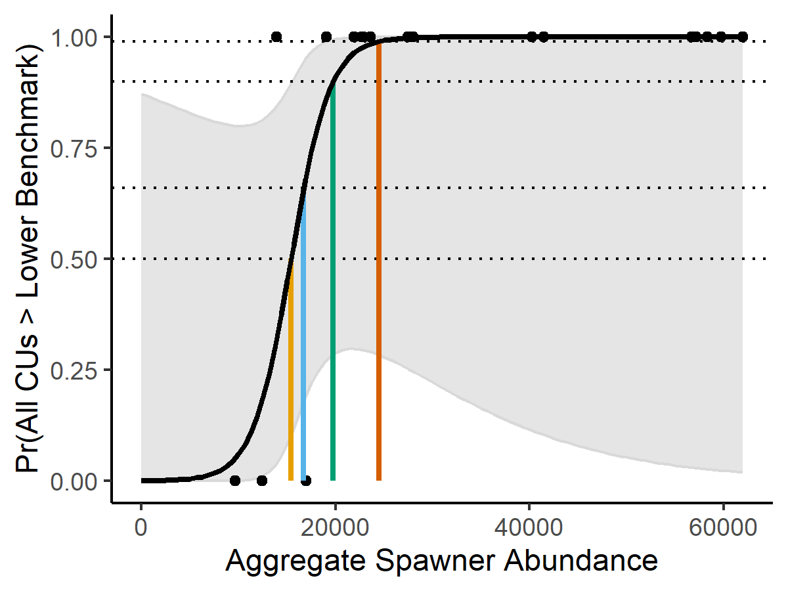

---
output:
  pdf_document: default
  html_document: default
---
# LRP ESTIMATION METHODS{#MethodsChapter}

In this section, we provide an overview of methods used to develop LRPs for our three case studies. Detailed methods specific to each case study are provided in Sections \@ref(IFCChapter) (Interior Fraser Coho), \@ref(WCVIchinookChapter) (West Coast Vancouver Island Chinook), and \@ref(ISCchumChapter) (Inside South Coast Chum, excluding Fraser). Links to GitHub repositories with the data and analysis code used for all three case studies are in Appendix \@ref(app:github-appendix). An overview of the approaches applied to each of the three case studies are provided in Table \@ref(tab:lrpapproaches).

&nbsp;
&nbsp;

\renewcommand*{\arraystretch}{1.4}
\begin{table}[!htbp]
\setlength\heavyrulewidth{0.25ex}
\centering
\footnotesize   
\caption{Overview of CU assessment methods applied for each case study (a) and approaches used to estimate LRPs (b) }
\begin{tabular}{p{3.2cm} p{3.2cm} p{2.4cm} p{2.4cm} p{2.4cm}}
\multicolumn{5}{l}{(a) CU-level assessments }\\
\toprule
\multicolumn{2}{l}{} & Interior Fraser River Coho & WCVI Chinook & Inside South Coast Chum \\
\toprule
\multicolumn{2}{l}{\parbox{5.8cm}{Multidimensional approach used in the Salmon Scanner}}& Yes (only for proportional LRPs) &   Yes (only for proportional LRPs)  &  Yes (only for proportional LRPs)\\
\midrule
\multirow{3}{*}{\parbox{3.2cm}{Single metric approaches: spawner abundances relative to benchmark}} & Spawner-recruitment benchmark & Yes & - & Attempted, estimates unreliable\\
\cline{2-5}
& Habitat-based benchmark & - & Yes & -\\
\cline{2-5}
& Percentile benchmark & - & - & Yes\\
\cline{1-5}
\multicolumn{2}{l}{Single metric approaches: distribution} & Yes & - & - \\
\bottomrule
\multicolumn{5}{l}{ }\\
\multicolumn{5}{l}{(b) LRPs }\\
\toprule
\multicolumn{2}{l}{} & Interior Fraser River Coho & WCVI Chinook & Inside South Coast Chum \\
\toprule
\multicolumn{2}{l}{Proportional LRP} &  Yes &   Yes &   Yes\\
\midrule
\multirow{2}{*}{\parbox{3.2cm}{Aggregate abundance LRPs}} & Logistic regression LRP & Yes & Attempted, data insufficient &  Attempted, estimates unreliable \\ 
\cline{2-5}
 & Projection LRP & Yes  & Yes &  - \\
\bottomrule
\end{tabular}
(\#tab:lrpapproaches)
\end{table}

&nbsp;
&nbsp;
&nbsp;

<!-- instead of \bottomrule at end of table (a)
\hline
-->

## OVERVIEW

We consider two types of LRPs based on two different metrics:

1) Proportional LRPs use a proportion as the metric upon which LRPs are based. Specifically, they use the proportion of CUs within an SMU that are above the Red WSP status zone. We assume that in order for an SMU to remain above its proportional LRP, 100% of CUs must have status estimates above Red (i.e., either Amber or Green).

2) Aggregate abundance LRPs use the total SMU-level spawning abundance as the metric upon which LRPs are based. Two methods of developing aggregate abundance LRPs are applied: (i) Logistic Regression LRPs and (ii) Projection LRPs.

We propose that proportional LRPs are more appropriate for Pacific salmon SMUs because they more directly align with DFO's WSP objectives of maintaining salmon biodiversity; however, aggregate abundance LRP methods may be added to meet specific fisheries management requirements. 


We implement proportional LRPs using approaches developed to assess CU status under DFO's WSP [@dfoCanadaPolicyConservation2005; @holtIndicatorsStatusBenchmarks2009] and implemented for a subset of priority CUs [@dfoWildSalmonPolicy2015; @dfoIntegratedBiologicalStatus2016; @grant2017FraserSockeye2020]. These approaches use multiple metrics to evaluate status including trends in abundance and abundance metrics, and an expert-driven integration approach to combine statuses across metrics into a single status for each CU. In our case study applications, we apply the recently developed Pacific Salmon Status Scanner tool (also referred to as the 'Salmon Scanner'; Pestal et al., in prep^[Pestal, G., MacDonald, B, Grant, S, and Holt, C., in prep. Rapid Status Approximations from Integrated Expert Assessments Under Canada’s Wild Salmon Policy. Can. Tech. Rep. Fish. Aquat. Sci.]) as a way to rapidly approximate more detailed WSP status assessments. The Salmon Scanner allows us to rapidly generate up-to-date estimates of integrated CU status for all of our case study applications, and is recommended as an approach for defining LRPs in our companion working paper (Holt et al., in review).


When developing candidate aggregate abundance LRPs, we aim to maintain consistency with the WSP by defining LRPs as aggregate abundance levels that have a high probability of all CUs being above their Red status zone. For these LRPs, estimates of CU status are approximated based on a comparison of spawning abundance to a single lower benchmark for each CU. Exceptions are described in the application to case studies.


We also maintain consistency with the WSP by only including spawning streams without significant enhancement when evaluating CU and SMU status. We use the Proportionate Natural Influence metric, PNI,as a basis for defining 'significant enhancement'. PNI is a metric designed to estimate the relative strength of the hatchery and natural selective pressures resulting from gene flow between the two environments, and is used as a basis for determining genetic risk of hatcheries on natural populations. Values less than 0.5 indicate populations where most fish are hatchery origin [classified as integrated-hatchery populations; @withlerGeneticallyBasedTargets2018]. We defined 'significantly enhanced' populations as those with PNI values $<$ 0.5 and excluded them from case study analyses. 


Systems with levels of PNI $\geqslant$ 0.5 can still have hatchery influences; however, dynamics are predominately natural origin. Where time-series of the proportion of hatchery marked fish on the spawning grounds are available (e.g., Interior Fraser Coho case study), these proportions are used to inform assessments in two ways: first to develop time-series of natural-origin recruitment for benchmark estimation based on stock-recruitment relationships and second to develop time series of natural-origin spawners for status assessment against benchmarks.  When reliable time-series of the proportion of hatchery influence are not available (WCVI Chinook), total spawners are used for LRP analyses provided that the threshold of assumed PNI $\geqslant$ 0.5 has been met.     


More detailed descriptions of LRP estimation methods are provided in the following sections, while guidance on when and how proportional and aggregate abundance LRPs should be applied is provided in Holt et al. (in review). We recommend that users consult Holt et al. (in review) before applying any of the methods described in this case study paper.


## PROPORTIONAL LRPS

A proportional LRP was set as 100% of CUs above their red Red status zone. The LRP therefore acts as a trigger that is breached when one or more CUs in an SMU is assessed as having Red status. Rationale for this choice of 100% of CUs required to be above Red status is described in Holt et al. (in review).


We compare three different methods of assessing CU status when using proportional LRPs: (i) the proportion of CUs with a recent WSP status assessment above the Red zone (e.g., @grant2017FraserSockeye2020), (ii) the proportion of CUs with a recent Salmon Scanner status assessment above Red (see below for more details), and (iii) the proportion of CUs with status estimated to be below a single CU lower benchmark (e.g., S~gen~, percentile-based benchmarks, etc.). We recommend methods (i) and (ii) for CU assessments, and provide method (iii) for comparison purposes.


When assessing CU status relative to a single abundance-based lower benchmark in approach (iii), we compare generational mean spawner abundances to the benchmark, as described in Holt et al. (In review). <!--CH 1 Feb: this is repeated in the Guidelines paper. Can we omit here? (though I think this text explains it a bit better than my explanation in the other WP. I'll revised the Guidelines paper with this text if okay with you?): "The use of generational means is consistent with the approach taken for abundance-based benchmarks in WSP assessments and the Salmon Scanner tool (approaches i and ii). A generational mean integrates status over cohorts within a generation, which are generally independent of each other because of the anadromous, semelparous life-history of Pacific salmon and the dominance of a single age-at-maturity for many stocks [@holtIndicatorsStatusBenchmarks2009; @porsztReliabilityIndicatorsDecline2012]. As a result, generational smoothing reduces noise in annual CU status determination arising from both interannual variability in CU abundances from different cohorts and annual observation error in estimated spawner abundances."

Alternatively, we could omit there and keep here? I feel like it's important enough to highlight in the Guidelines though.

KH response: I'm fine with only including this in the guidelines paper.

-->


### MULTIDIMENSIONAL APPROACH TO CU STATUS ASSESSMENTS WITHIN THE PACIFIC SALMON STATUS SCANNER {#rapidToolMethods}

The Pacific Salmon Status Scanner (the Salmon Scanner) estimates statuses for individual WSP metrics and also integrates the statuses on multiple metrics into a single status estimate (e.g., Red, Amber, Green; Pestal et al., in prep).  By automating this process, the Salmon Scanner supports implementation of Canada's WSP by rapidly approximating the more detailed, comprehensive WSP status assessment process. The Salmon Scanner’s approach can be implemented annually and for a broader range of CUs, given it is less time and labour intensive that full WSP status assessments. The Salmon Scanner was developed using Classification and Regression Tree (CART) analyses, and expert judgement gained from integrated status assessment processes, to create algorithms that approximate the integrated status assessment results. 

Data inputs and outcomes from previous WSP assessment processes were used in the Salmon Scanners analyses: Fraser River Sockeye, Interior Fraser Coho, and Southern BC Chinook [@dfoWildSalmonPolicy2015; @dfoIntegratedBiologicalStatus2016; @dfo2017FraserSockeye2018;  @grant2017FraserSockeye2020]. Briefly, the Salmon Scanner uses a decision tree to estimate CU status based on data type, quality, abundance, and trends (e.g., Figure \@ref(fig:decision-tree)). The decision tree algorithm was verified with data and local expertise (Pestal et al. in prep). As with other methods, an expert review of rapid status results for each CU is intended to be incorporated into the application of this tool (S. Grant, pers. comm.). When using this method in the case study, we took the outputs of the algorithms at face value and did not confirm them based on expert opinion. In practice, results from the Salmon Scanner will be validated against local expertise when implemented annually (S. Grant, pers. comm.). 

<!-- 
LW: Do we want to say anything about how the decision tree we used could also be updated? 
LW: Do we want to say anything about whether local experts could add nodes to the decision tree, e.g., for spatial distribution, impacts to wildlife, etc. as identified as imoprtant for CU status at the local level?)

Luke and Carrie - if either of you has access to the full Pestal et al. report that describe either of the above aspects, please feel free to add them in. Or, if you have a pers. comm. from Sue on this.  I am hesitant to add it myself as I don't know that I've talked to Sue about this. It seems logical, and is likely what they have planned, but I'm not sure enough to add text myself.  These may be details that come later on when Sue puts the Salmon Scanner through CSAS this year???? 

CH: I think we need to leave these Q for Sue and review of the Scanner, for now.

-->

For absolute or relative abundance metrics, the Salmon Scanner uses the most recent generational mean spawner abundance (calculated as a running geometric mean) to compare to benchmarks, including absolute abundance thresholds (e.g., 1500 spawners), abundance-based lower benchmarks (e.g., S~gen~ or percentile), and abundance-based upper benchmarks (e.g., 0.8S~MSY~ or percentiles). Generational mean spawner abundances as also used when calculating trends in spawner abundances over time (Pestal et al., in prep.)


\newpage
\begin{landscape}
```{r decision-tree, fig.cap="Decision tree (also referred to as the multidimensional algorithm) used in the Pacific Salmon Status Scanner to assess status of Conservation Units based on multiple metrics under the Wild Salmon Policy (Pestal et al. in prep.)", warning=FALSE, echo=FALSE, fig.align="center",out.width = "100%" }
source("R/make_tree_diagram.R")
knitr::include_graphics("figure/decision_tree.png")
```
\end{landscape}


## AGGREGATE ABUNDANCE LRPS{#aggAbundMethods}

Aggregate abundance LRPs are based on the assumption that there is a predictable relationship between SMU-level abundance and the probability that all CUs will be above Red status. When estimating aggregate abundance LRPs, status relative to a single lower benchmark (LBM) is used a proxy for status above the Red zone. Aggregate abundance LRPs are then estimated by using the predicted relationship to find the SMU-level abundance at which there is a prescribed probability that 100% of CUs (the same proportion that was used for proportional LRPs) will be above the LBM. 


The above definition of aggregate abundance LRPs requires a decision to be made about the required probability that 100% of CUs will be above their LBMs. We consider four alternative probability levels for our case studies that represent a range of calibrated probability categories developed by the Intergovernmental Panel on Climate Change [@frameGuidanceNoteLead2010]: 50%, 66%, 90%, and 99%. The 50% value represents the mid-point of the "About as likely as not" category (33 - 66%), indicating that there is an equal probability that all CUs will be above their LBMs as there is that they will not. The 66% values represents the lower end of the "Likely" category (i.e., it is "Likely" that all CUs will be above their LBMs), the 90% value represents the lower end of the "Very Likely" category, and the 99% value represents the "Virtually Certain" category. A discussion of considerations for selecting the appropriate probability threshold when calculating abundance LRPs is included in (Holt et al. in review).
 
 
We consider two types of aggregate abundance LRPs in our case studies: logistic regression LRPs and projection LRPs. These two methods differ in the approach taken to estimate the underlying relationship between SMU-level aggregate abundance and the probability that all CUs will be above their LBMs. Logistic regression LRPs are estimated by fitting statistical models to historical data to estimate this relationship. In this case, LRPs are based on previously observed covariation in CU status, and thus implicitly assume the past is a reasonable approximation of the future. In comparison, projection LRPs use historical data as a basis for quantifying population dynamics, and then project population dynamics using stochastic simulations to identify an equilibrium state. Simulation outputs are then used to characterize the underlying relationship between aggregate abundance and the probability that all CUs will be above their LBMs. 


The projection LRP approach allows uncertainty in current (or future) processes that might affect estimation of the LRP to be accounted for through alternative scenarios. For example, if there is evidence of recent changes in covariation among CUs, possibly due to a subset of CUs experiencing reduced productivity, this hypothesis can be modelled in projections. In comparison, logistic regression LRPs are limited to using historically observed data, which may not include enough observations of the new and emerging covaration structure. 


For both logistic regression and projection LRPs, we characterize annual CU status using a single metric, spawner abundances relative to a LBM, instead of using the status from the multidimensional algorithm within the Salmon Scanner tool. While in theory, estimates of CU status from the multidimensional approach could be used for logistic regression LRPs, we found little evidence of a statistical relationship between CU statuses from the Scanner and aggregate spawner abundances for the one case study where we considered this approach, Interior Fraser Coho. We provide further discussion of this result within the Interior Fraser Coho case study section of this paper. In addition, projection LRPs are derived from equilibrium conditions identified from projections that do not incorporate temporal dynamics required for assessment of trends in the multidimensional approach. While estimates of CU status relative to a single LBM such as S~gen~ is a readily available output from the Salmon Scanner tool, we calculated these metrics external to the tool for our case studies.


When assessing CU status for the purpose of estimating aggregate abundance LRPs, we used unsmoothed annual spawner abundances instead of generational averages. This approach was based on preliminary analyses of the logistic regression method that showed using unsmoothed spawner abundances improved the spread in the data used to establish a relationship between CU status and aggregate spawning abundance. Furthermore, using generational means in the logistic regression approach led to considerable autocorrelation in the aggregate abundance time series, violating assumptions of the logistic regression.


However, when assessing SMU status, we used generational running averages (geometric average) of aggregate spawner abundances. This approach reduced variability in annual decisions about whether an LRP had been breached arising from variability in cohorts within a generation.  The decision to use generational averages of aggregate spawner abundances when determining whether an LRP is breached is consistent with the approach used for proportional LRPs. In both cases, the underlying metric being used to determine SMU status (either aggregate abundance or CU-level status of component CUs for the proportional approach) is based on generational-averaged values in order to reduce annual variability in status.


### Logistic regression LRPs{#logisticMethods}  


Logistic regression LRPs are derived from an empirically estimated relationship between CU-level status and aggregate SMU abundance. Using this approach, the LRP represents the aggregate abundance level that has historically been associated with a given probability of 100% of CUs having status above a selected LBM. For each year of observed data, CU-level status is quantified as a Bernoulli variable: 1 (success) = all CUs have estimated status greater than their LBM and 0 (failure) = all CUs do not have status > LBM. A logistic regression is then fit to these outcomes to predict the probability that all CUs will have status > LBM as a function of aggregate SMU spawner abundance using the logistic regression equation:

\begin{equation}
  \log(\frac{p}{1-p}) = B_0 + B_1 \sum_{i}^{i=nCUs} S_{i,t}
   (\#eq:logistic)
\end{equation}

where, $p$ is probability, $B_0$ and $B_1$ are estimated logistic regression parameters and $S_{i,t}$ is spawner abundance to CU $i$ in year $t$. Equation \@ref(eq:logistic) is then re-arranged to calculate the LRP as the aggregate spawner abundance associated with the pre-specified probability threshold of $p^*$,

\begin{equation}
  LRP = \frac{log(\frac{p^*}{1-p^*}) - B_0}{B_1}
  (\#eq:logisticLRP)
\end{equation}

An example logistic regression fit is shown in Figure \@ref(fig:example-logisticFit). We show the estimation of LRPs based on this fit for four possible probability thresholds: $p^*$ = 0.5, 0.66, 0.90, and 0.99. For each $p^*$ level, LRP estimates represent the aggregate abundance that is associated with that probability of all CUs having status greater than their LBM. LRPs were calculated from parameters of the logistic regression model (Eqn. \@ref(eq:logisticLRP)), with uncertainty in the LRP quantified based on a 95% confidence interval on the maximum likelihood estimate, MLE.  


```{r example-logisticFit, fig.cap="Logistic regression fit to annual Bernoulli data to predict the probability of all CUs being above their lower benchmark (LBM) as a function of aggregate SMU abundance. Each black dot represent a year in the observed time series as a Bernoulli indicator showing whether the requirement of all CUs above their LBM was met (success = 1) or not (failure = 0) as a function of aggregate spawning abundance to the SMU. The black solid line is the maximum likelihood model fit to indicator data, and the grey shaded region shows the 95\\% confidence interval around the fit model. Coloured lines illustrate aggregate abundance LRPs for 4 different probability thresholds: p* = 0.5 (yellow), 0.66 (blue), 0.90 (green), and 0.99 (orange) probability that all CUs > LBM. Horizontal dotted lines intersect the y-axis at each probability threshold, while the solid vertical lines show the corresponding aggregate escapement that will represent the LRP.", out.width = '60%', warning=FALSE, echo=FALSE, fig.align="center"}

```
&nbsp;

We initially considered an alternative approach to logistic regression in which the LRP represents the aggregate abundance that has historically been associated with a pre-specified proportion of CUs being above their lower benchmark. Using this approach, CU-level status was quantified as the number or CUs with status > LBM for each year of observed data.  A logistic regression was then fit to predict the proportion of CUs with status > LBM as a function of aggregate spawner abundance to the SMU (i.e., abundance from nCUs combined). We do not present this method for our case studies, however, due to inherent limitations when the required proportion of CUs above their lower benchmarks is 100%. Equation \@ref(eq:logisticLRP) cannot be solved directly for a threshold proportion of $p^*$ = 100%, and LRP estimates were highly sensitive to the choice of $p^*$ value used as a proxy. Using $p^*$ = 99% vs. $p^*$ = 99.9% vs. $p^*$ = 99.99% gave very different LRP estimates. 

The logistic regression model was implemented in TMB [@kristensenTMBAutomaticDifferentiation2016]. The model was statistically integrated, which means that both the CU-specific lower benchmarks (S~gen~) and the SMU logistic regression parameters were estimated within the same statistical model. The integrated approach allowed for the propagation of uncertainty in parameter estimates from the CU level to the SMU level, resulting in uncertainty intervals that better capture uncertainty in benchmarks as well as the logistic model fit.  


##### Logistic Regression Model Diagnostics  


There are several assumptions associated with logistic regression, three of which are relevant for our application to LRPs and are listed below. Model diagnostics were applied to evaluate the extent to which those assumptions were met, as well as statistical significance of model coefficients, goodness-of-fit, and classification accuracy of LRPs developed from the logistic regression. The three assumptions are as follows:

1. The relationship between aggregate abundance and log-odds (the logarithm of the odds of all CUs being above their lower benchmark) is linear.

2. The observations are independent of each other (i.e., residuals are not autocorrelated).

3. There are no influential outliers. 

\
&nbsp;

**Evaluating assumption of linearity (Assumption 1)**

A Box-Tidwell test was used to evaluate linearity by assessing the significance of an additional interaction term in the logistic regression, 

\begin{equation}
  \log(\frac{p}{1-p}) = B_0 + B_1 \sum_{i}^{i=nCUs} S_{i,t} + B_2 \sum_{i}^{i=nCUs} S_{i,t} \times \log (\sum_{i}^{i=nCUs} S_{i,t})
   (\#eq:BoxTidwelllogistic)
\end{equation}

A significant interaction term $B_2$, indicates a non-linear relationship between aggregate abundance and log-odds, violating this assumption [@foxAppliedRegressionAnalysis2016].

\
&nbsp;

**Evaluating independence (Assumption 2)**

Deviance residuals, $d$, were estimated for each year,

\begin{equation}
   d = \pm \sqrt { -2 ( y \log(\frac{\mu}{y}) + (1-y)\log(\frac{1-\mu}{1-y}) ) }
   (\#eq:DevianceResid)
\end{equation}

where $\mu$ is the predicted probability of all CUs being above their lower benchmark and $y$ is the observation (1 or 0, indicating all CUs above Red or not, respectively), in a given year [@foxAppliedRegressionAnalysis2016]. Equation \@ref(eq:DevianceResid) reduces to [@ahmadDiagnosticResidualOutliers2011]:

\begin{align}
d = 
\begin{cases}
  - \sqrt { -2 \log(1-\mu) } & \text{, if } y = 0 \\
  \sqrt { -2 \log(\mu)  }  &\text{, if } y = 1
\end{cases}
  (\#eq:DevianceResidy)
\end{align}

The magnitude of lag-1 autocorrelation was then estimated among deviance residuals and evaluated for statistical significance. 

\
&nbsp;

**Evaluating outliers (Assumption 3)**

We recommend identifying influential outliers using leverage statistics where possible. For our case studies, we identified outliers independent of their influence because the software used to estimate model parameters (TMB) does not provide the hat-matrix required to assess influence of individual points. Instead, we focused on identifying outliers based on the general rule of thumb that deviance residuals greater than 2 are considered to be outliers because 95\% of the distribution is expected to be within 2 standard deviations of the mean. Further work to identify influential outliers is recommended when other statistical model fitting tools are used. 

\
&nbsp;

**Statistical significance of model coefficients**

Statistical significance of coefficients was evaluated using the Wald test statistic, calculated from the ratio of the $B_1$ model coefficient to the standard error of that coefficient, which is assumed to be normally distributed. Test statistics and significance were estimated within TMB [@kristensenTMBAutomaticDifferentiation2016]. 

\
&nbsp;

**Goodness-of-fit**

The goodness-of-fit was evaluated by comparing the ratio of residual deviance to null deviance, similar to a likelihood ratio. This ratio is assumed to follow a Chi-square distribution with 1 degree of freedom derived from the difference in the number of parameters between full and null models. P-values <0.05 indicate significant lack of fit [@foxAppliedRegressionAnalysis2016].

In addition, the pseudo-$R^2$ was calculated to indicate the ratio of the model fit to the null model without an independent variable [@dobsonIntroductionGeneralizedLinear2018], 

\begin{equation}
   \text{pseudo-}R^2 =  1- \frac{\sum_{t}^{t=nYears} d}{\sum_{t}^{t=nYears} d_0} 
   (\#eq:psuedoR2)
\end{equation}

where $d_0$ are the deviance residuals for the null model. The pseudo-$R^2$ is a measure of the strength of the relationship between aggregate abundances and probability of all CUs being above their lower benchmarks. Unlike $R^2$ values for linear models, the pseudo-$R^2$ does not represent the percentage of variance explained by the model and is not related to the correlation coefficient.

In addition, the length of available time-series will impact the power to detect significant model coefficients. Coefficient estimates may be biased when time-series are short.  @peduzziSimulationStudyNumber1996 recommend a minimum of 10 data points for the least frequent outcome to avoid biases in model coefficients, based on simulation study of epidemiological data. For example, if the frequency of outcomes were 0.5 and 0.5 (for 0 and 1, respectively), then a sample size of at least 10/0.5 = 20 would be sufficient.  This minimum sample size would be higher if the data were skewed, e.g., if frequency of outcomes were 0.7 and 0.3, the minimum sample size would be 10/0.3 = 33. A similar evaluation of sample sizes to minimize biases in logistic regression LRPs for fisheries applications is warranted. Although it is possible to estimate LRPs with lower sample sizes, the risks of biases in model parameters (and LRPs) increases.  We calculate minimum sample sizes for our case studies using the approach of  @peduzziSimulationStudyNumber1996.

\
&nbsp;

**Classification accuracy of LRPs**

Classification accuracy was evaluated based on the ratio of successful classifications to total number of data points in the logistic regression, also called the hit ratio. Successful classifications were the number of years when the model successfully predicted that all CUs were above their lower benchmark plus the number years when the model successfully predicted that at least one CU was below its lower benchmark. The hit ratio tends to be biased towards optimistic classification rates when computed with the same sample used for fitting the logistic model. Therefore, we also considered an out-of-sample approach to classification accuracy, where the logistic regression was estimated iteratively removing a single data point and the occurrence of successes relative to observations were based on the model that did not contain that data point. 

\
&nbsp;

### PROJECTION LRPS{#projectedMethods}

Projection LRPs are estimated using simulated CU abundances to characterize the relationship between aggregate SMU-level spawner abundance and the probability that all CUs will be above their lower benchmarks (e.g., S~gen~). Parameters describing CU-level population dynamics are estimated from available data, and then individual CUs are projected forward under current exploitation rates (with sensitivity analyses used to explore alternative exploitation rates). This approach allows for explicit consideration of uncertainty as the user can specify various projection scenarios to reflect a lack of biological and/or fisheries information.  Natural variability in recruitment and ages-at-maturity are incorporated into projections, as is implementation uncertainty in exploitation rates. As with logistic regression LRPs, we relied on status estimated from a single metric rather than multidimensional status estimates from the Salmon Scanner tool to develop LRPs. 


For our case studies, we ran projections for 30 years after an initialization period to identify aggregate abundances characterized by an equilibrium state represented by stable distribution of projected abundances. We recommend that the initialization and number of years be chosen on an SMU-by-SMU basis to ensure the distribution of trajectories capture equilibrium conditions. These projections should not be interpreted as predictions of future abundance; rather, they are used to simulate the underlying relationship between SMU-level abundance and the probability that all CUs will be above their LBMs. 


We used the samSim closed loop simulation modelling tool to conduct stochastic projections for our case study applications. samSim is an R package that was developed to evaluate fisheries rebuilding plans in simulation for Pacific salmon<!--CH 1 Feb: reworded this last sentence a bit--> [@holtQuantitativeToolEvaluating2020; @freshwaterBenefitsLimitationsIncreasing2020]. We created a modified version of samSim to support LRP estimation. The LRP version of samSim is described in detail in Appendix \@ref(app:samsim-appendix), and model code is available on GitHub (Appendix \@ref(app:github-appendix)).  


Detailed descriptions of the parameterization of samSim for our two case study applications of projection LRPs (Interior Fraser Coho and WCVI Chinook) are presented in Sections \@ref(IFCChapter) and \@ref(WCVIchinookChapter), respectively. In both cases, we incorporated uncertainty into projected CU dynamics through the specification of empirically-derived probability distributions for key biological and management parameters, including stock-recruitment parameters, proportion of recruits at age, and exploitation rates (ER). Larger structural uncertainties in model formulation were represented through the use of sensitivity analyses and/or alternative operating models (OMs). Observation error was not included in projections because derivation of LRPs was based on projected 'true' abundance levels rather than observed abundance. 

The following steps were taken to calculate projection LRPs:

   1. Use samSim to project spawner abundances forward for $nYears$ over $nTrial$ stochastic simulations, under current exploitation.
   

   2. For each simulated year-trial combination, characterize abundances as follows:

      * Assign aggregate SMU level spawner abundance for each year-trial combination to an abundance bin ($AggS_{bin}$), based on intervals of 200 fish . E.g., $AggS_{bin}$ = 0:200 fish, 201:400 fish, 401:600 fish, ... etc. 
      
      * Determine whether all CUs for that year-trial combination were above their CU-level lower benchmarks on abundances. If they were, the year-trial combination is scored as a success (1). If they were not, the year-trial combination is scored as a failure (0).


   3. For each aggregate abundance bin, $AggS_{bin}$:

      * Summarize the realized number of year-trial combinations that fell within that bin. For example, if a projection was run for 30 years with 1000 replicates, there might be 500 year-trial combinations that had an aggregate abundance in 10,000 - 10,200 fish bin.

      * Summarize the number of 'successful' year-trial combinations that occurred for that bin. For example, 125 of 500 year-trial combinations in the aggregate abundance bin of 10,000 - 10,200 fish are successes with all CUs above their lower benchmarks. 

      * Calculate the probability that all CUs will be above their lower benchmarks as the ratio of the number of successes to the number of realizations for each bin:
\begin{equation}
   Pr(All CUs > LBM) = \frac{Number of successes in SAgg_{bin}} {Number of realizations in SAgg_{bin}}
   (\#eq:projBins)
\end{equation}
For example, if 125 of the 500 realizations that fell within the $SAgg_{bin}$ of 10,000 - 10,200 fish were 'successes', there would be a 25% probability (125 / 500 = 0.25) that all CUs would be above their lower benchmarks when aggregate abundances are between 10,000 and 10,200 fish.

   4. Identify the LRP as the mid-point of the aggregate abundance bin, $AggS_{bin}$, that is closest to the desired probability threshold that all CUs are above their LBMs.


An example of the derivation of an LRP from the projected curve of aggregate abundance bins versus the probability of all CUs being > their lower benchmark is shown in Figure \@ref(fig:example-projectedCurve) for the four probability levels used in our case studies (p* = 0.5, 0.66, 0.90, and 0.99).


```{r example-projectedCurve, fig.cap="Example of projected probability curve derived from projections over 30 years and 10,000 MC trials.  The curve shows the projected probability of all CUs being above their lower benchmark (LBM) as a function of aggregate SMU abundance, where aggregate spawning abundance is a bin of 200 fish (e.g., 0-200, 201-400, etc.). Each dot in the curve therefore represents a single 200-fish bin. Coloured lines demonstrate how aggregate abundance LRPs are calculated for 4 different probability thresholds: p* = 0.5 (yellow), 0.66 (blue), 0.90 (green), and 0.99 (orange) for the probability that all CUs are greater than their LBM. Horizontal dotted lines intersect the y-axis at each probability threshold, while the solid vertical lines show the corresponding aggregate escapement that will represent the LRP.", out.width = '60%', warning=FALSE, echo=FALSE, fig.align="center"}

```

&nbsp;

Uncertainty intervals for LRPs are not generated in this method because it does not include statistical estimation and projections integrate uncertainties in all underlying parameters to identify LRPs with specified probabilities of all CUs being above LBM. However, LRP estimates could be presented as a range based on the $SAgg_{bin}$ bin size.
