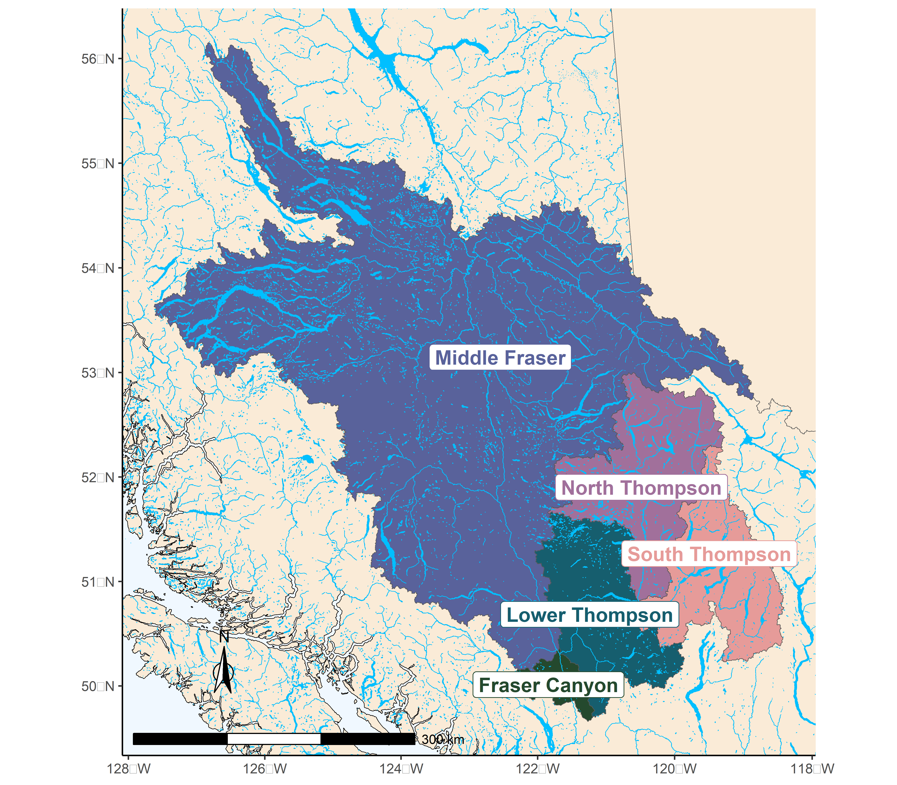
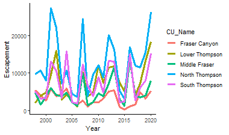
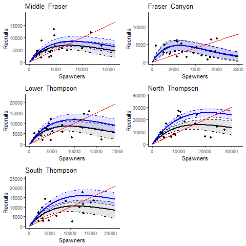
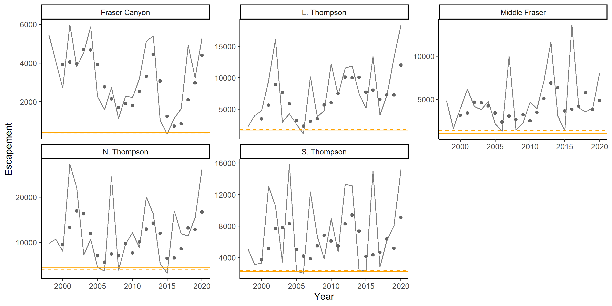
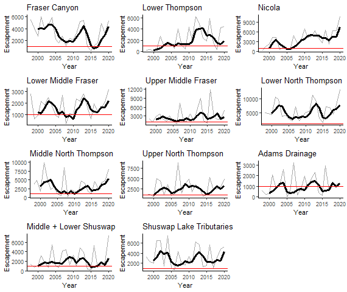

# CASE STUDY 1: INTERIOR FRASER COHO SALMON

## CONTEXT

The Interior Fraser Coho Salmon Stock Management Unit (SMU) includes Coho Salmon that return to the Fraser River and tributaries upstream of Hell’s Gate in the Fraser Canyon. Like most coho salmon, IF Coho spend at least one full year in freshwater as fry before migrating to the ocean as smolts [@arbeider_interior_2020]. During their freshwater fry residence, IF coho are believed to migrate away from spawning sites and into small tributaries and off-channel habitat. Most (88%) IFC have a 3-year life cycle, in which they leave freshwater in their second year and spend 18 months at sea prior to returning to their natal system to spawn.The remaining 12% have a 4-year life cycle in which they spend an additional year in freshwater before migrating as smolts in their third year. Both 3-year and 4-year life cycles spend 18 months at sea. Less than 1% of IF Coho are believed to return as jacks (precocious mature males that spend only 6 months as sea) or at ages older than 4 years [@arbeider_interior_2020].

;; WSP Conservation Units (CUs) have been identified for of Interior Fraser Coho based on genetics and geographic separation: Middle Fraser, Fraser Canyon, Lower Thompson, North Thompson, and South Thompson [@dfo_wild_2015; Figure \@ref(fig:coho-map)]. Previous work by the Interior Fraser Coho Recovery Team also identified 11 subpopulations nested within the five CUs, and developed recovery objectives based on maintaining abundance in each of these smaller subpopulation units [@ifcrt_interior_fraser_coho_recovery_team_conservation_2006; Table \@ref(tab:cohoCU2SP)]. The delineation of subpopulations was based on several factors, including the presence of natural barriers, the influence of large lakes on downstream discharge and thermal regimes, observations of spawner aggregations under differing discharge conditions, and genetic evidence. The 11 subpopulations are described in detail by the @ifcrt_interior_fraser_coho_recovery_team_conservation_2006. The Fraser Canyon CU is the only CU with a single subpopulation; this result is because most of the spawning for the CU occurs within a single river [@arbeider_interior_2020]. 


```{r coho-map, fig.cap="The five Conservation Units that make up the Interior Fraser Coho Stock Management Unit.", out.width = '60%', warning=FALSE, echo=FALSE, fig.align="center"}

```


-------------------------------------------------------
Conservation Unit         Sub-population
------------------------- ------------------------------ 
Middle Fraser             Lower Middle Fraser
                          Upper Middle Fraser
                          
Fraser Canyon             Nahatlatch
  
Lower Thompson            Lower Thompson
                          Nicola
  
North Thompson            Lower North Thompson
                          Middle Thompson
                          Upper North Thompson
  
South Thompson            Adams Drainage
                          Lower and Middle Shuswap Rivers
                          Shuswap Lake Tributaries
------------------------- ---------------------------------
Table: (\#tab:cohoCU2SP) Interior Fraser Coho Conservation Units (CUs) and associated sub-populations. Note that the definition of these sub-populations, including mapped boundaries, are provided in @ifcrt_interior_fraser_coho_recovery_team_conservation_2006.


Declines in IF Coho spawner abundance throughout the 1990’s led to a suite of management actions to promote recovery, including significant fishery restrictions starting in 1998 [@decker_assessment_2014]. Evidence of a new, lower productivity regime starting in return year 1994 has been documented [@decker_assessment_2014] that coincides with declines in spawner abundances.  In 2002, the IF Coho stock management unit was designated endangered by the  Committee on the Status of Endangered Wildlife in Canada (COSWEIC) based on the stock unit being assessed as a single 'Designatable Unit' (DU). Subsequent work by the Interior Fraser Coho Recovery Team lead to a conservation strategy outlining recovery objectives for the management unit (@ifcrt_interior_fraser_coho_recovery_team_conservation_2006). Those recovery objectives were largely based on the distribution of spawning escapement among the 11 subpopulations in Table \@ref(tab:cohoCU2SP). A short-term recovery objective of 20,000 spawners was identified as a level that would maintain a minimum of 1,000 naturally spawning wild Coho Salmon in at least half of the 11 subpopulations, while a long-term recovery target of 40,000 spawners was identified as a level that would maintain 1,000 or more wild Coho Salmon in all 11 subpopulations. In 2014, @decker_assessment_2014 assessed status relative to the 2006 IFCRT objectives, and concluded that IF coho had been above the short-term recovery target of 20,000 spawners in every year since 2008, and above the long-term recovery target of 40,000 spawners in the most recent two return years (2012 and 2013)  

An updated COSEWIC assessment in 2016 upgraded the status designation for the IF Coho DU to 'threatened' [@cosewic_cosewic_2016].  In 2018, DFO undertook a Recovery Potential Assessment (RPA) for Interior Fraser Coho that described status, habitat, threats, limiting factors to recovery, candidate recovery targets, and abundance projections for the DU, as well as recommendations regarding mitigation and allowable harm [@arbeider_interior_2020]. As part of this RPA, the long-term DU recovery target for IF Coho was recommended was a 3-year geometric mean abundance of 35,935 natural-origin spawners. This target was based on the historically observed aggregate abundance that met a distributional goal of 1000 spawners in all subpopulations.

Interior Fraser Coho were also been assessed under the framework of DFO’s Wild Salmon Policy (WSP) in 2014, at which time the Integrated Status Assessment classified three of these CUs as being amber status (Middle Fraser, Fraser Canyon, South Thompson) and the remaining two CUs as amber/green status (Lower Thompson, North Thompson; [@dfo_wild_2015]). 

To Do:  need to work in @korman_evaluation_2019

## DATA

Data for this case study cover return years 1998 -2020. Data prior to 1998 were not used due to concerns about inconsistent assessment methods and data quality. All Interior Fraser Coho data were provided by DFO's Fraser River Stock Assessment Unit (M. Arbeider, pers. comm). These data included: (i) annual spawner abundance by CU (1998-2020; @ref(fig:coho-CU-timeseries-Combined)), (ii) annual recruits-at-age by CU (brood years 1998 - 2016), (iii) a hatchery-based smolt-to-adult survival rate index, (iv) annual exploitation rates, and (v) annual spawner abundances for 11 sub-populations nested within the 5 CUs.


```{r coho-CU-timeseriesCombined, fig.cap="Escapement time series for five Interior Fraser Coho CUs", out.width = '80%', warning=FALSE, echo=FALSE, fig.align="center"}

```


Data were similar to those previously described in @arbeider_interior_2020; data treatments, assumptions, infilling, and data quality are described in detail in that document. More recent updates that are not described in @arbeider_interior_2020 include the incorporation of three additional years of data (return years 2018-2020), updates to the smolt-to-adult marine survival rate index to use a weighted average by release size, and increased data quality screening of scale ages used to calculate recruitment-at-age (M. Arbeider, pers. comm).


-	Still to add: 
  - Caveats: e.g., recruitment estimated using common ER for all CUs; review Arbeider et al. for additional data caveats


## METHODS


### CU Status Estimation

We consider two types of CU benchmark to represent CU status when developing LRPs for Interior Fraser Coho. 

**Sgen**

The first type is the WSP lower benchmark of  $S_{gen}$, where Sgen is the number of spawners required to recover to SMSY (spawners maximum sustainable yield) within one generation, under equilibrium conditions in the absence of fishing [@holt_indicators_2009]. Four different formulations of stock recruitment model are used to estimate Sgen based on previous analyses. Key differences among the formulations centre around whether a hierarchical model structure is used when estimating Sgen and whether an informative prior distribution is applied to the spawner abundance level at which the stock replaced itself (SRep). 

We primarily use the two model formulations that assume no hierarchical structure among CUs (IM and IM.cap) as a basis for comparing among LRP estimation methods, but have retained the two hierarchical model formulations (HM and HM.cap) for sensitivity analyses. Our rationale for focusing on the individual modelling approaches was two-fold.  First, because all CUs had equal amounts of data, the commonly cited benefit of hierarchical models allowing data-poor systems to borrow information from data-rich systems did not apply. Second, initial investigations of the hierarchical models fit to IF coho data showed that LRP estimates were sensitive to the choice of the assumed standard deviation on the hyper-distribution for the productivity parameter. 

<!-- KH comment: # Need to update / finish the above paragraph by (i) reviewing meeting notes to confirm record of decision and (ii) adding references for typically cited benefits of hierarchical models -->


*Model 1: Individual Ricker (IM)*

Using this approach, we assumed that productivity was independent among CUs with a shared covariate for marine survival. The Individual Ricker stock recruit model formulation was:

\begin{equation}
  \hat{R}_{i,a,t} = P_{i,a,t-a}S_{i,t-a}e^{log(\alpha_i) + \gamma log(m_{t-1})-\beta_i S_{i,t-a}e^{v_i}}
   (\#eq:rickerSurv-IM)
\end{equation}
\begin{equation}
  v_i \sim Normal(0,\sigma_{v_i})
\end{equation}

where,

$\hat{R}_{i,a,t}$ = the predicted number of natural origin recruits from CU $i$ of age $a$ returning in year $t$ (i.e., recruits that were produced by escapement in brood year $t-a$)

$P_{i,a,t-a}$ = the proportion of recruitment from CU $i$ returning at age $a$ from brood year $t-a$

$S_{i,t-a}$ = spawners from CU $i$ in brood year $t-a$

$\alpha_i$ = productivity parameter for CU $i$

$\gamma$ = marine survival co-efficient shared among CUs

$m_{t-1}$ = hatchery marine survival index (smolt-to-adult) for sea entry in year t-1

$\beta_i$ = density dependent term describing the rate of decrease in log-survival for CU $i$ with increasing spawner abundance

$\sigma_{v_i}$ = standard deviation of process error on recruitment deviations

This model formulation is similar to the Ricker model used in @arbeider_interior_2020, but without a hierarchical structure imposed on $log(\alpha_i)$. We placed the following non-informative constraints on the likelihood function to replicate the Bayesian model fitting routine of @arbeider_interior_2020:

\begin{equation}
  \gamma \sim Normal(0,10)
\end{equation}
\begin{equation}
  \sigma_{v_i} \sim Inverse Gamma (0.1,0.1)
\end{equation}


*Model 2: Individual Ricker with High $S_Rep$ (IM.HiCap)*

The IM.HiSRep model is similar to model 1 (IM), but used an informative prior distribution to increase carrying capacity.  This version of the Ricker model has been identified as a plausible alternative to the base Ricker model with a survival covariate (Equation 1) in recent science advisory processes for Interior Fraser Coho ([@korman_evaluation_2019], [@arbeider_interior_2020]).  

@korman_evaluation_2019 suggested that the Ricker model with a survival co-variate over-estimated compensatory dynamics at high spawner abundances when applied only to data from 1998 onwards.  They noted that spawner abundances since 1998 have been much lower than historic levels.  Given that sparse data at high spawner abundances makes it difficult to estimate carrying capacity, base Ricker estimates of carrying capacity may be unreliable [@korman_evaluation_2019]. Furthermore, they observed that one brood line had persisted at a relatively higher and more stable spawner abundance than the other two brood lines, which they viewed as evidence for a higher capacity than the base Ricker model estimates. Based on these concerns, @korman_evaluation_2019 proposed an alternative Ricker model that used an informative prior distribution to increase carrying capacity (represented as the spawner abundance at which the stock replaces itself, $S_{REP}$). @arbeider_interior_2020 followed the approach of [@korman_evaluation_2019] by considering both the base Ricker model and a version of the Ricker model with an informative prior distribution on $S_{REP}$ (which they referred to as the Ricker_priorCap model) to be plausible when providing management advice.

To maintain consistency with this previous work on Interior Fraser Coho, we also consider a version of the Ricker model that uses an informative prior distribution on $S_{REP}$ when evaluating LRP options for this SMU.  

\begin{equation}
  \beta_i = \frac{\alpha_i + \gamma + log(\overline{m})}{S_{REP,i}}
   (\#eq:beta-Srep)
\end{equation}
\begin{equation}
  S_{REP,i} \sim Normal(\mu_{SREP},\sigma_{SREP})
\end{equation}

@arbeider_interior_2020 (and Korman???) set $mu_{SREP}$ at 1.5 times the $S_{REP}$ value estimated from the base model fit without a prior on $S_{REP}$. For our integrated Sgen-LRP model fits (described in section xxx), we found that we needed to constrain $mu_{SREP}$ at no more than 1.4 times the $S_{REP}$ value to achieve model convergence, so we used the 1.4 times expansion instead.  We set $\sigma_{SREP}$ at $\sqrt{2} * 1000 = 1414$ spawners, which is the same value used by @arbeider_interior_2020. Note that the "$* 1000$" term is used to correct for scaling spawner abundance by 1/1000 when fitting models. @arbeider_interior_2020 parameterized the distribution in terms of precision ($\tau$), where $\tau = \frac{1}{\sigma^2} = 0.5$. The effect of adding the prior on $S_{REP}$ when fitting individual models to available data is shown in Figure \@ref(fig:coho-SR-fit).    


```{r coho-SR-fit, fig.cap="Stock recruit curves fit to spawner and recruitment data using individual models for each CU. Solid black lines shows the MLE fit for the IM model while solid blue lines shows the MLE fit for the IM.HiCap model.  Associated black and blue shaded regions show the 95 percent confidence intervals on respective model fits. The red line show the replacement line.", warning=FALSE, echo=FALSE, fig.align="center"}

```


*Model 3: Hierarchical Ricker (HM)*

The hierarchical Ricker model (HM) follows recent stock-recruitment analyses for Interior Fraser Coho that assume CU-level productivities are sampled from a common, normal distribution that is shared by all CUs ([@korman_evaluation_2019], [@arbeider_interior_2020]). The formulation of the hierarchical Ricker model is the same as that described above for the individual Ricker model, except we fit it as a mixed-effect model that treated CU-level $\alpha_i$ parameters as random effects:  

\begin{equation}
  log(\alpha_i) \sim Normal(\mu_{\alpha},\sigma_{\alpha})
  (\#eq:alpha-HM-dist)
\end{equation}

where, $\mu_{\alpha}$ is the mean of the normal distribution and $\sigma_{\alpha}$ is the standard deviation. In addition to the likelihood constraints on $\gamma$ and $\sigma_{v_i}$ desribed for the IM, we included the following constraints on $mu_{\alpha}$ and $\sigma_{\alpha}$ to replicate the Bayesian model fitting routine of @arbeider_interior_2020:

\begin{equation}
  log(\mu_{\alpha}) \sim Normal(1,\sqrt{2})
\end{equation}

\begin{equation}
  log(\sigma_{\alpha}) \sim Inverse Gamma (0.1,0.1)
\end{equation}


*Model 4: Hierarchical Ricker with High $S_Rep$ (HM.HiCap)*

The HM.HiCap model is the same as the IM.HiCap model, but with a hierarchical structure assumed for CU-level productivities. As with the HM model (model 3), CU-level productivities are sampled from a common, normal distribution that is shared by all CUs. 


*Calculation of Sgen*

The inclusion of a marine survival co-variate in all four spawner recuit models means that the realized productivity changes from year to year with changing marine survival. We incorporated this adjustment into our calculations of $S_{gen}$ by first calculating the effective productivity for each CU as:

\begin{equation}
  log(\alpha'_{i}) = log(\alpha_i) + \gamma log(\overline{m})
   (\#eq:adjProd)
\end{equation}

where, $\overline{m}$ is the average marine survival rate over the available time series.  

$S_{MSY}$ was calculated as a function of log($\alpha_i'$) and $\beta_i$ using:

\begin{equation}
  S_{MSY,i} = 1 - \frac{W(e^1-\alpha'_i)}{\beta_i} 
   (\#eq:Smsy)
\end{equation}

where, $W$ represents the Lambert W function (Scheurell 2016). $S_{gen}$ was then calculated numerically by solving the following equation: 

\begin{equation}
  S_{MSY} = S_{gen}e^log(\alpha)-\beta_iS_{gen}
  (\#eq:Sgen)
\end{equation}


**Distribution among subpopulations**

The second type of CU benchmark is based on the distribution of spawning escapement among subpopulations nested within CUs (Table \@ref(tab:cohoCU2SP)). We have based this benchmark on the short-term recovery objective identified by the @ifcrt_interior_fraser_coho_recovery_team_conservation_2006, which @arbeider_interior_2020 summarized as: *"the 3-year geometric average, natural-origin escapement in at least half of the subpopulations within each of the five populations is to exceed 1000 spawning Coho Salmon, excluding hatchery fish spawning in the wild"*, where 'populations' is analogous to CUs. We selected the short-term recovery target to represent a lower CU benchmark in our study because, as noted by @arbeider_interior_2020, the short-term target was designed as an immediate target when the population was endangered. As such, it was interpreted as a level expected to prevent extinction or loss of genetic diversity. The “half of sub-populations within each CU” threshold required 2 out of 3 sub-populations to be above 1000 fish for the North Thompson and South Thompson CUs, 1 out of 2 sub-populations to be above 1000 fish for the Lower Thompson and Middle Fraser CUs, and the only sub-population in the Fraser Canyon to be above 1000 fish. This distributional benchmark is specific to the Interior Fraser Coho SMU. We have retained it as part of this case study to maintain consistency with previous work.  


### LRP Estimation: Proportion of CUs > Lower Benchmark


**Methods**

We looked at the proportion of CUs that dropped below Sgen (Figure \@ref(fig:coho-CU-timeseries)) and the proportion of CUs that failed to meet the distributional target of 1000 fish in half of subpopulations \@ref(fig:coho-Subpop-timeseries)) to determine in which years between 1998 and 2020 the LRP would have been breached. Status was assessed as being below the LRP in years in which one or more CUs was below their CU-level benchmark. Estimates of Sgen were based on all data available up to 2020, so our evaluation is not a true retrospective analysis. 


```{r coho-CU-timeseries, fig.cap="Escapement time series for five Interior Fraser Coho CUs shown as annual escapements (lines) and 3-year geometric mean escapements (dots). Solid orange lines show estimates of Sgen from the IM model, while dashed orange lines show estimates of Sgen from the IM.HiCap model.", warning=FALSE, echo=FALSE, fig.align="center"}

```


```{r coho-Subpop-timeseries, fig.cap="Escapement time series for 11 subpopulations of Interior Fraser Coho shown as annual escapements (grey lines) and 3-year geometric mean escapements (thick black line). CUs to which each subpopulation belong to are shown in Table ----", warning=FALSE, echo=FALSE, fig.align="center"}

```


**Results**

For three of the five CUs,estimates of Sgen based on the IM.cap spawner recruit model were higher than those based on the IM model (Middle Fraser, Lower Thompson, and South Thompson CUs; Figure \@ref(fig:coho-CU-timeseries)). The North Thompson CU showed the opposite pattern, with the Sgen estimate from the IM model higher than that from the IM.cap model. The fifth CU, Fraser Canyon, had almost equal estimates for the two approaches with Sgen estimates only differing by 32 fish. 

For all five CUs, the generational (3-year) geometric average escapement between 2001 and 2020 remained above the estimated value of Sgen in 2020 ($Sgen_{2020}$), regardless of which stock recruit model was used to estimate Sgen (Figure \@ref(fig:coho-CU-timeseries)).Because the proportion of CUs above Sgen was always 100%, there were no years in the available time series that were below the proportion-based LRP. 

Only 3 of the 11 sub-populations had their generational average escapement remain above the 1000 spawner threshold in all years (Figure \@ref(fig:coho-Subpop-timeseries)). All other CUs dropped below 1000 spawners in one or more years. 

[--- more results summary to be added here ----]

All 11 subpopulations were above 1000 spawners in 2020, which means that the SMU would be well above the LRP based on the proportional LPR approach applied to the distributional benchmark in 2020 (Figure \@ref(fig:coho-Subpop-timeseries)).


### LRP Estimation: Aggregate Abundance Empirical LRPs 


**Methods**

We evaluated aggregate abundance-based LRPs derived using logistic regressions for both types of Interior Fraser Coho benchmarks: Sgen and the distributional target of 1000 fish in half of sub-populations. See Section \@ref(logisticMethods) for an overview of the approach used to calculate aggregate abundance-based LRPs using logistic regression.

When estimating logistic regression LRPs using Sgen, we used an integrated modelling approach in which CU-level Sgen and the SMU-level LRP were simultaneously estimated. The integrated Sgen-LRP models had two components: 

(i)	Stock-recruit models fit to each of the 5 CUs to estimate CU-level Sgen (Equation \@ref(eq:rickerSurv-IM) and Equations \@ref(eq:adjProd) - \@ref(eq:Sgen))

(ii)	A logistic regression model fit to aggregated data to estimate the LRP as the aggregate abundance that has historically been associated with a specified probability of all CUs being above Sgen (Equations \@ref(eq:logistic) - \@ref(eq:logisticLRP))


***Retrospective Analysis***

We used a retrospective analysis to examine the effect of time series length on aggregate abundance-based LRP estimates when using the logistic regression approach. Retrospective analyses were restricted to the most recent x years (2015-2020) because logistic model fits prior to xxxx were unable to converge on an LRP estimate.  For each year between xxxx and xxxx, we used data only available up to that year to calculate LRPs and associated confidence intervals.


***Effect of Missing CUs***

To examine the effect of missing CUs on LRP estimates, we calculated LRPs using data from only a subset of the five Interior Fraser Coho CUs.  We limited our analysis to missing data from either one or two CUs so that we had at least three CUs of available data when calculating the proportion of CUs above their benchmarks.  For each missing data case, we calculated SMU status as

\begin{equation}
  Status_t = \frac{\sum_{i}^{nCUs} S_{i,t}}{LRP'_t}
   (\#eq:status)
\end{equation}

where $nCUs$ is the number of CUs being used (3 or 4) and $LRP'_t$ is the LRP calculated in year $t$ using only data from $nCUs$.  SMU-level status in a given year was calculated for all possible combinations of CUs available (5 combinations when nCUs = 4 and 10 combinations when nCUs = 3) to allow examination of the stability of status estimates among available combinations. Estimates of SMU status relative to LRPs were used to compare among missing CU scenarios instead of absolute LRP  estimates because  absolute LRP estimates vary with the number (and combination) of CUs used.


**Results**


Figure: Logistic model fit - IM in 2020

Figure: Logistic model fit - IM cap in 2020

Figure: Logistic model fit - distribution

Appendix: Maximum posterior density estimates (± standard error) obtained from fitting the ‘Individual Ricker’ (IM) version of the Integrated Sgen-LRP model to Interior Fraser Coho data.

Appendix: Maximum posterior density estimates (± standard error) obtained from fitting the ‘Individual Ricker with cap’ (IM.cap) version of the Integrated Sgen-LRP model to Interior Fraser Coho data.

Table: Comparison of all logistic LRP estimates in 2020

### LRP Estimation: Aggregate Abundance Projection-Based LRPs


**Methods**


IM model

IM cap model

Model averaging 


**Results**

### Historical Evaluation of Status


### Retrospective Analysis


***Effect of LRP Estimation Method***

***Effect of number of years***

***Effect of number of CUs***