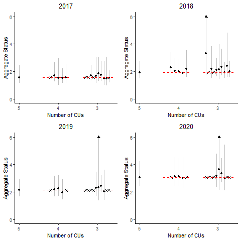
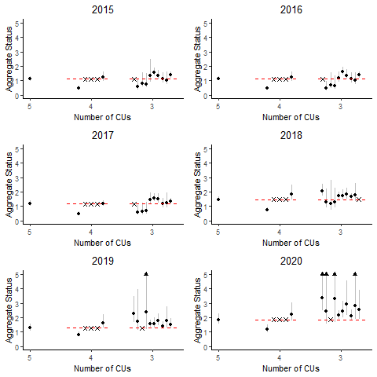
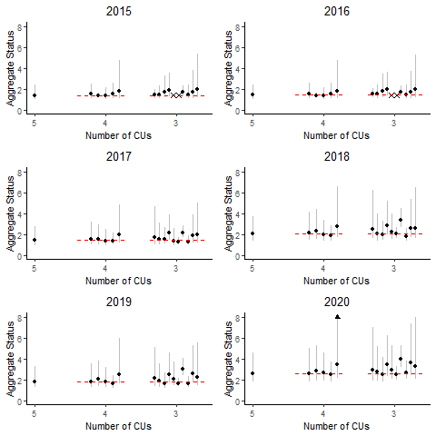

---
output:
  pdf_document: default
  html_document: default
---
# CASE STUDY 1: INTERIOR FRASER COHO SALMON

## CONTEXT
The Interior Fraser Coho Salmon Stock Management Unit (SMU) includes Coho Salmon that return to the Fraser River and tributaries upstream of Hell’s Gate in the Fraser Canyon. Like most coho salmon, IF Coho spend at least one full year in freshwater as fry before migrating to the ocean as smolts [@arbeider_interior_2020]. Most (88%) IFC have a 3-year life cycle, in which they leave freshwater in their second year and spend 18 months at sea prior to returning to their natal system to spawn. The remaining 12% have a 4-year life cycle in which they spend an additional year in freshwater before migrating as smolts in their third year. Both 3-year and 4-year life cycles spend 18 months at sea. Less than 1% of IF Coho are believed to return as jacks (precocious mature males that spend only 6 months as sea) or at ages older than 4 years [@arbeider_interior_2020].

WSP Conservation Units (CUs) have been identified for of Interior Fraser Coho based on genetics and geographic separation: Middle Fraser, Fraser Canyon, Lower Thompson, North Thompson, and South Thompson [@dfo_wild_2015; Figure \@ref(fig:coho-map)]. Previous work by the Interior Fraser Coho Recovery Team identified 11 subpopulations nested within the five CUs, and developed recovery objectives based on maintaining abundance in each of these smaller subpopulation units [@ifcrt_interior_fraser_coho_recovery_team_conservation_2006; Table \@ref(tab:cohoCU2SP)]. The delineation of subpopulations was based on several factors, including the presence of natural barriers, the influence of large lakes on downstream discharge and thermal regimes, observations of spawner aggregations under differing discharge conditions, and genetic evidence. The 11 subpopulations are described in detail by the @ifcrt_interior_fraser_coho_recovery_team_conservation_2006. The Fraser Canyon CU is the only CU with a single subpopulation; this result is because most of the spawning for the CU occurs within a single river [@arbeider_interior_2020]. 

```{r coho-map, fig.cap="The five Conservation Units that make up the Interior Fraser Coho Stock Management Unit.", out.width = '60%', warning=FALSE, echo=FALSE, fig.align="center"}
knitr::include_graphics("figure/coho-map.png")
```


+-------------------+--------------------------------+
| Conservation Unit | Sub-populations        
+===================+================================+
| Middle Fraser     | - Lower Middle Fraser          
|                   | - Upper Middle Fraser
+-------------------+--------------------------------+    
| Fraser Canyon     | - Nahatlatch          
+-------------------+--------------------------------+ 
| Lower Thompson    | - Lower Thompson          
|                   | - Nicola
+-------------------+--------------------------------+
| North Thompson    | - Lower North Thompson      
|                   | - Middle Thompson
|                   | - Upper North Thompson
+-------------------+--------------------------------+
| South Thompson    | - Adams Drainage      
|                   | - Lower and Middle Shuswap Rivers
|                   | - Shuswap Lake Tributaries
+-------------------+--------------------------------+

Table: (\#tab:cohoCU2SP) Interior Fraser Coho Conservation Units (CUs) and associated sub-populations. Note that the definition of these sub-populations, including mapped boundaries, are provided in @ifcrt_interior_fraser_coho_recovery_team_conservation_2006.

Declines in IF Coho spawner abundance throughout the 1990’s led to a suite of management actions to promote recovery, including significant fishery restrictions starting in 1998 [@decker_assessment_2014]. Evidence of a new, lower productivity regime starting in return year 1994 has been documented [@decker_assessment_2014] that coincides with declines in spawner abundances.  In 2002, the IF Coho stock management unit was designated 'endangered; by the  Committee on the Status of Endangered Wildlife in Canada (COSWEIC) based on the stock unit being assessed as a single 'Designatable Unit' (DU). Subsequent work by the Interior Fraser Coho Recovery Team (IFCRT) lead to a conservation strategy outlining recovery objectives for the management unit (@ifcrt_interior_fraser_coho_recovery_team_conservation_2006). Those recovery objectives were largely based on the distribution of spawning escapement among 11 subpopulations(Table \@ref(tab:cohoCU2SP)). The delineation of subpopulations was based on several factors, including the presence of natural barriers, the influence of large lakes on downstream discharge and thermal regimes, observations of spawner aggregations under differing discharge conditions, and genetic evidence. The 11 subpopulations are described in detail by the @ifcrt_interior_fraser_coho_recovery_team_conservation_2006. The IFCRT identified a short-term recovery objective of 20,000 spawners, which represented the level that was expected to maintain a minimum of 1,000 naturally spawning wild Coho Salmon in at least half of the 11 subpopulations.  In addition, the IFCRT identified a long-term recovery target of 40,000 spawners, which represented a level that was expected to maintain 1,000 or more wild Coho Salmon in all 11 subpopulations. In 2014, @decker_assessment_2014 assessed status relative to the 2006 IFCRT objectives, and concluded that IF coho had been above the short-term recovery target of 20,000 spawners in every year since 2008, and above the long-term recovery target of 40,000 spawners in the most recent two return years (2012 and 2013)  

In 2014, Interior Fraser Coho were assessed under the framework of DFO’s Wild Salmon Policy (WSP), at which time the Integrated Status Assessment classified three of these CUs as being amber status (Middle Fraser, Fraser Canyon, South Thompson) and the remaining two CUs as amber/green status (Lower Thompson, North Thompson; [@dfo_wild_2015]). A subsequent COSEWIC assessment in 2016 upgraded the status designation for the IF Coho DU from 'endangered' to 'threatened' [@cosewic_cosewic_2016].  In 2018, DFO undertook a Recovery Potential Assessment (RPA) for Interior Fraser Coho that described status, habitat, threats, limiting factors to recovery, candidate recovery targets, and abundance projections for the DU, as well as recommendations regarding mitigation and allowable harm [@arbeider_interior_2020]. As part of this RPA, the long-term DU recovery target for IF Coho was recommended was a 3-year geometric mean abundance of 35,935 natural-origin spawners. This target was based on the historically observed aggregate abundance that met the long-term IFCRT objective of 1000 spawners in all subpopulations.


To Do:  need to work in @korman_evaluation_2019

## DATA

Data for this case study cover return years 1998 -2020. Data prior to 1998 were not used due to concerns about inconsistent assessment methods and data quality. All Interior Fraser Coho data were provided by DFO's Fraser River Stock Assessment Unit (M. Arbeider, pers. comm). These data included: (i) annual spawner abundance by CU (1998-2020), (ii) annual recruits-at-age by CU (brood years 1998 - 2016), (iii) a hatchery-based smolt-to-adult survival rate index, (iv) annual exploitation rates, and (v) annual spawner abundances for 11 sub-populations nested within the 5 CUs. Data were similar to those previously described in @arbeider_interior_2020; data treatments, assumptions, infilling, and data quality are described in detail in that document. More recent updates that are not described in @arbeider_interior_2020 include the incorporation of three additional years of data (return years 2018-2020), updates to the smolt-to-adult marine survival rate index to use a weighted average by release size, and increased data quality screening of scale ages used to calculate recruitment-at-age (M. Arbeider, pers. comm).


<!--
```{r coho-CU-timeseriesCombined, fig.cap="Escapement time series for five Interior Fraser Coho CUs", out.width = '80%', warning=FALSE, echo=FALSE, fig.align="center"}
knitr::include_graphics("figure/coho-CU-EscpSeries-Combined.png")
```
-->


-	Still to add: 
  - Highlight high among-CU correlation
  - Caveats: e.g., recruitment estimated using common ER for all CUs; review Arbeider et al. for additional data caveats


## METHODS


### CU Status Estimation

We consider two types of CU benchmark to represent CU status when developing LRPs for Interior Fraser Coho. 

**Sgen**

The first type is the WSP lower benchmark of  $S_{gen}$, where Sgen is the number of spawners required to recover to SMSY (spawners maximum sustainable yield) within one generation, under equilibrium conditions in the absence of fishing [@holt_indicators_2009]. Four different formulations of stock recruitment model are used to estimate Sgen based on previous analyses. Key differences among the formulations centre around whether a hierarchical model structure is used when estimating Sgen and whether an informative prior distribution is applied to the spawner abundance level at which the stock replaced itself (SRep). 

We primarily use the two model formulations that assume no hierarchical structure among CUs (IM and IM.cap) as a basis for comparing among LRP estimation methods, but have retained the two hierarchical model formulations (HM and HM.cap) for sensitivity analyses. Our rationale for focusing on the individual modelling approaches was two-fold.  First, because all CUs had equal amounts of data, the commonly cited benefit of hierarchical models allowing data-poor systems to borrow information from data-rich systems did not apply. Second, initial investigations of the hierarchical models fit to IF coho data showed that LRP estimates were sensitive to the choice of the assumed standard deviation on the hyper-distribution for the productivity parameter. 

<!-- KH comment: # Need to update / finish the above paragraph by (i) reviewing meeting notes to confirm record of decision and (ii) adding references for typically cited benefits of hierarchical models -->


*Model 1: Individual Ricker (IM)*

Using this approach, we assumed that productivity was independent among CUs with a shared covariate for marine survival. The Individual Ricker stock recruit model formulation was:

\begin{equation}
  \hat{R}_{i,a,t} = P_{i,a,t-a}S_{i,t-a}e^{log(\alpha_i) + \gamma log(m_{t-1})-\beta_i S_{i,t-a}e^{v_i}}
   (\#eq:rickerSurv-IM)
\end{equation}
\begin{equation}
  v_i \sim Normal(0,\sigma_{v_i})
\end{equation}

where,

$\hat{R}_{i,a,t}$ = the predicted number of natural origin recruits from CU $i$ of age $a$ returning in year $t$ (i.e., recruits that were produced by escapement in brood year $t-a$)

$P_{i,a,t-a}$ = the proportion of recruitment from CU $i$ returning at age $a$ from brood year $t-a$

$S_{i,t-a}$ = spawners from CU $i$ in brood year $t-a$

$\alpha_i$ = productivity parameter for CU $i$

$\gamma$ = marine survival co-efficient shared among CUs

$m_{t-1}$ = hatchery marine survival index (smolt-to-adult) for sea entry in year t-1

$\beta_i$ = density dependent term describing the rate of decrease in log-survival for CU $i$ with increasing spawner abundance

$\sigma_{v_i}$ = standard deviation of process error on recruitment deviations

This model formulation is similar to the Ricker model used in @arbeider_interior_2020, but without a hierarchical structure imposed on $log(\alpha_i)$. We placed the following non-informative constraints on the likelihood function to replicate the Bayesian model fitting routine of @arbeider_interior_2020:

\begin{equation}
  \gamma \sim Normal(0,10)
\end{equation}
\begin{equation}
  \sigma_{v_i} \sim Inverse Gamma (0.1,0.1)
\end{equation}


*Model 2: Individual Ricker with High $S_Rep$ (IM.HiCap)*

The IM.HiSRep model is similar to model 1 (IM), but used an informative prior distribution to increase carrying capacity.  This version of the Ricker model has been identified as a plausible alternative to the base Ricker model with a survival covariate (Equation 1) in recent science advisory processes for Interior Fraser Coho ([@korman_evaluation_2019], [@arbeider_interior_2020]).  

@korman_evaluation_2019 suggested that the Ricker model with a survival co-variate over-estimated compensatory dynamics at high spawner abundances when applied only to data from 1998 onwards.  They noted that spawner abundances since 1998 have been much lower than historic levels.  Given that sparse data at high spawner abundances makes it difficult to estimate carrying capacity, base Ricker estimates of carrying capacity may be unreliable [@korman_evaluation_2019]. Furthermore, they observed that one brood line had persisted at a relatively higher and more stable spawner abundance than the other two brood lines, which they viewed as evidence for a higher capacity than the base Ricker model estimates. Based on these concerns, @korman_evaluation_2019 proposed an alternative Ricker model that used an informative prior distribution to increase carrying capacity (represented as the spawner abundance at which the stock replaces itself, $S_{REP}$). @arbeider_interior_2020 followed the approach of [@korman_evaluation_2019] by considering both the base Ricker model and a version of the Ricker model with an informative prior distribution on $S_{REP}$ (which they referred to as the Ricker_priorCap model) to be plausible when providing management advice.

To maintain consistency with this previous work on Interior Fraser Coho, we also consider a version of the Ricker model that uses an informative prior distribution on $S_{REP}$ when evaluating LRP options for this SMU.  

\begin{equation}
  \beta_i = \frac{\alpha_i + \gamma + log(\overline{m})}{S_{REP,i}}
   (\#eq:beta-Srep)
\end{equation}
\begin{equation}
  S_{REP,i} \sim Normal(\mu_{SREP},\sigma_{SREP})
\end{equation}

@arbeider_interior_2020 (and Korman???) set $mu_{SREP}$ at 1.5 times the $S_{REP}$ value estimated from the base model fit without a prior on $S_{REP}$. For our integrated Sgen-LRP model fits (described in section xxx), we found that we needed to constrain $mu_{SREP}$ at no more than 1.4 times the $S_{REP}$ value to achieve model convergence, so we used the 1.4 times expansion instead.  We set $\sigma_{SREP}$ at $\sqrt{2} * 1000 = 1414$ spawners, which is the same value used by @arbeider_interior_2020. Note that the "$* 1000$" term is used to correct for scaling spawner abundance by 1/1000 when fitting models. @arbeider_interior_2020 parameterized the distribution in terms of precision ($\tau$), where $\tau = \frac{1}{\sigma^2} = 0.5$. The effect of adding the prior on $S_{REP}$ when fitting individual models to available data is shown in Figure \@ref(fig:coho-SR-fit).    


```{r coho-SR-fit, fig.cap="Stock recruit curves fit to spawner and recruitment data using individual models for each CU. Solid black lines shows the MLE fit for the IM model while solid blue lines shows the MLE fit for the IM.HiCap model.  Associated black and blue shaded regions show the 95 percent confidence intervals on respective model fits. The red line show the replacement line.", warning=FALSE, echo=FALSE, fig.align="center"}
knitr::include_graphics("figure/coho-compareSRFits-IM.png")
```


*Model 3: Hierarchical Ricker (HM)*

The hierarchical Ricker model (HM) follows recent stock-recruitment analyses for Interior Fraser Coho that assume CU-level productivities are sampled from a common, normal distribution that is shared by all CUs ([@korman_evaluation_2019], [@arbeider_interior_2020]). The formulation of the hierarchical Ricker model is the same as that described above for the individual Ricker model, except we fit it as a mixed-effect model that treated CU-level $\alpha_i$ parameters as random effects:  

\begin{equation}
  log(\alpha_i) \sim Normal(\mu_{\alpha},\sigma_{\alpha})
  (\#eq:alpha-HM-dist)
\end{equation}

where, $\mu_{\alpha}$ is the mean of the normal distribution and $\sigma_{\alpha}$ is the standard deviation. In addition to the likelihood constraints on $\gamma$ and $\sigma_{v_i}$ desribed for the IM, we included the following constraints on $mu_{\alpha}$ and $\sigma_{\alpha}$ to replicate the Bayesian model fitting routine of @arbeider_interior_2020:

\begin{equation}
  log(\mu_{\alpha}) \sim Normal(1,\sqrt{2})
\end{equation}

\begin{equation}
  log(\sigma_{\alpha}) \sim Inverse Gamma (0.1,0.1)
\end{equation}


*Model 4: Hierarchical Ricker with High $S_Rep$ (HM.HiCap)*

The HM.HiCap model is the same as the IM.HiCap model, but with a hierarchical structure assumed for CU-level productivities. As with the HM model (model 3), CU-level productivities are sampled from a common, normal distribution that is shared by all CUs. 


*Calculation of Sgen*

The inclusion of a marine survival co-variate in all four spawner recuit models means that the realized productivity changes from year to year with changing marine survival. We incorporated this adjustment into our calculations of $S_{gen}$ by first calculating the effective productivity for each CU as:

\begin{equation}
  log(\alpha'_{i}) = log(\alpha_i) + \gamma log(\overline{m})
   (\#eq:adjProd)
\end{equation}

where, $\overline{m}$ is the average marine survival rate over the available time series.  

$S_{MSY}$ was calculated as a function of log($\alpha_i'$) and $\beta_i$ using:

\begin{equation}
  S_{MSY,i} = 1 - \frac{W(e^1-\alpha'_i)}{\beta_i} 
   (\#eq:Smsy)
\end{equation}

where, $W$ represents the Lambert W function (Scheurell 2016). $S_{gen}$ was then calculated numerically by solving the following equation: 

\begin{equation}
  S_{MSY} = S_{gen}e^log(\alpha)-\beta_iS_{gen}
  (\#eq:Sgen)
\end{equation}


**Distribution among subpopulations**

The second type of CU benchmark is based on the distribution of spawning escapement among subpopulations nested within CUs (Table \@ref(tab:cohoCU2SP)). We have based this benchmark on the short-term recovery objective identified by the @ifcrt_interior_fraser_coho_recovery_team_conservation_2006, which @arbeider_interior_2020 summarized as: *"the 3-year geometric average, natural-origin escapement in at least half of the subpopulations within each of the five populations is to exceed 1000 spawning Coho Salmon, excluding hatchery fish spawning in the wild"*, where 'populations' is analogous to CUs. We selected the short-term recovery target to represent a lower CU benchmark in our study because, as noted by @arbeider_interior_2020, the short-term target was designed as an immediate target when the population was endangered. As such, it was interpreted as a level expected to prevent extinction or loss of genetic diversity. The “half of sub-populations within each CU” threshold required 2 out of 3 sub-populations to be above 1000 fish for the North Thompson and South Thompson CUs, 1 out of 2 sub-populations to be above 1000 fish for the Lower Thompson and Middle Fraser CUs, and the only sub-population in the Fraser Canyon to be above 1000 fish. This distributional benchmark is specific to the Interior Fraser Coho SMU. We have retained it as part of this case study to maintain consistency with previous work.  


### LRP Estimation: Proportion of CUs > Lower Benchmark


**Methods**

We looked at the proportion of CUs that dropped below two types of lower benchmark to determine in which years between 1998 and 2020 the LRP would have been breached: (i) Sgen (Figure \@ref(fig:coho-CU-timeseries)) and (ii) the proportion of CUs that failed to meet the distributional target of 1000 fish in half of subpopulations \@ref(fig:coho-Subpop-EscpSeries)) . Status was assessed as being below the LRP in years in which one or more CUs was below their CU-level benchmark. Estimates of Sgen were based on all data available up to 2020, so our evaluation is not a true retrospective analysis in which only the data available up to each year in a time series are used to estimate status. 


```{r coho-CU-timeseries, fig.cap="Escapement time series for five Interior Fraser Coho CUs shown as annual escapements (lines) and 3-year geometric mean escapements (dots). Solid orange lines show estimates of Sgen from the IM model, while dashed orange lines show estimates of Sgen from the IM.HiCap model.", warning=FALSE, echo=FALSE, fig.align="center"}
knitr::include_graphics("figure/coho-CU-EscpSeries-wStatus.png")
```


```{r coho-Subpop-timeseries, fig.cap="Escapement time series for 11 subpopulations of Interior Fraser Coho shown as annual escapements (lines) and 3-year geometric mean escapements (dots). Gray dots shows years in which the 3-year geometric mean escapement was above the 1000 fish threshold used to assess distributional status, while red dots show years in which the 1000 fish threshold was not met.  CUs to which each subpopulation belong to are shown in Table --", warning=FALSE, echo=FALSE, fig.align="center"}
knitr::include_graphics("figure/coho-Subpop-EscpSeries-wStatus.png")
```

\linebreak

**Results**

Estimates of Sgen based on the IM.cap spawner recruit model were higher than those based on the IM model for three of the five CUs (Middle Fraser, Lower Thompson, and South Thompson) and were approximately equal for another CU (Fraser Canyon; Figure \@ref(fig:coho-CU-timeseries). As a result, we would expect the use of the IM.cap model to trigger an LRP breach at lower CU level abundances in most cases. However, generational average abundances remained high enough between 2000 and 2020 to avoid this happening. For all five CUs, the generational (3-year) geometric average escapement between 2000 and 2020 remained above the 2020 estimate of Sgen ($Sgen_{2020}$), regardless of which stock recruit model was used to estimate Sgen (Figure \@ref(fig:coho-CU-timeseries)). Because the proportion of CUs above Sgen was always 100%, there were no years in which a trigger-based LRP that required 100% of CUs to be above Sgen would have been breached. 

In contrast, the SMU-level LRP was breached in 4 of the 21 years between 2000 and 2020 years when the distributional CU benchmark was used to characterize CU-level status instead of Sgen for the proportion-based LRP. Eight of the 11 sub-populations had generational average escapement drop below the 1000 spawner threshold in one or more years (Figure \@ref(fig:coho-Subpop-timeseries)). Sub-populations tended to differ in which years they dropped below the 1000 spawner threshold, which meant that the distributional benchmark at least half of the subpopulations within each CU with greater than 1000 fish was more often met than not. All 11 subpopulations had generational average spawning abundances above 1000 spawners in 2020, indicating that the stock would be well above a proportional LRP based on the distributional benchmark (Figure \@ref(fig:coho-Subpop-timeseries)).


### LRP Estimation: Aggregate Abundance Empirical LRPs 


**Methods**

We evaluated aggregate abundance-based LRPs derived using logistic regressions for both types of Interior Fraser Coho benchmarks: Sgen and the distributional target of 1000 fish in half of sub-populations. See Section \@ref(logisticMethods) for an overview of the approach used to calculate aggregate abundance-based LRPs using logistic regression.

When estimating logistic regression LRPs using Sgen, we used an integrated modelling approach in which CU-level Sgen and the SMU-level LRP were simultaneously estimated. The integrated Sgen-LRP models had two components: 

(i)	Stock-recruit models fit to each of the 5 CUs to estimate CU-level Sgen (Equation \@ref(eq:rickerSurv-IM) and Equations \@ref(eq:adjProd) - \@ref(eq:Sgen))

(ii)	A logistic regression model fit to aggregated data to estimate the LRP as the aggregate abundance that has historically been associated with a specified probability of all CUs being above Sgen (Equations \@ref(eq:logistic) - \@ref(eq:logisticLRP))


***Retrospective Analysis***

We used a retrospective analysis to examine the effect of time series length on aggregate abundance-based LRP estimates when using the logistic regression approach. Retrospective analyses were restricted to the most recent x years (2015-2020) because logistic model fits prior to xxxx were unable to converge on an LRP estimate.  For each year between xxxx and xxxx, we used data only available up to that year to calculate LRPs and associated confidence intervals.

To examine the effect of missing CUs on retrospective LRP estimates, we calculated LRPs using data from only a subset of the five Interior Fraser Coho CUs.  We limited our analysis to missing data from either one or two CUs so that we had at least three CUs of available data when calculating the proportion of CUs above their benchmarks.For each missing data case, we calculated SMU status as

\begin{equation}
  Status_t = \frac{\sum_{i}^{nCUs} S_{i,t}}{LRP'_t}
   (\#eq:status)
\end{equation}

where $nCUs$ is the number of CUs being used (3 or 4) and $LRP'_t$ is the LRP calculated in year $t$ using only data from $nCUs$.  SMU-level status in a given year was calculated for all possible combinations of CUs available (5 combinations when nCUs = 4 and 10 combinations when nCUs = 3) to allow examination of the stability of status estimates among available combinations. Estimates of SMU status relative to LRPs were used to compare among missing CU scenarios instead of actual LRP estimates because the magnitude of the LRP will vary with the number (and combination) of CUs used.


**Results**


***Logistic LRP Estimates in 2020***

Logistic regression model fits in 2020 to CU-level status predictions from  Sgen:IM and Sgen:IM.Cap models are shown in Figures \@ref(fig:coho-IM-logisticFit2020) and \@ref(fig:coho-IMCap-logisticFit2020), respectively, while the logistic regression model fit to status estimates based on the IFCRT short-term distributional target is shown in Figure \@ref(fig:coho-Distr-logisticFit2020). 


To Add: Appendix: Maximum posterior density estimates (± standard error) obtained from fitting the ‘Individual Ricker’ (IM) version of the Integrated Sgen-LRP model to Interior Fraser Coho data.

To Add: Appendix: Maximum posterior density estimates (± standard error) obtained from fitting the ‘Individual Ricker with cap’ (IM.cap) version of the Integrated Sgen-LRP model to Interior Fraser Coho data.


All three estimation methods for IFC logistic regression-based LRPs were able to converge on a solution. Resulting LRPs for different p^* thresholds are shown on the regression curves, as well as in Table \@ref(tab:logisticLRPs2020). There was however considerable uncertainty around predicted curves as seen in the large areas of gray shading in Figures \@ref(fig:coho-IM-logisticFit2020) - \@ref(fig:coho-Distr-logisticFit2020). 


```{r coho-IM-logisticFit2020, fig.cap="Logistic regression fit to CU-level status predictions from the Integrated Sgen-LRP model (1998 - 2020), where the logistic model is used to predict the probability that all CUs are above Sgen when Sgen is estimated using the IM spawner recruit model. The yellow vertical line shows the aggregate abundance-based LRP estimate based on the requirement of a 50\\% probability of all CUs being above Sgen, while the yellow shaded region shows the associated 95\\% confidence interval around the LRP. LRPs (MLE estimates only; no confidence intervals) for three alternative probability thresholds, 66\\%, 90\\%, and 99\\%, are shown in blue, green, and orange, respectively.", warning=FALSE, echo=FALSE, out.width = '50%', fig.align="center"}
knitr::include_graphics("figure/coho-IM2020-LogisticLRP.png")
```

When the Sgen:IM integrated LRP model was used, aggregate abundance-based LRPs ranged from 15,395 to 24,331 spawners, depending on whether the required probability of all CUs being above Sgen was moderate (50%) or very likely (99%) (Table \@ref(tab:logisticLRPs2020)). LRPs increased across all probability levels when the carrying capacity was assumed higher under the Sgen:IMCap model (Table \@ref(tab:logisticLRPs2020)). The higher Sgen values for most CUs under this alternative model formulation resulted in more historical years in which < 100% of CUs were above Sgen. Several years with aggregate abundances between 19,000 - 30,000 spawners that had met the threshold of all CUs > Sgen using the IM model no longer met this threshold, resulting in a shift of the fit curve to the right and higher LRP estimates. LRPs based on the IMCap model ranged from 25,677 to 40,784 spawners, depending on whether the required probability of all CUs being above Sgen was moderate (50%) or very likely (99%).

```{r coho-IMCap-logisticFit2020, fig.cap="Logistic regression fit to CU-level status predictions from the Integrated Sgen-LRP model (1998 - 2020), where the logistic model is used to predict the probability that all CUs are above Sgen when Sgen is estimated using the IM.HiCap spawner recruit model. See Figure x caption for additional details.", warning=FALSE, echo=FALSE, out.width = '50%', fig.align="center"}
knitr::include_graphics("figure/coho-IMCap2020-LogisticLRP.png")
```

When CU status was based on the IFCRT short-term distributional target, the fit logistic curve was more gradual than the two Sgen models due to a greater overlap in 'successful' (all CUs > distributional target) and 'unsuccessful' (<100% of CUs above distributional target) years at low to moderate aggregate abundances.  In 3 of the 6 years with aggregate abundances below 20,000 spawners, the distributional target was not met for all CUs (Figure \@ref(fig:coho-Distr-logisticFit2020)). As a result, LRPs based on the IFCRT short-term distributional target were more uncertain than those based on Sgen. LRPs based on this model also became increasingly large at high probability thresholds (Table \@ref(tab:logisticLRPs2020). The LRP based on a 50% probability that all CUs would be above their distributional targets was 17,515 spawners (95% CI = 9,695 - 25,336) while the LRP based on a 99% probability was 44,403 spawners (95% CI = 15,102 - 73,703). 


```{r coho-Distr-logisticFit2020, fig.cap="Logistic regression fit to observed escapement data (1998 - 2020) to predict the probability that all CUs are above the IFCRT short-term distributional target. See Figure x caption for additional details.", warning=FALSE, echo=FALSE, out.width = '50%', fig.align="center"}
knitr::include_graphics("figure/coho-ThreshAb2020-LogisticLRP.png")
```

+-------------+-----------------+-----------------+-----------------+
| Probability | Sgen: IM        | Sgen:IM.HiCap   | Distributional
+=============+=================+=================+=================+
| 50%         | 15,395          | 25,677          | 17,515
|             | (11,187-19,603) | (20,683-30,672) | (9,695-25,336)
+-------------+-----------------+-----------------+-----------------+             
| 66%         | 16,685          | 27,858          | 21,396
|             | (12,454-20,916) | (21,674-34,042) | (13,418-29,375)
+-------------+-----------------+-----------------+-----------------+  
| 90%         | 19,668          | 32,901          | 30,372
|             | (13,752-25,584) | (22,257-43,544) | (15,711-45,033)
+-------------+-----------------+-----------------+-----------------+
| 99%         | 24,331          | 40,784          | 44,403
|             | (13,924-34,738) | (21,957-59,610) | (15,102-73,703)
+-------------+-----------------+-----------------+-----------------+

Table: (\#tab:logisticLRPs2020) Aggregate abundance based LRPs (with 95% confidence intervals) from logistic regressions applied to three alternative CU lower benchmarks (Sgen:IM, Sgen:IM.HiCap, and Distributional). For each probability level, the LRP estimate represents that probability that all CUs will be above their lower benchmark.


***Logistic Regression Diagnostics***

Logistic regression diagnostics for all three models indicated some problems with model fits (Table \@ref(tab:logisticDiagIFC2020)). Assumptions of linearity, a lack of influential outliers, and independence among observation were met for all models. The assumption of linearity was demonstrated based on non-significant interaction terms from the Box-Tidwell test. An examination of deviance residuals did not show any influential outliers, and the absolute magnitude of lag-1 AR correction in deviance residuals was always $\leq$ 0.20 indicating that annual observations were independent of each other. However, diagnostic tests on model fits to data yielded mixed results. The Wald Test showed that logistic model coefficients were either marginally significant (0.05 < p <0.10) or just above the marginally significant threshold for all three models. Quasi-$R^2$ statistics indicated a moderately strong relationship between aggregate abundance and the probability of all CUs being above their lower benchmarks. Quasi-$R^2$ values were 0.68 and 0.63 for the two Sgen models, and 0.41 for the model based on the IRCRT distributional target. However despite moderate quasi-$R^2$ values, goodness of fit statistics indicated a significant lack of fit based on p-values less than 0.001. 

Minimum sample size requirements were not met for any models, meaning that available data sets were not large enough to support valid conclusions from fitted models. Based on a minimum requirement of 10 data points for the least frequent outcome, the minimum sample size for the Sgen:IM model  was 77 years. This requirement was substantially higher than the 23 years of available data. Minimum sample sizes for the Sgen:IMCap and Distributional model were smaller. The requirement for the Sgen:IMCap model was 26 years, which was just above the available 23 years. The requirement for the model based on the IFCRT Distributional target was 42 years.  

Finally, 'hit ratios' representing classification accuracy as the ratio of successful classifications to total number of data points were relatively high at low probability thresholds, indicating good accuracy. This results was especially for the Sgen:IM model which had a hit ratio 0f 0.91 at probability thresholds of 50%, 66%, and 90%. Classification accuracy was lowest for all models at the 99% probability threshold.  


+-------------------------+--------------+-----------------+-----------------+
| Diagnostic Test         | Sgen: IM     | Sgen:IM.HiCap   | Distributional
+=========================+==============+=================+=================+
| Box-Tidwell p-value     | 0.81         | 1.0             | 0.79
+-------------------------+--------------+-----------------+-----------------+     
| Max. deviance residual  | 1.52         | 1.68            | 1.66
+-------------------------+--------------+-----------------+-----------------+  
| AR-1                    | -0.20        | 0.16            | 0.05
+-------------------------+--------------+-----------------+-----------------+
| Min. sample size        | 77^*         | 26^*            | 42^*
+-------------------------+--------------+-----------------+-----------------+
| Wald p-values           | $B_0$: 0.11  + $B_0$: 0.06     + $B_0$: 0.13
| ($B_0$, $B_1$)          | $B_1$: 0.09  + $B_1$: 0.08     + $B_0$: 0.09
+-------------------------+--------------+-----------------+-----------------+
| Goodness-of-fit p-value | <0.01        | <0.01           | <0.01
+-------------------------+--------------+-----------------+-----------------+
| Quasi-$R^2$               | 0.68         | 0.63            | 0.41
+-------------------------+--------------+-----------------+-----------------+
| Hit Ratio (p*= 50%,     | 0.91, 0.91   | 0.87, 0.91,     | 0.76, 0.81,
| 60%, 90%, 99%)          | 0.91, 0.74   | 0.87, 0.78      | 0.76, 0.52
+-------------------------+--------------+-----------------+-----------------+

Table: (\#tab:logisticDiagIFC2020) Model diagnostic statistics from logistic regressions applied to three alternative CU lower benchmarks (Sgen:IM, Sgen:IM.HiCap, and Distributional). A description of diagnostic tests is provided in Section ...


Despite some of the poor model fit diagnostics for IFC, we decided to proceed with retrospective analyses in order to examine how sensitive LRPs based on these model fits were to variations in the level of available data.


***Retrospective Analysis***


2015 was the first year in which the available IFC time series was long enough to estimate logistic regression-based LRPs using the Sgen:HiSep integrated and IFCRT-distributional models. The Sgen:Basic integrated model required an additional 2 years of data before LRP estimates were first available in 2017. As a result, only 4-6 years of retrospective analyses were available, depending on the model being considered. All three models showed some fluctuations in LRP estimates over time (Figure \@ref(fig:coho-IM-retroLRPs)). The IFCRT-distributional model tended to be the most stable over time while the Sgen:HiSep integrated model showed a relatively consistent increase over the time. 


```{r coho-retroLRPs, fig.cap="Three-year geometric mean of aggregate spawning abundance for the Interior Fraser Coho SMU (black line) and associated time series of retrospective LRPs from logistic regression-based estimation methods. LRPs are based on a 50\\% probability that all CUs will be above their lower benchmarks. Annual LRP estimates are shown as maximum likelihood values (coloured lines) and associated 95\\% confidence intervals (shaded areas).", warning=FALSE, echo=FALSE, out.width = '50%', fig.align="center"}
knitr::include_graphics("figure/coho_LRP_compareRetro.png")
```


When the IM:Sgen integrated model was applied retrospectively to missing data scenarios with four out of the five CUs, only a subset of scenarios had LRP estimates that converged on a solution (Figure \@ref(fig:coho-IM-missingCUs)). Four of the five possible combinations of four CUs had estimates in 2017, while only three had estimates in 2019 and 2020. For scenarios in which LRP estimates were possible, status estimates were often close to the estimate obtained when all 5 CUs were used, and always fell within the 95% confidence interval of the full data estimate. The IM:Sgen integrated model was less likely to converge on a solution when data from only three CUs were used. This pattern was especially true for 2019 and 2020 when only 4 out of the 10 possible combinations had estimates. For scenarios that were able to converge, status estimates from 3 CUs tended to be more uncertain than 4- and 5-CU estimates, and showed larger deviations from estimated status when all CUs were used. One missing data scenario in 2018 had a status estimate that fell outside of the 95% confidence interval of the full data estimate.  
 
```{r coho-IM-missingCUs, fig.cap="Retrospective estimates of aggregate status (with 95\\% confidence intervals) from the Sgen:IM Integrated model under different scenarios about missing CUs, where status is characterized as the recent generational mean of aggregate abundance / LRP. LRPs are based on a 50\\% probability that all CUs will be above their lower benchmarks. The set of status estimates associated with each number of CUs on the x-axis represents all possible combinations of CUs created by selecting that number from the 5 available CUs.  Red dashed lines show the maximum likelihood estimate when no data is missing (i.e., all 5 CUs) for comparison with the missing data scenarios.", warning=FALSE, echo=FALSE, out.width = '60%', out.height = '30%', fig.align="center"}

```


When the IM:SgenCap integrated model was applied to missing data scenarios in which four out of five CUs had data, status estimates were only available for two of the five CU combinations in all 6 retrospective years (Figure \@ref(fig:coho-IMCap-missingCUs)). For the two scenarios in which LRP estimates were available, status was poorly estimated with the estimate often falling outside of the 95% confidence interval of the full data estimate. While convergence was more frequent when only 3 CUs were used, estimates had high uncertainty and were variable among scenarios. Several of the status estimates from 3-CU scenarios fell outside of the 95% confidence interval for the full data case.      


```{r coho-IMCap-missingCUs, fig.cap="Retrospective estimates of aggregate status (with 95\\% confidence intervals) from the Sgen:IMCap Integrated model under different scenarios about missing CUs, where status is characterized as the recent generational mean of aggregate abundance / LRP. LRPs are based on a 50\\% probability that all CUs will be above their lower benchmarks. See Figure xx caption for more details.", warning=FALSE, echo=FALSE, out.width = '60%', fig.align="center"}

```

LRPs based on the IFCRT short-term distributional target could be estimated for all 4-CU missing data scenarios in all years (Figure \@ref(fig:coho-distributional-missingCUs)). Resulting estimates of SMU status were similar to the full data estimate for four of the five CU combinations. Status estimates were highest and most uncertain when the South Thompson CU was dropped from the analysis (i.e., the last of the five 4-CU combinations shown for each year in Figure \@ref(fig:coho-distributional-missingCUs)). This pattern is due the 2015 data point for South Thompson CU being an influential observation that has a large impact on the shape of the fit model. For missing data scenarios in which only three CUs were included, status estimates often had higher uncertainty than the 4 CU or full data scenarios, and showed high variability among scenarios in estimated status.    


```{r coho-distributional-missingCUs, fig.cap="Retrospective estimates of aggregate status (with 95\\% confidence intervals) from the logistic model fit to IFCRT short-term distributional targets under different scenarios about missing CUs, where status is characterized as the recent generational mean of aggregate abundance / LRP. LRPs are based on a 50\\% probability that all CUs will be above their lower benchmarks. See Figure xx caption for more details.", warning=FALSE, echo=FALSE, out.width = '60%',  fig.align="center"}

```


### LRP Estimation: Aggregate Abundance Projection-Based LRPs


**Methods**


IM model

IM cap model

Model averaging 


**Results**


### HISTORICAL EVALUATION OF STATUS ACROSS LRP METHODS


Table: Comparison of all logistic LRP estimates in 2020


