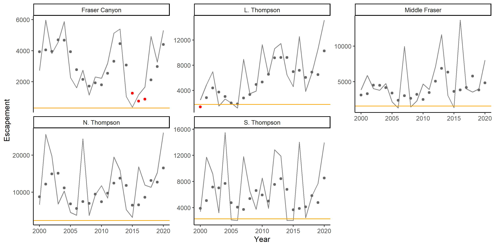
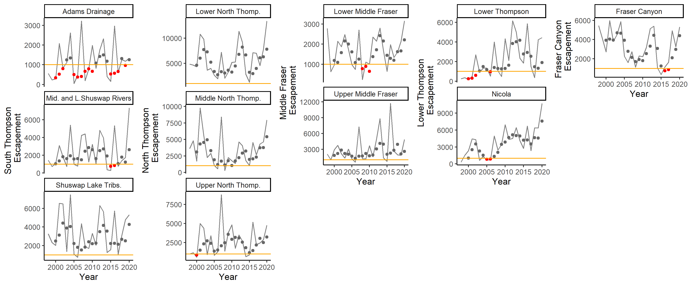
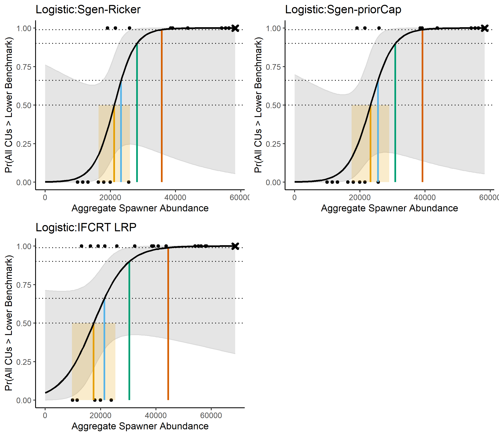
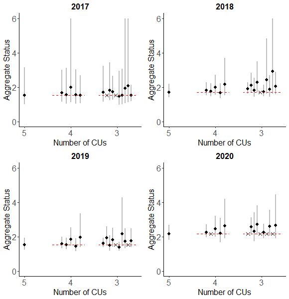
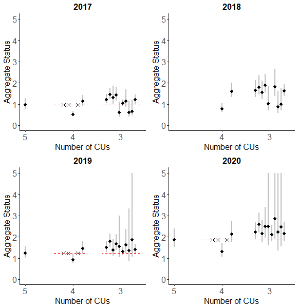
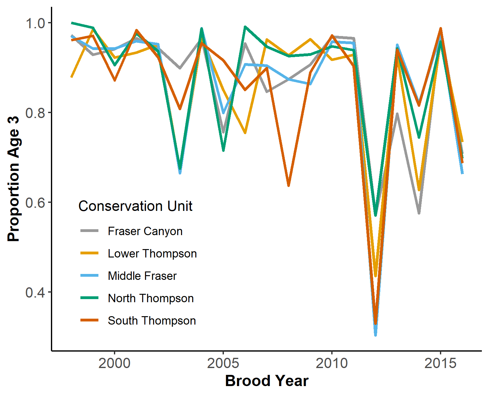
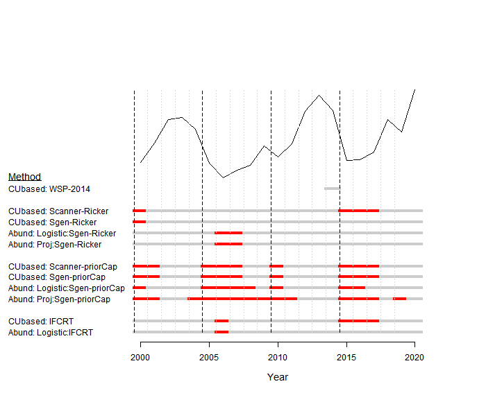

---
output:
  word_document: default
  html_document: default
  pdf_document: default
---
# CASE STUDY 1: INTERIOR FRASER COHO SALMON{#IFCChapter}

## CONTEXT
<!--CH comment: I'm getting some formatting errors with cross-references to section headers, appendices and citations, as well as headers without line spaces before them when I knit. We'll have to fix these at some point. I've added more linebreaks in, but might not have caught them all-->
<!--CH comment: I'm wondering about formatting of labels, i.e., using mathform of S_{gen} vs Sgen as part of Sgen-Ricker (when comparing LBM to Sgen-PriorCap) and Sgen_Ricker vs Sgen_priorCap when used as part of a label in historical plot. Sometimes underscore is used, sometime dash.
Maybe we should ditch mathematical label for S_{gen} and always use plain text, Sgen so that the differences are not so jarring in the last section of this chapter? And maybe always use dashes instead of underscores in labels? Then should we do the same for SMSY? Or maybe keep as S_{MSY}, as it's not used much and in plain text there is no hint that MSY should be subscript. Or use Smsy to show the subscript in plain text?
-->
<!--
  CW: We could also use: S\textsubscript{gen} and S\textsubscript{MSY}
-->

The Interior Fraser Coho Salmon Stock Management Unit (SMU) includes Coho Salmon that return <!--BC:“spawn” instead--> to the Fraser River and tributaries upstream of Hell’s Gate in the Fraser Canyon. Like most Coho Salmon, Interior Fraser Coho spend at least one full year in freshwater as fry before migrating to the ocean as smolts [@arbeiderInteriorFraserCoho2020]. Most (88%) IFC have a 3-year life history, in which they leave freshwater in their second year and spend 18 months at sea prior to returning to their natal system to spawn. The remaining 12% have a 4-year life history in which they spend an additional year in freshwater before migrating as smolts in their third year. Both the 3-year and 4-year life histories spend 18 months at sea. Less than 1% of Interior Fraser Coho are believed to return as jacks (precocious mature males that spend only 6 months as sea) or at ages older than 4 years [@arbeiderInteriorFraserCoho2020].

WSP CUs have been identified for Interior Fraser Coho based on genetics and geographic separation: Middle Fraser, Fraser Canyon, Lower Thompson, North Thompson, and South Thompson [@dfoWildSalmonPolicy2015; Figure \@ref(fig:coho-map)]. Previous work by the Interior Fraser Coho Recovery Team (IFCRT) identified 11 subpopulations nested within the five CUs, and developed recovery objectives based on maintaining abundance <!--BC:Is there a better way to say this? abundance above a threshold? Self-sustaining populations? --> in each of these smaller subpopulation units [@ifcrtinteriorfrasercohorecoveryteamConservationStrategyCoho2006; Table \@ref(tab:cohoCU2SP)]. The delineation of subpopulations was based on several factors, including the presence of natural barriers, the influence of large lakes on downstream discharge and thermal regimes, observations of spawner aggregations under differing discharge conditions, and genetic differentiation evidence <!--“differentiation” instead?-->. The 11 subpopulations are described in detail by the @ifcrtinteriorfrasercohorecoveryteamConservationStrategyCoho2006. 

<!--BC: from chinook chapter - "WCVI Chinook is also included in the first batch of major stocks proposed for regulation under the Fish Stock Provisions of the revised Fisheries Act, necessitating the development of LRPs for this SMU"
  Consider stating this in coho case study section too, if it also applies. 
-->

```{r coho-map, fig.cap="The five Conservation Units that make up the Interior Fraser Coho Stock Management Unit.", out.width = '60%', warning=FALSE, echo=FALSE, fig.align="center"}
knitr::include_graphics("figure/coho-map.png")
```


+-------------------+--------------------------------+
| Conservation Unit | Sub-populations        
+===================+================================+
| Middle Fraser     | - Lower Middle Fraser          
|                   | - Upper Middle Fraser
+-------------------+--------------------------------+    
| Fraser Canyon     | - Nahatlatch          
+-------------------+--------------------------------+ 
| Lower Thompson    | - Lower Thompson          
|                   | - Nicola
+-------------------+--------------------------------+
| North Thompson    | - Lower North Thompson      
|                   | - Middle Thompson
|                   | - Upper North Thompson
+-------------------+--------------------------------+
| South Thompson    | - Adams Drainage      
|                   | - Lower and Middle Shuswap Rivers
|                   | - Shuswap Lake Tributaries
+-------------------+--------------------------------+

Table: (\#tab:cohoCU2SP) Interior Fraser Coho Conservation Units (CUs) and associated sub-populations. Note that the definition of these sub-populations, including mapped boundaries, are provided in @ifcrtinteriorfrasercohorecoveryteamConservationStrategyCoho2006.

### Previous assessments

Declines in Interior Fraser Coho spawner abundance throughout the 1990’s led to a suite of management actions to promote recovery, including significant fishery restrictions starting in 1998 [@deckerAssessmentInteriorFraser2014]. Evidence of a new, lower productivity regime starting in return year 1994 that coincides with declines in spawner abundances has been well documented [@deckerAssessmentInteriorFraser2014]. In 2002, the Interior Fraser Coho stock management unit was designated 'endangered; by the  Committee on the Status of Endangered Wildlife in Canada (COSEWIC) based on the stock unit being assessed as a single 'Designatable Unit' (DU). 
Subsequent work by the Interior Fraser Coho Recovery Team (IFCRT) lead to a conservation strategy outlining short-term and long-term recovery objectives for the management unit [@ifcrtinteriorfrasercohorecoveryteamConservationStrategyCoho2006]. In 2014, @deckerAssessmentInteriorFraser2014 assessed status relative to the 2006 IFCRT objectives, and concluded that Interior Fraser Coho had been above the short-term recovery target of <!--BC: of what --> in every year since 2008, and above the long-term recovery target in the most recent two return years (2012 and 2013). Also in 2014, Interior Fraser Coho were assessed under the framework of DFO’s Wild Salmon Policy (WSP). The WSP Integrated Status Assessment classified three of these CUs as being amber status (Middle Fraser, Fraser Canyon, South Thompson) and the remaining two CUs as amber/green status (Lower Thompson, North Thompson; [@dfoWildSalmonPolicy2015]). As part of the WSP assessment, $S_{gen}$ was estimated for each CU and used as one of several benchmarks considered when assigning integrated CU status. A subsequent COSEWIC assessment in 2016 upgraded the status designation for the Interior Fraser Coho DU from 'endangered' to 'threatened' [@cosewicCOSEWICAssessmentStatus2016]. In 2018, DFO undertook a Recovery Potential Assessment (RPA) for Interior Fraser Coho that described status, habitat, threats, limiting factors to recovery, candidate recovery targets, and abundance projections for the DU, as well as recommendations regarding mitigation and allowable harm [@arbeiderInteriorFraserCoho2020]. 

### History of aggregate-abundance based reference points

Interior Fraser Coho show a strong positive relationship between their spatial distribution and overall abundance, which has been used as a basis for identifying aggregate abundance-based recovery targets and reference points for the stock group. Starting in 2006, the IFCRT identified a recovery goal of one or more viable sub-populations in each of the five 'populations', where their definition of populations aligns with CUs under the WSP [@ifcrtinteriorfrasercohorecoveryteamConservationStrategyCoho2006]; note that from this point on, we use the term CU instead of population when describing IFCRT recovery goals to be consistent with the WSP). The IFCRT identified a short-term recovery objective that the 3-year average escapement in at least half of the sub-populations within each of the five CUs was to exceed 1,000 wild-origin spawning Coho Salmon, excluding hatchery fish spawning in the wild.  Based on analysis of the relationship between aggregate abundance and the number of CUs that met this objective based on historical data, the IFCRT identified an abundance-based short-term recovery target of 20,000 spawners as the level required to meet their distributional objective. In addition, the IFCRT identified a long-term recovery target of 40,000 spawners, which represented a level that was expected to maintain 1,000 or more wild Coho Salmon in all 11 sub-populations. @deckerAssessmentInteriorFraser2014 updated the IFCRT's original analysis using a longer time series of escapement data. They also quantified the relationship between aggregate abundance and distribution by using a logistic regression to estimate the probability of meeting short-term and long-term recovery objectives as a function of aggregate abundance. The concluded that aggregate spawner abundance levels of 20,000 and 40,000 spawners would result in near 100% probability that the IFCRT’s short-term objective and long-term recovery objectives would be met, respectively. @kormanEvaluationFrameworkAssessing2019 also used logistic regressions of the relationship between the IFCRT's distributional objectives and aggregate abundance when evaluating how exploitation and marine survival rates affected the ability of Interior Fraser Coho to meet conservation targets. Their approach was similar to that of @deckerAssessmentInteriorFraser2014, except they applied logistic regressions at the CU-level instead of the SMU-level. Using this approach, they calculated the probability that IFCRT sub-population objectives were met as a function of total escapement to the CU within their simulation evaluation. When evaluating how well conservation targets were met at the MU-level, they chose to rely on the previous values of 20,000 and 40,000 identified by the IFCRT instead of updating these values. Finally, the 2018 RPA used an updated logistic regression to identify a long-term recovery target for Interior Fraser Coho that met the long-term IFCRT objective of 1000 spawners in all sub-populations [@arbeiderInteriorFraserCoho2020]. As a result, @arbeiderInteriorFraserCoho2020 recommended that the long-term recovery target for the stock should be a 3-year geometric mean abundance of 35,935 natural-origin spawners.


## DATA{#cohoData}

Data for this case study cover return years 1998 -2020. Data prior to 1998 were not used due to concerns about inconsistent assessment methods and data quality. All Interior Fraser Coho data were provided by DFO's Fraser River Stock Assessment Unit (M. Arbeider, pers. comm). These data included: (i) annual spawner abundance by CU (1998-2020), (ii) annual recruits-at-age by CU (brood years 1998 - 2016), (iii) a hatchery-based smolt-to-adult survival rate index, (iv) annual exploitation rates, and (v) annual spawner abundances for 11 sub-populations nested within the 5 CUs. Data were similar to those previously described in @arbeiderInteriorFraserCoho2020; data treatments, assumptions, infilling, and data quality are described in detail in that document. More recent updates that are not described in @arbeiderInteriorFraserCoho2020 include the incorporation of three additional years of data (return years 2018-2020; brood years 2014-2016), updates to the smolt-to-adult marine survival rate index to use a weighted average by release size, and increased data quality screening of scale ages used to calculate the proportion of recruits at age (M. Arbeider, pers. comm).

The exploitation rate time series is a large source of uncertainty for Interior Fraser Coho. Exploitation rates are only available at the SMU-level, so are assumed constant among all CUs, which is unlikely to be true. Furthermore, models used to reconstruct exploitation rates require a large number of assumptions that are expected to be incorrect [@arbeiderInteriorFraserCoho2020]. Because exploitation rate time series are used to reconstruct spawner-recruit time series, errors in exploitation rates will propagate through to estimates of stock recruitment parameters, relative abundance-based benchmarks such as $S_{gen}$, and covaration in recruitment residuals. Additional sources of uncertainty in Interior Fraser Coho data sets include observation errors in spawner abundance estimates and estimates of age-at-maturity. Spawner abundance estimates are largely derived from visual surveys. Scale sampling to determine age structure is incomplete at the CU-level with small sample sizes, missing data, and limited spatial representation within CUs in some years [@kormanEvaluationFrameworkAssessing2019]


## CU STATUS ESTIMATION

<!--CW: modified to address Brendan's comment "Should this bullet list come before the description of the first method? Out of place here. " -->
We use three alternative ways to characterize CU status when developing LRPs for Interior Fraser Coho: 1) Rapid multi-dimensional scanner tool, 2) CU-level abundance relative to $S_{gen}$ as a lower benchmark on abundance, and 3) Distribution of spawning abundance relative to distributional targets developed by the IFCRT.


 The first approach, which uses the rapid  multidimensional scanning tool developed by the State of the Salmon program (Section \@ref(rapidToolMethods)), is consistent with Canada's WSP and is recommended by Holt et al. (in review) as the method that should be used to estimate CU status when using the proportional LRP approach. The other two approaches are primarily used to develop aggregate abundance-based LRPs in this case study, as well as for a point of comparison with the rapid multidimensional scanning tool.


The second approach is based on comparing the current abundance of each CU to its CU-specific estimate of $S_{gen}$, where CU status is considered poor when abundance drops below $S_{gen}$. The value of $S_{gen}$ represents the number of spawners required to recover to $S_{MSY}$ (spawners maximum sustainable yield) within one generation, under equilibrium conditions in the absence of fishing [@holtIndicatorsStatusBenchmarks2009]. $S_{gen}$ is one of several benchmarks available for assigning multidimensional CU status in WSP Integrated Status Assessments; it represents a lower benchmark between red and amber status zones and was used as part of the 2014 Integrated Status Assessment for Interior Fraser Coho [@dfoWildSalmonPolicy2015].    

The third approach is based on the distribution of spawning escapement among subpopulations nested within CUs (Table \@ref(tab:cohoCU2SP)). We apply this approach for Interior Fraser Coho to maintain consistency with previous recovery planning processes for this SMU [@ifcrtinteriorfrasercohorecoveryteamConservationStrategyCoho2006; @arbeiderInteriorFraserCoho2020]. Since the distributional target we use was initially developed by the Interior Fraser Coho Recovery Team in 2006, we refer to it as "IFCRT distributional". Specifically, we use the IFCRT's short-term recovery objective that the 3-year average escapement in at least half of the sub-populations within each of the five CUs is to exceed 1,000 wild-origin spawning Coho salmon, excluding hatchery fish spawning in the wild. We selected the short-term recovery target to represent poor CU status in our case study (e.g., below a lower benchmark) because, as noted by @arbeiderInteriorFraserCoho2020, the short-term target was designed as an immediate target when the population was endangered. As such, it was interpreted as a level expected to prevent extinction or loss of genetic diversity. We have included this third approach to defining CU status to demonstrate the range of approaches and metrics that can be used, and to demonstrate sensitivity of the LRP to choice of metrics for assigning CU-status.  Future iterations of the multidimensional approach could include distributional metrics such as those used in the IFCRT approach.  


### Estimation of Sgen{#cohoSgen}

Estimates of Sgen are required when assessing CU status using both the 'Rapid Multidimensional Scanning Tool' and the comparison of current CU-level abundance to $S_{gen}$. Two different formulations of stock recruitment model were used to estimate $S_{gen}$: (i) a base Ricker model, which includes a marine survival covariate, and (ii) a Ricker_prioCap model in which an informative prior distribution is used to increase  $S_{REP}$ compared to the base model. $S_{REP}$ is the spawner abundance level at which the stock replaces itself; the relationship between $S_{REP}$ and Ricker stock recruit model parameters is shown below. Both of these models have been previously developed and applied to Interior Fraser Coho CUs. The marine survival covariate used when fitting both models is a hatchery-based smolt-to-adult survival rate index.  The index is not CU-specific; the same index is applied to all CUs. A third Ricker model, in which both an informative prior on $S_{REP}$ and depensatory mortality were included, was also used by @kormanEvaluationFrameworkAssessing2019 and @arbeiderInteriorFraserCoho2020; however, we did not include it in our case study for simplicity. As noted by @kormanEvaluationFrameworkAssessing2019, there is no indication in available data of depensatory dynamics, and the SR model fit with depensatory mortality required a highly uncertain assumption to be made about the escapement level at which recruitment is reduced to 50% of the value it would have been in the absence of depensatory mortality.  Furthermore, formal model selection criteria showed that adding depensatory mortality into models lead to a reduction in model fit [@kormanEvaluationFrameworkAssessing2019].

@kormanEvaluationFrameworkAssessing2019 and @arbeiderInteriorFraserCoho2020 used a hierarchical model structure for both the base Ricker and Ricker_priorCap models that assumed CU-level productivity parameters were sampled from a common, normal distribution shared by all CUs. Using formal model selection criteria (i.e., DIC), @kormanEvaluationFrameworkAssessing2019 found higher support for the hierarchical structure than when productivity parameters were assumed independent among CUs. However, our initial examination of the hierarchical approach applied to the updated data set lead us to select the independent CU approach for our evaluation. Firstly, we found that LRP estimates were sensitive to the assumed standard deviation on the hyper-distribution prior for the productivity parameter. Using the individual model approach removed prior influence on model results. Secondly, a logistic regression fit to status estimates obtained using the hierarchical model was unable to converge on a solution in several years between 2015 and 2020, including the most recent year (2020). Thirdly, because all CUs had equal amounts of data, the commonly cited benefit of hierarchical models allowing data-poor systems to borrow information from data-rich systems did not apply. While future stock recruit analyses for Interior Fraser Coho may wish to re-visit the hierarchical approach to modelling intrinsic productivity, we do not expect our decision to apply an individual modelling approach here will affect out general conclusions.

The formulations for our two stock recruitment models using the assumption of independent productivity among CUs are described below. 

*Model 1: Ricker*

The base Ricker stock recruit model formulation was:

\begin{equation}
  R_{i,a,t} = P_{i,a,t-a}S_{i,t-a}e^{log(\alpha_i) + \gamma log(m_{t-1})-\beta_i S_{i,t-a}e^{v_i}-\sigma^2/2}
   (\#eq:rickerSurv-IM)
\end{equation}
\begin{equation}
  v_i \sim Normal(0,\sigma_{v_i})
\end{equation}

where,

$R_{i,a,t}$ = the predicted number of natural origin recruits from CU $i$ of age $a$ returning in year $t$ (i.e., recruits that were produced by escapement in brood year $t-a$)

$P_{i,a,t-a}$ = the proportion of recruitment from CU $i$ returning at age $a$ from brood year $t-a$

$S_{i,t-a}$ = spawners from CU $i$ in brood year $t-a$

$\alpha_i$ = productivity parameter for CU $i$

$\gamma$ = marine survival co-efficient shared among CUs

$m_{t-1}$ = hatchery marine survival index (smolt-to-adult) shared among CUs for sea entry in year t-1

$\beta_i$ = density dependent term describing the rate of decrease in log-survival for CU $i$ with increasing spawner abundance

$\sigma_{v_i}$ = standard deviation of process error on recruitment deviations

This model formulation is similar to the Ricker model used in @arbeiderInteriorFraserCoho2020, but without a hierarchical structure imposed on $log(\alpha_i)$. We placed the following non-informative constraints on the likelihood function to replicate the Bayesian model fitting routine of @arbeiderInteriorFraserCoho2020:

\begin{equation}
  \gamma \sim Normal(0,10)
\end{equation}
\begin{equation}
  \sigma_{v_i} \sim Inverse Gamma (0.1,0.1)
\end{equation}


*Model 2: Ricker_priorCap*

To maintain consistency with this previous work on Interior Fraser Coho, we also consider a version of the Ricker model that uses an informative prior distribution on $S_{REP}$ to increase carrying capacity.  @kormanEvaluationFrameworkAssessing2019 suggested that the Ricker model with a survival co-variate (Model 1) over-estimated compensatory dynamics at high spawner abundances when applied only to data from 1998 onwards.  They noted that spawner abundances since 1998 have been much lower than historic levels.  Given that sparse data at high spawner abundances makes it difficult to estimate carrying capacity, base Ricker estimates of carrying capacity may be unreliable [@kormanEvaluationFrameworkAssessing2019]. Furthermore, they observed that one brood line had persisted at a relatively higher and more stable spawner abundance than the other two brood lines, which they viewed as evidence for a higher capacity than the base Ricker model estimates. Based on these concerns, @kormanEvaluationFrameworkAssessing2019 proposed an alternative Ricker model that used an informative prior distribution to increase carrying capacity (represented as the spawner abundance at which the stock replaces itself, $S_{REP}$). @arbeiderInteriorFraserCoho2020 followed the approach of @kormanEvaluationFrameworkAssessing2019 by considering both the base Ricker model and a version of the Ricker model with an informative prior distribution on $S_{REP}$ to be plausible when providing management advice.


\begin{equation}
  \beta_i = \frac{\alpha_i + \gamma + log(\overline{m})}{S_{REP,i}}
   (\#eq:beta-Srep)
\end{equation}
\begin{equation}
  S_{REP,i} \sim Normal(\mu_{SREP},\sigma_{SREP})
\end{equation}


@arbeiderInteriorFraserCoho2020 and @kormanEvaluationFrameworkAssessing2019 set $\mu_{SREP}$ at 1.5 times the $S_{REP}$ value estimated from the base model fit without a prior on $S_{REP}$. For our integrated Sgen-LRP model fits (described in section xxx) <!--still missing? -->, we found that we needed to constrain $\mu_{SREP}$ at no more than 1.4 times the $S_{REP}$ value to achieve model convergence, so we used the 1.4 times expansion instead.  We set $\sigma_{SREP}$ at $\sqrt{2} * 1000 = 1414$ spawners, which is the same value used by @arbeiderInteriorFraserCoho2020. Note that the "$* 1000$" term is used to correct for scaling spawner abundance by 1/1000 when fitting models. @arbeiderInteriorFraserCoho2020 parameterized the distribution in terms of precision ($\tau$), where $\tau = \frac{1}{\sigma^2} = 0.5$. The effect of adding the prior on $S_{REP}$ when fitting individual models to available data is shown in Figure \@ref(fig:coho-SR-fit).    


```{r coho-SR-fit, fig.cap="Spawner-recruitment curves fit to spawner and recruitment data using individual models for each CU. Solid black lines shows the MLE fit for the base Ricker model while solid blue lines shows the MLE fit for the Ricker\\_priorCap model.  Associated black and blue shaded regions show the 95 percent confidence intervals on respective model fits. The red line show the replacement line.", warning=FALSE, echo=FALSE, fig.align="center"}
knitr::include_graphics("figure/coho-compare-SRFits-IM.png")
```


*Calculation of Sgen*  

The inclusion of a marine survival co-variate in all four spawner recuit models means that the realized productivity changes from year to year with changing marine survival. We incorporated this adjustment into our calculations of $S_{gen}$ by first calculating the effective productivity for each CU as:

\begin{equation}
  log(\alpha'_{i}) = log(\alpha_i) + \gamma log(\overline{m})
   (\#eq:adjProd)
\end{equation}

where, $\overline{m}$ is the average marine survival rate over the available time series.  

$S_{MSY}$ was calculated as a function of log($\alpha_i'$) and $\beta_i$ using:

\begin{equation}
  S_{MSY,i} = 1 - \frac{W(e^1-\alpha'_i)}{\beta_i} 
   (\#eq:Smsy)
\end{equation}

where, $W$ represents the Lambert W function [@scheuerellExplicitSolutionCalculating2016]. $S_{gen}$ was then calculated numerically by solving the following equation: 

\begin{equation}
  S_{MSY,i} = S_{gen,i}e^(log(\alpha'_{i})- \beta_i \cdot S_{gen})
  (\#eq:Sgen)
\end{equation}


## LRP ESTIMATION: PROPORTION OF CUS

### Methods

We looked at the proportion of CUs that had rapid multidimensional status assessments above the red zone to determine in which years between 1998 and 2020 the LRP would have been breached. Status was assessed as being below the LRP in years in which one or more CUs assessed as having red status. Both Ricker model formulations described above were used to estimate relative abundance-based benchmarks (lower benchmark \= $S_{gen}$ and upper benchmark \= 0.8$S_{MSY}$) when assessing multi-dimensional rapid status: the base Ricker model and the Ricker_priorCap model. Estimates of $S_{gen}$ and $S_{MSY}$ were made using all data available up to 2020.

For comparison, we also looked at the proportion of CUs that had recent generational average (3-year) spawning abundance greater than $S_{gen}$ in each historical year and the proportion of CUs that failed to meet the IFCRT distributional target of at least half of all sub-populations within each CU having more than 1000 spawners.  

### Results

Estimates of $S_{gen}$ based on the Ricker_priorCap model were higher than those based on the base Ricker model for four of the five CUs (Middle Fraser, Lower Thompson, North Thompson, and South Thompson) and were approximately equal for the fifth CU (Fraser Canyon; Appendix \@ref(app:coho-appendix). As a result, generational average spawning abundance was more likely to drop below $S_{gen}$ when it was estimated using the Ricker_priorCap. Under the base Ricker model formulation, generational average spawning abundance remained above $S_{gen}$ for all years between 2000 and 2020 (Figure \@ref(fig:coho-CU-multiDim-Ricker)).  In comparison, under the Ricker_priorCap formulation, generational average abundance dropped below $S_{gen}$ in one or more years for Lower Thompson CU (2006), Middle Fraser CU (2006, 2008), and South Thompson CU (2000, 2006, 2007, 2015; Figure \@ref(fig:coho-CU-multiDim-Ricker-Cap)). As a result, at least one CU had stock status assessed as below $S_{gen}$ for 5 of the 21 years between 2000 and 2020.

When CU status was assessed using the multidimensional scanning tool with lower and upper abundance-based benchmarks based on $S_{gen}$ and 0.8$S_{MSY}$ as inputs, CU status was always assessed as red for years in which the generational average spawning abundance dropped below $S_{gen}$, regardless of which stock recruit model was used to estimate benchmarks (Figures \@ref(fig:coho-CU-multiDim-Ricker) and \@ref(fig:coho-CU-multiDim-Ricker-Cap)). This result occurs because according to the  multidimensional decision tree (Figure \@ref(fig:decision-tree), status is derived from abundance-based benchmarks in most years, which means that being below $S_{gen}$ is most often the trigger for a red CU status assessment. An exception occurs in the Fraser Canyon CU in years 2015-2017.  In these years, the generational average of absolute spawning abundance is < 1500 spawners and CU is assigned red status under the first node of the decision tree even though spawning abundances are above $S_{gen}$ (Figure \@ref(fig:decision-tree)). As a result, when multidimensional status was assessed using abundance-based benchmarks estimated from the base Ricker model, a proportion-based LRP for the SMU would have been breached in 4 of 21 years based on Fraser Canyon spawning abundances dropping below 1500 spawners in three years (2015-2017), and one year (2000) in which the Lower Thompson CU had spawning abundance < $S_{gen}$ (Figure \@ref(fig:coho-CU-multiDim-Ricker)). When multidimensional status was assessed using abundance-based benchmarks from the Ricker_priorCap model, a proportion-based LRP would have been breached in 9 of 21 years (2000-2001, 2005-2007, 2010, 2015-2017) based on a combination of spawning abundances < 1500 in the Fraser Canyon CU and spawning abundances < $S_{gen}$ in other CUs (Figure \@ref(fig:coho-CU-multiDim-Ricker-Cap)). Multidimensional status based on the rapid screening tool was above red for all CUs in the most recent year, 2020, indicating that the SMU is currently above a proportion-based LRP.

Overall, the proportion of CUs with red status did not differ between  the multidimensional approach and the single metric approach of looking at status relative to lower benchmarks. 

<!--
BC comment (re figure below):
It seems odd that there are as many 3 year running average escapements as there are annual estimates? How was the generational mean centered? Right centered and time series goes back further in time? 

CW: added to the legend First geometric mean includes 2008-2000. - But let me know if you would like the plot changed to include years 08-09. 
-->

```{r coho-CU-multiDim-Ricker, fig.cap="Escapement time series for five Interior Fraser Coho CUs shown as annual escapements (lines) and 3-year geometric mean escapements (dots). First geometric mean includes years 2008-2000. Grey dots indicate years in which all CUs had multidimensional rapid status assessments above red when Sgen was estimated using the Ricker model, while red dots indicate years in which one or more CUs had multi-dimensional status assessments in the red zone, which would trigger a breach of the LRP. Solid orange lines show estimates of Sgen from the Ricker model for comparison.", warning=FALSE, echo=FALSE, fig.align="center"}

```

```{r coho-CU-multiDim-Ricker-Cap, fig.cap="Escapement time series for five Interior Fraser Coho CUs shown as annual escapements (lines) and 3-year geometric mean escapements (dots). First geometric mean includes years 2008-2000. Grey dots indicate years in which all CUs had multidimensional rapid status assessments above red when Sgen was estimated using the Ricker\\_priorCap model, while red dots indicate years in which one or more CUs had multidimensional status assessments in the red zone, which would trigger a breach of the LRP. Solid orange lines show estimates of Sgen from the Ricker\\_priorCap model for comparison.", warning=FALSE, echo=FALSE, fig.align="center"}
knitr::include_graphics("figure/coho-CU-EscpSeries-wMultiStatus_Ricker_priorCap.png")
```

As a point of comparison, if a proportion-based LRP was based on all CUs being above the IFCRT distributional target, the LRP would have been breached in 4 of the 21 years between 2000 and 2020. Eight of the 11 sub-populations had generational average escapement drop below the 1000 spawner threshold in one or more years (Figure \@ref(fig:coho-Subpop-timeseries)). Sub-populations tended to differ in which years they dropped below the 1000 spawner threshold, which meant that the distributional target at least half of the subpopulations within each CU with greater than 1000 fish was more often met than not. All 11 subpopulations had generational average spawning abundances above 1000 spawners in 2020, indicating that the stock would be well above a proportion-based LRP based on the IFCRT-distributional target (Figure \@ref(fig:coho-Subpop-timeseries)).
<!--CH: i wonder if this plot of 11 subpops could be grouped into the 5 CUs, to more easily show the years when half of the subpops within each CU were < orange horiz line. It's hard to see visually how only 4 years have a breach of the LRP based on this plot
CW: I attempted to do that. not too sure about the result though-->

```{r coho-Subpop-timeseries, fig.cap="Escapement time series for 11 subpopulations of Interior Fraser Coho shown as annual escapements (lines) and 3-year geometric mean escapements (dots). Gray dots shows years in which the 3-year geometric mean escapement was above the 1000 fish threshold used to assess distributional status, while red dots show years in which the 1000 fish threshold was not met. CUs are represented by columns with labels long the y axis.", warning=FALSE, echo=FALSE, fig.align="center"}

```


## LRP ESTIMATION: AGGREGATE ABUNDANCE LOGISTIC REGRESSION LRPS

### Methods{#logistic}

We present aggregate abundance-based LRPs derived using logistic regressions with two of the Interior Fraser Coho benchmarks considered: $S_{gen}$ and the IFCRT-distributional target. Because two different spawner recruit models were used to estimate $S_{gen}$, we distinguish these models as 'Logistic:Sgen-Ricker' and 'Logistic:Sgen-priorCap' for the Ricker and Ricker_priorCap models, respectively. We use the label 'Logistic:IFCRT' to denote the case in which the IFCRT distributional target was used to develop the aggregate abundance logistic regression-based LRP.  See Section \@ref(logisticMethods) for an overview of the approach used to calculate aggregate abundance-based LRPs using logistic regression.


When estimating logistic regression LRPs using $S_{gen}$, we used an integrated modelling approach in which CU-level $S_{gen}$ and the SMU-level LRP were simultaneously estimated. The integrated Sgen-LRP models had two components:  

(i)	Stock-recruit models fit to each of the 5 CUs to estimate CU-level Sgen (Equation \@ref(eq:rickerSurv-IM) and Equations \@ref(eq:adjProd) - \@ref(eq:Sgen))  

(ii)	A logistic regression model fit to aggregated data to estimate the LRP as the aggregate abundance that has historically been associated with a specified probability of all CUs being above Sgen (Equations \@ref(eq:logistic) - \@ref(eq:logisticLRP))


We initially considered a third version of the logistic regression model, in which we used the rapid multidimensional scanning tool to characterize CU status. Preliminary model evaluations led us to exclude this model due to poor fit. There were two factors limiting the establishment of a statistical relationship between multidimensional estimates of CU status and aggregate spawner abundance.  First, the rapid multidimensional scanning tool relies on generational mean (smoothed abundances) to assess status of individual CUs against benchmarks, while our logistic regression approach uses raw (unsmoothed) aggregate abundance as a predictor variable. As a result, when logistic regressions were fit to CU status estimates from the multidimensional tool, there was a mismatch in the timing of abundance highs and lows.<!--CH: suggestion to focus entirely on weaker or non-existent relationship due to autocorrelation instead of the mixmatch. The mixmatch doesn't really matter for logsitic regression (and, a priori it's not immediately clear which one would be better, smoothed or unsmoothed), but the non-existent relationship does matter--> <!--CW: I am a bit confused, I think that the non-existent relationship happens because of the mismatch between the raw abundances and status below benchmark based on smoothed abundances, i.e. the raw abundance is high when status is red and low when status is not (yet) red  -->. This mismatch lead to a weak/non-existent relationship between SMU status and the raw (not smoothed) abundances. Using the generational mean of aggregate abundance as the predictor variable in the logistical regression fit instead of raw, annual abundance values introduced considerable autocorrelation in statuses. Future explorations of aggregate abundance logistic regression-based LRPs based on the rapid multidimensional scanning tool could account for the autocorrelation by including an AR(1) covariance structure. However, longer time-series and a wider spread of the data would be required to compensate for the additional parameter in the model. 

The second limiting factor in establishing a statistical relationship between rapid multidimensional estimates of CU status and aggregate spawner abundance is that the rapid multidimensional scanning tool includes criteria that are not continuously tied to the CU abundance. For example, CU status can be determined based on trends, which is not congruent with logistic regression goal of identifying underlying relationship between aggregate abundance and CU statuses. In addition, the rapid multidimensional scanning tool includes absolute abundance thresholds (e.g. generational mean should be above 1500 fish) that are not proportional to the size of a CU. These absolute benchmarks introduce a disconnect between the SMU abundance and status, even when there is high correlation between CUs, because small CUs will be more likely to be below the absolute threshold despite high aggregate abundances.


***Retrospective Analysis***

We used retrospective analyses to examine the effect of time series length on logistic regression-based LRP estimates. Retrospective analyses were restricted to the most recent 6 years (2015-2020) because logistic model fits prior to 2015 were unable to converge on an LRP estimate.  For each year between 2015 and 2020, we used data only available up to that year to calculate LRPs and associated confidence intervals.

To examine the effect of missing CUs on retrospective LRP estimates, we calculated LRPs using data from only a subset of the five Interior Fraser Coho CUs. We limited our analysis to missing data from either one or two CUs so that we had at least three CUs of available data when calculating the proportion of CUs above their benchmarks. For each missing data case, we calculated SMU aggregate status as

\begin{equation}
  AggStatus_t = \frac{\sum_{i}^{nCUs} S_{i,t}}{LRP'_t}
   (\#eq:status)
\end{equation}

where $nCUs$ is the number of CUs being used (3 or 4) and $LRP'_t$ is the LRP calculated in year $t$ using only data from $nCUs$.  SMU-level status in a given year was calculated for all possible combinations of CUs available (5 combinations when nCUs = 4 and 10 combinations when nCUs = 3) to allow examination of the stability of status estimates among available combinations. Estimates of SMU status relative to LRPs were used to compare among missing CU scenarios instead of actual LRP estimates because the magnitude of the LRP will vary with the number and combination of CUs used.


### Results


***LRP Estimates***

Logistic regression model fits in 2020 from the integrated Logistic:Sgen-Ricker and Logistic:Sgen-priorCap models are shown in Figures \@ref(fig:coho-IM-logisticFit2020) and \@ref(fig:coho-IMCap-logisticFit2020), respectively. The logistic regression model fit to status estimates based on the IFCRT-distributional benchmark is shown in Figure \@ref(fig:coho-Distr-logisticFit2020).  

All three logistic regression-based LRP methods were able to converge on a solution in 2020. Resulting LRPs for different *p* thresholds are shown on the regression curves, as well as in Table \@ref(tab:logisticLRPs2020). There was considerable uncertainty around predicted curves as seen in the large areas of gray shading in Figure \@ref(fig:coho-IM-logisticFit2020).  


```{r coho-IM-logisticFit2020, fig.cap="Logistic regression fit from the three logistic regression models: Logistic:Sgen-Ricker, Logistic:Sgen-priorCap and Logistic:IFCRT LRP model using data from 1998 - 2020. The yellow vertical line shows the LRP estimate based on the requirement of a 50\\% probability of all CUs being above Sgen, while the yellow shaded region shows the associated 95\\% confidence interval around the LRP. LRPs (MLE estimates only; no confidence intervals) for three alternative probability thresholds, 66\\%, 90\\%, and 99\\%, are shown in blue, green, and orange, respectively.", warning=FALSE, echo=FALSE, out.width = '50%', fig.align="center"}

```


<!--
cw: Combined all these figures in one multipanel as per Brendan's suggestion
{r coho-IM-logisticFit2020, fig.cap="Logistic regression fit from the integrated Logistic:Sgen-Ricker LRP model using data from 1998 - 2020. The yellow vertical line shows the LRP estimate based on the requirement of a 50\\% probability of all CUs being above Sgen, while the yellow shaded region shows the associated 95\\% confidence interval around the LRP. LRPs (MLE estimates only; no confidence intervals) for three alternative probability thresholds, 66\\%, 90\\%, and 99\\%, are shown in blue, green, and orange, respectively.", warning=FALSE, echo=FALSE, out.width = '50%', fig.align="center"}


-->
  <!--CH: maybe I should use the same colouring for LRPs at 50, 66, 90, 99. Can you let me know what colours those are?-->
  
When the Logistic:Sgen-Ricker model was used, aggregate abundance-based LRPs ranged from  21,189 <!--was 15,395 --> to 35,737 <!-- was 24,331 --> spawners, depending on whether the required probability of all CUs being above Sgen was moderate (50%) or very likely (99%) (Table \@ref(tab:logisticLRPs2020)). LRPs increased across all probability levels when the carrying capacity was assumed higher under the Logistic:Sgen-priorCap model (Table \@ref(tab:logisticLRPs2020)). The higher $S_{gen}$ values for most CUs under this alternative model formulation resulted in more historical years in which < 100% of CUs were above $S_{gen}$, resulting in a shift of the logistic curve to the right (Figure \@ref(fig:coho-IM-logisticFit2020)). LRPs based on the Logistic:Sgen_priorCap model ranged from 23,245 to 39,200 spawners, depending on whether the required probability of all CUs being above Sgen was moderate (50%) or very likely (99%).  

```{r coho-IMCap-logisticFit2020, fig.cap="Logistic regression fit from the integrated Logistic:Sgen-priorCap LRP model using data from 1998 - 2020. See Figure 9 caption for additional details.", warning=FALSE, echo=FALSE, out.width = '50%', fig.align="center"}
knitr::include_graphics("figure/coho-IMCap2020-LogisticLRP.png")
```

When CU status was based on the IFCRT distributional target, the fit of the logistic curve was more gradual than the two Sgen models due to a greater overlap in 'successful' (all CUs > distributional target) and 'unsuccessful' (<100% of CUs above distributional target) years at low to moderate aggregate abundances.  In 3 of the 6 years with aggregate abundances below 20,000 spawners, the distributional target was not met for all CUs (Figure \@ref(fig:coho-IM-logisticFit2020)). LRPs based on this model also became increasingly large at high probability thresholds (Table \@ref(tab:logisticLRPs2020). The LRP based on a 99% probability was 44,403 spawners, with a 95% confidence interval extending from 15,102 - 73,703 spawners.  

```{r coho-Distr-logisticFit2020, fig.cap="Logistic regression fit from the Logistic:IFCRT LRP model using data from 1998 - 2020. See Figure 9 caption for additional details.", warning=FALSE, echo=FALSE, out.width = '50%', fig.align="center"}

```


+---------------------+-----------------+-----------------+-----------------+
| Probability         | Sgen-Ricker     | Sgen-priorCap   | IFCRT
+=====================+=================+=================+=================+
| 50%                 | 21,190          | 23,245          | 17,515
| (As likely as not)  | (16,383-25,996) | (17,456-29,034) | (9,695-25,336)
+---------------------+-----------------+-----------------+-----------------+             
| 66%                 | 23,289          | 25,547          | 21,396
| (Likely)            | (17,364-29,215) | (18,158-32,937) | (13,418-29,375)
+---------------------+-----------------+-----------------+-----------------+  
| 90%                 | 28,145          | 30,874          | 30,372
| (Very likely)       | (17,566-38,725) | (18,129-43,620) | (15,711-45,033)
+---------------------+-----------------+-----------------+-----------------+
| 99%                 | 35,737          | 39,200          | 44,403
| (Virtually certain) | (16,525-54,949) | (16,922-61,479) | (15,102-73,703)
+---------------------+-----------------+-----------------+-----------------+

Table: (\#tab:logisticLRPs2020) Aggregate abundance based LRPs (with 95% confidence intervals) from three different logistic regression-based LRP models. For each probability level, the LRP estimate represents that probability that all CUs will be above their lower benchmark.  

***Logistic Regression Diagnostics***

Logistic regression diagnostics showed  that key regression assumptions were met, and that model fits were strong enough to support estimation of logistic regression-based LRPs from all three models (Table \@ref(tab:logisticDiagIFC2020)). The assumptions of linearity and lack of large outliers were met for all models. The assumption of linearity was demonstrated based on the Box-Tidwell test. This test evaluates the significance of adding a non-linear interaction term to the logit regression. We found that this additional interaction term was not significant, supporting the linearity assumption. 

An examination of deviance residuals did not show any large outliers, i.e. no residual values were greater than 2 for all three models. Observations were also found to be independent at all year lags examined for all three models. 

The Wald Test showed that logistic model coefficient for aggregate abundance was marginally significant (p < 0.10). Psuedo-$R^2$ statistics indicated a moderately strong relationship between aggregate abundance and the probability of all CUs being above their lower benchmarks, and the goodness of fit statistics indicated a significant fit of the model with aggregate abundance relative to the null model based on p-values less than 0.01. Finally, 'out-of-sample' hit ratios representing classification accuracy as the proportion of successful predictions when one year of data was iteratively left out of the model fit, were relatively high at low probability thresholds, indicating good accuracy. This results was especially true for the Logistic:Sgen-Ricker model which had a hit ratio of 0.91 at probability thresholds of 50% and 66%. Classification accuracy was lowest for all models at the 99% probability threshold.
<!--CH: this table and above text does not appear correctly on the knitted  pdf version. I'm not sure why. Also, I broke up the 1 pgh above into a few smaller ones; feel free to revise-->

+-------------------------+--------------+-------------------+-----------------+
| Diagnostic Test         | Sgen-Ricker  | Sgen-priorCap     | IFCRT
+=========================+==============+===================+=================+
| Box-Tidwell p-value     | 0.44         |    0.94           | 0.79
+-------------------------+--------------+-------------------+-----------------+     
| Max. deviance residual  | 1.98         | 1.81              | 1.66
+-------------------------+--------------+-------------------+-----------------+  
| AR-1                    | -0.07        | 0.09              | 0.05
+-------------------------+--------------+-------------------+-----------------+
| Wald p-values           | 0.07^*       + 0.06^*            + 0.09^*
+-------------------------+--------------+-------------------+-----------------+
| Goodness-of-fit p-value | <0.01        | <0.01             | <0.01
+-------------------------+--------------+-------------------+-----------------+
| Pseudo-$R^2$            | 0.60         | 0.61              | 0.40
+-------------------------+--------------+-------------------+-----------------+
| Hit Ratio (p= 50%,      | 0.91, 0.83   | 0.87, 0.87,       | 0.76, 0.81,
| 66%, 90%, 99%)          | 0.78, 0.74   | 0.87, 0.74        | 0.76, 0.52
+-------------------------+--------------+-------------------+-----------------+

Table: (\#tab:logisticDiagIFC2020) Model diagnostic statistics from Sgen:LRP, Sgen_priorCap:LRP, and Dist-LRP model fits. A description of diagnostic tests is provided in Section 2. Hit ratios are shown for all four probability thresholds considered.  The symbol '*' indicates a result that only marginally met the recommended criteria for demonstrating good model fit.  


```{r coho-logisticACF-IM, fig.cap="Autocorrelation in aggregate spawner abundance at 1- to 10-year lags for the Integreated Sgen:LRP model. Orange dashed lines inidcate whether autocorrelations are significantly different from zero based on a 95\\% confidence interval", warning=FALSE, echo=FALSE, out.width = '50%', fig.align="center"}
knitr::include_graphics("figure/coho-logisticFitDiag-2020acf.png")
```  


Sample sizes were small due to the short time series available for Interior Fraser Coho; only 23 years of observations were available to fit logistic regression models. @peduzziSimulationStudyNumber1996 recommend a minimum requirement of 10 data points for the least frequent outcome based on their simulation studies in the field of clinical epidemiology. In our case, the least frequent outcome was the failure of all CUs to be above their benchmarks (i.e., 0). We were not able to make this minimum requirement for any of our model fits; we had only 7, 8, and 5 data points at the least frequent outcome for the Logistic:Sgen-Ricker, Logistic:Sgen-priorCap, and Logistic-IFCRT models, respectively. <!--CW: need to confirm with Kendra where are these numbers calculated Based on the current ratio of successes and fails in the data, the estimated minimum sample sizes that would be required to meet the criteria of @peduzziSimulationStudyNumber1996 ranged from 26 to 77 years.--> However, despite small sample sizes, hit ratios are high for all models at p = 50%.  As a result, we suggest that logistic regression-based LRPs may still be useful for this SMU.  We proceeded with retrospective analyses in order to examine how sensitive LRPs based on these model fits were to variations in the level of available data.

***Retrospective Analysis***

2015 was the first year in which the available IFC time series was long enough to estimate logistic regression-based LRPs using the Logistic:Sgen-priorCap and Logistic:IFCRT models. However, the Logistic:Sgen-priorCap model was unable to converge on an LRP estimate in 2018. The Logistic:Sgen-Ricker model required an additional two years of data before LRP estimates were first available in 2017. As a result, only 4-6 years of retrospective analyses were available, depending on the model being considered. All three models showed some fluctuations in LRP estimates over time (Figure \@ref(fig:coho-retroLRPs)). The Logistic:IFCRT model tended to produce the most stable LRPs over time.  <!--CH: I think these next 3 plots might be easier to compare if a label for the LBM being used was directly on the figure-->

```{r coho-retroLRPs, fig.cap="Three-year geometric mean of aggregate spawning abundance for the Interior Fraser Coho SMU (black line) and associated time series of retrospective LRPs from logistic regression-based estimation methods. LRPs are based on a 50\\% probability that all CUs will be above their lower benchmarks. Annual LRP estimates are shown as maximum likelihood values (coloured lines) and associated 95\\% confidence intervals (shaded areas).", warning=FALSE, echo=FALSE, out.width = '50%', fig.align="center"}
knitr::include_graphics("figure/coho_LRP_compareRetro.png")
```

\linebreak

When the Logistic:Sgen-Ricker model was applied retrospectively to missing data scenarios with four out of the five CUs, only a subset of scenarios had LRP estimates that converged on a solution (Figure \@ref(fig:coho-IM-missingCUs)). Four of the five possible combinations of four CUs had estimates in 2017, while only three had estimates in 2019 and 2020. For scenarios in which LRP estimates were possible, estimates of aggregate status (Equation \@ref(eq:status)) were often close to the estimate obtained when all 5 CUs were used, and always fell within the 95% confidence interval of the full data estimate. The Logistic:Sgen-Ricker model was less likely to converge on a solution when data from only three CUs were used. This pattern was especially true for 2019 and 2020 when only 4 out of the 10 possible combinations had estimates. For scenarios that were able to converge, aggregate status estimates from 3 CUs tended to be more uncertain than 4- and 5-CU estimates, and showed larger deviations from estimated status when all CUs were used. One missing data scenario in 2018 had a status estimate that fell outside of the 95% confidence interval of the full data estimate.  


```{r coho-IM-missingCUs, fig.cap="Retrospective estimates of aggregate status (with 95\\% confidence intervals) from the Sgen:LRP  model under different scenarios about missing CUs, where aggregate status is characterized as the recent generational mean of aggregate abundance / LRP. LRPs are based on a 50\\% probability that all CUs will be above their lower benchmarks. The set of status estimates associated with each number of CUs on the x-axis represents all possible combinations of CUs created by selecting that number from the 5 available CUs.  Red dashed lines show the maximum likelihood estimate when no data is missing (i.e., all 5 CUs) for comparison with the missing data scenarios.", warning=FALSE, echo=FALSE, out.width = '80%', out.height = '50%', fig.align="center"}

```  

\linebreak
  
When the Logistic:Sgen-priorCap model was applied to missing data scenarios in which four out of five CUs had data, LRP estimates were only available for two to three of the five CU combinations, depending on the year (Figure \@ref(fig:coho-IMCap-missingCUs)). For scenarios in which LRP estimates were available, status was poorly estimated with the estimate often falling outside of the 95% confidence interval of the full data estimate. While convergence was more frequent when only three CUs were used, estimates had high uncertainty and were variable among scenarios. Several of the status estimates from three-CU scenarios fell outside of the 95% confidence interval for the full data case. <!--CH: Can we add that when LRPs were assessed based on only a subset of CUs, status was also more optimistic. I think this is a key message as to why we should have all CUs included if possible-. addendum: Just realized I am wrong, and there are more nuances here. Status as a ppn of CUs above red can be more pessimistic or optimistic as CUs are removed (as you stated), but SMU can never be untriggered with inclusion of new data; the ppn may approach 100 with new data but will never reach 100 (i.e., the curve is asymptotic).-->

The failure of both the Logistic:Sgen-Ricker and Logistic:Sgen-priorCap models to converge in some years is a function of low sample sizes in the available data set, such that the removal of one or two CUs results in a failure of the logistic regression model to converge on a solution. For example, for the Logistic:Sgen-Ricker model, the South Thompson CU is an influential CU. Removing it from the characterization of 'successful' and 'failure' years, as well as the aggregate abundance used to fit the logistic regression, means that the model cannot converge on a solution because there was no overlap in aggregate abundance levels associated with 'successes' and 'failures', which is a requirement for logistic regression model fits. For the Logistic:Sgen-priorCap model, several CUs are influential due to higher $S_{gen}$ estimates compared to the  Logistic:Sgen-Ricker model. Because several different CUs contribute to 'failure' years, in which CU-level abundances drop below $S_{gen}$, there is higher sensitivity to the removal of any one of these CUs.  


<!--
CW: I am curious why the results were different between the two Ricker models, and it seems that the confidence intervals are tighter for the Sgen_priorCap:LRP model.
Is this result generalizble? i.e., Does this result indicate that missing two or more CUs will increase uncertainty in LRP estimates? 
KH: Does the explanation in the above paragraph help?

CH comment: In some ways it is genearlizable IF having more CUs means that you have better spread of 0s and 1s so that uncertainty in LRP is reduced. However, even if the stocks covary perfectly, but one is just more depleted than the others and so dips below the LBM more, then loosing that CU will bias the status upwards. I guess we never get the reverse where missing a healthy CU biases it downwards since the LRP is defined of at least one CU being below red status/LBM. So perhaps that is a generalizable result- that missing CUs can result in biased positive not negative status.

Perhaps this is generalizable-- when time trends in statuses are not consistent across CUs, and status bridge red-amber, then LRP will be sens to which CUs are included. Although there is high correlation among CUs for this SMU, its not perfect. I think this comes back to our criteria for representing missing CUs. Is it possible to add text to tthis section checking if missing CUs can be represented by other CUs based on those criteria?   Or does this matter...  
--> 


```{r coho-IMCap-missingCUs, fig.cap="Retrospective estimates of aggregate status (with 95\\% confidence intervals) from the Sgen\\_priorCap:LRP model under different scenarios about missing CUs, where status is characterized as the recent generational mean of aggregate abundance / LRP. LRPs are based on a 50\\% probability that all CUs will be above their lower benchmarks. See Figure xx caption for more details.", warning=FALSE, echo=FALSE, out.width = '80%', fig.align="center"}

```
 

\linebreak

LRPs based on the Logistic:IFCRT model could be estimated for all four-CU data scenarios in all years (Figure \@ref(fig:coho-distributional-missingCUs)). Resulting estimates of SMU status were similar to the full data estimate for four of the five CU combinations. Status estimates were highest and most uncertain when the South Thompson CU was dropped from the analysis (i.e., the last of the five four-CU combinations shown for each year in Figure \@ref(fig:coho-distributional-missingCUs)). This pattern is due the 2015 data point for South Thompson CU being an influential observation that has a large impact on the shape of the fit model <!--CH: might be helpful to say if it's red status year, so brings LRP down; when missing LRP is higher-->. For missing data scenarios in which only three CUs were included, status estimates often had higher uncertainty than the four-CU or full data scenarios, and showed high variability among scenarios in estimated status.  


```{r coho-distributional-missingCUs, fig.cap="Retrospective estimates of aggregate status (with 95\\% confidence intervals) from the Dist:LRP model under different scenarios about missing CUs, where status is characterized as the recent generational mean of aggregate abundance / LRP. LRPs are based on a 50\\% probability that all CUs will be above their lower benchmarks. See Figure xx caption for more details.", warning=FALSE, echo=FALSE, out.width = '80%',  fig.align="center"}
knitr::include_graphics("figure/coho-StatusByNCUs-SPopAbundThreshST-50.png")
```
\linebreak

## LRP ESTIMATION: AGGREGATE ABUNDANCE PROJECTION-BASED LRPS

### Methods

Forward projections of each of the five CUs with the Interior Fraser Coho SMU were done using the `samSim` modelling tool (Appendix \@ref(app:samsim-appendix)). Parameters characterizing population dynamics, marine survival rates, and exploitation rate were derived directly from data sets described in Section \@ref(cohoData). Base case parameters and alternative parameter values tested in sensitivity analyses are provided in Table \@ref(tab:coho-BaseProjectPars). Additional details on key model parameterizations and sensitivity analyses are also described in text below.  

Projection model outputs were used to estimate projection-based LRPs using the methods described on Section \@ref(projectedMethods). Forward projections were run for 30 years over 20,000 simulation trials.  The high number of simulation trials was required to stabilize LRP estimates given the binning of aggregate escapement in 200-fish intervals to identify LRPs based on probability thresholds.  We found that running projections over longer periods, such as 100 years, gave similar results as our 30 year time horizon.


***Stock recruitment dynamics***  

Stock recruitment parameters for all five CUs were drawn from joint posterior distributions obtained by fitting the two stock recruit models described in Section \@ref(cohoSgen) (Ricker and Ricker_priorCap) to available spawner-recruit data using Bayesian Markov Chain Monte Carlo (MCMC) estimation. Bayesian estimation was done using tmbStan (Kristensen 2019), which is an R package that allows MCMC samples to be drawn from a TMB model object using rStan (Guo et al. 2020). Three MCMC chains were run for 14,000 iterations, with the first half of each chain excluded from the final posterior sample. Resulting joint posterior distributions included 21,000 samples. Posterior sampling was initiated at the MLE estimates for each model formulation. Neither model showed signs of convergence failure based on our examination of Rhat and effective sample size diagnostics, as well as visual inspections of marginal posterior distributions. A summary of marginal posterior distributions for each stock recruitment parameter ($\alpha$, $\beta$, $\gamma$, and $\sigma$) is provided in Appendix \@ref(app:coho-appendix). 

The two stock recruitment models, Ricker and Ricker_priorCap, were treated as two alternative hypotheses about stock recruitment dynamics, which we compare against each other. We also considered a simple model-averaging approach, in which we equally weighted the two stock recruit models by combining projections prior to calculating a projection-based LRP. Additional sensitivity analyses described below were only done using the base Ricker model.  

***Covariance in recruitment residuals***

We parameterized correlations in recruitment residuals among CUs from MLE predictions of pairwise correlations from spawner recruit model fits. The correlation matrix from the base Ricker model fit is shown in Figure \@ref(fig:coho-recruitResid-Ricker). Correlation values for the Ricker_priorCap model were similar (not shown).    

We initially attempted to reduce covariation in spawner abundances among CUs by scaling correlations in recruitment residuals (i.e., scalar < 1). However, we found that scalars had little effect on projected correlations in spawner abundances among CUs due to the shared marine rate coefficient dominating among-CU variability in recruitment. We therefore used sensitivity analyses of the level of variability in marine survival coefficients among CUs to drive patterns of covariation in spawner abundance, as described below. This approach differs from that taken for WCVI Chinook (Section \@ref(WCVIchinookChapter).  

<!--BC Comment:
In caption (which does not show up in word doc, you might consider stating what values represent (i.e., pairwise correlation coefficient)? 
CW: need to check waht exactly the values are.
 -->
```{r coho-recruitResid-Ricker, fig.cap="Bubble plot of correlations in recruitment residuals among CUs from base Ricker model fit.", warning=FALSE, echo=FALSE, out.width = '50%',  fig.align="center"}
knitr::include_graphics("figure/coho-RecuitResidCorrelation-Ricker.png")
```
\linebreak

***Variability in marine survival coefficient among CUs***

When fitting spawner recruit models to data, we followed the approach of @kormanEvaluationFrameworkAssessing2019 and @arbeiderInteriorFraserCoho2020 in assuming that all CUs experienced the same marine survival rate for given sea-entry year, and that the marine survival coefficient, $\gamma$, was constant both among CUs and among years.  When projecting CUs forward, we maintained this assumption in our base case by generating a single marine survival rate for each sea entry year and setting $\sigma_{\gamma}$ = 0, where $\sigma_{\gamma}$ is the standard deviation of among-CU variability in $\gamma$ such that $\gamma_i \sim Normal(\bar{\gamma}, \sigma_{\gamma})$. We used sensitivity analyses on $\sigma_{\gamma}$ to test the effect of changes in spawner abundance covariation among CUs on projected LRP estimates. Three alternative levels of $\sigma_{\gamma}$ were used in sensitivity analyses: $\sigma_{\gamma}$ = 0.045, 0.0675, and 0.09. We selected these levels to cover a range between 0 and 0.09, where 0.09 was the standard deviation of the estimated marginal posterior distribution for $\gamma$ from our Ricker stock recruitment model fit. 

The resulting correlations in spawner abundances from the projections are shown in Figure \@ref(fig:coho-sigGammaCorrelation). In the forward projections, pairwise correlations in projected spawner abundances among CUs for the base case assumption of $\sigma_{\gamma}$ = 0 were similar to observed pairwise correlations in spawner abundances among CUs. Increasing $\sigma_{\gamma}$ resulted in decreased among-CU correlation in projected spawner abundances.  

```{r coho-sigGammaCorrelation, fig.cap="Distribution of correlations of spawner abundances among CUs for observed data between 1998 and 2021 and projected time-series under alternative assumptions about the standard deviation on the marine survival co-efficient among CUs for the base Ricker model formulation.", warning=FALSE, echo=FALSE, out.width = '50%',  fig.align="center"}

```

\linebreak

***Variability in age proportions of recruits among CUs***

Annual variability in the age structure of returns was generated from a multivariate logistic distribution parameterized using CU-specific time series of proportions at age. The underlying average age structure for each CU was set at the average from the available time series (brood years 1998 - 2016), while annual deviations from underlying age-specific means were drawn from a multivariate logistic distribution. Annual deviations were held constant among all CUs; however, the scale of annual deviations was controlled by the variability parameter $\tau$, which was estimated individually for each CU. This meant that while all CUs simultaneously experienced increases or decreases in a given year, the magnitude of the increase or decrease was CU-specific. Annual deviations were held constant among CUs to represent the strong co-variation in proportions at age seen in available time series for Interior Fraser Coho, especially since 2010 (Figure \@ref(fig:coho-recruitResid-Ricker)). When the constraint of constant annual deviations was removed, generated proportion at age data was much more variable than observed data, which was considered to be unrealistic. 

Annual variability in the age structure of recruits has not been included in other recent projection analyses for this SMU. Both @kormanEvaluationFrameworkAssessing2019 and @arbeiderInteriorFraserCoho2020 assumed a constant age structure over time.  

```{r coho-ageProp, fig.cap="Proportion of recruits returning at age 3 for 1998 - 2016 brood years. Only two age classes (age 3 and age 4) are present in the age structure, so the proportion of recruits returning at age 4 will account for the remainder of returns in each year.", warning=FALSE, echo=FALSE, out.width = '50%',  fig.align="center"}

```

\linebreak
***Covariance in exploitation***

We assumed an average exploitation rate of 12.5% for all CUs in forward projections based on average historical values, with common interannual variability in exploitation rates due to shared fishery impacts among CUs each year. Interannual variability in exploitation rates was assumed to be beta distributed (constrained between 0 and 1), with the standard deviation of the beta distribution parameterized from estimated exploitation rates for 1998 - 2016 brood years. The corresponding coefficient of variation (CV) for interannual variability was 0.44.

Exploitation rates for Interior Fraser Coho are only available at the SMU-level due to limited coded-wire indicator stocks (1-2 CUs with indicators / year) and variation in which indicator stocks were operational in a given year. As a result, empirically-based estimates of among-CU variability in exploitation rates are not available. However, there are reasons to expect exploitation rates to vary among CUs in a given year, including differences in freshwater fisheries.  We assumed that CU-specific variability in exploitation rates was half the common (SMU-level) interannual variability (CV=0.22), and varied this in sensitivity analyses from 0 and 0.44 to cover plausible bounds. Varying assumptions about variability in exploitation among CUs between CV = 0 and 0.44 in forward projections did not impact the distribution of correlations in spawner abundances in the projections (results not shown).  


<!--BC Comment:

•  Consider stating years used to initialize abundances
•  A extirpation threshold of 2 seems really low, is this consistent with other IFC coho simulations? 
•  Consider clarifying that you did not model dynamics as sub-populations nested within CUs, since you introduce the sub-populations earlier. And perhaps include justification.
-->

\begin{longtable}[]{p{3.7cm} p{5cm} p{6.3cm}}
\caption{Parameters used for CU-specific projections of Interior Fraser Coho population dynamics.}\\
\hline
Parameter & Value & Source \\ 
\hline
\endhead
\hline
 Ricker Parameters ($\alpha$, $\beta$, $\gamma$,$\sigma$)  &  CU-specific (Appendix E) & Drawn from joint posterior from MCMC model fit to 1998-2016 brood years
\\\\

Smolt-to-adult marine survival rate (all CUs) & Drawn from Lognormal(-4.83, 1.21), bound between [-9.21, -3.32]
 & Estimated from annual marine survival rate estimates from brood years 1998 - 2016, with bounds set at lowest and highest observations
\\\\  

 Among-CU variability in marine survival coefficient $\gamma$  &  $\sigma_{\gamma}$ = 0 (all CUs the same) & Assumed value when fitting models. Varied between 0 and 0.09 in sensitivity analyses
\\\\

 Ave age proportions at maturity (ages 3, 4) &  MiddleFR, LThomp, SThomp = (0.86,0.14) , FRCanyon = (0.87, 0.13), NThomp = (0.88, 0.12) & Estimated from time-series of proportions of recruits at age
 \\\\  

 Interannual variability in age proportions (tau from multivariate logistic distribution)  & MiddleFR, NThomp, SThomp = 1.0, LThomp = 0.9, FRCanyon = 0.8 & Estimated from time-series of ppns of recruits at age. \\\\

 Average exploitation rate & 0.125 & Estimated from annual exploitation rate estimates from brood years 1998 - 2016. Varied in sensitivity analyses (0.05 - 0.35).
 \\\\

Interannual variability in exploitation rates & CV = 0.442  & Estimated from annual exploitation rate estimates from brood years 1998 - 2016. Assumed to be beta distributed, constrained between 0-1.
\\\\

Variability in exploitation rates among CUs & CV = 0.221 & Assumed to be half of interannual variability. Varied in a sensitivity analysis (0-0.442).
\\\\ 

Initial abundances  & CU-specific & Abundance initialized using spawner-recruit time series
\\\\

Extirpation threshold &  2 & Mating constraint \\
\hline
(\#tab:coho-BaseProjectPars)
\end{longtable}


### Results

<!--
  BC comment: Out of curiosity, if you conditioned your projections on the spawner abundance at the beginning of your empirical time series would you get an aggregate projection based LRP relationship that looks similar to the empirical one? If not why not. Might be worth discussing somewhere as part of pros and cons of alt methods. 
-->

***LRP Estimates***

Aggregate abundance-based LRPs estimated using the Ricker model as a basis for forward projections were lower than those obtained when the Ricker_priorCap model was used, regardless of which probability threshold was used to derive the LRP (Figure \@ref(fig:coho-projLRPCurveByOM); Table \@ref(tab:projectedLRPs2020)). This result is similar to the logistic regression-based LRPs, where LRPs derived using $S_{gen}$ estimates from the Ricker_priorCap model were higher due to higher $S_{gen}$ values.  The projected curve showing the probability of all CUs being above $S_{gen}$ was more gradual and further to the right for the Ricker_priorCap model compared to the base Ricker model (Figure \@ref(fig:coho-projLRPCurveByOM)). When projection outputs from both stock recruit model formulations were combined prior to binning in order to create a model-averaged scenario (with equal weight assigned to both scenarios), the resulting probability curve was mid-way between the curves from the two individual models. In all cases, projected curves had higher scatter with increasing aggregate abundance, such that LRP estimates at probability thresholds of p = 0.90 and p = 0.99 were unstable.

<!--BC: Consider making the empirical LRP plots multi-panel like this one too. -->

```{r coho-projLRPCurveByOM, fig.cap="Probability of all CUs being above their lower benchmark of Sgen along a gradient in aggregate abundances within bins of 200 fish for two different stock recruit model options (Ricker and Ricker\\_priorCap) as well as a model averaged case (Combined) in which results from both stock recruit models were equally weighted. Results are derived from projections over 30 years and 20,000 MC Trials. Each dot is the proportion of MC trials where all CUs were > lower benchmarks. Candidate LRPs at p=0.5 (yellow) and p=0.66 (blue), 0.90 (green), and 0.99 (orange) are highlighted.", warning=FALSE, echo=FALSE, out.width = '50%',  fig.align="center"}

```


+-------------+-----------------+-------------------+-----------------+
| Probability | Ricker          | Ricker_priorCap   | Combined
+=============+=================+===================+=================+
| 50%         | 20,100          | 32,700            | 26,500
+-------------+-----------------+-------------------+-----------------+             
| 66%         | 24,900          | 40,100            | 33,500
+-------------+-----------------+-------------------+-----------------+  
| 90%         | 41,100          | 68,900            | 65,300
+-------------+-----------------+-------------------+-----------------+
| 99%         | 75,100          | 87,300            | 83,500
+-------------+-----------------+-------------------+-----------------+

Table: (\#tab:projectedLRPs2020) Projection-based LRPs from forward projections under two different stock recruit model options (Ricker and Ricker\\_priorCap), as well as a model averaged case (Combined) in which results from both stock recruit models were equally weighted. For each probability level, the LRP estimate represents that probability that all CUs will be above their lower benchmark of $S_{gen}$.

Generational average spawning abundance (based on a 3-year geometric mean) remained above the projection-based LRP derived using the Ricker model with a probability threshold of p = 0.5 for most years between 2000 and 2020. There were two years in which aggregate spawning abundance dropping below the LRP: 2006 and 2007 (Figure \@ref:fig(coho-AggEscpSeries-wProjLRP). In comparison, when projection-based LRPs were derived using the Ricker_priorCap model with p = 0.5, aggregate spawning abundance remained below the LRP for 11 out of the 21 years.  


```{r coho-AggEscpSeries-wProjLRP, fig.cap="Three-year geometric mean of aggregate spawning abundance for the Interior Fraser Coho SMU (black line) relative to projection-based LRP estimates using two different stock recruitment model formulations, Ricker and Ricker\\_priorCap, with a probability threshold of p=0.5. Forward projections used to estimate reference points were parameterized using available 1998-2020 time series under base model assumptions.", warning=FALSE, echo=FALSE, out.width = '60%',  fig.align="center"}
knitr::include_graphics("figure/coho-EscpSeries-wProjLRP.png")
```

\linebreak

***Sensitivity Analyses***  

Increasing $\sigma_{\gamma}$, which corresponded with reduced between-CU correlation in spawner abundances over time (Figure \@ref(fig:coho-sigGammaCorrelation)), resulted in a flattening of the projected relationship between aggregate spawer abundances and the probability of all CUs being above their lower benchmarks. LRP estimates corresponding to a given probability threshold increased as $\sigma_{\gamma}$ increased as curves shifted to the right and became more gradual (i.e., less steep). For the two highest $\sigma_{\gamma}$ scenarios examined ($\sigma_{\gamma}$=0.0675 and 0.09), a 99% probability of all CUs being above their lower $S_{gen}$ benchmark was never achieved.            

```{r coho-projLRPCurve-bySigGamma, fig.cap="Probability of all CUs being above their lower benchmark of Sgen along a gradient in aggregate abundances (within bins of 200 fish) for alternative scenarios about the value of sigGamma. The baseline value used for forward projections was sigGamma = 0. Results are derived from projections over 30 years and 20,000 MC Trials. Each dot is the proportion of MC trials where all CUs were > Sgen.  Candidate LRPs at p=0.5 (yellow) and p=0.66 (blue), 0.90 (green), and 0.99 (orange) are highlighted.", warning=FALSE, echo=FALSE, out.width = '60%',  fig.align="center"}
knitr::include_graphics("figure/coho-projLRPCurve-bySigGamma.png")
```

Increasing the average exploitation rate used in forward projections also led to a shift in projected curves to the right; however, the shift was more gradual over the range of exploitation rate scenarios we considered than the effect of increasing $\sigma_{\gamma}$ (Figure \@ref(fig:coho-projLRPCurve-byER)). The effect of increasing exploitation rates was smallest at low probability thresholds. At p = 0.5, the LRP differed by 400 fish between the ER = 2.5% and ER = 12.5% scenarios (range = 19,700 - 21,000), and by < 4000 fish among all four scenarios (range = 19,700 - 24,000). Differences were much larger among the four exploitation rate levels examined for the p = 0.90 threshold. When the average exploitation rate was set at 22.5% or 32.5%, aggregate abundances barely exceeded 60,000 fish, and it was not possible to achieve a 99% probability of all CUs being above their lower $S_{gen}$ benchmarks.  


```{r coho-projLRPCurve-byER, fig.cap="Probability of all CUs being above their lower benchmark of Sgen along a gradient in aggregate abundances (within bins of 200 fish) for alternative scenarios about average exploitation rates (ER) in forward projections. The baseline value used for forward projections was ER = 12.5\\%. Results are derived from projections over 30 years and 20,000 MC Trials. Each dot is the proportion of MC trials where all CUs were > Sgen.  Candidate LRPs at p=0.5 (yellow) and p=0.66 (blue), 0.90 (green), and 0.99 (orange) are highlighted.", warning=FALSE, echo=FALSE, out.width = '60%',  fig.align="center"}
knitr::include_graphics("figure/coho-projLRPCurve-byER.png")
```


## HISTORICAL EVALUATION OF STATUS ACROSS LRP METHODS

We compared annual estimates of SMU status relative to LRPs for the range of LRP estimation options considered in this case study (Figure \@ref(fig:coho-statusPlot-withBars)). For all aggregate abundance-based LRPs, we used LRPs estimated using a probability threshold of p = 0.5 (i.e., a 50% probability that all CUs would have status above their lower benchmark). We used the following labelling convention when comparing historical status estimates across LRP estimation methods: *"Metric" : "LRP Method" : "CU Status Method"*. 'Metric' refers to the choice of whether to base an LRP on the proportion of CUs above 'poor' CU status (Prop) or on aggregate SMU-level abundance (Abund). The 'LRP' method only applies to aggregate-abundance based LRPs, for which is can be logistic regression (Logistic) or projection-based (Proj). Finally, the 'CU Status Method' can be based on the rapid multidimensional scanning tool in in which CU abundance-based benchmarks are based on one of the two Ricker models (Multidim-Ricker or Multidim-priorCap). Or, when only a single benchmark is used to characterize CU status, it can be based on $S_{gen}$ estimated from one of the two Ricker models (Sgen-Ricker or Sgen-priorCap) or the IFCRT target (IFCRT). For example, when referring to an aggregate abundance-based LRP that is estimated via a logistic regression fit to historical CU status, with CU status estimated relative to $S_{gen}$ from the base Ricker model, we label it as "Abund: Logistic: Sgen_Ricker".  

We show historical results for two types of proportional LRP methods: one that uses the proportion of CUs with rapid multidimensional status > red (e.g., Prop: Multidim-Ricker)  and one that uses the proportion of CUs with abundance > Sgen (e.g., Prop: Sgen-Ricker). Holt et al. (in review) recommend that <!--CH: removed 'only'. I think we get the same message without that inclusion?-->the multidimensional approach should be used to assess status; however, we show results for the single metric $S_{gen}$ approach here to demonstrate how the two approaches differ. This comparison is of interest because our aggregate abundance-based LRPs use status estimates based on a single metric rather than the multidimensional status estimates.   

In addition to the LRP estimation methods presented so far in this case study, we include the full WSP assessment that was conducted in 2014 as an option for estimating CU status for use in a proportion-based LRP. We label this case "Prop : WSP-2014". SMU status would have been assessed as being above the LRP at this time as all CUs were assessed as amber or green.  

In general, estimated LRP breaches coincided with low points in the aggregate abundance time series (2000, 2005 - 2006 and 2015-2017). However, there were differences among methods in the years that SMU status was estimated to be below the LRP, as well as a few methods for which status was never estimated to be below the LRP (Prop: Sgen-Ricker, Abund: Logistic: Sgen-Ricker, Abund: Logistic: IFCRT).  

Comparison of SMU status estimates over time for all LRP estimation methods that used $S_{gen}$ estimates from the base Ricker model (first group of four methods in Figure \@ref(fig:coho-statusPlot-withBars)), showed that the LRP was only breached in years 2015-2017 under the Prop: Multidim-Ricker method. The other three Ricker methods estimated status to remain above the LRP over this period. The latter three methods are similar in that they all assess CU status based on a direct comparison of CU-level abundance to $S_{gen}$.  In contrast, the decision tree for the rapid multidimensional scanning tool includes a step in which CU status is designated as 'red' anytime the generational mean spawning abundance drops below 1500 spawners (Figure \@ref(fig:decision-tree)).  Because estimated $S_{gen}$ is less than 1500 spawners for the Fraser Canyon CU, it is possible for the criteria of <1500 spawners in a CU to be breached even though abundance remains above $S_{gen}$.  This situation occurs for this CU in 2015-2017. Therefore, LRP methods that use the rapid multi-dimensional scanning tool to characterize CU status can be more precautionary than methods that rely on a single $S_{gen}$ benchmark.  

In the years 2005-2006, SMU status estimates from the 'Abund: Proj: Sgen-Ricker' method fell below the LRP, while the other two Sgen-Ricker methods did not. Declines in aggregate SMU abundance in 2005-2006 were driven by declines in the four larger CUs (which, still remained above their individual $S_{gen}$ estimates). Declines in the lower abundance Fraser Canyon CU were not as drastic. As a result, while SMU-level aggregate abundance dropped below the abundance-based LRP, the Fraser Canyon CU that triggered 'red' status in 2015-2017 remained above 1500 spawners and did not trigger the Prop: Multidim-Ricker method <!--CH suggested addition: "in 2005-2006". It wasn't immediately clear to me that this sentence still pertains to the 2005-6 era-->. The aggregate abundance-based LRP from the 'Abund: Proj: Sgen-Ricker' estimation method was higher than that from the 'Abund: Logistic: Sgen-Ricker', so only the former method triggered an LRP breach.  

When the Ricker-priorCap model was used to estimate $S_{gen}$ instead of the base Ricker model, both $S_{gen}$ and LRP estimates were higher than under the base Ricker model formulation. This in turn resulted in more frequent LRP breaches when the Ricker-priorCap model was used (see second group of four methods in Figure \@ref(fig:coho-statusPlot-withBars)) compared to when the base Ricker model was used.  Among the 'priorCap' methods, status was most frequently estimated to be below the LRP when the 'Abund: Proj:Sgen-priorCap' method was used; for this method, the LRP was triggered in 13 out of the 21 years between 2000 and 2020. In comparison, the LRP was triggered in 8, 7, and 5 of the 21 years for the 'Abund: Proj:Sgen-Ricker', 'Prop: Multidim-priorCap', and 'Prop: Sgen-priorCap' methods, respectively.  LRP estimates based on the proportional LRPs estimated using the rapid multidimensional scanning tool were therefore the least precautionary of the thee priorCap methods.  

Finally, SMU status remained above the LRP in all years under the Abund: Logistic: IFCRT method.  Because the aggregate abundance-based LRP estimated using this method was similar to that of the Abund: Logistic: Sgen-Ricker (17,515 and 15,395 spawners, respectively), performance for these methods was similar.  In comparison, the aggregate abundance-based LRP estimated using a logistic regression combined with the Ricker-priorCap model (Abund: Logistic: Sgen-priorCap) was higher (25,677 spawners).  

```{r coho-statusPlot-withBars, fig.cap="Historical evaluation of status relative to LRP options considered for Interior Fraser Coho. The black line shows the 2000-2020 generational mean aggregate spawning abundance to the SMU. Red bars indicate years in which SMU status would have been assessed as being below the LRP. Estimates of Sgen benchmarks and aggregate abundance-based LRPs were based on data available up to 2020", warning=FALSE, echo=FALSE, out.width = '80%',  fig.align="center"}

```


## DISCUSSION


<!--BC: Consider starting discussion with a single paragraph that summarizes key take homes from this section. -->
<!-- This is a solid set of discussion points. Not sure if this is the right place but might also recap insights gleaned from exploration of multidimensional approach and its utility in this context? -->

(Still in rough note form)


Discussion topic 1: What are the unique characteristics of this case study that can inform the development of guidelines

- Data rich SMU; while the number of years of data are limited, full SR time series are available for all 5 CUs.  These have previously been used to develop forward simulations for individual CUs within the SMU.
- Long history of using aggregate abundance-based recovery targets and fisheries reference points that were developed based on an underlying relationship between aggregate abundance and the distribution of abundance among sub-populations and CUs. As a result, it was well suited to looking at the application of aggregate abundance-based LRPs, as well as how they compared historically to the preferred proportional approach.


Discussion topic 2: How well do aggregate abundance-based LRPs perform retrospectively compared to proportional LRPs?

- The abundance-based methods we considered often matched the proportional methods in a historical comparison of SMU status relative to LRPs. For a given assumption about SR model structure, LRPs tended to be triggered in similar periods of times under the aggregate abundance-based and proportional options; however, there were some differences.

- Our results highlight the complexities in predicting how well aggregate abundance-based LRPs will do at tracking proportion-based LRPs. For example, when estimates of Sgen were obtained using the base Ricker model, proportion-based LRPs using rapid multidimensional status were more precautionary than the two aggregate abundance-based LRP options; especially in years 2015-2017. This result is partially a function of the different methods used to estimate CU status (rapid multidiensional scanning tool vs. single $S_{gen}$ metric) rather than the choice of proportion vs aggregate abundance approach. When aggregate abundance-based LRPs are compared to proportion-based LRPs using a single $S_{gen}$ metric, they are better aligned over this period. This result occurs because under the multidimensional approach, CUs can be above Sgen but still assessed as red status when their Sgen estimates are < 1500 spawners.

- In comparison, when estimates of Sgen were obtained using the Ricker_priorCap model, which produced higher Sgen and LRP estimates than the Ricker model, both types of proportion-based LRPs were less precautionary than aggregate abundance-based LRPs. This result was especially pronounced when aggregate abundance-based LRPs were estimated using the projection-based LRP approach. LRP breaches using the multidimensional scanning tool with Ricker-priorCap estimates in earlier years (i.e., before 2015) were based CU abundance relative to $S_{gen}$, meaning that the two proportional methods were aligned. There were however additional years in which aggregate abundance LRPs were triggered but neither proportional LRP was. This pattern occurred when aggregate abundance dropped below abundance-based LRPs, but all CUs remained above red status based on CU-level abundances all being greater than $S_{gen}$. While this pattern occurred for both types of $S_{gen}$ estimates (Ricker and Ricker-priorCap), it was more common for the Ricker-priorCap model.

<!--
KH (Nov 9): Is it ok to take out the following point since we have now explored it in the coho case study?  Or, is it worth including some of the following points still in the discussion??
- Note that we also could have looked at logistic regression-based LRPs in which historical CU status was estimated based on the multi-dimensional decision tool rather than status relative to Sgen. This would have allowed for an evaluation of the relationship between multi-dimensional status and aggregate abundance for Interior Fraser Coho, which would have be useful given the recommendation to use multidimensional status estimates to characterize CU status for proportional LRPs (Holt et al. in review). Future work to support implementation of aggregate abundance-based LRPs should consider this approach when evaluating whether there is a significant positive relationship between aggregate abundances and log-odds of all component CUs being above red status in order to support the development of aggregate-abundance based LRPs. -->
<!--CH: One challenge in applying statuses based on the Multidimenstional Tool to development of aggregate-abundance based LRPs is that the component metrics in the Tool includes short and long-term trends which are independent of aggregate status. This misalignment of underlying metrics will increase uncertainty in aggregate-abundance based LRPs developed from Multidimensional status, and may not be suitable-->


Discussion topic 3: Importance of SR model choice in characterizing SMU status in all approaches.

- All methods (with the exception of IFCRT) relied heavily on assessment of CU status relative to Sgen.  This is even true for the Prop methods using the rapid mutlidimensional scanning tool because the decision tree relies heavily on estimates of Sgen when available, which they are for Interior Fraser Coho.
- As a result, the method used to estimate Sgen had a large impact on results.  Sgen estimates tended to be higher for the Ricker_priorCap model compared to the base Ricker model, which meant that LRPs were more frequently triggered under this formulation.
- We considered alternative Ricker models for Interior Fraser Coho because previous analyses for this SMU have done so.  Arbeider et al. (2020) used a model averaging approach with 3 SR models equally weighted when assessing recovery potential (the base Ricker and Ricker_priorCap models we used, as well as a third depensatory mortality version that we did not consider).
- Implementation of LRPs when considerable uncertainty in underlying model structure exists will require methods to integrate estimates of LRP status over alternative model structures.  We demonstrate one approach when using projection-based estimates of aggregate abundance-based LRPs, in which we combine projections under each SR model scenario before calculating the LRP. This approach is basically a model-average approach in which both scenarios are equally weighted.  However, other methods of assigning weights among model are possible. For example .... (TO DO: reference model selection / averaging papers from Carrie).  In other cases, such at the proportional approach using WSP assessments or the multi-dimensional scanning tool, uncertainty in model structure may best be dealt with through expert opinion.  For example, under the planned expert workshops that will be used to confirm rapid multidimensional status estimates, participants could be given two sets of status results based on two different Sgen models, and then be asked to converge on a single status estimate. (can we pers. comm. Sue Grant as a reference for this process?).  


Discussion topic 4: What was learned from retrospective analysis of logistic regression-based methods?

- Retrospective analyses of logistic regression-based LRP options showed that LRPs were sensitive to data availability. 2015 was the first year that that regression-based LRPs could be estimated, <!--CH remind me why. Is it b/c model didn't converge with shorter time series, or we said that a min # of yrs was required for SR analyses...  And if model model convergence was the problem was this because there were no years of failures, no overlap between successes and failures ,or something else?-->indicating that at least 18 years of data were required. (Although, note that the Logistic regression with the Base Ricker model could not estimate an LRP until 2017, so required 20 years of data).  However, slight shifts in Sgen estimates in some years meant that logistic models were sometimes unable to converge on a solution even with more data. 
- For years in which LRPs could be estimated, LRP estimates did vary over time; especially when Sgen was estimated each year within an integrated modelling framework.  LRP estimates were more stable when CU status was based on the IFCRT recovery target of at least half of all sub-populations within a CU having more than 1000 fish.  This result is likely because CU-level SR parameters and lower benchmarks in a given historic year were not changing annually in the same way the did in the integrated Sgen-logistic regression model fits.
- Missing data scenarios, in which 1 or 2 CUs were removed from the data set, highlighted limitations in the ability of the logistic regression models to converge on a solution given small changes in the pattern of 'successes' and 'failures' in the data used as inputs to the logistic regression. Estimates of aggregate SMU status, characterized as generational mean escapement / LRP, were also sensitive to the combination of CUs used. Removal of one or two influencial CUs often resulted in very different characterizations of CU status.<!--CH: see my comments on the Results section for this about possible generalizations--> <!--CH comment: Key point: when we remove CUs, status tends to be optimistic compared when all CUs are included-->
- Taken together, these retrospective results highlight that caution should be used when applying logistic regression-based LRPs. While they did provide similar estimates of SMU status as proportion-based methods using the rapid multidimesional scanning tool for several (but not all) years in the historical comparison, they were sensitive to reductions in data availability. For the specific case of Interior Fraser Coho, retrospective performance may improve in the future as more data becomes available to improve the statistical power of logistic regression fits.
<!--CH: I suggest adding mention of if these CUs fit the criteria for representativeness from Guildeslines paper-->

Discussion topic 5: What we learned from sensitivity analysis of projection-based methods?

- Projection-based LRPs were higher, and therefore more precautionary, than logistic regression-based LRPs when forward projections were parameterized using base case parameters.  Given that the estimation of logistic regression-based LRPs were sensitive to data availability, projection-based LRPs may provide more reliable estimates for cases in which population and fishery dynamics can be modelled.
- Projection-based LRPs also have the advantage of being able to incorporate hypotheses about current population and / or fishery dynamics into forward projections, whereas logistic regression-based LRPs are constrained by conditions that have been previously experienced.
- The sensitivity of projection-based LRPs to exploitation rate means that these LRPs are specific to the management context.  In our Interior Fraser Coho projections, it made sense to set exploitation rates at the recent average as fishery restrictions since 1998 have maintained relatively stable harvest dynamics. In this case, the LRP represents the level of aggregate abundance that would be required to ensure all CUs were above Sgen given a specified fixed ER policy. If a decision was made to increase the exploitation rate, the LRP would also be increased accordingly to ensure that the underlying objective of all CUs above Sgen could be achieved. This pattern arises due to variability in productivity among CUs; when higher exploitation rates are applied, some low productivity CUs will require higher spawning abundances to ensure that they remain above Sgen. This effect is demonstrated in Appendix \@ref(app:ERsensitivity-appendix). As a result, projection-based LRPs are not static measures of serious harm, as commonly developed for other stocks/species.
- Projection-based LRPs were also sensitive to the level of co-variation in spawner abundances among CUs over time. Reductions in covariation resulted in increased LRP estimates. This pattern will result in more precautionary LRPs as the relationship between aggregate abundance and CU status weakens. Projected LRPs therefore have a built-in buffer that will help avoid the situation where aggregate abundance remains above the LRP despite several CUs having poor realized status.<!--CH comment: I'm a bit cautious about using the word "buffer" here. If this phenomenon relates to weakening of the actual underlying covariation in abundances then yes, the LRP will increase but there won't be a buffer between it and a 'true' value. It's just that the aggregrate abundances need to be higher to have all CUs > red zone. I suggest changing this sentence to, "Projected LRPs therefore be higher to help avoid the situation where weak CUs drop into red status."  Status from agg-abund LRPs should still be the same as status from the p ppn method under low covariation, i.e., no buffer.-->

<!--CH: I think projection-based LRPs are also sensitivity to differences in size/capacity of component CUs. I guess this is shown somewhat in the Appendix on sens to ER, where I kept SREP constant or varying. If it comes up in the review we can point participants there-->
