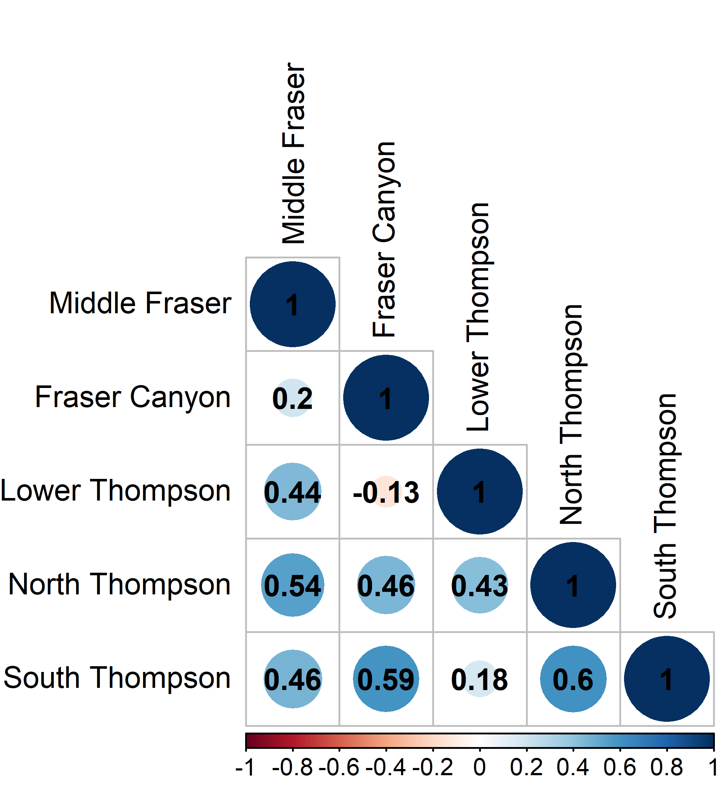

---
output:
  word_document: default
  html_document: default
  pdf_document: default
---
# CASE STUDY 1: INTERIOR FRASER COHO SALMON

## CONTEXT

The Interior Fraser Coho Salmon Stock Management Unit (SMU) includes Coho Salmon that return to the Fraser River and tributaries upstream of Hell’s Gate in the Fraser Canyon. Like most coho salmon, IF Coho spend at least one full year in freshwater as fry before migrating to the ocean as smolts [@arbeiderInteriorFraserCoho2020]. Most (88%) IFC have a 3-year life cycle, in which they leave freshwater in their second year and spend 18 months at sea prior to returning to their natal system to spawn. The remaining 12% have a 4-year life cycle in which they spend an additional year in freshwater before migrating as smolts in their third year. Both 3-year and 4-year life cycles spend 18 months at sea. Less than 1% of IF Coho are believed to return as jacks (precocious mature males that spend only 6 months as sea) or at ages older than 4 years [@arbeiderInteriorFraserCoho2020].

WSP Conservation Units (CUs) have been identified for Interior Fraser Coho based on genetics and geographic separation: Middle Fraser, Fraser Canyon, Lower Thompson, North Thompson, and South Thompson [@dfoWildSalmonPolicy2015; Figure \@ref(fig:coho-map)]. Previous work by the Interior Fraser Coho Recovery Team (IFCRT) identified 11 subpopulations nested within the five CUs, and developed recovery objectives based on maintaining abundance in each of these smaller subpopulation units [@ifcrtinteriorfrasercohorecoveryteamConservationStrategyCoho2006; Table \@ref(tab:cohoCU2SP)]. The delineation of subpopulations was based on several factors, including the presence of natural barriers, the influence of large lakes on downstream discharge and thermal regimes, observations of spawner aggregations under differing discharge conditions, and genetic evidence. The 11 subpopulations are described in detail by the @ifcrtinteriorfrasercohorecoveryteamConservationStrategyCoho2006. 

```{r coho-map, fig.cap="The five Conservation Units that make up the Interior Fraser Coho Stock Management Unit.", out.width = '60%', warning=FALSE, echo=FALSE, fig.align="center"}

```


+-------------------+--------------------------------+
| Conservation Unit | Sub-populations        
+===================+================================+
| Middle Fraser     | - Lower Middle Fraser          
|                   | - Upper Middle Fraser
+-------------------+--------------------------------+    
| Fraser Canyon     | - Nahatlatch          
+-------------------+--------------------------------+ 
| Lower Thompson    | - Lower Thompson          
|                   | - Nicola
+-------------------+--------------------------------+
| North Thompson    | - Lower North Thompson      
|                   | - Middle Thompson
|                   | - Upper North Thompson
+-------------------+--------------------------------+
| South Thompson    | - Adams Drainage      
|                   | - Lower and Middle Shuswap Rivers
|                   | - Shuswap Lake Tributaries
+-------------------+--------------------------------+

Table: (\#tab:cohoCU2SP) Interior Fraser Coho Conservation Units (CUs) and associated sub-populations. Note that the definition of these sub-populations, including mapped boundaries, are provided in @ifcrtinteriorfrasercohorecoveryteamConservationStrategyCoho2006.

### Previous assessments

Declines in IF Coho spawner abundance throughout the 1990’s led to a suite of management actions to promote recovery, including significant fishery restrictions starting in 1998 [@deckerAssessmentInteriorFraser2014]. Evidence of a new, lower productivity regime starting in return year 1994 has been documented [@deckerAssessmentInteriorFraser2014] that coincides with declines in spawner abundances. In 2002, the IF Coho stock management unit was designated 'endangered; by the  Committee on the Status of Endangered Wildlife in Canada (COSWEIC) based on the stock unit being assessed as a single 'Designatable Unit' (DU). Subsequent work by the Interior Fraser Coho Recovery Team (IFCRT) lead to a conservation strategy outlining short-term and long-term recovery objectives for the management unit [@ifcrtinteriorfrasercohorecoveryteamConservationStrategyCoho2006]. In 2014, @deckerAssessmentInteriorFraser2014 assessed status relative to the 2006 IFCRT objectives, and concluded that IF coho had been above the short-term recovery target of in every year since 2008, and above the long-term recovery target in the most recent two return years (2012 and 2013). Also in 2014, Interior Fraser Coho were assessed under the framework of DFO’s Wild Salmon Policy (WSP). The WSP Integrated Status Assessment classified three of these CUs as being amber status (Middle Fraser, Fraser Canyon, South Thompson) and the remaining two CUs as amber/green status (Lower Thompson, North Thompson; [@dfoWildSalmonPolicy2015]). As part of the WSP assessment, $S_{gen}$ was estimated for each CU and used as one of several benchmarks considered when assigning integrated CU status. A subsequent COSEWIC assessment in 2016 upgraded the status designation for the IF Coho DU from 'endangered' to 'threatened' [@cosewic_cosewic_2016]. In 2018, DFO undertook a Recovery Potential Assessment (RPA) for Interior Fraser Coho that described status, habitat, threats, limiting factors to recovery, candidate recovery targets, and abundance projections for the DU, as well as recommendations regarding mitigation and allowable harm [@arbeiderInteriorFraserCoho2020]. 

### History of aggregate-abundance based reference points

Interior Fraser Coho show a strong positive relationship between spatial distribution and overall abundance, which has been used as a basis for identifying aggregate abundance-based recovery targets and reference points for the stock group. Starting in 2006, the IFCRT identified a recovery goal of one or more viable sub-populations in each of the five 'populations', where their definition of populations aligns with CUs under the WSP ([@ifcrtinteriorfrasercohorecoveryteamConservationStrategyCoho2006]; note that from this point on, we use the term CU instead of population when describing IFCRT recovery goals to be consistent with the WSP). The IFCRT identified a short-term recovery objective that the 3-year average escapement in at least half of the sub-populations within each of the five CUs was to exceed 1,000 wild-origin spawning coho salmon, excluding hatchery fish spawning in the wild.  Based on analysis of the relationship between aggregate abundance and the number of CUs that met this objective based on historical data, the IFCRT identified an abundance-based short-term recovery target of 20,000 spawners as the level required to meet their distributional objective. In addition, the IFCRT identified a long-term recovery target of 40,000 spawners, which represented a level that was expected to maintain 1,000 or more wild Coho Salmon in all 11 sub-populations. @deckerAssessmentInteriorFraser2014 updated the IFCRT's original analysis using a longer time series of escapement data. They also quantified the relationship between aggregate abundance and distribution by using a logistic regression to estimate the probability of meeting short-term and long-term recovery objectives as a function of aggregate abundance. The concluded that aggregate spawner abundance levels of 20,000 and 40,000 spawners would result in near 100% probability that the IFCRT’s short-term objective and long-term recovery objectives would be met, respectively. @kormanEvaluationFrameworkAssessing2019 also used logistic regressions of the relationship between the IFCRT's distributional objectives and aggregate abundance when evaluating how exploitation rates and marine survival rates affected the ability of Interior Fraser Coho to meet conservation targets. Their approach was similar to that of @deckerAssessmentInteriorFraser2014, except they applied logistic regressions at the CU-level instead of the SMU-level. Using this approach, they calculated the probability that IFCRT sub-population objectives were met as a function of total escapement to the CU within their simulation evaluation. When evaluating how well conservation targets were met at the MU-level, they chose to rely on the previous values of 20,000 and 40,000 identified by the IFCRT instead of updating these values. Finally, the 2018 RPA used an updated logistic regression to identify a long-term recovery target for Interior Fraser Coho that met the long-term IFCRT objective of 1000 spawners in all sub-populations [@arbeiderInteriorFraserCoho2020]. As a result, @arbeiderInteriorFraserCoho2020 recommended that the long-term recovery target for the stock should be a 3-year geometric mean abundance of 35,935 natural-origin spawners.


## DATA{#cohoData}

Data for this case study cover return years 1998 -2020. Data prior to 1998 were not used due to concerns about inconsistent assessment methods and data quality. All Interior Fraser Coho data were provided by DFO's Fraser River Stock Assessment Unit (M. Arbeider, pers. comm). These data included: (i) annual spawner abundance by CU (1998-2020), (ii) annual recruits-at-age by CU (brood years 1998 - 2016), (iii) a hatchery-based smolt-to-adult survival rate index, (iv) annual exploitation rates, and (v) annual spawner abundances for 11 sub-populations nested within the 5 CUs. Data were similar to those previously described in @arbeiderInteriorFraserCoho2020; data treatments, assumptions, infilling, and data quality are described in detail in that document. More recent updates that are not described in @arbeiderInteriorFraserCoho2020 include the incorporation of three additional years of data (return years 2018-2020; brood years 2014-2016), updates to the smolt-to-adult marine survival rate index to use a weighted average by release size, and increased data quality screening of scale ages used to calculate the proportion of recruits at age (M. Arbeider, pers. comm).

The exploitation rate time series is a large source of uncertainty for Interior Fraser coho. Exploitation rates are only available at the SMU-level, so are assumed constant among all CUs, which is unlikely to be true. Furthermore, models used to reconstruct exploitation rates require a large number of assumptions that are expected to be incorrect [@arbeiderInteriorFraserCoho2020]. Because exploitation rate time series are used to reconstruct spawner-recruit time series, errors in exploitation rates will propagate through to estimates of stock recruitment parameters, relative abundance-based benchmarks such as $S_{gen}$, and covaration in recruitment residuals. Additional sources of uncertainty in Interior Fraser coho data sets include observation errors in spawner abundance estimates and estimates of age-at-maturity. Spawner abundance estimates are largely derived from visual surveys. Scale sampling to determine age structure is incomplete at at the CU-level with small sample sizes, missing data, and limited spatial representation within CUs in some years [@kormanEvaluationFrameworkAssessing2019]


The scale sampling is incomplete as there are years without any scales, others with small sample sizes, and limited spatial representation within CUs.


## CU Status Estimation

We consider three alternative ways to characterize CU status when developing LRPs for Interior Fraser Coho:

1) Multi-dimensional rapid status assessment
2) CU-level abundance relative to $S_{gen}$
3) Distribution related to IFCRT-distributional target

The first approach uses the multi-dimensional rapid scanning tool developed by the State of the Salmon program (Section \@ref(rapidToolMethods)).  This method is used when developing proportion-based LRPs. 

In comparison, both the second and third approaches are primarily used when developing aggregate abundance-based LRPs. The second approach is based on comparing the current abundance of each CU to its CU-specific estimate of $S_{gen}$, where CU status is considered poor when abundance drops below $S_{gen}$. The value of $S_{gen}$ represents the number of spawners required to recover to $S_{MSY}$ (spawners maximum sustainable yield) within one generation, under equilibrium conditions in the absence of fishing [@holt_indicators_2009]. $S_{gen}$ is one of several benchmarks available for assigning mutli-dimensional CU status in WSP Integrated Status Assessments; it represents a lower benchmark between red and amber status zones and was used as part of the 2014 Integrated Status Assessment for Interior Fraser Coho [@dfoWildSalmonPolicy2015].    

The third approach is based on the distribution of spawning escapement among subpopulations nested within CUs (Table \@ref(tab:cohoCU2SP)). We apply this approach for Interior Fraser Coho to maintain consistency with previous recovery planning processes for this SMU (@ifcrtinteriorfrasercohorecoveryteamConservationStrategyCoho2006, @arbeiderInteriorFraserCoho2020). Since the distributional target we use was initially developed by the Interior Fraser Coho Recovery Team in 2006, we refer to it as "IFCRT distributional". Specifically, we use the IFCRT's short-term recovery objective that the 3-year average escapement in at least half of the sub-populations within each of the five CUs is to exceed 1,000 wild-origin spawning coho salmon, excluding hatchery fish spawning in the wild. We selected the short-term recovery target to represent poor CU status in our case study (e.g., below a lower benchmark) because, as noted by @arbeiderInteriorFraserCoho2020, the short-term target was designed as an immediate target when the population was endangered. As such, it was interpreted as a level expected to prevent extinction or loss of genetic diversity.  Note that our decision to maintain this metric as part of our current evaluation does not necessarily mean we are recommending it as a an option for identifying LRPs for this SMU. See Holt et al. (in review) for a detailed guidelines on which benchmarks should be considered for different contexts.


### Estimation of Sgen{#cohoSgen}

Estimates of Sgen are required when assessing CU status using both the multi-dimensional rapid scanning tool and the comparisson of current CU-level abundance to $S_{gen}$. Two different formulations of stock recruitment model were used to estimate $S_{gen}$: (i) a base Ricker model, which includes a marine survival covariate, and (ii) a Ricker_prioCap model in which an informative prior distribution is used to increase SRep compared to the base model. SRep is the spawner abundance level at which the stock replaces itself; the relationship between SRep and Ricker stock recuit model parameters is shown below. Both of these models have been previously developed and applied to Interior Fraser Coho CUs. A third Ricker model, in which both an informative prior on SRep and depensatory mortality were included. was also used by @kormanEvaluationFrameworkAssessing2019 and @arbeiderInteriorFraserCoho2020; however, we did not include it in our case study in order to simplify our analysis.   

@kormanEvaluationFrameworkAssessing2019 and @arbeiderInteriorFraserCoho2020 used a hierarchical model structure for both the base Ricker and Ricker_priorCap models that assumed CU-level productivity parameters were sampled from a common, normal distribution shared by all CUs. Using formal model selection criteria (i.e., DIC), @kormanEvaluationFrameworkAssessing2019 found higher support for the hierarchical structure than when productivity parameters were assumed independent among CUs. However, our initial examination of the hierarchical approach applied to the updated dataset lead us to select the independent CU approach for our evaluation. Firstly, we found that LRP estimates were sensitive to the assumed standard deviation on the hyper-distribution for the productivity parameter. Using the individual model approach avoided needing to make a decision. Secondly, our hierarchical model was unable to converge on an LRP solution in several years between 2015 and 2020, including the most recent year (2020). Thirdly, because all CUs had equal amounts of data, the commonly cited benefit of hierarchical models allowing data-poor systems to borrow information from data-rich systems did not apply. While future stock recruit analyses for Interior Fraser Coho may wish to re-visit the hierarchical model, we do not expect our decision to apply an individual modelling approach here will affect out general conclusions.

The formulations for our two stock recruitment models using the assumption of independent productivity among CUs are described below. 

*Model 1: Ricker*

The base Ricker stock recruit model formulation was:

\begin{equation}
  \hat{R}_{i,a,t} = P_{i,a,t-a}S_{i,t-a}e^{log(\alpha_i) + \gamma log(m_{t-1})-\beta_i S_{i,t-a}e^{v_i}}
   (\#eq:rickerSurv-IM)
\end{equation}
\begin{equation}
  v_i \sim Normal(0,\sigma_{v_i})
\end{equation}


TO DO: Need to add lognormal bias correction factor to equations!!!!!!!!!!!!!!!!!

where,

$\hat{R}_{i,a,t}$ = the predicted number of natural origin recruits from CU $i$ of age $a$ returning in year $t$ (i.e., recruits that were produced by escapement in brood year $t-a$)

$P_{i,a,t-a}$ = the proportion of recruitment from CU $i$ returning at age $a$ from brood year $t-a$

$S_{i,t-a}$ = spawners from CU $i$ in brood year $t-a$

$\alpha_i$ = productivity parameter for CU $i$

$\gamma$ = marine survival co-efficient shared among CUs

$m_{t-1}$ = hatchery marine survival index (smolt-to-adult) for sea entry in year t-1

$\beta_i$ = density dependent term describing the rate of decrease in log-survival for CU $i$ with increasing spawner abundance

$\sigma_{v_i}$ = standard deviation of process error on recruitment deviations

This model formulation is similar to the Ricker model used in @arbeiderInteriorFraserCoho2020, but without a hierarchical structure imposed on $log(\alpha_i)$. We placed the following non-informative constraints on the likelihood function to replicate the Bayesian model fitting routine of @arbeiderInteriorFraserCoho2020:

\begin{equation}
  \gamma \sim Normal(0,10)
\end{equation}
\begin{equation}
  \sigma_{v_i} \sim Inverse Gamma (0.1,0.1)
\end{equation}


*Model 2: Ricker_priorCap*

To maintain consistency with this previous work on Interior Fraser Coho, we also consider a version of the Ricker model that uses an informative prior distribution on $S_{REP}$ to increase carrying capacity.  @kormanEvaluationFrameworkAssessing2019 suggested that the Ricker model with a survival co-variate (Model 1) over-estimated compensatory dynamics at high spawner abundances when applied only to data from 1998 onwards.  They noted that spawner abundances since 1998 have been much lower than historic levels.  Given that sparse data at high spawner abundances makes it difficult to estimate carrying capacity, base Ricker estimates of carrying capacity may be unreliable [@kormanEvaluationFrameworkAssessing2019]. Furthermore, they observed that one brood line had persisted at a relatively higher and more stable spawner abundance than the other two brood lines, which they viewed as evidence for a higher capacity than the base Ricker model estimates. Based on these concerns, @kormanEvaluationFrameworkAssessing2019 proposed an alternative Ricker model that used an informative prior distribution to increase carrying capacity (represented as the spawner abundance at which the stock replaces itself, $S_{REP}$). @arbeiderInteriorFraserCoho2020 followed the approach of [@kormanEvaluationFrameworkAssessing2019] by considering both the base Ricker model and a version of the Ricker model with an informative prior distribution on $S_{REP}$ to be plausible when providing management advice.


\begin{equation}
  \beta_i = \frac{\alpha_i + \gamma + log(\overline{m})}{S_{REP,i}}
   (\#eq:beta-Srep)
\end{equation}
\begin{equation}
  S_{REP,i} \sim Normal(\mu_{SREP},\sigma_{SREP})
\end{equation}


@arbeiderInteriorFraserCoho2020 and @kormanEvaluationFrameworkAssessing2019 set $mu_{SREP}$ at 1.5 times the $S_{REP}$ value estimated from the base model fit without a prior on $S_{REP}$. For our integrated Sgen-LRP model fits (described in section xxx), we found that we needed to constrain $mu_{SREP}$ at no more than 1.4 times the $S_{REP}$ value to achieve model convergence, so we used the 1.4 times expansion instead.  We set $\sigma_{SREP}$ at $\sqrt{2} * 1000 = 1414$ spawners, which is the same value used by @arbeiderInteriorFraserCoho2020. Note that the "$* 1000$" term is used to correct for scaling spawner abundance by 1/1000 when fitting models. @arbeiderInteriorFraserCoho2020 parameterized the distribution in terms of precision ($\tau$), where $\tau = \frac{1}{\sigma^2} = 0.5$. The effect of adding the prior on $S_{REP}$ when fitting individual models to available data is shown in Figure \@ref(fig:coho-SR-fit).    


```{r coho-SR-fit, fig.cap="Stock recruit curves fit to spawner and recruitment data using individual models for each CU. Solid black lines shows the MLE fit for the base Ricker model while solid blue lines shows the MLE fit for the Ricker\\_priorCap model.  Associated black and blue shaded regions show the 95 percent confidence intervals on respective model fits. The red line show the replacement line.", warning=FALSE, echo=FALSE, fig.align="center"}
knitr::include_graphics("figure/coho-compareSRFits-IM.png")
```


## LRP Estimation: Proportion of CUs
### Methods

We looked at the proportion of CUs that had multi-dimensional rapid status assessments above the red zone to determine in which years between 1998 and 2020 the LRP would have been breached. Status was assessed as being below the LRP in years in which one or more CUs assessed as having red status. Both Ricker model formulations described above were used to estimate relative abundance-based benchmarks (lower benchmark = $S_{gen}$ and upper benchmark = 0.8$S_{MSY}$) when assessing multi-dimensional rapid stats: the base Ricker model and the Ricker_priorCap model. Estimates of $S_{gen}$ and $S_{MSY}$were made using all data available up to 2020, so our evaluation is not a true retrospective analysis in which only the data available up to each year in a time series are used to estimate status. 

For comparison, we also looked at the proportion of CUs that were below $S_{gen}$ in each year and the proportion of CUs that failed to meet the IFCRT distributional target of at least half of all sub-populations within each CU having more than 1000 spawners. 

\linebreak

### Results

Estimates of $S_{gen}$ based on the Ricker_priorCap model were higher than those based on the base Ricker model for four of the five CUs (Middle Fraser, Lower Thompson, North Thompson, and South Thompson) and were approximately equal for the fifth CU (Fraser Canyon; Appendix ...). As a result, generational average spawning abundances  was more likely to drop below $S_{gen}$ when it was estimated using the Ricker_priorCap. Under the base Ricker model formulation, generational average spawning abundance remained above $S_{gen}$ for all years between 2000 and 2020 (Figure \@ref(fig:coho-CU-multiDim-Ricker)).  In comparison, under the Ricker_priorCap formulation, generational average abundance dropped below $S_{gen}$ in one or more years for Lower Thompson CU (2006), Middle Fraser CU (2006, 2008), and South Thompson CU (2000, 2006, 2007, 2015; Figure \@ref(fig:coho-CU-multiDim-Ricker-Cap)). As a result, at least one CU had stock status assessed as below $S_{gen}$ for 5 of the 21 years between 2000 and 2020.

When CU status was assessed using the multidimensional scanning tool with abundance-based benchmarks based on $S_{gen}$ and 0.8$S_{MSY}$ used as inputs, CU status was always assessed as red for years in which the generational average spawning abundance dropped below $S_{gen}$, regardless of which stock recruit model was used to estimate benchmarks (Figures \@ref(fig:coho-CU-multiDim-Ricker), \@ref(fig:coho-CU-multiDim-Ricker-Cap)). This result occurs because because according to the  multidimensional decision tree (Figure \@ref(fig:decision-tree), status is derived from abundance-based benchmarks in most years, which means that being below $S_{gen}$ is most often the trigger for a red CU status assessment. An exception to this occurs in the Fraser Canyon CU in years 2015-2017.  In these years, the generational average of absolute spawning abundance is < 1500 spawners, which means that the CU is assigned red status under the first node of the decision tree even though spawning abundances are above $S_{gen}$ (Figure \@ref(fig:decision-tree)). As a result, when multidimensional status was assessed using abundance-based benchmarks estimated from the base Ricker model, a proportion-based LRP for the SMU would have been breached in 3 of 21 years (2015-2017) based on Fraser Canyon spawning abundances dropping below 1500 spawners in theses years.  When mutlidimensional status was assessed using abundance-based benchmarks from the Ricker-priorCap model, a proportion-based LRP would have been breached in 7 of 21 years (2000, 2006-2008, 2015-2017) based on a combination of spawning abundances < 1500 in the Fraser Canyon CU and spawning abundances < $S_{gen}$ in other CUs. Multidimensional status based on the rapid screening tool was above red for all CUs in the most recent year, 2020, indicating that the SMU is currently above a proportion-based LRP.

```{r coho-CU-multiDim-Ricker, fig.cap="Escapement time series for five Interior Fraser Coho CUs shown as annual escapements (lines) and 3-year geometric mean escapements (dots). Grey dots indicate years in which all CUs had multi-dimensional rapid status assessments above red when Sgen was estimated using the Ricker model, while red dots indicate years in which one or more CUs had multi-dimensional status assessments in the red zone, which would trigger a breach of the LRP. Solid orange lines show estimates of Sgen from the Ricker model for comparison.", warning=FALSE, echo=FALSE, fig.align="center"}
knitr::include_graphics("figure/coho-CU-EscpSeries-wMultiStatus-Ricker.png")
```

```{r coho-CU-multiDim-RickerCap, fig.cap="Escapement time series for five Interior Fraser Coho CUs shown as annual escapements (lines) and 3-year geometric mean escapements (dots). Grey dots indicate years in which all CUs had multi-dimensional rapid status assessments above red when Sgen was estimated using the Ricker_priorCap model, while red dots indicate years in which one or more CUs had multi-dimensional status assessments in the red zone, which would trigger a breach of the LRP. Solid orange lines show estimates of Sgen from the Ricker_priorCap model for comparison.", warning=FALSE, echo=FALSE, fig.align="center"}
knitr::include_graphics("figure/coho-CU-EscpSeries-wMultiStatus-Ricker-Cap.png")
```


```{r coho-Subpop-timeseries, fig.cap="Escapement time series for 11 subpopulations of Interior Fraser Coho shown as annual escapements (lines) and 3-year geometric mean escapements (dots). Gray dots shows years in which the 3-year geometric mean escapement was above the 1000 fish threshold used to assess distributional status, while red dots show years in which the 1000 fish threshold was not met.  CUs to which each subpopulation belong to are shown in Table --", warning=FALSE, echo=FALSE, fig.align="center"}
knitr::include_graphics("figure/coho-Subpop-EscpSeries-wStatus.png")
```

As a point of comparison, if a proportion-based LRP was based on all CUs being above the IFCRT distributional target, the LRP would have been breached in 4 of the 21 years between 2000 and 2020. Eight of the 11 sub-populations had generational average escapement drop below the 1000 spawner threshold in one or more years (Figure \@ref(fig:coho-Subpop-timeseries)). Sub-populations tended to differ in which years they dropped below the 1000 spawner threshold, which meant that the distributional target at least half of the subpopulations within each CU with greater than 1000 fish was more often met than not. All 11 subpopulations had generational average spawning abundances above 1000 spawners in 2020, indicating that the stock would be well above a proportion-based LRP based on the IFCRT-distributional target (Figure \@ref(fig:coho-Subpop-timeseries)).


## LRP Estimation: Aggregate Abundance Logistic Regression LRPs 
### Methods

We evaluated aggregate abundance-based LRPs derived using logistic regressions with two of the Interior Fraser Coho benchmark considered: $S_{gen}$ and the IFCRT-distributional target. Because two different spawner recuit models were used to estimate $S_{gen}$, we distinguish these models as 'Sgen:LRP' and 'Sgen_priorCap:LRP' for the Ricker and Ricker_priorCap models, respectively. See Section \@ref(logisticMethods) for an overview of the approach used to calculate aggregate abundance-based LRPs using logistic regression.

When estimating logistic regression LRPs using $S_{gen}$, we used an integrated modelling approach in which CU-level $S_{gen}$ and the SMU-level LRP were simultaneously estimated. The integrated Sgen-LRP models had two components: 
(i)	Stock-recruit models fit to each of the 5 CUs to estimate CU-level Sgen (Equation \@ref(eq:rickerSurv-IM) and Equations \@ref(eq:adjProd) - \@ref(eq:Sgen))
(ii)	A logistic regression model fit to aggregated data to estimate the LRP as the aggregate abundance that has historically been associated with a specified probability of all CUs being above Sgen (Equations \@ref(eq:logistic) - \@ref(eq:logisticLRP))


***Retrospective Analysis***

We used retrospective analyses to examine the effect of time series length on logistic regression-based LRP estimates. Retrospective analyses were restricted to the most recent 6 years (2015-2020) because logistic model fits prior to 2015 were unable to converge on an LRP estimate.  For each year between 2015 and 2020, we used data only available up to that year to calculate LRPs and associated confidence intervals.

To examine the effect of missing CUs on retrospective LRP estimates, we calculated LRPs using data from only a subset of the five Interior Fraser Coho CUs. We limited our analysis to missing data from either one or two CUs so that we had at least three CUs of available data when calculating the proportion of CUs above their benchmarks.For each missing data case, we calculated SMU status as

\begin{equation}
  Status_t = \frac{\sum_{i}^{nCUs} S_{i,t}}{LRP'_t}
   (\#eq:status)
\end{equation}

where $nCUs$ is the number of CUs being used (3 or 4) and $LRP'_t$ is the LRP calculated in year $t$ using only data from $nCUs$.  SMU-level status in a given year was calculated for all possible combinations of CUs available (5 combinations when nCUs = 4 and 10 combinations when nCUs = 3) to allow examination of the stability of status estimates among available combinations. Estimates of SMU status relative to LRPs were used to compare among missing CU scenarios instead of actual LRP estimates because the magnitude of the LRP will vary with the number (and combination) of CUs used.


### Results


***LRP Estimates***

Logistic regression model fits in 2020 from the integrated Sgen:LRP and Sgen_priorCap:LRP models are shown in Figures \@ref(fig:coho-IM-logisticFit2020) and \@ref(fig:coho-IMCap-logisticFit2020), respectively. The logistic regression model fit to status estimates based on the IFCRT-distributional benchmark is shown in Figure \@ref(fig:coho-Distr-logisticFit2020). 


To Add: Appendix: Maximum posterior density estimates (± standard error) obtained from fitting the ‘Individual Ricker’ (IM) version of the Integrated Sgen-LRP model to Interior Fraser Coho data.

To Add: Appendix: Maximum posterior density estimates (± standard error) obtained from fitting the ‘Individual Ricker with cap’ (IM.cap) version of the Integrated Sgen-LRP model to Interior Fraser Coho data.


All three logistic regression-based LRP methods were able to converge on a solution in 2020. Resulting LRPs for different $p^*$ thresholds are shown on the regression curves, as well as in Table \@ref(tab:logisticLRPs2020). There was however considerable uncertainty around predicted curves as seen in the large areas of gray shading in Figures \@ref(fig:coho-IM-logisticFit2020) - \@ref(fig:coho-Distr-logisticFit2020). 


```{r coho-IM-logisticFit2020, fig.cap="Logistic regression fit from the integrated Ricker LRP model using data from 1998 - 2020. The yellow vertical line shows the LRP estimate based on the requirement of a 50\\% probability of all CUs being above Sgen, while the yellow shaded region shows the associated 95\\% confidence interval around the LRP. LRPs (MLE estimates only; no confidence intervals) for three alternative probability thresholds, 66\\%, 90\\%, and 99\\%, are shown in blue, green, and orange, respectively.", warning=FALSE, echo=FALSE, out.width = '50%', fig.align="center"}
knitr::include_graphics("figure/coho-IM2020-LogisticLRP.png")
```

When the Sgen:LRP model was used, aggregate abundance-based LRPs ranged from 15,395 to 24,331 spawners, depending on whether the required probability of all CUs being above Sgen was moderate (50%) or very likely (99%) (Table \@ref(tab:logisticLRPs2020)). LRPs increased across all probability levels when the carrying capacity was assumed higher under the Sgen_priorCap:LRP model (Table \@ref(tab:logisticLRPs2020)). The higher $S_{gen}$ values for most CUs under this alternative model formulation resulted in more historical years in which < 100% of CUs were above Sgen. Several years with aggregate abundances between 19,000 - 30,000 spawners that had met the threshold of all CUs > Sgen using the IM model no longer met this threshold, resulting in a shift of the fit curve to the right and higher LRP estimates. LRPs based on the Sgen_priorCap:LRP model ranged from 25,677 to 40,784 spawners, depending on whether the required probability of all CUs being above Sgen was moderate (50%) or very likely (99%).

```{r coho-IMCap-logisticFit2020, fig.cap="Logistic regression fit from the integrated Ricker\\_priorCap LRP model using data from 1998 - 2020. See Figure x caption for additional details.", warning=FALSE, echo=FALSE, out.width = '50%', fig.align="center"}
knitr::include_graphics("figure/coho-IMCap2020-LogisticLRP.png")
```

When CU status was based on the IFCRT short-term distributional target, the fit logistic curve was more gradual than the two Sgen models due to a greater overlap in 'successful' (all CUs > distributional target) and 'unsuccessful' (<100% of CUs above distributional target) years at low to moderate aggregate abundances.  In 3 of the 6 years with aggregate abundances below 20,000 spawners, the distributional target was not met for all CUs (Figure \@ref(fig:coho-Distr-logisticFit2020)). As a result, LRPs based on the IFCRT short-term distributional target were more uncertain than those based on Sgen. LRPs based on this model also became increasingly large at high probability thresholds (Table \@ref(tab:logisticLRPs2020). The LRP based on a 50% probability that all CUs would be above their distributional targets was 17,515 spawners (95% CI = 9,695 - 25,336) while the LRP based on a 99% probability was 44,403 spawners (95% CI = 15,102 - 73,703). 


```{r coho-Distr-logisticFit2020, fig.cap="Logistic regression fit from the IFCRT-distributional LRP model using data from 1998 - 2020. See Figure x caption for additional details.", warning=FALSE, echo=FALSE, out.width = '60%', fig.align="center"}
knitr::include_graphics("figure/coho-ThreshAb2020-LogisticLRP.png")
```

+-------------+-----------------+-------------------+-----------------+
| Probability | Sgen:LRP        | Sgen_priorCap:LRP | Dist:LRP
+=============+=================+===================+=================+
| 50%         | 15,395          | 25,677            | 17,515
|             | (11,187-19,603) | (20,683-30,672)   | (9,695-25,336)
+-------------+-----------------+-------------------+-----------------+             
| 66%         | 16,685          | 27,858            | 21,396
|             | (12,454-20,916) | (21,674-34,042)   | (13,418-29,375)
+-------------+-----------------+-------------------+-----------------+  
| 90%         | 19,668          | 32,901            | 30,372
|             | (13,752-25,584) | (22,257-43,544)   | (15,711-45,033)
+-------------+-----------------+-------------------+-----------------+
| 99%         | 24,331          | 40,784            | 44,403
|             | (13,924-34,738) | (21,957-59,610)   | (15,102-73,703)
+-------------+-----------------+-------------------+-----------------+

Table: (\#tab:logisticLRPs2020) Aggregate abundance based LRPs (with 95% confidence intervals) from three different logistic regression-based LRP models. For each probability level, the LRP estimate represents that probability that all CUs will be above their lower benchmark.


***Logistic Regression Diagnostics***

Logistic regression diagnostics showed  that key regression assumptions were met, and that model fits were strong enough to support estimation of logistic regression-based LRPs from all three models(Table @ref(tab:logisticDiagIFC2020)). Assumptions of linearity and lack of influential outliers were met for all models. The assumption of linearity was demonstrated based on the Box-Tidwell test. This test evaluates the significance of adding a non-linear interaction term to the logit regression. We found that this additional interaction term was not significant, supporting the linearity assumption. An examination of deviance residuals did not show any large outliers, i.e. no residual values were greater than 2. Observations were independent at all year lags examined for the Sgen_priorCap:LRP and Dist:LRP models. For the Sgen:LRP model, observations were independent at 1 and 2-year lags and marginally significant at a  3-year lag suggesting generational-scale trends (Figure @ref(fig:coho-logisticACF-IM)). The Wald Test showed that logistic model coefficient for aggregate abundance was marginally significant (p < 0.10). Quasi-$R^2$ statistics indicated a moderately strong relationship between aggregate abundance and the probability of all CUs being above their lower benchmarks, and the goodness of fit statistics indicated a significant fit of the model with aggregate abundance relative to the null model based on p-values less than 0.01. Finally, 'out-of-sample' hit ratios representing classification accuracy as the proportion of successful predictions when one year of data was iteratively left out of the model fit, were relatively high at low probability thresholds, indicating good accuracy. This results was especially true for the Sgen:LRP model which had a hit ratio of 0.95 at probability thresholds of 50% and 66%. Classification accuracy was lowest for all models at the 99% probability threshold.

Sample sizes were small due to the short time series available for Interior Fraser Coho; only 23 years of observations were available to fit logistic regression models. @peduzzi_simulation_1996 recommend a minimum requirement of 10 data points for the least frequent outcome based on their simulation studies in the field of clinical epidemiology. In our case, the least frequent outcome was the failure of all CUs to be above their benchmarks (i.e., 0). We were not able to make this minimum requirement for any of our model fits; we had only 3, 9, and 5 data points at the least frequent outcome for the Sgen:LRP, Sgen_priorCap:LRP, and Dist-LRP models, respectively.  Based on the current ratio of successes and fails in the data, the estimated minimum sample sizes that would be required to meet the criteria of @peduzzi_simulation_1996 ranged from 26 to 77 years. However, despite small sample sizes, hit ratios are high for all models at p = 50%.  As a result, we suggest that logistic regression-based LRPs may still be useful for this SMU.  We proceeded with retrospective analyses in order to examine how sensitive LRPs based on these model fits were to variations in the level of available data.

+-------------------------+--------------+-------------------+-----------------+
| Diagnostic Test         | Sgen:LRP     | Sgen_priorCap:LRP | Dist-LRP
+=========================+==============+===================+=================+
| Box-Tidwell p-value     | 0.81         | 1.0               | 0.79
+-------------------------+--------------+-------------------+-----------------+     
| Max. deviance residual  | 1.52         | 1.68              | 1.66
+-------------------------+--------------+-------------------+-----------------+  
| AR-1                    | -0.20        | 0.16              | 0.05
+-------------------------+--------------+-------------------+-----------------+
| Wald p-values           | 0.09^*       + 0.08^*            + 0.09^*
+-------------------------+--------------+-------------------+-----------------+
| Goodness-of-fit p-value | <0.01        | <0.01             | <0.01
+-------------------------+--------------+-------------------+-----------------+
| Quasi-$R^2$             | 0.68         | 0.63              | 0.41
+-------------------------+--------------+-------------------+-----------------+
| Hit Ratio (p= 50%,      | 0.91, 0.91   | 0.87, 0.91,       | 0.76, 0.81,
| 60%, 90%, 99%)          | 0.91, 0.74   | 0.87, 0.78        | 0.76, 0.52
+-------------------------+--------------+-------------------+-----------------+

Table: (\#tab:logisticDiagIFC2020) Model diagnostic statistics from Sgen:LRP, Sgen_priorCap:LRP, and Dist-LRP model fits. A description of diagnostic tests is provided in Section …  Hit ratios are shown for all four probability thresholds considered.  The symbol '*' indicates a result that only marginally met the recommended criteria for demonstrating good model fit.


```{r coho-logisticACF-IM, fig.cap="Autocorrelation in aggregate spawner abundance at 1- to 10-year lags for the Integreated Sgen:LRP model. Orange dashed lines inidcate whether autocorrelations are significantly different from zero based on a 95\\% confidence interval", warning=FALSE, echo=FALSE, out.width = '50%', fig.align="center"}

```


***Retrospective Analysis***


2015 was the first year in which the available IFC time series was long enough to estimate logistic regression-based LRPs using the integrated Sgen_priorCap and Dist:LRP models. The Sgen:LRP model required an additional 2 years of data before LRP estimates were first available in 2017. As a result, only 4-6 years of retrospective analyses were available, depending on the model being considered. All three models showed some fluctuations in LRP estimates over time (Figure \@ref(fig:coho-IM-retroLRPs)). The IFCRT-distributional model tended to produce the most stable LRPs over time while the Sgen_priorCap model estimated a relatively consistent increase in LRPs over the time. 


```{r coho-retroLRPs, fig.cap="Three-year geometric mean of aggregate spawning abundance for the Interior Fraser Coho SMU (black line) and associated time series of retrospective LRPs from logistic regression-based estimation methods. LRPs are based on a 50\\% probability that all CUs will be above their lower benchmarks. Annual LRP estimates are shown as maximum likelihood values (coloured lines) and associated 95\\% confidence intervals (shaded areas).", warning=FALSE, echo=FALSE, out.width = '50%', fig.align="center"}
knitr::include_graphics("figure/coho_LRP_compareRetro.png")
```


When Sgen:LRP model was applied retrospectively to missing data scenarios with four out of the five CUs, only a subset of scenarios had LRP estimates that converged on a solution (Figure \@ref(fig:coho-IM-missingCUs)). Four of the five possible combinations of four CUs had estimates in 2017, while only three had estimates in 2019 and 2020. For scenarios in which LRP estimates were possible, status estimates were often close to the estimate obtained when all 5 CUs were used, and always fell within the 95% confidence interval of the full data estimate. The Sgen:LRP model was less likely to converge on a solution when data from only three CUs were used. This pattern was especially true for 2019 and 2020 when only 4 out of the 10 possible combinations had estimates. For scenarios that were able to converge, status estimates from 3 CUs tended to be more uncertain than 4- and 5-CU estimates, and showed larger deviations from estimated status when all CUs were used. One missing data scenario in 2018 had a status estimate that fell outside of the 95% confidence interval of the full data estimate.  
 
```{r coho-IM-missingCUs, fig.cap="Retrospective estimates of aggregate status (with 95\\% confidence intervals) from the Sgen:LRP  model under different scenarios about missing CUs, where status is characterized as the recent generational mean of aggregate abundance / LRP. LRPs are based on a 50\\% probability that all CUs will be above their lower benchmarks. The set of status estimates associated with each number of CUs on the x-axis represents all possible combinations of CUs created by selecting that number from the 5 available CUs.  Red dashed lines show the maximum likelihood estimate when no data is missing (i.e., all 5 CUs) for comparison with the missing data scenarios.", warning=FALSE, echo=FALSE, out.width = '60%', out.height = '30%', fig.align="center"}
knitr::include_graphics("figure/coho-StatusByNCUs-IndivRickerSurv-50.png")
```

When the Sgen_prioCap:LRP model was applied to missing data scenarios in which four out of five CUs had data, status estimates were only available for two of the five CU combinations in all 6 retrospective years (Figure \@ref(fig:coho-IMCap-missingCUs)). For the two scenarios in which LRP estimates were available, status was poorly estimated with the estimate often falling outside of the 95% confidence interval of the full data estimate. While convergence was more frequent when only 3 CUs were used, estimates had high uncertainty and were variable among scenarios. Several of the status estimates from 3-CU scenarios fell outside of the 95% confidence interval for the full data case.      

```{r coho-IMCap-missingCUs, fig.cap="Retrospective estimates of aggregate status (with 95\\% confidence intervals) from the Sgen\\_priorCap:LRP model under different scenarios about missing CUs, where status is characterized as the recent generational mean of aggregate abundance / LRP. LRPs are based on a 50\\% probability that all CUs will be above their lower benchmarks. See Figure xx caption for more details.", warning=FALSE, echo=FALSE, out.width = '60%', fig.align="center"}
knitr::include_graphics("figure/coho-StatusByNCUs-IndivRickerSurvCap-50.png")
```

LRPs based on the IFCRT-distributional benchmark could be estimated for all 4-CU missing data scenarios in all years (Figure \@ref(fig:coho-distributional-missingCUs)). Resulting estimates of SMU status were similar to the full data estimate for four of the five CU combinations. Status estimates were highest and most uncertain when the South Thompson CU was dropped from the analysis (i.e., the last of the five 4-CU combinations shown for each year in Figure \@ref(fig:coho-distributional-missingCUs)). This pattern is due the 2015 data point for South Thompson CU being an influential observation that has a large impact on the shape of the fit model. For missing data scenarios in which only three CUs were included, status estimates often had higher uncertainty than the 4 CU or full data scenarios, and showed high variability among scenarios in estimated status.    


```{r coho-distributional-missingCUs, fig.cap="Retrospective estimates of aggregate status (with 95\\% confidence intervals) from the Dist:LRP model under different scenarios about missing CUs, where status is characterized as the recent generational mean of aggregate abundance / LRP. LRPs are based on a 50\\% probability that all CUs will be above their lower benchmarks. See Figure xx caption for more details.", warning=FALSE, echo=FALSE, out.width = '60%',  fig.align="center"}
knitr::include_graphics("figure/coho-StatusByNCUs-SPopAbundThreshST-50.png")
```


## LRP Estimation: Aggregate Abundance Projection-Based LRPs


### Methods

Forward projections of each of the five CUs with the Interior Fraser Coho SMU were done using the `samSim` modelling tool (Appendix \@ref(app:samsim-appendix)). Parameters characterizing population dynamics, marine survival rates, and exploitation rate were derived directly from data sets described in Section \@ref(cohoData). Base case parameters and alternative parameter values tested in sensitivity analyses are provided in Table \@ref(tab:coho-BaseProjectPars). Additional details on key model parameterizations and sensitivity analyses are also described in text below. Projection model outputs were used to estimate projection-based LRPs using the methods described on Section \@ref(projectedMethods).


TO DO: Need to say number of year and number of NTrials


*Stock recruitment dynamics*

Stock recruitment parameters for all five CUs were drawn from joint posterior distributions obtained by fitting the two stock recruit models described in Section \@ref(cohoSgen) (Ricker and Ricker_priorCap) to available spawner-recruit data using Bayesian Markov Chain Monte Carlo (MCMC) estimation. Bayesian estimation was done using tmbStan (Kristensen 2019), which is an R package that allows MCMC samples to be drawn from a TMB model object using rStan (Guo et al. 2020). Three MCMC chains were run for 14,000 iterations, with the first half of each chain excluded from the final posterior sample. Resulting joint posterior distributions included 21,000 samples. Posterior sampling was initiated at the MLE estimates for each model formulation. Neither model showed signs of convergence failure based on our examination of Rhat and effective sample size diagnostics, as well as visual inspections of marginal posterior distributions. Marginal posterior distributions for each of the four stock recruitment parameters ($\alpha$, $\beta$, $\gamma$, and $\sigma$) are provided in Appendix xx. 

The two stock recruitment models, Ricker and Ricker_priorCap, were treated as two alternative hypotheses about stock recruitment dynamics, which we refer to as operating models.


*Covariance in recruitment residuals*

We parameterized correlations in recruitment residuals among CUs from MLE predictions of pairwise correlations from spawner recruit model fits. The correlation matrix from the base Ricker model fit is shown in Figure \@ref(fig:coho-recruitResid-Ricker). Correlation values for the Ricker_priorCap model were similar (not shown).    

We initially attempted to reduce covariation in spawner abundances among CUs by scaling correlations in recruitment residuals (i.e., scalar < 1). However, we found that scalars had little effect on projected correlations in spawner abundances among CUs due to the shared marine rate coefficient dominating among-CU variability in recruitment. We therefore used sensitivity analyses of the level of variability in marine survival coefficents among CUs to drive patterns of covariation in spawner abundance, as described below. This approach differs from that taken for WCVI Chinook (Section \@ref(WCVIchinookChapter).


```{r coho-recruitResid-Ricker, fig.cap="Bubble plot of correlations in recruitment residuals among CUs from base Ricker model fit.", warning=FALSE, echo=FALSE, out.width = '50%',  fig.align="center"}

```


*Variability in marine survival coefficient among CUs*

When fitting spawner recuit models to data, we followed the approach of @kormanEvaluationFrameworkAssessing2019 and @arbeiderInteriorFraserCoho2020 in assuming that all CUs experienced the same marine survival rate for given sea-entry year, and that the marine survival coefficient, $\gamma$, was constant both among CUs and among years.  When projecting CUs forward, we maintained this assumption in our base case by generating a single marine survival rate for each sea entry year and setting $\sigma_{\gamma}$ = 0, where $\sigma_{\gamma}$ is the standard deviation of among-CU variability in $\gamma$ such that $\gamma_i \sim Normal(\bar{\gamma}, \sigma_{\gamma})$. We used sensitivity analyses on $\sigma_{\gamma}$ to test the effect of changes in recruitment covariation among CUs on projected LRP estimates. Four alternative levels of $\sigma_{\gamma}$ were used in sensitivity analyses: $\sigma_{\gamma}$ = 0.0225, 0.045, 0.0675, and 0.09. We selected these levels to cover a range between 0 and 0.09, where 0.09 was the standard deviation of the estimated marginal posterior distribution for $\gamma$ from our Ricker stock recruitment model fit. 

The resulting correlations in spawner abundances from the projections are shown in figure ....


*Covariance in exploitation*

We assumed an average exploitation rate of 12.5% for all CUs in forward projections, with common interannual variability in exploitation rates due to shared fishery impacts among CUs each year. Interannual variability in exploitation rates was assumed to be beta distributed (constrained between 0 and 1), with the standard deviation of the beta distribution parameterized from estimated exploitation rates for 1998 - 2016 brood years. The corresponding coefficient of variation (CV) for interannual variability was 0.44.

Exploitation rates for Interior Fraser Coho are only available at the SMU-level due to limited coded-wire indicator stocks (1-2 CUs with indicators / year) and variation in which indicator stocks were operational in a given year. As a result, empirically-based estimates of among-CU variability in exploitation rates are not possible. However, there are reasons to expect that exploitation rates to vary among CUs in a given year, including variable mortality in mark-selective fisheries due to variation among CUS in the proportion of hatchery marked fish and differences in freshwater fisheries.  We assumed that CU-specific variability in exploitation rates was half the common (SMU-level) interannual variability (cv=0.22), and varied this in sensitivity analyses from 0 and 0.44 to cover plausible bounds.  

<!--
From Chinook:
In the forward projections, pairwise correlations in projected spawner abundances among inlets were similar to observed pairwise correlations in spawner abundances among inlets (Figure \@ref(fig:chinook-boxplotscvER)). Varying assumptions about variability in exploitation among inlets between cv= 0 and 0.17 did not impact the distribution of correlations in spawner abundances in the projections.  

For coho: can I include plots that show this as well??

-->


*Variability in age proportions of recruits among CUs*

Annual variability in the age structure of returns was generated from a multivariate logistic distribution parameterized using CU-specific time series of proportions at age. The underlying average age structure for each CU was set at the average from the available time series (brood years 1998 - 2016), while annual deviations from underlying age-specific means were drawn from a multivariate logistic distribution. Annual deviations were held constant among all CUs; however, the scale of annual deviations was controlled by the variability parameter $\tau$, which was estimated individually for each CU. This meant that while all CUs simultaneously experienced increases or decreases in a given year, the magnitude of the increase or decrease was CU-specific. Annual deviations were held constant among CUs to represent the strong co-variation in proportions at age seen in available time series for Interior Fraser Coho, especially since 2010 (Figure \@ref(fig:coho-recruitResid-Ricker)).  When the constraint of constant annual deviations was removed, generated proportion at age data was much more variable than observed data.  

Annual variability in the age structure of recruits has not been included in other recent projection analyses for this SMU. Both @kormanEvaluationFrameworkAssessing2019 and @arbeiderInteriorFraserCoho2020 assumed a constant age structure over time.
 
```{r coho-ageProp, fig.cap="Proportion of recruits returning at age 3 for 1998 - 2016 brood years. Only two age classes (age 3 and age 4) are present in the age structure, so the proportion of recruits returning at age 4 will account for the remainder of returns in each year.", warning=FALSE, echo=FALSE, out.width = '50%',  fig.align="center"}
knitr::include_graphics("figure/coho-ObsAgeProp-byCU.png")
```


\begin{longtable}[]{p{3.7cm} p{5cm} p{6.3cm}}
\caption{Parameters used for CU-specific projections of Interior Fraser Coho population dynamics.}\\
\hline
Parameter & Value & Source \\ 
\hline
\endhead
\hline
 Ricker Parameters ($\alpha$, $\beta$, $\gamma$,$\sigma$)  &  CU-specific (Appendix \@ref(coho-Appendix)) & Drawn from joint posterior from MCMC model fit to 1998-2016 brood years
\\\\

Smolt-to-adult marine survival rate (all CUs) & Drawn from Lognormal(-4.83, 1.21), bound between [-9.21, -3.32]
 & Estimated from annual marine survival rate estimates from brood years 1998 - 2016, with bounds set at lowest and highest observations
\\\\  

 Among-CU variability in marine survival coefficient $\gamma$  &  $\sigma_{\gamma}$ = 0 (all CUs the same) & Assumed value when fitting models. Varied between 0 and 0.09 in sensitivity analyses, where upper limit of 0.09 is the standard deviation of the estimated marginal posterior distribution for $\gamma$. 
\\\\

 Ave age proportions at maturity (ages 3, 4) &  MiddleFR, LThomp, SThomp = (0.86,0.14) , FRCanyon = (0.87, 0.13), NThomp = (0.88, 0.12) & Estimated from time-series of ppns of recruits at age
 \\\\  

 Interannual variability in age proportions (tau from multivariate logistic distribution)  & MiddleFR, NThomp, SThomp = 1.0, LThomp = 0.9, FRCanyon = 0.8 & Estimated from time-series of ppns of recruits at age. \\\\

 Average exploitation rate & 0.125 & Estimated from annual exploitation rate estimates from brood years 1998 - 2016. Varied in sensitivity analyses (0.05 - 0.35).
 \\\\

Interannual variability in exploitation rates & CV = 0.442  & Estimated from annual exploitation rate estimates from brood years 1998 - 2016. Assumed to be beta distributed, constrained between 0-1.
\\\\

Variability in exploitation rates among CUs & CV = 0.221 & Assumed to be half of interannual variability. Varied in a sensitivity analysis (0-0.442).
\\\\ 

Initial abundances  & CU-specific & Abundance initialized using spawner-recruit time series
\\\\

Extirpation threshold &  2 & Mating constraint \\
\hline
(\#tab:coho-BaseProjectPars)
\end{longtable}


### Results


## HISTORICAL EVALUATION OF STATUS ACROSS LRP METHODS


Table: Comparison of all logistic LRP estimates in 2020


