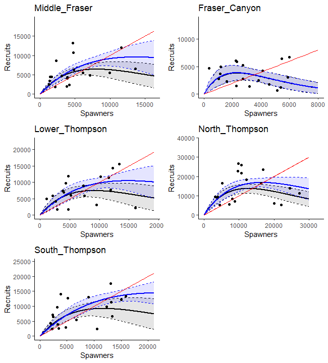
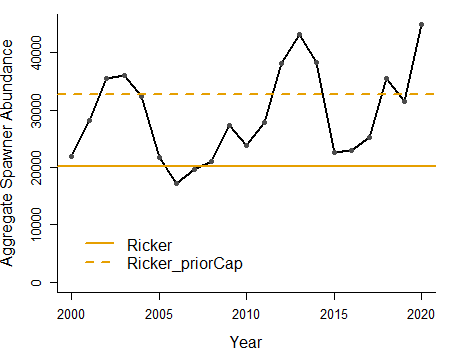

---
output:
  word_document: default
  html_document: default
  pdf_document: default
---
# CASE STUDY 1: INTERIOR FRASER COHO SALMON{#IFCChapter}


## CONTEXT

The Interior Fraser Coho SMU is well-suited for illustrating aggregate abundance LRPs due to the long history of using aggregate abundance-based recovery targets and fisheries reference points at the SMU scale. These rely on an underlying relationship between aggregate abundance and the distribution of abundance among sub-populations and CUs. Furthermore, it is a relatively data-rich SMU with spawner-recruitment time series available for all CUs starting in 1998.

The SMU includes Coho Salmon that spawn in the Fraser River and tributaries upstream of Hells Gate in the Fraser Canyon. Like most Coho Salmon, Interior Fraser Coho spend at least one full year in freshwater as fry before migrating to the ocean as smolts [@arbeiderInteriorFraserCoho2020]. Most (88%) Interior Fraser Coho have a 3-year life history, in which they leave freshwater in their second year and spend 18 months at sea prior to returning to their natal system to spawn. The remaining 12% have a 4-year life history in which they spend an additional year in freshwater before migrating as smolts in their third year. Both the 3-year and 4-year life histories spend 18 months at sea. Less than 1% of Interior Fraser Coho are believed to return as jacks (precocious mature males that spend only 6 months as sea) or at ages older than 4 years [@arbeiderInteriorFraserCoho2020].

Five WSP CUs have been identified for Interior Fraser Coho based on genetics and geographic separation: Middle Fraser, Fraser Canyon, Lower Thompson, North Thompson, and South Thompson (Figure \@ref(fig:coho-map)) [@dfoWildSalmonPolicy2015]. Previous work by the Interior Fraser Coho Recovery Team (IFCRT) identified 11 sub-populations nested within the five CUs, and developed recovery objectives based on maintaining abundance above a 1000-spawner threshold in each of these sub-populations [@ifcrtConservationStrategyCoho2006, Table \@ref(tab:cohoCU2SP)]. The delineation of sub-populations was based on several factors, including the presence of natural barriers, the influence of large lakes on downstream discharge and thermal regimes, observations of spawner aggregations under differing discharge conditions, and genetic differentiation. The 11 sub-populations are described in detail by the @ifcrtConservationStrategyCoho2006.  

Only the upper portion of the Fraser Canyon CU (upstream of Hells Gate on the Fraser River) is included in our delineation of Interior Fraser Coho. This delineation is consistent with previous analyses for this SMU (e.g. @arbeiderInteriorFraserCoho2020). As a result, Nahatlatch is the only sub-population included in our description of the Fraser Canyon CU. Kawkawa Creek, which is located below the Fraser Canyon near Hope, BC, is not included in the data we use.


```{r coho-map, fig.cap="Distribution of the Interior Fraser Coho SMU, including the five CUs that make up the SMU. Only the upper portion of the Fraser Canyon CU (upstream of Hells Gate) is shown here to be consistent with the spatial scale of the data that was used for analyses.", out.width = '65%', warning=FALSE, echo=FALSE, fig.align="center"}
knitr::include_graphics("figure/coho-map.png")
```
&nbsp;

+-------------------+--------------------------------+
| Conservation Unit | Sub-populations                  
+===================+================================+
| Middle Fraser     | - Lower Middle Fraser          
|                   | - Upper Middle Fraser
+-------------------+--------------------------------+    
| Fraser Canyon     | - Nahatlatch          
+-------------------+--------------------------------+ 
| Lower Thompson    | - Lower Thompson          
|                   | - Nicola
+-------------------+--------------------------------+
| North Thompson    | - Lower North Thompson      
|                   | - Middle Thompson
|                   | - Upper North Thompson
+-------------------+--------------------------------+
| South Thompson    | - Adams Drainage      
|                   | - Lower and Middle Shuswap Rivers
|                   | - Shuswap Lake Tributaries
+-------------------+--------------------------------+

Table: (\#tab:cohoCU2SP) Interior Fraser Coho Conservation Units (CUs) and associated sub-populations. Note that the definition of these sub-populations, including mapped boundaries, are provided in @ifcrtConservationStrategyCoho2006.

\newpage

Hatchery enhancement has occurred, and continues to occur in some parts of the Interior Fraser Coho SMU. Two CUs are currently considered wild populations based on the criteria developed by @withlerGeneticallyBasedTargets2018 (i.e., do not have hatchery programs; strays from out-of-basin hatchery production are limited to <3% per year), while the other three are considered integrated-wild populations (i.e., with Proportionate Natural Influence (PNI) values most likely $\geq$ 0.72; M. Arbeider, pers. comm.). Within integrated-wild populations, most fish are considered 'wild' under the WSP with parents who were born in the natural environment. The Lower Thompson CU had higher levels of hatchery enhancement between 1998 and 2005, so would likely have been considered an integrated-transition population (0.5 $\leq$ PNI < 0.72) during this period.

The five Interior Fraser Coho CUs have historically shown relatively high levels of covariation in escapement among CUs, with an average correlation in spawner abundances among CUs of 0.56. Similarity among CU responses to environmental and anthropogenic drivers is further supported by application of the four criteria proposed by Holt et al. (in review) to evaluate the extent to which status of data deficient CUs can be inferred from CUs with data. A summary of our consideration of these criteria for Interior Fraser Coho are provided in Appendix \@ref(app:coho-appendix). Results showed that Interior Fraser Coho CUs have many shared characteristics. We found few significant indicators that would have prevented us from inferring CU status for one CU from neighboring CUs prior to our case study analyses.

Interior Fraser Coho is included in the first batch of major stocks proposed for regulation under the Fish Stocks provisions of the revised *Fisheries Act*, necessitating the development of LRPs for this SMU.
<!--KH: I have included this here to be consistent with WCVI chinook, but we should confirm at some point that this is publishable. Hopefully by the time this paper is published, batch 1 stocks will be prescribed .... -->

### Previous assessments

Declines in Interior Fraser Coho spawner abundance throughout the 1990’s led to a suite of management actions to promote recovery, including significant fishery restrictions starting in 1998 [@deckerAssessmentInteriorFraser2014]. Evidence of a new, lower productivity regime starting in return year 1994 has been well documented, coinciding with declines in spawner abundances [@deckerAssessmentInteriorFraser2014]. In 2002, the Interior Fraser Coho stock management unit was designated 'endangered' by the  Committee on the Status of Endangered Wildlife in Canada (COSEWIC) based on the stock unit being assessed as a single 'Designatable Unit' (DU).  

Subsequent work by the Interior Fraser Coho Recovery Team (IFCRT) led to a conservation strategy outlining short-term and long-term recovery objectives for the management unit [@ifcrtConservationStrategyCoho2006]. In 2014, Decker et al. assessed status relative to the 2006 IFCRT objectives, and concluded that Interior Fraser Coho had been above the short-term recovery target in every year since 2008, and above the long-term recovery target in the most recent two return years (2012 and 2013). Also in 2014, Interior Fraser Coho were assessed under the framework of DFO’s Wild Salmon Policy (WSP). The WSP Integrated Status Assessment classified three of these CUs as being Amber status (Middle Fraser, Fraser Canyon, South Thompson) and the remaining two CUs as Amber/Green status [Lower Thompson, North Thompson, @dfoWildSalmonPolicy2015]. As part of the WSP assessment, S~gen~ and S~MSY~ were estimated for each CU and used along with other benchmarks when assigning integrated CU status. A subsequent COSEWIC assessment in 2016 upgraded the status assessment for the Interior Fraser Coho DU from 'endangered' to 'threatened' [@cosewicCOSEWICAssessmentStatus2016]. In 2018, DFO undertook a Recovery Potential Assessment (RPA) for Interior Fraser Coho that described status, habitat, threats, limiting factors to recovery, candidate recovery targets, and abundance projections for the DU, as well as recommendations regarding mitigation and allowable harm [@arbeiderInteriorFraserCoho2020]. 

### History of aggregate-abundance based reference points

Interior Fraser Coho show a strong positive relationship between their spatial distribution and overall abundance, which has been used as a basis for identifying aggregate abundance recovery targets and reference points for the stock group. Starting in 2006, the IFCRT identified a recovery goal of one or more viable sub-populations in each of the five 'populations', where their definition of populations aligns with CUs under the WSP [@ifcrtConservationStrategyCoho2006]. Note that from this point on, we use the term CU instead of population when describing IFCRT recovery goals to be consistent with the WSP. The IFCRT identified a short-term recovery objective that the 3-year average escapement in at least half of the sub-populations within each of the five CUs was to exceed 1,000 natural-origin spawning Coho Salmon, excluding hatchery fish spawning in the wild. Based on analysis of the relationship between aggregate abundance and the number of CUs that met this objective based on historical data, the IFCRT identified an abundance short-term recovery target of 20,000 spawners as the level required to meet their distributional objective. In addition, the IFCRT identified a long-term recovery target of 40,000 spawners, which represented a level that was expected to maintain 1,000 or more wild Coho Salmon in all 11 sub-populations. @deckerAssessmentInteriorFraser2014 updated the IFCRT's original analysis using a longer time series of escapement data. They also quantified the relationship between aggregate abundance and distribution by using a logistic regression to estimate the probability of meeting short-term and long-term recovery objectives as a function of aggregate abundance. They concluded that aggregate spawner abundance levels of 20,000 and 40,000 spawners would result in near 100% probability that the IFCRT’s short-term objective and long-term recovery objectives would be met, respectively.


@kormanEvaluationFrameworkAssessing2019 also used logistic regressions of the relationship between the IFCRT's distributional objectives and aggregate abundance when evaluating how exploitation and smolt-to-adult survival rates affected the ability of Interior Fraser Coho to meet conservation targets. Their approach was similar to that of @deckerAssessmentInteriorFraser2014, except they applied logistic regressions at the CU-level instead of the SMU-level. Using this approach, they calculated the probability that IFCRT sub-population objectives were met as a function of total escapement to the CU within their simulation evaluation. When evaluating how well conservation targets were met at the SMU-level, they chose to rely on the previous values of 20,000 and 40,000 identified by the IFCRT instead of updating these values. Finally, the 2018 RPA used an updated logistic regression to identify a long-term recovery target for Interior Fraser Coho that met the long-term IFCRT objective of 1000 spawners in all sub-populations [@arbeiderInteriorFraserCoho2020]. As a result, @arbeiderInteriorFraserCoho2020 recommended that the long-term recovery target for the stock should be a 3-year geometric mean abundance of 35,935 natural-origin spawners.  


## DATA{#cohoData}

Data for this case study cover return years 1998-2020. Data prior to 1998 were not used due to inconsistent assessment methods and data quality. All Interior Fraser Coho data were provided by DFO's Fraser River Stock Assessment Unit (M. Arbeider, pers. comm.). These data included: (i) annual spawner abundance by CU (1998-2020), (ii) annual natural origin recruits-at-age by CU (brood years 1998 - 2016), (iii) a hatchery-based smolt-to-adult survival rate index, (iv) annual exploitation rates, and (v) annual spawner abundances for 11 sub-populations nested within the 5 CUs. 

Two types of spawner abundance series were provided: total spawners and natural-origin returns to the spawning grounds (sometimes called 'natural returns').  The first type, total spawners, includes both natural-origin spawners and spawners that originated from hatcheries but returned to spawn naturally, but excludes fish removed from the river for hatchery brood stock.  When modelling spawner-recruit dynamics, total spawners was paired with natural-origin recruitment so that estimated productivity from all spawners was fully captured. The second type of spawner abundance series, natural-origin spawning returns, included only natural-origin fish that returned to spawn, with hatchery brood stock included. Natural-origin spawning returns were used when comparing spawning abundance to CU benchmarks or SMU-level LPRs in order to estimate CU or SMU status.


Data were similar to those previously described in @arbeiderInteriorFraserCoho2020; data treatments, assumptions, infilling, and data quality are described in detail in that document. More recent updates that are not described in @arbeiderInteriorFraserCoho2020 include the incorporation of three additional years of data (return years 2018-2020; brood years 2014-2016), updates to the SMU smolt-to-adult survival rate index to use a weighted average by release size, and increased data quality screening of scale ages used to calculate the proportion of recruits at age (M. Arbeider, pers. comm.). 


The exploitation rate time series is a large source of uncertainty for Interior Fraser Coho. Exploitation rates are only available at the SMU-level, so are assumed identical among all CUs. This assumption is unlikely to be true because of known differences in freshwater fisheries among CUs. Furthermore, models used to reconstruct exploitation rates require a large number of assumptions that are expected to be incorrect [@arbeiderInteriorFraserCoho2020]. Because exploitation rate time series are used to reconstruct recruitment time series, errors in exploitation rates will propagate through to estimates of stock-recruitment parameters, relative abundance benchmarks such as S~gen~, and covariation in recruitment residuals. Additional sources of uncertainty in Interior Fraser Coho data sets include observation errors in spawner abundance estimates and estimates of age-at-escapement. Spawner abundance estimates are largely derived from visual surveys, for which observer efficiency is not estimated and survey life is difficult to estimate accurately. Scale sampling to determine age structure is incomplete at the CU-level with small sample sizes, missing data, and limited spatial representation within CUs in some years [@kormanEvaluationFrameworkAssessing2019].


## CU STATUS ESTIMATION

We use three alternative ways to characterize CU status when developing LRPs for Interior Fraser Coho: 1) multidimensional status estimates derived from the Pacific Salmon Status Scanner, 2) CU-level abundance relative to S~gen~ as a lower benchmark on abundance, and 3) Distribution of spawning abundance relative to distributional targets developed by the IFCRT. 

The first approach, which uses the Salmon Scanner tool developed by the State of the Salmon program (Section \@ref(rapidToolMethods)), is consistent with Canada's WSP and is recommended by Holt et al. (in review) as the method that should be used to estimate CU status for proportional reference points when a recent WSP status assessment is not available. The other two approaches are primarily used to develop aggregate abundance LRPs in this case study, as well as for a point of comparison with the Salmon Scanner tool.


The second approach is based on comparing the current abundance of each CU to its CU-specific estimate of S~gen~, where CU status is considered Red when abundance drops below S~gen~. The value of S~gen~ represents the number of spawners required to recover to S~MSY~ (spawners at maximum sustainable yield) within one generation, under equilibrium conditions in the absence of fishing [@holtIndicatorsStatusBenchmarks2009]. S~gen~ is one of several benchmarks available for assigning multidimensional CU status in WSP Integrated Status Assessments and the Salmon Scanner; it represents a lower benchmark between Red and Amber status zones and was used as part of the 2014 Integrated Status Assessment for Interior Fraser Coho [@dfoWildSalmonPolicy2015]. While estimates of CU status relative to S~gen~ is a readily available output from the Salmon Scanner tool, we calculated this metric external to the tool for our case study. 


The third approach is based on the distribution of spawning escapement among sub-populations nested within CUs (Table \@ref(tab:cohoCU2SP)). We apply this approach for Interior Fraser Coho to maintain consistency with previous recovery planning processes for this SMU [@ifcrtConservationStrategyCoho2006; @arbeiderInteriorFraserCoho2020]. Since the distributional target we use was initially developed by the Interior Fraser Coho Recovery Team in 2006, we refer to it as "IFCRT distributional". Specifically, we use the IFCRT's short-term recovery objective that the 3-year geometric average escapement in at least half of the sub-populations within each of the five CUs is to exceed 1,000 wild-origin spawning Coho salmon, excluding hatchery fish spawning in the wild. We selected the short-term recovery target as a proxy for the lower benchmark in our case study because, as noted by @arbeiderInteriorFraserCoho2020, the short-term target was designed as an immediate target when the population was endangered. As such, it was interpreted as a level expected to prevent extinction or loss of genetic diversity. We have included this third approach to defining CU status to demonstrate the range of approaches and metrics that can be used, and to demonstrate sensitivity of the LRP to choice of metrics for assigning CU-status.  Future iterations of the Pacific Salmon Status Scanner approach could include distributional metrics such as those used in the IFCRT approach.  


### Estimation of Sgen{#cohoSgen}

Estimates of S~gen~ are required when assessing CU status using both the multidimensional algorithm within the Pacific Salmon Status Scanner and the comparison of current CU-level abundance to S~gen~. While the application of the Salmon Scanner to Interior Fraser Coho CUs in Pestal et al. (in prep) relies on peer-reviewed estimates of S~gen~ from the WSP Integrated Status Assessment [@dfoWildSalmonPolicy2015], we re-estimate S~gen~ here using data updated to 2020. In addition, we explore alternative stock-recruitment model formulations to better understand how model assumptions at the CU-level affect resulting LRP estimates.


Two different formulations of stock recruitment model were used to estimate S~gen~: (i) a base Ricker model, which includes a smolt-to-adult survival covariate, and (ii) an alternative form of the Ricker model in which an informative prior distribution is used to increase S~REP~ compared to the base model, labelled 'Ricker_priorCap'. S~REP~ is the spawner abundance level at which the stock replaces itself; the relationship between S~REP~ and Ricker stock recruitment model parameters is shown below (Equation \@ref(eq:beta-Srep)). Both of these models have been previously developed and applied to Interior Fraser Coho CUs. The smolt-to-adult survival covariate used when fitting both models is a hatchery-based smolt-to-adult survival rate index. The index is not CU-specific; the same index is applied to all CUs. A third Ricker model, in which both an informative prior on S~REP~ and depensatory mortality were included, was also used by @kormanEvaluationFrameworkAssessing2019 and @arbeiderInteriorFraserCoho2020; however, we did not include it in our case study for simplicity. As noted by @kormanEvaluationFrameworkAssessing2019, there is no indication in available data of depensatory dynamics, and the SR model fit with depensatory mortality required a highly uncertain assumption about the escapement level at which depensation occurs. Furthermore, formal model selection criteria showed that adding depensatory mortality into models lead to a reduction in model fit [@kormanEvaluationFrameworkAssessing2019].


@kormanEvaluationFrameworkAssessing2019 and @arbeiderInteriorFraserCoho2020 used a hierarchical model structure for both the base Ricker and Ricker_priorCap models that assumed CU-level productivity parameters were sampled from a common, normal distribution shared by all CUs. Using formal model selection criteria (i.e., DIC), @kormanEvaluationFrameworkAssessing2019 found higher support for the hierarchical structure than when productivity parameters were assumed independent among CUs. However, our initial examination of the hierarchical approach applied to the updated data set lead us to select the independent CU approach for our evaluation. Firstly, we found that LRP estimates were sensitive to the assumed standard deviation on the hyper-distribution prior for the productivity parameter. Using the individual model approach removed prior influence on model results. Secondly, a logistic regression fit to status estimates obtained using the hierarchical model was unable to converge on a solution in several years between 2015 and 2020, including the most recent year (2020). 


Future stock recruitment analyses for Interior Fraser Coho may wish to re-visit the hierarchical approach to modelling productivity. Bayesian posterior distributions of the productivity parameter from our individual model fits show some differences in productivity among CUs (particularly for the Fraser Canyon CU; Appendix \@ref(app:coho-appendix)). However, there was substantial overlap in CU-level distributions for all other CUs. We do not expect our decision to apply an individual-stock modelling approach here will affect our general conclusions. In preliminary analyses, LRPs were similar between individual and hierarchical modelling approaches.


The formulations for the two-stock recruitment models are described below. 

\
&nbsp;

***Model 1: Ricker***

The base Ricker stock-recruit model formulation was:

\begin{equation}
  R_{i,a,t} = P_{i,a,t-a}S_{i,t-a}e^{log(\alpha_i) + \gamma log(m_{t-1})-\beta_i S_{i,t-a} - \sigma_{v_i}^2/2}
   (\#eq:rickerSurv-IM)
\end{equation}
\begin{equation}
  v_i \sim Normal(0,\sigma_{v_i})
\end{equation}

where,

$R_{i,a,t}$ = the predicted number of natural origin recruits from CU $i$ of age $a$ returning in year $t$ (i.e., recruits that were produced by escapement in brood year $t-a$)

$P_{i,a,t-a}$ = the proportion of recruitment from CU $i$ returning at age $a$ from brood year $t-a$

$S_{i,t-a}$ = spawners from CU $i$ in brood year $t-a$

$\alpha_i$ = productivity parameter for CU $i$

$\gamma$ = smolt-to-adult survival co-efficient shared among CUs

$m_{t-1}$ = hatchery smolt-to-adult survival index shared among CUs for sea entry in year t-1

$\beta_i$ = density dependent term describing the rate of decrease in density dependent survival for CU $i$ with increasing spawner abundance

$\sigma_{v_i}$ = standard deviation of process error on recruitment deviations


Total recruitment from a brood year, $BY$, was calculated as the sum of age 3 and age 4 recruits in consecutive years,

\begin{equation}
  R_{i,BY} = R_{i,a=3,BY} + R_{i,a=4,BY}
   (\#eq:rickerSurv-IM-BY)
\end{equation}

Observations of $ln(R_{BY} / S_{BY})$ were assumed to be normally-distributed random variables with a standard deviation of $\sigma_{v_i}$.

This model formulation is similar to the Ricker model used in @arbeiderInteriorFraserCoho2020, but without a hierarchical structure imposed on $log(\alpha_i)$. We placed the following non-informative constraints on the likelihood function to replicate the Bayesian model fitting routine of @arbeiderInteriorFraserCoho2020:

\begin{equation}
  \gamma \sim Normal(0,10)
\end{equation}
\begin{equation}
  \sigma_{v_i} \sim Inverse Gamma (0.1,0.1)
\end{equation}

\
&nbsp;

***Model 2: Ricker_priorCap***

To maintain consistency with this previous work on Interior Fraser Coho, we also consider a version of the Ricker model that uses an informative prior distribution on S~REP~ to increase carrying capacity.  @kormanEvaluationFrameworkAssessing2019 suggested that the Ricker model with a smolt-to-adult survival co-variate (Model 1) over-estimated compensatory dynamics at high spawner abundances when applied only to data from 1998 onwards.  They noted that spawner abundances since 1998 have been much lower than historic levels.  Given that sparse data at high spawner abundances makes it difficult to estimate carrying capacity, base Ricker estimates of carrying capacity may be unreliable [@kormanEvaluationFrameworkAssessing2019]. Furthermore, they observed that one brood line had persisted at a relatively higher and more stable spawner abundance than the other two brood lines, which they viewed as evidence for a higher capacity than the base Ricker model estimates. Based on these concerns, @kormanEvaluationFrameworkAssessing2019 proposed an alternative Ricker model that used an informative prior distribution to increase carrying capacity (represented as the spawner abundance at which the stock replaces itself, S~REP~). @arbeiderInteriorFraserCoho2020 followed the approach of @kormanEvaluationFrameworkAssessing2019 by considering both the base Ricker model and a version of the Ricker model with an informative prior distribution on S~REP~ to be plausible when providing management advice.


\begin{equation}
  \beta_i = \frac{\alpha_i + \gamma + log(\overline{m})}{S_{REP,i}}
   (\#eq:beta-Srep)
\end{equation}
\begin{equation}
  S_{REP,i} \sim Normal(\mu_{SREP},\sigma_{SREP})
\end{equation}


@arbeiderInteriorFraserCoho2020 and @kormanEvaluationFrameworkAssessing2019 set $\mu_{S_{REP}}$ at 1.5 times the S~REP~ value estimated from the base model fit without a prior on S~REP~. For our model fits (described in Section \@ref(logistic)), we found that we needed to constrain $\mu_{SREP}$ at no more than 1.4 times the S~REP~ value to achieve model convergence, so we used the 1.4 times expansion instead.  We set $\sigma_{SREP}$ at $\sqrt{2} \times 1000 = 1414$ spawners, which is the same value used by @arbeiderInteriorFraserCoho2020. Note that the "$\times 1000$" term is used to correct for scaling spawner abundance by 1/1000 when fitting models. The effect of adding the prior on S~REP~ when fitting individual models to available data is shown in Figure \@ref(fig:coho-SR-fit).  
  

***Calculation of Sgen***  

The inclusion of a smolt-to-adult survival co-variate in both stock recruit models means that the realized productivity changes from year to year with changing survival. We incorporated this adjustment into our calculations of S~gen~ by first calculating the effective productivity for each CU as:

\begin{equation}
  log(\alpha'_{i}) = log(\alpha_i) + \gamma log(\overline{m})
   (\#eq:adjProd)
\end{equation}

where, $\overline{m}$ is the average smolt-to-adult survival rate over the available time series.  

S~MSY~ was calculated as a function of log($\alpha_i'$) and $\beta_i$ using:

\begin{equation}
  S_{MSY,i} = 1 - \frac{W(e^1-\alpha'_i)}{\beta_i} 
   (\#eq:Smsy)
\end{equation}

where, $W$ represents the Lambert W function [@scheuerellExplicitSolutionCalculating2016]. S~gen~ was then calculated numerically by solving the following equation: 

\begin{equation}
  S_{MSY,i} = \alpha'_{i} S_{gen,i} e^{-\beta_i \cdot S_{gen,i}}
  (\#eq:Sgen)
\end{equation}

\linebreak

```{r coho-SR-fit, echo=FALSE, fig.align="center", fig.cap="Spawner-recruitment curves fit to spawner and recruitment data using individual models for each CU. Solid black lines shows the MLE fit for the base Ricker model while solid blue lines shows the MLE fit for the Ricker\\_priorCap model. Associated black and blue shaded regions show the 95 percent confidence intervals on respective model fits using the average long-term smolt-to-adult survival rate from the available time series. The red lines show the replacement line.", out.width = '85%', warning=FALSE}

```

\linebreak


## LRP ESTIMATION: PROPORTION OF CUS

### Methods

To derive proportional LRPs, we calculated the proportion of CUs that had multidimensional statuses from the Pacific Salmon Status Scanner above the Red zone. Status was assessed as being below the LRP in years in which one or more CUs assessed as having Red status. Both Ricker model formulations described above were used to estimate abundance-based benchmarks (lower benchmark \= S~gen~ and upper benchmark \= 0.8S~MSY~) when assessing status with the Pacific Salmon Status Scanner: the base Ricker model and the Ricker_priorCap model. Estimates of S~gen~ and S~MSY~ were estimated using all data available up to 2020.


For comparison, we also calculated LRPs from the proportion of CUs that had recent generational average (3-year) spawning abundance greater than S~gen~ and from the proportion of CUs that failed to meet the IFCRT distributional target of at least half of all sub-populations within each CU having more than 1000 spawners.  

### Results

Estimates of S~gen~ based on the Ricker_priorCap model were higher than those based on the base Ricker model for four of the five CUs (Middle Fraser, Lower Thompson, North Thompson, and South Thompson) and were approximately equal for the fifth CU (Fraser Canyon; Appendix \@ref(app:coho-appendix)). As a result, generational average spawning abundance was more likely to drop below S~gen~ when it was estimated using the Ricker_priorCap model. Under the base Ricker model formulation, generational average spawning abundance remained above S~gen~ for all years between 2000 and 2020 (Figure \@ref(fig:coho-CU-multiDim-Ricker)).  In comparison, under the Ricker_priorCap formulation, generational average abundance dropped below S~gen~ for 5 of the 21 years between 2000 and 2020. These occurrences included the Lower Thompson CU (2006), the Middle Fraser CU (2006, 2008), and the South Thompson CU (2000, 2006, 2007, 2015; Figure \@ref(fig:coho-CU-multiDim-Ricker-Cap)).  All five CUs had spawning abundances above S~gen~ in 2020, regardless of which spawner recruitment model was used, indicating that the stock would be above a proportional LRP based on S~gen~.


The frequency of years in which the IFCRT distributional target failed to be met for one or more CUs was similar to that observed when S~gen~ based on the Ricker_priorCap was used, with distributional targets not met in 4 of the 21 years between 2000 and 2020 (breached in 2006, 2015-2017). Eight of the 11 sub-populations had generational average escapement drop below the 1000 spawner threshold in one or more years (Figure \@ref(fig:coho-Subpop-timeseries)). Sub-populations tended to differ in which years they dropped below the 1000 spawner threshold, which meant that the distributional target of at least half of the sub-populations within each CU with greater than 1000 fish was more often met than not. All 11 sub-populations had generational average spawning abundances above 1000 spawners in 2020, indicating that the stock would be well above a proportional LRP based on the IFCRT-distributional target (Figure \@ref(fig:coho-Subpop-timeseries)).

\newpage
```{r coho-CU-multiDim-Ricker, fig.cap="Escapement time series for Interior Fraser Coho CUs shown as annual escapements (lines) and 3-year geometric mean escapements (dots). First geometric mean includes years 1998-2000. Grey dots indicate years when all CUs had multidimensional Salmon Scanner assessments above Red when S\\textsubscript{gen} was estimated using the Ricker model, while red dots indicate when one or more CUs had assessments in the Red zone, which would trigger a breach of the LRP. Orange lines show estimated S\\textsubscript{gen}.", warning=FALSE, echo=FALSE, out.width= '80%', fig.align="center"}
knitr::include_graphics("figure/coho-CU-EscpSeries-wMultiStatus-Ricker.png")
```

```{r coho-CU-multiDim-Ricker-Cap, fig.cap="Escapement time series for Interior Fraser Coho CUs shown as annual escapements (lines) and 3-year geometric mean escapements (dots). Grey dots indicate years in which all CUs had multidimensional Salmon Scanner assessments above Red when S\\textsubscript{gen} was estimated using the Ricker\\_priorCap model, while red dots indicate years in which one or more CUs had assessments in the Red zone, which would trigger a breach of the LRP. Orange lines show estimates of S\\textsubscript{gen}.", out.width= '80%', warning=FALSE, echo=FALSE, fig.align="center"}

```

\newpage


```{r coho-Subpop-timeseries, fig.cap="Escapement time series for 11 sub-populations of Interior Fraser Coho shown as annual escapements (lines) and 3-year geometric mean escapements (dots). First geometric mean includes years 1998-2000. Grey dots shows years in which the 3-year geometric mean escapement was above the 1000 fish threshold used to assess distributional status, while red dots show years in which the 1000 fish threshold was not met. CUs are represented by columns with labels long the y axis.", warning=FALSE, echo=FALSE, fig.align="center"}
knitr::include_graphics("figure/coho-Subpop-EscpSeries-wStatus.png")
```


Multidimensional status derived from the Salmon Scanner is driven by abundance metrics for this SMU. Because absolute abundance data and benchmarks based on S~gen~ and S~MSY~ were available, the multidimensional algorithm within the Salmon Scanner (Figure \@ref(fig:decision-tree)) most often assigned CU status based on this metric (Figures \@ref(fig:coho-CU-multiDim-Ricker) and \@ref(fig:coho-CU-multiDim-Ricker-Cap)). Though status in some cases was also influenced by absolute abundance relative to the threshold of 1500 spawners. This occurred in the Fraser Canyon CU between 2015 and 2017. In these years, the generational average of absolute spawning abundance was < 1500 spawners and the CU was assigned Red status under the first node of the decision tree even though spawning abundances are above S~gen~.

 
The total number of years in which an LRP would have been breached using the multidimensional approach depended on which Ricker stock recruitment model was used to estimate S~gen~.  When status was assessed using abundance-based benchmarks estimated from the base Ricker model, a proportional LRP for the SMU would have been breached in 4 of 21 years. For three of these years, the breach was based on Fraser Canyon spawning abundances dropping below 1500 spawners (2015-2017), while for the one additional year (2000) it was due to the Lower Thompson CU having spawning abundance < S~gen~ (Figure \@ref(fig:coho-CU-multiDim-Ricker)). In comparison, when status was assessed using abundance-based benchmarks from the Ricker_priorCap model, a proportional LRP would have been breached in 9 of 21 years (2000-2001, 2005-2007, 2010, 2015-2017; Figure \@ref(fig:coho-CU-multiDim-Ricker-Cap)). For both stock-recruitment models, multidimensional status from the Salmon Scanner was above Red for all CUs based on the most recent generational average, indicating that the SMU is currently above a proportional LRP, regardless of spawner recruitment model.


## LRP ESTIMATION: AGGREGATE ABUNDANCE, LOGISTIC REGRESSION LRPS

### Methods{#logistic}

We present aggregate abundance LRPs derived using logistic regressions with two of the Interior Fraser Coho benchmarks considered: S~gen~ and the IFCRT-distributional target. Because two stock-recruitment models were used to estimate S~gen~, we distinguish these models as 'Logistic:Sgen-Ricker' and 'Logistic:Sgen-priorCap' for the Ricker and Ricker_priorCap models, respectively. We use the label 'Logistic:IFCRT' to denote the case in which the IFCRT distributional target was used to develop the aggregate abundance, logistic regression LRP.  See Section \@ref(logisticMethods) for an overview of the approach used to calculate aggregate abundance LRPs using logistic regression.


When estimating logistic regression LRPs using S~gen~, we used an integrated modelling approach in which CU-level S~gen~ values and the SMU-level LRP were simultaneously estimated. The integrated S~gen~-LRP models had two components:  

(i)	Stock-recruitment models fit to each of the 5 CUs to estimate CU-level S~gen~ (Equation \@ref(eq:rickerSurv-IM) and Equations \@ref(eq:adjProd) - \@ref(eq:Sgen))  

(ii)	A logistic regression model fit to aggregated data to estimate the LRP as the aggregate abundance that has historically been associated with a specified probability of all CUs being above S~gen~ (Equations \@ref(eq:logistic) - \@ref(eq:logisticLRP))


We initially considered a third version of the logistic regression model, in which we used the multidimensional algorithm within Salmon Scanner to characterize CU status. Preliminary model evaluations led us to exclude this model due to poor fit. The multidimensional algorithm relies on generational mean (smoothed abundances) to assess status of individual CUs against benchmarks, while our logistic regression approach uses raw (unsmoothed) aggregate abundance as a predictor variable. As a result, when logistic regressions were fit to multidimensional CU status estimates, there was a mismatch in the timing of abundance highs and lows. This mismatch led to a weak/nonexistent relationship between SMU status and the raw (unsmoothed) abundances. Using the generational mean of aggregate abundance as the predictor variable in the logistical regression fit, instead of raw annual abundance values, introduced considerable autocorrelation in statuses.

\
&nbsp;

***Retrospective Analysis and Analysis Evaluating Impact of Missing CUs***


We used retrospective analyses to examine the effect of time series length on logistic regression LRP estimates.  For each year between 2010 and 2020, we used data only available up to that year to calculate LRPs and associated confidence intervals.

In addition, to examine the effect of missing CUs on retrospective LRP estimates, we calculated LRPs using data from only a subset of the five Interior Fraser Coho CUs. We limited our analysis to missing data from either one or two CUs so that we had at least three CUs of available data when calculating the proportion of CUs above their benchmarks. For each missing data case, we calculated SMU aggregate status as

\begin{equation}
  AggStatus_t = \frac{\sum_{i}^{nCU} S_{i,t}}{LRP'_t}
   (\#eq:status)
\end{equation}

where $nCU$ is the number of CUs being used (3, 4, or 5), $S_{i,t}$ is the abundance of natural-origin spawners returning to CU $i$ in year $t$ (including fish removed for brood), and $LRP'_t$ is the LRP calculated in year $t$ using only data from $nCU$. SMU-level status in a given year was calculated for all possible combinations of CUs available (5 combinations when $nCU$= 4 and 10 combinations when $nCU$ = 3) to allow examination of the stability of status estimates among available combinations. Estimates of SMU status relative to LRPs were used to compare among missing CU scenarios instead of actual LRP estimates because the magnitude of the LRP will vary with the number and combination of CUs used. Since uncertainty estimates for spawner abundance series are not available, confidence intervals on LRP status are based solely on estimated 95% confidence intervals for the LRP. We evaluated the missing CU scenarios retrospectively for years 2017-2020.


### Results


***LRP Estimates***

Logistic regression model fits in 2020 from the integrated Logistic:Sgen-Ricker, Logistic:Sgen-priorCap and Logistic:IFCRT models are shown in Figure \@ref(fig:coho-IM-logisticFit2020). All three logistic regression LRP methods were able to converge on a solution in 2020. Resulting LRPs for different *p* thresholds are shown on the regression curves, as well as in Table \@ref(tab:logisticLRPs2020). There was considerable uncertainty around predicted curves as seen in the large areas of gray shading in Figure \@ref(fig:coho-IM-logisticFit2020).  


```{r coho-IM-logisticFit2020, fig.cap="Logistic regression fit from the three logistic regression models: Logistic:Sgen-Ricker, Logistic:Sgen-priorCap and Logistic:IFCRT LRP model using data from 1998 - 2020. Dots represent individual years and 'x' represents the latest year in the time series. The yellow vertical line shows the LRP estimate based on the requirement of a 50\\% probability of all CUs being above S\\textsubscript{gen}, while the yellow shaded region shows the associated 95\\% confidence interval around the LRP. LRPs for three alternative probability thresholds, 66\\%, 90\\%, and 99\\%, are shown in blue, green, and orange, respectively.", warning=FALSE, echo=FALSE, out.width = '90%', fig.align="center"}
knitr::include_graphics("figure/coho-all-LogisticLRP.png")
```
\linebreak
  
When the Logistic:Sgen-Ricker model was used, aggregate abundance LRPs ranged from  21,189 to 35,737 spawners, depending on whether the required probability of all CUs being above S~gen~ was moderate (50%) or very likely (99%) (Table \@ref(tab:logisticLRPs2020)). LRPs increased across all probability levels when the carrying capacity was assumed higher under the Logistic:Sgen-priorCap model (Table \@ref(tab:logisticLRPs2020)). The higher S~gen~ values for most CUs under the alternative Logistic:Sgen_priorCap model formulation resulted in more historical years in which < 100% of CUs were above S~gen~. The result was a shift of the logistic curve to the right (Figure \@ref(fig:coho-IM-logisticFit2020)). LRPs based on the Logistic:Sgen_priorCap model ranged from 23,245 to 39,200 spawners, depending on whether the required probability of all CUs being above S~gen~ was moderate (50%) or very likely (99%).  


When CU status was based on the IFCRT distributional target, the fit of the logistic curve had a more gradual slope than the two S~gen~ models due to a greater overlap in 'successful' (all CUs > distributional target) and 'unsuccessful' (<100% of CUs above distributional target) years at low to moderate aggregate abundances.  In 3 of the 6 years with aggregate abundances below 20,000 spawners, the distributional target was not met for all CUs (Figure \@ref(fig:coho-IM-logisticFit2020)). LRPs based on this model also became increasingly large at high probability thresholds (Table \@ref(tab:logisticLRPs2020)). The LRP based on a 99% probability was 44,403 spawners, with a 95% confidence interval extending from 15,102 - 73,703 spawners.  


\renewcommand*{\arraystretch}{1.5}
\begin{table}[ht]
\caption{Aggregate abundance based LRPs (with 95\% confidence intervals) from three different logistic regression LRP models. For each probability level, the LRP estimate represents that probability that all CUs will be above their lower benchmark.}
\begin{tabular}{p{3.5cm} p{3.5cm} p{3.5cm} p{3cm}}
\hline  
 Probability  & Sgen-Ricker  & Sgen-priorCap & IFCRT \\
\hline  
50\% (As likely as not) & 21,190 (16,383-25,996) &23,245 (17,456-29,034) & 17,515 (9,695-25,336) \\
66\% (Likely) & 23,289 (17,364-29,215)&  25,547 (18,158-32,937) & 21,396 (13,418-29,375) \\
90\% (Very likely) & 28,145 (17,566-38,725) & 30,874 (18,129-43,620) & 30,372 (15,711-45,033)\\
99\% (Virtually certain) &  35,737 (16,525-54,949) & 39,200 (16,922-61,479) & 44,403 (15,102-73,703) \\
\hline
\end{tabular}
(\#tab:logisticLRPs2020)
\end{table}

\
&nbsp;
&nbsp;

***Logistic Regression Diagnostics***

Logistic regression diagnostics showed that key regression assumptions were met, and that model fits were strong enough to support estimation of logistic regression LRPs from all three models (Table \@ref(tab:logisticDiagIFC2020)). The assumption of linearity was demonstrated based on the Box-Tidwell test. This test evaluates the significance of adding a non-linear interaction term to the logit regression. We found that this additional interaction term was not significant, supporting the linearity assumption (Table \@ref(tab:logisticDiagIFC2020)). An examination of deviance residuals did not show any large outliers, i.e., no residual values were greater than 2 standard deviations away from zero for all three models. Observations were also found to be independent at all year lags examined for all three models based on no significant autocorrelations among residuals. 

The Wald test showed that the logistic model coefficient for aggregate abundance was marginally significant (p < 0.10). Pseudo-$R^2$ statistics indicated a moderately strong relationship between aggregate abundance and the probability of all CUs being above their lower benchmarks, and the goodness of fit statistics indicated a significant fit of the model with aggregate abundance relative to the null model based on p-values less than 0.01. Finally, 'out-of-sample' hit ratios representing classification accuracy as the proportion of successful predictions when one year of data was iteratively left out of the model fit, were relatively high at low probability thresholds, indicating good accuracy. This result was especially true for the Logistic:Sgen-Ricker and Logistic:Sgen-priorCap model which had hit ratios ranging between 0.83 and 0.87 at probability thresholds of 50% and 66%. Classification accuracy was lowest for all models at the 99% probability threshold.


\renewcommand*{\arraystretch}{1.5}
\begin{table}[ht]
\caption{Model diagnostic statistics from Sgen:LRP, Sgen\_priorCap:LRP, and Dist-LRP model fits. A description of diagnostic tests is provided in Section 2. Hit ratios are shown for all four probability thresholds considered.  The symbol \* indicates a result that only marginally met the recommended criteria for demonstrating good model fit}
\begin{tabular}{p{3.5cm} p{3cm} p{3.5cm} p{3cm}}
\hline  
 Diagnostic Test  & Sgen-Ricker  & Sgen-priorCap & IFCRT \\
\hline  
 Box-Tidwell p-value     & 0.44  & 0.94  & 0.79   \\
 Max. deviance residual  & 1.98  & 1.81  & 1.66   \\
 AR-1                    & -0.07 & 0.09  & 0.05   \\
 Wald p-values           & $0.07^*$ & $0.06^*$& $0.09^*$ \\
 Goodness-of-fit p-value & <0.01 & <0.01 & <0.01  \\
 Pseudo-$R^2$            & 0.60  & 0.61  & 0.40   \\
 Hit Ratio (p= 50\%, 66\%, 90\%, 99\%) & 0.87, 0.83, 0.74, 0.70  & 0.83, 0.83, 0.83, 0.74 &  0.76, 0.71, 0.76, 0.52 \\
\hline
\end{tabular}
(\#tab:logisticDiagIFC2020)
\end{table}


Sample sizes were small due to the short time series available for Interior Fraser Coho; only 23 years of observations were available to fit logistic regression models. @peduzziSimulationStudyNumber1996 recommend a minimum requirement of 10 data points for the least frequent outcome based on their simulation studies in the field of clinical epidemiology. In our case, the least frequent outcome was the failure of all CUs to be above their benchmarks (i.e., 0). We were not able to make this minimum requirement for any of our model fits; we had only 7, 8, and 5 data points at the least frequent outcome for the Logistic:Sgen-Ricker, Logistic:Sgen-priorCap, and Logistic-IFCRT models, respectively. Based on the current ratio of successes and fails in the data, the estimated minimum sample sizes that would be required to meet the criteria of @peduzziSimulationStudyNumber1996 ranged from 26 to 42 years. However, despite small sample sizes, hit ratios are high for all models at p = 50%.  As a result, we suggest that logistic regression LRPs may still be useful for this SMU.  We proceeded with retrospective analyses in order to examine how sensitive LRPs based on these model fits were to variations in the level of available data.

\
&nbsp;

***Retrospective Analysis and Analysis Evaluating Impact of Missing CUs***

We started the retrospective analyses for the three logistic regression models in 2010. Throughout the time series, the Logistic:Sgen-Ricker did not converge when the estimates were truncated to 2013 and 2014. The Logistic:Sgen-priorCap model did not converge on an LRP estimate in 2018. All three models showed some fluctuations in LRP estimates over time (Figure \@ref(fig:coho-retroLRPs)). The Logistic:IFCRT model tended to produce the lowest estimates of LRPs over time, followed by the Logistic:Sgen-Ricker and the Logistic:Sgen-priorCap. However there was considerable overlap between the confidence interval of all three LRP estimates (Figure \@ref(fig:coho-retroLRPs)).  

```{r coho-retroLRPs, fig.cap="Three-year geometric mean of aggregate spawning abundance for the Interior Fraser Coho SMU (black line) and associated time series of retrospective LRPs from logistic regression estimation methods. LRPs are based on a 50\\% probability that all CUs will be above their lower benchmarks. Annual LRP estimates are shown as maximum likelihood values (coloured lines) and associated 95\\% confidence intervals (shaded areas).", warning=FALSE, echo=FALSE, out.width = '60%', fig.align="center"}
knitr::include_graphics("figure/coho_LRP_compareRetro.png")
```

\
&nbsp;

When the Logistic:Sgen-Ricker model was applied retrospectively to missing data scenarios with 4 out of the 5 CUs, only a subset of scenarios had LRP estimates that converged on a solution (Figure \@ref(fig:coho-IM-missingCUs)). All 5 possible combinations of 4 CUs had estimates in 2017-2019, while only 4 combinations had estimates in 2020. For scenarios in which LRP estimates were possible, estimates of aggregate status (Equation \@ref(eq:status)) were often close to the estimate obtained when all 5 CUs were used, and always overlapped with the 95% confidence interval of the full data estimate. The Logistic:Sgen-Ricker model was less likely to converge on a solution when data from only three CUs were used. This pattern was especially true for 2020 when only 6 out of the 10 possible combinations had estimates. For scenarios that were able to converge, aggregate status estimates from 3 CUs tended to be more uncertain than 4- and 5-CU estimates, and showed larger deviations from estimated status when all CUs were used. One missing data scenario in 2019 had a status estimate that fell outside of the 95% confidence interval of the full data estimate.  


```{r coho-IM-missingCUs, fig.cap="Estimates of SMU status (with 95\\% confidence intervals) from the Logistic:Sgen-Ricker model under different scenarios about missing CUs, where aggregate status is characterized as the recent generational mean of aggregate abundance / LRP. LRPs are based on a 50\\% probability that all CUs will be above their lower benchmarks. The set of status estimates associated with each number of CUs on the x-axis represents all possible combinations of CUs created by selecting that number from the 5 available CUs.  Red dashed lines show the maximum likelihood estimate when no data is missing (i.e., all 5 CUs) for comparison with the missing data scenarios. Note that the y-axis has been truncated at 6, so the upper limits of some error bars are not shown.", warning=FALSE, echo=FALSE, out.width = '70%', fig.align="center"}
knitr::include_graphics("figure/coho-StatusByNCUs-IndivRickerSurv-50.png")
```  

\newpage
  
When the Logistic:Sgen-priorCap model was applied to missing data scenarios in which 4 out of 5 CUs had data, LRP estimates were only available for 2 of the 5 CU combinations (Figure \@ref(fig:coho-IMCap-missingCUs)). For scenarios in which LRP estimates were available, status was poorly estimated with the estimate often falling outside of the 95% confidence interval of the full data estimate. While convergence was more frequent when only 3 CUs were used, estimates had high uncertainty and were variable among scenarios. Several of the status estimates from 3-CU scenarios fell outside of the 95% confidence interval for the full data case. In the year 2018 the model did not converge when all CUs were included, but estimates for missing CU scenarios were available.


```{r coho-IMCap-missingCUs, fig.cap="Estimates of SMU status (with 95\\% confidence intervals) from the Logistic:Sgen-priorCap model under different scenarios about missing CUs, where status is characterized as the recent generational mean of aggregate abundance / LRP. LRPs are based on a 50\\% probability that all CUs will be above their lower benchmarks. The set of status estimates associated with each number of CUs on the x-axis represents all possible combinations of CUs created by selecting that number from the 5 available CUs. Red dashed lines show the maximum likelihood estimate when no data is missing (i.e., all 5 CUs) for comparison with the missing data scenarios. The model with full data (5 CUs) failed to converge in 2018. Note that the y-axis has been truncated at 5, so the upper limits of some error bars are not shown.", warning=FALSE, echo=FALSE, out.width = '70%',  fig.align="center"}
knitr::include_graphics("figure/coho-StatusByNCUs-IndivRickerSurvCap-50.png")
```
 
 
\linebreak


LRPs based on the Logistic:IFCRT model could be estimated for all 4-CU data combinations in all years (Figure \@ref(fig:coho-distributional-missingCUs)). Resulting estimates of SMU status were similar to the full data estimate for 4 of the 5 CU combinations. Status estimates were highest and most uncertain when the South Thompson CU was dropped from the analysis (i.e., the last of the 5 four-CU combinations shown for each year in Figure \@ref(fig:coho-distributional-missingCUs)). This pattern is due the 2015 data point for the South Thompson CU, which is an influential observation that has a large impact on the shape of the model fit. The South Thompson CU is the only CU that failed to meet the distributional target in 2015, which meant that its removal leads to a 'failure' year (i.e., at least one CU below its lower benchmark) becoming a 'success' (all CUs above lower benchmark). This shift results in a lower LRP and a higher status estimate. For missing data scenarios in which only 3 CUs were included, status estimates often had higher uncertainty than the 4-CU or full data scenarios, and showed high variability among scenarios in estimated status.  


```{r coho-distributional-missingCUs, fig.cap="Estimates of SMU status (with 95\\% confidence intervals) from the Logistic:IFCRT model under different scenarios about missing CUs, where status is characterized as the recent generational mean of aggregate abundance / LRP. LRPs are based on a 50\\% probability that all CUs will be above their lower benchmarks. The set of status estimates associated with each number of CUs on the x-axis represents all possible combinations of CUs created by selecting that number from the 5 available CUs. Red dashed lines show the maximum likelihood estimate when no data is missing (i.e., all 5 CUs) for comparison with the missing data scenarios. Note that the y-axis has been truncated at 8, so the upper limits of some error bars are not shown.", warning=FALSE, echo=FALSE, out.width = '70%',  fig.align="center"}
knitr::include_graphics("figure/coho-StatusByNCUs-SPopAbundThreshST-50.png")
```
\linebreak

## LRP ESTIMATION: AGGREGATE ABUNDANCE, PROJECTION LRPS

### Methods

Projections of each of the five CUs with the Interior Fraser Coho SMU were implemented using the `samSim` modelling tool (Appendix \@ref(app:samsim-appendix)). Finer-scale projections at the scale of sub-populations were not possible as spawner-recruitment data series were not available at this scale. As a result, projection LRPs using the IFCRT recovery target was not possible; we were restricted to estimating CU-level status based on S~gen~. Parameters characterizing CU-level population dynamics, smolt-to-adult survival rates, and exploitation rates were derived directly from data sets described in Section \@ref(cohoData). Base case parameters and alternative parameter values tested in sensitivity analyses are provided in Table \@ref(tab:coho-BaseProjectPars). Additional details on key model parameterizations and sensitivity analyses are also described in text below.  


\newpage

\begin{longtable}[]{p{3.7cm} p{5cm} p{6.3cm}}
\caption{Parameters used for CU-specific projections of Interior Fraser Coho population dynamics.}\\
\hline
Parameter & Value & Source \\ 
\hline
\endhead
\hline
 Ricker Parameters ($\alpha$, $\beta$, $\gamma$,$\sigma$)  &  CU-specific (Appendix C) & Drawn from posterior from MCMC model fit to 1998-2016 brood years
\\\\

 Smolt-to-adult survival rate (all CUs) & Drawn from Lognormal(-4.83, 1.21), bound between [-9.21, -3.32]
 & Estimated from brood years 1998 - 2016, with bounds set at lowest and highest observations
\\\\  

 Among-CU variability in smolt-to-adult survival coefficient $\gamma$  &  $\sigma_{\gamma}$ = 0 (all CUs the same) & Assumed value when fitting models. Varied between 0 and 0.09 in sensitivity analyses
\\\\

 Ave age proportions at maturity (ages 3, 4) &  MiddleFR, LThomp, SThomp = (0.86,0.14) , FRCanyon = (0.87, 0.13), NThomp = (0.88, 0.12) & Estimated from time-series of proportions of recruits at age
 \\\\  

 Interannual variability in age proportions (tau from multivariate logistic distribution)  & MiddleFR, NThomp, SThomp = 1.0, LThomp = 0.9, FRCanyon = 0.8 & Estimated from time-series of ppns of recruits at age \\\\

 Average exploitation rate & 0.125 & Estimated from annual estimates, brood years 1998 - 2016. Varied in sensitivity analyses (0.05 - 0.35).
 \\\\

Interannual variability in exploitation rates & CV = 0.442  & Estimated from annual estimates from brood years 1998 - 2016. Assumed to be Beta distributed.
\\\\

Variability in exploitation rates among CUs & CV = 0.221 & Assumed to be half of interannual variability. Varied in a sensitivity analysis (0-0.442).
\\\\ 

Initial abundances  & CU-specific & Based on spawner-recruit series
<!--\\
\hline-->
(\#tab:coho-BaseProjectPars)
\end{longtable}


Projections were run for 30 years over 20,000 simulation trials, with projections initialized using spawner abundances from the most recent 4 return years, 2016 - 2020.  The high number of simulation trials was required to stabilize LRP estimates given the binning of aggregate escapement in 200-fish intervals to identify LRPs based on probability thresholds.  The distribution of projected trajectories were near equilibrium after 4 years of projections. During the first 4 years, trajectories depended primarily on the historical time-series (Figures \@ref(fig:coho-CUProjections-Ricker) and \@ref(fig:coho-CUProjections-Ricker-priorCap)).

\
&nbsp;

***Stock-recruitment dynamics***  

Stock recruitment parameters for all 5 CUs were drawn from joint posterior distributions obtained by fitting the two stock recruit models described in Section \@ref(cohoSgen) (Ricker and Ricker_priorCap) to available spawner-recruit data using Bayesian Markov Chain Monte Carlo (MCMC) estimation. Bayesian estimation was done using 'tmbStan' [@kristensenTMBAutomaticDifferentiation2016], which is an R package that allows MCMC samples to be drawn from a TMB model object using 'rStan' [@standevelopmentteamRStanInterfaceStan2020]. Three MCMC chains were run for 14,000 iterations, with the first half of each chain excluded from the final posterior sample. Resulting joint posterior distributions included 21,000 samples. Posterior sampling was initiated at the MLE estimates for each model formulation. Neither model showed signs of convergence failure based on our examination of $\hat{R}$ and effective sample size diagnostics, as well as visual inspections of marginal posterior distributions. A summary of marginal posterior distributions for each stock recruitment parameter ($\alpha$, $\beta$, $\gamma$, and $\sigma$) is provided in Appendix \@ref(app:coho-appendix). 

The two stock recruitment models, Ricker and Ricker_priorCap, were treated as two alternative hypotheses about stock recruitment dynamics, which we compare against each other. We also considered a simple model-averaging approach, in which we equally weighted the two stock recruit models by combining projections prior to calculating a projection LRP as a demonstration of model averaging. Additional sensitivity analyses described below were applied to the base Ricker model.  

\
&nbsp;

***Covariance in recruitment residuals***

We parameterized correlations in recruitment residuals among CUs from MLE predictions of pairwise correlations from stock-recruitment model fits. The correlation matrix from the base Ricker model fit is shown in Figure \@ref(fig:coho-recruitResid-Ricker). Correlation values for the Ricker_priorCap model were similar (not shown).    

We initially attempted to reduce covariation in spawner abundances among CUs by scaling correlations in recruitment residuals (i.e., scalar < 1). However, we found that scalars had little effect on projected correlations in spawner abundances among CUs due to the shared smolt-to-adult survival rate coefficient dominating among-CU variability in recruitment. We therefore used sensitivity analyses of the level of variability in smolt-to-adult survival coefficients among CUs to drive patterns of covariation in spawner abundance, as described below. This approach differs from that taken for WCVI Chinook (Section \@ref(WCVIchinookChapter)).  


```{r coho-recruitResid-Ricker, fig.cap="Bubble plot of pairwise correlation coefficient in recruitment residuals among CUs from base Ricker model fit.", warning=FALSE, echo=FALSE, out.width = '50%',  fig.align="center"}
knitr::include_graphics("figure/coho-RecuitResidCorrelation-Ricker.png")
```
\linebreak


***Variability in smolt-to-adult survival coefficient among CUs***

When fitting stock-recruit models to data, we followed the approach of @kormanEvaluationFrameworkAssessing2019 and @arbeiderInteriorFraserCoho2020 in assuming that all CUs experienced the same smolt-to-adult survival rate for given sea-entry year, and that the smolt-to-adult survival coefficient, $\gamma$, was constant both among CUs and among years.  When projecting CUs forward, we maintained this assumption in our base case by generating a single smolt-to-adult survival rate for each sea entry year and setting $\sigma_{\gamma}$ = 0, where $\sigma_{\gamma}$ is the standard deviation of among-CU variability in $\gamma$ such that $\gamma_i \sim Normal(\bar{\gamma}, \sigma_{\gamma})$. We used sensitivity analyses on $\sigma_{\gamma}$ to test the effect of changes in spawner abundance covariation among CUs on projected LRP estimates. Three alternative levels of $\sigma_{\gamma}$ were used in sensitivity analyses: $\sigma_{\gamma}$ = 0.045, 0.0675, and 0.09. We selected these levels to cover a range between 0 and 0.09, where 0.09 was the standard deviation of the estimated marginal posterior distribution for $\gamma$ from our Ricker stock recruitment model fit. 

The resulting correlations in spawner abundances from the projections are shown in Figure \@ref(fig:coho-sigGammaCorrelation). In the forward projections, pairwise correlations in projected spawner abundances among CUs for the base case assumption of $\sigma_{\gamma}$ = 0 were similar to observed pairwise correlations in spawner abundances among CUs. Increasing $\sigma_{\gamma}$ resulted in decreased among-CU correlation in projected spawner abundances.  

```{r coho-sigGammaCorrelation, fig.cap="Distribution of correlations of spawner abundances among CUs for observed data between 1998 and 2020 and projected time-series under alternative assumptions about the standard deviation on the smolt-to-adult survival co-efficient among CUs for the base Ricker model formulation.", warning=FALSE, echo=FALSE, out.width = '50%',  fig.align="center"}
knitr::include_graphics("figure/coho-corrEffect-sigGamma.png")
```

\linebreak

***Variability in age proportions of recruitments among CUs***

Annual variability in the age structure of returns was generated from a multivariate logistic distribution parameterized using CU-specific time series of proportions at age. The underlying average age structure for each CU was set at the average from the available time series (brood years 1998 - 2016), while annual deviations from underlying age-specific means were drawn from a multivariate logistic distribution. Annual deviations were held constant among all CUs; however, the scale of annual deviations was controlled by the variability parameter $\tau$, which was estimated individually for each CU. This meant that while all CUs simultaneously experienced increases or decreases in a given year, the magnitude of the increase or decrease was CU-specific. Annual deviations were held constant among CUs to represent the strong covariation in proportions at age seen in available time series for Interior Fraser Coho, especially since 2010 (Figure \@ref(fig:coho-ageProp)). When the constraint of constant annual deviations was removed, generated proportion at age data was much more variable than observed data, which was considered to be unrealistic. 

Annual variability in the age structure of recruitments has not been included in other recent projection analyses for this SMU. Both @kormanEvaluationFrameworkAssessing2019 and @arbeiderInteriorFraserCoho2020 assumed a constant age structure over time.  

```{r coho-ageProp, fig.cap="Proportion of recruits returning at age 3 for 1998 - 2016 brood years. Only two age classes (age 3 and age 4) are present in the age structure, so the proportion of recruits returning at age 4 will account for the remainder of returns from each brood year.", warning=FALSE, echo=FALSE, out.width = '50%',  fig.align="center"}
knitr::include_graphics("figure/coho-ObsAgeProp-byCU.png")
```

\newpage


***Covariance in exploitation***

We assumed an average exploitation rate of 12.5% for all CUs in forward projections based on recent average values, with common interannual variability in exploitation rates due to shared fishery impacts among CUs each year. Interannual variability in exploitation rates was assumed to be Beta distributed (constrained between 0 and 1), with the standard deviation of the Beta distribution parameterized from estimated exploitation rates for 1998 - 2016 brood years. The corresponding coefficient of variation (CV) for interannual variability was 0.44.

Exploitation rates for Interior Fraser Coho are only available at the SMU-level due to limited coded-wire indicator stocks (1-2 CUs with indicators / year) that have been available for the Fishery Regulation Assessment Model used by the Pacific Salmon Commission for Coho Salmon [@pacificsalmoncommissionJointCohoTechnical2013]. As a result, empirically-based estimates of among-CU variability in exploitation rates are not available. However, there are reasons to expect exploitation rates to vary among CUs in a given year, including differences in freshwater fisheries.  We assumed that CU-specific variability in exploitation rates was half the common (SMU-level) interannual variability (CV=0.22), and varied this in sensitivity analyses from 0 and 0.44 to cover plausible bounds. Varying assumptions about variability in exploitation among CUs between CV = 0 and 0.44 in forward projections did not impact the distribution of correlations in spawner abundances in the projections (results not shown).  


### Results

<!--
  BC comment: Out of curiosity, if you conditioned your projections on the spawner abundance at the beginning of your empirical time series would you get an aggregate projection based LRP relationship that looks similar to the empirical one? If not why not. Might be worth discussing somewhere as part of pros and cons of alt methods. 
-->

***LRP Estimates***

Aggregate abundance LRPs estimated using the Ricker model as a basis for forward projections were lower than those obtained when the Ricker_priorCap model was used, regardless of which probability threshold was used (Table \@ref(tab:projectedLRPs2020); Figure \@ref(fig:coho-projLRPCurveByOM)). This result is similar to the logistic regression LRPs, where LRPs derived using S~gen~ estimates from the Ricker_priorCap model were higher due to higher S~gen~ values.  The projected curve showing the probability of all CUs being above S~gen~ had a slope that was more gradual and further from the origin for the Ricker_priorCap model compared to the base Ricker model (Figure \@ref(fig:coho-projLRPCurveByOM)). When projection outputs from both stock recruitment model formulations were combined prior to binning in order to create a model-averaged scenario (with equal weight assigned to both scenarios), the resulting probability curve was mid-way between the curves from the two individual models. In all cases, projected curves had higher scatter with increasing aggregate abundance, such that LRP estimates at probability thresholds of p = 0.90 and p = 0.99 were unstable.

```{r coho-projLRPCurveByOM, fig.cap="Probability of all CUs being above their lower benchmark of S\\textsubscript{gen} along a gradient in aggregate abundances within bins of 200 fish for two different stock recruit model options (Ricker and Ricker\\_priorCap) as well as a model averaged case (Combined) in which results from both stock recruitment models were equally weighted. Results are derived from projections over 30 years and 20,000 MC Trials. Each dot is the proportion of MC trials where all CUs were > lower benchmarks of S\\textsubscript{gen}. Candidate LRPs at p=0.5 (yellow) and p=0.66 (blue), 0.90 (green), and 0.99 (orange) are highlighted.", warning=FALSE, echo=FALSE, out.width = '50%',  fig.align="center"}
knitr::include_graphics("figure/coho-projLRPCurve-byOM.png")
```


\renewcommand*{\arraystretch}{1.5}
\begin{table}[ht]
\caption{Projection LRPs from forward projections under two different stock recruit model options (Ricker and Ricker\_priorCap), as well as a model averaged case (Combined) in which results from both stock recruit models were equally weighted. For each probability level, the LRP estimate represents that probability that all CUs will be above their lower benchmark of S~gen~.}
\begin{tabular}{p{3.5cm} p{3cm} p{3.5cm} p{3cm}}
\hline  
Probability & Ricker & Ricker\_priorCap & Combined \\
\hline  
 50\%        & 20,100        & 32,700      & 26,500 \\
 66\%        & 24,900        & 40,100      & 33,500 \\
 90\%        & 41,100        & 68,900      & 65,300 \\
 99\%        & 75,100        & 87,300      & 83,500 \\
\hline
\end{tabular}
(\#tab:projectedLRPs2020)
\end{table}


Generational average spawning abundance (based on a 3-year geometric mean) remained above the projection LRP derived using the Ricker model with a probability threshold of p = 0.5 for most years between 2000 and 2020. There were two years when aggregate spawning abundance decreased below the LRP: 2006 and 2007 (Figure \@ref(fig:coho-AggEscpSeries-wProjLRP)). In comparison, when projection LRPs were derived using the Ricker_priorCap model with p = 0.5, aggregate spawning abundance remained below the LRP for 11 out of the 21 years.  


```{r coho-AggEscpSeries-wProjLRP, fig.cap="Three-year geometric mean of aggregate natural-origin spawning abundance for the Interior Fraser Coho SMU (black line) relative to projection LRP estimates using two different stock recruitment model formulations, Ricker and Ricker\\_priorCap, with a probability threshold of p=0.5. Forward projections used to estimate reference points were parameterized using available 1998-2020 time series under base model assumptions.", warning=FALSE, echo=FALSE, out.width = '50%',  fig.align="center"}

```

\linebreak

***Sensitivity Analyses***

Increasing $\sigma_{\gamma}$, which corresponded with reduced between-CU pairwise correlation in spawner abundances over time (Figure \@ref(fig:coho-sigGammaCorrelation)), resulted in a flattening of the projected relationship between aggregate spawner abundances and the probability of all CUs being above their lower benchmarks. LRP estimates corresponding to a given probability threshold increased as $\sigma_{\gamma}$ increased as curves shifted to the right and became more gradual (i.e., less steep). For the two highest $\sigma_{\gamma}$ scenarios examined ($\sigma_{\gamma}$=0.0675 and 0.09), a 99% probability of all CUs being above their lower S~gen~ benchmark was never achieved.            

```{r coho-projLRPCurve-bySigGamma, fig.cap="Probability of all CUs being above their lower benchmark of Sgen along a gradient in aggregate abundances (within bins of 200 fish) for alternative scenarios about the value of sigGamma. The baseline value used for forward projections was sigGamma = 0. Results are derived from projections over 30 years and 20,000 MC Trials. Each dot is the proportion of MC trials where all CUs were > S\\textsubscript{gen}.  Candidate LRPs at p=0.5 (yellow) and p=0.66 (blue), 0.90 (green), and 0.99 (orange) are highlighted.", warning=FALSE, echo=FALSE, out.width = '70%',  fig.align="center"}

```

Increasing the average exploitation rate used in forward projections also led to a shift in projected curves to the right; however, the shift was more gradual over the range of exploitation rate scenarios we considered than the effect of increasing $\sigma_{\gamma}$ (Figure \@ref(fig:coho-projLRPCurve-byER)). The effect of increasing exploitation rates was smallest at low probability thresholds. At p = 0.5, the LRP differed by 400 fish between the ER = 2.5% and ER = 12.5% scenarios (range = 19,700 - 21,000), and by < 4000 fish among all four scenarios (range = 19,700 - 24,000). Differences were much larger among the four exploitation rate levels examined for the p = 0.90 threshold. When the average exploitation rate was set at 22.5% or 32.5%, aggregate abundances barely exceeded 60,000 fish, and it was not possible to achieve a 99% probability of all CUs being above their lower S~gen~ benchmarks.  


```{r coho-projLRPCurve-byER, fig.cap="Probability of all CUs being above their lower benchmark of Sgen along a gradient in aggregate abundances (within bins of 200 fish) for alternative scenarios about average exploitation rates (ER) in forward projections. The baseline value used for forward projections was ER = 12.5\\%. Results are derived from projections over 30 years and 20,000 MC Trials. Each dot is the proportion of MC trials where all CUs were > S\\textsubscript{gen}.  Candidate LRPs at p=0.5 (yellow) and p=0.66 (blue), 0.90 (green), and 0.99 (orange) are highlighted.", warning=FALSE, echo=FALSE, out.width = '70%',  fig.align="center"}

```

\linebreak

## HISTORICAL EVALUATION OF STATUS ACROSS LRP METHODS

We compared annual estimates of SMU status relative to LRPs for the range of LRP estimation options considered in this case study (Figure \@ref(fig:coho-statusPlot-withBars)). For all aggregate abundance LRPs, we illustrate LRPs estimated from a probability threshold of p = 0.5 (i.e., a 50% probability that all CUs would have status above their lower benchmark). We used the following labeling convention when comparing historical status estimates across LRP estimation methods: *"Metric" : "LRP Method" : "CU Status Method"*. 'Metric' refers to the choice of whether to base an LRP on the proportion of CUs above Red CU status (Prop) or on aggregate SMU-level abundance (Abund). The 'LRP' method only applies to aggregate-abundance based LRPs, which can be logistic regression (Logistic) or projection (Proj). Finally, the 'CU Status Method' can be based on the multidimensional algorithm within the Pacific Salmon Status Scanner in which CU abundance benchmarks are based on one of the two Ricker models (Scanner-Ricker or Scanner-priorCap). Alternatively, when only a single benchmark is used to characterize CU status, it can be based on S~gen~ estimated from one of the two Ricker models (Sgen-Ricker or Sgen-priorCap) or the IFCRT target (IFCRT). For example, when referring to an aggregate abundance LRP that is estimated via a logistic regression fit to historical CU status, with CU status estimated relative to S~gen~ from the base Ricker model, it was labelled as "Abund: Logistic: Sgen_Ricker".  


```{r coho-statusPlot-withBars, fig.cap="Historical evaluation of status relative to LRP options considered for Interior Fraser Coho. The black line shows the 2000-2020 generational mean aggregate spawning abundance to the SMU. Red bars indicate years in which SMU status would have been assessed as being below the LRP. Estimates of S\\textsubscript{gen} benchmarks and aggregate abundance LRPs were based on data available up to 2020", warning=FALSE, echo=FALSE, out.width = '85%',  fig.align="center"}
knitr::include_graphics("figure/coho-statusPlot_withBars2020.png")
```


We show historical results for three types of proportional LRP methods: using the proportion of CUs with Pacific Salmon Status Scanner status > Red (e.g., Prop: Scanner-Ricker), using the proportion of CUs with abundance > Sgen (e.g., Prop: Sgen-Ricker), and using the IFCRT distributional target status (Prop: IFCRT) . Holt et al. (in review) recommend CU statuses be derived from the multidimensional approach used within the Salmon Scanner; however, we show results for the single metric S~gen~ and IFCRT approaches to demonstrate how these approaches impact SMU status. This comparison is of interest because our aggregate abundance LRPs use status estimates based on a single metric rather than a multidimensional approach.   


In addition to the LRP estimation methods presented so far in this case study, we include the full WSP assessment that was conducted in 2014 as an option for estimating CU status for use in a proportional LRP. We label this case "Prop : WSP-2014". SMU status would have been assessed as being above the LRP at this time as all CUs were assessed as Amber or Amber/Green.  


In general, estimated LRP breaches coincided with low points in the aggregate abundance time series (2000, 2005 - 2007 and 2015-2017). However, there were differences among methods in the years that SMU status was estimated to be below the LRP, as well as a couple methods for which status was never estimated to be below the LRP (Prop: Sgen-Ricker and Abund: Logistic: IFCRT).  

Comparison of SMU status estimates over time for all LRP estimation methods that used S~gen~ from the base Ricker model showed differences in statuses between the proportion- and aggregate abundance methods (status bars 2-5 in Figure \@ref(fig:coho-statusPlot-withBars)). Under the 'Prop: Scanner-Ricker' method, the LRP was breached in years 2000 and 2015-2017, but for the 'Prop: Sgen-Ricker' method, the LRP was only breached in the year 2000. The multidimensional algorithm includes a step in which CU status is designated as Red when the generational mean spawning abundance is less than 1500 spawners (Figure \@ref(fig:decision-tree)). Because estimated S~gen~ is less than 1500 spawners for the Fraser Canyon CU, it is possible for the criteria of <1500 spawners in a CU to be breached even though abundance exceeds S~gen~. This situation occured for the Fraser Canyon CU in 2015-2017. Therefore, LRP methods that use the multidimensional approah to characterize CU status can be more precautionary than methods that rely on a single S~gen~ benchmark.


In the years 2005-2006, SMU status for both the 'Abund: Proj: Sgen-Ricker' and 'Abund: Logistic:Sgen-Ricker' methods fell below the LRP, while the proportional methods (labelled 'Prop:') did not. Declines in aggregate SMU abundance in 2005-2006 were driven by declines in the four larger CUs (which, still remained above their individual S~gen~ estimates). Declines in the  abundance of the Fraser Canyon CU were not as drastic. As a result, while SMU-level aggregate abundance dropped below the abundance LRP, the Fraser Canyon CU that triggered Red status in 2015-2017 exceeded 1500 spawners and did not trigger the Prop: Scanner-Ricker method. The aggregate abundance LRP from the 'Abund: Proj: Sgen-Ricker' estimation method was higher than that from the 'Abund: Logistic: Sgen-Ricker', so only the former method triggered an LRP breach. 


When the Ricker-priorCap model was used to estimate S~gen~ instead of the base Ricker model, both S~gen~ and LRP estimates were higher than under the base Ricker model formulation. This in turn resulted in more frequent LRP breaches when the Ricker-priorCap model was used (status bars 6-9 in Figure \@ref(fig:coho-statusPlot-withBars)).  Among the 'priorCap' methods, status was most frequently estimated to be below the LRP when the 'Abund: Proj:Sgen-priorCap' method was used; for this method, the LRP was triggered in 14 out of the 21 years between 2000 and 2020. In comparison, the LRP was triggered in 9, 9, and 8 of the 21 years for the 'Prop: Scanner-priorCap', 'Prop: Sgen-priorCap' and 'Abund: Logistic:Sgen-priorCap' methods, respectively.    


Finally, SMU status was below the LRP in four years (2006, 2015-2017) out of the 21 years for the 'Prop: IFCRT' method, but was only triggered in 2006 under the 'Abund: Logistic: IFCRT method' (status bars 10-11 Figure \@ref(fig:coho-statusPlot-withBars)). The 'Abund: Logistic: IFCRT method' produced the lowest LRP of all logistic methods (Figure \@ref(fig:coho-IM-logisticFit2020) and Table \@ref(tab:logisticLRPs2020)), therefore the LRP tended to get breached less often.  


Despite the differences in status estimates in some years for proportional and aggregate abundance LRPs highlighted above, estimated status tended to match in more years than not for proportional and aggregate abundance methods. Out of the 21 years available for comparison, the number of years with consistent status estimates for proportional and aggregate abundance LRPs ranged from 15 - 18 years (71 - 86% of years), depending on the exact methods being compared. For the Base Ricker models, the proportion of years with consistent status estimates was lowest when comparing the Prop:Scanner-Ricker method to the Abund:Logistic:Sgen-Ricker and Abund:Proj:Sgen-Ricker methods (15 / 21 years; 72% for both comparisons).  These proportions were higher when comparing among the Ricker_priorCap models (86% and 81% for the same comparisons).
  

## DISCUSSION


The Interior Fraser Coho SMU is considered a data-rich SMU because it has stock-recruitment time series for all five CUs within the SMU, which allowed for the estimation of stock recruitment-based benchmarks (S~gen~). However, time series were restricted to years after 1998, when spawner abundance data were collected with more consistent methodologies and regularity. This period also aligns with the low productivity period [@deckerAssessmentInteriorFraser2014] when the SMU abundance is considered depressed relative to historical levels. Despite the short time series, Interior Fraser Coho are well-suited for looking at the application of aggregate abundance LRPs due to the long history of using aggregate abundance recovery targets and fisheries reference points [@ifcrtConservationStrategyCoho2006; @kormanEvaluationFrameworkAssessing2019; @arbeiderInteriorFraserCoho2020]. While we were able to estimate aggregate abundance LRPs using a suite of CU-level benchmarks and LRP estimation methods (logistic regression and projection), our results highlight variability in status against aggregate abundance LRPs that in some cases deviates from status against proportional LRPs. Our results also highlight the sensitivity of logistic regression based LRPs to data availability.


### Proportional vs. Aggregate Abundance LRP Methods

Comparisons of status between the abundance-based methods and the proportional methods yielded mixed results. While there were differences in the years in which proportional and aggregate-abundance based methods dropped below LRPs, status tended to match in more years than not. Out of the 21 years available for comparison, the number of years with consistent status estimates for proportional and aggregate abundance LRPs ranged from 15 - 18 years (72-86% of years), depending on the exact methods being compared.

Consistency between proportional and aggregate abundance LRPs depended on the method used to assess CU status. For methods using the base Ricker model, status tended to drop below proportional LRPs when abundance of individual CUs was low (2000-2001, 2015-2017), and drop below aggregate abundance LRPs when aggregate abundances were low (2006-2007). As a result, proportional LRPs were breached in years with low abundance in only one CU (e.g, 2000, 2015-2017) whereas the aggregate abundance methods did not. In comparison, status was generally consistent for the scenarios in which the Ricker_priorCap model was used with LRPs breached in similar years. This result occurred because estimated S~gen~ and aggregate abundance LRPs were higher under the Ricker_priorCap model, which resulted in a more frequent occurrence of years with both aggregate abundance below the LRP and individual CUs below benchmarks. Finally, when the IFCRT distributional target was used, the proportional LRP was breached for 3 years in which the aggregate abundance was not (2015-2017) due to low abundance in one CU. 

When considering proportional LRPs, comparisons between using a single metric benchmark to estimate CU status (i.e., S~gen~) and using a multidimensional approach yielded similar results. This occurred because the multidimensional algorithm relies on S~gen~ benchmarks when those are available. Exceptions occur when an estimated S~gen~ is less than the absolute threshold of 1500 spawners, as occurred for the Fraser Canyon CU. 


### Structural Uncertainty in Spawner-Recruitment Dynamics


Most methods evaluated for the Interior Fraser Coho case study relied on the evaluation of CU status relative to S~gen~. As a result, the method used to estimate S~gen~ had a large influence on results. S~gen~ estimates were higher for the Ricker_priorCap model compared to the base Ricker model, which meant that LRPs were more frequently triggered under this formulation. This pattern was observed for all four methods that relied on the Ricker_priorCap S~gen~ estimates.


We considered alternative Ricker models for Interior Fraser Coho  to represent different assumptions regarding carrying capacity, which in turn affected productivity. This approach has also been used in previous analyses for this SMU. @arbeiderInteriorFraserCoho2020 used a model averaging approach with three SR models equally weighted when assessing recovery potential for the Interior Fraser Coho SMU (the base Ricker and Ricker_priorCap models we used, as well as a third depensatory mortality version that we did not consider). @kormanEvaluationFrameworkAssessing2019 also considered multiple Ricker model formulations when estimating reference points for the Interior Fraser Coho SMU; however, they opted to focus on results for the base Ricker model instead of using model averaging approaches. 

One approach to accounting for uncertainty in underlying model structure is to integrate estimates of LRP status over those alternative structures. We demonstrate this approach when using projection estimates of aggregate abundance LRPs, in which we combine projections under each SR model scenario before calculating the LRP. This approach is basically a model averaging approach in which both scenarios are equally weighted.  However, other methods of assigning weights among model are possible, such as weighting based on prediction skill [@kellValidationStockAssessment2021].


### Logisic Regression LRPs

Retrospective analyses of logistic regression LRP options showed that LRPs were sensitive to data availability, with LRP estimates changing over time as more data became available. In addition, relatively small shifts in estimated S~gen~ over time meant that logistic models based on S~gen~ were sometimes unable to converge on a solution even with more data. This failure to converge was a result of a lack of overlap between aggregate abundance levels associated with 'successes' and 'failures', which is a requirement for logistic models. This limitation did not occur for the IFCRT logistic regression approach, in which the absolute threshold used to define CU status was constant over time.

Missing data scenarios, in which 1 or 2 CUs were removed from the data set, further highlighted limitations in the ability of the logistic regression models to converge on a solution given small changes in the pattern of 'successes' and 'failures'. In addition, we found that removing CUs in logistic regression LRPs resulted in an increase in uncertainty of estimated status.  However, despite these limitations, the 95% confidence intervals for the missing data scenarios usually overlapped with status based on all CUs being included. This result suggests that our assumption of CU representativeness for stock status within the Interior Fraser Coho SMU, as described in Appendix \@ref(app:coho-appendix), may be supported. Future work on this SMU (or, other SMUs wishing to apply these methods) could use retrospective analyses of proportional approaches to see whether status estimates remain stable when 1 or 2 CUs are removed from the data set.  The extent to which this result can be applied to other SMUs is expected to be dependent on the level of covariation in CU status among CUs within an SMU.


Taken together, these retrospective results highlight that caution should be used when applying logistic regression LRPs. While they did provide similar estimates of SMU status as proportional methods for several (but not all) years in the historical comparison, they were sensitive to reductions in data availability. For the specific case of Interior Fraser Coho, retrospective performance may improve in the future as more data become available to improve the statistical power of logistic regression fits.

### Projection LRPs

Projection LRPs have the advantage of being able to incorporate uncertainty about current (and future) population and / or fishery dynamics into LRP estimates, whereas logistic regression LRPs represent conditions that have been previously experienced, which may or may not persist into the future. Projection LRPs also allow key structural uncertainties to be incorporated into LRP estimates through the combination of multiple projection scenarios. For example, in the current application, we chose not to apply a third formulation of the Ricker model with depensatory mortality that has been used previously [@kormanEvaluationFrameworkAssessing2019; @arbeiderInteriorFraserCoho2020]. However, future applications of projection LRP methods for Interior Fraser coho could easily incorporate depensation as an additional scenario in a model-average approach if this was considered a key uncertainty to be represented.


The sensitivity of projection LRPs to exploitation rate means that these LRPs are specific to the management context.  In our Interior Fraser Coho projections, we set exploitation rates at the recent average as fishery restrictions since 1998 been stable. In this case, the LRP represents the level of aggregate abundance that would be required to ensure all CUs were above S~gen~ given that constant exploitation rate. However, Interior Fraser Coho are not managed using a fixed ER policy.  While harvest has been relatively constant for several recent years, target harvest rates can vary among years for several reasons, including fishery plans for other species (e.g., Fraser Sockeye Salmon). For years in which target exploitation rates are increased, the LRP would also need be increased accordingly to ensure that the underlying objective of all CUs above S~gen~ could be achieved. This pattern arises due to variability in productivity among CUs; when higher exploitation rates are applied, some low productivity CUs will require higher spawning abundances to ensure that they remain above S~gen~. This effect is demonstrated in Appendix \@ref(app:ERsensitivity-appendix). As a result, projection LRPs are not static measures of serious harm, as commonly developed for other stocks and species.

Projection LRPs were also sensitive to the level of covariation in spawner abundances among CUs over time. Reductions in covariation resulted in increased LRP estimates. This pattern will result in higher LRPs as the relationship between aggregate abundance and CU status weakens because random dynamics among CUs will increase the probability of any one CU having Red status. We recommend that possible instabilities in projections be evaluated for this SMU, and other applications for projection LRPs, which could arise due to changes in covariation of spawner abundance among CUs due to CUs with different productivity levels responding differently to exploitation.
