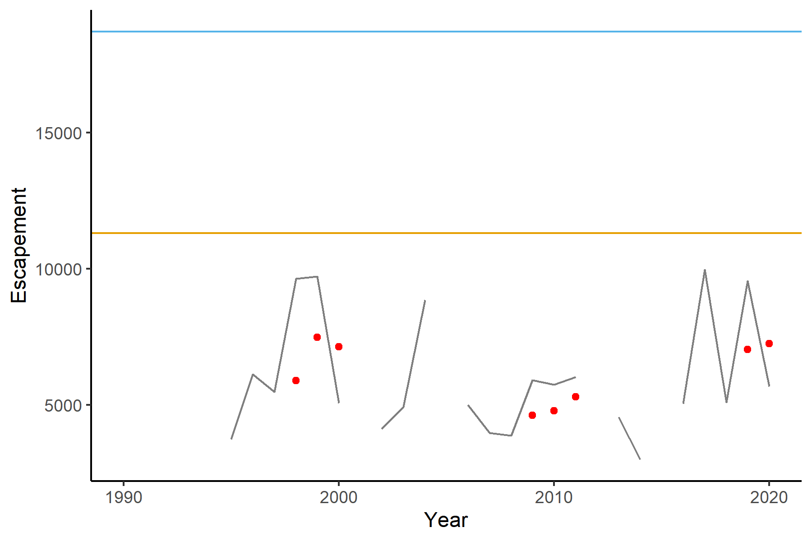
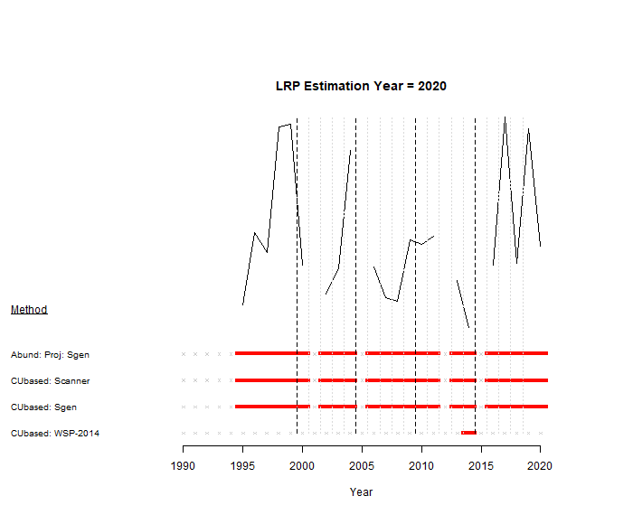

---
output:
  pdf_document: default
  html_document: default
---

\newpage
# CASE STUDY 2: WEST COAST VANCOUVER ISLAND CHINOOK{#WCVIchinookChapter}
## CONTEXT

<!-- LW comment: there are 8 labeled inlets in Fig 22, but Esparanza and Nootka are grouped together in Table 6 and the text refers to 7 inlets. Why are Nootka and Esperanza grouped? -->

The West Coast of Vancouver Island (WCVI) Chinook SMU is comprised of 3 CUs [@holtbyConservationUnitsPacific2007; @pacificsalmoncommissionPacificSalmonCommission2018; @dfoReviewUpdateSouthern2013], 7 large inlets (or sounds), and 20 escapement indicators populations which have relatively complete time-series and consistent observation methodology (Figure \@ref(fig:chinook-map), Table \@ref(tab:chinook-Overview)) [@riddellReview2001Chinook2002]. Hatcheries produce a relatively large component of the total production for many of these populations, where they help achieve harvest, conservation and assessment objectives. However, hatcheries are also considered a risk factor for the long-term sustainability of CUs because they can reduce wild genetic diversity and fitness [@withlerGeneticallyBasedTargets2018]. As described in Holt et al. (in review), only escapement indicator populations without significant enhancement (i.e., populations with Proportionate Natural Influence, PNI, values $\geqslant$ 0.5) were included in this analysis. Although most fish in these populations are of natural origin (i.e., they spawned in the wild), 'wild' fish, defined in the WSP as second generation natural-origin fish, may be in the minority [@withlerGeneticallyBasedTargets2018]. <!--CH: Chuck asked for pHOScensus values which would include out-of-basin strays. I don't have those data, but we could ask SEP/Area staff if necessary-->


```{r chinook-map, fig.cap="Map of the WCVI Chinook SMU, component CUs (coloured red, blue, and yellow), and inlets (labelled in black). Note, Designatable Units (DUs) defined by COSEWIC are aligned with CUs in this SMU.", warning=FALSE, echo=FALSE, fig.align="center"}
knitr::include_graphics("figure/chinook-map.png")
```

\renewcommand*{\arraystretch}{1.5}
\begin{table}[ht]
\centering
\caption{Overview of WCVI Chinook Stock Management Unit. Italics represent escapement indicators with average PNI values $<$ 0.5 and are excluded from analyses. The inlets, San Juan and Nitinat do not contain escapement indicator populations with PNI $\geqslant$ 0.5 and are not included in these analyses. }
\begin{tabular}{p{0.3\textwidth}p{0.2\textwidth}p{0.4\textwidth}}
\hline
CU       &  Inlets   &  Indicators \\ 
\hline
\multirow{4}{*}{\parbox{4cm}{West Vancouver Island-South (CK-31)}} & San Juan,  & \emph{San Juan}, \\
 & Nitinat, & \emph{Nitinat},  \\
 & Barkley,  & Nahmint , \emph{Sarita}, \emph{Somass},  \\
 & Clayoquot & Bedwell/Ursus , Megin , Moyeha , \emph{Tranquil} \\
\multirow{2}{*}{\parbox{4cm}{West Vancouver Island-Nootka \& Kyuquot (CK-32)}} & Nootka/Esperanza,  & \emph{Burman}, \emph{Conuma}, \emph{Gold}, \emph{Leiner}, Tahsis,  \\
&  Kyuquot &  Zeballos, Artlish, Kaouk, Tahsish \\
West Vancouver Island-North (CK-33) &  Quatsino  &  \emph{Cayeghle}, Marble \\                     
\hline
\end{tabular}
(\#tab:chinook-Overview)
\end{table}


<!-- CH: Thanks for formatting this table Catarina. If we have time, I'd like to format it so that the second column as a separate row for each inlet. I could not get it work in the pdf version of the table below, and I noticed, all inlets are in a string in the table above. I can work on this next week.
-->

<!--

----------------------- ----------------------- ----------------------------------------------
CU                      Inlets                  Indicators
----------------------- ----------------------- ----------------------------------------------
West Vancouver Island-  San Juan,               *San Juan*, 
South (CK-31)           Nitinat,                *Nitinat*, 
                        Barkley,                Nahmint , *Sarita*, *Somass*, 
                        Clayoquot,              Bedwell/Ursus , Megin , Moyeha , *Tranquil*
                                                          
West Vancouver Island-  Nootka/Esperanza,       *Burman*, *Conuma*, *Gold*, *Leiner*, Tahsis,
Nootka & Kyuquot       Kyuquot                 Zeballos,
(CK-32)                                                Artlish, Kaouk, Tahsish,
                                         
West Vancouver Island-  Quatsino                Cayeghle, Marble
North (CK-33)                

----------------------- ----------------------- ----------------------------------------------            

Table: (\#tab:chinook-Overview) Overview of WCVI Chinook Stock Management Unit. Italics represent indicators with average PNI values < 0.5 and are excluded from analyses. The inlets, San Juan and Nitinat do not contain indicator stocks with PNI < 0.5 and are not included in these analyses. WCVI is West Coast of Vancouver Island. 
 -->

\newline
This SMU was included as a case study, in part, to demonstrate the development of LRPs under data limitations when recruitment data are not available for deriving stock-recruitment based benchmarks, but habitat-based benchmarks exist, as is often the case for Chinook Salmon in BC. WCVI Chinook is also included in the proposed first batch of major stocks for regulation under the Fish Stocks provisions, necessitating the development of LRPs for this SMU. WCVI Chinook is also highly enhanced yet does not have complete data on the proportion of hatchery-origin spawners contributing to total production, similar to many other Chinook Salmon SMUs. Furthermore, this SMU was unique among the case studies in the consideration of inlets within CUs as the level of assessment, demonstrating various spatial scales that can be integrated into SMU-level assessments. This scale is similar to the sub-population scale used in sensitivity analyses for the Interior Fraser River Coho case study.

Virtually all Chinook in this SMU are 'ocean type', entering the ocean 1 to 3 months after emergence from spawning gravel [@dfoAssessmentWestCoast2012]. 'Stream type' Chinook, those that stay in the river for one year after emergence, are rare in this SMU. After entering the ocean, WCVI Chinook generally migrate into northern BC and southeast Alaskan waters to rear for 2 to 6 years, returning to spawn predominantly at ages 3, 4 and 5 [@dfoAssessmentWestCoast2012].

<!--CH, removed description of criteria required to infer status, as we don't do any sensitivity analysis for removing CUs:
We considered the 4 criteria identified in Holt et al. (in review) to evaluate if status of any one CU within this SMU could be inferred from the remaining CUs. Several dominant threats are similar across the 3 WCVI CUs. Large-scale hatcheries operating within all three CUs have resulted in genetic risks from introgression [@cosewicCOSEWICAssessmentStatus2020]. Also, straying from hatchery-influenced populations may compromises the genetic composition of spawners across WCVI.  Landslides and sedimentation from forestry impact spawning habitat quality and quantity across WCVI. However, unique to one of the CUs, West Vancouver Island-South is the relatively large number of aquaculture facilities for Atlantic salmon in nearshore habitat used by Chinook Salmon, which poses a specific threat to this CU [@cosewicCOSEWICAssessmentStatus2020]. Also unique to West Vancouver Island-Nootka and Kyuquot CU are threats from recreational fisheries (in the form of approximately 100 lodges located in important areas of Chinook Salmon rearing) and industrial effluents from pulp mills [@cosewicCOSEWICAssessmentStatus2020].


All three CUs likely experience similar freshwater environmental conditions being part of the same Freshwater Adaptive Zone, West Vancouver Island, characterized by very high river discharge, low wetland influence, and low alpine cold water and glacial influences [@holtbyConservationUnitsPacific2007]. Spawning habitats for all three CUs are primarily within the Coastal Western Hemlock biogeoclimatic zone. However, the marine environment experienced by juveniles from the West Vancouver Island-Nootka and Kyuquot and West Vancouver Island-South CUs differs from that of the West Vancouver Island-North CU [@holtbyConservationUnitsPacific2007]. The two southern CUs are influenced by the Juan de Fuca Strait which affects food chain productivity in the nearshore environments. For the northern CU, the nearshore marine environment is influenced primarily by the northward flowing coastal current in the North Pacific ocean [@cosewicCOSEWICAssessmentStatus2020].
 
The average generation time is consistent across all three CUs, and they exhibit a typical ocean-type life-history and fall run timing.  Absolute abundances are not available for any of these CUs [@brown2020SummaryAbundance2020]. 

Based on differences in threats and the coastal marine environment, we suggest that CU status cannot be inferred from neighboring CUs. We identified similarities in conditions at the CU scale because published threats assessments are available at this scale. Finer analyses at the inlet-scale could further inform the extent to which data-deficient inlets can be represented by those with data. 

-->

### Previous assessments

Two of the three CUs in this SMU, West Vancouver Island-South and West Vancouver Island-Nootka & Kyuquot, were assessed as Red status in an integrated Wild Salmon Policy assessment [@dfoIntegratedBiologicalStatus2016]. For these CUs, assessments were based on component populations without hatchery enhancement within the most recent 12 years, omitting populations with enhancement during that period. For West Vancouver Island-South, Red status was based primarily on threats of genetic introgression from strays from nearby large-scale hatcheries. For West Vancouver Island-Nootka & Kyuquot, Red status was based on a very low index of abundance for non-enhanced populations and threats of genetic introgression from strays from large-scale hatcheries. The third CU, West Vancouver Island-North, was not assessed because the indicator site for this CU was enhanced over the most recent 12 years (other metrics of hatchery enhancement, e.g., Proportionate Natural Influence or PNI were not considered). A list of escapement indicator and non-indicator populations within each CU is available in @brown2020SummaryAbundance2020. 


WCVI Chinook was identified as a stock of concern in the 2021 Integrated Fisheries Management Plan, IFMP, for South Coast Salmon, and a rebuilding plan is under development [@dfoIntegratedFisheriesManagement2021]. Poor smolt-age 2 survival rates for WCVI Chinook and low spawner levels over the past two decades are reasons for conservation concern in the IFMP [@dfoIntegratedFisheriesManagement2021, p. 129]. Since the mid 1990s, a variety of management measures have been implemented to restrict harvest on WCVI Chinook and address these concerns, described in the IFMP [@dfoIntegratedFisheriesManagement2021].


For some Chinook Salmon populations including those on the west coast of Vancouver Island, habitat-based benchmarks have been used to derive status on spawner abundances [@parkenHabitatbasedMethodsEstimate2006]. These benchmarks are estimated using an empirical relationship between watershed area of spawning habitat and two stock-recruitment benchmarks, spawner abundances at replacement, S~REP~ (also called spawners at equilibrium S~eq~), and S~MSY~, in a meta-analysis of 25 Chinook populations<!--LW: changed from stocks--> across North America [@parkenHabitatbasedMethodsEstimate2006; @liermannUsingAccessibleWatershed2010].  Benchmarks can then be predicted for populations without stock-recruitment data from their watershed area.

In November 2020, @cosewicCOSEWICAssessmentStatus2020 designated the West Vancouver Island-South and West Vancouver Island-Nootka & Kyuquot DUs as Threatened, and West Vancouver Island-North as Data Deficient. Threatened statuses were determined primarily from genetic risks of hatcheries enhancement and habitat threats from forestry. The West Vancouver Island-North DU was designated data deficient because it contains only one escapement indicator population.


## DATA

### Spatial scale

Under Canada's Wild Salmon Policy, CUs are identified at a spatial scale that allows for long-term sustainability of the species [@holtbyConservationUnitsPacific2007]. For WCVI Chinook, inlets nested within CUs are another important spatial scale of diversity given the geographic separation of spawning habitats among inlets and limited straying among inlets (D. McHugh pers. comm. DFO South Coast Stock Assessment). We used a hybrid approach in which LRPs were developed to preserve inlet-scale diversity within CUs. However, only 5 of the 7 inlets on the west coast of Vancouver Island contained indicator populations without significant hatchery influence. Both Nitinat and San Juan inlets, which are the two most southern inlets within the WCVI-South CU, have large-scale hatcheries and infrequent monitoring of sites with natural spawning. These two inlets lack escapement escapement indicator populations without significant hatchery influence.  Because the remaining five inlets with significant natural spawning are nested within the 3 WCVI Chinook CUs, preserving this inlet-scale biodiversity will also preserve CU-scale biodiversity required under the Wild Salmon Policy. Future analyses could limit LRP estimation to the scale of CUs or extend it to include all 7 inlets with additional natural escapement indicators for Nitinat Lake and San Juan Bay, if they are developed. 

### Watershed Areas

To derive habitat-based benchmarks, watershed areas were updated for WCVI Chinook using methods described in @parkenHabitatbasedMethodsEstimate2006 by identifying 3\textsuperscript{rd} order watershed areas that contain spawning habitat and omitting areas above obstacles to fish passage from the [Provincial Obstacles to Fish Passage database](https://catalogue.data.gov.bc.ca/dataset/provincial-obstacles-to-fish-passage). Only watershed areas for escapement indicator populations were included in the current analysis. These watershed areas were then summed within inlets to derive inlet-specific watershed areas (Table \@ref(tab:chinook-WA)). As a result, inlet-level benchmarks presented in this case study are on a relative scale; they only represent the abundance of select indicator streams. In future analyses, watershed areas of all known spawning populations could be included (omitting areas above obstacles to fish passage) to derive habitat-based benchmarks on an absolute abundance scale. These benchmarks could be compared against total abundances to each inlet. This approach was not used as in this case study because of large uncertainties in abundances of non-indicator populations that precluded the development of reliable estimates of total absolute abundance.
<!--LW comment: should the Watershed Area column have the unit in the header (km2)?. The CSAS document formatting instructions have a note about this-->

```{r chinook-WA, warning=FALSE, echo=FALSE}

  
dat <- as.data.frame(read.csv("data/WCVIStocks.csv"))
dat <- dat %>% dplyr::filter(Stock != "Cypre") %>% 
  dplyr::filter(Enh==0) %>%
  dplyr::group_by(Inlet) %>%
  dplyr::summarize(InletWA = sum(WA) ) %>% 
  dplyr::select(c(Inlet, InletWA)) %>% 
  dplyr::mutate(InletWA = round(InletWA,0)) %>%

  dplyr::filter(InletWA != "San Juan") %>% dplyr::filter(InletWA !="Nitinat") %>% 
  dplyr::rename("Watershed Area" = InletWA)
  
  # filter(Inlet != "San Juan") %>% filter(Inlet !="Nitinat")
  # dplyr::select(c(Stock, WA)) %>% dplyr::mutate(WA = round(WA,0)) %>%
  # dplyr::rename("Watershed Area" = WA)
csasdown::csas_table(dat, booktabs = T, caption = "Sum of watershed areas for escapement indicator populations within inlets, km\\textsuperscript{2}. Only indicator populations that are not highly enhanced (i.e., PNI $\\geqslant$ 0.5) are included.", col_names=c("Inlet", "Watershed Area,  km\\textsuperscript{2}"))

 
```

### Spawner Abundances
Spawner abundances were provided for 20 WCVI escapement indicators populations (D. Dosbon and D. McHugh pers .comm.; Table \@ref(tab:chinook-Overview); Figure \@ref(fig:chinook-IndTimeSeries)). These time-series are compiled annually by DFO South Coast Area staff for local and international assessment and management [e.g., @dfoWCVISalmonBulletin2021]. Missing values were not infilled and in some cases methodologies for monitoring changed over time, which limited the estimation of historical SMU status.  Although some escapement time-series begin in 1953, others begin as late as 1995, limiting our analyses to these most recent years that are based on a consistent escapement methodology [@pacificsalmoncommissionPacificSalmonCommission2018]. <!--CH: I haven't added the numbers of missing values, but they can be seen in the historical status plot -->In future work, infilled time-series of escapement indicator populations within inlets (or CUs) could be developed to extend the available time-series. Spawner abundances for escapement indicators populations are estimated from a combination of snorkel,  boat and aerial surveys, bank walks, and fence counts, which range in accuracy and precision [see @dfoWestCoastVancouver2014 for a summary of monitoring and assessment methods]. In particular, spawner estimates from visual surveys are a source of uncertainty for this SMU. Abundances are usually estimated using Area-Under-the-Curve (AUC) or associated maximum likelihood methods. For populations that are not surveyed continuously over the spawning season, abundances are estimated using peak counts or a combination of observations from multiple surveys, contributing additional uncertainties to the annual abundance estimates. 


<!--Diana McHugh: Citations for AUC
Irvine, J. R., J. F. T. Morris, and L. M. Cobb. 1993. Area-under-the-curve salmon escapement estimation manual. Can. Tech. Rep. Fish. Aquat. Sci. 1932: 84 p.

Bocking, R. C., J. R. Irvine, K. K. English, and M. Labelle. Evaluation of random and indexing sampling designs for estimating coho salmon (Oncorhynchus kisutch) escapement to three Vancouver Island streams. Canadian Technical Report of Fisheries and Aquatic Sciences No. 1639, 95 p. (1988).

Cousens, N., G. Thomas, C. Swann, and M. Healey. A review of salmon escapement estimation techniques. Canadian Technical Report of Fisheries and Aquatic Sciences, 1101, 122 p. (1982).

Perrin, C. J., and J. R. Irvine. A review of survey life estimates as they apply to the area under the curve method of estimating spawning escapement of Pacific salmon. Canadian Technical Report of Fisheries and Aquatic Sciences, 1733, 49 p. (1990).

The WCVI indicator stocks are all estimated based on periodic snorkel surveys, except for Somass, which has fishways.  Snorkel surveys are better for counting the mixture of species present in Sept and Oct, compared to stream walks.  Area under the curve is used for most years, with the occasional peak count if timing or survey quality cannot support an AUC.  There have been some mark resight and mark recapture studies, but to keep the time series consistent, we have stuck with the AUC method primarily.
-->
```{r chinook-IndTimeSeries, fig.cap="Time-series of spawner abundances by escapement indicator population, in units of 1000s. Dark blue time-series are escapement indicator populations where most production is from natural spawning and Proportionate Natural Index (PNI) values are generally $\\geqslant$ 0.5; light blue time-series are escapement indicator populations where hatchery production is dominant, where PNI values are generally $<$ 0.5 over available time-series. Provisional average PNI values are provided in the top right corner of each panel, where they are available.",  warning=FALSE, echo=FALSE, fig.align="center"}

knitr::include_graphics("figure/chinook-IndicatorTimeSeries.png")
# from Watershed-Area model repository
```


### Proportionate Natural Influence, PNI

The metric, Proportionate Natural Influence, PNI is used to estimate the relative strength of the hatchery and natural selective pressures in hatchery-influenced populations [@withlerGeneticallyBasedTargets2018]. PNI values for 14 WCVI escapement indicator populations were provided to DFO South Coast Stock Assessment by DFO's Salmonid Enhancement Program (J. Bokvist, pers. comm., DFO South Coast Salmon Assessment). Populations were considered significantly enhanced and excluded from our analyses if average PNI values over the available time-series where hatchery objectives have remained constant were $<$ 0.5.  Thermal marking was used to identify the proportion of hatchery-origin spawners on the spawning grounds to derive PNI values. When data on thermal marking were not available, coded-wire tags (CWTs) were used to identify hatchery-origin spawners. <!--CH: Chuck asked that we formalize our guidance on estimating PNI I think referring to these previous 2 sentences?? (not sure exactly), I have adapt this sentence for the Guidelines paper ch1 "We recommend that thermal marking be used..."--> Although Gold River had average PNI values $>$ 0.5 (0.52), most of the unmarked spawners are thought to be second generation (or descendants of) hatchery-origin fish from the Robertson Creek hatchery. Thus, Gold River was excluded from our analyses. Also, although the average PNI of Artlish was marginally $<$ 0.5 (0.46), PNI estimates were only available for one year (2015) using CWTs, which was deemed to be unrepresentative of this population which is relatively unenhanced. Thus this population was retained in our analysis. Five of the remaining six escapement indicator populations without PNI data are not thought to be significantly enhanced: Cayeghle, Kaouk, Megin, Moyeha and Tasish (D. McHugh, pers. comm., DFO South Coast Stock Assessment), and were retained in the analysis. One escapement indicator population without PNI data, Tranquil, was considered significantly enhanced and was omitted from our analyses (D. McHugh, pers. comm., DFO South Coast Stock Assessment). 

We initially considered a stricter definition of hatchery enhancement that included only populations with PNI values $\geqslant$ 0.72. This stricter threshold resulted in excluding most data since reliable time-series of PNI values and spawner abundances are only available for exploitation-rate indicator populations where coded-wire tags have been applied and sampled for recoveries, which on the WCVI tend to be populations with hatcheries. The PNI threshold of $\geqslant$ 0.5, a level associated with most fish being natural origin, accounts for the trade-off between assessing CU-level biodiversity and excluding significant hatchery impacts. 

Guidelines and methods for estimating PNI values are currently being documented by DFO's Salmonid Enhancement Program (DFO in review)^[DFO in review. Guidelines for Calculating the Proportionate Natural Influence Index as a Metric of the Genetic Influence of Enhanced Pacific Salmon on Wild Populations. Report of the Salmonid Enhancement Program, Vancouver, BC]. Uncertainties in PNI values stem from low sample sizes on the spawning grounds to estimate proportion hatchery-origin spawners, large uncertainties from CWT estimates of hatchery-origin spawners due to insufficient marking of hatchery production, and lack of data on proportions of natural-origin brood stock (and assumption that proportions of natural-origin brood stock equal proportions of natural-origin spawners). 

Because current and historical times-series of the proportion of hatchery-origin spawners were not consistently available for populations with PNI $\geqslant$ 0.5, total spawner abundances (i.e., combined natural- and hatchery-origin spawners) were used in the assessment of CU and aggregate SMU level statuses. This may result in optimistic assessments of status.  We recommend the design of hatchery marking and spawning ground sampling programs to collect data to estimate the contribution of hatchery-origin spawners to total production for these escapement indicator populations. The inclusion of hatchery-origin fish in estimates of status is a key source of uncertainty for this SMU, and likely many others in Pacific Region.

<!--KH: To think about for guidelines paper: are we recommending average PNI $>$ 0.5 over the available time series as a threshold for including in LRP calculations?  If so, do we have advice about how to deal with trends in PNI over time? When looking at the Interior Fraser Chinook data way back when, I seem to recall that PNI was variable over time for several of those streams.  

CH: my initial thinking would be remove time-periods where PNI is very high from analyses. This is similar to approach of FR sockeye, where they removed historical periods of high hatchery enhancement in SR time-series. However, I think we could probably leave this as a recommendation that should come from SEP. For IFR, I think starting the data in 1998 removes most/all of those problems?
-->


## INLET AND CU STATUS ESTIMATION
<!--CH: Mention caveat about northern CU/inlet being DD possibly?-->


Inlet status was derived by applying the multidimensional algorithm used within the Pacific Salmon Status Scanner to individual inlets (Pestal et al., in prep). We found that the status using this algorithm was equivalent to status on a single metric, abundances relative to an estimated lower benchmark for all inlets. When abundances are only available on a relative scale and abundance benchmarks can be estimated, status within the multidimensional algorithm reduces to spawner abundances relative to abundance-based benchmarks  (as shown in Figure \@ref(fig:decision-tree)). Because the resulting LRPs were equivalent, in some cases we present only a single set of results, labeled as the single metric approach which also represents status based on the multidimensional algorithm in this case. Holt et al. (in review) recommend applying the multidimensional approach used in the Salmon Scanner to derive CU-level status.

S~gen~ is the spawner abundance required to achieve S~MSY~ within one generation without fishing under equilibrium conditions, and is the lower benchmark on abundances applied under the WSP. We derived S~gen~ by optimizing the Ricker equation with recruitment set to S~MSY~ (equation \@ref(eq:Sgen) repeated again here for transparency):


\begin{equation}
  S_{MSY} = a \cdot S_{gen} \cdot e^{-b * S_{gen}}
   (\#eq:Sgen2)
\end{equation}

where, <!-- comma seems unnecessary here?-->

\begin{equation}
  b = \frac{\log(a)}{S_{REP}}
   (\#eq:ricB)
\end{equation}
 

\begin{equation}
  S_{MSY} = \frac{1 - W{e^{1-\log(a)}} } {b}
   (\#eq:SMSY)
\end{equation}

and $a$ is recruits-per-spawner at low productivity and *W* represents a Lambert function [@scheuerellExplicitSolutionCalculating2016]. Maximum likelihood estimates of S~REP~ values (and 95% CIs) were derived from the watershed-area model adapted from @parkenHabitatbasedMethodsEstimate2006, that included hierarchical structure in the underlying meta-analysis accounting for similarities in productivity among ocean-type and stream-type fish [@liermannUsingAccessibleWatershed2010, Table \@ref(tab:chinook-benchmarks)]. 

Ricker $a$ values were approximated from a life-stage model that partitioned survival across freshwater and marine life-stages for ocean-type Chinook based on empirical data and expert opinion (W. Luedke pers. comm. DFO South Coast Stock Assessment). Life-stage specific survival rates were then combined to derive an overall survival from spawners to recruitment . Despite the relatively large uncertainties in the life-stage specific survival rates, this approach provides an approximation for productivity that is more realistic than the high estimate previously derived from the watershed-area model and reported for many other ocean-type Chinook populations  [$>$ 7 recruits/spawner, @parkenHabitatbasedMethodsEstimate2006].  From the life-stage model, mean $a$ values were estimated at ~2.7 recruits-per-spawner, with standard errors ranging from 1.6 to 4.5). <!--CH note to remind myself: "We assumed these parameter distribution represented expected productivity, and so log-normal bias corrections were not applied."  -->


Our approach to estimating S~MSY~ (and S~gen~) differed from that of @parkenHabitatbasedMethodsEstimate2006, because we derived productivity independently, whereas @parkenHabitatbasedMethodsEstimate2006 estimated both S~MSY~ and S~REP~ from the watershed-area model thereby inferring relatively high estimates of productivity, $a$. Those estimates of productivity were deemed unrealistically high for WCVI Chinook, necessitating the alternative approach adopted here. 


Approximate confidence intervals of S~gen~ were estimated by repeated sampling of the normal distributions of S~REP~ and $\log(a)$, with standard deviations in log(S~REP~) derived from the watershed-area model. This method does not account for covariance between productivity and capacity typically found in stock-recruitment relationships, and will overestimate uncertainty in derived benchmarks. In future analyses, we recommend Bayesian estimation of habitat-based benchmarks to facilitate integration of uncertainties from various sources. <!--CH note: I change "bootstrapped CIs" to "approximate CIs,... calculated from repeated sampling"-->
<!--CH notes: we used 95%CI of SREP to approximate the Bayesian posteriors for SREP (and resulting uncertainty in Sgen) --> 

```{r chinook-benchmarks}
inlets <- c("Barkley", "Clayoquot", "Kyuquot", "Nootka/Esperanza", "Quatsino")
 
bench <- as.data.frame(read.csv("data/wcviCK-BootstrappedRPs.csv"))
bench <- bench %>% dplyr::mutate(Value = round (Value,0), lwr = round (lwr,0), 
                                 upr = round (upr,0) )
bench <- bench %>% tidyr::pivot_wider(id_cols = Stock, 
                                      names_from = c(RP),#, lwr.name, upr.name), 
                                      names_sep = ".",
                                      values_from = c(Value,lwr,upr) ) 
bench <- bench %>% dplyr::filter(Stock != "Cypre"&
                                   Stock != "WCVI Nootka & Kyuquot"&
                                   Stock != "WCVI North"&
                                   Stock != "WCVI South") %>% 
  dplyr::rename(Sgen = Value.SGEN) %>% 
  dplyr::rename(SREP = Value.SREP) %>% 
  dplyr::rename(Sgen.lwr = lwr.SGEN) %>% 
  dplyr::rename(SREP.lwr = lwr.SREP) %>% 
  dplyr::rename(Sgen.upr = upr.SGEN) %>% 
  dplyr::rename(SREP.upr = upr.SREP) %>% 
  dplyr::filter(Stock %in% inlets) %>% 
  dplyr::rename("Population or inlet" = Stock)
  

bench <- bench %>% dplyr::select(c("Population or inlet", Sgen, Sgen.lwr, Sgen.upr, SREP, SREP.lwr, SREP.upr))
csasdown::csas_table(bench, booktabs = T, caption = "Benchmarks and approximate 95% confidence limits (labelled to the right of each benchmark) for five inlets, including only escapement indicator populations that are not highly enhanced.", col_names =c("Population or Inlet", "S\\textsubscript{gen}", "upper 95%CL", "lower 95%CL",  "S\\textsubscript{REP}", "upper 95%CL", "lower 95%CL")) %>% kableExtra::row_spec(20, hline_after=TRUE)


```

```{r chinook-InletTimeSeries, fig.cap="Time-series of spawner abundances by inlet, including only escapement indicator populations that are not highly enhanced. Horizontal yellow line is S\\textsubscript{gen} and dots are generational geometric average spawner abundances coloured by red (below S\\textsubscript{gen}) and grey (above S\\textsubscript{gen}).",  warning=FALSE, echo=FALSE, fig.align="center"}

#knitr::include_graphics("figure/chinook-WCVI-inlet-timeseries-nEnh-bs.png")
knitr::include_graphics("figure/chinook-inlet-timeseries.png")

```


CU status was derived from the proportion of component inlets above their lower benchmarks. Serious harm is expected to occur at levels where any one inlet within each of the three CUs dropped below its lower benchmark. Here we have assumed that the status of the one escapement indicator population in the West Vancouver Island-North CU (Marble River, in Quatsino Sound) is not significantly enhanced and is representative of the CU. However, further review of these assumptions by local experts is warranted.

## LRP ESTIMATION: CU STATUS BASED


### Methods

The LRP on the proportion of CUs was identified as all 3 CUs containing inlets with current statuses exclusively above Red status.  Because inlets are nested within CUs, this LRP accounts for the distribution of spawning among inlets within CUs. If any CU contained an inlet with Red status, the LRP was considered breached. Status of component inlets was derived from the multidimensional approach used within the Pacific Salmon Status Scanner, which for this SMU reduced to a single metric of spawner abundances relative to the lower benchmark, S~gen~. 

We further considered a CU status-based LRP based on CU statuses derived from a previously published WSP integrated assessment [status in 2014 only, @dfoIntegratedBiologicalStatus2016].

### Results

 <!--CH omit: repeated above: "Status of inlets was inferred from spawner abundances against abundance-based lower benchmarks. This is because time-series of abundances for WCVI Chinook are not absolute (only escapement indicator populations are monitored consistently) and relative-abundance benchmarks can be identified (S~gen~ and S~MSY~).-->In the most recent year with data, 2020, four of the five inlet had abundances above their abundance-based lower benchmark, S~gen~ (Figure \@ref(fig:chinook-InletTimeSeries)). Therefore, two of the three CUs contained inlets with current statuses exclusively above their lower benchmarks. One CU, Southern Vancouver Island, contains an inlet, Clayoquot, with status that has been consistently below its lower benchmark throughout the available time-series. Therefore, this SMU falls below the LRP of 100% of CUs above Red status.

<!--CH omit: For this SMU, the status derived from spawner abundances relative to benchmarks is equivalent to status derived from the multidimensional algorithm used in the Salmon Scanner. -->

Only two of the three component CUs were assessed in the previously published WSP assessment, though those CUs were assessed as Red in 2014. For this year, the LRP would be considered breached because at least one CU had Red status. 

## LRP ESTIMATION: AGGREGATE ABUNDANCE, LOGISTIC REGRESSION LRPS

Logistic regression LRPs <!--based on the probability of all component inlets (nested within CUs) exceeded their lower benchmarks -->could not be identified for WCVI Chinook because there are no years when all inlets were above their lower benchmark in the historical record (Figure \@ref(fig:chinook-InletTimeSeries)). In order to fit a logistic regression model to data, observations of successes (years when all inlets were $>$ lower benchmarks) and failures (years when all inlets were not $>$ lower benchmarks) are required. The estimation of logistic regression LRPs is limited to SMUs with historical records that demonstrate contrast in status over time.

## LRP ESTIMATION: AGGREGATE ABUNDANCE, PROJECTION LRPS

### Methods

Projection LRPs were derived for WCVI Chinook by projecting inlet-specific population dynamics using the `samSim` modelling tool (Appendix \@ref(app:samsim-appendix)). We chose to project inlet-specific rather than CU-specific population dynamics to reflect the relative demographic isolation of inlets. Population dynamics and exploitation parameters were derived from a previously developed CU-specific run-reconstruction for WCVI Chinook based on spawner abundances and age compositions from indicator populations, and exploitation rates from the Robertson Creek hatchery indicator population (D. Dobson & D. McHugh, pers. comm. DFO South Coast Stock Assessment). Because this run-reconstruction has not been peer-reviewed, it is not used to develop benchmarks, but can provide plausible distributions for parameters of projections. CU-specific parameters were applied across all component inlets. Inlet-specific population capacities, S~REP~, were estimated from the watershed-area model [@parkenHabitatbasedMethodsEstimate2006] (Table \@ref(tab:chinook-WA)) and applied in projections of recruitment with a Ricker stock-recruitment model. Base-case parameters are provided in Table \@ref(tab:chinook-BaseCasePars) and sensitivity analyses are described in the text below.  


The model was initialized at inlet-specific equilibrium abundances and projected for a 40-year initialization period to stabilize the distributions of spawner abundances. The model was then run for an additional 30 years and annual aggregate abundances and inlet-specific statuses were recorded. Because the projections identify long-term equilibrium abundances and statuses, the outputs are independent of initial abundances. Projections were summarized over 50,000 random Monte Carlo trials. A relatively large number of Monte Carlo trials was required for LRP estimation because the algorithm required a sufficient sample size within each 200-fish incremental bin of aggregate abundances along a range of realistic abundances (from near zero to carrying capacity). <!-- CH comment: for base case, though we used only 10,000 for sensitivity analyses. --> Projection LRPs were identified from the aggregate abundances with specified probabilities of all component inlets being above lower benchmarks. We recommend a review of model assumptions and parameters by local experts prior to adopting a projection LRP for this SMU. We provide an example for demonstration purposes.


\renewcommand*{\arraystretch}{1.6}
\begin{longtable}[]{p{3.7cm} p{5cm} p{6.3cm}}
\caption{Parameters used for inlet-specific projections of WCVI Chinook population dynamics.}\\
\hline
Parameter & Value & Source \\ 
\hline
\endhead
Ricker $log(a)$ (mean)  &  WCVI-South = 1.14, WCVI-Nootka \& Kyuquot =1.58, WCVI-North = 1.53 & Run reconstruction for WCVI Chinook (1985-2019, D. Dobson \& D. McHugh pers. comm.)\\

Ricker $log(a)$ (SD) & 0.5 &  Approximate 95\% CI and bounds from life-stage specific model (W. Luedke per. comm.)\\
S\textsubscript{REP} (Spawners at replacement, mean) & Barkley = 637, Clayoquot = 7879, Nootka/Esperanza = 1184, Kyuquot = 5273, Quatsino = 3384 & MLE estimate from watershed-area model \\

S\textsubscript{REP} (SD) & Barkley = 0.40, Clayoquot = 0.30, Nootka/Esperanza = 0.37, Kyuquot = 0.31, Quatsino = 0.32 & Derived from standard error of MLE estimate from the watershed-area model \\

SD in Ricker residuals (sigma) & WCVI-South = 0.80, WCVI-Nootka \& Kyuquot = 0.69, WCVI- North = 0.68 & Run reconstruction for WCVI Chinook (1985-2019, D. Dobson \& D. McHugh pers. comm.)\\

Covariance in Ricker residuals among inlets & Equal to covariance in spawner time-series among inlets & Covariance in spawners among inlets from wild escapement indicator populations (D. Dobson \& D. McHugh, pers. comm.) \\ 

Ave proportions of age-at-maturity (age 2, 3, 4 and 5). Ages 5 and 6 are grouped. &  WCVI-South = 0.02, 0.14, 0.45, 0.38; WCVI-Nootka \& Kyuquot = 0.01, 0.10, 0.48, 0.40; WCVI-North = 0.02, 0.15, 0.47, 0.36 & Average proportions from run reconstruction (D. Dobson \& D. McHugh pers. comm.) \\ 

Variability in age proportions (tau from multivariate logistic distribution)  & WCVI-South = 0.7, WCVI-Nootka \& Kyuquot = 0.6, WCVI-North = 0.7 & Estimated from time-series of proportions of ages-at-maturity from the run reconstruction. Assumed variable over CUs and years. \\

Average exploitation rate & 0.30 & Average pre-terminal ERs 2010-2019 for Robertson Creek hatchery indicator (D. Dobson \& D. McHugh pers. comm.). Varied in sensitivity analyses 0.05 - 0.45.\\

Interannual variability in exploitation rates (CV) & 0.17 & Estimated from pre-terminal ERs 2010-2019 for Robertson Creek hatchery indicator. Assumed to be Beta distributed, constrained between 0-1.\\

Variability in exploitation rates among inlets (CV) & 0.085 &  Assumed to be half of interannual variability, varied in a sensitivity analysis (0-0.17). Assumed to be Beta distributed, constrained between 0-1.\\

Initial abundances  &  S\textsubscript{REP} (inlet-specific) & MLE from watershed-area model\\

\hline
(\#tab:chinook-BaseCasePars)
\end{longtable}
<!-- CH removed from table:
Extirpation threshold &  2 & Minimum abundance     required for mating \\
-->

<!--
----------------------------------------------------------------------------------------------
Paremeter               Value                       Source
----------------------- --------------------------- ------------------------------------------
Ricker $a$ (mean)       WCVI-South = 1.14,          Run reconstruction for WCVI Chinook (1985- 
                        WCVI-Nootka & Kyuquot =    2019, D. Dobson & D. McHugh pers. comm.)
                        1.58,                          
                        WCVI-North = 1.53

                                                                              
Ricker $a$ (SD)         0.5                         Approximate 95% CI and bounds from life-
                                                    stage specific model (W. 
                                                    Luedke per. comm.)

                                                    
$S_{REP}$               Barkley = 637,              MLE estimate from watershed-area model
(Spawners at            Clayoquot = 7879,
replacement, mean)      Nootka/Esperanza = 1184,
                        Kyuquot = 5273,
                        Quatsino = 3384,


$S_{REP}$ (SD)          Barkley = 0.40,             Derived from standard error of MLE 
                        Clayoquot = 0.30,           estimate from the watershed-area model
                        Nootka/Esperanza = 0.37,
                        Kyuquot = 0.31,
                        Quatsino = 0.32,

Ricker sigma            WCVI-South = 0.80,          Run reconstruction for WCVI Chinook (1985- 
                        WCVI-Nootka & Kyuquot =     019, D. Dobson & D. McHugh pers. comm.)
                        0.69,
                        WCVI- North = 0.68
                         

Covariance in Ricker    Equal to covariance in      Covariance in spawners among inlets from 
residuals among inlets  spawner time-series         wild indicator populations (D. Dobson & D. 
                        among inlets                McHugh, pers. comm.)

Ave age proportions     WCVI-South = 0.02, 0.14,    Ave ppns from run reconstruction (D. 
at maturity (age 2, 3,  0.45, 0.38;                 Dobson & D. McHugh pers. comm.)
4 and 5). Ages 5 and 6  WCVI-Nootka & Kyuquot = 
are grouped.            0.01, 0.10, 0.48, 0.40;
                        WCVI-North = 0.02, 0.15,
                        0.47, 0.36

Variability in age      WCVI-South = 0.7,           Estimated from time-series of ppns of 
ppns (tau from          WCVI-Nootka & Kyuquot =     ages-at-maturity from the run  
multivariate            0.6,                        reconstruction. Assumed variable over CUs
logistic distribution)  WCVI-North = 0.7            and years. 
                                                    
                        
Average exploitation    0.30                        Average pre-terminal ERs 2010-2019 for
rate                                                Robertson Creek hatchery indicator (D. 
                                                    Dobson & D. McHugh pers. comm.). Varied 
                                                    in sensitivity analyses 0.05 - 0.45.
                                                    
Interannual             0.17                        Estimated from pre-terminal ERs 2010-2019
variability in                                      for Robertson Creek hatchery indicator.
exploitation rates                                  Assumed to be beta distributed,
(CV)                                                constrained between 0-1.
                                                    
                                                    
Variability in          0.085                       Assumed to be half of interannual
exploitation rates                                  variability, varied in a sensitivty 
among inlets (CV)                                   analysis (0-0.17). Assumed to be beta        
                                                    distributed, constrained between 0-1.  

Initial abundances      S<sub>REP</sub> (inlet-     MLE from watershed-area model
                        specific)
                        
Extirpation threshold   2                           Mating constraint

----------------------- --------------------------- ------------------------------------------
Table: (\#tab:chinook-BaseCasePars) Parameters used for inlet-specific projections of WCVI Chinook population dynamics.
-->


We chose covariance parameters so that the resulting projections of inlet-specific spawner abundances exhibited correlations among inlets that were similar to those observed (Figure \@ref(fig:chinook-RunningCorrelations)). Specifically, model parameters were tuned so that resulting correlations among inlets in projected spawner abundances approximated observed correlations in spawner abundances, described in more detail below.

Pairwise correlations between observed inlet-specific spawner time series were relatively strong in the 1990s and early 2000s, and have become slightly weaker since 2015.  The correlations among inlets for running 20-year time periods are provided in Figure \@ref(fig:chinook-RunningCorrelations). Starting in 1995, the first boxplot displays the distribution of pair-wise correlations among the five inlets for the time period 1995-2015; the second boxplot displays correlations for 1996-2016, etc. A decline in correlations in evident in the last two time periods. The final boxplot shows the correlation over the entire time-series.

```{r chinook-RunningCorrelations, echo=FALSE, fig.cap = "Running correlations in spawner abundances among inlets in 20-year time periods, with the start year of the 20-year period on the X-axis. Each boxplot shows the distribution of pairwise correlations among the five inlets (n=10 pairwise correlations).", out.width = '60%'}

knitr::include_graphics("figure/chinook-RunningCorrelations.png")
```


\newline
Within the forward projection model, correlations in spawner abundances among inlets are driven by three model components, each described in more detail below: (1) covariance in exploitation rates among inlets, (2) covariance in recruitment residuals among inlets, and (3) covariance in age proportions of recruits among inlets. 

```{r chinook-ER, echo=FALSE, fig.cap = "Pre-terminal exploitation rates for Robertson Creek CWT indicator population.", out.width = '60%'}
ERs <- read.csv("data/WCVIER.csv")
ggplot(ERs,aes(Year, ER)) + geom_point() + geom_line()
```

\newline
**Covariance in exploitation**

Covariance in exploitation rates among inlets is modelled as common interannual exploitation parameterized from pre-terminal exploitation on Robertson Creek hatchery Chinook, with additional inlet-specific variability. The common variability occurs due to their overlapping distribution in offshore fisheries, whereas inlet-specific variability results form inlet-specific vulnerability to exploitation in coastal waters and terminal fisheries within the inlets.

We assumed an average exploitation rate as observed for WCVI Chinook in recent years (2010-2019, Robertson Creek indicator, 30%, Figure \@ref(fig:chinook-ER)). In projections, interannual variability in exploitation rates was assumed to be Beta distributed (constrained between 0 and 1), parameterized from estimated pre-terminal exploitation rates for Robertson Creek, with a coefficient of variation (CV) = 0.17 (Table \@ref(tab:chinook-BaseCasePars)). Without data to parameterize inlet-specific variability in exploitation rates, we assumed the inlet-specific variability was half the common (SMU-level) interannual variability (CV=0.085), and varied this in sensitivity analyses from 0 and 0.17 to cover plausible bounds (Figure \@ref(fig:chinook-ERdist)). 

```{r chinook-ERdist, echo=FALSE, fig.cap = "Variability in projected exploitation rates over time (cv=0.17) and among inlets (CV=0.085), from an average exploitation of 0.3.", out.width = '50%'}
nTrials <- 100000
canERlabel <- 0.30
set.seed(1)

# Density of ERs with cvER=0.085(either interannual or among CUs)
canER <- canERlabel
cvER <- 0.085
sigCanER <- cvER*canER
shape1 <- canER^2 * (((1-canER)/sigCanER^2)-(1/canER))
shape2 <-shape1 * (1/canER-1)
out1 <- rbeta(nTrials,shape1,shape2)

# Density of ERs with cvER=0.17
cvER <- 0.17
sigCanER <- cvER*canER
shape1 <- canER^2 * (((1-canER)/sigCanER^2)-(1/canER))
shape2 <-shape1 * (1/canER-1)
out2 <- rbeta(nTrials,shape1,shape2)


#Density of ERs with cvER=0.17 interannually and 0.085 among CUs
canER <- out2
cvER <- 0.085
sigCanER <- cvER*canER
shape1 <- canER^2 * (((1-canER)/sigCanER^2)-(1/canER))
shape2 <- shape1 * (1/canER-1)


sampBeta<-function(nTrial) {
  # If assuming among CU variability changes every year
  #x<-rbeta(1,shape1[nTrial],shape2[nTrial])
  
  # If assuming among CU variability is constant over time
  x<-qbeta(rand,shape1[nTrial],shape2[nTrial])
}

randCU <- runif(5)

rand <- randCU[1]
out3 <- sapply(1:nTrials,sampBeta)
rand <- randCU[2]
out3b <- sapply(1:nTrials,sampBeta)
rand <- randCU[3]
out3c <- sapply(1:nTrials,sampBeta)
rand <- randCU[4]
out3d <- sapply(1:nTrials,sampBeta)
rand <- randCU[5]
out3e <- sapply(1:nTrials,sampBeta)


out <- data.frame( cvER = c(rep("0.085",nTrials), rep("0.17",nTrials), 
                            rep("0.085 x 0.17",nTrials)),
                   ExploitationRate = c(out1, out2, out3) )


g2 <- out %>%  dplyr::filter(cvER=="0.085"|cvER=="0.17") %>%
  ggplot(aes(ExploitationRate, colour = cvER, fill = cvER)) +
  geom_density (alpha = 0.1) +
  xlim (0,1) +
  geom_vline (xintercept = canERlabel) +
  theme(axis.title.x = element_text(size=18),
        axis.title.y = element_text(size=18))


g2
```


We assumed that inlet-specific deviations from the SMU-level average exploitation rate were consistent over years (e.g., due to the spatial and temporal variability in inlet-specific migration patterns affecting vulnerability to fisheries), but that this deviation changed over MC trials. Future analyses could include consistent biases in exploitation for specific inlets (e.g., positive biases for southern inlets and negative biases for northern inlets).


In the forward projections, pairwise correlations in projected spawner abundances among inlets were similar to recent observed pairwise correlations in spawner abundances among inlets (Figure \@ref(fig:chinook-boxplots)). Varying assumptions about variability in exploitation among inlets between CV= 0 and 0.17 did not impact the distribution of correlations in spawner abundances in the projections.  

```{r chinook-boxplots, echo=FALSE, fig.cap="Distribution of correlations of spawner abundances among inlets for observed data over the most recent 20 years (n=10 pairwise correlations, 1st boxplot) and projected time-series under various assumptions: with a CV in exploitation rates among inlets = 0, 0.085 or 0.17 (0.85 is the base case)(2nd-4th boxplots), with a scalar on covariance in recruitment residuals of 0 (no correlation in recruitment residuals), 0.5 and 1 (equal to observed spawner correlations, base case)  (5th-7th boxplots), and variable or constant age proportions among inlets (variable is the base case) (8th-9th boxplot). For each set of assumptions the other variables were held constant at base-case values.", out.width = '60%'}
# knitr::include_graphics(here::here("figure/chinook-compareEscCor-cvER.png"))

download.file('https://github.com/Pacific-salmon-assess/SalmonLRP_RetroEval/raw/master/WCVIChinookStudy/Figures/ProjectedLRPs/compareEscCor.png', './figure/chinook-compareEscCor.png',  mode="wb")


# Consider adding another run with annualcvER=FALSE (cvER =0.21) in Appendix
```
\newline
**Covariance in recruitment residuals**

We parameterized correlations in recruitment residuals among inlets from the observed correlations in spawner abundances among inlets derived from the WCVI Chinook run reconstruction (D. Dobson and D. McHugh, pers. comm. DFO South Coast Stock Assessment, Fig. \@ref(fig:chinook-bubbleCor)). 
However, spawner abundances may be more weakly correlated than recruitment due to differences in exploitation among inlets and sub-populations within inlets.


In sensitivity analyses, we scaled pairwise correlations in recruitment residuals among inlets by 0.5 and 0 of the observed spawner correlations (0 representing recruitment residuals that were uncorrelated among inlets in the projections). 
We then compared the resulting correlations in projected spawner abundances to observed correlations, to evaluate the extent to which the model provided realistic projections under each assumption. 


```{r chinook-bubbleCor, echo=FALSE, fig.cap="Bubble plot of correlations in spawner abundances among inlets over time, 1994-2020.", out.width = '50%'}


```

When we scaled correlations in recruitment residuals to less than observed spawner correlations (i.e., scalar $<$ 1) the resulting correlations in spawner abundances from the projections were lower than observed correlations (Figure \@ref(fig:chinook-boxplots)), but were roughly similar when recruitment residuals were scaled to 1. So, for our base case, we assumed correlations in recruitment residuals among inlets were equal to observed correlations among inlets.
\linebreak

**Variability in proportions in age-at-maturity among inlets**

For the base case, we assumed that proportions in age-at-maturity varied over time and among inlets parameterized from proportions of ages-at-maturity calculated for each CU in the WCVI Chinook run reconstruction (D. Dobson pers. comm. DFO Science; inlet-specific age-proportions were not available) (Figure \@ref(fig:chinook-agePpns)). We used the CU-specific mean proportions at each age from the run reconstruction with annual deviations in those proportions based on a multivariate logistic distribution, parameterized from the estimated time-series of age proportions.

For these analyses, recruitment was calculated from total spawner abundances (i.e., combined natural- and hatchery-origin spawners) and catches, which may result in biased proportions for hatchery-influenced populations if hatchery-origin adults return at different (younger) ages than natural-origin salmon [@larsenMaintainingWildPhenotype2019].  As mentioned above, the inclusion of hatchery-origin fish in estimates of status is a key source of uncertainty for this SMU.


```{r chinook-agePpns, echo=FALSE, fig.cap="Time-series of proportions at age in recruitment aligned by brood year, calculated from run reconstruction for WCVI Chinook by CU.", out.width = '80%'}
cuAges <- read.csv("data/WCVICUages.csv")
cuAges <- cuAges %>% tidyr::pivot_longer(cols=c("age2", "age3", "age4", "age5"),
                                  names_to="Age", values_to="Proportion")

cuAges$CU_Names. <- factor(cuAges$CU_Names,
                            levels=c("Southwest_Vancouver_Island",
                                     "Nootka_Kyuquot",
                                     "Northwest_Vancouver_Island",
                                     "Westcoast_Vancouver_Island"))

cuAges %>% filter(CU_Names!="Westcoast_Vancouver_Island") %>%
  ggplot(aes(BroodYear, Proportion, group=CU_Names., colour=CU_Names.)) +
  geom_line() +
  facet_wrap(~Age, ncol=1)
#If required, consider adding geom_density of pairwise correlations in estimated age ppns of recruits

```


We ran a sensitivity analysis under an alternative assumption where age proportions varied over years but were constant among CUs. Under this assumption, we found that pairwise correlations of spawner abundances in projections were much higher than those observed (Figure \@ref(fig:chinook-boxplots)), generating time-series that were unrealistic. 

### Results

Projection LRPs were developed under the base-case assumptions of (1) interannual variability in exploitation rates among inlets with a CV = 0.085, (2) correlations in recruitment residuals among inlets equal to observed spawner correlations among inlets, and (3) variability in age proportions among CUs and years. We identified a provisional aggregate abundance LRP with p=0.5 (50% probability of all inlets being greater than their lower benchmark) equal to `r (read.csv("data/chinook-ProjectedLRPsbaseER_ALLp.csv")%>% pull(LRP))[1]` (Figure \@ref(fig:chinook-baseCaseProjLRP)). Provisional LRPs at p=0.66 ("likely" that all inlets are above their lower benchmarks) is also shown, near 20,000 (Figure \@ref(fig:chinook-baseCaseProjLRP)). Probabilities that all inlets were above their lower benchmarks never exceeded 0.9, so LRPs at higher p values could not be estimated. Note that the LRP at p=0.66 required more MC trials for full stabilization and is shown here for demonstration purposes only.


```{r chinook-baseCaseProjLRP, echo=FALSE, fig.cap="Probability of all inlets being above their lower benchmark along a gradient in aggregate abundances within bins of 200 fish, derived from projections over 30 years and 50,000 MC Trials.  Each dot is the proportion of MC trials where all inlets were > lower benchmarks. Candidate LRPs at p=0.5 (yellow) and p=0.66 (blue) are highlighted, where p is the probability of all inlets being > their lower benchmarks.", out.width = '60%', fig.pos='!ht'}

download.file('https://github.com/Pacific-salmon-assess/SalmonLRP_RetroEval/raw/master/WCVIChinookStudy/Figures/ProjectedLRPs/baseER-ProjLRPCurve-ALLp.png', './figure/chinook-baseER-ProjLRPCurve-ALLp.png',  mode="wb")

knitr::include_graphics("figure/chinook-baseER-ProjLRPCurve-ALLp.png")

```


Candidate projection LRPs were compared against time-series of aggregate abundances observed for WCVI Chinook salmon (sum of escapement indicator populations with PNI $>$ 0.5), showing that abundances are currently below these LRPs and have been near or below them over the available time-series (Figure \@ref(fig:chinook-statusProjLRP)).
<!--CH; remove WCVI Chinook label at top of plot, and change colour of horizontal lines-->
```{r chinook-statusProjLRP, echo=FALSE, fig.cap="Time-series of aggregate escapement for WCVI Chinook (indicator populations with PNI >= 0.5), with projection LRPs associated with component inlets being > lower benchmarks at p=0.5 (yellow) and p=0.66 (blue). Red points are the generational average escapement (geometric mean), indicating status below LRPs", out.width = '60%'}

#knitr::include_graphics("figure/chinook-WCVI-SMUtimeseries.png")


```

### Sensitivity Analyses

We considered sensitivity analyses on interannual variability in exploitation rates among inlets with a CV = 0 and 0.17<!--with CV between 0 and 0.17?--> (Figure  \@ref(fig:chinook-projLRPcvER)), and found LRPs at 50% probability were not sensitive to interannual variability in exploitation rates over the range of values we considered.


```{r chinook-projLRPcvER, echo=FALSE, fig.cap="Probability of all inlets being above their lower benchmark along a gradient in aggregate abundances within bins of 200 fish, derived from projections over 30 years and 50,000 MC Trials. The projections assumed variability in ERs among inlets with a CV=0, 0.085, and 0.17.", out.width = '80%'}

download.file('https://github.com/Pacific-salmon-assess/SalmonLRP_RetroEval/raw/master/WCVIChinookStudy/Figures/ProjectedLRPs/cvER-ProjLRPCurve-ALLp.png', './figure/chinook-cvER-ProjLRPCurve-ALLp.png',  mode="wb")

knitr::include_graphics("figure/chinook-cvER-ProjLRPCurve-ALLp.png")

```


We further considered sensitivity analyses on average exploitation rates from 5-45% (Figure \@ref(fig:chinook-projLRPER)), where 30% exploitation was the base case. As exploitation increased, the LRP associated with a specified probability of all inlets being above their lower benchmark also increased. At high exploitation, individual inlets dropped below their lower benchmarks more frequently despite often relatively high aggregate abundances on the remaining inlets.   


```{r chinook-projLRPER, echo=FALSE, warning=FALSE, fig.cap="Probability of all inlets being above their lower benchmark along a gradient in aggregate abundances within bins of 200 fish, derived from projections over 30 years and 50,000 MC Trials, under a range of average exploitation rates from 5-45\\%. Candidate LRPs at p=0.5 (yellow) and p=0.66 (blue) are highlighted."}

download.file('https://github.com/Pacific-salmon-assess/SalmonLRP_RetroEval/raw/master/WCVIChinookStudy/Figures/ProjectedLRPs/ERs-ProjLRPCurve-ALLp.png', './figure/chinook-ERs-ProjLRPCurve-ALLp.png',  mode="wb")

knitr::include_graphics("figure/chinook-ERs-ProjLRPCurve-ALLp.png")

```


To explain the initially counter-intuitive result of the sensitivity of projection LRPs to exploitation rates, we ran additional analyses for a hypothetical SMU where the spawner-recruitment parameters were either varied or kept constant over component inlets (or CUs) and Monte Carlo trials, and a range of exploitation rates were applied (Appendix \@ref(app:ERsensitivity-appendix)). Based on these sensitivity analyses, we found that differences in productivity among component inlets results in inlet-specific variability in sensitivity to exploitation rates. Inlets with relatively low productivity fall below lower benchmarks more frequently. This effect is accentuated when exploitation rates are high resulting in divergences in status among inlets and higher aggregate abundances required for all inlets to be above their lower benchmarks (i.e., higher LRP). 


Given uncertainty in current and anticipated productivity, projection LRPs were further evaluated under a range of productivities from 75% - 150% of base case estimates, under current exploitation. Scenarios with lower productivity ($<$ 0.75x current estimates) had a large proportion of trajectories with productivity below replacement, for which LRPs could not be estimated. 

Projection LRPs tended to increase under low productivity and vice versa (Figure \@ref(fig:chinook-projLRPsAlpha)), a trend that was expected due to the inverse relationship between productivity and inlet-specific S~gen~ values [@holtCautionsUsingPercentilebased2015]. At low productivity, S~gen~ tends to increase, thereby becoming more precautionary.  The sensitivity of LRPs to productivity highlights the value of updating benchmarks and projection LRPs as productivity changes. Our results also show that uncertainty in projections increased under low productivity, likely requiring more random Monte Carlo trials for stabilization at p=0.5. The probability of all inlets being above their lower benchmark rarely met or exceeded 0.66 ['likely' category, @mastrandreaGuidanceNoteLead2010] when productivity was low, so LRPs at this level could not be estimated. When productivity was high, the probability of all inlets being above their lower benchmark rarely dropped below 0.66. At high productivity, LRPs at the p=0.5 level could not be estimated. More detailed analyses of LRPs along the entire range of productivities and exploitation was beyond the scope of this case study.
   


```{r chinook-projLRPsAlpha, echo=FALSE, fig.cap="Projection LRPs estimated under assumptions of reduced productivity (0.75x of current levels) and increased productivity (1.5x current levels).  Candidate LRPs at p=0.5 (yellow) and p=0.66 (blue) are highlighted. More Monte Carlo trials are required for stabilization of LRPs at low productivity. LRPs at p=0.66 could not be estimated at low productivity, and LRPs at p=0.5 could not be estimated at high productivity", out.width = '80%'}

download.file('https://github.com/Pacific-salmon-assess/SalmonLRP_RetroEval/raw/master/WCVIChinookStudy/Figures/ProjectedLRPs/Alphas-ProjLRPCurve-ALLp.png', './figure/chinook-Alphas-ProjLRPCurve-ALLp.png',  mode="wb")

knitr::include_graphics("figure/chinook-Alphas-ProjLRPCurve-ALLp.png")

```


## HISTORICAL EVALUATION OF STATUS ACROSS LRP METHODS

We evaluated the status of WCVI Chinook using LRPs estimated using CU status-based and projection methods. We show status against three types of CU status-based LRPs: an LRP based all component inlets having status above Red using the multidimensional algorithm in the Salmon Scanner, an LRP based all component inlets having spawner abundances above  S~gen~, and status based on the previously published WSP integrated assessment of CUs [status in 2014 only, @dfoIntegratedBiologicalStatus2016, Figure \@ref(fig:chinook-retro)]. The results from the multidimensional approach and abundances against S~gen~ are identical, but are shown separately for clarity. Although the Salmon Scanner can equally provide status on a single metric of abundances, we have differentiated them here to highlight the unique approach to multidimensional assessments provided within the Scanner. 

All methods indicate this SMU being below its LRP for years where data are available. We use the same nomenclature as for Interior Fraser River Coho Salmon, where 'Prop' indicates CU status-based LRPs, 'Abund' indicates aggregate abundance LRPs, 'Scanner' indicates CU-level assessments derived from multidimensional approach within the the Pacific Salmon Status Scanner, 'Sgen' indicates CU assessments derived on a single metric, (e.g., abundances relative to the lower benchmark S~gen~), and 'Proj' indicates projection LRPs. 
   

```{r chinook-retro, echo=FALSE, fig.cap="Historical evaluation of status using available methods for estimating LRPs. Red bars indicate status below LRP; grey x's indicate status not available", out.width = '80%'}

download.file('https://github.com/Pacific-salmon-assess/SalmonLRP_RetroEval/raw/master/WCVIChinookStudy/Figures/statusPlot-withBars2020.png', './figure/chinook-statusPlot-withBars2020.png',  mode="wb")



```


## DISCUSSION

A few key conclusions from this case study are highlighted for broader relevance. Status was consistent across the LRP methods that were available, and with a previously published assessment. This SMU is generally managed at scales smaller than the SMU supporting the application of CU status-based LRPs to allow management decisions to be responsive to CU- or inlet-level statuses. However, aggregate abundance, projection LRPs were also estimated here for demonstration purposes. It was not possible to estimate a logistic regression LRP due to lack of contrast in the time-series. 

Projection LRPs were highly sensitive to average exploitation for this SMU. LRPs derived assuming current exploitation rates cannot be used as an indicator of serious harm if the management procedure changes. Projection LRPs were also highly sensitive to underlying population productivities. As productivity declined, LRPs increased, becoming more precautionary, reflecting trends of underlying benchmarks. Projection LRPs at probabilities levels of 90% and 99% could not be estimated for this SMU because of the relatively low covariation in population dynamics among CUs. The probability of all CUs exceeding their lower benchmarks was never high, even at high aggregate abundances. 

A key uncertainty for this SMU is the contribution of hatcheries to total abundances. Although only escapement indicator populations where most of the production was from natural spawning were included, hatchery production likely biases abundance estimates upwards, providing an optimistic characterization of status compared to if the hatchery contribution were removed. Furthermore, hatchery production can result in optimistic estimates of recruitment and productivity, resulting in LRPs that are biased low. Time-series of hatchery-origin spawners were not available for most of the populations we considered, precluding the ability to account for enhancement quantitatively in abundance estimates.

We recommend a few areas for further research relevant to this SMU:

- The projection LRPs illustrated here should further be evaluated for sensitivity to key structural assumptions, such as the stock-recruitment model, and the presence and magnitude of depensation, among other assumptions. This evaluation is especially important for this SMU because of the lack of peer-reviewed  stock-recruitment models. We based our assumption of a Ricker form of the stock-recruitment relationship from its application to other Chinook populations in BC [@parkenHabitatbasedMethodsEstimate2006], but this form may not represent the high observed variability and declining productivity that are now common for Chinook salmon. 

- In the development of CU status-based and projection LRPs, inlets were chosen as the spatial scale of biodiversity required for the sustainability for the SMU. In future analyses, alternative assumptions could be considered, including LRPs derived to maintain diversity at the CU scale by projecting CU-level abundances.  In addition, we recommend research on the development and evaluation of metrics and benchmarks of distribution of spawning within CUs, and guidelines on how to incorporate these into CU-level assessments under the WSP.

- Future iterations of the multidimensional status assessments used within the Pacific Salmon Status Scanner could include information on the distribution of spawners across inlets within CUs to incorporate this finer scale of biodiversity. 

- Further evaluation of the influence of hatcheries on spawner abundances, including the extent and magnitude of straying among basins is warranted for this, and other Chinook SMUs.

<!--CH:  Although time-series of pHOS don't exist for most populations, we could actually remove ppn hatchery based on a recent estimate from 6 of 11 indicator populations for abundances to compare against habitat based benchmarks. However, the most recent data I received from Jessy Jan 2021, had PNI estimates that ended in 2017 or 2018, so actually not very current. Also, because we can't remove it for all of them our aggregate abundances would be based on totals, so perhaps a disconnect between CU level status and aggregate-abundances if used to logistic regression. Also, status already below LRP, so reducing abundances wouldn't change management decision on this Q. 
Mike Bradford mentioned that Q of what to do with populations between PNI 0.5-0.72 is really a policy decision. Do we use all abundances or not? We should mention this; it's not just a question about uncertainty. 
Add note that could do a sensitivity analysis removing Artlish as this is borderline, PNI values 0.46 (included based on expert opinion). Actually leave this note out for now and mention if Q arises.-->
