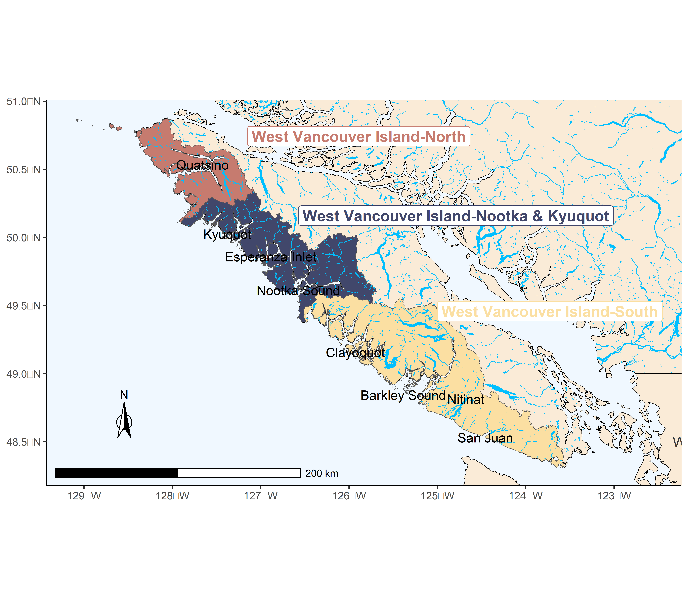
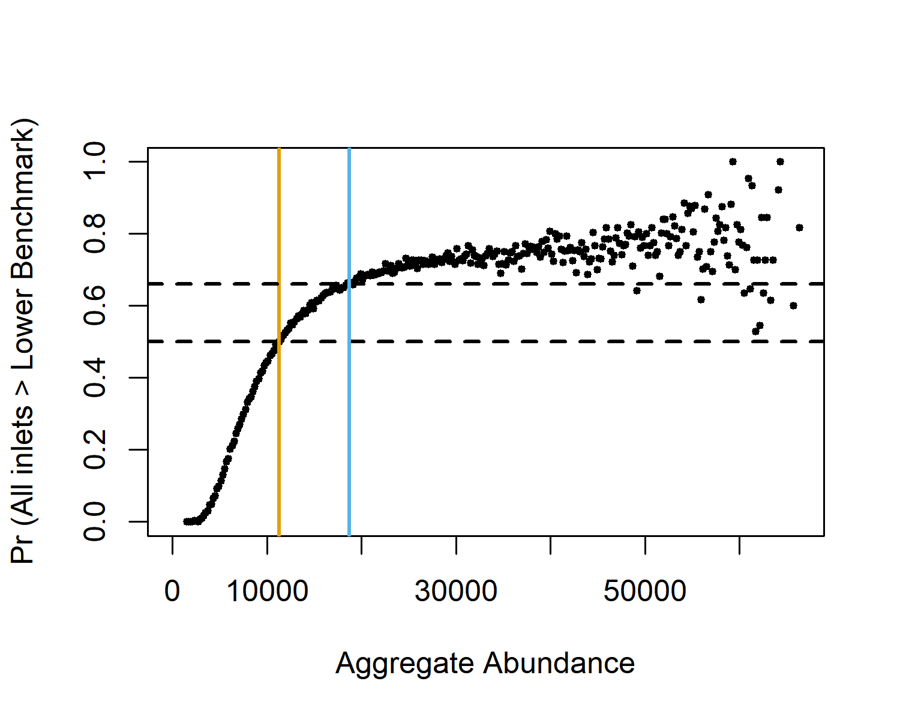
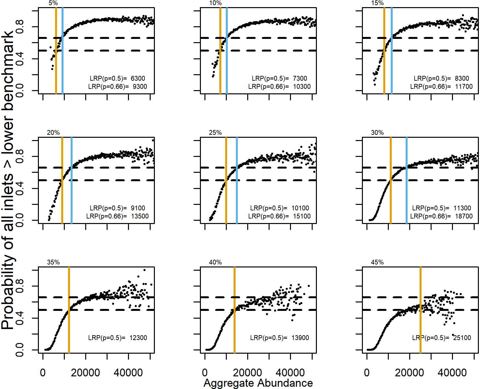

---
output:
  pdf_document: default
  html_document: default
---

# CASE STUDY 2: WEST COAST VANCOUVER ISLAND CHINOOK
## CONTEXT

[//]: # Add a comment in colour: *\textcolor{cyan}{CH: some text}*

The West Coast of Vancouver Island (WCVI) Chinook SMU is comprised of 3 CUs [@holtby_conservation_2007], 7 large inlets (or sounds), and 20 indicators stocks, which are stocks with relatively complete time-series and consistent observation methodology (Figure \@ref(fig:chinook-map); Table \@ref(tab:chinook-Overview), @riddell_review_2002). Hatchery enhancement is an important component of many of these stocks. Hatcheries are a conservation tool for wild salmon populations and can increase the availability of fish for harvest, but they can also reduce wild genetic diversity and are considered a risk factor for the long-term sustainability of CUs [@withler_genetically_2018]. Therefore only indicator stocks without significant enhancement were included in our analyses. Proportionate Natural Influence, PNI, is a metric of the genetic risk of hatcheries on natural populations, with values < 0.5 indicating Integrated-Hatchery populations where most fish are hatchery origin [@withler_genetically_2018]. Only stocks with PNI values $\geqslant$ 0.5 were included in the development of LRPs and assessment against those LRPs (J. Bokvwist, pers. comm. DFO South Coast Stock Assessment). 


```{r chinook-map, fig.cap="Map of the WCVI Chinook SMU, component CUs (coloured red, blue, and yellow), and inlets (labelled in black- NAMES TO BE REVISED).", warning=FALSE, echo=FALSE, fig.align="center"}

```
<!-- CH comment: # Ask Luke to change San Juan River to San Juan, and Nitinat Lake to Nitinat-->

----------------------------------------------------------------------------------------------
CU                      Inlets                  Indicators
----------------------- ----------------------- ----------------------------------------------
WCVI-South              San Juan,               *San Juan*, 
(CK-31)                 Nitinat,                *Nitinat*, 
                        Barkley,                Nahmint , *Sarita*, *Somass*, 
                        Clayoquot,              Bedwell/Ursus , Megin , Moyeha , *Tranquil*
                                                          
WCVI-Nootka & Kyuoquot  Nootka/Esperanza,       *Burman*, *Conuma*, *Gold*, *Leiner*, Tahsis,
(CK-32)                 Kyuquot                 Zeballos,
                                                Artlish, Kaouk, Tahsish,
                                         
WCVI-North              Quatsino                Cayeghle, Marble
(CK-33)                
                        
----------------------- --------------------------- ------------------------------------------
Table: (\#tab:chinook-Overview) Overview of WCVI Chinook Stock Management Unit. Italics represent indicators with average PNI values < 0.5. Note, the inlets, San Juan and Nitinat do not contain indicator stocks with PNI < 0.5 and are not included in these analyses. WCVI is West Coast of Vancouver Island. 

This SMU was included as a case study to demonstrate the development of LRPs under data limitations when stock-recruitment relationships are not available to develop stock-recruitment based benchmarks, but habitat-based benchmarks are, as is common for Chinook salmon in BC. WCVI Chinook is also included in the first batch of major stocks proposed for regulation under the Fish Stock Provisions of the revised Fisheries Act, necessitating the development of LRPs for this SMU.<!-- CH comment: add reference here?-->

Most Chinook in this SMU are 'ocean type', entering the ocean 1-3 months after emergence from spawning gravel [@dfo_assessment_2012]. 'Stream type' fish, those that stay in the river for one year after emergence, are rare. After entering the ocean, WCVI Chinook migrate into northern BC and southeast Alaska waters to rear for 2 to 7 years, returning to spawn predominantly at ages 4 and 5 [@dfo_assessment_2012].

### Previous assessments

Two of the 3 CUs in this SMU, WCVI-South and WCVI-Nootka & Kyuquot, were assessed as 'red' status in an integrated Wild Salmon Policy assessment [@dfo_integrated_2016]. For these CUs, assessments were based on component stocks without hatchery enhancement within the most recent 12 years, omitting stocks with enhancement during that period. For WCVI-South, red status was based primarily on threats of genetic introgression from strays from nearby large-scale hatcheries. For WCVI-Nootka & Kyuoquot, red status was based on a very low index of abundance for non-enhanced populations and threats of genetic introgression from strays from large-scale hatcheries. The third CU, WCVI-North, was not assessed by DFO in 2016 because all component stocks had some level of enhancement over the most recent 12 years (other metrics of hatchery enhancement, e.g., Proportionate Natural Influence or PNI were not considered). A list of indicator and non-indicator stocks within each CU is available in @brown_2020_2020. 

WCVI Chinook was identified as a stock of concern in the 2021 Integrated Fisheries Management Plan, IFMP, for South Coast Salmon, and a rebuilding plan is under development [@dfo_integrated_2021]. Poor marine survival rates for WCVI Chinook and low spawner levels over the past 2 decades are highlighted as reasons for conservation concern in the IFMP [@dfo_integrated_2021, p. 129]. A variety of management measures have been implemented to restrict harvest on WCVI Chinook and address these concerns, described in the IFMP [@dfo_integrated_2021].


Biological benchmarks have been estimated for WCVI indicator stocks using an empirical relationship between watershed area and common stock-recruitment reference points, spawner abundances at replacement, $S_{REP}$, and $S_{MSY}$, from a meta-analysis of 25 Chinook stocks across North America [@parken_habitat-based_2006]. Lack of rigorous recruitment data for WCVI Chinook stocks has precluded the use of stock-recruitment based benchmarks. For the development of LRPs for WCVI Chinook, the empirical relationship between watershed area and $S_{REP}$ was re-estimated using a hierarchical Bayesian model (as in @liermann_using_2010), and applied to inlets of WCVI Chinook (Appendix X, to be included). 

Under Canada's Wild Salmon Policy, CUs are identified at a spatial scale that allows for long-term sustainability of the species [@holtby_conservation_2007]. For WCVI Chinook, inlets nested within CUs are another important spatial scale of diversity for sustainability given geographic separation of spawning habitats among inlets and limited straying among inlets (D. McHugh pers. comm. DFO South Coast Stock Assessment). We used a hybrid approach that preserved CU-scale diversity, while also considering inlet-scale diversity. Specifically, LRPs were developed to preserve inlet-scale diversity within CUs. However, only 5 of the 7 inlets on the west coast of Vancouver Island contained indicators stock without significant hatchery influence. The lack of indicators without significant hatchery influence for inlets Nitinat and San Juan is due to large-scale hatcheries and infrequent monitoring of sites with natural spawning.  Because the remaining 5 inlets with significant natural spawning are nested within the 3 WCVI Chinook CUs, preserving this inlet-scale biodiversity will also preserve CU-scale biodiversity required under the Wild Salmon Policy. Future analyses could limit LRP estimation to the scale of CUs or extend it to include all 7 inlets with additional natural indicators for Nitinat and San Juan, if they are developed. 

<!-- CH: move to Appendix: Because the stock-recruitment data for the meta-analysis used in @parken_2006 were not available, we relied on a similar data set used by @liermann_2010.  -->


## DATA

### Watershed Areas
To derive habitat-based benchmarks, watershed areas were updated for WCVI Chinook using methods described in @parken_habitat-based_2006 by identifying 3rd order watershed areas that contain spawning habitat and omitting areas above obstacles to fish passage from the [Provincial Obstacles to Fish Passage database](https://catalogue.data.gov.bc.ca/dataset/provincial-obstacles-to-fish-passage) (Appendix X, to be included). Only watershed areas for indicator stocks were included in the current analyses, and these watershed areas were then summed within inlets (Table \@ref(tab:chinook-WA)). In future analyses, watershed areas of all known spawning populations could be included (omitting areas above obstacles to fish passage) to derive habitat-based benchmarks on an absolute abundance scale. These benchmarks could be compared against total abundances to each inlet. This approach was not used as a base case because of large uncertainties in abundances of non-indicator stocks.


```{r chinook-WA, warning=FALSE, echo=FALSE}

  
dat <- as.data.frame(read.csv("data/WCVIStocks.csv"))
dat <- dat %>% dplyr::filter(Stock != "Cypre") %>% 
  dplyr::filter(Enh==0) %>%
  dplyr::group_by(Inlet) %>%
  dplyr::summarize(InletWA = sum(WA) ) %>% 
  dplyr::select(c(Inlet, InletWA)) %>% 
  dplyr::mutate(InletWA = round(InletWA,0)) %>%

  dplyr::filter(InletWA != "San Juan") %>% dplyr::filter(InletWA !="Nitinat") %>% 
  dplyr::rename("Watershed Area" = InletWA)
  
  # filter(Inlet != "San Juan") %>% filter(Inlet !="Nitinat")
  # dplyr::select(c(Stock, WA)) %>% dplyr::mutate(WA = round(WA,0)) %>%
  # dplyr::rename("Watershed Area" = WA)
csasdown::csas_table(dat, booktabs = T, caption = "Sum of watershed areas for indicator stocks within inlets, km\\textsuperscript{2}. Only indicator stocks that are not highly enhanced are included.")

 
```

### Spawner Abundances
Spawner abundances were provided for 20 WCVI indicators stocks, (D. Dosbon and D. McHugh pers .comm.; Table \@ref(tab:chinook-Overview); Figure \@ref(fig:chinook-IndTimeSeries)). These time-series are compiled annually by DFO Area Staff for local and international assessment and management (e.g., @dfo_wcvi_2021). Missing values were not infilled. In future work, infilled time-series of indicators within inlets (or CUs) could be developed to extend the available time-series. 

```{r chinook-IndTimeSeries, fig.cap="Time-series of spawner abundances by indicator stock. Dark blue time-series are indicator stocks with Proportionate Natural Index (PNI) values <= 0.5; light blue time-series are indicator stocks with PNI < 0.5, i.e., are highly enhanced.",  warning=FALSE, echo=FALSE, fig.align="center"}

knitr::include_graphics("figure/chinook-IndicatorTimeSeries.png")
```


### Proportionate Natural Influence, PNI
PNI values for 14 WCVI indicator stocks were provided to DFO South Coast Stock Assessment by DFO's Salmonid Enhancement Program (J. Bokvist, pers. comm. DFO South Coast Salmon Assessment). Stocks were considered significantly enhanced if average PNI values over available time-series were < 0.5, representing integrated-hatchery stocks where most fish are hatchery origin [@withler_genetically_2018]. Thermal marking was used to identify the proportion of hatchery-origin spawners on the spawning grounds to derive PNI values. When data on thermal marking were not available; coded-wire tags (CWTs) were used to identify hatchery-origin spawners. Although Gold River had PNI values > 0.5 (0.52),  most of the unmarked spawners are thought to be second generation (or descendants of) hatchery-origin fish from the Robertson Creek hatchery. There is no evidence of the original natural spawners in this system, so it was excluded from our analyses. Five of the remaining 6 indicator stocks without PNI data are not thought to be significantly enhanced, Cayeghle, Kaouk, Megin, Moyeha and Tasish (D. McHugh, pers. comm., DFO South Coast Stock Assessment). One indicator stock without PNI data, Tranquil, was considered significantly enhanced and was grouped with the PNI <0.5 stocks (D. McHugh, pers. comm., DFO South Coast Stock Assessment). Guidelines and methods for estimating PNI values are currently being documented by DFO's Salmonid Enhancement Program.

<!-- CH comment: Do we need to (can we) include time-series of PNI values in an appendix?-->


## PROPORTION OF CUS

### METHODS
$S_{REP}$ values were derived from the watershed-area model adapted from @parken_habitat-based_2006 (Appendix X, to be included). The Wild Salmon Policy lower benchmark on abundances, $S_{gen}$, the spawner abundances required to achieve $S_{MSY}$ within one generation without fishing under equilibrium conditions, was derived by optimizing the Ricker equation with recruitment set to $S_{MSY}$,

\begin{equation}
  S_{MSY} = a * S_{gen}* e^{-b * S_{gen}}
   (\#eq:Sgen)
\end{equation}

where, 

\begin{equation}
  b = \frac{\log(a)}{S_{REP}}
   (\#eq:ricB)
\end{equation}
 

\begin{equation}
  S_{MSY} = \frac{1 - W{e^{1-\log(a)}} } {b}
   (\#eq:SMSY)
\end{equation}

and $a$ is recruits-per-spawner at low productivity. Ricker $a$ values were approximated for WCVI Chinook from a life-stage model that partitioned survival across freshwater and marine life-stages for ocean-type chinook based on empirical data and expert opinion. Life-stage specific survival rates were then combined to derive an overall survival from spawners to recruitment (W. Luedke pers. comm. DFO South Coast Stock Assessment). Despite the relatively large uncertainties in the life-stage specific survival rates, this approach provides an approximation for productivity that is more realistic than the high estimate previously derived from the watershed-area model [@parken_habitat-based_2006], (>7 recruits/spawner).  From the life-stage model, mean $\log(a)$ was estimated at ~ 1 (~$a$=2.72 recruits/spawner), with standard errors (1.96 SDs) +/- 0.5 ($a$ ranging from 1.6 to 4.5), representing relatively large uncertainty in productivity. Bootstrapped confidence intervals in  $S_{gen}$ (Equation \@ref(eq:Sgen)) were estimated by repeated sampling from normal distributions of $\log(S_{REP})$ and $\log(a)$, with standard deviations in $\log(S_{REP})$ derived from the watershed-area model. This method does not account for covariance between productivity and capacity typically found in stock-recruitment relationships, and will overestimate uncertainty in derived benchmarks.

Our approach to estimating $S_{gen}$ differed from that of @parken_habitat-based_2006, because we derived productivity independently from the life-stage specific models, whereas @parken_habitat-based_2006 estimated both $S_{MSY}$ and $S_{REP}$ from the watershed-area model thereby inferring mean estimates of productivity which were deemed unrealistically high for WCVI Chinook. 


```{r chinook-benchmarks}
inlets <- c("Barkley", "Clayoquot", "Kyuquot", "Nootka/Esperanza", "Quatsino")
 
bench <- as.data.frame(read.csv("data/wcviCK-BootstrappedRPs.csv"))
bench <- bench %>% dplyr::mutate(Value = round (Value,0), lwr = round (lwr,0), 
                                 upr = round (upr,0) )
bench <- bench %>% tidyr::pivot_wider(id_cols = Stock, 
                                      names_from = c(RP),#, lwr.name, upr.name), 
                                      names_sep = ".",
                                      values_from = c(Value,lwr,upr) ) 
bench <- bench %>% dplyr::filter(Stock != "Cypre"&
                                   Stock != "WCVI Nootka & Kyuquot"&
                                   Stock != "WCVI North"&
                                   Stock != "WCVI South") %>% 
  dplyr::rename(Sgen = Value.SGEN) %>% 
  dplyr::rename(SREP = Value.SREP) %>% 
  dplyr::rename(Sgen.lwr = lwr.SGEN) %>% 
  dplyr::rename(SREP.lwr = lwr.SREP) %>% 
  dplyr::rename(Sgen.upr = upr.SGEN) %>% 
  dplyr::rename(SREP.upr = upr.SREP) %>% 
  dplyr::filter(Stock %in% inlets) %>% 
  dplyr::rename("Stock or inlet" = Stock)
  

bench <- bench %>% dplyr::select(c("Stock or inlet", Sgen, Sgen.lwr, Sgen.upr, SREP, SREP.lwr, SREP.upr))
csasdown::csas_table(bench, booktabs = T, caption = "Benchmarks and boostrapped 95% confidence intervals (labelled, lwr and upr) for five inlets, including only indicator stocks that are not highly enhanced.") %>% kableExtra::row_spec(20, hline_after=TRUE)


```

```{r chinook-InletTimeSeries, fig.cap="Time-series of spawner abundances by inlet, including only indicators stocks that are not highly enhanced. Horizontal yellow line is Sgen and dots are generational geometric average spawner abundances coloured by red (below Sgen) and grey (above Sgen).",  warning=FALSE, echo=FALSE, fig.align="center"}

#


```

The LRP on the proportion of CUs was identified as all 3 CUs containing inlets with current statuses exclusively above their lower benchmarks.  For this SMU, serious harm was identified as any one inlet within each of the 3 CUs dropping below its lower benchmark or in the red zone under the Wild Salmon Policy. Because inlets are nested within CUs, this LRP accounts for the distribution of spawning within CUs. Status of inlets within CUs was identified in two ways: spawner abundances relative to  $S_{gen}$ and multi-dimensional status assessments developed by the DFO's State of the Salmon program (S. Grant. pers. comm. DFO Science; Figure \@ref(fig:decision-tree).


### RESULTS: PROPORTION OF CUs
In the most recent year with data, 2020, 4 of 5 inlets are above their abundance-based lower benchmark, $S_{gen}$ (Figure \@ref(fig:chinook-InletTimeSeries)). Therefore, 2 of 3 CUs contain inlets with current statuses exclusively above their lower benchmarks. One CU, Southern Vancouver Island, contains an inlet, Clayoquot, with status that has been consistently below its lower benchmark throughout the available time-series. Therefore this SMU falls below the LRP of 3/3 CUs.


Using the multidimensional approach, the status was the same as for the abundance-based lower benchmarks. For this SMU, time-series of abundances for WCVI Chinook are not absolute (only indicator stocks are monitored consistently) and  relative-abundance benchmarks can be identified ($S_{gen}$ and $S_{MSY}$), and so according to the multidimensional decision tree (Figure \@ref(fig:decision-tree), status is derived from abundance-based benchmarks as above. Therefore, similar to above, 2 of 3 CUs met the criteria of containing inlets with status above the red zone under the multi-dimensional approach, falling below the LRP of 3/3 CUs.

## AGGREGATE-ABUNDANCE, EMPIRICAL LRPS

Empirical LRPs based on the probability of all component inlets (nested within CUs) being above their lower benchmarks could not be identified for WCVI Chinook because there are no years when all inlets were above their lower benchmark in the historical record (Figure \@ref(fig:chinook-InletTimeSeries)). In order to estimate a logistic regression, data points of successes (years when all inlets were > lower benchmarks) and failures (years when all inlets were not > lower benchmarks) are required. The estimation of empirical LRPs is limited to SMUs with historical records that demonstrate contrast in status over time.

## AGGREGATE-ABUNDANCE, PROJECTION-BASED LRPS
### METHODS

Projection-based LRPs were derived for WCVI Chinook by projecting inlet-specific population dynamics using the `samSim` modelling tool (Appendix \@ref(app:samsim-appendix)). We chose to project inlet-specific rather than CU-specific population dynamics to reflect the importance of the inlet scale of diversity for long-term sustainability of the SMU. Population dynamics and exploitation parameters were derived from a previously developed CU-specific run-reconstruction for WCVI Chinook based on spawner abundances and age compositions from indicator stocks, and exploitation rates from the Robertson Creek hatchery indicator stock (D. Dobson & D. McHugh, pers. comm. DFO South Coast Stock Assessment). CU-specific parameters were applied across all component inlets. Inlet-specific capacities, or spawner abundances at replacement, were estimated from the watershed-area model (Parken et al. 2006) (Table \@ref(tab:chinook-WA)) and applied in projections of recruitment. The model was projected for 30 years from initial equilibrium abundances, and over 50,000 random Monte Carlo trials. A relatively large number of Monte Carlo trials was required for LRP estimation because the algorithm required a sufficient sample size within each 200-fish incremental bin of aggregate abundances along a range of realistic abundances (from near zero to capacity). <!-- CH comment: and 10,000 for sensitivity analyses, to be increased to 50,000. --> Base-case parameters are provided in Table \@ref(tab:chinook-BaseCasePars); sensitivity analyses from base case parameterizations are described in the text.  Projection-based LRPs were identified from the aggregate abundances with specified probabilities of all component inlets being above lower benchmarks. 
<!-- CH comment: consider redoing table in kableExtra, if that will allow for spaces between rows of text, and separate rows for each value in the 2nd column-->


\begin{longtable}[]{p{4cm} p{5cm} p{6cm}}
\caption{Parameters used for inlet-specific projections of WCVI Chinook population dynamics.}\\
\hline
Parameter & Value & Source \\ 
\hline
\endhead
\hline
Ricker $a$ (mean)  &  WCVI-South = 1.14, WCVI-Nootka \& Kyuoquot =1.58, WCVI-North = 1.53 & Run reconstruction for WCVI Chinook (1985-2019, D. Dobson \& D. McHugh pers. comm.)\\\\
Ricker $a$ (SD) & 0.5 &  Approximate 95\% CI and bounds from life-stage specific model (W. Luedke per. comm.)\\\\
$S_{REP}$ (Spawners at replacement, mean) & Barkley = 637,Clayoquot = 7879, Nootka/Esperanza = 1184, Kyuquot = 5273, Quatsino = 3384 & MLE estimate from watershed-area model \\\\
$S_{REP}$ (SD) & Barkley = 0.40, Clayoquot = 0.30, Nootka/Esperanza = 0.37, Kyuquot = 0.31, Quatsino = 0.32 & Derived from standard error of MLE estimate from the watershed-area model \\\\
Ricker sigma & WCVI-South = 0.80, WCVI-Nootka \& Kyuoquot = 0.69, WCVI- North = 0.68 & Run reconstruction for WCVI Chinook (1985-2019, D. Dobson \& D. McHugh pers. comm.)\\\\
Covariance in Ricker residuals among inlets & Equal to covariance in spawner time-series among inlets & Covariance in spawners among inlets from wild indicator stocks (D. Dobson \& D. McHugh, pers. comm.) \\\\  
 Ave age proportions at maturity (age 2, 3, 4 and 5). Ages 5 and 6 are grouped. &  WCVI-South = 0.02, 0.14, 0.45, 0.38; WCVI-Nootka \& Kyuoquot = 0.01, 0.10, 0.48, 0.40; WCVI-North = 0.02, 0.15, 0.47, 0.36 & Ave ppns from run reconstruction (D. Dobson \& D. McHugh pers. comm.) \\\\  
 Variability in age ppns (tau from multivariate logistic distribution)  & WCVI-South = 0.7, WCVI-Nootka \& Kyuoquot = 0.6, WCVI-North = 0.7 & Estimated from time-series of ppns of ages-at-maturity from the run reconstruction. Assumed variable over CUs and years. \\\\
 Average exploitation rate & 0.30 & Average pre-terminal ERs 2010-2019 for Robertson Creek hatchery indicator (D. Dobson \& D. McHugh pers. comm.). Varied in sensitivity analyses 0.05 - 0.45.\\\\
Interannual variability in exploitation rates (CV) & 0.17 & Estimated from pre-terminal ERs 2010-2019 for Robertson Creek hatchery indicator. Assumed to be beta distributed, constrained between 0-1.\\\\
Variability in exploitation rates among inlets (CV) & 0.085 &  Assumed to be half of interannual variability, varied in a sensitivty analysis (0-0.17). Assumed to be beta distributed, constrained between 0-1.\\\\ 
Initial abundances  &  $S_{REP}$ (inlet-specific) & MLE from watershed-area model\\\\
Extirpation threshold &  2 & Mating constraint \\
\hline
\end{longtable}
(\#tab:chinook-BaseCasePars)

<!--


----------------------------------------------------------------------------------------------
Paremeter               Value                       Source
----------------------- --------------------------- ------------------------------------------
Ricker $a$ (mean)       WCVI-South = 1.14,          Run reconstruction for WCVI Chinook (1985- 
                        WCVI-Nootka & Kyuoquot =    2019, D. Dobson & D. McHugh pers. comm.)
                        1.58,                          
                        WCVI-North = 1.53

                                                                              
Ricker $a$ (SD)         0.5                         Approximate 95% CI and bounds from life-
                                                    stage specific model (W. 
                                                    Luedke per. comm.)

                                                    
$S_{REP}$               Barkley = 637,              MLE estimate from watershed-area model
(Spawners at            Clayoquot = 7879,
replacement, mean)      Nootka/Esperanza = 1184,
                        Kyuquot = 5273,
                        Quatsino = 3384,


$S_{REP}$ (SD)          Barkley = 0.40,             Derived from standard error of MLE 
                        Clayoquot = 0.30,           estimate from the watershed-area model
                        Nootka/Esperanza = 0.37,
                        Kyuquot = 0.31,
                        Quatsino = 0.32,

Ricker sigma            WCVI-South = 0.80,          Run reconstruction for WCVI Chinook (1985- 
                        WCVI-Nootka & Kyuoquot =    2019, D. Dobson & D. McHugh pers. comm.)
                        0.69,
                        WCVI- North = 0.68
                         

Covariance in Ricker    Equal to covariance in      Covariance in spawners among inlets from 
residuals among inlets  spawner time-series         wild indicator stocks (D. Dobson & D. 
                        among inlets                McHugh, pers. comm.)

Ave age proportions     WCVI-South = 0.02, 0.14,    Ave ppns from run reconstruction (D. 
at maturity (age 2, 3,  0.45, 0.38;                 Dobson & D. McHugh pers. comm.)
4 and 5). Ages 5 and 6  WCVI-Nootka & Kyuoquot = 
are grouped.            0.01, 0.10, 0.48, 0.40;
                        WCVI-North = 0.02, 0.15,
                        0.47, 0.36

Variability in age      WCVI-South = 0.7,           Estimated from time-series of ppns of 
ppns (tau from          WCVI-Nootka & Kyuoquot =    ages-at-maturity from the run  
multivariate            0.6,                        reconstruction. Assumed variable over CUs
logistic distribution)  WCVI-North = 0.7            and years. 
                                                    
                        
Average exploitation    0.30                        Average pre-terminal ERs 2010-2019 for
rate                                                Robertson Creek hatchery indicator (D. 
                                                    Dobson & D. McHugh pers. comm.). Varied 
                                                    in sensitivity analyses 0.05 - 0.45.
                                                    
Interannual             0.17                        Estimated from pre-terminal ERs 2010-2019
variability in                                      for Robertson Creek hatchery indicator.
exploitation rates                                  Assumed to be beta distributed,
(CV)                                                constrained between 0-1.
                                                    
                                                    
Variability in          0.085                       Assumed to be half of interannual
exploitation rates                                  variability, varied in a sensitivty 
among inlets (CV)                                   analysis (0-0.17). Assumed to be beta        
                                                    distributed, constrained between 0-1.  

Initial abundances      S<sub>REP</sub> (inlet-     MLE from watershed-area model
                        specific)
                        
Extirpation threshold   2                           Mating constraint

----------------------- --------------------------- ------------------------------------------
Table: (\#tab:chinook-BaseCasePars) Parameters used for inlet-specific projections of WCVI Chinook population dynamics.
-->


We chose covariance parameters so that the resulting projections of inlet-specific spawner abundances exhibited correlations among inlets that were similar to those observed (Figure \@ref(fig:chinook-RunningCorrelations)). Specifically, model parameters were adjusted so that resulting correlations among inlets in projected spawner abundances approximated observed correlations in spawner abundances, described in more detail below.

Pairwise correlations between observed inlet-specific spawner time-series were relatively strong in the 1990s and early 2000s, and have become slightly weaker since 2015.  The correlations among inlets for running 20-year time periods are provided in Figure \@ref(fig:chinook-RunningCorrelations). Starting in 1995, the first boxplot displays the distribution of pair-wise correlations among 5 inlets for the time-period 1995-2015; the second box-plot displays correlations for 1996-2016, etc. A decline in correlations in evident in the last two time periods. The final boxplot shows the correlation over the entire time-series.

```{r chinook-RunningCorrelations, echo=FALSE, fig.cap = "Running correlations in spawner abundances among inlets in 20-year time periods, with the start year of the 20-year period on the X-axis. Each boxplot shows the distribution of pairwise correlations among the 5 inlets (n=10 pairwise correlations).", out.width = '60%'}


```


Within the forward projection model, correlations in spawner abundances among inlets are driven by three model components, each described in more detail below: (1) covariance in exploitation rates among inlets, which is determined from a common interannual exploitation (due to shared exploitation offshore, parameterized from pre-terminal exploitation on Robertson Creek hatchery fish), and additional inlet-specific variability in exploitation due to inlet-specific vulnerability to exploitation, (2) covariance in recruitment residuals among inlets, and (3) covariance in age proportions of recruits among inlets. 

```{r chinook-ER, echo=FALSE, fig.cap = "Pre-terminal exploitation rates for Robertson Creek CWT indicator.", out.width = '60%'}
ERs <- read.csv("data/WCVIER.csv")
ggplot(ERs,aes(Year, ER)) + geom_point() + geom_line()
```


*Covariance in exploitation*

We assumed an average exploitation rate as observed for WCVI Chinook in recent years (2010-2019, Robertson Creek indicator, 30%, Figure \@ref(fig:chinook-ER), with common interannual variability in exploitation rates due to shared exploitation history offshore. 

In forward projections, interannual variability in exploitation rates was assumed to be beta distributed (constrained between 0 and 1), parameterized from estimated pre-terminal exploitation rates for Robertson Creek, with a coefficient of variation (cv) = 0.17 (Table \@ref(tab:chinook-BaseCasePars)). Without data to parameterize inlet-specific variability in exploitation rates, we assumed the inlet-specific variability was half the common (SMU-level) interannual variability (cv=0.085), and varied this in sensitivity analyses from 0 and 0.17 to cover plausible bounds (Figure \@ref(fig:chinook-ERdist)). 

```{r chinook-ERdist, echo=FALSE, fig.cap = "Variability in projected exploitation rates over time (cv=0.17) and among inlets (cv=0.085), from an average explotation of 0.3.", out.width = '50%'}
nTrials <- 100000
canERlabel <- 0.30
set.seed(1)

# Density of ERs with cvER=0.085(either interannual or among CUs)
canER <- canERlabel
cvER <- 0.085
sigCanER <- cvER*canER
shape1 <- canER^2 * (((1-canER)/sigCanER^2)-(1/canER))
shape2 <-shape1 * (1/canER-1)
out1 <- rbeta(nTrials,shape1,shape2)

# Density of ERs with cvER=0.17
cvER <- 0.17
sigCanER <- cvER*canER
shape1 <- canER^2 * (((1-canER)/sigCanER^2)-(1/canER))
shape2 <-shape1 * (1/canER-1)
out2 <- rbeta(nTrials,shape1,shape2)


#Density of ERs with cvER=0.17 interannually and 0.085 among CUs
canER <- out2
cvER <- 0.085
sigCanER <- cvER*canER
shape1 <- canER^2 * (((1-canER)/sigCanER^2)-(1/canER))
shape2 <- shape1 * (1/canER-1)


sampBeta<-function(nTrial) {
  # If assuming among CU variability changes every year
  #x<-rbeta(1,shape1[nTrial],shape2[nTrial])
  
  # If assuming among CU variability is constant over time
  x<-qbeta(rand,shape1[nTrial],shape2[nTrial])
}

randCU <- runif(5)

rand <- randCU[1]
out3 <- sapply(1:nTrials,sampBeta)
rand <- randCU[2]
out3b <- sapply(1:nTrials,sampBeta)
rand <- randCU[3]
out3c <- sapply(1:nTrials,sampBeta)
rand <- randCU[4]
out3d <- sapply(1:nTrials,sampBeta)
rand <- randCU[5]
out3e <- sapply(1:nTrials,sampBeta)


out <- data.frame( cvER = c(rep("0.085",nTrials), rep("0.17",nTrials), 
                            rep("0.085 x 0.17",nTrials)),
                   ExploitationRate = c(out1, out2, out3) )


g2 <- out %>%  dplyr::filter(cvER=="0.085"|cvER=="0.17") %>%
  ggplot(aes(ExploitationRate, colour = cvER, fill = cvER)) +
  geom_density (alpha = 0.1) +
  xlim (0,1) +
  geom_vline (xintercept = canERlabel) +
  theme(axis.title.x = element_text(size=18),
        axis.title.y = element_text(size=18))


g2
```
We assumed that inlets were either consistently under- or over-exploited relative to the average over the entire time-series (e.g., due to the spatial and temporal variability in inlet-specific migration patterns affecting vulnerability to fisheries), but that this bias changed over MC trials. Future analyses could include consistent biases in exploitation for specific inlets (e.g., positive biases for southern inlets and negative biases for northern inlets).


In the forward projections, pairwise correlations in projected spawner abundances among inlets were similar to observed pairwise correlations in spawner abundances among inlets (Figure \@ref(fig:chinook-boxplotscvER)). Varying assumptions about variability in exploitation among inlets between cv= 0 and 0.17 did not impact the distribution of correlations in spawner abundances in the projections.  

```{r chinook-boxplotscvER, echo=FALSE, fig.cap="Distribution of correlations of spawner abundances among inlets for observed data over the most recent 20 years (n=10 pairwise correlations) and projected time-series, with a cv in exploitation rates among inlets = 0, 0.085 or 0.17 (0.17 is equal to the estimated interannual variablity in exploitation rates). ", out.width = '60%'}
# knitr::include_graphics(here::here("figure/chinook-compareEscCor-cvER.png"))

download.file('https://github.com/Pacific-salmon-assess/SalmonLRP_RetroEval/raw/master/WCVIChinookStudy/Figures/ProjectedLRPs/compareEscCor-cvER.png', './figure/chinook-compareEscCor-cvER.png',  mode="wb")
knitr::include_graphics("figure/chinook-compareEscCor-cvER.png")

# Consider adding another run with annualcvER=FALSE (cvER =0.21) in Appendix
```

\linebreak

*Covariance in recruitment residuals*

We parameterized correlations in recruitment residuals among inlets from the observed correlations in spawner abundances among inlets derived from the WCVI Chinook run reconstruction (D. Dobson and D. McHugh, pers. comm. DFO South Coast Stock Assessment Figure \@ref(fig:chinook-bubbleCor)). In sensitivity analyses, we scaled the pairwise correlations in recruitment residuals among inlets by 0.5 and 0 of the observed spawner correlations (0 representing recruitment residuals that were uncorrelated among inlets in the projections). We then compared the resulting correlations in projected spawner abundances to observed correlations, to ground-truth our assumption and evaluate the extent to which the model provided realistic projections. 


```{r chinook-bubbleCor, echo=FALSE, fig.cap=" Bubble plot of correlations in spawner abundances among inlets over time, 1994-2020.", out.width = '40%'}


knitr::include_graphics("figure/chinook-SpawnerCorrelation.png")


```

When we scaled correlations in recruitment residuals to less than observed spawner correlations (i.e., scalar < 1) the resulting correlations in spawner abundances from the projections were lower than observed correlations (Figure \@ref(fig:chinook-boxplotsRecCorSca)), but were roughly similar when recruitment residuals were scaled to 1. So, for our base case, we assumed correlations in recruitment residuals among inlets were equal to observed correlations among inlets.

```{r chinook-boxplotsRecCorSca, echo=FALSE, fig.cap="Distribution of correlations of spawner abundances among inlets for observed data over the most recent 20 years (n=10 pairwise correlations) and projected time-series, assuming a scalar on covariance in recruitment residuals from 1 (equal to observed spawner correlations), 0.5 and 0 (no correlation in recruitment residuals). Projections assume a cv in exploitation rates among inlets = 0.085 (half that of estimated interannual variablity in exploitation rates).", out.width = '50%'}

download.file('https://github.com/Pacific-salmon-assess/SalmonLRP_RetroEval/raw/master/WCVIChinookStudy/Figures/ProjectedLRPs/compareEscCor-recCorSca.png', './figure/chinook-compareEscCor-recCorSca.png',  mode="wb")

knitr::include_graphics("figure/chinook-compareEscCor-recCorSca.png")


```

\newline

*Variability in age proportions recruits among inlets*

For the base case, we assumed that age proportions of recruits varied over time and among inlets parameterized from age proportions of recruits calculated for each CU in the WCVI Chinook run reconstruction (D. Dobson pers. comm. DFO Science; inlet-specific age-proportions were not available) (Figure \@ref(fig:chinook-agePpns)). We used the CU-specific mean proportions at each age from the run reconstruction with annual deviations in those proportions based on a multivariate logistic distribution, parameterized from the estimated time-series of age proportions.
```{r chinook-agePpns, echo=FALSE, fig.cap="Time-series of proportions at age in recruitment aligned by brood year, calculated from run reconstruction for West Coast of Vancouver Island Chinook by CU.", out.width = '60%'}
cuAges <- read.csv("data/WCVICUages.csv")
cuAges <- cuAges %>% tidyr::pivot_longer(cols=c("age2", "age3", "age4", "age5"),
                                  names_to="Age", values_to="Proportion")

cuAges$CU_Names. <- factor(cuAges$CU_Names,
                            levels=c("Southwest_Vancouver_Island",
                                     "Nootka_Kyuquot",
                                     "Northwest_Vancouver_Island",
                                     "Westcoast_Vancouver_Island"))

cuAges %>% filter(CU_Names!="Westcoast_Vancouver_Island") %>%
  ggplot(aes(Year, Proportion, group=CU_Names., colour=CU_Names.)) +
  geom_line() +
  facet_wrap(~Age, ncol=1)
#If required, consider adding geom_density of pairwise correlations in estimated age ppns of recruits

```


We ran a sensitivity analysis under an alternative assumption where age proportions varied over years but were constant among CUs. Under this assumption, we found that pairwise correlations of spawner abundances in projections were much higher than those observed (Figure \@ref(fig:chinook-boxplotsAge)), generating time-series that were unrealistic. 

```{r chinook-boxplotsAge, echo=FALSE, fig.cap="Distribution of correlations of spawner abundances among inlets for observed data over the most recent 20 years (n=10 pairwise correlations) and projected time-series under the assumptions of variable age proportions among CUs and constant proportions among CUs. We assumed a cv in exploitation rates among inlets = 0.085 (half that of estimated interannual variablity in exploitation rates) in the projections.", out.width = '60%'}

download.file('https://github.com/Pacific-salmon-assess/SalmonLRP_RetroEval/raw/master/WCVIChinookStudy/Figures/ProjectedLRPs/compareEscCor-Ages.png', './figure/chinook-compareEscCor-Ages.png',  mode="wb")


knitr::include_graphics("figure/chinook-compareEscCor-Ages.png")

```

### RESULTS: AGGREGATE-ABUNDANCE, PROJECTION-BASED LRPS

Projection-based LRPs were developed under the base-case assumptions of (1) interannual variability in exploitation rates among inlets with a cv = 0.085, (2) correlations in recruitment residuals among inlets equal to observed spawner correlations among inlets, and (3) variability in age proportions among CUs and years. We identified a provisional aggregate abundance LRP with p=0.5 (50% probability of all inlets being greater than their lower benchmark) equal to `r (read.csv("data/chinook-ProjectedLRPsbaseER_ALLp.csv")%>% pull(LRP))[1]` (Figure \@ref(fig:chinook-baseCaseProjLRP)). Provisional LRPs at p=0.66 ("likely" that all inlets are above their lower benchmarks) is also shown, near 20 000 (Figure \@ref(fig:chinook-baseCaseProjLRP)). Probabilities that all inlets exceeded lower benchmarks did not exceed 0.9 so LRPs at higher p values could not be estimated. Note, the LRP at p=0.66 requires more MC trials for full stabilization and is shown here for demonstration purposes only.

```{r chinook-baseCaseProjLRP, echo=FALSE, fig.cap="Probability of all inlets being above their lower benchmark along a gradient in aggregate abundances within bins of 200 fish, derived from projections over 30 years and 50,000 MC Trials.  Candidate LRPs at p=0.5 (yellow) and p=0.66 (pale green) are highlighted. Each dot is the proportion of MC trials where all inlets were > lower benchmarks.", out.width = '60%', fig.pos='!h'}

download.file('https://github.com/Pacific-salmon-assess/SalmonLRP_RetroEval/raw/master/WCVIChinookStudy/Figures/ProjectedLRPs/baseER-ProjLRPCurve-ALLp.png', './figure/chinook-baseER-ProjLRPCurve-ALLp.png',  mode="wb")



```

For the base case parameters, the candidate projection-based LRPs were compared against time-series of aggregate abundances observed for WCVI Chinook salmon (sum of indicator stocks with PNI > 0.5), showing that abundances are currently below these LRPs and have been near or below them over the available time-series (Figure \@ref(fig:chinook-statusProjLRP)).

```{r chinook-statusProjLRP, echo=FALSE, fig.cap="Time-series of aggregate escapement for WCVI Chinook (indicator stocks with PNI > 0.5), with projection-based LRPs associated with component inlets being > lower benchmarks at p=0.5 (yellow) and p=0.66 (pale green). Red points are the generational average escapement (geometric mean), red indicating status below LRPs", out.width = '60%'}

#knitr::include_graphics("figure/chinook-WCVI-SMUtimeseries.png")
knitr::include_graphics("figure/chinook-SMU-timeseries.png")

```

### Sensitivity Analyses

We considered sensitivity analyses on interannual variability in exploitation rates among inlets with cv = 0 and 0.17 (Figure  \@ref(fig:chinook-projLRPcvER)), and found LRPs at 50% probability were not sensitive to this assumption.

```{r chinook-projLRPcvER, echo=FALSE, fig.cap="Probability of all inlets being above their lower benchmark along a gradient in aggregate abundances within bins of 200 fish, derived from projections over 30 years and 50,000 MC Trials. The projections assumed variability in ERs among inlets with a cv=0, 0.085, and 0.17.", out.width = '60%'}

download.file('https://github.com/Pacific-salmon-assess/SalmonLRP_RetroEval/raw/master/WCVIChinookStudy/Figures/ProjectedLRPs/cvER-ProjLRPCurve-ALLp.png', './figure/chinook-cvER-ProjLRPCurve-ALLp.png',  mode="wb")

knitr::include_graphics("figure/chinook-cvER-ProjLRPCurve-ALLp.png")

```

\linebreak

We further considered sensitivity analyses on average exploitation rates from 5-45% (Figure \@ref(fig:chinook-projLRPER)), where 30% exploitation was the base case. As exploitation increased, the LRP associated with a specified probability of all inlets being above their lower benchmark also increased. At high exploitation, the depletion of any given inlet was more frequent despite often relatively high aggregate abundances on the remaining inlets.   

```{r chinook-projLRPER, echo=FALSE, warning=FALSE, fig.cap="Probability of all inlets being above their lower benchmark along a gradient in aggregate abundances within bins of 200 fish, derived from projections over 30 years and 50,000 MC Trials, under a range of average exploitation rates from 5-45\\%."}

download.file('https://github.com/Pacific-salmon-assess/SalmonLRP_RetroEval/raw/master/WCVIChinookStudy/Figures/ProjectedLRPs/ERs-ProjLRPCurve-ALLp.png', './figure/chinook-ERs-ProjLRPCurve-ALLp.png',  mode="wb")



```


\linebreak

Given uncertainty in current and anticipated productivity, projection-based LRPs were evaluated under a range of productivities from 75% - 150% of current estimates. Scenarios with lower productivity (<0.75x current estimates) resulted in a large proportion of trajectories with productivity below replacement, for which LRPs could not be estimated. 

Projection-based LRPs tended to increase under low productivity and vice versa, a trend that was expected due to the inverse relationship between productivity and inlet-specific $S_gen$ values [@holt_cautions_2015]. At low productivity, the spawner abundances required to achieve $S_MSY$ ($S_gen$), tends to increase, thereby becoming more precautionary.  The sensitivity of LRPs to productivity highlights the value of updating benchmarks and projection-based LRPs as productivity changes (Figure \@ref(fig:chinook-projLRPsAlpha)). Our results also show that uncertainty in projections increased under low productivity, likely requiring more random Monte Carlo trials for stabilization at p=0.5. The probability of all inlets being above their lower benchmark rarely met or exceeded 0.66 when productivity was low, so LRPs at this level could not be estimated. When productivity was high, the probability of all inlets being above their lower benchmark rarely dropped below 0.66. At high productivity, LRPs at the p=0.5 level could not be estimated (though estimation may be possible with more Monte Carlo trials). More detailed analyses of LRPs along the entire range of productivities and exploitation was beyond the scope of this case study.
   
```{r chinook-projLRPsAlpha, echo=FALSE, fig.cap="Projection-based LRPs estimated under assumptions of reduced producitivty (0.75x of current levels) and increased productivity (1.5x current levels). More MC trials are required for stabilization of LRPs at low productivity.", out.width = '80%'}

download.file('https://github.com/Pacific-salmon-assess/SalmonLRP_RetroEval/raw/master/WCVIChinookStudy/Figures/ProjectedLRPs/Alphas-ProjLRPCurve-ALLp.png', './figure/chinook-Alphas-ProjLRPCurve-ALLp.png',  mode="wb")

knitr::include_graphics("figure/chinook-Alphas-ProjLRPCurve-ALLp.png")

```


## HISTORICAL EVALUATION OF STATUS ACROSS LRP METHODS

We evaluated status of WCVI Chinook using LRPs estimated using the proportion of CUs with all inlets above $S_{gen}$ and projection-based LRPs, as well as the previously published WSP integrated assessment (status in 2014 only, DFO 2016) (Figure \@ref(fig:chinook-retro)). All methods indicate this SMU being below its LRP for years where data are available.
   
```{r chinook-retro, echo=FALSE, fig.cap="Historical evaluation of status using available methods for estimating LRPs. Red bars indicate status below LRP; grey x's indicate status not available", out.width = '80%'}

download.file('https://github.com/Pacific-salmon-assess/SalmonLRP_RetroEval/raw/master/WCVIChinookStudy/Figures/statusPlot-withBars2020.png', './figure/chinook-statusPlot-withBars2020.png',  mode="wb")

knitr::include_graphics("figure/chinook-statusPlot-withBars2020.png")

```

## OVERALL CONCLUSIONS AND FUTURE ANALYSES

A few key conclusions from this case study are highlighted for broader relevance:

* Status was consistent across the LRP methods that were available, and with a previously published assessment.

* Aggregate-abundance based LRP derived from empirical logistic regression was not possible due to lack of contrast in the time-series.

* Aggregate-abundance based LRPs derived from projections were highly sensitivity to average exploitation. LRPs derived from the base case assumption can not be applied in situations where exploitation has changed, and so cannot be used as a management target *per se*.

* Aggregate-abundance based LRPs derived from projections were also highly sensitivity to underlying population productivities. As productivity declined, LRPs became more precautionary and vice versa. 


In the development of projection-based LRPs, inlets were chosen as the spatial scale of biodiversity required for the sustainability for the SMU. In future analyses, alternative assumptions could be considered, including LRPs derived to maintain diversity at the CU scale by projecting CU-level abundances.  Furthermore, future iterations of the multidimensional status assessment approach could include information on the distribution of spawners across sites within CUs or inlets to incorporate additional scales of diversity. 

In addition, if projection-based LRPs are considered for this SMU, further work exploring their sensitivity to productivity and exploitation is warranted with increased number of Monte Carlo trials.
