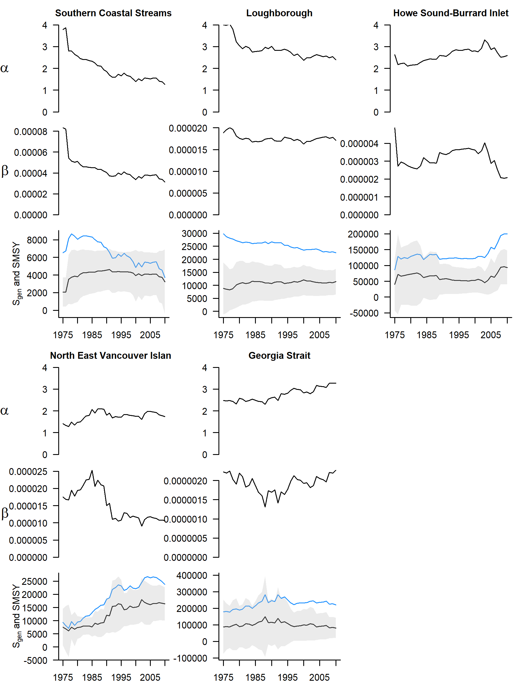
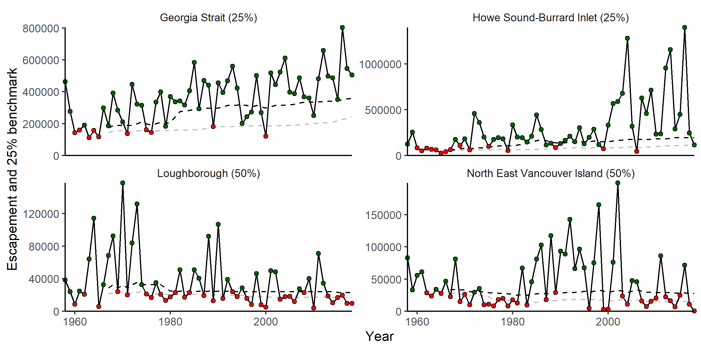

---
output:
  pdf_document: default
  html_document: default
---
# CASE STUDY 3: INSIDE SOUTH COAST CHUM - NON-FRASER

<!-- # Add a comment in colour: *\textcolor{cyan}{LW: some text}* -->

<!-- Initials: my comment -->

## CONTEXT

The 'Inside South Coast Chum - Non-Fraser' (ISC-NF Chum) SMU includes seven CUs of chum salmon (*Oncorhynchus keta*) from rivers that drain into Johnstone Strait and the Salish Sea along the mainland of British Columbia and the east coast of Vancouver Island (Figure \@ref(fig:chum-map); @holtby_conservation_2007). This area includes deep fjords, glaciers, large rivers, and small coastal streams. Chum salmon CUs spawning in the Fraser River watershed are not included in this SMU. They have been categorized as a separate 'Inside South Coast Chum - Fraser' SMU. While these two SMUs have substantial overlap in ocean fisheries, they have been separated into two SMUs based on differences in terminal fishery impacts and freshwater habitats.

The ISC Chum SMU is considered data-limited. While escapement series are available for many streams starting in 1953, several series are incomplete and require infilling assumptions  (i.e., not all streams counted each year, some CUs have no counts in some years). 60% of observations (spawners for an individual stream, in a given year) were missing and needed to be infilled. In addition, run reconstructions of recruitment are uncertain, making the development of benchmarks based on spawner and recruitment data problematic. There are also no data on marine survival (although there are some scale/growth data in @debertin_marine_2017). Other unique characteristics of this SMU include high contrast in abundance among CUs and relatively low correlation in abundance among CUs over time. The SMU covers a large area with many diverse watersheds, flow regimes, and ocean entry locations.

Benchmarks based on spawner recruit relationships are unreliable if there is uncertainty in the spawner and recruit data. One alternative is benchmarks calculated as a percentile of the historical CU-level spawner abundance time series (percentile benchmarks). Previous work on developing WSP benchmarks for Inner South Coast Chum has shown that percentile benchmarks can be comparable to those based on stock-recruit relationships when productivity is relatively high and harvest is relatively low (@holt_evaluating_2018). In other cases, percentile benchmarks may be inappropriate due to low productivity, high harvest, and because they do not account for shifting baselines (@holt_evaluating_2018).

We chose ISC-NF Chum SMU as a case study because we were interested in exploring LRP options for a data-limited SMU. We applied LRPs based on proportions of CUs above their lower benchmark and logistic regression. For proportions, we used percentile status and multi-dimensional status. We tested percentile *\textcolor{cyan}{and $S_{gen}$ - should I leave out Sgen here, or leave in and then say that we dropped it due to unreliable stock-recruit data and/or poor logistic fits}*  benchmarks with the logistic regression LRPs. We also compared the resulting LRP status with variable numbers of CUs and years of data. 

```{r chum-map, fig.cap="The seven Conservation Units that make up the Inside South Coast Chum Stock Management Unit (not including Lower Fraser and Fraser Canyon Conservation Units).", warning=FALSE, echo=FALSE, fig.align="center"}
knitr::include_graphics("figure/chum-map.png")
```


## DATA

We used the same data used in @holt_evaluating_2018, but updated to 2018. @van_will_inner_2014 provides more details on the data sources, infilling procedures and run reconstruction, which were reproduced for this study. We did not include the Lower Fraser or Fraser Canyon chum CUs. More details can be found in Appendix A.

## METHODS

Data and methods are available at: https://github.com/Pacific-salmon-assess/SalmonLRP_RetroEval.

<!-- K.H. comment: Have we checked with Pieter on whether he is ok with Chum data being publically accessible on github?  We should make sure we have approval from him via email.
-->

### Determining the Status of Conservation Units

For this case study, we consider two approaches for characterizing CU status: (i) percentile benchmarks and (ii) multi-dimensional status assessment (@pestal_algorithms_2021, in prep).  *\textcolor{orange}{KH: as discussed, I think it makes sense to take out Sgen as a benchmark to evaluate; however, in light of your note about the SR data still being used for assessing patterns in productivity, we should flag this as something to discuss more with Carrie}*

In addition to abundance-based benchmarks, other benchmarks would also be considered as part of an integrated status assessment (e.g., trends, distribution of abundance; @holt_indicators_2009). At this time, an integrated status assessment has not been developed for ISC chum.

*\textcolor{orange}{KH: Note assumptions of constant productivity for these methods, and include 1-2 sentences to highlight that this may be concern for SC chum (cite a few papers on competition, changes in marine environment, etc, as relevant).}*
*\textcolor{cyan}{LW: does multi-dimensional method have assumption on constant productivity, or just percentile?}*

One limitation of percentile benchmarks is the assumption of constant productivity. There are studies showing that a range of factors may affect the productivity of ISC Chum. These include competition with other salmon in the ocean and ocean conditions (@debertin_marine_2017, @litz_competition_2021). This application of percentile benchmarks does not account for changing productivity. 

***Abundance-Based Benchmarks***

Abundance-based benchmarks can be calculated in several ways. They can be informed by stock-recruit relationships when appropriate data are available. Where there are no reliable stock-recruit data available, an alternate method is using percentiles of recorded abundance (@clark_evaluation_2014, @holt_evaluating_2018). The suitability of percentile benchmarks was evaluated for ISC Chum by @holt_evaluating_2018, who tested how well percentile benchmarks matched benchmarks from stock-recruit parameters, using retrospective and simulation analyses. @holt_evaluating_2018 also calculated benchmarks based on stock-recruit model parameters for ISC Chum stocks, but did not recommend them due to uncertainty in spawner and recruit data. They tested how well a 25% percentile benchmark (and higher values up to 50%) compared to estimates of $S_{gen}$ for these CUs. They found that percentile benchmarks (from 25-50%) under moderate to high harvest rates and low to moderate productivity tended to underestimate 'true' $S_{gen}$ values (estimated from the same data), which would lead to optimistic and incorrect status assessments. More work on alternatives to percentile benchmarks were needed in this case. They also found that time series bias tends to under-estimate $S_{gen}$. 


```{r holt-tab6, fig.cap="Selected percentile-based lower and upper benchmarks identified to be similar or higher in value than stock-recruitment based benchmarks under the WSP, along gradients in productivity (recruits/spawner) and average harvest rates. * denotes the low-productivity scenario where lower and upper Ricker-based benchmarks are very close to one another, resulting in lower and upper percentile-based benchmarks that are the same. From Holt et al. 2018.", warning=FALSE, echo=FALSE, fig.align="center"}
knitr::include_graphics("figure/holt_et_al_2018_table6.png")
```

@holt_evaluating_2018 recommended different percentiles to be used based on Ricker $\alpha$ and average harvest rate (figure \@ref(fig:holt-tab6)). Based on these recommendations, Georgia Strait and Howe Sound Burrard Inlet fall in the category of using 25^th^ perecntile as a lower benchmark (Ricker $\alpha$ 2.5-4, harvest rate 20-40%). Loughborough, Northeast Vancouver Island, and Upper Knight Productivity ($\alpha$ 1.5-2.5 and harvest rate 0-20%) had a 50^th^ percentile lower benchmark recommended. Bute Inlet ($\alpha$ 1.5-2.5, harvest rate 20-40%) needed further evaluation and percentile benchmarks were not recommended. Percentile benchmarks were also not recommended for Southern Coastal Streams due to low productivity ($\alpha$ <1.5). Thus, we used 25% of spawner abundance as a benchmark for Georgia Strait and Howe Sound Burrard Inlet, 50% for Loughborough, Northeast Vancouver Island, Upper Knight, and did not use percentile benchmarks for Bute Inlet and Southern Coastal Streams. 

<!--
K.Holt: I have commented out this section (Benchmark based on stock-recruit relationships - $S_{gen}) for now as I do not think we are using Sgen to calculate LRPs.If we do not evaluate LRPs based on Sgen, but still need to describe SR modelling for Sgen as it is used to estimate productivity for the percentile methods, we may wish to describe the SR modelling and results in an appendix?  In this case, we would not however need to estimate Smsy or Sgen.  Just ricker pars.

#### Benchmark based on stock-recruit relationships - $S_{gen}$

For Inside South Coast chum, there are no reliable data on marine survival for wild fish, and no proxies based on coded wire tag or age at return of hatchery chum in this SMU. This meant that the Ricker model used to estimate the spawner-recruit relationship did not account for variation in marine survival (compared to Interior Fraser Coho). 

The basic Ricker equation uses spawners $S$, productivity $\alpha$, and the strength of density dependence $\beta$ to predict recruits $R$ (Equation \@ref(eq:ricker)). Note that recruits includes returning adult spawners and adults caught in fisheries on their migration to spawn. We used the log-transformed Ricker equation so that the residuals/error would be normally distributed *\textcolor{cyan}{LW: is this correct about the residuals/error?}* (Equation \@ref(eq:logricker)). 

\begin{equation}
    R = \alpha S e^{-\beta S} 
    (\#eq:ricker)
\end{equation}

\begin{equation}
  log(\hat{R}) = log(\alpha_i) + log(S) - S \beta_i 
  (\#eq:logricker)
\end{equation}
  
We estimated the predicted recruits $\hat{R}$ from spawners $S$, productivity $\alpha$, and the strength of density dependence $\beta$ for each stock $i$ (Equation \@ref(eq:logricker)).  The natural log of observed recruits per spawner $log(\frac{R}{S})$ were assumed to be drawn from a normal distribution (normal error) with mean $log(\frac{\hat{R}}{S})$ and standard deviation $\sigma_i$ (Equation \@ref(eq:likelihood-recruits)).

\begin{equation}
    log(\frac{R}{S}) \sim Normal( log(\frac{\hat{R}}{S}) , \sigma_i)
    (\#eq:likelihood-recruits)
\end{equation}

$S_{MSY}$ *\textcolor{cyan}{LW:$S_{MSY}$ or $SMSY$?)* was calculated using Lambert's W function @scheuerell_explicit_2016 (Equation \@ref(eq:SMSY))

\begin{equation}
    S_{MSY} = \frac { 1 - Lambert_W(e ^ {1-log(\alpha)})} {\beta}
    (\#eq:SMSY)
\end{equation}

$S_{gen}$ was estimated from $S_{MSY}$ by assuming that the difference between the $\hat{S}_{MSY}$ (estimated from $\alpha$, $\beta$, and $S_{gen}$) and the $S_{MSY}$ calculated using Lambert's W function was normally distributed with mean 0 and standard deviation $\sigma_{S_{gen}}$ (Equations \@ref(eq:Sgen), \@ref(eq:likelihood-Sgen)).

\begin{equation}
    log(\hat{S}_{MSY}) = log(\alpha) + log(S_{gen}) - \beta S_{gen}
    (\#eq:Sgen)
\end{equation}

\begin{equation}
    \hat{S}_{MSY} - S_{MSY} \sim Normal( 0, \sigma_{S_{gen}})
    (\#eq:likelihood-Sgen)
\end{equation}


We used R (@r_core_team_r_2021) and the Template Model Builder *TMB* package (@kristensen_tmb_2016) to fit Ricker models and logistic regressions of aggregate abundance . 

Caveats with benchmarks based on $S_{gen}$ or stock-recruit parameters:

- Ignores variability in actual recruits/spawner ($S_{gen}$ is based on mean $\alpha$ value). This can be problematic if there are large residuals (especially negative) in the stock-recruit curve at low spawner abundance. For example, if 20% of the time (based on record of recruits/spawner), $S_{gen}$ spawners actually had recruits/spawner less than 1. Then you set up a potential tail-spin to low abundance, depending on the frequency of these low recruitment cohorts at low abundance.
- Because they are set at the CU level (high level in terms of stock-recruit relationship, not at the scale of stream-level density-dependence or ocean-level density dependence including overlapping species (e.g., individual stream, Pacific ocean)), they may not explicitly model density dependence at scales where it is probably occurring.
- Assumes productivity and density-dependence are constant
- $\alpha$ and $\beta$ are correlated: sensitive to each other, especially when fit is not good, this is problematic, especially since $S_{MSY}$ and $S_{gen}$ depend on both $\alpha$ and $\beta$
- $MSY$ and its derivatives, e.g., $S_{MSY}$, $S_{gen}$ are not based on COSEWIC risk of extinction metrics such as percent decreases in spawner abundance
- Doesn't account for depensation
- The only dependent variables used are recruits and spawners, no other variables that are possibly linked to productivity


--> 

***Multi-dimensional CU Status Assessment***

The methods for applying the multi-dimensional status assessment for CU status is described in Chapter 2. 

In applying the synoptic status assessment to ISC Chum, we used the percentile benchmarks as recommended in @holt_evaluating_2018 for relative abundance benchmarks for the five CUs that have appropriate percentiles identified. For Bute Inlet and Southern Coastal Streams, we did not use relative abundance benchmarks. When relative abundance benchmarks are not available, the decision tree we used assesses trends instead. 

### LRP Estimation for ISC-NF Chum

***LRPs Based on Proportion of CUs Above Lower Benchmarks***

A simple method to set a LRP for a group of CUs is to set the LRP trigger as being a certain proportion of component CUs as being in the red zone. For example, for ISC chum (7 CUs), the LRP could be defined as being breached when one CU is in the red zone. For this case study, we set this as the rule - if any CUs entered the red zone, the SMU was considered to be below the LRP. 

We evaluated six different combinations of data and LRP estimation (table \@ref(tab:LRP-scenarios)). For scenarios 1 and 2, we used CU status based on percentile benchmarks. For scenarios 3-6, we used multi-dimensional status of CUs. 

```{r LRP-scenarios, echo=FALSE}
d <- read.csv("data/2021-07-23 scenarios compare CU status methods.csv")
csasdown::csas_table(d[1:6,c(3,7)],
   align = 'l',
   caption = #ifelse(french,
                   #"French goes here",
                   "Scenarios using different subsets of data dnd methods to assign LRP status. Scenarios 1-3 and 6 do not include Bute Inlet or Southern Coastal Streams (no appropriate percentile benchmarks). 'Full' scenarios use only years with full time series (no CU-level infilled CUs) and 'partial' scenarios include CU-level infilled CUs but drop years with CU-level infilling for those CUs.")
            #)
```

***LRPs Based on Logistic Regression***

We evaluated whether the proportion of CUs above their lower benchmark could be predicted by aggregate abundance using logistic regression models. We tested this using percentile and $S_{gen}$ benchmarks. These methods used 5 CUs with over 50 years of data (Bute Inlet and Upper Knight both had CU-level infilling in recent years and thus were left out of this analysis).

These methods were applied retrospectively. For a series of years up to a given year, the benchmarks and logistic regressions were calculated with all years up to that year. This was done for all successive years to see how the LRP (and benchmarks, and underlying stock-recruit parameters) would have changed over time as more data was collected.

Due to poor logistic model fits using the entire 1953-2018 time series for both Sgen and percentile benchmarks, we did not conduct a full retrospective analyses for this SMU. The underlying data characteristics that lead to poor logistic model fits are highlighted in the results section below.

## RESULTS

***CU status based on decision tree***

(don't get caught up with percentile / alpha constraint)

Using this method, X out of Y CUs would be above their lower benchmark (amber or green zone) and X would be below . 

(If we get the code, and do retrospective analysis, ... )


***LRPs Based on Proportion of CUs Above Lower Benchmarks***

We compared results of LRP status for percentile and decision tree methods, using different data sets (Table \@ref(tab:LRP-scenarios)). LRP status varied for different estimation methods and subsets of the data (Figure \@ref(fig:chum-LRP-compare)). 

In general, adding more data tended to increase the number of years that the SMU was below the LRP. Scenario 5 (most data) had the most years below the LRP. Comparing scenarios 1 and 2, which are both based on percentile benchmarks, including more data (scenario 2) results in more years below the LRP. Comparing scenarios 4 and 5 (decision tree only), including more observations results in one year switching from above the LRP to below it. Comparing scenarios 5 and 6 (6 drops two CUs completely), including the two CUs in scenario 5 results in three years switching from above the LRP to below.

LRP status based on percentile benchmarks was different than multi-dimensional status in some years. Comparing scenarios 1 and 3 (same data) in a given year, ISC Chum were above the LRP based on percentile benchmarks but below it based on decision tree, and vice versa. Scenarios 2 and 6 (same data, more data than 1 and 3) show a similar pattern, but with more years below the LRP overall. 

We found that SMU status can be below the LRP even if the aggregate abundance is going up. This highlights the importance of including a metrics of status at the CU level, which influence the overall SMU status.  

```{r chum-LRP-compare, fig.cap="Comparison of LRP status (red = below LRP, gray = above LRP) for six scenarios. The black line shows aggregate abundance. Scenarios 1-3 and 6 do not include Bute Inlet or Southern Coastal Streams (no appropriate percentile benchmarks). 'Full' scenarios use only years with full time series (no CU-level infilled CUs) and 'partial' scenarios include CU-level infilled CUs but drop years with CU-level infilling for those CUs.", echo=FALSE, fig.align="center"}
download.file('https://github.com/Pacific-salmon-assess/SalmonLRP_RetroEval/raw/master/SCChumStudy/Figures/fig_compare_LRP_methods.png', './figure/chum-compare-LRP-methods.png', mode="wb")
knitr::include_graphics('figure/chum-compare-LRP-methods.png')
```

***Retrospective analysis of CU benchmarks based on $S_{gen}$ and percentiles***

In the retrospective analysis, the estimates of $\alpha$, $\beta$, and $S_{gen}$ changed as pregressively more years of data were included (Figures \@ref(fig:chum-a-b-SMSY-Sgen-retro)). Note that these are not estimates based on a model that accounts for time-varying paramters. Rather, the estimates of $\alpha$, $\beta$, and $S_{gen}$ in a given year come from fitting a Ricker model to spawners and recruits for all years up to and including that year, for each CU. Each subsequent year includes another year of data. Thus, as more data is included, the estimates of $\alpha$, $\beta$, and $S_{gen}$ may change. These results should be interpreted with caution due to the large residuals in observed vs. predicted recruits. Since $\alpha$ and $\beta$ are correlated, the meaning of any trends in one parameter should be interpreted with the other parameter in mind, escpecially when model fits have large residuals. Similarly, since $\alpha$ and  $\beta$ determine $S_{MSY}$ and $S_{gen}$, changes in these derived parameters can be challenging to interpret and can be due to changes in $\alpha$,  $\beta$, and their relative values.

```{r chum-a-b-SMSY-Sgen-retro, fig.cap="Retrospective estimates of $\\alpha$, $\\beta$, $S_{gen}$ (black line with gray confidence intervals) and $S_{MSY}$ (blue line) for five CUs in the Inside South Coast Chum SMU. Note y axis is identical across CUs for $\\alpha$ but varies for other parameters.", warning=FALSE, echo=FALSE, fig.align="center"}
download.file('https://github.com/Pacific-salmon-assess/SalmonLRP_RetroEval/raw/master/SCChumStudy/Figures/fig_a_b_SMSY_Sgen_retro.png', './figure/chum-a-b-SMSY-Sgen-retro.png',  mode="wb")

```

Retrospective estimates of $\alpha$ and $\beta$ for Southern Coastal Streams show declines over time. $S_{MSY}$ and $S_{gen}$ increase sharply in the first few years due to large decreases in $\alpha$ and $\beta$. $S_{MSY}$ then decreases over time, while $S_{gen}$ stays relatively stable. This is because as $\alpha$ decreases below ~2.5, $S_{gen}$ decreases, but as $\beta$ decreases, $S_{gen}$ decreases, so that a simultaneous decrease in $\alpha$ and $\beta$ can cancel out. However, the lower alpha is below 2.5, the less influence $\beta$ has on $S_{gen}$. *\textcolor{cyan}{This is from my work on sensitivity of Sgen and SMSY to alpha and beta. Not sure if we can include here}*

Increasing $S_{gen}$ for North East Vancouver Island is mainly due to an increase in $\alpha$ from <1.5 to >2 and then a decrease in $\beta$. 

$\alpha$ for Loughborough showed modest decreases over time, and $S_{gen}$ was fairly stable. 

The Georgia Strait CU shows evidence of increasing $\alpha$, and its $S_{gen}$ estimate was fairly stable. 

Howe Sound-Burrard Inlet $S_{gen}$ was fairly stable, and then increased due to  decreases in $\alpha$ and $\beta$. 


```{r chum-perc-retro, fig.cap="Escapement with 25th and 50th percentile benchmarks shown by gray and black dotted lines, respectively. Benchmarks are calculated using escapements up to the given year. Values following the CU names indicate the appropriate percentile benchmark. Green and red points indicate status above or below benchmark, respectively. Transparent points are years with CU-level infilling.", warning=FALSE, echo=FALSE, fig.align="center"}
download.file('https://github.com/Pacific-salmon-assess/SalmonLRP_RetroEval/raw/master/SCChumStudy/Figures/fig_perc_benchmarks_annual_retro.png', './figure/chum-perc-retro.png', mode="wb")

```

Four CUs were used to estimate percentile benchmarks and to estimate LRPs based on aggregate abundance and logistic regression. As more years of data were inlcuded, percentile benchmarks increased over time for Georgia Strait (especially the 50^th^ percentile) and had modest increases for Howe Sound-Burrard Inlet (Figure \@ref(fig:chum-perc-retro)). Percentile benchmarks decreased by a small amount for Loughborough and North East Vancouver Island. 

Percentile approaches were not used for the other three CUs for the purpose of the logistic regression of aggregate abundance because they were not appropriate based on productivity and harvest rates (see @holt_evaluating_2018 Table 6), CU-level infilling, or both (although they are shown in Figure \@ref(fig:chum-perc-retro)). Among these three CUs, Southern Coastal Streams and Upper Knight show evidence of shifting baselines if percentile approaches are used. 


***LRPs Based on Logistic Regression and SMU Aggregate Abundance***

The logistic models predicting whether all CUs were above their benchmark based on aggregate abundance fit the data poorly (Figures \@ref(fig:chum-logistic-sgen), \@ref(fig:chum-logistic-perc)). In both cases, the sum of abundance for all CUs in a given year was not a good predictor of whether those CUs were above their benchmarks in that year. In both cases, years with high aggregate abundance but with some CUs below their benchmark make a logistic model unsuitable for the purpose of estimating which aggregate abundance is linked to a high probability of each component CU being above its lower benchmark. Note that these regressions used the aggregate abundance of only the CUs used in the regressions, and excluded the other CUs. 

Several factors lead to these poor model fits. The Inside South Coast Chum SMU is made up of seven CUs that vary in their escapement abundance. Georgia Strait and Howe Sound-Burrard Inlet have escapement in many years that are greater than the other CUs by two orders of magnitude. In addition, the correlation in escapement among these seven CUs is low. These characteristics mean that the aggregate abundance may be high due to one or more CUs with high escapements, while one more smaller CUs are below their benchmark. High aggregate escapements do not mean that all CUs are above their benchmark. This makes sense because:

- Large geographical range of SMU / component CUs
- Lots of different populations
- CUs have different numbers of populations (big differences), and those populations have big differences in abundance
- Differences in productivity among CUs/populations

Note that in some years (late 80s) you get some good fits, before more data points in bottom right of plot appear.

#### Summarize diagnostics (Bernoulli, p=0.9)

Diagnostics for the logistic regressions are summarized below. *\textcolor{cyan}{LW: need input on how much detail to include here}*

<!--
#Leaving out Sgen diagnostics for now

Sgen:
(model fit for years up to brood year 2012)

```{r logistic-fit-diag-sgen}
# $DevResid
#  [1]  1.5103058  1.5833077 -0.7212199 -0.7244292 -0.7305280 -0.7151430 -0.7447297 -0.6833613 -0.7654111 -0.7401153  1.5121925
# [12] -0.7694616  1.5839014 -0.7016958  1.3841086  1.4475803 -0.8159303 -0.7228938 -0.7418517  1.5666292  1.5523207 -0.7096188
# [23]  1.5156620 -0.8178085  1.5483345 -0.7869247  1.5360388  1.3239095 -0.8653924  1.5699835  1.4895221 -0.7245176 -0.8886127
# [34] -0.8459808 -0.9165247 -0.8949060  1.4700380 -0.7625550 -0.7758330 -0.8371027  1.4745628 -0.7379357 -0.7742774 -1.0537538
# [45] -1.0825905 -1.0643677 -1.3576054 -0.8868636 -0.7852711 -1.0319873 -0.9150707 -1.0203902 -0.7895509  1.4557132 -1.2471559
# 
# $signTable
#   Param     Estimate   Std..Error   z.value    P.value
# 1   B_0 -1.515058578 0.7060392636 -2.145856 0.03188447
# 2   B_1  0.001002982 0.0009112125  1.100711 0.27102229
# 
# $p.PearChiSq
# [1] 0.453617
# 
# $p.DevChiSq
# [1] 0.1007752
# 

# $quasiR2
# [1] 0.0224255
# 
# $p.Wald
# [1] 0
# 
# $confMat
#        yHat
# y       FALSE
#   FALSE    38
#   TRUE     17
# 
# $hitRatio
# [1] 0.69

```

- Pearson residuals and deviance residuals - deviance residuals > 2?: No deviance residuals >2. 
- Trend in residuals over fitted values? Looking at postive and negative residuals separately, negative trend over fitted values /predicted proportions
- Autocorrelation of residuals?: No
- Statistical sigificance of model coefficients? B_0 p value =0.03. B_1 p value=0.27
- Pearson chi-squared stat: 0.45
- Deviance G-squared statistic
- quasi-Rsquared: 0.02. Ratio of fit to model is low.
- Wald test: Not sure how to interpret
- hit rate? 0.69
-->

Percentile: 
(model fit for years up to return year 2018 - don't need recruits)

```{r logistic-fit-diag-perc, echo=TRUE}
download.file("https://github.com/Pacific-salmon-assess/SalmonLRP_RetroEval/raw/master/SCChumStudy/DataOut/logisticFit_2018Output.rda",'./data/chum-diagnostics.rda', mode="wb" )
load("data/chum-diagnostics.rda")
LRdiagOut
```


```{r chum-logistic-sgen, fig.cap="Logistic regression of whether escapement of all component CUs were above their $S_{gen}$ benchmarks based on aggregate abundance, for Inside South Coast Chum SMU. Includes the 5 CUs without CU-level infilling (no Bute Inlet or Upper Knight)", warning=FALSE, echo=FALSE, fig.align="center"}
download.file('https://github.com/Pacific-salmon-assess/SalmonLRP_RetroEval/raw/master/SCChumStudy/Figures/AnnualRetrospective/Bern.IndivRicker_NoSurv_noCUinfill_90/LogisticMod_2012.pdf', './figure/chum-logistic-sgen.pdf', mode="wb")
knitr::include_graphics('figure/chum-logistic-sgen.pdf')
```

*\textcolor{cyan}{LW: Should the percentile logistic use p=0.5 as this is what is used for the diagnostics?}*


```{r chum-logistic-perc, fig.cap="Logistic regression of whether escapement of all component CUs were above their percentile benchmarks based on aggregate abundance, for Inside South Coast Chum SMU. Includes CUs where percentile benchmarks were appropriate (no Bute Inlet, Upper Knight, or Southern Coastal Streams)", warning=FALSE, echo=FALSE, fig.align="center"}
download.file('https://github.com/Pacific-salmon-assess/SalmonLRP_RetroEval/raw/master/SCChumStudy/Figures/AnnualRetrospective/Bern.Percentile_noCUinfill_90/LogisticMod_2018.pdf', './figure/chum-logistic-perc.pdf', mode="wb")
knitr::include_graphics('figure/chum-logistic-perc.pdf')
```

## Discussion

### Suitabiliy of Logistic Regression LRPs Based on Aggregate Abundance

Did not work for ISC Chum SMU. 

Data was not suited to logistic regression - aggregate abundance was not a good predictor of the status of component CUs. 

Some reasons why (summarise from Results):
- large differences in abundnace between CUs - 2 orders of magnitude gor Goergia Strait, Howe Sound-Burrar Inlet compared to others. Not high correlation between escapements between CUs.
- 

Why (further) ?
- Large geographical range of SMU / component CUs
- Lots of different populations
- CUs have different numbers of populations (big differences), and those populations have big differences in abundance
- Differences in productivity among CUs/populations


### Suitability of LRP based on status of component CUs (proportion)


Something about portfolio effects/ theory. Paper on Alaska shifting productivity areas from year to year. 

(Note: not using percentile benchmarks for relative abundance benchmark for decision tree gives the same results as scenario 5 at the SMU level)


#### Multidimensional

For recovery people, uncertainty in data, recovery plan could include more monitoring if limitation in data makes LRP estimation more uncertain

Application- regional biologists/ decision makers could have different CU status assessments


### Assumptions and limitations

The CUs that required CU-level infilling (Upper Knight and Bute Inlet) were not used for the retrospective analysis because the assumption that escapement is correlated between CUs ignores diversity between CUs and the potential for uncorrelated escapements. The reality of uncorrelated escapements must be taken into account to evaluate whether aggregate escapement is a meaningful predictor for the status of individual CUs. It should also be noted that these two CUs do not represent a random subset of the seven CUs in the Inside South Coast Chum SMU. Both have fewer streams than the other CUs and a higher proportion of summer-run populations of chum. These CUs also include long fjord systems with glaciers and watersheds that go deep into the mainland with headwaters in the Cariboo region. The hydrology, geomorphology, and marine conditions when smolts enter the ocean in these systems may vary from that of the other five CUs, leading to differences in productivity and responses to the regional climate. For example, productivity (recruits per spawner) of the Upper Knight and Bute Inlet CUs (using CU-level infilling, which introduces error) have the largest magnitude of variability in the SMU, with very productive years (>100 recruits per spawner) and low productivity years, and boom and bust cycles of abundance. In other SMUs where the quality of data differs for a subset of CUs, careful consideration should be given to whether abundance, productivity, and their trends can be reliably estimated using data from CUs with data of higher quality. 

#### Limitations of Percentile Benchmarks 

There are some assumptions and limitations when using benchmarks based on percentiles of abundance. One of the largest is the influence of shifting baselines on percentile benchmarks. If abundance has decreased over time, the resulting percentile benchmark will also decrease over time as more data is included. This means that the benchmark shifts downward, reinforcing a shifting baseline. A population size that used to be below the benchmark can become above the benchmark, as the benchmark decreases. This can arise from a decrease in abundance in the period of data, and by an unrecorded high level of abundance before the period of data followed by a decrease before data are available. 

The concept of percentile benchmarks also assumes productivity is stationary. Otherwise, if productivity was decreasing, a larger abundance of spawners would be required to produce the same number of recruits. Contrary to this assumption, there is evidence that the productivity of chum salmon is not stationary. The productivity of BC chum salmon is lower when the abundance of North American salmon like pink, sockeye, and chum is greater (@debertin_marine_2017, @litz_competition_2021). Ocean conditions may also have an affect on ISC chum. The Pacific Decadal Oscillation (PDO) can have a positive or negative relationship with the productivity of wild Washington chum depending on the time period examined (@litz_competition_2021). The North Pacific Gyre Oscillation (NPGO) had a positive relationship with chum growth, mediated my PDO (@debertin_marine_2017). The percentile benchmark is also only informed by the data available, which may be for a short time period.  Those using percentile benchmarks should also consider whether they are calculated using a percentile of recruits or escapement.

Estimating benchmarks for salmon populations without a long time series and without data on productivity (only escapement, no recruits/smolt production) is challenging. Previous evaluations of Inside South Coast chum population status used a 25% benchmark (@hilborn_british_2012). This was based on previous work by the Alaska Department of Fish and Game that defined four tiers of populations based on contrast in spawner abundances, harvest rate, and precision of escapement data (@bue_escapement_2001, @otis_escapement_2004). The goal of these tiers was to choose a Sustainable Escapement Goal (an upper and lower percentile) to use as a goal for escapement to represent a proxy for keeping escapement within a range that includes $S_{MSY}$ (@clark_evaluation_2014). These SEGs were calculated for each major river/system and are still done that way in Alaska (@mckinley_review_2020). Tier 1 of this method was for high escapement contrast (greater than 8) and at least moderate harvest rate, with a SEG of 25th to 75th percentiles. @bue_escapement_2001 assessed this method on 11 populations of sockeye salmon and Chinook salmon from Upper Cook Inlet and Bristol Bay (in @clark_evaluation_2014). @clark_evaluation_2014 tested the suitability of this 4 tier percentile approach with theoretical, simulation, and meta-analysis methods using 76 stock-recruitment data sets from Alaska (7 pink salmon, 7 coho salmon, 43 sockeye salmon, 6 chum salmon, and 13 Chinook salmon populations). They recommended a revised 3 tier system, which changed the Tier 1 lower percentile to 20%. Moving to British COlumbia, @hilborn_british_2012 adopted the previous 25% lower limit of SEG as a benchmark for evaluating the status of Inside South Coast Chum in BC for the purpose of certification with the Marine Stewardship Council (@hilborn_british_2012), despite its lack of testing for populations of chum salmon in British Columbia. Further, SEGs were and still are applied to individual rivers in Alaska, compared to the application of this method to entire CUs. ISC chum includes 296 streams among the seven CUs, with 126 in Strait of Georgia alone. By aggregating spawners and recruits across many rivers before estimating benchmarks of percentile or stock-recruit parameters, the following problems may arise:

- Error in fitting stock-recruit curves because it is at aggregate level instead of by river
- Sum of $S_{gen}$ calculated for individual rivers may not equal $S_{gen}$ calculated using aggregated spawner and recruit data
- Non-stationarity of productivity in individual systems may be hidden by aggregating spawners and recruits
- Spawner abundance at CU level may not be a good predictor of status of individual rivers compared to SEGs at the river scale, depending on the contrast in size between rivers and the correlation (or lack thereof) in escapement and/or productivity

### Other sources of information to inform LRPs / benchmarks

Indigenous Knowledge

- Two-Eyed Seeing - Etuaptmumk(Mi’kmaw) @reid_two-eyed_2020
- Historical baseline before records from western science @eckert_diving_2018, @lee_diverse_2019, @ban_incorporate_2018

Genetic tools and historical records

- Skeena sockeye @price_genetics_2019, @price_portfolio_2021
- Skeena chum @price_abundance_2013
- Cannery records @meengs_estimating_2005

Archaeological records

- BC herring @mckechnie_archaeological_2014

