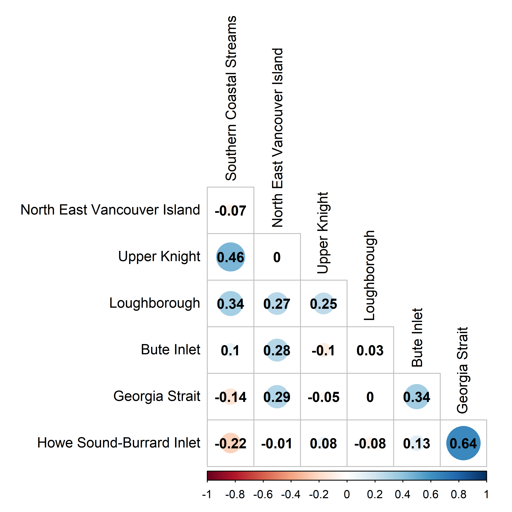

---
output:
  pdf_document: default
  html_document: default
---
# CASE STUDY 3: INSIDE SOUTH COAST CHUM - NON-FRASER{#ISCchumChapter}

<!-- # Add a comment in colour: *\textcolor{cyan}{LW: some text}* -->

<!-- Initials: my comment -->

## CONTEXT


The 'Inside South Coast Chum - Non-Fraser' SMU (hereafter ISC Chum) includes seven CUs of Chum Salmon from rivers that drain into Johnstone Strait and the Salish Sea along the mainland of British Columbia and the east coast of Vancouver Island [Figure \@ref(fig:chum-map); @holtbyConservationUnitsPacific2007]. This area includes deep fjords, glaciers, large rivers, and small coastal streams. Chum salmon CUs spawning in the Fraser River watershed are not included in this SMU. They have been categorized as a separate 'Inside South Coast Chum - Fraser' SMU. While these two SMUs have substantial overlap in ocean fisheries, they have been separated into two SMUs based on differences in terminal fishery impacts and freshwater habitats. 
  
  
<!-- LW: added line breaks because it wasn't making a new paragraph with figure placement--> 


```{r chum-map, fig.cap="The seven Conservation Units that make up the Inside South Coast Chum Stock Management Unit (not including Lower Fraser and Fraser Canyon Conservation Units).", warning=FALSE, echo=FALSE, fig.align="center"}
knitr::include_graphics("figure/chum-map.png")
```


The ISC Chum SMU is considered data-limited. While escapement time series are available for many streams starting in 1953, several series are incomplete and require infilling assumptions  (i.e., not all streams counted each year, some CUs have no counts in some years). In addition, run reconstructions of recruitment are uncertain, making the development of benchmarks based on spawner and recruitment data problematic. There are also no data on marine survival [although there are some scale/growth data in @debertinMarineGrowthPatterns2017]. Other unique characteristics of this SMU include high contrast in abundance among CUs and relatively low correlation in abundance among CUs over time. The SMU covers a large area with many diverse watersheds, flow regimes, and ocean entry locations. Wild Salmon Policy status assessments have not been done on any ISC Chum CUs. @godboutStockStatusWild2004a identified variable but stable status in the central and southern portion of the SMU, with declines in the north, especially in the region defined by Southern Coastal Streams CU. @holtEvaluatingBenchmarksBiological2018 found similar results in a provisional assessment of status. At this time, a peer-reviewed integrated status assessment has not been developed for ISC chum. <!--LW: Does @godboutStockStatusWild2004 not count as a full status assessment?-->  


Step 3 of the Guidelines for Applying LRPs gives guidance on what evidence would be required to use known status of some CUs for other CUs that are data-limited. This is relevant for the ISC Chum case study because two CUs have no observations in some years (Upper Knight and Bute Inlet). For data deficient CUs to be represented by CUs with data, there needs to be evidence that the data deficient CUs have similar threats, environmental drivers, biological characteristics, and habitat capacity as CUs with sufficient data (Guidelines paper, Section 4.1.3). 


Upper Knight and Bute Inlet CUs are both associated with long fjords that run from the Broughton Archipelago through the Coast Mountains. They include rivers with headwaters in the Cariboo region farther inland than other CUs in the SMU (Figure \@ref(fig:chum-map)). Southern Coastal Streams, Georgia Strait, and Howe Sound-Burrard Inlet also include portions of the Coast Mountains and some glaciers, but to a lesser extent and their inlets are shorter and their watersheds do not go as far inland. Upper Knight and Bute Inlet are unique in that they are the only CUs in the SMU that only include watersheds that drain into the upper end of long inlets. They are both more remote than the other CUs, which is part of why there are fewer observations <!-- LW: check with PVW if this is true--> 


Chum from these CUs are  exposed to different threats to habitat, survival and productivity than the other five CUs. While these CUs have, on average, lower impacts from forest harvest, impervious area, and roads, they have larger impacts from forest defoliation and pests [@pacificsalmonfoundationPacificSalmonExplorer2021]. They may also have different levels of risk from disturbances such as glacier melt, avalanches, debris flows, and floods because they have large melting glaciers associated with lakes, steep slopes, and unstable terrain. The glacial lake outburst flood that caused a debris flow in the Southgate River in November 2020 is one example of such an event. These events are capable of killing an entire brood year of eggs/alevins and reshaping habitat with impacts on spawning habitat and stream ecosystems for many years. They can also change water quality in marine habitats. These catastrophic events may be less likely in watersheds with gentler topography and that lack glaciers and glacial lakes. The hydrology of these two CUs likely differs from that of other CUs with more low-lying topography. These watersheds have large glaciers and high amounts of snowmelt, compared to more low-elevation coastal watersheds with more rain-dominant hydrographs. Marine conditions when smolts enter the ocean in these systems may vary from that of the other five CUs, as they are entering the upper ends of large fjords. Generally, it is known that competition with other salmon in the ocean and ocean conditions [@debertinMarineGrowthPatterns2017, @litzCompetitionOddyearPink2021] affect chum salmon in this SMU. Regarding biological characteristics, Bute Inlet and Upper Knight have a higher proportion of summer-run populations of chum (Table \@ref(tab:CU-summary)). <Observed recruits per spawner of the Upper Knight and Bute Inlet CUs (using CU-level infilling, which introduces error) have the largest magnitude of variability in the SMU, with very productive years (>100 recruits per spawner) and low productivity years, and boom and bust cycles of abundance. These CUs also have lower habitat capacity, with fewer streams with chum spawners than the other CUs (Table \@ref(tab:CU-summary)).<!--LW: check with PVW if this is just fewer monitored streams--> Based on these difference, the burden of proof is not met, and we cannot infer the status for Bute Inlet and Upper Knight from the other CUs. Note that these criteria used to evaluate whether status can be borrowed for these CUs extends to whether reliable spawner escapement data can be infilled using escapement in the other CUs. Thus, these CUs are dropped for years with no spawner data in this case study. In other SMUs where the quality of data differs for a subset of CUs, careful consideration should be given to whether abundance, productivity, and their trends can be reliably estimated using data from CUs with data of higher quality. 


```{r CU-summary, echo=FALSE}
d <- read.csv("data/CU_summary_table_report.csv", check.names = FALSE)
csasdown::csas_table(d,
   align = c('l', 'c', 'c','c','c'),
   caption = #ifelse(french,
                   #"French goes here",
                   "The seven Conservation Units in the Inside South Coast Chum Non-Fraser Stock Management Unit. Note that only fall run streams were used in this study due to run reconstruction methods. LBM = Lower Benchmark, UBM = Upper Benchmark used for percentile benchmarks.")
            #)
```

<!-- LW: should alpha and exploitation rate be added to this table as justification for which percentile benchmarks were chosed? Also available in Holt et al. 2018.
-->


Benchmarks based on spawner-recruit relationships are unreliable if there is uncertainty in the spawner and recruit data. One alternative is benchmarks calculated as a percentile of the historical CU-level spawner abundance time series (percentile benchmarks). Previous work on developing WSP benchmarks for Inner South Coast Chum has shown that percentile benchmarks can be comparable to those based on stock-recruit relationships when productivity is relatively high and harvest is relatively low [@holtEvaluatingBenchmarksBiological2018]. In other cases, percentile benchmarks may be inappropriate due to low productivity, high harvest, and because they do not account for non-stationarity in recruitment dynamics [@holtEvaluatingBenchmarksBiological2018].


We chose the ISC Chum SMU as a case study because we were interested in exploring LRP options for a data-limited SMU. We applied LRPs based on two methods: proportions of CUs above their lower benchmark, and logistic regression based on aggregate abundance. For proportions, we used percentile benchmarks and multi-dimensional status assessment to determine the status of component CUs. For the logistic regressions, we used percentile and S\textsubscript{gen} benchmarks. However, after attempting S\textsubscript{gen} benchmarks we decided not to use them because of unreliable stock-recruit data. Using recruitment data would not satisfy reliability principles in Holt et al. (in review). 

## DATA


We used the same data used in @holtEvaluatingBenchmarksBiological2018, but updated with five additional years of data. Available data included spawner abundance time series from 1959 - 2018 and corresponding CU-level recruitment estimated from run reconstruction. Spawner abundance series rely heavily on infilling; 60% of observations (count of spawners for an individual stream, in a given year) were missing and needed to be infilled. Recruitment data are considered highly uncertain for all ISC Chum CUs due to uncertain assumptions required to assign mixed fishery catch to CUs within the run reconstruction model. As a result, we did not consider spawner recruit series to be reliable enough to estimate stock recruitment-based benchmarks such as S\textsubscript{MSY} and S\textsubscript{gen}.  We did however use spawner recruit model fits to provide approximate estimates of CU-level productivity, which are used to inform the application of percentile-based benchmarks.


@vanwillInnerSouthCoast2014 provides more details on the data sources, infilling procedures and run reconstruction, which were reproduced for this study. We did not include the Lower Fraser or Fraser Canyon chum CUs. More details can be found in Appendix \@ref(app:appendix-chum). Note that we removed spawners for the Qualicum River, Little Qualicum River, and Puntledge River (part of the Georgia Strait CU), as these systems have been nearly 100% enhanced at least since enhancement began at these locations. We made the assumption that these streams had 100% hatchery origin spawners. <!--CH to revise this paragraph to align with Whither et al. 2018-->


Links to data and analysis code repository are in Appendix \@ref(app:github-appendix). 

## CU STATUS ESTIMATION

For this case study, we consider two approaches for characterizing CU status: 
(1) Pacific Salmon Scanner Tool (or Salmon Scanner) and 
(2) CU-level abundance relative to a percentile lower benchmark


The first approach, which uses the Salmon Scanner developed by the State of the Salmon program (Section \@ref(rapidToolMethods)), is consistent with Canada's WSP and is recommended by Holt et al. (in review)^[Holt, C. A., K. Holt, L. Warkentin, C. Wor, ... . Guidelines for Defining Limit Reference Points for Pacific Salmon Stock Management Units. CSAS Res Doc. In review] as the method that should be used to estimate CU status when using the proportional LRP approach. The second approach is presented for comparison with the Salmon Scanner.


When applying the Salmon Scanner to ISC Chum, we used percentile benchmarks as both upper and lower benchmarks (Figure \@ref(fig:decision-tree)).  As a result, both of our approaches to CU status estimation depend on percentile-based benchmarks.


Percentile-based benchmarks can be applied to assess status of CUs when other data - like benchmarks based on productivity or habitat - are not available or reliable [@holtEvaluatingBenchmarksBiological2018; @clarkEvaluationPercentileApproach2014]. The suitability of percentile benchmarks was evaluated for ISC Chum by @holtEvaluatingBenchmarksBiological2018, who tested how well percentile benchmarks matched benchmarks from stock-recruit parameters, using retrospective and simulation analyses. @holtEvaluatingBenchmarksBiological2018 also calculated benchmarks based on stock-recruit model parameters for ISC Chum stocks, but did not recommend them due to uncertainty in spawner and recruit data. They tested how well a 25% percentile benchmark (and higher values up to 50%) compared to estimates of S\textsubscript{gen} for these CUs. They found that percentile benchmarks (from 25-50%) under moderate to high harvest rates and low to moderate productivity tended to underestimate 'true' S\textsubscript{gen} values (estimated from the same data), which would lead to optimistic and incorrect status assessments. More work on alternatives to percentile benchmarks were needed in this case.


For this case study, percentile benchmarks were calculated using the infilled escapement time series (not smoothed) and status for year $i$ was determined by comparing the geometric mean (4 year window, ending with year $i$) with the benchmark. 
<!-- 
Sue Grant: It would be helpful to start the paper with this context on all the different ways to assess relative abundance BMs…Sgen SR models, Sgen habitat, percentiles…
Maybe that is what the guidelines paper does is put this all together?

KH Respsonse: This is what the guidelines paper does, but I think there is a benefit in developing a table or something that clearly lays out all the options, and which ones are being looked at in each case study.  

LW: would this go in chapter 1 of case studies paper?
-->


\renewcommand*{\arraystretch}{1.5}
\begin{table}[ht]
\centering
\caption{Selected percentile-based lower and upper benchmarks identified to be similar or higher in value than stock-recruitment based benchmarks under the WSP, along gradients in productivity (Ricker $\alpha$) and average harvest rates. * denotes the low-productivity scenario where lower and upper Ricker-based benchmarks are very close to one another, resulting in lower and upper percentile-based benchmarks that are the same. Adapted from Table 6, Holt et al. 2018.}
\begin{tabular}{l l p{2.5cm} p{2.5cm} p{2.5cm}}
\hline       &     & \multicolumn{3}{l}{Harvest rate}\\ 
& & <20\% & 20-40\% & 40-60 \% \\
\hline
Productivity (Ricker $\alpha$) & >4 & 25th (lower)  50th (upper) & 25th (lower) 50th (upper) & 25th (lower) 50th (upper) \\
& 2.5-4 & 25th (lower) 50th (upper) & 25th (lower) 50th (upper) & Further evaluation required \\
& 1.5-2.5 & *50th (lower and upper) & Further evaluation required & Further evaluation required \\               
\hline
\end{tabular}
(\#tab:holt-tab6)
\end{table}


@holtEvaluatingBenchmarksBiological2018 recommended different percentiles to be used based on Ricker $\alpha$ and average harvest rate (Table \@ref(tab:holt-tab6)). Based on these recommendations, Georgia Strait and Howe Sound Burrard Inlet fall in the category of using 25% as a lower benchmark and 50% as an upper benchmark (Ricker $\alpha$ 2.5-4, harvest rate 20-40%). Loughborough, Northeast Vancouver Island, and Upper Knight ($\alpha$ 1.5-2.5 and harvest rate 0-20%) had a 50% lower and upper benchmark recommended. Bute Inlet ($\alpha$ 1.5-2.5, harvest rate 20-40%) needed further evaluation and percentile benchmarks were not recommended. Percentile benchmarks were also not recommended for Southern Coastal Streams due to low productivity ($\alpha$ <1.5; Table \@ref(tab:CU-summary)). 


The methods for applying the Salmon Scanner to get CU status is described in Chapter \@ref(#MethodsChapter). In applying the Salmon Scanner to ISC Chum, we used the percentile benchmarks as recommended in @holtEvaluatingBenchmarksBiological2018 for lower and upper benchmarks for the five CUs that have appropriate percentiles benchmarks identified (as described above). For Bute Inlet and Southern Coastal Streams, we did not use benchmarks. When benchmarks are not available, trends were used to assess status according to the decision tree (Figure \@ref(fig:decision-tree)).


## LRP ESTIMATION: PROPORTION OF CUS

### Methods

We looked at the proportion of CUs that had status estimates above the red zone (or, above the lower percentile benchmark) to determine in which years between 1960 and 2018 the LRP would have been breached. As with the Interior Fraser Coho and WCVI Chinook case studies, we required all CUs to be above the red zone for the ISC Chum SMU to be classified as being above the LRP. 


The single-metric approach to assessing CU status based on percentiles has specific data requirements [@holtEvaluatingBenchmarksBiological2018] while the Salmon Scanner approach can be applied to any CU with at least a consistent time-series of spawner abundances. To compare LRPs based on CU assessment from these two approaches we compared data subsets including those that used the same data for each method, and all appropriate data for each method. We evaluated six different combinations of data and LRP methods (Table \@ref(tab:LRP-scenarios)). For this comparison, we used percentile benchmarks based on @holtEvaluatingBenchmarksBiological2018. The benchmarks were estimated using the entire time series. 'Full' scenarios only included CUs with complete time series (no CUs with years with CU-level infilling). 'Partial' scenarios included CUs with incomplete time series, where the years that did not have observations in those CUs were omitted. 


For scenarios 1 and 2, we used CU status based on percentile benchmarks that are determined by productivity and historical exploitation outlined in @holtEvaluatingBenchmarksBiological2018 (Table \@ref(tab:LRP-scenarios)). This method used the annual escapement values to calculate the benchmarks and the generational mean (geometric mean of 4 years) of escapement for year $i$ and previous three years to assess status in year $i$. Scenario 1 includes the four CUs which had complete time series (observations in each year, no CU-level infilling required) and that also had appropriate percentile benchmarks based on @holtEvaluatingBenchmarksBiological2018. For example, Upper Knight was excluded because it did not have a complete time series, Southern Coastal Streams was excluded because it does not have an appropriate percentile benchmark, and Bute Inlet was excluded for both of these reasons. We then relaxed this assumption and included all CUs that meet the constraints of @holtEvaluatingBenchmarksBiological2018 even if they had missing data for some years (Scenario 2). This scenario included Upper Knight in some years, which meant that it had five CUs in some years and four in others. Thus, the power to detect red status varied among years in Scenario 2, using more of the available data than Scenario 1. For scenarios 3-6, we used status based on the Salmon Scanner. To compare results between status from percentiles and the Salmon Scanner, we used the Salmon Scanner on the same two data sets we used for percentiles. Scenarios 3 and 1 have the same data, and Scenarios 2 and 6 have the same data. Because the Salmon Scanner does not need benchmarks (percentile or otherwise) to assign status, it could also be used for CUs that did not have appropriate percentile benchmarks (Southern Coastal Streams and Bute Inlet). Scenario 4 only included CUs with a full time series, and Scenario 5 included Upper Knight and Bute Inlet, which had some missing years. 


\renewcommand*{\arraystretch}{1.5}
\begin{table}[ht]
\centering
\caption{Scenarios using different subsets of data (CU names abbreviated) and methods to assign LRP status. 'Y' indicates a full time series, 'YP' indicates a time series was included but is partial (missing years that required CU-level infilling which wer omitted). Bute Inlet and Southern Coastal Streams do not have appropriate percentile benchmarks. 'Full' scenarios use only years with full time series (no CU-level infilled CUs) and 'partial' scenarios include CU-level infilled CUs but drop years with CU-level infilling for those CUs.}
\begin{tabular}{l c c c c c c c }
\hline    
Scenario Name &   \rotatebox{90}{Southern Coastal Streams} &   \rotatebox{90}{ North East Vancouver Island} &  \rotatebox{90}{ Upper Knight} &  \rotatebox{90}{ Loughborough} &  \rotatebox{90}{ Bute Inlet} & \rotatebox{90}{ Georgia Strait} & \rotatebox{90}{ Howe Sound-Burrard Inlet}\\ 
\hline
1. Prop: Scanner: 4CUs full       & - & Y & -  & Y & -  & Y & Y \\
2. Prop: Percentile: 4CUs full    & - & Y & -  & Y & -  & Y & Y \\
3. Prop: Scanner: 5CUs partial    & - & Y & YP & Y & -  & Y & Y \\
4. Prop: Percentile: 5CUs partial & - & Y & YP & Y & -  & Y & Y \\
5. Prop: Scanner: 5CUs full       & Y & Y & -  & Y & -  & Y & Y \\
6. Prop: Scanner: 7CUs partial    & Y & Y & YP & Y & YP & Y & Y \\
\hline
\end{tabular}
(\#tab:LRP-scenarios)
\end{table}


### Results


**CU Status Based on Salmon Scanner**

Using this method, two out of five CUs with data in the most recent year of data (2018) would be above their lower benchmark (amber or green zone) and 3 would be below (red zone; Figure \@ref(fig:chum-CU-status-tree)). Over the time series, status for Howe Sound-Burrard Inlet and Georgia Strait has improved, while status in other CUs has declined or switched from green to red several times.


**CU Status Based on Percentile Benchmarks**

Two out of four CUs were below their percentile lower benchmark in 2018 (Figure \@ref(fig:chum-perc-status-static). Howe Sound-Burrard Inlet and Georgia Strait had status above their lower benchmarks, and Upper Knight did not have observations in 2018. 


In supplementary analyses, we evaluated percentile benchmarks retrospectively for each year in the time series using only data prior to that year. As more years of data were included, percentile benchmarks increased over time for Georgia Strait (especially the 50^th^ percentile) and had modest increases for Howe Sound-Burrard Inlet (Figure \@ref(fig:chum-perc-retro)). Percentile benchmarks decreased by a small amount for Loughborough and North East Vancouver Island. Southern Coastal Stream shows evidence of shifting baselines, as the percentiles decrease over time following a general decline in abundances (Figure \@ref(fig:chum-perc-retro)). Upper Knight also shows this pattern but to a lesser extent.


```{r chum-CU-status-tree, fig.cap="Status of CUs based on multi-dimensional status assessment (decision tree). Years with CU-level infilling were not included.", warning=FALSE, echo=FALSE, fig.align="center"}
knitr::include_graphics('figure/fig_status_by_CU_perc_RelAbd.png')
```


<!-- LW: note this figure is created in SOLV-Code/TEMP-Chum-Synoptic repo right now -->


```{r chum-perc-status-static, fig.cap="Spawner escapement (solid black line) with generational mean (4 year rolling geometric mean) of escapement in points.", warning=FALSE, echo=FALSE, fig.align="center", height=8}
knitr::include_graphics('figure/fig_percentile_bm_rel_abd.png')
```

<!-- LW: note this figure is created in SOLV-Code/TEMP-Chum-Synoptic repo right now -->


## LRP ESTIMATION: AGGREGATE ABUNDANCE LOGISTIC REGRESSION LRPS

### Methods

We evaluated whether the proportion of CUs above their lower benchmark could be predicted by aggregate abundance using logistic regression models. We tested this using percentile benchmarks. These methods used four CUs with over 50 years of data and appropriate perecntile benchmarks (North East Vancouver Island, Loughborough, Georgia Strait, and Howe Sound-Burrard Inlet). Aggregate abundnace (predictor variable) was calculated using only these four CUs. We omitted Bute Inlet and Upper Knight (both had CU-level infilling in recent years) and Southern Coastal Streams (no appropriate percentile benchmark). Refer to Chapter \@ref(MethodsChapter) for more details. 


Due to poor logistic model fits using the entire 1953-2018 time series, we did not conduct full retrospective analyses of logistic-regression based LRPs for this SMU as was completed for the Interior Fraser River Coho case study. The characteristics of the data that led to poor logistic model fits are highlighted in the results section below. 


Projection-based LRPs are an alternative aggregate abundance LRP that we did not consider for this SMU due to lack of peer-reviewed stock-recruitment model fits for component CUs. However, this approach could be considered in future analyses given consensus on model structure and parameterization that provide realistic uncertainties in projections of population dynamics.


### Results

The logistic models predicting whether all CUs were above their benchmark based on aggregate abundance fit the data poorly (Figure \@ref(fig:chum-logistic-perc)).The sum of abundance for all CUs in a given year was not a good predictor of whether those CUs were above their benchmarks in that year. Years with high aggregate abundance but with some CUs below their benchmark make a logistic model unsuitable for the purpose of estimating which aggregate abundance is linked to a high probability of each component CU being above its lower benchmark. 


The diagnostics for the logistic regression indicated that the model fit was poor for percentile benchmarks (Table \@ref(tab:logistic-diag-chum), Figure \@ref(fig:chum-logistic-perc)). Pseudo $R^2$ was low (0.03), indicating that the fit is not good. The Box-Tidwell test (p-value = 0.02) indicated a significant lack of linearity in the relationship between aggregate abundance and log-odds, which means that the assumption that the relationship between aggregate abundance and log-odds is linear was not met. There was not a significant improvement in the model fit when aggregate abundance was included, compared to the null model based on a Goodness of fit p value of 0.13 (>0.05), indicating that there is not significant improvement in fit with the variable (aggregate abundance). The ratio of correct classification based on a confusion matrix was 0.7. Note that this method tends to have overly optimistic values. The Wald p-value was not significant for $B_{1}$ (0.019), the coefficient for aggregate abundances. There was no evidence of outlier observations or autocorrelation in residuals, and there was a sufficient sample size. Despite these last three criteria, they were not enough to overcome the deficiencies identified by the other diagnostic criteria.  
<!--    
    Is the ratio of correct classification based on a confusion matrix, or based on loo? maybe present loo results to be consistent with IF coho
    LW: It is from confusion matrix. Is LOO results another update? I don't remember that one. 
    -->
```{r chum-logistic-perc, fig.cap="Logistic regression of whether escapement of all component CUs were above their percentile benchmarks based on aggregate abundance, for Inside South Coast Chum SMU. Includes CUs where percentile benchmarks were appropriate (no Bute Inlet, Upper Knight, or Southern Coastal Streams)", warning=FALSE, echo=FALSE, fig.align="center"}
#if(!file.exists('figure/chum-logistic-perc.pdf'))
  download.file('https://github.com/Pacific-salmon-assess/SalmonLRP_RetroEval/raw/master/SCChumStudy/Figures/AnnualRetrospective/Bern.Percentile_noCUinfill_90/LogisticMod_2018.pdf', './figure/chum-logistic-perc.pdf', mode="wb")
knitr::include_graphics('figure/chum-logistic-perc.pdf')
```

<!--
Download diagnostic info for checking
```{r logistic-fit-diag-perc, echo=FALSE}
#download.file("https://github.com/Pacific-salmon-assess/SalmonLRP_RetroEval/raw/master/SCChumStudy/DataOut/logisticFit_2018Output.rda",'./data/chum-diagnostics.rda', mode="wb" )
#load("data/chum-diagnostics.rda")
#LRdiagOut
```
--> 

+-------------------------+--------------+
| Diagnostic Test         | Value        | 
+=========================+==============+
| Box-Tidwell p-value     | 0.02         |
+-------------------------+--------------+   
| Max. deviance residual  | 1.69         |
+-------------------------+--------------+
| AR-1                    | 0.14         |
+-------------------------+--------------+
| Wald p-value            | 0.19         | 
+-------------------------+--------------+
| Goodness-of-fit p-value | 0.13         |
+-------------------------+--------------+
| Pseudo-$R^2$            | 0.03         |
+-------------------------+--------------+
| Hit Ratio (p= 50%)      | 0.7          |
+-------------------------+--------------+

Table: (\#tab:logistic-diag-chum) Model diagnostic statistics from logistic regression LRP using percentile benchmarks. A description of diagnostic tests is provided in Section 2. Hit ratios are shown for p=0.5.  


Several factors led to these poor model fits. The Inside South Coast Chum SMU is made up of seven CUs that vary in their escapement abundance. In many years, escapement in Georgia Strait and Howe Sound-Burrard Inlet is greater than in other CUs by two orders of magnitude (Figure \@ref(fig:chum-spawner-distribution)). In addition, the correlation in escapement among these seven CUs is low (Figure \@ref(fig:chum-spawner-corr)). These characteristics mean that the aggregate abundance may be high due to one or more CUs with high escapements, while one more smaller CUs are below their benchmark. High aggregate escapements do not mean that all CUs are above their benchmark. This makes sense because this SMU covers a large area with many different populations affected by both local and regional factors, as described at the beginning of this case study. These seven CUs also have different numbers of populations. 

```{r chum-spawner-corr, fig.cap="Pairwise correlations of spawner abundance between Inside South Coast Chum Conservation Units.", warning=FALSE, echo=FALSE, fig.align="center"}
#if(!file.exists('figure/chum-spawners-corr.png'))
download.file('https://github.com/Pacific-salmon-assess/SalmonLRP_RetroEval/raw/master/SCChumStudy/Figures/fig_chum_spawners_corr.png', './figure/chum-spawners-corr.png', mode="wb")

```


## HISTORICAL EVALUATION OF STATUS ACROSS LRP METHODS

The ISC Chum SMU was consistently below the LRP for large portions of the historical time series, regardless of which LRP estimation method  (Figure \@ref(fig:chum-LRP-compare). While the aggregate abundance of the SMU increased over time, SMU status remained below the LRP in every year of the past two decades except 2004 for all estimation methods. These results were mainly due to the tendency of Georgia Strait and Burrard Inlet-Howe Sound CUs to have high and increasing abundances while smaller CUs, such as North East Vancouver Island, Loughborough, and Southern Coastal Streams, remained low (Figures \@ref(fig:chum-perc-status-static), \@ref(fig:chum-escapement-infill)).


When using the same data, LRP status based on percentile benchmarks and the Salmon Scanner were identical (Figure \@ref(fig:chum-LRP-compare)). This can be seen by comparing Scenario 1 and 2 and Scenario 3 and 4. This is because, when no abundance benchmark is used, the Salmon Scanner tool relies on trends and absolute abundance threshold of 1500 fish (Figure \@ref(fig:decision-tree). Since all CUs in Scenarios 1-4 have percentile benchmarks and never drop below 1500 fish, the status from the Salmon Scanner and percentile approaches are identical in this case when comparing scenarios with the same data. 


In this case study, adding more data changed the number of years that the SMU was below the LRP. Scenario 6 (most data) had the most years below the LRP, with every year after the first being below the LRP (Figure \@ref(fig:chum-LRP-compare), Table \@ref(tab:LRP-scenarios)). Comparing Scenarios 2 and 4, which are both based on percentile benchmarks, including more data (Scenario 4) results in more years below the LRP. Comparing scenarios 5 and 6 (Salmon Scanner), including more observations results in one year switching from above the LRP to below it, with the addition of data from two CUs with partial time series. Comparing scenarios 4 and 6 (where Scenario 6 had two more CUs than Scenario 4), three years switched from above the LRP to below, as the two CUs without percentile benchmarks are added.


We found that SMU status can be below the LRP even if the aggregate abundance increases (Figure \@ref(fig:chum-LRP-compare)). For ISC Chum, this is mainly due to years with high abundances of Georgia Strait and Howe Sound-Burrard Inlet and low abundances and red status in other, smaller CUs, such as Southern Coastal Streams. The moderate correlation in spawner abundances in Georgia Strait and Howe Sound-Burrard Inlet exacerbates this pattern (Figure \@ref(fig:chum-spawner-corr)). This highlights the importance of including metrics of status at the CU level, which influence the overall SMU status.  


```{r chum-LRP-compare, fig.cap="Comparison of LRP status (red = below LRP, gray = above LRP) for six scenarios. The black line shows aggregate abundance. Scenarios 1-3 and 6 do not include Bute Inlet or Southern Coastal Streams (no appropriate percentile benchmarks). 'Full' scenarios use only years with full time series (no CU-level infilled CUs) and 'partial' scenarios include CU-level infilled CUs but drop years with CU-level infilling for those CUs.", echo=FALSE, fig.align="center"}
#if(!file.exists('figure/chum-compare-LRP-methods.png'))
download.file('https://github.com/Pacific-salmon-assess/SalmonLRP_RetroEval/raw/master/SCChumStudy/Figures/fig_compare_LRP_methods.png', './figure/chum-compare-LRP-methods.png', mode="wb")
knitr::include_graphics('figure/chum-compare-LRP-methods.png')
```


## DISCUSSION

This case study had unique characteristics that can inform the development of guidelines. Because there were no reliable stock-recruit parameter estimates, we needed to rely on methods that work with less data. We assessed CU status based on abundance relative to percentile benchmarks alone, and percentiles and trends with the Salmon Scanner. Missing data also required decisions to be made about which CUs to include in which years. In addition, previous work showed that percentile benchmarks were not appropriate for two of the CUs. We used this case study to explore how sensitive proportional-based LRPs were to these decisions about number of CUs and number of years of data. 


This case study highlighted requirements and limitations of percentile benchmarks on data-limited CUs. Shifting baselines are one of the challenges of applying this method. If abundance has decreased over time, the resulting percentile benchmark will also decrease as more data is included (Figure \@ref(fig:chum-perc-retro)). This can arise from a decrease in abundance in the period of data or by an unrecorded high level of abundance before the period of data followed by a decrease before data are available. Thus, a CU with low abundance could be green status based on the current benchmark, but would be red using a benchmark with data before decreases in abundance. The result is an overly optimistic view of current status that does not reflect the reality of long-term declines. Two CUs (Southern Coastal Streams and Upper Knight) showed evidence of shifting baselines as abundances decreased over the last several decades (Figure \@ref(fig:chum-perc-retro)). Decreasing productivity can exacerbate this pattern. As productivity decreases, a larger abundance of spawners would be required to produce the same number of recruits. Experts should thoroughly review historical abundance data and determine where shifting baselines may be occurring, and can adjust benchmarks accordingly. In some cases it may be appropriate to choose benchmarks based on historical data or information prior to declines to avoid shifting baselines [@holtCautionsUsingPercentilebased2015]. Thus, while they are useful for CUs that lack reliable stock-recruit information, they cannot be used universally on data-limited stocks. 


Existing guidelines and cautions should be incorporated into any LRP analysis using percentile benchmarks. We followed guidelines from @holtEvaluatingBenchmarksBiological2018 and did not use percentile benchmarks for CUs with low productivity and high exploitation rate (Tables \@ref(tab:CU-summary), \@ref(tab:holt-tab6)). In their simulation study, percentile-based benchmarks overestimated status with harvest rates >40% and $\alpha$ <4, or harvest rates 20-40% and $\alpha$ <2.5. In these cases of low productivity and high harvest rates, more exploration could be done on alternative benchmarks. These could include benchmarks based on Traditional Ecological Knowledge, habitat availability, or other information. If productivity and/or harvest is unknown, low contrast in escapement time-series could be indicators of cases where percentile benchmarks may not be appropriate [@holtEvaluatingBenchmarksBiological2018]. We also note that cases with identical lower and upper benchmarks carry the risk of moving immediately from green to red status with time in the amber status zone (North East Vancouver Island, Upper Knight, Loughborough; Table \@ref(tab"CU-summary")). CUs with shorter time series also have the risk of unreliable percentile benchmarks. Those using percentile benchmarks should also consider whether they are calculated using a percentile of spawning escapement or total recruits including harvest. In the case where percentile benchmarks are used in the Salmon Scanner, if they are within the recommended guidelines, using them is preferred over relying solely on trends to assess CU status. Confidence intervals for percentile benchmarks can also be bootstrapped if desired [Peacock 2020, Holt et al. 2018]. 


Previous evaluations of ISC Chum population status used a 25% benchmark [@hilbornBritishColumbiaChum2012]. This was based on previous work by the Alaska Department of Fish and Game that defined four tiers of populations based on contrast in spawner abundances, harvest rate, and precision of escapement data [@bueEscapementGoalReview2001; @otisEscapementGoalsSalmon2004]. The goal of these tiers was to choose a Sustainable Escapement Goal (SEG; an upper and lower percentile) to use as a goal for escapement to represent a proxy for keeping escapement within a range that includes S\textsubscript{MSY} [@clarkEvaluationPercentileApproach2014]. These SEGs were calculated for each major river/system and are still done that way in Alaska [@mckinleyReviewSalmonEscapement2020]. Tier 1 of this method was for high escapement contrast and at least moderate harvest rate, with a SEG of 25th to 75th percentiles. @bueEscapementGoalReview2001 assessed this method on 11 populations of sockeye salmon and Chinook salmon from Upper Cook Inlet and Bristol Bay. @clarkEvaluationPercentileApproach2014 tested the suitability of this 4 tier percentile approach with theoretical, simulation, and meta-analysis methods using 76 stock-recruitment data sets from Alaska covering all 5 species fo Pacific salmon. They recommended a revised 3 tier system, which changed the Tier 1 lower percentile to 20%. Moving to British Columbia, @hilbornBritishColumbiaChum2012 adopted the previous 25% lower limit of SEG as a benchmark for evaluating the status of Inside South Coast Chum in BC for the purpose of certification with the Marine Stewardship Council [@hilbornBritishColumbiaChum2012], despite its lack of testing for populations of chum salmon in British Columbia. Further, SEGs were and still are applied to individual rivers in Alaska, compared to the application of this method to entire CUs by @hilbornBritishColumbiaChum2012, @holtEvaluatingBenchmarksBiological2018, and this study. ISC chum includes 296 streams among the seven CUs, with 126 in Strait of Georgia alone. Aggregating spawners and recruits across many rivers before estimating benchmarks comes with limitations. CU level benchmarks may still allow the loss of some less productive sub-population components within the CU as changes in the productivity in individual rivers is ignored. Spawner abundance at CU level may not be a good predictor of status of individual rivers compared to SEGs at the river scale, depending on the contrast in size between rivers and the correlation (or lack thereof) in escapement and/or productivity. This is especially a risk in this case study because the data is infilled assuming correlation in spawning escapement within CUs. This approach ignores the portfolio effect, whereby stock aggregates gain stability from the asynchrony of their component rivers [@brennanShiftingHabitatMosaics2019; @davisEffectsVariabilitySynchrony2021; @mooreConservationRisksPortfolio2021]. Where enhanced spawners cannot be removed from data sets, this introduces the risk of inflating wild spawner numbers and overly optimistic status assessments. We removed three systems of highly enhanced chum (Qualicum, Little Qualicum, and Puntledge) before infilling stream escapements.


Using the Salmon Scanner allowed us to inlcude two CUs that did not have appropriate percentile benchmarks (Bute Inlet and Southern Coastal Streams). It allowed all 7 CUs to be included when assessing SMU status by allowing alternative trend-based metrics to be considered. The seven CU partial case was the most precautionary of the scenarios considered as this approach used the most data. It also resulted with the most years of the SMU being below the LRP (Figure \@ref(fig:chum-LRP-compare)). This tool is useful for SMUs with a mix of data qualities and benchmark types, including those with and without relative abundance benchmarks. Like any approach to assess LRPs, the underlying data, and benchmarks applied (if abundance benchmarks can be used) should be verified by experts. There are currently examples in Fraser Sockeye or with Fraser IFC where status relied on trend metrics only, as is the case in this study for Bute Inlet and Southern Coastal Streams.


We showed that increasing the number of CUs included in LRP status assessment gave a more precautionary result. This is not surprising given the low correlation of CUs within this SMU; we do not expect CUs to be interchangable.  Therefore; it makes sense to use as much data as possible to represent variable dynamics within the CU. This result is expected to be specific to this case study. In other circumstances, including more data may not change the LRP status but would be based on more information. In other cases, adding CUs may result in more or fewer CUs in the red zone. However, if an SMU is already below the LRP because one or more component CUs are red status, adding more CUs of any status will not bring it above the LRP if the LRP is 100% of CUs above red status.


We were not able to estimate aggregate abundance logistic regression LRPs for ISC Chum due to poor model fits of the underlying data. The data were not suited to logistic regression, and aggregate abundance was not a good predictor of the status of component CUs. Abundnace for two CUs was regularly two orders of magnitude larger than the smaller CUs (Figure \@ref(fig:chum-spawner-distribution)), and correlation between abundance between CUs was generally low (Figure \@ref(fig:chum-spawner-corr)). Thus, aggregate abundance can be high mainly due to high abundance CUs while low abundance CUs have red status, and the SMU is thus below the LRP. This pattern is exacerbated because the two most abundant CUs have the highest correlation in escapement with each other, and generally low correlation with  the other CUs (Figure \@ref(fig:chum-spawner-corr)). This pattern is also the reason why SMU status can be below the LRP even as aggregate abundances increase (Figure \@ref(fig:chum-LRP-compare)). The large geographical range of the SMU, different numbers of populations within each CU, and variation in productivity, threats, and ecosystem conditions help explain these characteristics of the data. These findings suggest that extra caution should be taken when applying LRP to salmon SMUs that include CUs with uncorrelated escapements and/or large differences in abundance. 


The CUs that were missing observations in some years and required CU-level infilling (Upper Knight and Bute Inlet) were not used in the aggregate abundance LRP analysis because the assumption that escapement is correlated between CUs ignores diversity between CUs and the potential for uncorrelated escapements. It should also be noted that these two CUs do not represent a random subset of the seven CUs in the Inside South Coast Chum SMU, as noted in the Context section. 

<!--CH: remove
    LW: I think it is an important result/point of discussion that you can have a good logistic fit up to a point and then it breaks down in subsequent years. Maybe this could get moved somewhere else? Is it covered elsewhere, eg., guidelines paper?
-->

In a preliminary retrospective analysis, the logistic model fits were more appropriate using a truncated portion of the data that ended in the 1980s. Although logistic regression may be used to estimated LRPs based on aggregate abundance in SMUs where abundance is more even among CUs and escapements are more correlated, these relationships may not remain static and could break down over time. Care should be taken to regularly reassess the validity of aggregate abundance-based LRPs where they are implemented in the future. 

  Projection-based LRPs were not used for ISC Chum because the simulations require stock-recruit information that was not reliable for this SMU 
<!-- I forget if this was the reason. Does anyone remember? Was it time constraints? --> 


