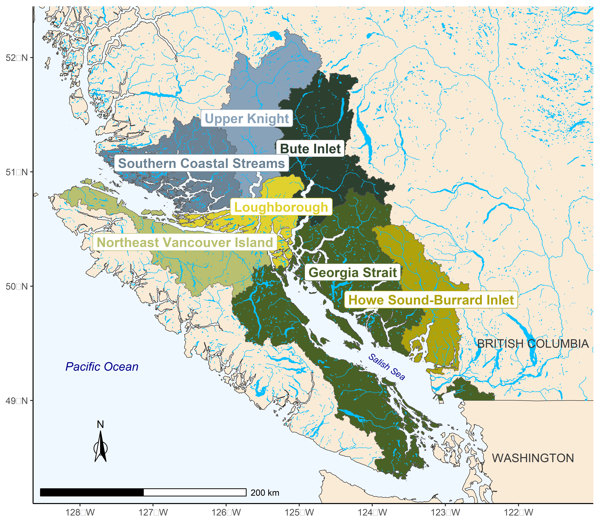
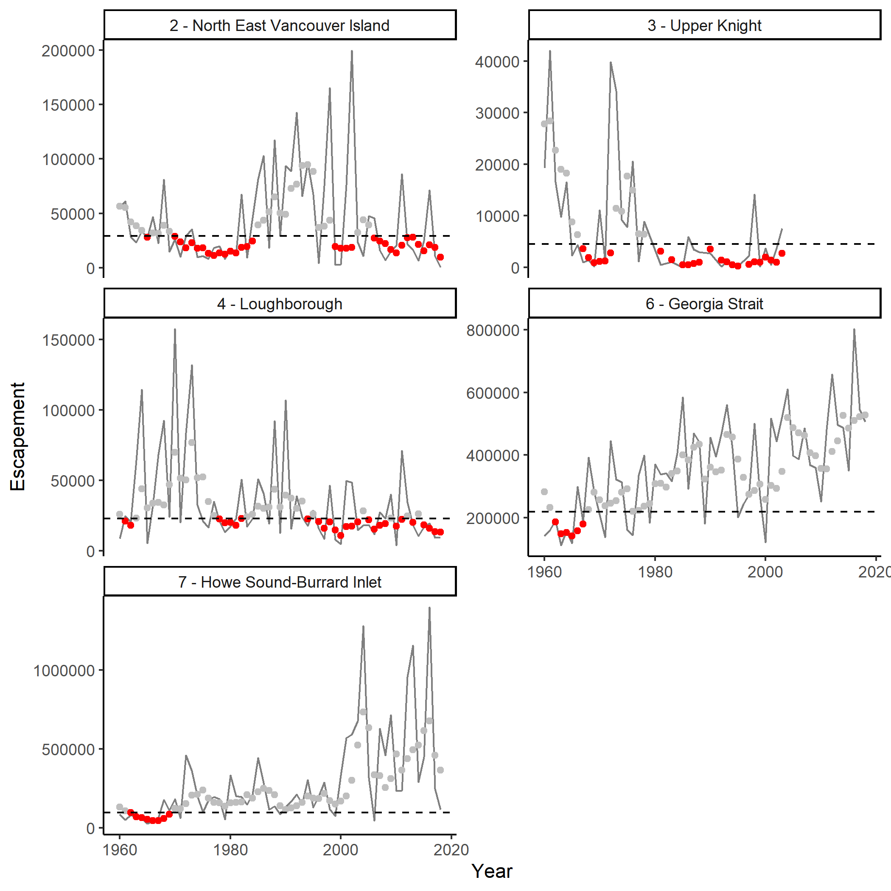

---
output:
  pdf_document: default
  html_document: default
---
# CASE STUDY 3: INSIDE SOUTH COAST CHUM - NON-FRASER{#ISCchumChapter}

<!-- # Add a comment in colour: *\textcolor{cyan}{LW: some text}* -->

<!-- Initials: my comment -->

## CONTEXT

The 'Inside South Coast Chum - Non-Fraser' (ISC-NF Chum) SMU includes seven CUs of chum salmon (*Oncorhynchus keta*) from rivers that drain into Johnstone Strait and the Salish Sea along the mainland of British Columbia and the east coast of Vancouver Island (Figure \@ref(fig:chum-map); @holtbyConservationUnitsPacific2007). This area includes deep fjords, glaciers, large rivers, and small coastal streams. Chum salmon CUs spawning in the Fraser River watershed are not included in this SMU. They have been categorized as a separate 'Inside South Coast Chum - Fraser' SMU. While these two SMUs have substantial overlap in ocean fisheries, they have been separated into two SMUs based on differences in terminal fishery impacts and freshwater habitats.

```{r CU-summary, echo=FALSE}
d <- read.csv("data/CU_summary_table_report.csv", check.names = FALSE)
csasdown::csas_table(d,
   align = c('l', 'l', 'c', 'c'),
   caption = #ifelse(french,
                   #"French goes here",
                   "The seven Conservation Units in the Inside South Coast Chum Non-Fraser Stock Management Unit. Note that only fall run streams were used in this study due to run reconstruction methods.")
            #)
```

<!-- CW: There may be value in describing the ISC-NF Chum SMU with a little more detail, e.g. list all CU's and their acronyms, if we want to use those in future figures and tables. Also mention if there are known sub populations within the identified CUs (this seems to be an important discussion topic?), maybe provide a table similar to the one in the coho chapter \@ref(tab:cohoCU2SP)]

LW: Added table. I included a column with summer run streams (not included in this analysis). If that is confusing I can remove that column.
-->

The ISC Chum SMU is considered data-limited. While escapement series are available for many streams starting in 1953, several series are incomplete and require infilling assumptions  (i.e., not all streams counted each year, some CUs have no counts in some years). 60% of observations (count of spawners for an individual stream, in a given year) were missing and needed to be infilled. <!-- KH: Suggest moving this last sentence on 60% missing to data section to bulk up that section a bit -->In addition, run reconstructions of recruitment are uncertain, making the development of benchmarks based on spawner and recruitment data problematic. There are also no data on marine survival (although there are some scale/growth data in @debertinMarineGrowthPatterns2017). Other unique characteristics of this SMU include high contrast in abundance among CUs and relatively low correlation in abundance among CUs over time. The SMU covers a large area with many diverse watersheds, flow regimes, and ocean entry locations. <!--KH addition: Wild Salmon Policy status assessments have not been done on any ISC Chum CUs.  -->

<!-- KH: It would be good to have the escapement correlation matrix included for chum to show the correlation structure among CUs. See the figure used by Carrie for chinook. Something in a matching format would be good.  The code for this in in the file IFCohoStudy/runFraserCoho_projLRP.r; see code at 'Step (11)'.  You could cite this figure here, or, in the results section when you describe low correlation as a reason the logistic regression didn't work. -->

Benchmarks based on spawner recruit relationships are unreliable if there is uncertainty in the spawner and recruit data. One alternative is benchmarks calculated as a percentile of the historical CU-level spawner abundance time series (percentile benchmarks). Previous work on developing WSP benchmarks for Inner South Coast Chum has shown that percentile benchmarks can be comparable to those based on stock-recruit relationships when productivity is relatively high and harvest is relatively low (@holtEvaluatingBenchmarksBiological2018). In other cases, percentile benchmarks may be inappropriate due to low productivity, high harvest, and because they do not account for non stationarity in recruitment dynamics (@holtEvaluatingBenchmarksBiological2018).

We chose the ISC-NF Chum SMU as a case study because we were interested in exploring LRP options for a data-limited SMU. We applied LRPs based on two methods: proportions of CUs above their lower benchmark, and logistic regression based on aggregate abundance. For proportions, we used percentile benchmarks and multi-dimensional status assessment to determine the status of component CUs. For the logistic regressions, we used percentile *\textcolor{cyan}{and $S_{gen}$ - should I leave out Sgen here, or leave in and then say that we dropped it due to unreliable stock-recruit data and/or poor logistic fits}*.

<!--
    CW: I think there is value in saying that we attempted to use Sgen but that it was not possible due to data limitations. -- this will likely be true for other SMus. 
    -->

```{r chum-map, fig.cap="The seven Conservation Units that make up the Inside South Coast Chum Stock Management Unit (not including Lower Fraser and Fraser Canyon Conservation Units).", warning=FALSE, echo=FALSE, fig.align="center"}

```


## DATA

We used the same data used in @holtEvaluatingBenchmarksBiological2018, but updated to 2018<!--KH: maye change to [...but updated with five additional years of data]??-->.

<!--KH suggested addition to give a bit more detail here in main body; also, to be clear how SR series gets used: 

Available data included spawner abundance time series from 1959 - 2018 and corresponding CU-level recruitment estimated from run reconstruction. Spawner abundance series rely heavily on infilling; 60% of observations (count of spawners for an individual stream, in a given year) were missing and needed to be infilled. Recruitment data are considered highly uncertain for all ISC Chum CUs due to uncertain assumptions required to assign mixed fishery catch to CUs within the run reconstruction model. As a result, we did not consider spawner recruit series to be reliable enough to estimate stock recruitment-based benchmarks such as Smsy and Sgen.  We did however use spawner recruit model fits to provide approximate estimates of CU-level productivity, which are used to inform the application of percentile-based benchmarks. -->

@vanwillInnerSouthCoast2014 provides more details on the data sources, infilling procedures and run reconstruction, which were reproduced for this study. We did not include the Lower Fraser or Fraser Canyon chum CUs. More details can be found in Appendix \@ref(app:first-appendix).

## METHODS

<!-- 
    I'm not sure we need a methods section here. But I am in favour of including the github link.
    CH comment: I don't think we need a header, simply state that data are available here on the github, with code for infilling.
-->

Data and methods are available at: https://github.com/Pacific-salmon-assess/SalmonLRP_RetroEval.

<!-- K.H. comment: Have we checked with Pieter on whether he is ok with Chum data being publically accessible on github?  We should make sure we have approval from him via email.
-->

### Determining the Status of Conservation Units
<!--
    Is this section equivalent to the "## CU STATUS ESTIMATION" in IFcoho chapter? 
    
    K.H. - yes it is. The header should be changes to match that in the coho chapter. I think Carrie will add this section for chinook too, so all case studies will be consistent.
    
-->

For this case study, we consider two approaches for characterizing CU status: (i) percentile benchmarks and (ii) multi-dimensional status assessment (@pestalAlgorithmsRapidStatus2021, in prep). <!--CH: let's be conistent with thoughtout both papers.  Ithink we're using Rapid Multidimenstional Scanner Tool as the name for this method--> *\textcolor{orange}{KH: as discussed, I think it makes sense to take out Sgen as a benchmark to evaluate; however, in light of your note about the SR data still being used for assessing patterns in productivity, we should flag this as something to discuss more with Carrie}* <!--CH: I think we take out Sgen as a benchmark, but include productivity as supplemental information for evaluating when percentile benchmarks are appropriate. I wouldn't emphasize the SR modelling when introducing productivity, just briefly state in the text how productivity was derived.--> 
<!--CH: Suggest adding, "Although the Rapid Multidimensional Scanner Tool is recommended for CU-level assessments (Holt et al. in prep), we provide status on a simple single metric, spawner abundances relative to percentile-based benchmarks for comparison.  Now I see Kendra's suggestions below which I like! (perhaps instead of this)-->

In addition to abundance-based benchmarks, other benchmarks would also be considered as part of an integrated status assessment under the Wild Salmon Policy (e.g., trends, distribution of abundance; @holtIndicatorsStatusBenchmarks2009). At this time, an peer-reviewed integrated status assessment has not been developed for ISC chum.

One limitation of percentile benchmarks and the multi-dimensional assessment method used here is the assumption of constant productivity. 
<!--
Sue Grant comment: This is not a limitation. It can be overcome with the multi-dimenstional approach when BM are considered can include this consideration.
Response: Agreed – this is a general challenge for all methods, and is part of a larger discussion about time-varying benchmarks / LRPs.  We can better describe it this way.

CH comment Nov 18: I suggest we remove this sentence, as we have a sub-section in the Guidelines paper pertaining to time-varying parameters and impacts on benchmarks and LRPs.
-->


<!--KH (Nov 17):

I suggest listing multidim method first to give it higher priority.  Maybe something like:

"For this case study, we consider two approaches for characterizing CU status: 
(1) Rapid multidimesional scanning tool 
(2) CU-level abundance relative to a lower percentile benchmark

The first approach, which uses the rapid  multidimensional scanning tool developed by the State of the Salmon program (Section \@ref(rapidToolMethods)), is consistent with Canada's WSP and is recommended by Holt et al. (in review) as the method that should be used to estimate CU status when using the proportional LRP approach. The second approach is presented as for a point of comparison with the rapid multidimensional scanning tool."

Could then lead into a discussion of percentile benchmarks as follows:

"When applying the rapid multidimensional scanning tool to ISC-NF Chum, we use percentile benchmarks as both upper and lower benchmarks (cite decision tree figure).  As a result, both of our approaches to CU status estimation depend on percentile-based benchmarks."

... then go on to below text on percentile benchmarks. 


-->

There are studies showing that a range of factors may affect the productivity of ISC Chum. These include competition with other salmon in the ocean and ocean conditions (@debertinMarineGrowthPatterns2017, @litzCompetitionOddyearPink2021). This application of percentile benchmarks does not account for changing productivity. 
<!--
Sue Grant comment: How is this different from any other salmon population, they are all affected by these conditions, and particularly right now so many are declining, so this is a fairly common issue, so should be mentioned more ina  broader context at the start and how to address this across all approaches
Response: Agreed. Can move this to intro and / or discussion to put into broader context.

CW: On the guidelines paper we have a section on the effects of time-varying productivity on  LRPs. We could move some of this discussion there. However, I think there might value in leaving some text here indicating that there are suspected changes in productivity for ISC chum. 

CH: I agree remove this sentence

-->


**Abundance-Based Benchmarks**

<!-- KH:
I am now wondering of it makes sense to get rid of the ***Abundance-Based Benchmark*** and ***Mutlidimensional Status Assessment*** headers as they are intertwined since the mutlidim uses abundance-based benchamrks.  Mabe the numbered list above is enough to differentiate??? 

CH comment: suggest removeing or changing to percentile-based benchmark, to avoid confusion with abundance-based LRPs
-->


<!--CH suggestion: Since this section is about percentile-based benchmarks already mentioned above, I suggest changing the topic sentence to, "Percentile-based benchmarks can be applied to assess status of CUs when stock-recruitment data are not available (Holt et al. 2018, clark et al. ) Then the 1st two sentences can be omitted--> Abundance-based benchmarks can be calculated in several ways. They can be informed by stock-recruit relationships when appropriate data are available. Where there are no reliable stock-recruit data available, an alternate method is using percentiles of recorded abundance (@clarkEvaluationPercentileApproach2014, @holtEvaluatingBenchmarksBiological2018). The suitability of percentile benchmarks was evaluated for ISC Chum by @holtEvaluatingBenchmarksBiological2018, who tested how well percentile benchmarks matched benchmarks from stock-recruit parameters, using retrospective and simulation analyses. @holtEvaluatingBenchmarksBiological2018 also calculated benchmarks based on stock-recruit model parameters for ISC Chum stocks, but did not recommend them due to uncertainty in spawner and recruit data. They tested how well a 25% percentile benchmark (and higher values up to 50%) compared to estimates of $S_{gen}$ for these CUs. They found that percentile benchmarks (from 25-50%) under moderate to high harvest rates and low to moderate productivity tended to underestimate 'true' $S_{gen}$ values (estimated from the same data), which would lead to optimistic and incorrect status assessments. More work on alternatives to percentile benchmarks were needed in this case. They also found that time series bias tends to under-estimate $S_{gen}$.


<!--CH: add details on how percentiles calculated, were percentiles based on smoothed or raw time-series of historical data, and mention that the current generational geometric average was compared to the specified percentile-->

<!-- 
Sue Grant: It would be helpful to start the paper with this context on all the different ways to assess relative abundance BMs…Sgen SR models, Sgen habitat, percentiles…
Maybe that is what the guidelines paper does is put this all together?

KH Respsonse: This is what the guidelines paper does, but I think there is a benefit in developing a table or something that clearly lays out all the options, and which ones are being looked at in each case study.  

-->


<!--
CW: I am not sure that the time series bias comment is super relevant here (as we are not using Sgen for the Chum case.)
CH: I agree, ans suggest removing the last sentence above.

--> 


```{r holt-tab6, fig.cap="Selected percentile-based lower and upper benchmarks identified to be similar or higher in value than stock-recruitment based benchmarks under the WSP, along gradients in productivity (recruits/spawner) and average harvest rates. * denotes the low-productivity scenario where lower and upper Ricker-based benchmarks are very close to one another, resulting in lower and upper percentile-based benchmarks that are the same. From Holt et al. 2018.", warning=FALSE, echo=FALSE, fig.align="center"}
knitr::include_graphics("figure/holt_et_al_2018_table6.png")
```


```{r holt_tab6b, echo=FALSE}
d <- readr::read_table("./data/holt_table6.xslx")
csasdown::csas_table(d,
   align = c('l', 'l', 'c', 'c'),
   caption = #ifelse(french,
                   #"French goes here",
                   "The seven Conservation Units in the Inside South Coast Chum Non-Fraser Stock Management Unit. Note that only fall run streams were used in this study due to run reconstruction methods.")
            #)
```


<!-- 


Sue Grant: this is a table, not a figure

-->

@holtEvaluatingBenchmarksBiological2018 recommended different percentiles to be used based on Ricker $\alpha$ and average harvest rate (figure \@ref(fig:holt-tab6)). Based on these recommendations, Georgia Strait and Howe Sound Burrard Inlet fall in the category of using 25^th^ percentile as a lower benchmark (Ricker $\alpha$ 2.5-4, harvest rate 20-40%). Loughborough, Northeast Vancouver Island, and Upper Knight ($\alpha$ 1.5-2.5 and harvest rate 0-20%) had a 50^th^ percentile lower benchmark recommended. Bute Inlet ($\alpha$ 1.5-2.5, harvest rate 20-40%) needed further evaluation and percentile benchmarks were not recommended. Percentile benchmarks were also not recommended for Southern Coastal Streams due to low productivity ($\alpha$ <1.5). Thus, we used 25% of spawner abundance as a benchmark for Georgia Strait and Howe Sound Burrard Inlet, 50% for Loughborough, Northeast Vancouver Island, Upper Knight, and did not use percentile benchmarks for Bute Inlet and Southern Coastal Streams. 
 <!--
    CW: I think that there might be some value in including the benchmarks used for each CU in a table, in addition to this text. Just for quick reference. 
 -->


<!--
K.Holt: I have commented out this section (Benchmark based on stock-recruit relationships - $S_{gen}) for now as I do not think we are using Sgen to calculate LRPs.If we do not evaluate LRPs based on Sgen, but still need to describe SR modelling for Sgen as it is used to estimate productivity for the percentile methods, we may wish to describe the SR modelling and results in an appendix?  In this case, we would not however need to estimate Smsy or Sgen.  Just ricker pars.
CH: I agree.

#### Benchmark based on stock-recruit relationships - $S_{gen}$

For Inside South Coast chum, there are no reliable data on marine survival for wild fish, and no proxies based on coded wire tag or age at return of hatchery chum in this SMU. This meant that the Ricker model used to estimate the spawner-recruit relationship did not account for variation in marine survival (compared to Interior Fraser Coho). 

The basic Ricker equation uses spawners $S$, productivity $\alpha$, and the strength of density dependence $\beta$ to predict recruits $R$ (Equation \@ref(eq:ricker)). Note that recruits includes returning adult spawners and adults caught in fisheries on their migration to spawn. We used the log-transformed Ricker equation so that the residuals/error would be normally distributed *\textcolor{cyan}{LW: is this correct about the residuals/error?}* (Equation \@ref(eq:logricker)). 

\begin{equation}
    R = \alpha S e^{-\beta S} 
    (\#eq:ricker)
\end{equation}

\begin{equation}
  log(\hat{R}) = log(\alpha_i) + log(S) - S \beta_i 
  (\#eq:logricker)
\end{equation}
  
We estimated the predicted recruits $\hat{R}$ from spawners $S$, productivity $\alpha$, and the strength of density dependence $\beta$ for each stock $i$ (Equation \@ref(eq:logricker)).  The natural log of observed recruits per spawner $log(\frac{R}{S})$ were assumed to be drawn from a normal distribution (normal error) with mean $log(\frac{\hat{R}}{S})$ and standard deviation $\sigma_i$ (Equation \@ref(eq:likelihood-recruits)).

\begin{equation}
    log(\frac{R}{S}) \sim Normal( log(\frac{\hat{R}}{S}) , \sigma_i)
    (\#eq:likelihood-recruits)
\end{equation}

$S_{MSY}$ *\textcolor{cyan}{LW:$S_{MSY}$ or $SMSY$?)* was calculated using Lambert's W function @scheuerell_explicit_2016 (Equation \@ref(eq:SMSY))

\begin{equation}
    S_{MSY} = \frac { 1 - Lambert_W(e ^ {1-log(\alpha)})} {\beta}
    (\#eq:SMSY)
\end{equation}

$S_{gen}$ was estimated from $S_{MSY}$ by assuming that the difference between the $\hat{S}_{MSY}$ (estimated from $\alpha$, $\beta$, and $S_{gen}$) and the $S_{MSY}$ calculated using Lambert's W function was normally distributed with mean 0 and standard deviation $\sigma_{S_{gen}}$ (Equations \@ref(eq:Sgen), \@ref(eq:likelihood-Sgen)).

\begin{equation}
    log(\hat{S}_{MSY}) = log(\alpha) + log(S_{gen}) - \beta S_{gen}
    (\#eq:Sgen)
\end{equation}

\begin{equation}
    \hat{S}_{MSY} - S_{MSY} \sim Normal( 0, \sigma_{S_{gen}})
    (\#eq:likelihood-Sgen)
\end{equation}


We used R (@r_core_team_r_2021) and the Template Model Builder *TMB* package (@kristensen_tmb_2016) to fit Ricker models and logistic regressions of aggregate abundance . 

Caveats with benchmarks based on $S_{gen}$ or stock-recruit parameters:

- Ignores variability in actual recruits/spawner ($S_{gen}$ is based on mean $\alpha$ value). This can be problematic if there are large residuals (especially negative) in the stock-recruit curve at low spawner abundance. For example, if 20% of the time (based on record of recruits/spawner), $S_{gen}$ spawners actually had recruits/spawner less than 1. Then you set up a potential tail-spin to low abundance, depending on the frequency of these low recruitment cohorts at low abundance.
- Because they are set at the CU level (high level in terms of stock-recruit relationship, not at the scale of stream-level density-dependence or ocean-level density dependence including overlapping species (e.g., individual stream, Pacific ocean)), they may not explicitly model density dependence at scales where it is probably occurring.
- Assumes productivity and density-dependence are constant
- $\alpha$ and $\beta$ are correlated: sensitive to each other, especially when fit is not good, this is problematic, especially since $S_{MSY}$ and $S_{gen}$ depend on both $\alpha$ and $\beta$
- $MSY$ and its derivatives, e.g., $S_{MSY}$, $S_{gen}$ are not based on COSEWIC risk of extinction metrics such as percent decreases in spawner abundance
- Doesn't account for depensation
- The only dependent variables used are recruits and spawners, no other variables that are possibly linked to productivity


--> 


**Multi-dimensional CU Status Assessment**


The methods for applying the multi-dimensional status assessment for CU status is described in Chapter 2. 

In applying the multi-dimensional rapid status assessment to ISC Chum, we used the percentile benchmarks as recommended in @holtEvaluatingBenchmarksBiological2018 for relative abundance benchmarks <!-- maybe take out term 'relative' and just call them abundance-based CU benchmarks? I don't think we use the term 'relative abundance' benchmarks in other places in the paper, so may be confusing to use it now. (I also find the term confusing)  I guess it depends how much we want to borrow from the SOTS language here-->for the five CUs that have appropriate percentiles identified. For Bute Inlet and Southern Coastal Streams, we did not use relative abundance benchmarks. When relative abundance benchmarks are not available, <!--CH: suggest changing last phrase to, "trends were used to assess status according to the decision tree (ref and Fig in Ch2)"-->the decision tree was used assesses trends instead. 

<!-- How were the appropriate percentiles identified? or was it from the @holtEvaluatingBenchmarksBiological2018?. 
    -->

### LRP Estimation for ISC-NF Chum

<!--
CW: I suggest we re structure this section so that it is consistent with the IFcoho chapter, 
With the following headings:  (CH agree)

## LRP ESTIMATION: PROPORTION OF CUS
### Methods (including CU status based on a single metric and the Rapid Multidimensional Scanner Tool)
### Results (for both methods for deriving CU status)
## LRP ESTIMATION: AGGREGATE ABUNDANCE LOGISTIC REGRESSION LRPS
 No methods and results, just mention that the method was not applicable. 
## Discussion

-->


**LRPs Based on Proportion of CU Status**


A simple method to set a LRP for a group of CUs is to set the LRP trigger as being a certain proportion of component CUs as being in the red zone. For example, for ISC chum (7 CUs), the LRP could be defined as being breached when one CU is in the red zone. For this case study, we set this as the rule - if any CUs entered the red zone, the SMU was considered to be below the LRP. 

<!-- KH: Some of the above points have already been  covered in chapter 2. I think this section could just start off with: 

We looked at the proportion of CUs that had status estimates above the red zone (or, above the lower percentile benchmark) to determine in which years between xxxx and xxxx the LRP would have been breached. As with the Interior Fraser Coho and WCVI Chinook case studies, we required all CUs to be above the red zone for the ISC-NF Chum SMU to be classified as being above the LRP. -->

<!--CH: I suggest prefacing this with why we evaluated different data scenarios, e.g., "The single-metric approach to assessing CU status based on percentiles has specific data requirements (Holt et al. 2018) while the multidimensional approach can be applied to any CU with at least a consistent time-series of spawner abundances. To compare LRPs based on CU assessment from these two approaches we evaluated several data streams including those that used the same data for each method and all available data for each method."-->We evaluated six different combinations of data and LRP methods (table \@ref(tab:LRP-scenarios)). For scenarios 1 and 2, we used CU status based on percentile benchmarks. For this comparison, we used static benchmarks (not retrospective) using the full data set, and percentile benchmarks based on @holtEvaluatingBenchmarksBiological2018. <!-- To do: Need to better explain what 'static' benchmark means; based on comment from Sue Grant.  CH comment: I suggest removing the term "static benchmark" and simply describe that the benchmarks were estimated using the entire time-series, and applied to each year to derive a time-series of statuses (unlike retrospective analyses described below and for IFR coho where benchmarks were iteratively re-estimated each year) -->  <!--CH: I suggest explaining the difference between scenarios 1 and 2 a bit more, e.g., "For scenarios 1 and 2, we used CU status based on percentile benchmarks that are limited by constraints in productivity in historical exploitation outlined in Holt et al. (2018). Also, we initially constrained time-series so that each CU contained data for each year included in total proportions (i.e.., no missing CU-statuses, Scenario 1). We then relaxed this assumption and included all CUs that meet the constraints of Holt et al. (2018) even if CUs had missing data for some years (Scenario 2). This scenario resulted in total number of CUs in the proportion based LRP what differed among years. The power to detect red status varied among years in Scenrio 2, using more of the available data than Scenario 1. "--> This method used the raw annual escapement values to calculate the benchmarks and the generational mean (geometric mean of 4 years) of escapement in the given year and previous 3 years to assess status in a given year. For scenarios 3-6, we used multi-dimensional status of CUs. The multi-dimensional assessment used percentile benchmarks as relative abundance benchmarks, and also compares the generational geometric mean to assess status relative these benchmarks for each year. <!--CH: scenarios 3-6 might need a bit more justification, as above for scenarios 1 and 2?-->

<!-- CW: I think I need a little bit more explanation on the methods used here.

What is the percentile based on? percentile of the raw annual escapement values? or percentile of the geometric means? CH: I've suggested moving this up to where percentiles are first introduced.
Or are we saying that we compared the raw numbers and geometric means to the percentile benchmarks to determine status? Or both? 

So scenarios 3-6 used relative abundances instead of full abundances? Is that the difference? 

Also, we may need to define the acronyms in the table below. I would also like to know what is the rationale behind each scenario. i.e. why did we include SCS full data on scenario 4 but excluded it from scenario 6?


-->

```{r LRP-scenarios, echo=FALSE}
d <- read.csv("data/scenarios compare CU status methods.csv", check.names = FALSE)
csasdown::csas_table(d[1:6,c(3,6:12)],
   align = 'l',
   caption = #ifelse(french,
                   #"French goes here",
                   "Scenarios using different subsets of data (CU names abbreviated) and methods to assign LRP status. 'Y' indicates a full time series, 'YP' indicates a time series was included but is partial (missing years). Bute Inlet and Southern Coastal Streams do not have appropriate percentile benchmarks. 'Full' scenarios use only years with full time series (no CU-level infilled CUs) and 'partial' scenarios include CU-level infilled CUs but drop years with CU-level infilling for those CUs.")
            #)
```


**LRPs Based on Aggregate Abundance and Logistic Regression**
<!-- CW: I think we need to review the level of section titles here
    for IF coho the title for this section is 
 ## LRP ESTIMATION:  AGGREGATE ABUNDANCE LOGISTIC REGRESSION LRPS
-->

We evaluated whether the proportion of CUs above their lower benchmark could be predicted by aggregate abundance using logistic regression models. We tested this using percentile and $S_{gen}$ benchmarks. These methods used 5 CUs with over 50 years of data (Bute Inlet and Upper Knight both had CU-level infilling in recent years and thus were left out of this analysis). <!--CH: remove Sgen here, correct?-->

<!-- KH: given that we discredit Sgen estimates for these CUs as being reliable, I think you could take out all mention of the logistic regression fits to Sgen and only mention percetiles. If the question of Sgen comes up during review, you could mention then that it was also tried, but didn't work.  -->

<!-- 
   CW:refer to chapter 2 for a description of the methods.
    CW: If the method did not perform well for the full time series, why did we do the retrospective analysis? I am a bit confused here.  
    
    KH: I agree; I suggest removing the next two sentances (note: I have commented them out here)
    
    -->


These methods were applied retrospectively. For a series of years up to a given year, the benchmarks and logistic regressions were calculated with all years up to that year. This was done for all successive years to see how the LRP (and benchmarks, and underlying stock-recruit parameters) would have changed over time as more data was collected.<!--CH: agree with CW. Can we remove mention of retrospective analysis since we don't need the results for alphab, beta, Sgen, Smsy, and then mention the shifiing basedline percentile plot as supplementary analysis below?-->

<!--
KH: suggest deleting:
These methods were applied retrospectively. For a series of years up to a given year, the benchmarks and logistic regressions were calculated with all years up to that year. This was done for all successive years to see how the LRP (and benchmarks, and underlying stock-recruit parameters) would have changed over time as more data was collected. -->


Due to poor logistic model fits using the entire 1953-2018 time series for both $S_{gen}$ and percentile benchmarks, we did not conduct full retrospective analyses of logistic-regression based LRPs for this SMU as was completed for the Interior Fraser River Coho case study. The characteristics of the data that led to poor logistic model fits are highlighted in the results section below. <!--CH remove mention of Sgen-->


## RESULTS


### LRP Based on Proportion of CU Status


**CU Status Based on Percentile Benchmarks**


Two out of four CUs were below their percentile lower benchmark in 2018 (Figure \@ref(fig:chum-perc-status-static). Howe Sound-Burrard Inlet and Georgia Strait had status above their lower benchmarks.

<!--
<!--CH: "In supplementary analyses, we evaluated percentile benchmarks retrospectively for each year in time series using only data prior to that year."--> As more years of data were included, percentile benchmarks increased over time for Georgia Strait (especially the 50^th^ percentile) and had modest increases for Howe Sound-Burrard Inlet (Figure \@ref(fig:chum-perc-retro)). Percentile benchmarks decreased by a small amount for Loughborough and North East Vancouver Island. 

<!--CH: this next pgh should be moved to the section on Logistic regression-->
Percentile approaches were not used for the other three CUs for the purpose of the logistic regression of aggregate abundance because they were not appropriate based on productivity and harvest rates (see @holtEvaluatingBenchmarksBiological2018 Table 6),  CU-level infilling, or both (although they are shown in Figure \@ref(fig:chum-perc-retro)). 

Among these three CUs, Southern Coastal Streams and Upper Knight show evidence of shifting baselines if percentile approaches are used. <!--CH; I'm confused now. UK was excluded because it has partial data, not because of this shifting baseline, correct? Evidence for shifting baseline is much weaker for UK than for SCS when we take out CU infilling. Perhaps reword to, "Among these three CUs, Southern Coastal Stream shows evidence of shifting baselines whereby the percentiles trend downwards over time following general decline in abundances (Appendix Fig.), as does Upper Knight but to a lesser extent. -->

```{r chum-perc-status-static, fig.cap="Spawner escapement (solid black line) with generational mean (4 year rolling geometric mean) of escapement in points.", warning=FALSE, echo=FALSE, fig.align="center", height=8}

```


**CU Status Based on Multi-Dimensional Status**

<!--CH: We have agreed to use "Rapid Multidimensional Scanner Tool" to refer to this approach everywhere, unless it's too awkward(i.e., repeating in the same sentence) in which case it can perhaps be shortened by "multidimensional approach"-->

Using this method, two out of five CUs with data in the most recent year of data (2018) would be above their lower benchmark (amber or green zone) and 3 would be below (red zone. Over the time series, status for Howe Sound-Burrard Inlet and Georgia Strait has improved, while status in other CUs has declined or switched from green to red several times. 

```{r chum-CU-status-tree, fig.cap="Status of CUs based on multi-dimensional status assessment (decision tree). Years with CU-level infilling were not included.", warning=FALSE, echo=FALSE, fig.align="center"}

```

  


**Comparison of Percentile and Multi-Dimensional Methods**
<!-- KH: This should be made it's own section at the end under the heading

## HISTORICAL EVALUATION OF STATUS ACROSS LRP METHODS

-->


<!--KH: you could start off this section with a blanket statement along the lines of:
The ISC-NF Chum SMU was consistently below the LRP for large portions of the historical time series, regardless of which LRP estimation method. While the aggregate SMU abundance time series increased over time, SMU status remained below the LRP in every year of the past two decades except 20xx for all estimation methods. These results were mainly due to the tendency of Georgia Strait and Burrard Inlet-Howe Sound CUs to have high and increasing abundances while smaller CUs, such as Southern Coastal Streams, remained low.-->

LRP status based on percentile benchmarks had more years below the LRP <!-- than LRP status based on the rapid mutlidimensional scanning tool--> multidimensional status (Figure \@ref(fig:chum-LRP-compare), Table \@ref(tab:LRP-scenarios)). Comparing scenarios 1 and 3 (same data) in a given year, ISC Chum were below the LRP based on percentile benchmarks but above it based on decision tree. Scenarios 2 and 6 (same data, more data than 1 and 3) show a similar pattern. <!-- KH: Can you describe why this is? When the multidimensional gets applied to 4CUs full, do all CUs in all years use the percentile criteria?  If so, I would expect them to be the same.  Or, are there some years where the mutidim uses trends for the 4 CUs full? -->  <!--CH: the same for scenario 2 and 6 (5 CUs partial). If they use the same percentile data for those 5 CUs, they should get the same result unless an absolute threshold is breached and a different branch of the tree is used in the Rapid Multidimentaional Scanner Tool? If so, it would be useful describing this explicitly--> <!--CH: is there a difference in raw vs smoothed values used in our percentile assessment vs. the SOS Scanner Tool (we should use gen averages), or in the estimation of percentile-based benchmarks (I see we have used raw values, which I think makes sense and is consistent with Holt et al. 2018, p.9)-->

In this case study, adding more data changed the number of years that the SMU was below the LRP. Scenario 5 (most data) had the most years below the LRP. Comparing scenarios 1 and 2, which are both based on percentile benchmarks, including more data (scenario 2) results in more years below the LRP. Comparing scenarios 4 and 5 (decision tree only), including more observations results in one year switching from above the LRP to below it.<!--CH: Actually, I think it switched from having no data for that year to below thte LRP when more data were included--> Comparing scenarios 5 and 6 (where scenario 6 had two fewer CUs than scenario 5), including the two CUs in scenario 5 results in three years switching from above the LRP to below <!--CH: again this is switching from no data to below LRP, correct?-->. Other applications may result in different outcomes of including more data based on the status of additional CUs or years. <!--CH. It's not clear what "other applications" means here. I suggest omitting the last sentence, and then in the discussion mentioning the role of adding data--> 

We found that SMU status can be below the LRP even if the aggregate abundance increases. For ISC Chum, this is mainly due to years with high abundances of Georgia Strait and Burrard Inlet-Howe Sound and low abundances and red status in other, smaller CUs, such as Southern Coastal Streams. This highlights the importance of including a metrics of status at the CU level, which influence the overall SMU status.  

```{r chum-LRP-compare, fig.cap="Comparison of LRP status (red = below LRP, gray = above LRP) for six scenarios. The black line shows aggregate abundance. Scenarios 1-3 and 6 do not include Bute Inlet or Southern Coastal Streams (no appropriate percentile benchmarks). 'Full' scenarios use only years with full time series (no CU-level infilled CUs) and 'partial' scenarios include CU-level infilled CUs but drop years with CU-level infilling for those CUs.", echo=FALSE, fig.align="center"}
download.file('https://github.com/Pacific-salmon-assess/SalmonLRP_RetroEval/raw/master/SCChumStudy/Figures/fig_compare_LRP_methods.png', './figure/chum-compare-LRP-methods.png', mode="wb")
knitr::include_graphics('figure/chum-compare-LRP-methods.png')
```

<!-- 
KH: To use labels on the historical status bar figure that matched coho, you could use:

Prop: Multidim: 4CUs full
Prop: Percentile: 4CUs full

Prop: Multidim: 5CUs partial
Prop: Percentile: 5CUs partial

Prop: Multidim: 5 CUs full

Prop: Multidim: 7CUs full


(You don't need to adapt this exact order, although I do like that it goes from less to more data as you move down, and that it groups together the comparisons between methods)
CH: I agree
-->


### LRPs Based on Logistic Regression and SMU Aggregate Abundance


The logistic models predicting whether all CUs were above their benchmark based on aggregate abundance fit the data poorly (Figures \@ref(fig:chum-logistic-sgen), \@ref(fig:chum-logistic-perc)). In both cases, the sum of abundance for all CUs in a given year was not a good predictor of whether those CUs were above their benchmarks in that year. Years with high aggregate abundance but with some CUs below their benchmark make a logistic model unsuitable for the purpose of estimating which aggregate abundance is linked to a high probability of each component CU being above its lower benchmark. Note that these regressions used the aggregate abundance of only the CUs used in the regressions, and excluded the other CUs. 


Several factors led to these poor model fits. The Inside South Coast Chum SMU is made up of seven CUs that vary in their escapement abundance. In many years, escapement in Georgia Strait and Howe Sound-Burrard Inlet is greater than in other CUs by two orders of magnitude. In addition, the correlation in escapement among these seven CUs is low. These characteristics mean that the aggregate abundance may be high due to one or more CUs with high escapements, while one more smaller CUs are below their benchmark. High aggregate escapements do not mean that all CUs are above their benchmark. This makes sense because this SMU covers a large area with many different populations affected by both local and regional factors. These seven CUs also have different numbers of populations. There are also differences in actual productivity (recruits per spawner) among CUs. 
<!--CH: I suggest applying the 4 criteria for 'representativness' in the Guidelines paper to assess if it is reasonable to assess status of the SMU based on only 4 or 5. I can help you with the biogeoclimatic zones. I suggest emailing Pieter about similarity in threats among CUS-->

```{r chum-logistic-perc, fig.cap="Logistic regression of whether escapement of all component CUs were above their percentile benchmarks based on aggregate abundance, for Inside South Coast Chum SMU. Includes CUs where percentile benchmarks were appropriate (no Bute Inlet, Upper Knight, or Southern Coastal Streams)", warning=FALSE, echo=FALSE, fig.align="center"}
download.file('https://github.com/Pacific-salmon-assess/SalmonLRP_RetroEval/raw/master/SCChumStudy/Figures/AnnualRetrospective/Bern.Percentile_noCUinfill_90/LogisticMod_2018.pdf', './figure/chum-logistic-perc.pdf', mode="wb")
knitr::include_graphics('figure/chum-logistic-perc.pdf')
```


<!--
```{r logistic-fit-diag-perc, echo=FALSE}
download.file("https://github.com/Pacific-salmon-assess/SalmonLRP_RetroEval/raw/master/SCChumStudy/DataOut/logisticFit_2018Output.rda",'./data/chum-diagnostics.rda', mode="wb" )
load("data/chum-diagnostics.rda")
LRdiagOut
```

Diganostics summarized:
Deviance residuals spanned from -1.418606  1.691950 and Pearson's residuals spanned from -1.418606  1.691950. Assumption 3 (no outliers) met. 

minimum sample size =37. sample size =63. Assumption 4 (sufficient sample size) is met.  

pDRT = 0.1296465 . p value is >0.05, indicating that there is not significant improvement in fit with the variable (aggregate abundance)

quasiR2 = 0.03126051 . Value is low, indicating that the fit is not good. 

confusion matrix: 

hit ratio = 0.7. Ratio of correct classification. Moderately high (but method tends to have overly optimistic values)

Box-Tidwell p-value = 0.02. Significant at a=0.05. Indicates a lack of linearity in the relationship between aggregate adundance and log-odds. - assumption 1 (relationship between aggregate abundance and log-odds is linear) not met. 

p value for B_0 = 0.0064. Significant at a=0.05 level. 
p value for B_1 = 0.19. Not significant at a=0.05 level.

There was no evidence for auto-correlation in Pearsons's residuals or deviance residuals. assumption 2 (observations are independent of each other) is met. 
-->
  


The diagnostics for the logistic regression indicated that the model fit was poor for percentile benchmarks (Figure \@ref(fig:chum-logistic-perc)). The Box-Tidwell test indicated a significant lack of linearity in the relationship between aggregate abundance and log-odds, which means that an assumption of logistic regression was not met. There was not a significant improvement in the model fit when aggregate abundance was included, compared to the null model. There was no evidence of outliers, and there was a sufficient sample size. The ratio of correct classification based on a confusion matrix was 0.7. Note that this method tends to have overly optimistic values. The p-value was significant for the estimation of $B_{0}$, but not for $B_{1}$, the coefficient for aggregate abundances. There was no evidence for autocorrelation in residuals. Regressions based on $S_{gen}$ had similarly poor model fits (Figure \@ref(fig:chum-logistic-sgen). <!--CH remove Sgen-->

<!-- CW: maybe move this paragraph up in the section?

    Also might be good to state what is a "good" diagnostic and what is a "bad". For example: the fact that "There was no evidence of outliers, and there was a sufficient sample size" ia a good thing, however it was not enough to overcome the deficiencies exposed by the other diagnostic criteria.  

    Is the ratio of correct classification based on a confusion matrix, or based on loo? maybe present loo results to be consistent with IF coho
    -->

## DISCUSSION


### Suitability of LRP based on status of component CUs (proportion)


Something about portfolio effects/ theory. Paper on Alaska shifting productivity areas from year to year. 
<!-- 
SG: We wrote in our rapid status algorithm  draft paper that maintaining underlying biodiversity is important so it can buffer production during periods of declining productivity, and also ensure we have the diversity to maintain a species through environmental change…However, now we are cashing in on that biodiversity and hoping we have enough to get us through climate change. We will loose CUs, which is why I struggle with focusing on ‘rebuilding plan’ triggers, when we have to step back and look at what makes sense to adapt and what we just will lose. All the money spent on Sakinaw, and we have neglected the bigger picture and if this even makes sense.

KH: We can add some discussion around this point about trade-offs to the guidelines paper.  The decision about when it is ok to lose CUs and which ones to lose is a management decision, so is beyond the scope we have to work with. But, we can highlight that this is a reality, and that triggering LRP breaches based on CU status can take this into account by requiring <100% of CUs to be above red status.
--> 

(Note: not using percentile benchmarks for relative abundance benchmark for decision tree gives the same results as scenario 5 at the SMU level)

<!-- KH: I think this topic will be covered in the guidelines paper, so may not be needed as a discussion point. For our case studies, we are mostly just referencing the guidelines paper and saying that the proportional approach is recommended by that paper-->


**Limitations of Percentile Benchmarks** 

There are some assumptions and limitations when using benchmarks based on percentiles of abundance. One of the largest <!--limitations--> is the influence of shifting baselines on percentile benchmarks. If abundance has decreased over time, the resulting percentile benchmark will also decrease over time as more data is included (Figure \@ref(fig:chum-perc-retro)). This means that the benchmark shifts downward, reinforcing a shifting baseline. A population size that used to be below the benchmark can become above the benchmark, as the benchmark decreases. This can arise from a decrease in abundance in the period of data, and by an unrecorded high level of abundance before the period of data followed by a decrease before data are available. 


<!--KH: can we say something about how the above concerns link to our case study?  For example, using ISC-NF Chum data updated to 2018, we found trends in percentile benchmarks for some CUs (Georgia Staight, Howe-Sound Burrard, Upper Knight), but not for others (Loughborough, North East VI). Was there any recommendation from Holt et al. on what to do in this situation that applies to LRPs?? Or, are we ok so long as we remain within the productivity and exploitation rate limits recommended in the Holt et al. table? It looks like Upper Knight is the only CU where benchmarks trends down, however this was in the early part of the time series and this CU already uses a 50% lower benchmark to be precautionary. Recent abundances and benchmarks seem stable. -->

The concept of percentile benchmarks also assumes productivity is stationary. Otherwise, if productivity was decreasing, a larger abundance of spawners would be required to produce the same number of recruits. Contrary to this assumption, there is evidence that the productivity of chum salmon is not stationary. <!-- SG: Productivity is really never stationary, but pariculartly right now many salmon are declining, so not unique to this case --> 
The productivity of BC chum salmon is lower when the abundance of North American salmon like pink, sockeye, and chum is greater (@debertinMarineGrowthPatterns2017, @litzCompetitionOddyearPink2021). <!--Suggestion by Sue Grant to remove following sentences because all salmon are affected by marine and FW conditions, and this level of detail is not relevant to this paper:  "Ocean conditions may also have an affect on ISC chum. The Pacific Decadal Oscillation (PDO) can have a positive or negative relationship with the productivity of wild Washington chum depending on the time period examined (@litzCompetitionOddyearPink2021). The North Pacific Gyre Oscillation (NPGO) had a positive relationship with chum growth, mediated my PDO (@debertinMarineGrowthPatterns2017)." --> The percentile benchmark is also only informed by the data available, which may be for a short time period. Those using percentile benchmarks should also consider whether they are calculated using a percentile of recruits or escapement.


Estimating relative-abundance <!-- replace 'relative-abundance' with 'abundance-based CU benchmark'-->benchmarks for salmon populations without a long time series and without data on productivity (only escapement, no recruits/smolt production) is challenging. Previous evaluations of Inside South Coast chum population status used a 25% benchmark (@hilbornBritishColumbiaChum2012). This was based on previous work by the Alaska Department of Fish and Game that defined four tiers of populations based on contrast in spawner abundances, harvest rate, and precision of escapement data (@bueEscapementGoalReview2001, @otisEscapementGoalsSalmon2004). The goal of these tiers was to choose a Sustainable Escapement Goal (an upper and lower percentile) to use as a goal for escapement to represent a proxy for keeping escapement within a range that includes $S_{MSY}$ (@clarkEvaluationPercentileApproach2014). These SEGs <!-- CW: Is SEG Sustainable escapement goal? if so it should be indicated --> were calculated for each major river/system and are still done that way in Alaska (@mckinleyReviewSalmonEscapement2020). Tier 1 of this method was for high escapement contrast (greater than 8 <!-- CW: greater than 8 what? andmaybe we do not need the greater than 8? -->) and at least moderate harvest rate, with a SEG of 25th to 75th percentiles. @bueEscapementGoalReview2001 assessed this method on 11 populations of sockeye salmon and Chinook salmon from Upper Cook Inlet and Bristol Bay (in @clarkEvaluationPercentileApproach2014 <!-- CW: who did this? clark or bue? -->). @clarkEvaluationPercentileApproach2014 tested the suitability of this 4 tier percentile approach with theoretical, simulation, and meta-analysis methods using 76 stock-recruitment data sets from Alaska (7 pink salmon, 7 coho salmon, 43 sockeye salmon, 6 chum salmon, and 13 Chinook salmon populations <!--KH: may not need details of numbers; just say 76 stock-recruit data sets covering all 5 species fo Pacific salmon -->). They recommended a revised 3 tier system, which changed the Tier 1 lower percentile to 20%. Moving to British Columbia, @hilbornBritishColumbiaChum2012 adopted the previous 25% lower limit of SEG as a benchmark for evaluating the status of Inside South Coast Chum in BC for the purpose of certification with the Marine Stewardship Council (@hilbornBritishColumbiaChum2012), despite its lack of testing for populations of chum salmon in British Columbia. Further, SEGs were and still are applied to individual rivers in Alaska, compared to the application of this method to entire CUs by @hilbornBritishColumbiaChum2012, @holtEvaluatingBenchmarksBiological2018, and this study. ISC chum includes 296 streams among the seven CUs, with 126 in Strait of Georgia alone. By aggregating spawners and recruits across many rivers before estimating benchmarks of percentile or stock-recruit parameters, the following problems may arise:

- Error in fitting stock-recruit curves because it is at aggregate level instead of by river <!-- CW: why is this a problem? We will always have some degree of variability between components of a CU, is the variability in chum greater than for other CUs?
 And relating to that, we probably need to circle this discussion back to the LRP, are we trying to say that having the LRP based on CU level benchmarks may still allow the loss of some less productive sub-population components within the CU?  -->
- Sum of $S_{gen}$ calculated for individual rivers may not equal $S_{gen}$ calculated using aggregated spawner and recruit data
- Non-stationarity of productivity in individual systems may be hidden by aggregating spawners and recruits
- Spawner abundance at CU level may not be a good predictor of status of individual rivers compared to SEGs at the river scale, depending on the contrast in size between rivers and the correlation (or lack thereof) in escapement and/or productivity


**Multidimensional**

Useful for mixture of data qualities/types/BM e.g., some CUs didn't have appropriate RelAbdundance benchmarks. <!-- Follwing text added by Sue Grant:-->This approach has been tested on a variety of data types, including those with and without relative abundance benchmarks. Like any approach to assess LRP’s, the underlying data, and benchmarks applied if relative abundance benchmarks can be used should be verified by experts. There are examples in Fraser Sockeye or with Fraser IFC, where it relied on trend metrics only, so can relate to data types that are data limited for Chum.


<!-- Suggestion by Sue Grant to remove the following because expert review should be the case for any method you use…so not a caveat relative to other approaches, it is common. You just didn’t include the details for the same review as your other methods-->

<!--
Caveats with using multi-dimensional approach

- An essential part of the process is an expert review of the outputs from the algorithms (not done here). This approach should include a review by experts for any official use. 
- Learning tree was based on assessments for Interior Fraser coho, Fraser sockeye, and Southern BC Chinook. Not assessed for Chum. Further evaluation of how well the decision tree transfers to other species and regions should be done before using decision tree to assess status compared to LRP. 
-->

### Suitability of Logistic Regression LRPs Based on Aggregate Abundance

Did not work for ISC Chum SMU. 

Data was not suited to logistic regression - aggregate abundance was not a good predictor of the status of component CUs. 

Some reasons why (summarise from Results):
- large differences in abundnace between CUs - 2 orders of magnitude gor Goergia Strait, Howe Sound-Burrard Inlet compared to others. Not high correlation between escapements between CUs.
- 

Why (further) ?
- Large geographical range of SMU / component CUs
- Lots of different populations
- CUs have different numbers of populations (big differences), and those populations have big differences in abundance
- Differences in productivity among CUs/populations


<!--CH: remove-->In the retrospective analysis, the logistic model fits were more appropriate to the data in some years (e.g., 1980s). Although logistic regression could be used to estimated LRPs based on aggregate abundance in some SMUs where abundance is more even among CUs and escapements are more correlated, these relationships may not remain static and could become unreasonable over time. Care should be taken to regularly reassess the validity of aggregate abundance-based LRPs where they are implemented in the future. 


### Assumptions and limitations

The CUs that required CU-level infilling (Upper Knight and Bute Inlet) were not used for the retrospective analysis because the assumption that escapement is correlated between CUs ignores diversity between CUs and the potential for uncorrelated escapements. The reality of uncorrelated escapements must be taken into account to evaluate whether aggregate escapement is a meaningful predictor for the status of individual CUs. It should also be noted that these two CUs do not represent a random subset of the seven CUs in the Inside South Coast Chum SMU. Both have fewer streams than the other CUs and a higher proportion of summer-run populations of chum. These CUs also include long fjord systems with glaciers and watersheds that go deep into the mainland with headwaters in the Cariboo region. The hydrology, geomorphology, and marine conditions when smolts enter the ocean in these systems may vary from that of the other five CUs, leading to differences in productivity and responses to the regional climate. For example, productivity (recruits per spawner) of the Upper Knight and Bute Inlet CUs (using CU-level infilling, which introduces error) have the largest magnitude of variability in the SMU, with very productive years (>100 recruits per spawner) and low productivity years, and boom and bust cycles of abundance. In other SMUs where the quality of data differs for a subset of CUs, careful consideration should be given to whether abundance, productivity, and their trends can be reliably estimated using data from CUs with data of higher quality. 


### Other sources of information to inform LRPs / benchmarks


<!-- CW: Maybe this can be moved to the general discussion? As these are not particular to the Chum study case? 
Could include it as a paragraph in future research? e.g. consider the two-eyed seeing approach to explicitly consider indigenous knowledge when setting reference points. 

-->
Indigenous Knowledge

- Two-Eyed Seeing - Etuaptmumk(Mi’kmaw) @reidTwoEyedSeeingIndigenous2020
- Historical baseline before records from western science @eckertDivingBackTime2018, @leeDiverseKnowledgeSystems2019, @banIncorporateIndigenousPerspectives2018

Genetic tools and historical records

- Skeena sockeye @priceGeneticsCenturyOld2019, @pricePortfolioSimplificationArising2021
- Skeena chum @priceAbundanceSkeenaRiver2013
- Cannery records @meengs_estimating_2005

Archaeological records

- BC herring @mckechnieArchaeologicalDataProvide2014


<!--

KH suggestions for overall discussion topics for this chapter:

1) What are the unique characteristics of this case study that can inform the development of guidelines

- No reliable SR parameter estimates; needed to rely on more data-poor methods that assessed CU status based on abundance relative to percentile benchmarks and trends within the rapid multidimensional scanning tool. High levels of missing data also required decisions to be made about which CUs to include in which years.  We used this case study to explore how sensitive proportional-based LRPs were to these decisions about number of CUs and number of years of data. 


2) What are the required assumptions and limitations of percentile benchmarks, and where they a concern for this case study?  How do the recommendations of when / how to use them by Holt et al. need to be carried over when applying them to LRP estimation?
- This is already covered in above text
- Note that SOTS decision tree recommends using abundance-based benchmarks over trends when available, so as long as percentile benchmarks are within the recommended guidelines of Holt et al., uisng them is preferred over relying solely on trends to assess CU, and therefore SMU, status.  
- Recommendations for future research / monitoring in order to support their use???


3) How did using the rapid multidimensional scanning tool increase the level of information used to assess SMU status compared to the single metric approach that used percentiles?

- e.g., it allowed all 7 CUs to be included when assessing SMU status by allowing alternative trend-based metrics to be considered, trends could be used when no appropriate percentile benchmarks for Bute Inlet and Southern Coastal Stream CUs. The 7 CU partial case was the most precautionary of the scenarios considered. (CH: as this approach used the most data! see my point below item 4)


4) How did the strategy of increasing the number of CUs included in LRP status assessment (5 CUs partial) compare to using a consistent number of CUs in all years (4 CUs full)? 
- In this case, adding more CUs was more precautionary, but this result is expected to be specific to this case study. In other circumstances, it may be less precautionary.  However, a key result is that there was a difference. This is not suprising given the low correlation of CUs within this SMU; we do not expect CUs to be interchangable.  Therefore; it makes sense to use as much data as possible to represent variable dynamics within the CU/  
CH: comment. I think adding CUs will always result in same or more pessimistic status assesssmnts (no data is same as green/amber status i.e., LRP not triggered), so the precautionary approach would lead to inclusion of all CUs.

5) Why didn;t abundance-based LRPs not work for this case study

- Lack of relationship between aggregate abundance and the status of component CUs meant that abundance-based benchmarks were not possible using logistic-regression based methods.
- Why weren't projection-based LRPs considered? 

CH addition:
6) Status can be below LRP even as aggregate abundances increase


-->

