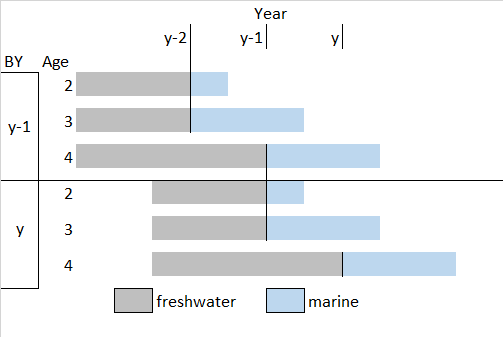

<!-- The following code should appear at the beginning of the first appendix.
After that, all subsequent sections will be turned into appendices. -->


# SamSim MODEL DOCUMENTATION {#app:third-appendix}

SamSim is the closed loop simulation model used for calculation of the projection based LRPs. A model overview and the code can be found in project [github page](https://github.com/Pacific-salmon-assess/samSim/tree/LRP). This appendix decribes the model equations relevant to the Interior Fraser coho salmon and West coast Vancouver Island chinook salmon study cases. The model indexes and quantities are defined in Table \@ref(tab:modvar) and input parameters used for the study cases are listed in Table \@ref(tab:parval). Detailed definitions of the input data and parameters are provided in the project [README](https://github.com/Pacific-salmon-assess/samSim/tree/LRP#readme). 


<!-- These tables are being updated in the samSimparamtabs.tex local file. It is easier to flip between files than scrolling up and down in the document-->
\begin{table}[ht]
\caption{List of samSim model indexes and variables.}
\begin{tabular}{ll}
\hline
Notation & definition \\ 
\hline
$y$ & year \\ 
$j$ & age \\
$k$ & Conservation Unit (CU)\\
$S_{y,k}$ & Spawners \\
$RY_{y,k}$ & Calendar Year Recruits \\
$Ra_{y,k,j}$ & Age specific brood year Recruits \\
$R_{y,k}$ & Total brood year Recruits \\
$C_{y,k}$ & Catch \\
$ER_{y,k}$ & Exploitation rate \\
$\alpha_{k}$ & Ricker productivity parameter\\
$\beta_{k}$ & Ricker carrying capacity inverse\\ 
$\sigma_{k}$ & Recruitment model standard deviation\\
$w_{y,k}$ & Recruitment deviations\\
$ppn_{y,k,j}$ & true proportions returns at age\\
$obsppn_{y,k,j}$ & observed proportions returns at age\\
$FctRY_{y,k}$ & Calendar year Recruits forecast\\
$Fct_{y,k}$ & Forecast scaler\\
$RYMU_{y,k}$ & Calendar year recruitment aggregated by management unit \\
$FctRYMU_{y,k}$ & Calendar year recruitment forecast aggregated by management unit \\
\hline
(\#tab:modvar)
\end{tabular}
\end{table}


\begin{table}[ht]
\caption{List of samSim model parameters and values used for the Interior Fraser study case. }
\begin{tabular}{l p{4cm} p{3cm} l}
\hline
Notation & definition & data input name & value \\ 
\hline
$\alpha_{k}$ & Ricker productivity parameter & alpha & mcmc sample\\
$\beta_{k}$ & Ricker carrying capacity inverse & beta & mcmc sample\\ 
$\sigma_{k}$ & Recruitment model standard deviation & alpha & mcmc sample\\
$\gamma_{k}$ & Recruitment model standard deviation & alpha & mcmc sample\\
$RSc$ & Scalar used to cap High recruitment values & CapScalar &3\\
$\rho$ & temporal autocorrealtion coefficient & rho & 0\\
$\tau$ & variance parameter for multivariate logistic error around proportions at age\\
$\mu_{Fct}$ & Forecast scaler mean  &meanForecast & NA\\
$\sigma_{Fct}$ & Forecast scaler standard deviation & sdForecast & NA\\
\hline
\end{tabular}
(\#tab:parval)
\end{table}


SamSim is


### Model Priming


The priming phase, or model initialization, represents the past data for CUs being modeled. It is used to represent real and observed abundances before starting the simulation trials. This phase loops over a number of past years ('nPrime') and reconstructs recruitment time series for past years. The simulations can be initialized in two ways: with existing recruitment data or with user defined parameters, if recruitment data is not available. During the initialization phase three types of CU specific data tables are populated: Spawners ($S_{y,k}$), Recruits ($RBY_{y,k}$, Catch and Exploitation Rate.  

#### Available Recruitment Data

If spawner  ($RBY_{y,k}$recruitment data is avalable, the number of initialization years 'nPrime' is defined based on the length of the longest CU time series available. The Spawners, Recruits, Catch and Exploitation Rate objects are populated with the input data. If catch or expoitation rate data are not available, those values are set to zero.


#### No Recruitment Data

When Recruitment data is not available, the 'nPrime' is set to 10x the maximum age of recruits. The number of Spawners can be initialized by the user or otherwise is set at equilibrium for the first 6 years and then calculated based on recruitment in the previous years (equation \@ref(eq:Seqinit)). If the calculated number of spawners is lower than the user inputted extinction threshold (`extinctThresh`), then the number of spawners is set o zero. 

\begin{align}
  S_{y<=6,k} &= \frac{\alpha_{k}}{\beta_{k}} \\
  S_{y>6,k} &= RY_{y,k} \cdot (1- ER_{y,k})
  (\#eq:Seqinit)
\end{align}


Random variability is added to the proportions at age of the population following a multivariate logistic error structure (@schnute_influence_1995). The age structure error can vary or be held constant among CUs. 


Three versions of the recruitment curve are available: A simple Ricker curve (equation \@ref(eq:Rickersimple) with $\rho = 0$), Ricker curve with temporal autocorrelation in recruitment error (equation \@ref(eq:Rickersimple)), and Ricker curve with freshwater survival covariate (equation \@ref(eq:Rickersurv)). Recruitment error is assumed to be correlated among CUs for all versions of the Ricker curve.  Random recruitment deviates can be generated with multivariate t or multivariate normal distributions, that can be symmetric or skewed. The study cases used in this report all assume that recruitment deviates come from a symmetrical multivariate normal distribution (equation \@ref(eq:CUautocorr)). The parameters for the recruitment curve are unique for each CU and are specified by the user. Parameters can be fixed for all simulation trials or sampled from a posterior distribution. 

\begin{align}
  R_{y,k} &= S_{y,k} \cdot e^{\alpha{k} - \beta{k} \cdot S_{y,k} + w_{y,k} - \frac{\sigma_{k}^{2}}{2}}\\
  w_{y=1,k} &= 0 * \rho + v_{y,k} \\
  w_{y>1,k} &= w_{y-1,k} * \rho + v_{y,k} 
  (\#eq:Rickersimple)
\end{align}

\begin{align}
  Ra_{y,k,j} &= ppn_{j} \cdot S \cdot e^{\alpha{k} - \beta{k} \cdot S + \gamma_{k} \cdot Surv_{y,j} + w_{y,k} - \frac{\sigma_{k}^{2}}{2}}\\
  R_{y,k} &= \sum^{j}Ra_{y,k,j}
  (\#eq:Rickersurv)
\end{align}

\begin{equation}
  v_{y,k} \sim N(\mu=0,covMat)
  (\#eq:CUautocorr)
\end{equation}


For the Ricker model with the survival covariate, the covariates for each calendar year are generated following a normal distribution with user defined mean and variance (Equation \@ref(eq:survCY)). The brood year survival covariate is currently populated following the dominant life history types from Interior Fraser Coho. Fish with a 3-year life cycle differ from those with a 4-year life cycle in the number of years spent in freshwater as juveniles; both life cycles spend 18 months at sea before returning to spawn. Fish with a 2-year life cycle spend only 6 months at sea before returning as jacks. This life history results in the survival covariate being lagged by one year for ages 2 and 3 (Figure \@ref(fig:cohosurvivaldiagram) and Equation \@ref(eq:surv)). The exception is the first two years of the priming loop, when no lag is applied.
 
\begin{align}
  SurvCY_{y} &\sim N(\mu_{Surv},\sigma_{Surv})
  (\#eq:survCY)
\end{align}

\begin{align}
Surv_{y,j} = 
\begin{cases}
 SurvCY_{y-1} & \text{if } j\leq 3 \\
 SurvCY_{y} & \text{otherwise}
\end{cases}
 (\#eq:surv)
\end{align}

(ref:holtetal09) [@holt_indicators_2009]

```{r cohosurvivaldiagram, fig.cap="Diagram of Interior Fraser coho dominant life history, gray indicates freshwater stages and blue indicates marine stage. (ref:holtetal09)", warning=FALSE, echo=FALSE, fig.align="center"}

```


Recruitment estimates produced for either formulation of the Ricker model are capped. The default cap is  $3 \cdot S_eq$, but the scalar can be modified by the user via the $RSc$ variable (Equation \@ref(eq:reccapscalar)). In addition, if the generated recruitment is lower than the user defined extinction threshold, then Recruitment is set to zero.  

\begin{align}
  S_{eq} &= \alpha_{k}/\beta_{k}\\
  R_{y,k} &= min(RBY_{y,k} , RSc \cdot \frac{\alpha_{k}}{\beta_{k}})
  (\#eq:reccapscalar)
\end{align}

#### Management benchmarks

In the priming loop, the management benchmarks are only calculated in the last two generations, i.e. if $y<nPrime-2*gen$. The management benchmarks are calculated according to three options: "stockRecruit", "percentile" and "habitat". For all three options, lower and upper benchmarks are calculated.

 If the "stockRecruit" option is used with the Ricker recruitment functions, then the lower benchmark is set to  $S_{gen}$ and the upper benchmark is set to 80\% of$S_{MSY}$. When the model with the survival covariate is used, the $\alpha$ parameter is modified to incorporate the survival component (Equation \@ref(eq:alphamb)). In order to keep the management benchmarks constant through time, the user inputted term $Survinit_{k}$ is used, which represents the long term average survival for the stock. $S_{MSY}$ is calculated following the explicit solution provided by @scheuerell_explicit_2016 (Equation  \@ref(eq:smsy)). $S_{gen}$ is estimated by solving (Equation \@ref(eq:Sgen)) numerically, as described by @holt_indicators_2009. 


\begin{align}
{\alpha_{k}}^\prime &=
\begin{cases}
 \alpha_{k} + \gamma_{k}\cdot log(Survinit_{k}) & \text{ Ricker with survival} \\
  \alpha_{k}  & \text{Simple Ricker}
\end{cases}  
  (\#eq:alphamb)
\end{align}

\begin{align}
  Smsy_{k} &= (1 - lambertW(e^{1-\alpha_{k}}))/\beta_{k}
  (\#eq:smsy)
\end{align}

\begin{align}
  Smsy_{k} &= (1 - lambertW(e^{1-{\alpha_{k}}^\prime}))/\beta_{k}\\
  {\alpha_{k}}^\prime &= \alpha_{k} + \gamma_{k}\cdot log(Survinit_{k})
  (\#eq:smsy)
\end{align}


\begin{align}
  Smsy_{k} &= Sgen_{k} \cdot e^{\alpha_{k}\cdot (1-Sgen_{gen}/\beta_{k})} 
  (\#eq:Sgen)
\end{align}

If the "percentile" benchmark option is chosen, the upper benchmark is set to the 50th percentile of the historical Spawners ($S_{1:y,k}$). The lower benchmark is set to the 25th percentile $S_{1:y,k}$. 

If the "habitat" benchmark option is used, the lower benchmark is set to $S_{gen}$ and the upper benchmark is set to 80\% of$S_{MSY}$.

#### Infilling and Observation model

The last step of  the model priming is infilling. In this stage, any gaps in the last 12 years of the Spawners and Recruits time series are infilled with a geometric mean of the entire priming period.
In the priming phase, all observations are set equal to the true simulation values, i.e., no observation error is added. 


### Projections

The projection phase is the phase where all scenarios and management procedures are implemented. The following description follows the order of the code implementation, therefore the subheadings in this section could be seen as pseudo code. The projections run for each trial from year `nPrime + 1` to `nYears`, the latter being the number of projection years defined by the user. 

#### Population Dynamics submodel

##### Specify alpha

At this step the alpha parameter for each year is defined. Samsim offers the option of presenting trends in the productivity parameter, $\alpha$, if that is true, alpha for each CU is adjusted every year by applying a linear trend to the alpha value. The slope of this trend is defined by the input option `prodRegime`. A detailed description of the algorithm used to generate productivity trends is out of the scope of this report as the study cases do not include scenarios with productivity changes. As the productivity parameter is held constant throughout the projections, we will continue to use the time-invariant notation ($\alpha_{k}$) for the parameter in the sections to follow. 

##### Specify Management benchmarks

Once $\alpha_{k}$ is specified, the management benchmarks are set for the projection year. The management bechmarks can be re-estimated every year or set by the normative period, i.e., last year of the priming phase `nPrime`. The study cases in this report use the normative period management benchmarks.

*\textcolor{red}{CW: what happens if the habitat benchmarks are chosen? - onlu Smsy and sgen were specified here}*
 
#### Observation submodel - previous years of abundance


 In this step, observation error is added to the proportion of returns at age for each brood year. The observed proportions of returns at age is given by the true proportions at age with added multivariate logistic error structure (Equation \@ref(eq:obsppn)) (@schnute_influence_1995). 

<!--
I have questions about this section

1 the error is added inside a if statement, error is only added if obsREc != true rec. I think this statement is here to prevent adding error for years before nPrime. Is that correct?
2 It seems that the age composition error is added again at each round of the loop, i.e. for each y, obsS[y-5:y-1,] is overwritten. If that is true, the observed returns for the past five years change every year? Am I am misunderstanding/missing something? (help!) 

-->

The observed recruitment by brood year is then retrieved by multiplying the true recruitment at age for each brood year by vector of proportions at age with multivariate logistic error (Equation \@ref(eq:obsRa)). 


\begin{align}
  obsppn_{y,k,j} \sim MVlogis(ppn_{y,k,j}, \tau) 
  (\#eq:obsppn)
\end{align}

\begin{align}
  obsRa_{y,k,j} &= R_{y,k,j} \cdot obsppn_{y,k,j}
  (\#eq:obsRa)
\end{align}


#### Management submodel

In this step, the population forecast and benchmarks are calculated. Forecast error is calculated via a scaler that is generated following a truncated lognormal distribution with mean and variance specified by the user (Equations \@ref(eq:FctR) and \@ref(eq:Fct)). 

\begin{align}
  FctRY_{y,k} &= RY_{y,k} \cdot Fct{y,k}
  (\#eq:FctR)
\end{align}

\begin{align}
  Fct_{y,k} \sim logN(\mu_{Fct},\sigma_{Fct},0.0001,0.9999)
  (\#eq:Fct)
\end{align}

The recruitment forecast and true recruitment are then aggregated at the management unit level (Equation \@ref(eq:MUagg)) and 

\begin{align}
  RYMU_{y,MU} &= \sum^{k \in MU} RY_{y,k}\\
  FctRYMU_{y,MU} &= \sum^{k \in MU} FctRY_{y,k}
  (\#eq:MUagg)
\end{align}

The next step is to calculate the allowable catch following a harvest control rule. Both study cases in this report  use the `fixedER` option for the harvest control rule. In this option, the user defines fixed exploitation rates for Canada an the USA. Random variability following the beta distribution is applied to the Canadian exploitation rates in two ways: an annual deviation in overall ER and a CU-specific deviation from that annual overall exploitation rate can vary or be constant over time

\begin{align}
  TAC_{y,k,i} &= ER_{y,k,i} \cdot RYMU_{y,MU}
  (\#eq:tac)
\end{align}


\begin{align}
   CanER_{y,k} &\sim beta(shape_d,shape_e)\\ 
   shape_d &= CanERSMU_{y,k}^2 \cdot (\frac{1-CanERSMU_{y,k}}{\sigma_{canER}^{2}}-\frac{1}{CanERSMU_{y,k}})\\
   shape_e &= shape_d \cdot \frac{1}{CanERSMU_{y,k}-1}\\
   \sigma_{canER}&=CVER \cdot CanERSMU_{y,k}
  (\#eq:CanER)
\end{align}


\begin{align}
   CanERSMU_{y,k} &\sim beta(shape_a,shape_b)\\ 
   shape_a &= fixcanER^2 \cdot(\frac{1-fixcanER}{\sigma_{canERSMU}^{2}}-\frac{1}{fixcanER})\\
   shape_b &= shape_a \cdot \frac{1}{fixcanER-1}\\
   \sigma_{canERSMU} &= CVERSMU \cdot fixcanER
  (\#eq:CanERSMU)
\end{align}

Finally, the CU specific TACs are calculated by multiplying the SMU  


\begin{align}
  cuppn &= RY_{y,k}/ RYMU_{y,k}
  CanTAC_{y,k} &= CanTAC_{y,k} \cdot cuppn_{y,k}\\  
  (\#eq:tac)
\end{align}

<!--
need to describe everything above into amTAC, Can mixTAC and cansingtac, need to figure out the dimensions of the catch
-->

Once the allowable catches are defined, the realized catches are computed. Catch  uncertainty is often easier to parameterize using observed deviations in target and realized exploitation rates rather than catches. Therefore, the target total allowable catches are back-converted to exploitation rates and realized catches are generated using  beta distributed error around the exploitation rates. 

\begin{align}
  Catch_{y,k} &= tempER * RY_{y,k} \\
  tempER &\sim Beta(location_{k},shape_{k})\\
  location_{k} &=  {TAC_{y,k}}^2 \cdot (\frac{1 - mu}{\sigma_TAC^2} - \frac{1}{TAC_{y,k}})\\
  shape_{k} &= location_{k} \cdot \frac{1}{TAC_{y,k} - 1}
  (\#eq:realcatch)
\end{align}

The final step of this phase is to compute the Spawners and the exploitation rate Equations \@ref(eq:spawners)

\begin{align}
  S_{y,k} &= RY_{y,k} \cdot(1-ER_{y,k}) \\
  ER_{y,k} &= \frac{\sum^i TAC_{y,k,i}}{RY_{y,k}}
  (\#eq:spawners)
\end{align}

#### Second Observation submodel -current year

In this step, observation error is added to the quantities calcualted in the current time step. Catch observation error is given by a log normal distribution truncated between the 0.0001, 0.9999 quantiles. If the catch is taken in a mixed stock fishery, an additional multivariate logistic error is incorporated to
account for uncertainty in the stock assignment process. Spawners observation error is also given by a log normal distribution truncated between the 0.0001, 0.9999 quantiles.


\begin{align}
  obsC_{y,k,i} &= C_{y,k,i} \cdot o_{y,k,i}\\
  o_{y,k,i} \sim logN(0,\sigma_{C},0.0001,0.9999)
  (\#eq:obsC)
\end{align}

\begin{align}
  obsS_{y,k} &= S_{y,k} \cdot  \cdot u_{y,k,i}\\
  u_{y,k,i} \sim logN(0,\sigma_{S},0.0001,0.9999)
  (\#eq:obsS)
\end{align}

Observed recruitment is set to the sum of observed spawners and catches
\begin{align}
  obsRY_{y,k} &= \sum^{i}C_{y,k,i} + obsS_{y,k}\\
  obsER_{y,k} &= \frac{\sum^{i}C_{y,k,i}}{obsRY_{y,k}}
  (\#eq:obsR)
\end{align}


#### Assessment submodel

This next phase of the projecton loop simulates salmon stock assessment analysis. The linearized simple Ricker stock recruit curve is fit to the observed data.

\begin{align}
  obslogRS_{1:y,k} &= esta_{y,k}-estb_{y,k} \cdot  obsS_{y,k}\\
  (\#eq:obsR)
\end{align}

Management benchmarks are then estimated 

describe percentiles true and observed

Describe SR obs BM
same as prime loop but with observed qquantities

If the stock recruitment management benchmarks cannot be estimated, they are set to the previous estimated value. 

Make a note that the habitat benchmarks are not defined here. 


#### Population Dynamics submodel again


Generic recovery simulator loop 3

get marine survival estimates -- same across CUs

add error to proportion at ages. vary among CUmor consatant across cu 

Adjust productivity parameter for the skew option, i.e. draw recruitment error from a skewed multivariate normal or student t distribution. 

Generate recruitment recBY

check for extinction if R < threshold

estimate true benchmarks -- all rely on refalpha anf beta defined  by the user. 

end of loop 3 

