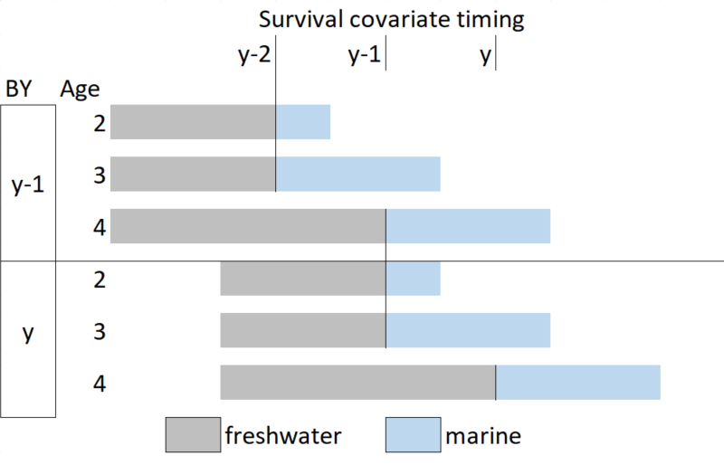

<!-- The following code should appear at the beginning of the first appendix.
After that, all subsequent sections will be turned into appendices. -->


# SamSim MODEL DOCUMENTATION {#app:third-appendix}

SamSim is the closed loop simulation model used for calculation of the projection based LRPs. A model overview and the code can be found in project [github page](https://github.com/Pacific-salmon-assess/samSim/tree/LRP). This appendix decribes the model equations relevant to the Interior Fraser coho salmon and West coast Vancouver Island chinook salmon study cases. The model indexes and quantities are defined in Table \@ref(tab:modvar) and input parameters used for the Interior Fraser Coho study case are listed in Table \@ref(tab:parval). Detailed definitions of the input data and parameters are provided in the project [README](https://github.com/Pacific-salmon-assess/samSim/tree/LRP#readme). 


\begin{table}[ht]
\caption{List of samSim model indexes and variables.}
\begin{tabular}{ll}
\hline
Notation & definition \\ 
\hline
$y$ & year \\ 
$j$ & age \\
$k$ & Conservation Unit (CU)\\
$S_{y,k}$ & Spawners \\
$RY_{y,k}$ & Calendar Year Recruits \\
$Ra_{y,k,j}$ & Age specific brood year Recruits \\
$RBY_{y,k}$ & Total brood year Recruits \\
$C_{y,k}$ & Catch \\
$ER_{y,k}$ & Exploitation rate \\
$\alpha_{k}$ & Ricker productivity parameter\\
$\beta_{k}$ & Ricker carrying capacity inverse\\ 
$\sigma_{k}$ & Recruitment model standard deviation\\
$w_{y,k}$ & Recruitment deviations\\
\hline
(\#tab:modvar)
\end{tabular}
\end{table}


\begin{table}[ht]
<!--
\caption{List of samSim model parameters and values used for the Interior Fraser study case.}
--> 
\begin{tabular}{l p{4cm} p{3cm} l}
\hline
Notation & definition & data input name & value \\ 
\hline
$\alpha_{k}$ & Ricker productivity parameter & alpha & mcmc sample\\
$\beta_{k}$ & Ricker carrying capacity inverse & beta & mcmc sample\\ 
$\sigma_{k}$ & Recruitment model standard deviation & alpha & mcmc sample\\
$\gamma_{k}$ & Recruitment model standard deviation & alpha & mcmc sample\\
$RSc$ & Scalar used to cap High recruitment values & CapScalar &3\\
$\rho$ & temporal autocorrealtion coefficient & rho & 0\\
\hline
\end{tabular}
(\#tab:parval)
\end{table}


### Data entry

Define data used in IF cohoPars is any of the data columns not defined?
Need to ask: where is the function that reads in the data. Maybe called by genericrecoverySim


### Model Priming

The proming phase, or model initialization, represents the past data for CUs being modeled. It is used to represent real and observed abundances before starting the simulation trials. This phase loops over a number of past years ('nPrime') and reconstructs recruitment time series for past years. The simulations can be initialized in two ways: with existing recruitment data or with user defined parameters, if recruitment data is not available. During the initialization phase three types of CU specific data tables are populated: Spawners ($S_{y,k}$), Recruits ($RBY_{y,k}$, Catch and Exploitation Rate.  

#### Available Recruitment Data

If spawner  ($RBY_{y,k}$recruitment data is avalable, the number of initialization years 'nPrime' is defined based on the length of the longest CU time series available. The Spawners, Recruits, Catch and Exploitation Rate objects are populated with the input data. If catch or expoitation rate data are not available, those values are set to zero.


#### No Recruitment Data

When Recruitment data is not available, the 'nPrime' is set to 10x the maximum age of recruits. The number of Spawners can be initialized by the user or otherwise is set at equilibrium for the first 6 years and then calculated based on recruitment in the previous years (equation \@ref(eq:Seqinit)). If the calculated number of spawners is lower than the user inputted extinction threshold (`extinctThresh`), then the number of spawners is set o zero. 

\begin{align}
  S_{y<=6,k} &= \frac{\alpha_{k}}{\beta_{k}} \\
  S_{y>6,k} &= RY_{y,k} \cdot (1- ER_{y,k})
  (\#eq:Seqinit)
\end{align}


Random variability is added to the proportions at age of the population following a multivariate logistic error structure (@schnute_influence_1995). The age structure error can vary or be held constant among CUs. 


Three versions of the recruitment curve are available: A simple Ricker curve (equation \@ref(eq:Rickersimple) with $\rho = 0$), Ricker curve with temporal autocorrelation in recruitment error (equation \@ref(eq:Rickersimple)), and Ricker curve with freshwater survival covariate (equation \@ref(eq:Rickersurv)). Recruitment error is assumed to be correlated among CUs for all versions of the Ricker curve.  Random recruitment deviates can be generated with multivariate t or multivariate normal distributions, that can be symmetric or skewed. The study cases used in this report all assume that recruitment deviates come from a symmetrical multivariate normal distribution (equation \@ref(eq:CUautocorr)). The parameters for the recruitment curve are unique for each CU and are specified by the user. Parameters can be fixed for all simulation trials or sampled from a posterior distribution. 

\begin{align}
  RBY_{y,k} &= S \cdot e^{\alpha{k} - \beta{k} \cdot S + w_{y,k} - \frac{sig_{k}^{2}}{2}}\\
  w_{y=1,k} &= 0 * \rho + v_{y,k} \\
  w_{y>1,k} &= w_{y-1,k} * \rho + v_{y,k} 
  (\#eq:Rickersimple)
\end{align}

\begin{align}
  Ra_{y,k,j} &= Propage_{j} \cdot S \cdot e^{\alpha{k} - \beta{k} \cdot S + \gamma_{k} \cdot Surv_{y,j} + w_{y,k} - \frac{\sigma_{k}^{2}}{2}}\\
  RBY_{y,k} &= \sum^{j}Ra_{y,k,j}
  (\#eq:Rickersurv)
\end{align}

\begin{equation}
  v_{y,k} \sim N(\mu=0,covMat)
  (\#eq:CUautocorr)
\end{equation}


For the Ricker model with the survival covariate, the covariates for each calendar year are generated following a normal distribution with user defined mean and variance (Equation \@ref(eq:survCY)). The brood year survival covariate is currently populated following the dominant life history types from Interior Fraser Coho. Fish with a 3-year life cycle differ from those with a 4-year life cycle in the number of years spent in freshwater as juveniles; both life cycles spend 18 months at sea before returning to spawn. Fish with a 2-year life cycle spend only 6 months at sea before returning as jacks. This life history results in the survival covariate being lagged by one year for ages 2 and 3 (Figure \@ref(fig:cohosurvivaldiagram) and Equation \@ref(eq:surv)). The exception is the first two years of the priming loop, when no lag is applied.
 
\begin{align}
  SurvCY_{y} &\sim N(\mu_{Surv},\sigma_{Surv})
  (\#eq:survCY)
\end{align}

\begin{align}
Surv_{y,j} = 
\begin{cases}
 SurvCY_{y-1} & \text{if } j\leq 3 \\
 SurvCY_{y} & \text{otherwise}
\end{cases}
 (\#eq:surv)
\end{align}


```{r cohosurvivaldiagram, fig.cap="Diagram of Interior Fraser coho dominant life history, gray indicates freshwater stages and blue indicates marine stage.", warning=FALSE, echo=FALSE, fig.align="center"}

```


Recruitment estimates produced for either formulation of the Ricker model are capped. The default cap is  $3 \cdot S_eq$, but the scalar can be modified by the user via the $RSc$ variable (Equation \@ref(eq:reccapscalar)). In addition, if the generated recruitment is lower than the user defined extinction threshold, then Recruitment is set to zero.  

\begin{align}
  S_{eq} &= \alpha_{k}/\beta_{k}\\
  RBY_{y,k} &= min(RBY_{y,k} , RSc \cdot \frac{\alpha_{k}}{\beta_{k}})
  (\#eq:reccapscalar)
\end{align}

#### Management benchmarks

In the priming loop, the management benchmarks are only calculated in the last two generations, i.e. if $y<nPrime-2*gen$. The management benchmarks are calculated according to three options: "stockRecruit", "percentile" and "habitat". For all three options, lower and upper benchmarks are calculated.

 If the "stockRecruit" option is used with the Ricker recruitment functions, then the lower benchmark is set to  $S_{gen}$ and the upper benchmark is set to 80\% of$S_{MSY}$. When the model with the survival covariate is used, the $\alpha$ parameter is modified to incorporate the survival component (Equation \@ref(eq:alphamb)). In order to keep the management benchmarks constant through time, the user inputted term $Survinit_{k}$ is used, which represents the long term average survival for the stock. $S_{MSY}$ is calculated following the explicit solution provided by @scheuerell_explicit_2016 (Equation  \@ref(eq:smsy)). $S_{gen}$ is estimated by solving (equation \@ref(eq:Sgen)) numerically, as described by @holt_indicators_2009. 


\begin{align}
{\alpha_{k}}^\prime &=
\begin{cases}
 \alpha_{k} + \gamma_{k}\cdot log(Survinit_{k}) & \text{ Ricker with survival} \\
  \alpha_{k}  & \text{Simple Ricker}
\end{cases}  
  (\#eq:alphamb)
\end{align}

\begin{align}
  Smsy_{k} &= (1 - lambertW(e^{1-\alpha_{k}}))/\beta_{k}
  (\#eq:smsy)
\end{align}

\begin{align}
  Smsy_{k} &= (1 - lambertW(e^{1-{\alpha_{k}}^\prime}))/\beta_{k}\\
  {\alpha_{k}}^\prime &= \alpha_{k} + \gamma_{k}\cdot log(Survinit_{k})
  (\#eq:smsy)
\end{align}


\begin{align}
  Smsy_{k} &= Sgen_{k} \cdot e^{\alpha_{k}\cdot (1-Sgen_{gen}/\beta_{k})} 
  (\#eq:Sgen)
\end{align}

If the "percentile" benchmark option is chosen, the upper benchmark is set to the 50th percentile of the historical Spawners ($S_{1:y,k}$). The lower benchmark is set to the 25th percentile $S_{1:y,k}$. 

If the "habitat" benchmark option is used, the lower benchmark is set to $S_{gen}$ and the upper benchmark is set to 80\% of$S_{MSY}$.

#### Infilling and Observation model

The last step of  the model priming is infilling. In this stage, any gaps in the last 12 years of the Spawners and Recruits time series are infilled with a geometric mean of the entire priming period.
In the priming phase, all observations are set equal to the true simulation values, i.e., no observation error is added. 


### Projections

The projection phase is the phase where all scenarios and management procedures are implemented. The following description follows the order of the code implementation, therefore the subheadings in this section could be seen as pseudo code. The projections run for each trial from year `nPrime + 1` to `nYears`, the latter being the number of projection years defined by the user. 

#### Population Dynamics submodel

##### Specify alpha

At this step the alpha parameter for each year is defined. Samsim offers the option of presenting trends in the productivity parameter, $\alpha$, if that is true, alpha for each CU is adjusted every year by applying a linear trend to the alpha value. The slope of this trend is defined by the input option `prodRegime`. A detailed description of the algorithm used to generate productivity trends is out of the scope of this report as the study cases do not include scenarios with productivity changes. As the productivity parameter is held constant throughout the projections, we will continue to use the time-invariant notation ($\alpha_{k}$) for the parameter in the sections to follow. 

##### Specify Management benchmarks

Once $\alpha_{k}$ is specified, the management benchmarks are set for the projection year. The management bechmarks can be re-estimated every year or set by the normative period, i.e., last year of the priming phase. The study cases in this report use the normative period management benchmarks.

*\textcolor{red}{CW: what happens if the habitat benchmarks are chosen? - onlu Smsy and sgen were specified here}*
 
#### Observation submodel - previous years of abundance


 In this step, observation error is added to numbers of spawners at age for each calendar year. Observed spawners at age for the past five calendar years is generated by multiplying the true number of returning spawners by a vector of proportions of returns at age with with multivariate logistic error
(@schnute_influence_1995). 
.Error is only added if the past five years do not include years in the prime period *\textcolor{red}{CW: need to check if this i correct}*

obsRecBY is then calculated based on the observed 
obsRecB hs no error added to it


#### Management submodel

In this step the population forecast is calculated by multiplying the observed return year recruits bt the forecast scaler, that can be either set to 1 for the perfect information scenario. Or y
#### Second Observation submodel
#### Assessment submodel
#### Population Dynamics submodel again
loop 3 starts at line 1232

Generic recovery simulator loop 3


