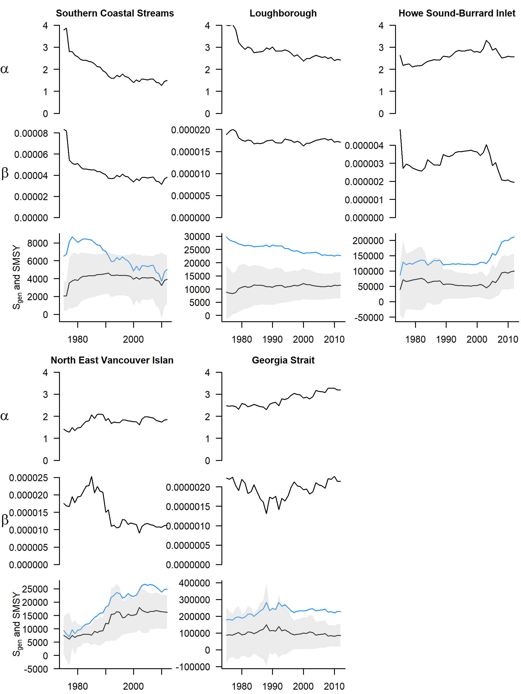

<!-- The following code should appear at the beginning of the first appendix.
After that, all subsequent sections will be turned into appendices. -->

# Retrospective analysis of CU benchmarks based on Sgen and percentiles *\textcolor{cyan}{LT: open to other name of this appendix*


In the retrospective analysis, the estimates of $\alpha$, $\beta$, and $S_{gen}$ changed as pregressively more years of data were included (Figures \@ref(fig:chum-a-b-SMSY-Sgen-retro)). Note that these are not estimates based on a model that accounts for time-varying paramters. Rather, the estimates of $\alpha$, $\beta$, and $S_{gen}$ in a given year come from fitting a Ricker model to spawners and recruits for all years up to and including that year, for each CU. Each subsequent year includes another year of data. Thus, as more data is included, the estimates of $\alpha$, $\beta$, and $S_{gen}$ may change. These results should be interpreted with caution due to the large residuals in observed vs. predicted recruits. Since $\alpha$ and $\beta$ are correlated, the meaning of any trends in one parameter should be interpreted with the other parameter in mind, escpecially when model fits have large residuals. Similarly, since $\alpha$ and  $\beta$ determine $S_{MSY}$ and $S_{gen}$, changes in these derived parameters can be challenging to interpret and can be due to changes in $\alpha$,  $\beta$, and their relative values.

```{r chum-a-b-SMSY-Sgen-retro, fig.cap="Retrospective estimates of $\\alpha$, $\\beta$, $S_{gen}$ (black line with gray confidence intervals) and $S_{MSY}$ (blue line) for five CUs in the Inside South Coast Chum SMU. Note y axis is identical across CUs for $\\alpha$ but varies for other parameters.", warning=FALSE, echo=FALSE, fig.align="center"}
download.file('https://github.com/Pacific-salmon-assess/SalmonLRP_RetroEval/raw/master/SCChumStudy/Figures/fig_a_b_SMSY_Sgen_retro.png', './figure/chum-a-b-SMSY-Sgen-retro.png',  mode="wb")

```

Retrospective estimates of $\alpha$ and $\beta$ for Southern Coastal Streams show declines over time. $S_{MSY}$ and $S_{gen}$ increase sharply in the first few years due to large decreases in $\alpha$ and $\beta$. $S_{MSY}$ then decreases over time, while $S_{gen}$ stays relatively stable. This is because as $\alpha$ decreases below ~2.5, $S_{gen}$ decreases, but as $\beta$ decreases, $S_{gen}$ decreases, so that a simultaneous decrease in $\alpha$ and $\beta$ can cancel out. However, the lower alpha is below 2.5, the less influence $\beta$ has on $S_{gen}$. *\textcolor{cyan}{This is from my work on sensitivity of Sgen and SMSY to alpha and beta. Not sure if we can include here}*

Increasing $S_{gen}$ for North East Vancouver Island is mainly due to an increase in $\alpha$ from <1.5 to >2 and then a decrease in $\beta$. 

$\alpha$ for Loughborough showed modest decreases over time, and $S_{gen}$ was fairly stable. 

The Georgia Strait CU shows evidence of increasing $\alpha$, and its $S_{gen}$ estimate was fairly stable. 

Howe Sound-Burrard Inlet $S_{gen}$ was fairly stable, and then increased due to  decreases in $\alpha$ and $\beta$. 


```{r chum-perc-retro, fig.cap="Escapement with 25th and 50th percentile benchmarks shown by gray and black dotted lines, respectively. Benchmarks are calculated using escapements up to the given year. Values following the CU names indicate the appropriate percentile benchmark. Green and red points indicate status above or below benchmark, respectively. Transparent points are years with CU-level infilling.", warning=FALSE, echo=FALSE, fig.align="center"}
download.file('https://github.com/Pacific-salmon-assess/SalmonLRP_RetroEval/raw/master/SCChumStudy/Figures/fig_perc_benchmarks_annual_retro.png', './figure/chum-perc-retro.png', mode="wb")
knitr::include_graphics('figure/chum-perc-retro.png')
```

