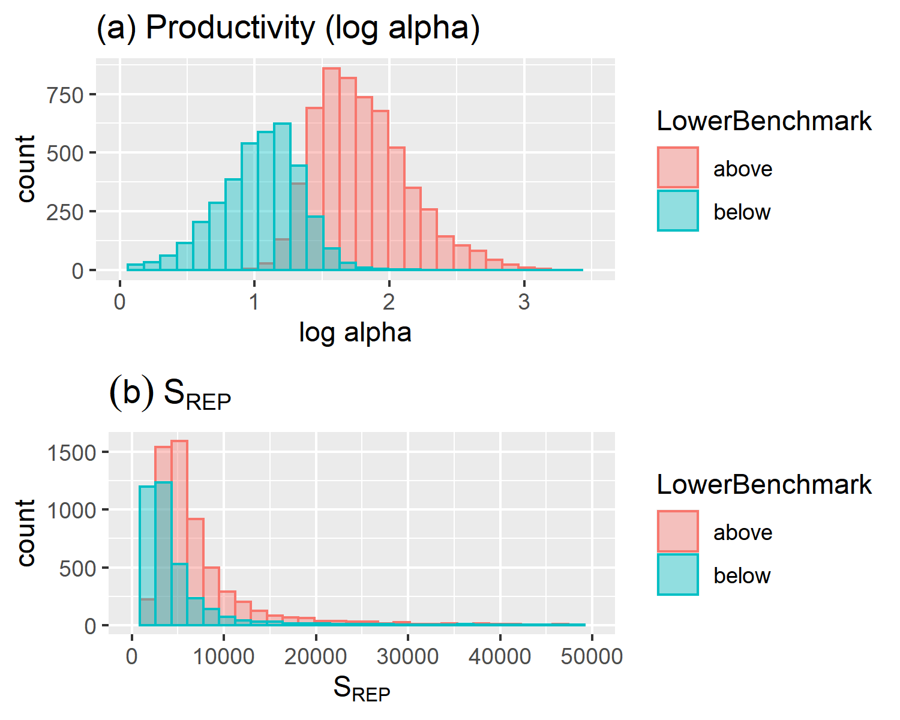
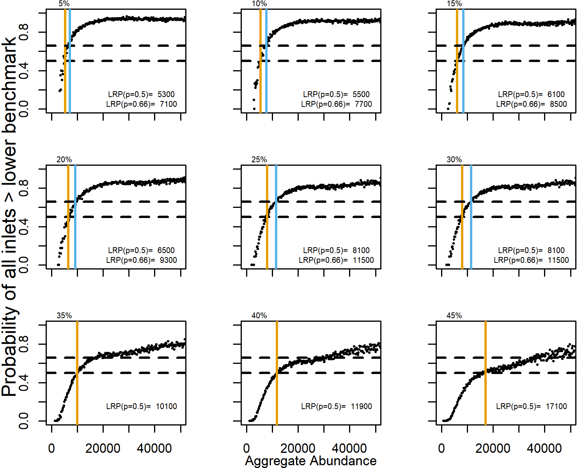
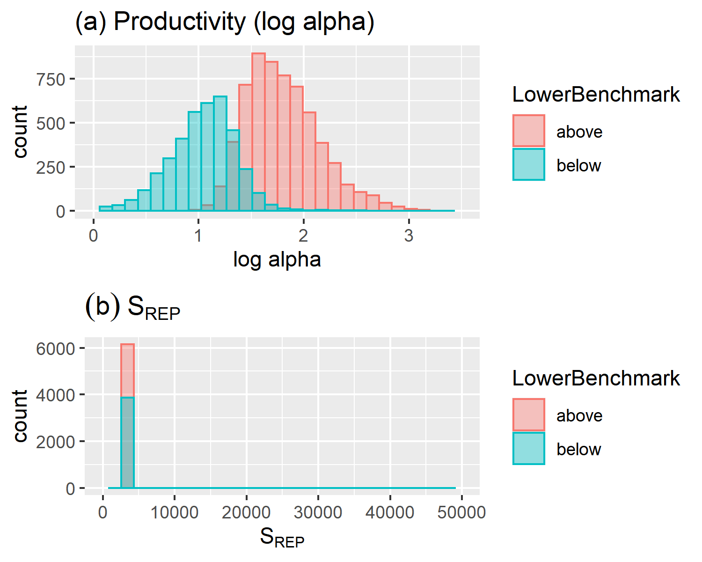

---
output:
  word_document: default
  html_document: default
---

# Sensitivity of Projection-Based LRPs to Exploitation Rates 


To explain the initially counter-intuitive result of sensitivity of projection based LRPs to exploitation rates, we ran an additional analysis where the spawner-recruitment parameters, productivity (log($alpha$)) and spawners at replacement, $S_{REP}$ (log($alpha$)/$beta$) were either varied or kept constant over inlets and Monte Carlo trials. 

Specifically, we evaluated the sensitivity of aggregate projection-based LRPs to exploitation rates under three alternative scenarios:

1. All inlets were assumed to have stock-recruitment parameters drawn from the same distributions (the mean and standard deviation for productivity and $S_{REP}$ as estimated for Quatsino, Westcoast Vancouver Island) but a unique set of stock-recruitment parameters was drawn for each inlet and trial (i.e. each inlet was a replicate of each other with random variability). We choose to draw $S_{REP}$ from a random distributions instead of Ricker $beta$ or $S_{MAX}$ (1/$beta$) because the $S_{REP}$ parameter was drawn randomly in projections for this case study from the watershed-area model. However, in preliminary sensitivity analyses, we sampled from a random distribution of $beta$ values and found similar results. We assumed strong positive covariation in recruitment residuals among inlets with pairwise correlations equal to 0.7. <!--CH: plot distributions of prod and SREP-->

2. The productivity parameter was fixed at the mean value of the assumed distribution for all inlets and trials. $S_{REP}$ was drawn from its distribution and allowed to vary across inlets and trials. The same distribution of $S_{REP}$ was used across inlets and trials, as in Scenario 1. <!-- across trials AND inlets-->


3. $S_{REP}$ was fixed at the mean value of the distribution across inlets and across trials. The productivity parameter was drawn from the distribution and allowed to vary across inlets and trials. The same distribution of productivity was used across inlets and trials, as in Scenario 1.<!-- across trials AND inlets-->


We found that the sensitivity of projection-based LRPs to exploitation rates was due to variability in productivity and to a lesser extent $S_{REP}$ among inlets. In Scenario 1, productivity and $S_{REP}$ tended to be lower for random trials and inlets that dropped below the lower benchmark in at least one year. Random trials and inlets with abundances that remained above the lower benchmark over the time-series tended to be more productive and slightly larger (Fig. \@ref(fig:chinook-SRHistEven)). 


```{r chinook-SRHistEven, fig.cap="Distribution of (a) productivity (log alpha) and (b) spawners at replacement, SREP among MC trials, coloured by whether abundances in that trial remained above the lower benchmark (red) or not (blue), under a 45\\% exploitation. Productivity and SREP varied among inlets and trials and were drawn from common distributions. ", fig.align="center"}

download.file('https://github.com/Pacific-salmon-assess/SalmonLRP_RetroEval/raw/master/WCVIChinookStudy/Figures/evenhCor-SRHist.png', './figure/evenhCor-SRHist.png',  mode="wb")


# knitr::include_graphics("C:/github/SalmonLRP_RetroEval/WCVIChinookStudy/Figures/evenhCor-SRHist.png")

```

\linebreak

Inlets and Monte Carlo trials with low productivity tended to have relatively high $S_{gen}$ (lower benchmark) values (as described in @holtCautionsUsingPercentilebased2015), and therefore a higher frequency of dropping below the lower benchmark. This variability in productivity among inlets was associated with projection-based LRPs that were sensitive to exploitation rates (Fig. \@ref(fig:chinook-ProjLRPs-Even)).


```{r chinook-ProjLRPs-Even, fig.cap="Probability of all inlets being above their lower benchmark along a gradient in aggregate abundances within bins of 200 fish, derived from projections over 30 years and 10,000 MC Trials, under a range of average exploitation rates from 5-45\\%, assuming productivity and SREP varied across inlets and trials, and are drawn from common distributions. Horizontal dashed lines at 50\\% and 66\\% represent equal and likely probabilities of all inlets being above lower benchmarks. Orange and pale green vertical lines are the LRPs associated with 50\\% and 66\\% probability of all inlets being above their lower benchmarks, respectively. LRPs at 66\\% probability are not shown for exploitation rates greater than 30\\% because of large uncertainty in projections at high aggregate abundances.", fig.align="center"}

download.file('https://github.com/Pacific-salmon-assess/SalmonLRP_RetroEval/raw/master/WCVIChinookStudy/Figures/ProjectedLRPs/ERsEven-hCor-ProjLRPCurve-ALLp.png', './figure/ERsEven-hCor-ProjLRPCurve-ALLp.png',  mode="wb")



# knitr::include_graphics("C:/github/SalmonLRP_RetroEval/WCVIChinookStudy/Figures/ProjectedLRPs/ERsEven_hCor-ProjLRPCurve-ALLp.png")

```

\linebreak

When productivity was fixed at the mean value among random trials and inlets in Scenario 2, the distribution of spawner-recruitment parameters for trials in which abundances dropped below the lower benchmark was the same or similar for trials that remained above it, and the LRP was insensitive to exploitation rate (Fig. \@ref(fig:chinook-SRHistSameProd) and \@ref(fig:chinook-ProjLRPs-SameProd)).


```{r chinook-SRHistSameProd, fig.cap="Distribution of (a) productivity (log alpha) and (b) spawners at replacement, SREP among MC trials, coloured by whether abundances in that trial remained above the lower benchmark (red) or not (blue), under a 45\\% exploitation and constant productivity among inlets and trials. SREP was drawn from a common distribution across inlets and trials. ", fig.align="center"}

download.file('https://github.com/Pacific-salmon-assess/SalmonLRP_RetroEval/raw/master/WCVIChinookStudy/Figures/sameProdhCor-SRHist.png', './figure/sameProdhCor-SRHist.png', mode="wb")


# knitr::include_graphics("C:/github/SalmonLRP_RetroEval/WCVIChinookStudy/Figures/sameProdhCor_SRHist.png")

```

```{r chinook-ProjLRPs-SameProd, fig.cap="Probability of all inlets being above their lower benchmark along a gradient in aggregate abundances within bins of 200 fish, derived from projections over 30 years and 10,000 MC Trials, under a range of average exploitation rates from 5-45\\% (across 9 panels), assuming the same productivity for each inlet and trial and an SREP that varied across inlets and trials, drawn from a common disribution. Horizontal dashed lines at 50\\% and 66\\% represent equal and likely probabilities of all inlets being above lower benchmarks. Orange and pale green vertical lines are the LRPs associated with 50\\% and 66\\% probability of all inlets being above their lower benchmarks, but are indistinguishably here. ", fig.align="center"}

download.file('https://github.com/Pacific-salmon-assess/SalmonLRP_RetroEval/raw/master/WCVIChinookStudy/Figures/ProjectedLRPs/ERsSameProd-hCor-ProjLRPCurve-ALLp.png', './figure/ERsSameProd-hCor-ProjLRPCurve-ALLp.png', mode="wb")


# knitr::include_graphics("C:/github/SalmonLRP_RetroEval/WCVIChinookStudy/Figures/ProjectedLRPs/ERsSameProd_hCor-ProjLRPCurve-ALLp.png")

```


\linebreak

When $S_{REP}$ was fixed at the mean value among inlets and random trials in Scenario 3, productivity was higher for inlets and trials that remained above the benchmarks compared to those that dropped below them, though the overlap in the distributions above and below the lower benchmarks was slightly greater than when both $S_{REP}$ and productivity varied (Scenario 1). The LRP varied with exploitation rates but to a lesser extent than when both productivity and $S_{REP}$ varied (Fig.  \@ref(fig:chinook-SRHistSameSREP) and \@ref(fig:chinook-ProjLRPs-SameSREP)).


```{r chinook-SRHistSameSREP, fig.cap="Distribution of (a) productivity (log alpha) and (b) spawners at replacement, SREP among MC trials, coloured by whether abundances in that trial remained above the lower benchmark (red) or not (blue), under a 45\\% exploitation and constant SREP among inlets and trials. Productivity was drawn from a common distribution across inlets and trials. ", fig.align="center"}

download.file('https://github.com/Pacific-salmon-assess/SalmonLRP_RetroEval/raw/master/WCVIChinookStudy/Figures/sameSREPhCor-SRHist.png', './figure/sameSREPhCor-SRHist.png', mode="wb")


# knitr::include_graphics("C:/github/SalmonLRP_RetroEval/WCVIChinookStudy/Figures/sameSREPhCor_SRHist.png")

```


```{r chinook-ProjLRPs-SameSREP, fig.cap="Probability of all inlets being above their lower benchmark along a gradient in aggregate abundances within bins of 200 fish, derived from projections over 30 years and 10,000 MC Trials, under a range of average exploitation rates from 5-45\\% (across 9 panels), assuming the same SREP for each inlet and trial, and productivity that varied across inlets and trials, drawn from a common disribution. Horizontal dashed lines at 50\\% and 66\\% represent equal and likely probabilities of all inlets being above lower benchmarks. Orange and pale green vertical lines are the LRPs associated with 50\\% and 66\\% probability of all inlets being above their lower benchmarks, respectively. ", fig.align="center"}

download.file('https://github.com/Pacific-salmon-assess/SalmonLRP_RetroEval/raw/master/WCVIChinookStudy/Figures/ProjectedLRPs/ERsSameSREP-hCor-ProjLRPCurve-ALLp.png', './figure/ERsSameSREP-hCor-ProjLRPCurve-ALLp.png', mode="wb")


# knitr::include_graphics("C:/github/SalmonLRP_RetroEval/WCVIChinookStudy/Figures/ProjectedLRPs/ERsSameSREP_hCor-ProjLRPCurve-ALLp.png")
```

\linebreak

Based on these sensitivity analyses, we conclude that variability in productivity among inlets results in inlet-specific variability in sensitivity to exploitation rates. Inlets with relatively low productivity fall below lower benchmarks more frequently. This effect is accentuated when exploitation rates are high resulting in divergences in status among inlets and a higher aggregate abundances required for all inlets to be above their lower benchmarks (i.e., higher LRP).

