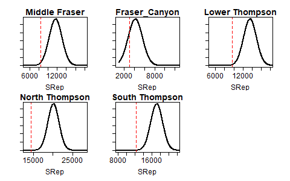

<!-- The following code should appear at the beginning of the first appendix.
After that, all subsequent sections will be turned into appendices. -->


# Interior Fraser Coho Model Fits {#app:coho-appendix}


```{r coho-SrepPrior, fig.cap="Prior distribution of SRep used when fitting the Ricker\\_priorCap model.The red dashed line shows the maximum likelihood estimate of SRep from the base Ricker model stock recruitment fit. The mean of the SRep prior was set to 1.35 times the maximum likelihood estimate", warning=FALSE, echo=FALSE, out.width = '80%',  fig.align="center"}

```


To Do: improve table formatting; can I make font arial?

```{r coho-postSummary-Ricker, warning=FALSE, echo=FALSE}

dat <- as.data.frame(read.csv("data/coho-postSummary-Ricker.csv"))
csasdown::csas_table(dat, booktabs = T, caption = "Summary of posterior distribution mean and quantiles (5%, 50%, and 95%) for stock recruit model parameters and Sgen lower benchmark from the Ricker model fit.")
 
```


```{r coho-postSummary-RickerCap, warning=FALSE, echo=FALSE}

dat <- as.data.frame(read.csv("data/coho-postSummary-RickerCap.csv"))
csasdown::csas_table(dat, booktabs = T, caption = "Summary of posterior distribution mean and quantiles (5%, 50%, and 95%) for stock recruit model parameters and Sgen lower benchmark from the Ricker\\_prioCap model fit.")
 
```
