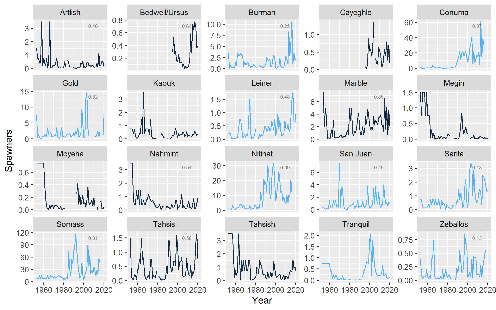
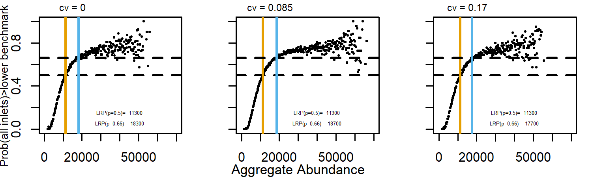
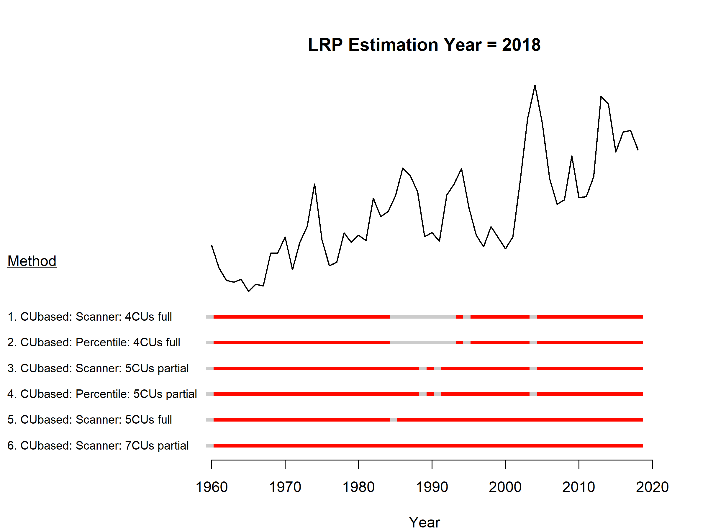
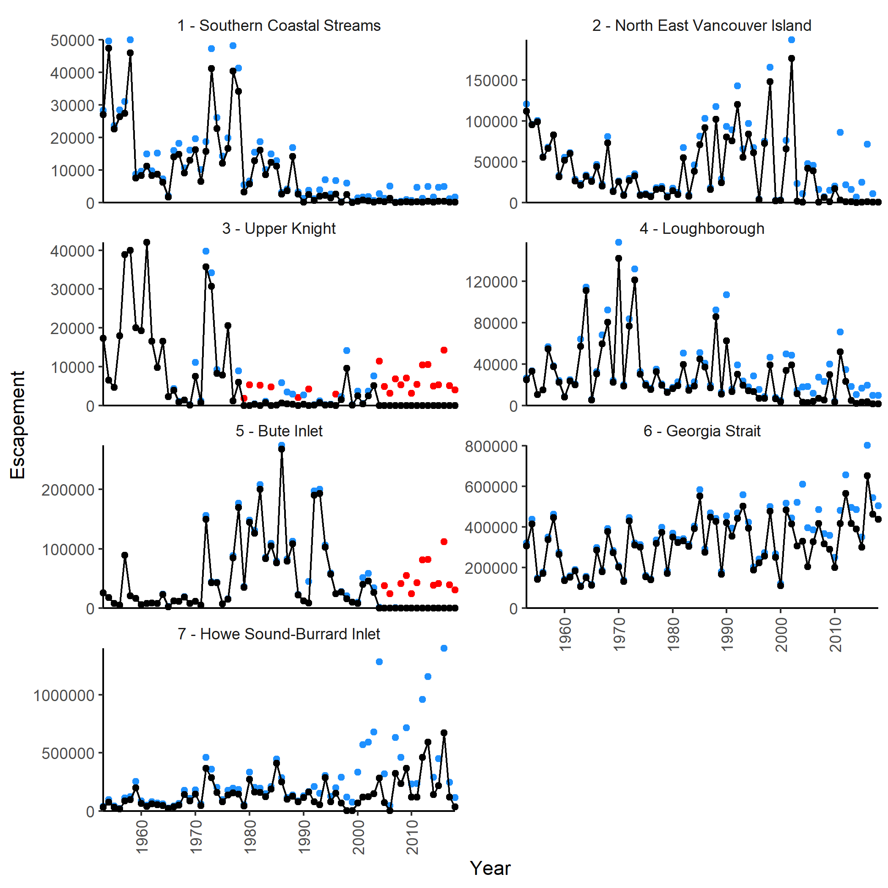

```{r setup, echo=FALSE, cache=FALSE, message=FALSE, results='hide', warning=FALSE}
library(knitr)
if (is_latex_output()) {
  knitr_figs_dir <- "knitr-figs-pdf/"
  knitr_cache_dir <- "knitr-cache-pdf/"
  fig_out_type <- "png"
} else {
  knitr_figs_dir <- "knitr-figs-docx/"
  knitr_cache_dir <- "knitr-cache-docx/"
  fig_out_type <- "png"
}
fig_asp <- 0.618
fig_width <- 9
fig_out_width <- "6in"
fig_dpi <- 180
fig_align <- "center"
fig_pos <- "htb"
opts_chunk$set(
  collapse = TRUE,
  warning = FALSE,
  message = FALSE,
  comment = "#>",
  fig.path = knitr_figs_dir,
  cache.path = knitr_cache_dir,
  fig.asp = fig_asp,
  fig.width = fig_width,
  out.width = fig_out_width,
  echo = FALSE,
  #  autodep = TRUE,
  #  cache = TRUE,
  cache.comments = FALSE,
  dev = fig_out_type,
  dpi = fig_dpi,
  fig.align = fig_align,
  fig.pos = fig_pos
)
options(xtable.comment = FALSE)
options(kableExtra.latex.load_packages = FALSE)
```

```{r load-libraries, cache=FALSE}
# `french` and `prepub` variables are extracted from the YAML headers above and
#  are used throughout the document. To make the document all in french, change
#  the line in the YAML header above to `french: true`
meta <- rmarkdown::metadata$output
if(length(grep("pdf", names(meta)))){
  french <- meta$`csasdown::resdoc_pdf`$french
  prepub <- meta$`csasdown::resdoc_pdf`$prepub
}else if(length(grep("word", names(meta)))){
  french <- meta$`csasdown::resdoc_word`$french
  prepub <- meta$`csasdown::resdoc_word`$prepub
}
csl <- "csl/csas.csl"
if(french){
  csl <- "csl/csas-french.csl"
  options(OutDec =  ",")
}

# add other packages here:
library(dplyr)
library(readr)
library(tibble)
library(csasdown)
library(kableExtra)
library(ggplot2)
library(viridis)
library(tidyr)
```

---
csl: `r csl`    
---

<!--chapter:end:index.Rmd-->

# INTRODUCTION

-	This document supports the development of guidelines for defining LRPs for Pacific Salmon, as required by the recently revised Fisheries Act.  Guidelines that have been informed by this work are available in the companion working paper “Guidelines for Defining Limit Reference Points for Pacific Salmon Stock Management Units”.     

-	Under the New Fisheries Act, Limit Reference Points (LRPs) that represent the level below which serious harm is occurring will be required for major fish stocks prescribed in regulation.  For Pacific salmon, it is anticipated there could be > 65 major fish stocks (or stock management units, SMUs), where the proposed functional definition of a SMU is a group of one or more Wild Salmon Policy Conservation Units (CUs) that are managed together with the objective of achieving a joint status.  

-	While lower biological benchmarks under the Wild Salmon Policy delineate abundances below which CUs are considered at risk of extinction (DFO 2005), these benchmarks have not been identified for many data-limited CUs and have not been aggregated to the SMU level, representing significant gaps in our ability to develop LRPs under the Fisheries Act.

-	The suite of LRP estimation methods considered in this paper are specific to the case where a LRP is defined as a single aggregate abundance that is associated with a high probability of all component CUs being above lower benchmarks that are consistent with the WSP.  Alternative approaches to identifying LRPs are discussed in t

-	The overall goal of this working paper is demonstrate and evaluate LRPs for 3 case study stock management units. For each case study, the set of LRP estimation methods considered is a function of available data and previously developed assessment methods for the SMU.

-	In retrospective analyses, our objective is to demonstrate the sensitivity of the LRP to the removal of years or CUs to inform guidance about minimum numbers of years or CUs

-	In simulation  evaluation, our objectives are to:
    i. Identify the bias in LRP estimates by comparing LRP estimated from observed data to “true” LRP estimated from “true” population dynamics (without observation error)
    i. How robust are LRPs to different underlying scenarios (model formulations, covariance in CU dynamics, observation errors, time varying productivity and capacity)?
    i.  How does LRP (and 95% CIs) vary with the number of years and proportion of CUs (and trade-offs), relative to the “true” LRP that includes all years and data?

-	Estimates presented in this paper are not meant to be definitive LRPs, which require more thorough review of data and their use here with local analysts and partners. These case studies demonstrate various approaches for developing LRPs.

<!--chapter:end:01-chap1.Rmd-->

---
output:
  pdf_document: default
  html_document: default
---
# LRP ESTIMATION METHODS

In this section, we provide an overview of methods used to develop LRPs for our three case studies. Detailed methods specific to each case study are provided in Sections 3 (Interior Fraser Coho), 4 (WCVI Chinook), and 5 (South Coast Chum, excluding Fraser). 

All LRP estimation methods first require the status of individual CUs with with an SMU to be assessed as being above or below a lower benchmark. The distribution of CU-level status estimates within a CU is then used as a basis for defining an LRP.

Under Canada's Wild Salmon Policy (WSP), the lower benchmark is defined as a level of abundance high enough to ensure there is a substantial buffer between it and any level of abundance that could lead to a CU being considered at risk of extinction.  A variety of methods are available for estimating lower benchmarks depending on species and data availability (citation needed).  A more thorough discussion of available benchmarks, as well as how these relate to WSP Integrated Status Assessments, is provided in the companion working paper *Guidelines for Defining Limit Reference Points for Pacific Salmon Stock Management Units* (Holt et al. in review).


## PROPORTION-BASED LRPS

A proportion-based LRP is simply the proportion of CUs required to be above CU-level lower benchmarks. For example, the LRP could be set at "100% of CUs with abundance > lower benchmark". In this case, the LRP would be breached anytime a single CU dropped below its lower benchmark. Guidance on how to select the required proportion, including when it may be appropriate to consider proportions < 100%, is provided in the companion working paper *Guidelines for Defining Limit Reference Points for Pacific Salmon Stock Management Units* (Holt et al. in review). We consider two types of proportion-based LRPs in our case studies. The first is based on the proportion of CUs with abundance above abundance-based lower benchmarks, while the second is based on the proportion of CUs for which a multidimensional synoptic status assessment indicates that status is in either the amber or green Wild Salmon Policy status zones.         

### Proportion of CUs above abundance-based lower benchmarks

For SMUs in which CU-level abundance relative to abundance-based lower benchmarks is assessed annually, LRPs can be set at the required proportion of CUs with abundance above their abundance-based lower benchmarks. 


### Proportion of CUs with multidimensional status > lower benchmark 

Canada's Policy for Conservation of Wild Pacific Salmon (Wild Salmon Policy, WSP) sets out requirements for the assessment of status of salmon CUs (@canada_canadas_2005). Peer-reviewed, integrated status assessments require large amounts of time and work. The State of the Salmon program (Fisheries and Oceans Canada) is developing a method of assessing the status of CUs more rapidly (@pestal_algorithms_2021, in prep). Using the inputs and outcomes of status assessments for Fraser River sockeye, Interior Fraser coho, and Southern BC Chinook (**REF**), this method uses Classification and Regression Tree (CART) analyses to create algorithms that approximate the status of the integrated assessments. Essentially, it uses a decision tree to evaluate status based on data type, quality, abundance, and trends to assign a status to CUs (e.g., Figure \@ref(fig:decision-tree)). An expert review of these statuses is an intentional part of the process. When using this method in the case study, we took the outputs of the algorithms at face value and did not confirm using expert opinion. 


```{r decision-tree, fig.cap="Decision tree to assess status of Conservation Units based on the Wild Salmon Policy, under development by State of the Salmon Program", warning=FALSE, echo=FALSE, fig.align="center"}
source("R/make_tree_diagram.R")
knitr::include_graphics("figure/decision_tree.png")
```


## AGGREGATE ABUNDANCE-BASED LRPS

Aggregate abundance-based LRPs represent the SMU-level abundance at which there is a sufficiently high probability that a required proportion of CUs will be above their individual benchmarks.  

- To add: we default to requirement of all CUs > benchamrks for case studies, but cases where the proportion may be < 1 are discussed in guidelines paper
 - To add: probability thresholds considered in case studies: 0.50, 0.66, 0.90, 0.99 based on IPCC. We focus on 0.50 for sensitivity analyses, but show sensitivity to other values.
 
We consider two types of aggregate abundance-based LRPs in our case studies: Logistic regression LRPs and Projected LRPs.

### Logistic regression LRPs

*Question: I am suggesting that we call these "Logistic Regression LRPs" instead of "Empirical LRPs". This is because if we end up using simple proportions of CUs > lower benchmarks as a LRP, these will also be empirical. What do others think?  Other ideas??* *\textcolor{cyan}{LW: I like Logistic Regression LRPs, it's intuitive. Another option could be Aggregate LRPs?}*

Logistic regression LRPs are derived from an empirically estimated relationship between CU-level status and aggregate SMU abundance. Using this approach, the LRP represents the aggregate abundance that has historically been associated with a pre-specified probability of a required proportion of CUs being above their lower benchmarks. In all three case studies, we assume that all CUs are required to be above their lower benchmarks (i.e., proportion = 100%). For each year of observed data, CU-level status is quantified as a Bernoulli variable: 1 (success) = all CUs have spawner abundance greater than their lower benchmark, $S_i > LBM_i$, and 0 (failure) = all CUs did not have $S_i > LBM_i$. A logistic regression is then fit to predict the probability that all CUs will have $S_i > LBM_i$ as a function of aggregate spawner abundance to the SMU using the logistic regression equation:

\begin{equation}
  \log(\frac{p}{1-p}) = B_0 + B_1 \sum_{i}^{i=nCUs} S_{i,t}
   (\#eq:logistic)
\end{equation}

where, $p$ is probability, $B_0$ and $B_1$ are estimated logistic regression parameters and $S_{i,t}$ is spawner abundance to CU $i$ in year $t$. Equation \@ref(eq:logistic) is then re-arranged calculate the LRP as the aggregate spawner abundance associated with the pre-specified probability threshold of $p^*$,

\begin{equation}
  LRP = \frac{log(\frac{p^*}{1-p^*}) - B_0}{B_1}
  (\#eq:logisticLRP)
\end{equation}

An example logistic regression fit is shown in Figure x. We show the estimation of LRPs based on this fit for two possible probability thresholds: $p^*$ = 50% and $p^*$ = 90%. LRP estimates for these two thresholds represent the aggregate abundance that is associated with a 50%, or 95%, probability of all CUs having $S_i > LBM_i$. Alternative $p^*$ values are presented in case-study applications below.

We initially considered an alternative approach to logistic regression in which the LRP represents the aggregate abundance that has historically been associated with a pre-specified *proportion* of CUs being above their lower benchmark ($S_i > LBM_i$, where i = a CU). Using this approach, CU-level status was quantified as the number or CUs with $S_i > LBM_i$ for each year of observed data.  A logistic regression was then fit to predict the proportion of CUs with $S_i > LBM_i$ as a function of aggregate spawner abundance to the SMU (i.e., abundance from nCUs combined). We do not show present this method for our case studies however due to inherent limitations when the required proportion of CUs above their lower benchmarks is 100%. Equation \@ref(eq:logisticLRP) cannot be solved directly for a threshold proportion of $p^*$ = 100%, and LRP estimates were highly sensitive to the choice of $p^*$ value used as a proxy. Using $p^*$ = 99% vs. $p^*$ = 99.9% vs. $p^*$ = 99.99% gave very different LRP estimates. 


#### LOGISTIC REGRESSION MODEL DIAGNOSTICS

*To be added by Carrie*


### PROJECTION-BASED LRPS

Projected LRPs are estimated using stochastic projections of future stock size for individual CUs. Projected abundances are then used to characterize the implicit relationship between aggregate spawner abundance for the SMU and the probability that the required proportion of CUs will be above their individual lower abundance benchmarks (e.g. Sgen). 

* To add: dependent on ER

We used the samSim modelling tool to conduct stochastic projections for our case study applications. samSim is an R package that was developed to quantify recovery potential for Pacific salmon populations (Holt et al. 2020; Freshwater et al. 2020). The code for samSim is available on GitHub: https://github.com/Pacific-salmon-assess/samSim.  We created a modified version of samSim to support LRP estimation, which is also available on GitHub: https://github.com/Pacific-salmon-assess/samSim/tree/LRP  

Updated functionality for the LRP version of samSim include:

* The option to sample stock recruitment parameter sets directly from an estimated Bayesian joint posterior distribution.
* The addition of a stock recruitment function that includes an environmental co-variate, as well as specification of future variability in the environmental co-variate (required for Interior Fraser Coho case study; see Section x.x for equations).
* The option to initialize population dynamics for individual CUs at unfished equilibrium when no historical recruitment data are available. While this option would not be appropriate for projections aimed at estimating recovery from a current state, it can be used to estimate projection-based LRPs because we are only interested in the underlying relationship between aggregate abundance and the probability individual CUs will be above their lower benchmark.
* The option to include a log-normal bias-correction factor of $-\sigma^2 / 2$ to recruitment projected using one of the two available Ricker stock recruit models. This option was added to accommodate cases in which samSim is parameterized using stock recruitment parameters that have been corrected for log-normal bias to represent expected (mean) parameters. The log-nomral bias correction is commonly applied in stock recruit modelling because the expected value of *e*^$\sigma$ is *e*^$\sigma^2 / 2$} rather than zero when recruitment deviations are normally distributed (Cox et al. 2011, 2019a, 2019b; Grandin and Forrest 2017; Ohlberger et al. 2019; Olmos et al. 2019; Forrest et al. 2020, Weir et al., in press). When input parameters have been corrected for this log-normal bias, the bias correction must also be added to projections.
* Specification of variability in exploitation rates as a function of both variability among years and variability among CUs, such that:

\begin{equation}
  ER_{i,t} \sim \text{Beta}(c1_{i,t}, c2_{i,t})
  (\#eq:ER1)
\end{equation}

where, $ER_{i,t}$ is the exploitation rate applied to CU $i$ in year $t$ and $c1_{i,t}$ and $c2_{i,t}$ are shape parameters for the beta distribution that correspond with a mean CU-specific exploitation rate of $ER_{\bar{i}}$ and a standard deviation of $\sigma_{ER_{year}}$.  For each CU $i$, $ER_{\bar{i}}$ is drawn from a beta distribution with shape parameters $c3_{i}$ and $c4_{i}$ that correspond to a mean exploitation rate of $\mu_{ER_{i}}$ and a standard deviation of $\sigma_{ER_{amongCU}}$.  

\begin{equation}
 /ER_{\bar{i}} \sim \text{Beta}(c3_{i}, c4_{i})
(\#eq:ER2)
\end{equation}


For our two case study applications of samSim (Interior Fraser Coho and WCVI Chinook), we incorporated uncertainty into projected CU dynamics through the specification of empirically-derived probability distributions for key biological and management parameters, including stock-recruitment parameters, age-at-maturity, and exploitation rates.

Larger structural uncertainties in model formulation were represented through the use of sensitivity analyses and / or alternative operating models (OMs).    

with each OM intended to represent a plausible hypothesis about future stock dynamics. The selection of relevant OMs to be considered varied among case studies based on available data and knowledge.  

Multiple sets of projections were undertaken for each OM; each with a different fixed exploitation rate strategy applied (including a no fishing strategy). This approach provided good contrast in projected dynamics over all scenarios ....   

Observation error was not incorporated into forward projections because we ......


stochastic projections  under a range of levels of exploitation to establish an underlyning relationship between aggregate SMU-level a   


Original outline:
 
-	Description of projected LRP approach. This approach is described in more detail in the Working Paper, “Guidelines for Defining Limit Reference Points for Pacific Salmon Stock Management Units”

-	Reference to previously published samSim reports / papers, as well as GitHub repo with updated code

-	Develop LRPs from projections at specific proportions instead of logistic regression

-	Note that all abundance-based WSP benchmarks can all be used as a basis for defining prospective LRPs


<!--chapter:end:02-chap2.Rmd-->

# CASE STUDY 1: INTERIOR FRASER COHO SALMON

## CONTEXT

The Interior Fraser Coho Salmon Stock Management Unit (SMU) includes Coho Salmon that return to the Fraser River and tributaries upstream of Hell’s Gate in the Fraser Canyon. Like most coho salmon, IF Coho spend at least one full year in freshwater as fry before migrating to the ocean as smolts [@arbeider_interior_2020]. During their freshwater fry residence, IF coho are believed to migrate away from spawning sites and into small tributaries and off-channel habitat. Most (88%) IFC have a 3-year life cycle, in which they leave freshwater in their second year and spend 18 months at sea prior to returning to their natal system to spawn.The remaining 12% have a 4-year life cycle in which they spend an additional year in freshwater before migrating as smolts in their third year. Both 3-year and 4-year life cycles spend 18 months at sea. Less than 1% of IF Coho are believed to return as jacks (precocious mature males that spend only 6 months as sea) or at ages older than 4 years [@arbeider_interior_2020].

Five WSP Conservation Units (CUs) have been identified for of Interior Fraser Coho based on genetics and geographic separation: Middle Fraser, Fraser Canyon, Lower Thompson, North Thompson, and South Thompson [@dfo_wild_2015; Figure \@ref(fig:coho-map)]. Previous work by the Interior Fraser Coho Recovery Team also identified 11 subpopulations nested within the five CUs, and developed recovery objectives based on maintaining abundance in each of these smaller subpopulation units [@ifcrt_interior_fraser_coho_recovery_team_conservation_2006; Table \@ref(tab:cohoCU2SP)]. The delineation of subpopulations was based on several factors, including the presence of natural barriers, the influence of large lakes on downstream discharge and thermal regimes, observations of spawner aggregations under differing discharge conditions, and genetic evidence. The 11 subpopulations are described in detail by the @ifcrt_interior_fraser_coho_recovery_team_conservation_2006. The Fraser Canyon CU is the only CU with a single subpopulation; this result is because most of the spawning for the CU occurs within a single river [@arbeider_interior_2020]. 


```{r coho-map, fig.cap="The five Conservation Units that make up the Interior Fraser Coho Stock Management Unit.", warning=FALSE, echo=FALSE, fig.align="center"}
knitr::include_graphics("figure/coho-map.png")
```


-------------------------------------------------------
Conservation Unit         Sub-population
------------------------- ------------------------------ 
Middle Fraser             Lower Middle Fraser
                          Upper Middle Fraser
                          
Fraser Canyon             Nahatlatch
  
Lower Thompson            Lower Thompson
                          Nicola
  
North Thompson            Lower North Thompson
                          Middle Thompson
                          Upper North Thompson
  
South Thompson            Adams Drainage
                          Lower and Middle Shuswap Rivers
                          Shuswap Lake Tributaries
------------------------- ---------------------------------
Table: (\#tab:cohoCU2SP) Interior Fraser Coho Conservation Units (CUs) and associated sub-populations. Note that the definition of these sub-populations, including mapped boundaries, are provided in @ifcrt_interior_fraser_coho_recovery_team_conservation_2006.


Declines in IF Coho spawner abundance throughout the 1990’s led to a suite of management actions to promote recovery, including significant fishery restrictions starting in 1998 [@decker_assessment_2014]. Evidence of a new, lower productivity regime starting in return year 1994 has been documented [@decker_assessment_2014] that coincides with declines in spawner abundances.  In 2002, the IF Coho stock management unit was designated endangered by the  Committee on the Status of Endangered Wildlife in Canada (COSWEIC) based on the stock unit being assessed as a single 'Designatable Unit' (DU). Subsequent work by the Interior Fraser Coho Recovery Team lead to a conservation strategy outlining recovery objectives for the management unit (@ifcrt_interior_fraser_coho_recovery_team_conservation_2006). Those recovery objectives were largely based on the distribution of spawning escapement among the 11 subpopulations in Table \@ref(tab:cohoCU2SP). A short-term recovery objective of 20,000 spawners was identified as a level that would maintain a minimum of 1,000 naturally spawning wild Coho Salmon in at least half of the 11 subpopulations, while a long-term recovery target of 40,000 spawners was identified as a level that would maintain 1,000 or more wild Coho Salmon in all 11 subpopulations. In 2014, @decker_assessment_2014 assessed status relative to the 2006 IFCRT objectives, and concluded that IF coho had been above the short-term recovery target of 20,000 spawners in every year since 2008, and above the long-term recovery target of 40,000 spawners in the most recent two return years (2012 and 2013)  

An updated COSEWIC assessment in 2016 upgraded the status designation for the IF Coho DU to 'threatened' [@cosewic_cosewic_2016].  In 2018, DFO undertook a Recovery Potential Assessment (RPA) for Interior Fraser Coho that described status, habitat, threats, limiting factors to recovery, candidate recovery targets, and abundance projections for the DU, as well as recommendations regarding mitigation and allowable harm [@arbeider_interior_2020]. As part of this RPA, the long-term DU recovery target for IF Coho was recommended was a 3-year geometric mean abundance of 35,935 natural-origin spawners. This target was based on the historically observed aggregate abundance that met a distributional goal of 1000 spawners in all subpopulations.

Interior Fraser Coho were also been assessed under the framework of DFO’s Wild Salmon Policy (WSP) in 2014, at which time the Integrated Status Assessment classified three of these CUs as being amber status (Middle Fraser, Fraser Canyon, South Thompson) and the remaining two CUs as amber/green status (Lower Thompson, North Thompson; [@dfo_wild_2015]). 

To Do:  need to work in @korman_evaluation_2019

## DATA

Data for this case study cover return years 1998 -2020. Data prior to 1998 were not used due to concerns about inconsistent assessment methods and data quality. All Interior Fraser Coho data were provided by DFO's Fraser River Stock Assessment Unit (M. Arbeider, pers. comm). These data included: (i) annual spawner abundance by CU (1998-2020; Figure \@ref(fig:coho-timeseries)), (ii) annual recruits-at-age by CU (brood years 1998 - 2016), (iii) a hatchery-based smolt-to-adult survival rate index, (iv) annual exploitation rates, and (v) annual spawner abundances for 11 sub-populations nested within the 5 CUs.

Data were similar to those previously described in Arbeider et al. 2020.  Detailed descriptions of data treatments, assumptions, infilling, and data quality are provided in @arbeider_interior_2020. More recent updates that are not described in @arbeider_interior_2020 include the incorporation of three additional years of data (return years 2018-2020), updates to the smolt-to-adult marine survival rate index to use a weighted average by release size, and increased data quality screening of scale ages used to calculate recruitment-at-age (M. Arbeider, pers. comm).


```{r coho-timeseries, fig.cap="Escapement time series for five Interior Fraser Coho CUs", warning=FALSE, echo=FALSE, fig.align="center"}
knitr::include_graphics("figure/coho-escapeSeries.png")
```


-	Still to add: 
  - Caveats: e.g., recruitment estimated using common ER for all CUs; review Arbeider et al. for additional data caveats


## METHODS


### CU Status Estimation

We consider two types of CU benchmark to represent CU status when developing LRPs for Interior Fraser Coho. 

**Sgen**

The first type is the WSP lower benchmark of  $S_{gen}$, where Sgen is the number of spawners required to recover to SMSY (spawners maximum sustainable yield) within one generation, under equilibrium conditions in the absence of fishing [@holt_indicators_2009]. Four different formulations of stock recruitment model are used to estimate Sgen based on previous analyses. Key differences among the formulations centre around whether a hierarchical model structure is used when estimating Sgen and whether an informative prior distribution is applied to the spawner abundance level at which the stock replaced itself (SRep). 

We primarily use the two model formulations that assume no hierarchical structure among CUs (IM and IM.cap) as a basis for comparing among LRP estimation methods, but have retained the two hierarchical model formulations (HM and HM.cap) for sensitivity analyses. Our rationale for focusing on the individual modelling approaches was two-fold.  First, because all CUs had equal amounts of data, the commonly cited benefit of hierarchical models allowing data-poor systems to borrow information from data-rich systems did not apply. Second, initial investigations of the hierarchical models fit to IF coho data showed that LRP estimates were sensitive to the choice of the assumed standard deviation on the hyper-distribution for the productivity parameter. 

<!-- KH comment: # Need to update / finish the above paragraph by (i) reviewing meeting notes to confirm record of decision and (ii) adding references for typically cited benefits of hierarchical models -->


*Model 1: Individual Ricker (IM)*

Using this approach, we assumed that productivity was independent among CUs with a shared covariate for marine survival. The Individual Ricker stock recruit model formulation was:

\begin{equation}
  \hat{R}_{i,a,t} = P_{i,a,t-a}S_{i,t-a}e^{log(\alpha_i) + \gamma log(m_{t-1})-\beta_i S_{i,t-a}e^{v_i}}
   (\#eq:rickerSurv-IM)
\end{equation}
\begin{equation}
  v_i \sim Normal(0,\sigma_{v_i})
\end{equation}

where,

$\hat{R}_{i,a,t}$ = the predicted number of natural origin recruits from CU $i$ of age $a$ returning in year $t$ (i.e., recruits that were produced by escapement in brood year $t-a$)

$P_{i,a,t-a}$ = the proportion of recruitment from CU $i$ returning at age $a$ from brood year $t-a$

$S_{i,t-a}$ = spawners from CU $i$ in brood year $t-a$

$\alpha_i$ = productivity parameter for CU $i$

$\gamma$ = marine survival co-efficient shared among CUs

$m_{t-1}$ = hatchery marine survival index (smolt-to-adult) for sea entry in year t-1

$\beta_i$ = density dependent term describing the rate of decrease in log-survival for CU $i$ with increasing spawner abundance

$\sigma_{v_i}$ = standard deviation of process error on recruitment deviations

This model formulation is similar to the Ricker model used in @arbeider_interior_2020, but without a hierarchical structure imposed on $log(\alpha_i)$. We placed the following non-informative constraints on the likelihood function to replicate the Bayesian model fitting routine of @arbeider-interior-2020:

\begin{equation}
  \gamma \sim Normal(0,10)
\end{equation}
\begin{equation}
  \sigma_{v_i} \sim Inverse Gamma (0.1,0.1)
\end{equation}


*Model 2: Individual Ricker with High $S_Rep$ (IM.HiCap)*

The IM.HiSRep model is similar to model 1 (IM), but used an informative prior distribution to increase carrying capacity.  This version of the Ricker model has been identified as a plausible alternative to the base Ricker model with a survival covariate (Equation 1) in recent science advisory processes for Interior Fraser Coho ([@korman_evaluation_2019], [@arbeider_interior_2020]).  

@korman_evaluation_2019 suggested that the Ricker model with a survival co-variate over-estimated compensatory dynamics at high spawner abundances when applied only to data from 1998 onwards.  They noted that spawner abundances since 1998 have been much lower than historic levels.  Given that sparse data at high spawner abundances makes it difficult to estimate carrying capacity, base Ricker estimates of carrying capacity may be unreliable [@korman_evaluation_2019]. Furthermore, they observed that one brood line had persisted at a relatively higher and more stable spawner abundance than the other two brood lines, which they viewed as evidence for a higher capacity than the base Ricker model estimates. Based on these concerns, @korman_evaluation_2019 proposed an alternative Ricker model that used an informative prior distribution to increase carrying capacity (represented as the spawner abundance at which the stock replaces itself, $S_{REP}$). @arbeider_interior_2020 followed the approach of [@korman_evaluation_2019] by considering both the base Ricker model and a version of the Ricker model with an informative prior distribution on $S_{REP}$ (which they referred to as the Ricker_priorCap model) to be plausible when providing management advice.

To maintain consistency with this previous work on Interior Fraser Coho, we also consider a version of the Ricker model that uses an informative prior distribution on $S_{REP}$ when evaluating LRP options for this SMU.  

\begin{equation}
  \beta_i = \frac{\alpha_i + \gamma + log(\overline{m})}{S_{REP,i}}
   (\#eq:beta-Srep)
\end{equation}
\begin{equation}
  S_{REP,i} \sim Normal(\mu_{SREP},\sigma_{SREP})
\end{equation}

@arbeider_interior_2020 (and Korman???) set $mu_{SREP}$ at 1.5 times the $S_{REP}$ value estimated from the base model fit without a prior on $S_{REP}$. For our integrated Sgen-LRP model fits (described in section xxx), we found that we needed to constrain $mu_{SREP}$ at no more than 1.4 times the $S_{REP}$ value to achieve model convergence, so we used the 1.4 times expansion instead.  We set $\sigma_{SREP}$ at $\sqrt{2} * 1000 = 1414$ spawners, which is the same value used by @arbeider_interior_2020. Note that the "$* 1000$" term is used to correct for scaling spawner abundance by 1/1000 when fitting models. @arbeider_interior_2020 parameterized the distribution in terms of precision ($\tau$), where $\tau = \frac{1}{\sigma^2} = 0.5$.   


*Model 3: Hierarchical Ricker (HM)*

The hierarchical Ricker model (HM) follows recent stock-recruitment analyses for Interior Fraser Coho that assume CU-level productivities are sampled from a common, normal distribution that is shared by all CUs ([@korman_evaluation_2019], [@arbeider_interior_2020]). The formulation of the hierarchical Ricker model is the same as that described above for the individual Ricker model, except we fit it as a mixed-effect model that treated CU-level $\alpha_i$ parameters as random effects:  

\begin{equation}
  log(\alpha_i) \sim Normal(\mu_{\alpha},\sigma_{\alpha})
  (\#eq:alpha-HM-dist)
\end{equation}

where, $\mu_{\alpha}$ is the mean of the normal distribution and $\sigma_{\alpha}$ is the standard deviation. In addition to the likelihood constraints on $\gamma$ and $\sigma_{v_i}$ desribed for the IM, we included the following constraints on $mu_{\alpha}$ and $\sigma_{\alpha}$ to replicate the Bayesian model fitting routine of @arbeider_interior_2020:


\begin{equation}
  log(\mu_{\alpha}) \sim Normal(1,\sqrt{2})
\end{equation}

\begin{equation}
  log(\sigma_{\alpha}) \sim Inverse Gamma (0.1,0.1)
\end{equation}


*Model 4: Hierarchical Ricker with High $S_Rep$ (HM.HiCap)*

The HM.HiCap model is the same as the IM.HiCap model, but with a hierarchical structure assumed for CU-level productivities. As with the HM model (model 3), CU-level productivities are sampled from a common, normal distribution that is shared by all CUs. 


*Calculation of Sgen*

The inclusion of a marine survival co-variate in all four spawner recuit models means that the realized productivity changes from year to year with changing marine survival. We incorporated this adjustment into our calculations of $S_{gen}$ by first calculating the effective productivity for each CU as:

\begin{equation}
  log(\alpha'_{i}) = log(\alpha_i) + \gamma log(\overline{m})
   (\#eq:adjProd)
\end{equation}

where, $\overline{m}$ is the average marine survival rate over the available time series.  

$S_{MSY}$ was calculated as a function of log($\alpha_i'$) and $\beta_i$ using:

\begin{equation}
  S_{MSY,i} = 1 - \frac{W(e^1-\alpha'_i)}{\beta_i} 
   (\#eq:Smsy)
\end{equation}

where, $W$ represents the Lambert W function (Scheurell 2016). $S_{gen}$ was then calculated numerically by solving the following equation: 

\begin{equation}
  S_{MSY} = S_{gen}e^log(\alpha)-\beta_iS_{gen}
  (\#eq:Sgen)
\end{equation}


**Distribution among subpopulations**

The second type of CU benchmark is based on the distribution of spawning escapement among subpopulations nested within CUs (Table \@ref(tab:cohoCU2SP)). We have taken it from the short-term recovery objective identified by the @ifcrt_interior_fraser_coho_recovery_team_conservation_2006. @arbedier_interior-2021 summarized that short-term target as: "the 3-year geometric average, natural-origin escapement in at least half of the subpopulations within each of the five populations is to exceed 1000 spawning Coho Salmon, excluding hatchery fish spawning in the wild", where 'populations' was analogous to CUs. We selected the short-term recovery target to represent a lower CU benchmark in our study because, as noted by @arbeider-interior-2020, the short-term target was designed as an immediate target when the population was endangered. As such, it was interpreted as a level expected to prevent extinction or loss of genetic diversity. The “half of sub-populations within each CU” threshold required 2 out of 3 sub-populations to be above 1000 fish for the North Thompson and South Thompson CUs to be above their lower benchmarks, 1 out of 2 sub-populations to be above 1000 fish for the Lower Thompson and Middle Fraser CUs to be above their lower benchmarks, and the only sub-population in the Fraser Canyon to be above 1000 fish to be above the lower benchmark.  This distributional benchmark is specific to the Interior Fraser Coho SMU. We have retained it as part of this case study to maintain consistency with previous work.  


### LRP Estimation: Proportion of CUs > Lower Benchmark


**Methods**


**Results**

Figure 1: SR model fits - IM vs IM cap in 2020 (not in integrated model)

Figure 1: CU-specific time series with estimated Sgen from IM and IM.cap model added on

Figure 2: Sub-population time series with 1000 fish threshold added on


### LRP Estimation: Aggregate Abundance Empirical LRPs 


**Methods**

We evaluated aggregate abundance-based LRPs derived using logistic regressions for both types of Interior Fraser Coho benchmarks described above: 

- Integrated model

**Results**


Figure 2: Logistic model fit - IM in 2020

Figure 3: Logistic model fit - IM cap in 2020

Figure 4: Logistic model fit - distribution

Appendix: Maximum posterior density estimates (± standard error) obtained from fitting the ‘Individual Ricker’ (IM) version of the Integrated Sgen-LRP model to Interior Fraser Coho data.

Appendix: Maximum posterior density estimates (± standard error) obtained from fitting the ‘Individual Ricker with cap’ (IM.cap) version of the Integrated Sgen-LRP model to Interior Fraser Coho data.

Table: Comparison of all logistic LRP estimates in 2020

### LRP Estimation: Aggregate Abundance Projection-Based LRPs


**Methods**


IM model

IM cap model

Model averaging 


**Results**

### Historical Evaluation of Status


### Retrospective Analysis


***Effect of LRP Estimation Method***

***Effect of number of years***

***Effect of number of CUs***

<!--chapter:end:03-chap3.Rmd-->

---
output:
  pdf_document: default
  html_document: default
---

# CASE STUDY 2: WEST COAST VANCOUVER ISLAND CHINOOK
## CONTEXT

[//]: # Add a comment in colour: *\textcolor{cyan}{CH: some text}*

The West Coast of Vancouver Island (WCVI) Chinook SMU is comprised of 3 CUs [@holtby_conservation_2007], 7 large inlets, and 20 indicators stocks (Figure \@ref(fig:chinook-map); Table \@ref(tab:chinook-Overview)). Because enhancement can impede our ability to assess status of wild Pacific salmon, only indicator stocks with Proportionate Natural Influence, PNI, values $\geqslant$ 0.5 were included in the development of LRPs and assessment against those LRPs (J. Bokvwist, pers. comm.). Stocks with PNI < 0.5 are considered to be Integrated-Hatchery populations where most fish are hatchery origin [@withler_2018].


```{r chinook-map, fig.cap="Map of the WCVI Chinook SMU, component CUs, and inlets.", warning=FALSE, echo=FALSE, fig.align="center"}
knitr::include_graphics("figure/chinook-map.png")
```
<!-- CH comment: # Ask Luke to change San Juan River to San Juan, and Nitinat Lake to Nitinat-->

----------------------------------------------------------------------------------------------
CU                      Inlets                  Indicators
----------------------- ----------------------- ----------------------------------------------
WCVI-South              San Juan,               *San Juan*, 
(CK-31)                 Nitinat,                *Nitinat*, 
                        Barkley,                Nahmint , *Sarita*, *Somass*, 
                        Clayoquot,              Bedwell/Ursus , Megin , Moyeha , *Tranquil*
                                                          
WCVI-Nootka & Kyuoquot  Nootka/Esperanza,       *Burman*, *Conuma*, *Gold*, *Leiner*, Tahsis,
(CK-32)                 Kyuquot                 Zeballos,
                                                Artlish, Kaouk, Tahsish,
                                         
WCVI-North              Quatsino                Cayeghle, Marble
(CK-33)                
                        
----------------------- --------------------------- ------------------------------------------
Table: (\#tab:chinook-Overview) Overview of WCVI Chinook Stock Management Unit. Italics represent indicators with average PNI values < 0.5. Note, the inlets, San Juan and Nitinat do not contain indicator stocks with PNI < 0.5 and are not included in these analyses. WCVI is West Coast of Vancouver Island. 

This SMU was included as a case study to demonstrate the development of LRPs under data limitations when stock-recruitment relationships are not available but habitat-based benchmarks are available, as is common for Chinook salmon in BC. WCVI Chinook is also included in the first batch of major stocks to be regulated under the Fish Stock Provisions of the revised Fisheries Act.<!-- CH comment: add reference here?-->

Most Chinook in this SMU are 'ocean type', entering the ocean 1-3 months after emergence from spawning gravel [@dfo_wcviSAR_2012]. 'Stream type' fish, those that stay in the river for one year after emergence, are rare. After entering the ocean, WCVI Chinook migrate into northern BC and southeast Alaska waters to rear for 2 to 7 years, returning to spawn predominantly at ages 4 and 5 [@dfo_wcviSAR_2012].

Two of the 3 CUs in this SMU, WCVI-South and WCVI-Nootka & Kyuquot, were assessed as 'red' status in an integrated Wild Salmon Policy assessment [@dfo_SBCCKSAR_2016]. For these CUs, assessments were based on component stocks without hatchery enhancement within the most recent 12 years, omitting stocks with recent enhancement. For WCVI-South, red status was based primarily on threats of genetic introgression from strays from nearby large-scale hatcheries. For WCVI-Nootka & Kyuoquot, red status was based on a very low index of abundance for non-enhanced populations and threats of genetic introgression from strays from large-scale hatcheries. The third CU, WCVI-North, was not assessed by DFO in 2016 because all component stocks had some level of enhancement over the most recent 12 years (other metrics of hatchery enhancement, e.g., Proportionate Natural Influence or PNI were not considered). A list of indicator and non-indicator stocks within each CU is available in @brown_2020. 

WCVI Chinook was identified as a stock of concern in the 2021 Integrated Fisheries Management Plan, IFMP, for South Coast Salmon, and a rebuilding plan is under development [@dfo_IFMP_SC_2021]. Poor marine survival rates for WCVI Chinook and low spawner levels over the past 2 decades are highlighted as reasons for conservation concern [@dfo_IFMP_SC_2021, p. 129]. A variety of management measures have been implemented to restrict harvest on WCVI Chinook and address these concerns, described in @dfo_IFMP_SC_2021.


Biological benchmarks have been estimated for WCVI indicator stocks using an empirical relationship between watershed area and spawner abundances at replacement, $S_{REP}$, and $S_{MSY}$ from a meta-analysis of 25 Chinook stocks across North America [@parken_2006]. Lack of recruitment data for WCVI Chinook stocks precludes the use of stock-recruitment based benchmarks. For the development of LRPs for WCVI Chinook, the empirical relationship between watershed area and $S_{REP}$ was re-estimated using a hierarchical Bayesian model (as in @liermann_2010), and applied to inlets of WCVI Chinook (Appendix X). 

Under the Wild Salmon Policy, CUs are identified as the spatial scale required for long-term sustainability of the species. For WCVI Chinook, inlets were identified as an important spatial scale of diversity for sustainability given geographic separation of spawning habitats and limited straying among inlets. Indicators stock without significant hatchery influence were only available for 5 of the 7 inlets on the west coast of Vancouver Island. The lack of indicators without significant hatchery influence for 2 inlets, Nitinat and San Juan, is due to large-scale hatcheries and infrequent monitoring of sites with natural spawning. We used a hybrid approach that preserved CU-scale diversity while also including inlet-scale information where data permitted. Because the remaining inlets are nested within the 3 WCVI Chinook CUs, preserving inlet-scale biodiversity will also preserve CU-scale biodiversity required under the Wild Salmon Policy. Future analyses could limit analyses to the scale of CUs or extend it to include all 7 inlets with additional indicators for Nitinat and San Juan if they are developed. 

<!-- CH: move to Appendix: Because the stock-recruitment data for the meta-analysis used in @parken_2006 were not available, we relied on a similar data set used by @liermann_2010.  -->


## DATA

To derive habitat-based benchmarks, watershed areas were updated for WCVI Chinook using methods described in @parken_2006 by identifying 3rd order watershed areas that contain spawning habitat and omitting areas above obstacles to fish passage from the 
[Provincial Obstacles to Fish Passage database](https://catalogue.data.gov.bc.ca/dataset/provincial-obstacles-to-fish-passage) (Appendix X). Only watershed areas of indicator stocks were included in the current analyses, which are those stocks with the relatively complete time-series and consistent observation methodology. The watershed areas of indicator stocks were then summed within inlets (Table \@ref(tab:chinook-WA)). In future analyses, watershed areas of all known spawning populations could be included (omitting areas above obstacles to fish passage) to derive habitat-based benchmarks on an absolute abundance scale. These benchmarks could be compared against total abundances to each inlet. This approach was not used as a base case because of large uncertainties in abundances of non-indicator stocks.


```{r chinook-WA, warning=FALSE, echo=FALSE}

  
dat <- as.data.frame(read.csv("data/WCVIStocks.csv"))
dat <- dat %>% dplyr::filter(Stock != "Cypre") %>% 
  dplyr::filter(Enh==0) %>%
  dplyr::group_by(Inlet) %>%
  dplyr::summarize(InletWA = sum(WA) ) %>% 
  dplyr::select(c(Inlet, InletWA)) %>% 
  dplyr::mutate(InletWA = round(InletWA,0)) %>%

  dplyr::filter(InletWA != "San Juan") %>% dplyr::filter(InletWA !="Nitinat") %>% 
  dplyr::rename("Watershed Area" = InletWA)
  
  # filter(Inlet != "San Juan") %>% filter(Inlet !="Nitinat")
  # dplyr::select(c(Stock, WA)) %>% dplyr::mutate(WA = round(WA,0)) %>%
  # dplyr::rename("Watershed Area" = WA)
csasdown::csas_table(dat, booktabs = T, caption = "Sum of watershed areas for indicator stocks within inlets, km\\textsuperscript{2}. Only indicator stocks that are not highly enhanced are included.")

 
```

Spawner abundances were provided for 20 WCVI indicators stocks, (D. Dosbon and D. McHugh pers .comm.; Table \@ref(tab:chinook-Overview); Figure \@ref(fig:chinook-IndTimeSeries)). These time-series are compiled annually by DFO Area Staff for local and international assessment and management. Missing values were not infilled. In future work, infilled time-series of indicators within inlets (or CUs) could be developed to extend the available time-series. 

```{r chinook-IndTimeSeries, fig.cap="Time-series of spawner abundances by indicator stock. Dark blue time-series are indicator stocks with Proportionate Natural Index (PNI) values <= 0.5; light blue time-series are indicator stocks with PNI < 0.5, i.e., are highly enhanced.",  warning=FALSE, echo=FALSE, fig.align="center"}


```


Hatcheries are a conservation tool for wild salmon populations and can increase the availability of fish for harvest, but they can also reduce wild genetic diversity and are considered a risk factor for the long-term sustainability of CUs [@withler_2018]. The genetic risks from hatcheries can be assessed using the metric, Proportionate Natural Influence, PNI. PNI values for 14 WCVI indicator stocks were provided to DFO South Coast Stock Assessment by DFO's Salmonid Enhancement Program (J. Bokvist, pers. comm.). Stocks were considered significantly enhanced if average PNI values over available time-series were < 0.5, representing integrated-hatchery stocks where most fish are hatchery origin [@withler_2018]. Thermal marking was used to identify the proportion of hatchery-origin spawners on the spawning grounds to derive PNI values. When data on thermal marking were not available; coded-wire tags (CWTs) were used to identify hatchery-origin spawners. Although Gold River had PNI values > 0.5 (0.52),  most of the unmarked spawners are thought to be second generation (or descendants of) hatchery-origin fish from the Robertson Creek hatchery. There is no evidence of the original natural-spawners in this system, so it was excluded from our analyses. Five of the remaining 6 indicator stocks without PNI data are not thought to be significantly enhanced, Cayeghle, Kaouk, Megin, Moyeha and Tasish (D. McHugh, pers. comm.). One indicator stock without PNI data, Tranquil, was considered significantly enhanced and was grouped with the PNI <0.5 stocks (D. McHugh, pers. comm.). Guidelines and methods for estimating PNI values are currently being documented by DFO's Salmonid Enhancement Program.
<!-- CH comment: Do we need to (can we) include time-series of PNI values in an appendix?-->


##  PROPORTION OF CUs

### METHODS
$S_{REP}$ values were derived from the watershed area model adapted from Parken et al. @parken_2006 (Appendix X). The Wild Salmon Policy lower benchmark, spawner abundances required to achieve $S_{MSY}$ within one generation without fishing under equilibrium conditions, $S_{gen}$, was derived by optimizing the Ricker equation with recruitment set to $S_{MSY}$,

\begin{equation}
  S_{MSY} = a * S_{gen}* e^{-b * S_{gen}}
   (\#eq:Sgen)
\end{equation}

where, 

\begin{equation}
  b = \frac{\log(a)}{S_{REP}}
   (\#eq:ricB)
\end{equation},
 

\begin{equation}
  S_{MSY} = \frac{1 - W{e^{1-\log(a)}} } {b}
   (\#eq:SMSY)
\end{equation},

and $a$ is recruits per spawner at low productivity. Ricker $a$ was approximated for WCVI Chinook from a life-stage model that partitioned survival across freshwater and marine life-stages for ocean-type chinook to derive an overall survival from spawners to recruitment, combined with expert opinion (W. Luedke pers. comm.). Mean $\log(a)$ was estimated at 1 ($a$=2.72), with standard errors (1.96 SDs) +/- 1 ($a$ ranging from 0 to 7), representing large uncertainty in productivity. Bootstrapped confidence intervals in  $S_{gen}$ (Equation \@ref(eq:Sgen)) were estimated by repeated sampling from normal distributions of $\log(S_{REP})$ and $\log(a)$, with standard deviations in $\log(S_{REP})$ derived from the watershed-area model. This method does not account for covariance between productivity and capacity typically found in stock-recruitment relationships, and will overestimate uncertainty in derived benchmarks.

Our approach to estimating benchmarks differs from that of @parken_2006, because we derived productivity independently where @parken_2006 estimated both $S_{MSY}$ and $S_{REP}$ from the watershed-area model thereby inferring mean estimates of productivity which were deemed unrealistically high for WCVI Chinook (>7 recruits/spawner). 

Table of habitat based benchmarks, SREP with SE, log(a) assumption, Sgen SE?

```{r chinook-benchmarks}
inlets <- c("Barkley", "Clayoquot", "Kyuquot", "Nootka/Esperanza", "Quatsino")
 
bench <- as.data.frame(read.csv("data/wcviCK-BootstrappedRPs.csv"))
bench <- bench %>% dplyr::mutate(Value = round (Value,0), lwr = round (lwr,0), 
                                 upr = round (upr,0) )
bench <- bench %>% tidyr::pivot_wider(id_cols = Stock, 
                                      names_from = c(RP),#, lwr.name, upr.name), 
                                      names_sep = ".",
                                      values_from = c(Value,lwr,upr) ) 
bench <- bench %>% dplyr::filter(Stock != "Cypre"&
                                   Stock != "WCVI Nootka & Kyuquot"&
                                   Stock != "WCVI North"&
                                   Stock != "WCVI South") %>% 
  dplyr::rename(Sgen = Value.SGEN) %>% 
  dplyr::rename(SREP = Value.SREP) %>% 
  dplyr::rename(Sgen.lwr = lwr.SGEN) %>% 
  dplyr::rename(SREP.lwr = lwr.SREP) %>% 
  dplyr::rename(Sgen.upr = upr.SGEN) %>% 
  dplyr::rename(SREP.upr = upr.SREP) %>% 
  dplyr::filter(Stock %in% inlets) %>% 
  dplyr::rename("Stock or inlet" = Stock)
  

bench <- bench %>% dplyr::select(c("Stock or inlet", Sgen, Sgen.lwr, Sgen.upr, SREP, SREP.lwr, SREP.upr))
csasdown::csas_table(bench, booktabs = T, caption = "Benchmarks and boostrapped generated 95% confidence intervals for five inlets, including indicator stocks that are not highly enhanced.") %>% kableExtra::row_spec(20, hline_after=TRUE)


```

```{r chinook-InletTimeSeries, fig.cap="Time-series of spawner abundances by inlet, including only indicators stocks that are not highly enhanced. Horizontal blue and green lines are Sgen and SREP, respectively. Uncertainty intervals (5th and 95th precentiles) are shown in shaded areas.",  warning=FALSE, echo=FALSE, fig.align="center"}

knitr::include_graphics("figure/chinook-WCVI-inlet-timeseries-nEnh-bs.png")

```

### RESULTS: PROPORTION OF CUs
In the most recent year, 2020, 4 of 5 inlets (representing 2 of 3 CUs) are above their lower benchmarks (Figure \@ref(fig:chinook-InletTimeSeries)). Clayoquot has remained below its lower benchmark for the available time-series.


### USING MULTIDIMENSIONAL APPROACH TO ASSESS CU STATUS
CU status can be identified using the multidimensional approach developed by the DFO's State of the Salmon program (Grant et al. TBD) (Figure \@ref(fig:decision-tree)). Because time-series of abundances for  WCVI Chinook are not absolute (only indicator stocks are monitored consistently), and  relative-abundance benchmarks can be identified ($S_{gen}$ and $S_{MSY}$), the multidimensional status defaults to status against those benchmarks, and is not re-iterated here.

## AGGREGATE-ABUNDANCE, EMPIRICAL LRPS

Empirical LRPs based on the probability that all component inlets are above their lower benchmarks could not be identified for WCVI Chinook because there are no years when all inlets were above their lower benchmark in the historical record (Figure \@ref(fig:chinook-InletTimeSeries)). In order to estimate a logistic regression, data points of successes (years when all CUs were > lower benchmarks) and failures (years when all CUs were not > lower benchmark) are required. The estimation of empirical LRPs is limited to SMUs with historical records that demonstrate contrast in status over time.

## AGGREGATE-ABUNDANCE, PROJECTION-BASED LRPS
### METHODS

Projection-based LRPs were derived for WCVI Chinook by projecting inlet-specific population dynamics for 30 years from initial equilibrium conditions using the `samSim` modelling tool. Stock-recruitment parameters were derived in part from a previously developed run-reconstruction for WCVI Chinook based on spawner abundances, age compositions from indicator stocks, and exploitation rates from the Robertson Creek hatchery indicator stock (D. Dobson & D. McHugh, pers. comm.).  The capacity, or spawner abundances at replacement, for the stock-recruitment relationship was either estimated from the Watershed-Area model (Parken et al. 2006) (Table \@ref(tab:chinook-WA)), or derived from a life-stage model with expert opinion (W. Luedke pers. comm.). Projections were run over 50,000 random MC trials.<!-- CH comment: and 10,000 for sensitivity analyses, to be increased to 50,000. --> Base-case parameters are provided in Table \@ref(tab:chinook-BaseCasePars).  Projection-based LRPs were identified from the aggregate abundances with specified probabilities of all inlets being above lower benchmarks. 
<!-- CH comment: consider redoing table in kableExtra, if that will allow for spaces between rows of text, and separate rows for each value in the 2nd column-->

----------------------------------------------------------------------------------------------
Paremeter               Value                       Source
----------------------- --------------------------- ------------------------------------------
Ricker $a$ (mean)       WCVI-South = 1.14,          Run reconstruction for WCVI Chinook (1985- 
                        WCVI-Nootka & Kyuoquot =    2019, D. Dobson & D. McHugh pers. comm.)
                        1.58,                          
                        WCVI-North = 1.53

                                                                              
Ricker $a$ (SD)         0.5                         Approximate 95% CI and bounds from life-
                                                    history model and expert opinion (W. 
                                                    Luedke per. comm.)

                                                    
$S_{REP}$               Barkley = 637,              MLE estimate from watershed-area model
(Spawners at            Clayoquot = 7879,
replacement, mean)      Nootka/Esperanza = 1184,
                        Kyuquot = 5273,
                        Quatsino = 3384,


$S_{REP}$ (SD)          Barkley = 0.40,             Derived from standard error of MLE 
                        Clayoquot = 0.30,           estimate from the watershed-area model
                        Nootka/Esperanza = 0.37,
                        Kyuquot = 0.31,
                        Quatsino = 0.32,

Ricker sigma            WCVI-South = 0.80,          Run reconstruction for WCVI Chinook (1985- 
                        WCVI-Nootka & Kyuoquot =    2019, D. Dobson & D. McHugh pers. comm.)
                        0.69,
                        WCVI- North = 0.68
                         

Covariance in Ricker    Equal to covariance in      Covariance in spawners among inlets from 
residuals among inlets  spawner time-series         wild indicator stocks (D. Dobson & D. 
                        among inlets                McHugh, pers. comm.)

Ave age proportions     WCVI-South = 0.02, 0.14,    Ave ppns from run reconstruction (D. 
at maturity (age 2, 3,  0.45, 0.38;                 Dobson & D. McHugh pers. comm.)
4 and 5). Ages 5 and 6  WCVI-Nootka & Kyuoquot = 
are grouped.            0.01, 0.10, 0.48, 0.40;
                        WCVI-North = 0.02, 0.15,
                        0.47, 0.36

Variability in age      WCVI-South = 0.7,           Estimated from time-series of ppns of 
ppns (tau from          WCVI-Nootka & Kyuoquot =    ages-at-maturity from the run  
multivariate            0.6,                        reconstruction. Assumed variable over CUs
logistic distribution)  WCVI-North = 0.7            and years. 
                                                    
                        
Average exploitation    0.30                        Average pre-terminal ERs 2010-2020 for
rate                                                Robertson Creek hatchery indicator (D. 
                                                    Dobson & D. McHugh pers. comm.). Varied 
                                                    in sensitivity analyses 0.05 - 0.45.
                                                    
Interannual             0.17                        Estimated from pre-terminal ERs 2010-2020
variability in                                      for Robertson Creek hatchery indicator.
exploitation rates                                  Assumed to be beta distributed,
(CV)                                                constrained between 0-1.
                                                    
                                                    
Variability in          0.085                       Assumed to be half of interannual
exploitation rates                                  variability, varied in a senisitivty 
among inlets (CV)                                   analysis (0-0.17). Assumed to be beta        
                                                    distributed, constrained between 0-1.  

Initial abundances      S<sub>REP</sub> (inlet-     MLE from watershed-area model
                        specific)
                        
Extirpation threshold   2                           Mating constraint

----------------------- --------------------------- ------------------------------------------
Table: (\#tab:chinook-BaseCasePars) Parameters used for inlet-specific projections of WCVI Chinook population dynamics.

We chose covariance parameters so that the resulting projections of inlet-specific spawner abundances exhibited correlations among inlets that were similar to those observed (Figure \@ref(fig:chinook-RunningCorrelations)). Specifically, model parameters were adjusted so that resulting correlations among inlets in projected spawner abundances approximated observed correlations in spawner abundances.

Pairwise correlations between observed inlet-specific spawner time-series were relatively strong in the 1990s and early 2000s, and have become slightly weaker since 2015.  The correlations among inlets for running 20-year time periods are provided in Figure 2. Starting in 1993, the first boxplot displays the distribution of pair-wise correlations among 5 inlets for the time-period 1993-2013; the second box-plot displays correlations for 1994-2014, etc.. A decline in correlations in evident in the last two time periods. The final boxplot shows the correlation over the entire time-series.

```{r chinook-RunningCorrelations, echo=FALSE, fig.cap = "Running correlations in spawner abundances among inlets in 20-year time periods, with the start year of the 20-year period on the X-axis. Each boxplot shows the distribution of pairwise correlations among the 5 inlets (n=10 pairwise correlations).", out.width = '60%'}

knitr::include_graphics("figure/chinook-RunningCorrelations.png")
```


Within the forward projection model, correlations in spawner abundances among inlets are driven by three model components each described in more detail below: (1) covariance in exploitation rates among inlets, which is determined from a common interannual exploitation (due to shared exploitation offshore, parameterized from pre-terminal exploitation on Robertson Creek hatchery fish), and additional inlet-specific variability in exploitation, (2) covariance in recruitment residuals among inlets, and (3) covariance in age proportions of recruits among inlets. 

#### Covariance in exploitation
We assumed an average exploitation rate as observed for WCVI Chinook in recent years (2010-2019, Robertson Creek indicator, 30%, Figure \@ref(fig:chinook-ER), with common interannual variability in exploitation rates due to shared exploitation history offshore. 

```{r chinook-ER, echo=FALSE, fig.cap = "Pre-terminal exploitation rates for Robertson Creek CWT indicator.", out.width = '60%'}
ERs <- read.csv("data/WCVIER.csv")
ggplot(ERs,aes(Year, ER)) + geom_point() + geom_line()
```

In forward projections, interannual variability in exploitation rates was assumed to be beta distributed (constrained between 0 and 1), parameterized from estimated pre-terminal exploitation rates for Robertson Creek, with a coefficient of variation (cv) = 0.17 (Table \@ref(tab:chinook-BaseCasePars)). Without data to parameterize inlet-specific variability in exploitation rates, we assumed the inlet-specific variability was half the common (SMU-level) interannual variability (cv=0.085), and varied this in sensitivity analyses from 0 and 0.17 to cover plausible bounds. Figure \@ref(fig:chinook-ERdist) shows the distribution of realized exploitation rates from the average exploitation rate of 0.3, for two levels of variability, cv = 0.17 and cv = 0.085 (the third level cv=0 represents no variability in exploitation among inlets). 

```{r chinook-ERdist, echo=FALSE, fig.cap = "Variability in projected exploitation rates over time (cv=0.17) and among inlets (cv=0.085), from an average explotation of 0.3.", out.width = '50%'}
nTrials <- 100000
canERlabel <- 0.30
set.seed(1)

# Density of ERs with cvER=0.085(either interannual or among CUs)
canER <- canERlabel
cvER <- 0.085
sigCanER <- cvER*canER
shape1 <- canER^2 * (((1-canER)/sigCanER^2)-(1/canER))
shape2 <-shape1 * (1/canER-1)
out1 <- rbeta(nTrials,shape1,shape2)

# Density of ERs with cvER=0.17
cvER <- 0.17
sigCanER <- cvER*canER
shape1 <- canER^2 * (((1-canER)/sigCanER^2)-(1/canER))
shape2 <-shape1 * (1/canER-1)
out2 <- rbeta(nTrials,shape1,shape2)


#Density of ERs with cvER=0.17 interannually and 0.085 among CUs
canER <- out2
cvER <- 0.085
sigCanER <- cvER*canER
shape1 <- canER^2 * (((1-canER)/sigCanER^2)-(1/canER))
shape2 <- shape1 * (1/canER-1)


sampBeta<-function(nTrial) {
  # If assuming among CU variability changes every year
  #x<-rbeta(1,shape1[nTrial],shape2[nTrial])
  
  # If assuming among CU variability is constant over time
  x<-qbeta(rand,shape1[nTrial],shape2[nTrial])
}

randCU <- runif(5)

rand <- randCU[1]
out3 <- sapply(1:nTrials,sampBeta)
rand <- randCU[2]
out3b <- sapply(1:nTrials,sampBeta)
rand <- randCU[3]
out3c <- sapply(1:nTrials,sampBeta)
rand <- randCU[4]
out3d <- sapply(1:nTrials,sampBeta)
rand <- randCU[5]
out3e <- sapply(1:nTrials,sampBeta)


out <- data.frame( cvER = c(rep("0.085",nTrials), rep("0.17",nTrials), 
                            rep("0.085 x 0.17",nTrials)),
                   ExploitationRate = c(out1, out2, out3) )


g2 <- out %>%  dplyr::filter(cvER=="0.085"|cvER=="0.17") %>%
  ggplot(aes(ExploitationRate, colour = cvER, fill = cvER)) +
  geom_density (alpha = 0.1) +
  xlim (0,1) +
  geom_vline (xintercept = canERlabel) +
  theme(axis.title.x = element_text(size=18),
        axis.title.y = element_text(size=18))


g2
```
An example time-series of interannual variability in exploitation rates that is common among inlets (blue line), and inlet-specific variability around that common trend (green lines) is is shown in Figure \@ref(fig:chinook-exER). We assumed that inlets were either consistently under or over-harvested relative to the average over the entire time-series (e.g., due to the spatial and temporal variability in inlet-specific migration patterns affecting vulnerability to fisheries), but that this bias changed over MC trials. Future analyses could include consistent biases in exploitation for specific inlets (e.g., positive biases for southern inlets and negative biases for northern inlets).


```{r chinook-exER, echo=FALSE, warning=FALSE, message=FALSE, error=FALSE, fig.cap = "Projected time-series of exploitation rates for 5 inlets with interannual and inlet-specific variability, for one MC trial", out.width = '60%'}


lineAggData <- out %>% dplyr::filter(cvER=="0.17") %>% slice(1:20)  %>% add_column(Year=1:20) %>% add_column(Label="SMU")

# Use out3, out3b, out3c, out3d, out3e from above R chunk
inletLineData <- out %>% dplyr::filter(cvER=="0.085 x 0.17") %>% slice(1:20) %>% add_column(Year=1:20) %>% add_column(Label=" Inlet a")
inletLineDatab <- data.frame(Label="Inlet b ", Year=1:20, ExploitationRate=out3b[1:20], cvER="0.085 x 0.17")
inletLineDatac <- data.frame(Label="Inlet c", Year=1:20, ExploitationRate=out3c[1:20], cvER="0.085 x 0.17")
inletLineDatad <- data.frame(Label="Inlet d", Year=1:20, ExploitationRate=out3d[1:20], cvER="0.085 x 0.17")
inletLineDatae <- data.frame(Label="Inlet e", Year=1:20, ExploitationRate=out3e[1:20], cvER="0.085 x 0.17")
inletLineData <- inletLineData %>% add_row(inletLineDatab) %>% add_row(inletLineDatac) %>% add_row(inletLineDatad) %>% add_row(inletLineDatae)
lineAggData <- lineAggData %>% add_row(inletLineData) %>% dplyr::select(-cvER)

g7 <- lineAggData  %>% ggplot(aes(Year, ExploitationRate, colour=Label)) +
  scale_colour_manual(values=c(rep(viridis(3)[2],5),viridis(3)[1])) +
  geom_line(size=1) +
  ylim(0,0.5)+
  theme(axis.title.x=element_text(18),
        axis.title.y=element_text(18)) +
  theme(legend.position = "none")

g7
```

In the forward projections, pairwise correlations in projected spawner abundances among inlets were similar to observed pairwise correlations in spawner abundances among inlets (Figure \@ref(fig:chinook-boxplotscvER)). Varying assumptions about variability in exploitation among inlets between cv= 0 and 0.17 did not impact the distribution of correlations in spawner abundances in the projections.  

```{r chinook-boxplotscvER, echo=FALSE, fig.cap="Distribution of correlations of spawner abundances among inlets for observed data over the most recent 20 years (n=10 pairwise correlations) and projected time-series, with a cv in exploitation rates among inlets = 0, 0.085 or 0.17 (0.17 is equal to the estimated interannual variablity in exploitation rates). ", out.width = '60%'}
# knitr::include_graphics(here::here("figure/chinook-compareEscCor-cvER.png"))

download.file('https://github.com/Pacific-salmon-assess/SalmonLRP_RetroEval/raw/master/WCVIChinookStudy/Figures/ProjectedLRPs/compareEscCor-cvER.png', './figure/chinook-compareEscCor-cvER.png',  mode="wb")
knitr::include_graphics("figure/chinook-compareEscCor-cvER.png")

# Consider adding another run with annualcvER=FALSE (cvER =0.21) in Appendix
```


#### Covariance in recruitment residuals
We parameterized correlations in recruitment residuals among inlets from the correlations in spawner abundances among inlets (derived from WCVI Chinook run reconstruction, D. Dobson and D. McHugh, pers. comm. Figure \@ref(fig:chinook-bubbleCor)). In sensitivity analyses, we scaled the pairwise correlations in recruitment residuals among inlets by 0.5 and 0 of the observed spawner correlations (0 representing recruitment residuals that were uncorrelated among inlets in the projections).


```{r chinook-bubbleCor, echo=FALSE, fig.cap=" Bubble plot of correlations in spawner abundances among inlets over time, 1994-2020.", out.width = '40%'}


knitr::include_graphics("figure/chinook-SpawnerCorrelation.png")


```

When we assumed correlations in recruitment residuals equal to observed spawner correlations (i.e., scalar = 1) the resulting correlations in spawner abundances from the projections matched observed correlations (Figure \@ref(fig:chinook-boxplotsRecCorSca)). Reducing the correlations in recruitment residuals (i.e., scaling by 0.5 or 0) resulted spawner correlations in the projections that were lower than those observed. 

```{r chinook-boxplotsRecCorSca, echo=FALSE, fig.cap="Distribution of correlations of spawner abundances among inlets for observed data over the most recent 20 years (n=10 pairwise correlations) and projected time-series, assuming a scalar on covariance in recruitment residuals from 1 (equal to observed spawner correlations), 0.5 and 0 (no correlation in recruitment residuals). Projections assume a cv in exploitation rates among inlets = 0.085 (half that of estimated interannual variablity in exploitation rates).", out.width = '50%'}

download.file('https://github.com/Pacific-salmon-assess/SalmonLRP_RetroEval/raw/master/WCVIChinookStudy/Figures/ProjectedLRPs/compareEscCor-recCorSca.png', './figure/chinook-compareEscCor-recCorSca.png',  mode="wb")

knitr::include_graphics("figure/chinook-compareEscCor-recCorSca.png")


```


#### Variability in age proportions recruits among inlets

For the base case, we assumed that age proportions of recruits varied over time and among inlets parameterized from estimated age proportions of recruits (aligned by brood year) calculated for each CU (SWVI, Nookta & Kyuquot, and NWVI; D. Dobson pers. comm.; inlet-specific age-proportions were not available) (Figure \@ref(fig:chinook-agePpns)). Specifically, we used the CU-specific mean proportions at each age and annual deviations in those proportions based on a multivariate logistic distribution parameterized from the estimated time-series of age proportions.
```{r chinook-agePpns, echo=FALSE, fig.cap="Time-series of proportions at age in recruitment aligned by brood year, calculated from run reconstruction for West Coast of Vancouver Island Chinook by CU.", out.width = '60%'}
cuAges <- read.csv("data/WCVICUages.csv")
cuAges <- cuAges %>% tidyr::pivot_longer(cols=c("age2", "age3", "age4", "age5"),
                                  names_to="Age", values_to="Proportion")

cuAges$CU_Names. <- factor(cuAges$CU_Names,
                            levels=c("Southwest_Vancouver_Island",
                                     "Nootka_Kyuquot",
                                     "Northwest_Vancouver_Island",
                                     "Westcoast_Vancouver_Island"))

cuAges %>% filter(CU_Names!="Westcoast_Vancouver_Island") %>%
  ggplot(aes(Year, Proportion, group=CU_Names., colour=CU_Names.)) +
  geom_line() +
  facet_wrap(~Age, ncol=1)
#If required, consider adding geom_density of pairwise correlations in estimated age ppns of recruits

```


We ran a sensitivity analysis under an alternative assumption that age proportions varied over years but were constant among CUs. Under this alternative assumption, we found that pairwise correlations of spawner abundances in projections were much higher than those observed (Figure \@ref(fig:chinook-boxplotsAge)), generating time-series that were unrealistic. 

```{r chinook-boxplotsAge, echo=FALSE, fig.cap="Distribution of correlations of spawner abundances among inlets for observed data over the most recent 20 years (n=10 pairwise correlations) and projected time-series under the assumptions of variable age proportions among CUs and constant proportions among CUs. We assumed a cv in exploitation rates among inlets = 0.085 (half that of estimated interannual variablity in exploitation rates) in the projections.", out.width = '60%'}

download.file('https://github.com/Pacific-salmon-assess/SalmonLRP_RetroEval/raw/master/WCVIChinookStudy/Figures/ProjectedLRPs/compareEscCor-Ages.png', './figure/chinook-compareEscCor-Ages.png',  mode="wb")


knitr::include_graphics("figure/chinook-compareEscCor-Ages.png")

```

### RESULTS: AGGREGATE-ABUNDANCE, PROJECTION-BASED LRPS

Projection-based LRPs were developed under the base-case assumptions of (1) interannual variability in exploitation rates among inlets with a cv = 0.085, (2) correlations in recruitment residuals among inlets equal to observed spawner correlations among inlets, and (3) variability in age proportions among CUs and years. We identified a provisional aggregate abundance LRP with p=0.5 (50% probability of all inlets being greater than their lower benchmark) equal to `r (read.csv("data/chinook-ProjectedLRPsbaseER_ALLp.csv")%>% pull(LRP))[1]` (Figure \@ref(fig:chinook-baseCaseProjLRP)). Provisional LRPs at p=0.66 ("likely" that all inlets are above their lower benchmarks) is also provided (Figure \@ref(fig:chinook-baseCaseProjLRP)). Probabilities did not exceed 0.9 so LRPs at higher p values could not be estimated. LRP at p=0.66 did not stabilize, requiring an increased number of MC trials.

```{r chinook-baseCaseProjLRP, echo=FALSE, fig.cap="Probability of all inlets being above their lower benchmark along a gradient in aggregate abundances within bins of 200 fish, derived from projections over 30 years and 50,000 MC Trials.  Candidate LRPs at p=0.5 (yellow) and p=0.66 (pale green) are highlighted. Each dot is the proportion of MC trials where all inlets were > lower benchmarks.", out.width = '60%', fig.pos='!h'}

download.file('https://github.com/Pacific-salmon-assess/SalmonLRP_RetroEval/raw/master/WCVIChinookStudy/Figures/ProjectedLRPs/baseER-ProjLRPCurve-ALLp.png', './figure/chinook-baseER-ProjLRPCurve-ALLp.png',  mode="wb")

knitr::include_graphics("figure/chinook-baseER-ProjLRPCurve-ALLp.png")

```

We considered sensitivity analyses on interannual variability in exploitation rates among inlets with cv = 0 and 0.17 (Figure  \@ref(fig:chinook-projLRPcvER)).

```{r chinook-projLRPcvER, echo=FALSE, fig.cap="Probability of all inlets being above their lower benchmark along a gradient in aggregate abundances within bins of 200 fish, derived from projections over 30 years and 50,000 MC Trials. The projections assumed variability in ERs among inlets with a cv=0, 0.085, and 0.17.", out.width = '60%'}

download.file('https://github.com/Pacific-salmon-assess/SalmonLRP_RetroEval/raw/master/WCVIChinookStudy/Figures/ProjectedLRPs/cvER-ProjLRPCurve-ALLp.png', './figure/chinook-cvER-ProjLRPCurve-ALLp.png',  mode="wb")



```

These LRPs were derived under the assumption of current exploitation of 30% with interannual variability (Figure \@ref(fig:chinook-ERdist)). We considered sensitivity analyses on average exploitation rates from 5-45% (Figure \@ref(fig:chinook-projLRPER)). As exploitation increases the LRP associated with a specified probability of all inlets being above their lower benchmark also increases.   <!--CH comment: -->

```{r chinook-projLRPER, echo=FALSE, warning=FALSE, fig.cap="Probability of all inlets being above their lower benchmark along a gradient in aggregate abundances within bins of 200 fish, derived from projections over 30 years and 50,000 MC Trials, under a range of average exploitation rates from 5-45\\%."}

download.file('https://github.com/Pacific-salmon-assess/SalmonLRP_RetroEval/raw/master/WCVIChinookStudy/Figures/ProjectedLRPs/ERs-ProjLRPCurve-ALLp.png', './figure/chinook-ERs-ProjLRPCurve-ALLp.png',  mode="wb")

knitr::include_graphics("figure/chinook-ERs-ProjLRPCurve-ALLp.png")

```

For the base case parameters, the candidate projection-based LRPs were compared against time-series of aggregate abundances observed for WCVI Chinook salmon (sum of indicator stocks with PNI > 0.5), showing that abundances are currently below these LRPs and have been near or below them over the available time-series.

```{r chinook-statusProjLRP, echo=FALSE, fig.cap="Time-series of aggregate escapement for WCVI Chinook (indicator stocks with PNI > 0.5), with projection-based LRPs associated with component inlets being > lower benchmarks at p=0.5 (yellow) and p=0.66 (pale green).", out.width = '60%'}

knitr::include_graphics("figure/chinook-WCVI-SMUtimeseries.png")

```


#### Sensitivity of projection-based LRPs to productivity
   
Given uncertainty in current and anticipated productivity, projection-based LRPs were evaluated under a range of productivities from 75% - 150% of current estimates. Scenarios with lower productivity resulted in a large proportion of trajectories with productivity below replacement, for which LRPs could not be estimated. 

As expected, projection-based LRPs tend to increase under low productivity and are lower under high productivity, highlighting the value of updating projection-based LRPs as productivity changes. Uncertainty in projections increases under low productivity, requiring more random MC trials for stabilization at p=0.5 (> 10,000). The probability of all inlets being above their lower benchmark rarely met or exceeded 0.66 when productivity was low, so LRPs at this level could not be estimated. When productivity was high, the probability of all inlets being above their lower benchmark rarely dropped below 0.66. LRPs at the p=0.5 level could not be estimated with n=10,000 trials, though may be possible with more MC trials.
   
```{r chinook-projLRPsAlpha, echo=FALSE, fig.cap="Projection-based LRPs estimated under assumptions of reduced producitivty (0.75x of current levels) and increased productivity (1.5x current levels). More MC trials are required for stabilization of LRPs at low productivity.", out.width = '80%'}

download.file('https://github.com/Pacific-salmon-assess/SalmonLRP_RetroEval/raw/master/WCVIChinookStudy/Figures/ProjectedLRPs/Alphas-ProjLRPCurve-ALLp.png', './figure/chinook-Alphas-ProjLRPCurve-ALLp.png',  mode="wb")

knitr::include_graphics("figure/chinook-Alphas-ProjLRPCurve-ALLp.png")

```


## HISTORICAL EVALUATION OF STATUS

We evaluated status of WCVI Chinook using LRPs estimated using the proportion of inlets above $S_{gen}$, projection-based LRPs, and the WSP integrated assessment (2016 only). All methods indicate this SMU being below its LRP for years where data are available.
   
```{r chinook-retro, echo=FALSE, fig.cap="Historical evaluation of status using available methods for estimating LRPs", out.width = '80%'}

download.file('https://github.com/Pacific-salmon-assess/SalmonLRP_RetroEval/raw/master/WCVIChinookStudy/Figures/statusPlot-withBars2020.png', './figure/chinook-statusPlot-withBars2020.png',  mode="wb")

knitr::include_graphics("figure/chinook-statusPlot-withBars2020.png")

```

## FUTURE ANALYSES
In the current analyses, inlets were chosen as the spatial scale of biodiversity required for the sustainability for the SMU. In future analyses, alternative assumptions could be considered, including LRPs derived to maintain diversity at the CU scale. In addition, future iterations of the multidimensional status assessment approach could include information on the distribution of spawners across sites within CUs or inlets to incorporate additional scales of diversity. 

<!--chapter:end:04-chap4.Rmd-->

---
output:
  pdf_document: default
  html_document: default
---
# CASE STUDY 3: INSIDE SOUTH COAST CHUM - NON-FRASER

<!-- # Add a comment in colour: *\textcolor{cyan}{LW: some text}* -->

<!-- Initials: my comment -->

## CONTEXT

The 'Inside South Coast Chum - Non-Fraser' (ISC-NF Chum) SMU includes seven CUs of chum salmon (*Oncorhynchus keta*) from rivers that drain into Johnstone Strait and the Salish Sea along the mainland of British Columbia and the east coast of Vancouver Island (Figure \@ref(fig:chum-map); @holtby_conservation_2007). This area includes deep fjords, glaciers, large rivers, and small coastal streams. Chum salmon CUs spawning in the Fraser River watershed are not included in this SMU. They have been categorized as a separate 'Inside South Coast Chum - Fraser' SMU. While these two SMUs have substantial overlap in ocean fisheries, they have been separated into two SMUs based on differences in terminal fishery impacts and freshwater habitats.

The ISC Chum SMU is considered data-limited. While escapement series are available for many streams starting in 1953, several series are incomplete and require infilling assumptions  (i.e., not all streams counted each year, some CUs have no counts in some years). 60% of observations (spawners for an individual stream, in a given year) were missing and needed to be infilled. In addition, run reconstructions of recruitment are uncertain, making the development of benchmarks based on spawner and recruitment data problematic. There are also no data on marine survival (although there are some scale/growth data in @debertin_marine_2017). Other unique characteristics of this SMU include high contrast in abundance among CUs and relatively low correlation in abundance among CUs over time. The SMU covers a large area with many diverse watersheds, flow regimes, and ocean entry locations.

Benchmarks based on spawner recruit relationships are unreliable if there is uncertainty in the spawner and recruit data. One alternative is benchmarks calculated as a percentile of the historical CU-level spawner abundance time series (percentile benchmarks). Previous work on developing WSP benchmarks for Inner South Coast Chum has shown that percentile benchmarks can be comparable to those based on stock-recruit relationships when productivity is relatively high and harvest is relatively low (@holt_evaluating_2018). In other cases, percentile benchmarks may be inappropriate due to low productivity, high harvest, and because they do not account for shifting baselines (@holt_evaluating_2018).

We chose ISC-NF Chum SMU as a case study because we were interested in exploring LRP options for a data-limited SMU. We applied LRPs based on proportions of CUs above their lower benchmark and logistic regression. For proportions, we used percentile status and multi-dimensional status. We tested percentile *\textcolor{cyan}{and $S_{gen}$ - should I leave out Sgen here, or leave in and then say that we dropped it due to unreliable stock-recruit data and/or poor logistic fits}*  benchmarks with the logistic regression LRPs. We also compared the resulting LRP status with variable numbers of CUs and years of data. 

```{r chum-map, fig.cap="The seven Conservation Units that make up the Inside South Coast Chum Stock Management Unit (not including Lower Fraser and Fraser Canyon Conservation Units).", warning=FALSE, echo=FALSE, fig.align="center"}
knitr::include_graphics("figure/chum-map.png")
```


## DATA

We used the same data used in @holt_evaluating_2018, but updated to 2018. @van_will_inner_2014 provides more details on the data sources, infilling procedures and run reconstruction, which were reproduced for this study. We did not include the Lower Fraser or Fraser Canyon chum CUs. More details can be found in Appendix A.

## METHODS

Data and methods are available at: https://github.com/Pacific-salmon-assess/SalmonLRP_RetroEval.

<!-- K.H. comment: Have we checked with Pieter on whether he is ok with Chum data being publically accessible on github?  We should make sure we have approval from him via email.
-->

### Determining the Status of Conservation Units

For this case study, we consider two approaches for characterizing CU status: (i) percentile benchmarks and (ii) multi-dimensional status assessment (State of the Salmon program; still in development).  *\textcolor{orange}{KH: as discussed, I think it makes sense to take out Sgen as a benchmark to evaluate; however, in light of your note about the SR data still being used for assessing patterns in productivity, we should flag this as something to discuss more with Carrie}*

In addition to abundance-based benchmarks, other benchmarks would also be considered as part of an integrated status assessment (e.g., trends, distribution of abundance; @holt_indicators_2009)). At this time, an integrated status assessment has not been developed for ISC chum.

*\textcolor{orange}{KH: Note assumptions of constant productivity for these methods, and include 1-2 sentences to highlight that this may be concern for SC chum (cite a few papers on competition, changes in marine environment, etc, as relevant).}*
*\textcolor{cyan}{LW: does multi-dimensional method have assumption on constant productivity, or just percentile?}*

One limitation of percentile benchmarks is the assumption of constant productivity. However, there are studies showing that a range of factors may affect the productivity of ISC Chum. These include competition with other salmon in the ocean and ocean conditions (@debertin_marine_2017, @litz_competition_2021). This application of percentile benchmarks does not account for changing productivity. 

#### Abundance-Based Benchmarks

Abundance-based benchmarks can be calculated in several ways. They can be informed by stock-recruit relationships when appropriate data are available. Where there are no reliable stock-recruit data available, an alternate method is using percentiles of recorded abundance (@clark_evaluation_2014, @holt_evaluating_2018). The suitability of percentile benchmarks was evaluated for ISC Chum by @holt_evaluating_2018, who tested how well percentile benchmarks matched benchmarks from stock-recruit parameters, using retrospective and simulation analyses. @holt_evaluating_2018 also calculated benchmarks based on stock-recruit model parameters for ISC Chum stocks, but did not recommend them due to uncertainty in spawner and recruit data. They tested how well a 25% percentile benchmark (and higher values up to 50%) compared to estimates of $S_{gen}$ for these CUs. They found that percentile benchmarks (from 25-50%) under moderate-high harvest rates and low-moderate productivity tended to underestimate 'true' $S_{gen}$ values (estimated from the same data), which would lead to optimistic and incorrect status assessments. More work on alternatives to percentile benchmarks were needed in this case. They also found that time series bias tends to under-estimate $S_{gen}$. 


```{r holt-tab6, fig.cap="Selected percentile-based lower and upper benchmarks identified to be similar or higher in value than stock-recruitment based benchmarks under the WSP, along gradients in productivity (recruits/spawner) and average harvest rates. * denotes the low-productivity scenario where lower and upper Ricker-based benchmarks are very close to one another, resulting in lower and upper percentile-based benchmarks that are the same. From Holt et al. 2018.", warning=FALSE, echo=FALSE, fig.align="center"}
knitr::include_graphics("figure/holt_et_al_2018_table6.png")
```

@holt_evaluating_2018 recommended different percentiles to be used based on Ricker $\alpha$ and average harvest rate (figure \@ref(fig:holt-tab6)). Based on these recommendations, Georgia Strait and Howe Sound Burrard Inlet fall in the category of using 25^th^ perecntile as a lower benchmark (Ricker $\alpha$ 2.5-4, harvest rate 20-40%). Loughborough, Northeast Vancouver Island, and Upper Knight Productivity ($\alpha$ 1.5-2.5 and harvest rate 0-20%) get a 50^th^ percentile lower benchmark. Bute Inlet ($\alpha$ 1.5-2.5, harvest rate 20-40%) needed further evaluation and percentile benchmarks were not recommended. Percentile benchmarks were also not recommended for Southern Coastal Streams due to low productivity ($\alpha$ <1.5). Thus, we used 25% of spawner abundance as a benchmark for Georgia Strait and Howe Sound Burrard Inlet, 50% for Loughborough, Northeast Vancouver Island, Upper Knight, and did not use percentile benchmarks for Bute Inlet and Southern Coastal Streams. 

<!--
K.Holt: I have commented out this section (Benchmark based on stock-recruit relationships - $S_{gen}) for now as I do not think we are using Sgen to calculate LRPs.If we do not evaluate LRPs based on Sgen, but still need to describe SR modelling for Sgen as it is used to estimate productivity for the percentile methods, we may wish to describe the SR modelling and results in an appendix?  In this case, we would not however need to estimate Smsy or Sgen.  Just ricker pars.

#### Benchmark based on stock-recruit relationships - $S_{gen}$

For Inside South Coast chum, there are no reliable data on marine survival for wild fish, and no proxies based on coded wire tag or age at return of hatchery chum in this SMU. This meant that the Ricker model used to estimate the spawner-recruit relationship did not account for variation in marine survival (compared to Interior Fraser Coho). 

The basic Ricker equation uses spawners $S$, productivity $\alpha$, and the strength of density dependence $\beta$ to predict recruits $R$ (Equation \@ref(eq:ricker)). Note that recruits includes returning adult spawners and adults caught in fisheries on their migration to spawn. We used the log-transformed Ricker equation so that the residuals/error would be normally distributed *\textcolor{cyan}{LW: is this correct about the residuals/error?}* (Equation \@ref(eq:logricker)). 

\begin{equation}
    R = \alpha S e^{-\beta S} 
    (\#eq:ricker)
\end{equation}

\begin{equation}
  log(\hat{R}) = log(\alpha_i) + log(S) - S \beta_i 
  (\#eq:logricker)
\end{equation}
  
We estimated the predicted recruits $\hat{R}$ from spawners $S$, productivity $\alpha$, and the strength of density dependence $\beta$ for each stock $i$ (Equation \@ref(eq:logricker)).  The natural log of observed recruits per spawner $log(\frac{R}{S})$ were assumed to be drawn from a normal distribution (normal error) with mean $log(\frac{\hat{R}}{S})$ and standard deviation $\sigma_i$ (Equation \@ref(eq:likelihood-recruits)).

\begin{equation}
    log(\frac{R}{S}) \sim Normal( log(\frac{\hat{R}}{S}) , \sigma_i)
    (\#eq:likelihood-recruits)
\end{equation}

$S_{MSY}$ *\textcolor{cyan}{LW:$S_{MSY}$ or $SMSY$?)* was calculated using Lambert's W function @scheuerell_explicit_2016 (Equation \@ref(eq:SMSY))

\begin{equation}
    S_{MSY} = \frac { 1 - Lambert_W(e ^ {1-log(\alpha)})} {\beta}
    (\#eq:SMSY)
\end{equation}

$S_{gen}$ was estimated from $S_{MSY}$ by assuming that the difference between the $\hat{S}_{MSY}$ (estimated from $\alpha$, $\beta$, and $S_{gen}$) and the $S_{MSY}$ calculated using Lambert's W function was normally distributed with mean 0 and standard deviation $\sigma_{S_{gen}}$ (Equations \@ref(eq:Sgen), \@ref(eq:likelihood-Sgen)).

\begin{equation}
    log(\hat{S}_{MSY}) = log(\alpha) + log(S_{gen}) - \beta S_{gen}
    (\#eq:Sgen)
\end{equation}

\begin{equation}
    \hat{S}_{MSY} - S_{MSY} \sim Normal( 0, \sigma_{S_{gen}})
    (\#eq:likelihood-Sgen)
\end{equation}


We used R (@r_core_team_r_2021) and the Template Model Builder *TMB* package (@kristensen_tmb_2016) to fit Ricker models and logistic regressions of aggregate abundance . 

Caveats with benchmarks based on $S_{gen}$ or stock-recruit parameters:

- Ignores variability in actual recruits/spawner ($S_{gen}$ is based on mean $\alpha$ value). This can be problematic if there are large residuals (especially negative) in the stock-recruit curve at low spawner abundance. For example, if 20% of the time (based on record of recruits/spawner), $S_{gen}$ spawners actually had recruits/spawner less than 1. Then you set up a potential tail-spin to low abundance, depending on the frequency of these low recruitment cohorts at low abundance.
- Because they are set at the CU level (high level in terms of stock-recruit relationship, not at the scale of stream-level density-dependence or ocean-level density dependence including overlapping species (e.g., individual stream, Pacific ocean)), they may not explicitly model density dependence at scales where it is probably occurring.
- Assumes productivity and density-dependence are constant
- $\alpha$ and $\beta$ are correlated: sensitive to each other, especially when fit is not good, this is problematic, especially since $S_{MSY}$ and $S_{gen}$ depend on both $\alpha$ and $\beta$
- $MSY$ and its derivatives, e.g., $S_{MSY}$, $S_{gen}$ are not based on COSEWIC risk of extinction metrics such as percent decreases in spawner abundance
- Doesn't account for depensation
- The only dependent variables used are recruits and spawners, no other variables that are possibly linked to productivity


--> 


#### Multi-dimensional CU Status Assessment

The methods for applying the multi-dimensional status assessment for CU status is described in Chapter 2. 

In applying the synoptic status assessment to ISC Chum, we used the percentile benchmarks as recommended in @holt_evaluating_2018 for relative abundance benchmarks for the five CUs that have appropriate percentiles identified. For Bute Inlet and Southern Coastal Streams, we did not use a relative abundance benchmarks. When relative abundanec becnhmarks are not available, the decision tree we used assesses trends instead. 

### LRP Estimation for ISC-NF Chum

#### LRPs Based on Proportion of Component CUs Above Lower Benchmarks

A simple method to set a LRP for a group of CUs is to set the LRP trigger as being a certain proportion of component CUs as being in the red zone. For example, for ISC chum (7 CUs), the LRP could be defined as being breached when one CU is in the red zone. For this case study, we set this as the rule - if any CUs entered the red zone, the SMU was considered to be below the LRP. 

We evaluated six different combinations of data and LRP estimation (table \@ref(tab:LRP-scenarios)). For scenarios 1 and 2, we used CU status based on percentile benchmarks. For scenarios 3-6, we used multi-dimensional status of CUs. 

```{r LRP-scenarios, echo=FALSE}
d <- read.csv("data/2021-07-23 scenarios compare CU status methods.csv")
csasdown::csas_table(d[1:6,c(3,7)],
   align = 'l',
   caption = #ifelse(french,
                   #"French goes here",
                   "Scenarios using different subsets of data dnd methods to assign LRP status. Scenarios 1-3 and 6 do not include Bute Inlet or Southern Coastal Streams (no appropriate percentile benchmarks). 'Full' scenarios use only years with full time series (no CU-level infilled CUs) and 'partial' scenarios include CU-level infilled CUs but drop years with CU-level infilling for those CUs.")
            #)
```

#### LRPs Based on Logistic Regression

We evaluated two methods for developing LRPs based on aggregate abundance for Inside South Coast Chum. The first approach uses $S_{gen}$ as a benchmark, which is derived from the parameters of the Ricker model of recruitment. The second approach uses a percentile of past spawner abundance as a benchmark.

These methods used 5 CUs with over 50 years of data (Bute Inlet and Upper Knight both had CU-level infilling in recent years and thus were left out of this analysis). Both approaches attempted to estimate LRPs by fitting logistic regression models to historically observed data. The two methods differ in what method was used to assess CU-level benchmarks.

These methods were applied retrospectively. For a series of years up to the most recent, the benchmarks and logistic regressions were calculated with all years up to that year. This was done for all successive years to see how the LRP (and benchmarks, and underlying stock-recruit parameters) would have changed over time as more data was collected.

Due to poor logistic model fits using the entire 1953-2018 time series for both Sgen and percentile benchmarks, we did not conduct retrospective analyses for this SMU. The underlying data characteristics that lead to poor logistic model fits are highlighted in the results section below.

## RESULTS

### LRPs Based on Proportion of CUs Above Lower Benchmarks

We compared results of LRP status for percentile and decision tree methods, using different data sets (Table \@ref(tab:LRP-scenarios)). LRP status varied for different estimation methods and subsets of the data (Figure \@ref(fig:chum-LRP-compare)). 

In general, adding more data tended to increase the number of years that the SMU was below the LRP. Scenario 5 (most data) had the most years below the LRP. Comparing scenarios 1 and 2, which are both based on percentile benchmarks, including more data (scenario 2) results in more years below the LRP. Comparing scenarios 4 and 5 (decision tree only), including more observations results in one year switching from above the LRP to below it. Comparing scenarios 5 and 6 (6 drops two CUs completely), including the two CUs in scenario 5 results in three years switching from above the LRP to below.

LRP status based on percentile benchmarks was different than multi-dimensional status in some years. Comparing scenarios 1 and 3 (same data) in a given year, ISC Chum were above the LRP based on percentile benchmarks but below it based on decision tree, and vice versa. Scenarios 2 and 6 (same data, more data than 1 and 3) show a similar pattern, but with more years below the LRP overall. 

We found that SMU status can be below the LRP even if the aggregate abundance is going up. This highlights the importance of including a metrics of status at the CU level, which influence the overall SMU status.  

```{r chum-LRP-compare, fig.cap="Comparison of LRP status (red = below LRP, gray = above LRP) for six scenarios. The black line shows aggregate abundance. Scenarios 1-3 and 6 do not include Bute Inlet or Southern Coastal Streams (no appropriate percentile benchmarks). 'Full' scenarios use only years with full time series (no CU-level infilled CUs) and 'partial' scenarios include CU-level infilled CUs but drop years with CU-level infilling for those CUs.", echo=FALSE, fig.align="center"}
download.file('https://github.com/Pacific-salmon-assess/SalmonLRP_RetroEval/raw/master/SCChumStudy/Figures/fig_compare_LRP_methods.png', './figure/chum-compare-LRP-methods.png', mode="wb")

```

<!--
#### USING MULTIDIMENSIONAL APPROACH TO ASSESS CU STATUS

- Can do this for 4 CUs with percentiles/ 5 with Sgen (***? maybe, low alpha cutoff***): 
- plot status over time (aggregate abundance, with green/red for different methods)
-->

### Retrospective analysis of CU benchmarks based on $S_{gen}$ and percentiles

In the retrospective analysis, the estimates of $\alpha$, $\beta$, and $S_{gen}$ changed as pregressively more years of data were included (Figures \@ref(fig:chum-a-b-SMSY-Sgen-retro)). Note that these are not estimates based on a model that accounts for time-varying paramters. Rather, the estimates of $\alpha$, $\beta$, and $S_{gen}$ in a given year come from fitting a Ricker model to spawners and recruits for all years up to and including that year, for each CU. Each subsequent year includes another year of data. Thus, as more data is included, the estimates of $\alpha$, $\beta$, and $S_{gen}$ may change. These results should be interpreted with caution due to the large residuals in observed vs. predicted recruits. Since $\alpha$ and $\beta$ are correlated, the meaning of any trends in one parameter should be interpreted with the other parameter in mind, escpecially when model fits have large residuals. Similarly, since $\alpha$ and  $\beta$ determine $S_{MSY}$ and $S_{gen}$, changes in these derived parameters can be challenging to interpret and can be due to changes in $\alpha$,  $\beta$, and their relative values.

```{r chum-a-b-SMSY-Sgen-retro, fig.cap="Retrospective estimates of $\\alpha$, $\\beta$, $S_{gen}$ (black line with gray confidence intervals) and $S_{MSY}$ (blue line) for five CUs in the Inside South Coast Chum SMU. Note y axis is identical across CUs for $\\alpha$ but varies for other parameters.", warning=FALSE, echo=FALSE, fig.align="center"}
download.file('https://github.com/Pacific-salmon-assess/SalmonLRP_RetroEval/raw/master/SCChumStudy/Figures/fig_a_b_SMSY_Sgen_retro.png', './figure/chum-a-b-SMSY-Sgen-retro.png',  mode="wb")
knitr::include_graphics('figure/chum-a-b-SMSY-Sgen-retro.png')
```

Retrospective estimates of $\alpha$ and $\beta$ for Southern Coastal Streams show declines over time. $S_{MSY}$ and $S_{gen}$ increase sharply in the first few years due to large decreases in $\alpha$ and $\beta$. $S_{MSY}$ then decreases over time, while $S_{gen}$ stays relatively stable. This is because as $\alpha$ decreases below ~2.5, $S_{gen}$ decreases, but as $\beta$ decreases, $S_{gen}$ decreases, so that a simultaneous decrease in $\alpha$ and $\beta$ can cancel out. However, the lower alpha is below 2.5, the less influence $\beta$ has on $S_{gen}$. *\textcolor{cyan}{This is from my work on sensitivity of Sgen and SMSY to alpha and beta. Not sure if we can include here}*

Increasing $S_{gen}$ for North East Vancouver Island is mainly due to an increase in $\alpha$ from <1.5 to >2 and then a decrease in $\beta$. 

$\alpha$ for Loughborough showed modest decreases over time, and $S_{gen}$ was fairly stable. 

The Georgia Strait CU shows evidence of increasing $\alpha$, and its $S_{gen}$ estimate was fairly stable. 

Howe Sound-Burrard Inlet $S_{gen}$ was fairly stable, and then increased due to  decreases in $\alpha$ and $\beta$. 


```{r chum-perc-retro, fig.cap="Escapement with 25th and 50th percentile benchmarks shown by gray and black dotted lines, respectively. Benchmarks are calculated using escapements up to the given year. Values following the CU names indicate the appropriate percentile benchmark. Green and red points indicate status above or below benchmark, respectively. Transparent points are years with CU-level infilling.", warning=FALSE, echo=FALSE, fig.align="center"}
download.file('https://github.com/Pacific-salmon-assess/SalmonLRP_RetroEval/raw/master/SCChumStudy/Figures/fig_perc_benchmarks_annual_retro.png', './figure/chum-perc-retro.png', mode="wb")
knitr::include_graphics('figure/chum-perc-retro.png')
```

Four CUs were used to estimate percentile benchmarks and to estimate LRPs based on aggregate abundance and logistic regression. As more years of data were inlcuded, percentile benchmarks increased over time for Georgia Strait (especially the 50^th^ percentile) and had modest increases for Howe Sound-Burrard Inlet (Figure \@ref(fig:chum-perc-retro)). Percentile benchmarks decreased by a small amount for Loughborough and North East Vancouver Island. 

Percentile approaches were not used for the other three CUs for the purpose of the logistic regression of aggregate abundance because they were not appropriate based on productivity and harvest rates (see @holt_evaluating_2018 Table 6), CU-level infilling, or both (although they are shown in Figure \@ref(fig:chum-perc-retro)). Among these three CUs, Southern Coastal Streams and Upper Knight show evidence of shifting baselines if percentile approaches are used. 

### CU status based on decision tree

(don't get caught up with percentile / alpha constraint)

Using this method, X out of Y CUs would be above their lower benchmark (amber or green zone) and X would be below . 

(If we get the code, and do retrospective analysis, ... )


### LRPs Based on Logistic Regression and SMU Aggregate Abundance

The logistic models predicting whether all CUs were above their benchmark based on aggregate abundance fit the data poorly (Figures \@ref(fig:chum-logistic-sgen), \@ref(fig:chum-logistic-perc)). In both cases, the sum of abundance for all CUs in a given year was not a good predictor of whether those CUs were above their benchmarks in that year. In both cases, years with high aggregate abundance but with some CUs below their benchmark make a logistic model unsuitable for the purpose of estimating which aggregate abundance is linked to a high probability of each component CU being above its lower benchmark. Note that these regressions used the aggregate abundance of only the CUs used in the regressions, and excluded the other CUs. 

Several factors lead to these poor model fits. The Inside South Coast Chum SMU is made up of seven CUs that vary in their escapement abundance. Georgia Strait and Howe Sound-Burrard Inlet have escapement in many years that are greater than the other CUs by two orders of magnitude. In addition, the correlation in escapement among these seven CUs is low. These characteristics mean that the aggregate abundance may be high due to one or more CUs with high escapements, while one more smaller CUs are below their benchmark. High aggregate escapements do not mean that all CUs are above their benchmark. This makes sense because:

- Large geographical range of SMU / component CUs
- Lots of different populations
- CUs have different numbers of populations (big differences), and those populations have big differences in abundance
- Differences in productivity among CUs/populations

#### Summarize diagnostics (Bernoulli, p=0.9)

Diagnostics for the logistic regressions are summarized below. *\textcolor{cyan}{LW: need input on how much detail to include here}*

Sgen:
(model fit for years up to brood year 2012)

```{r logistic-fit-diag-sgen}
# $DevResid
#  [1]  1.5103058  1.5833077 -0.7212199 -0.7244292 -0.7305280 -0.7151430 -0.7447297 -0.6833613 -0.7654111 -0.7401153  1.5121925
# [12] -0.7694616  1.5839014 -0.7016958  1.3841086  1.4475803 -0.8159303 -0.7228938 -0.7418517  1.5666292  1.5523207 -0.7096188
# [23]  1.5156620 -0.8178085  1.5483345 -0.7869247  1.5360388  1.3239095 -0.8653924  1.5699835  1.4895221 -0.7245176 -0.8886127
# [34] -0.8459808 -0.9165247 -0.8949060  1.4700380 -0.7625550 -0.7758330 -0.8371027  1.4745628 -0.7379357 -0.7742774 -1.0537538
# [45] -1.0825905 -1.0643677 -1.3576054 -0.8868636 -0.7852711 -1.0319873 -0.9150707 -1.0203902 -0.7895509  1.4557132 -1.2471559
# 
# $signTable
#   Param     Estimate   Std..Error   z.value    P.value
# 1   B_0 -1.515058578 0.7060392636 -2.145856 0.03188447
# 2   B_1  0.001002982 0.0009112125  1.100711 0.27102229
# 
# $p.PearChiSq
# [1] 0.453617
# 
# $p.DevChiSq
# [1] 0.1007752
# 

# $quasiR2
# [1] 0.0224255
# 
# $p.Wald
# [1] 0
# 
# $confMat
#        yHat
# y       FALSE
#   FALSE    38
#   TRUE     17
# 
# $hitRatio
# [1] 0.69

```

- Pearson residuals and deviance residuals - deviance residuals > 2?: No deviance residuals >2. 
- Trend in residuals over fitted values? Looking at postive and negative residuals separately, negative trend over fitted values /predicted proportions
- Autocorrelation of residuals?: No
- Statistical sigificance of model coefficients? B_0 p value =0.03. B_1 p value=0.27
- Pearson chi-squared stat: 0.45
- Deviance G-squared statistic
- quasi-Rsquared: 0.02. Ratio of fit to model is low.
- Wald test: Not sure how to interpret
- hit rate? 0.69

Percentile: 
(model fit for years up to return year 2018 - don't need recruits)

```{r logistic-fit-diag-perc}
# $DevResid
#  [1] -0.8406961 -0.8339881 -0.8488865 -0.8212552 -0.8740260 -0.8065754 -0.8281327  1.7147914 -0.8033258
# [10] -0.7654422 -0.8595049  1.8119211  1.7523104 -0.7698171 -0.8418346 -0.8271335 -0.7629487 -0.7529755
# [19] -0.8510790 -0.7236509 -0.7656350  1.6837794 -0.7878588 -0.7370794  1.8610516  1.7070509 -0.7534594
# [28]  1.7303123 -0.8373698  1.7300694 -0.7420715  1.7564968  1.7351794 -0.6988527 -0.8052713 -0.7957186
# [37] -0.7475578  1.7457886 -0.8250448 -0.7955161  1.8787431  1.9030854 -0.6069199 -0.4731779 -0.7131751
# [46] -0.7877844 -0.6244239 -0.6943669 -0.6310705 -0.7832699  1.7609352 -0.5188167 -0.5156067 -0.7100398
# [55] -0.6983311 -0.4115564 -0.7055435 -0.7507783
# 
# $signTable
#     Param     Estimate  Std..Error    z.value   P.value
# B_0   B_0 -0.626664955 0.830809130 -0.7542827 0.4506795
# B_1   B_1 -0.000784321 0.001193673 -0.6570652 0.5111390
# 
# $p.PearChiSq
# [1] 0.1290656
# 
# $p.DevChiSq
# [1] 0.1184212
# 
# $quasiR2
# [1] -0.07185179
# 
# $p.Wald
# [1] 0.97
# 
# $confMat
#        yHat
# y       FALSE
#   FALSE    44
#   TRUE     14
# 
# $hitRatio
# [1] 0.76
```

- Pearson residuals and deviance residuals - deviance residuals > 2?: Perason's residuals >2, deviance residuals up to 1.8
- Trend in residuals over fitted values? Looking at postive and negative residuals separately, negative trend over fitted values /predicted proportions
- Autocorrelation of residuals? No
- Statistical sigificance of model coefficients? B_0: 0.45, B_1: 0.51
- Pearson chi-squared stat: 0.13
- Deviance G-squared statistic: 
- quasi-Rsquared: -0.072 ; ratio of fit to model is low and ***negative?***
- Wald test: 0.97 ***Not sure how this is so high??***
- hit rate? 0.76  ***Not sure how this is so high??***

```{r chum-logistic-sgen, fig.cap="Logistic regression of whether escapement of all component CUs were above their $S_{gen}$ benchmarks based on aggregate abundance, for Inside South Coast Chum SMU. Includes the 5 CUs without CU-level infilling (no Bute Inlet or Upper Knight)", warning=FALSE, echo=FALSE, fig.align="center"}
download.file('https://github.com/Pacific-salmon-assess/SalmonLRP_RetroEval/raw/master/SCChumStudy/Figures/AnnualRetrospective/Bern.IndivRicker_NoSurv_noCUinfill_90/LogisticMod_2012.pdf', './figure/chum-logistic-sgen.pdf', mode="wb")
knitr::include_graphics('figure/chum-logistic-sgen.pdf')
```

```{r chum-logistic-perc, fig.cap="Logistic regression of whether escapement of all component CUs were above their percentile benchmarks based on aggregate abundance, for Inside South Coast Chum SMU. Includes CUs where percentile benchmarks were appropriate (no Bute Inlet, Upper Knight, or Southern Coastal Streams)", warning=FALSE, echo=FALSE, fig.align="center"}
download.file('https://github.com/Pacific-salmon-assess/SalmonLRP_RetroEval/raw/master/SCChumStudy/Figures/AnnualRetrospective/Bern.Percentile_noCUinfill_90/LogisticMod_2018.pdf', './figure/chum-logistic-perc.pdf', mode="wb")
knitr::include_graphics('figure/chum-logistic-perc.pdf')
```

## Discussion

### Suitabiliy of Logistic Regression LRPs Based on Aggregate Abundance

Did not work for ISC Chum SMU. 

Data was not suited to logistic regression - aggregate abundance was not a good predictor of the status of component CUs. 

Some reasons why (summarise from Results):
- large differences in abundnace between CUs - 2 orders of magnitude gor Goergia Strait, Howe Sound-Burrar Inlet compared to others. Not high correlation between escapements between CUs.
- 

Why (further) ?
- Large geographical range of SMU / component CUs
- Lots of different populations
- CUs have different numbers of populations (big differences), and those populations have big differences in abundance
- Differences in productivity among CUs/populations


### Suitability of LRP based on status of component CUs (proportion)


Something about portfolio effects/ theory. Paper on Alaska shifting productivity areas from year to year. 

(Note: not using percentile benchmarks for relative abundance benchmark for decision tree gives the same results as scenario 5 at the SMU level)


#### Multidimensional

For recovery people, uncertainty in data, recovery plan could include more monitoring if limitation in data makes LRP estimation more uncertain

Application- regional biologists/ decision makers could have different CU status assessments


### Assumptions and limitations

The CUs that required CU-level infilling (Upper Knight and Bute Inlet) were not used for the retrospective analysis because the assumption that escapement is correlated between CUs ignores diversity between CUs and the potential for uncorrelated escapements. The reality of uncorrelated escapements must be taken into account to evaluate whether aggregate escapement is a meaningful predictor for the status of individual CUs. It should also be noted that these two CUs do not represent a random subset of the seven CUs in the Inside South Coast Chum SMU. Both have fewer streams than the other CUs and a higher proportion of summer-run populations of chum. These CUs also include long fjord systems with glaciers and watersheds that go deep into the mainland with headwaters in the Cariboo region. The hydrology, geomorphology, and marine conditions when smolts enter the ocean in these systems may vary from that of the other five CUs, leading to differences in productivity and responses to the regional climate. For example, productivity (recruits per spawner) of the Upper Knight and Bute Inlet CUs (using CU-level infilling, which introduces error) have the largest magnitude of variability in the SMU, with very productive years (>100 recruits per spawner) and low productivity years, and boom and bust cycles of abundance. In other SMUs where the quality of data differs for a subset of CUs, careful consideration should be given to whether abundance, productivity, and their trends can be reliably estimated using data from CUs with data of higher quality. 

#### Limitations of Percentile Benchmarks 

There are some assumptions and limitations when using benchmarks based on percentiles of abundance. One of the largest is the influence of shifting baselines on percentile benchmarks. If abundance has decreased over time, the resulting percentile benchmark will also decrease over time as more data is included. This means that the benchmark shifts downward, reinforcing a shifting baseline. A population size that used to be below the benchmark can become above the benchmark, as the benchmark decreases. This can arise from a decrease in abundance in the period of data, and by an unrecorded high level of abundance before the period of data followed by a decrease before data are available. 

The concept of percentile benchmarks also assumes productivity is stationary. Otherwise, if productivity was decreasing, a larger abundance of spawners would be required to produce the same number of recruits. Contrary to this assumption, there is evidence that the productivity of chum salmon is not stationary. The productivity of BC chum salmon is lower when the abundance of North American salmon like pink, sockeye, and chum is greater (@debertin_marine_2017, @litz_competition_2021). Ocean conditions may also have an affect on ISC chum. The Pacific Decadal Oscillation (PDO) can have a positive or negative relationship with the productivity of wild Washington chum depending on the time period examined (@litz_competition_2021). The North Pacific Gyre Oscillation (NPGO) had a positive relationship with chum growth, mediated my PDO (@debertin_marine_2017). The percentile benchmark is also only informed by the data available, which may be for a short time period.  Those using percentile benchmarks should also consider whether they are calculated using a percentile of recruits or escapement.

Estimating benchmarks for salmon populations without a long time series and without data on productivity (only escapement, no recruits/smolt production) is challenging. Previous evaluations of Inside South Coast chum population status used a 25% benchmark (@hilborn_british_2012). This was based on previous work by the Alaska Department of Fish and Game that defined four tiers of populations based on contrast in spawner abundances, harvest rate, and precision of escapement data (@bue_escapement_2001, @otis_escapement_2004). The goal of these tiers was to choose a Sustainable Escapement Goal (an upper and lower percentile) to use as a goal for escapement to represent a proxy for keeping escapement within a range that includes $S_{MSY}$ (@clark_evaluation_2014). These SEGs were calculated for each major river/system and are still done that way in Alaska (@mckinley_review_2020). Tier 1 of this method was for high escapement contrast (greater than 8) and at least moderate harvest rate, with a SEG of 25th to 75th percentiles. @bue_escapement_2001 assessed this method on 11 populations of sockeye salmon and Chinook salmon from Upper Cook Inlet and Bristol Bay (in @clark_evaluation_2014). @clark_evaluation_2014 tested the suitability of this 4 tier percentile approach with theoretical, simulation, and meta-analysis methods using 76 stock-recruitment data sets from Alaska (7 pink salmon, 7 coho salmon, 43 sockeye salmon, 6 chum salmon, and 13 Chinook salmon populations). They recommended a revised 3 tier system, which changed the Tier 1 lower percentile to 20%. Moving to British COlumbia, @hilborn_british_2012 adopted the previous 25% lower limit of SEG as a benchmark for evaluating the status of Inside South Coast Chum in BC for the purpose of certification with the Marine Stewardship Council (@hilborn_british_2012), despite its lack of testing for populations of chum salmon in British Columbia. Further, SEGs were and still are applied to individual rivers in Alaska, compared to the application of this method to entire CUs. ISC chum includes 296 streams among the seven CUs, with 126 in Strait of Georgia alone. By aggregating spawners and recruits across many rivers before estimating benchmarks of percentile or stock-recruit parameters, the following problems may arise:

- Error in fitting stock-recruit curves because it is at aggregate level instead of by river
- Sum of $S_{gen}$ calculated for individual rivers may not equal $S_{gen}$ calculated using aggregated spawner and recruit data
- Non-stationarity of productivity in individual systems may be hidden by aggregating spawners and recruits
- Spawner abundance at CU level may not be a good predictor of status of individual rivers compared to SEGs at the river scale, depending on the contrast in size between rivers and the correlation (or lack thereof) in escapement and/or productivity

### Other sources of information to inform LRPs / benchmarks

Indigenous Knowledge

- Two-Eyed Seeing - Etuaptmumk(Mi’kmaw) @reid_two-eyed_2020
- Historical baseline before records from western science @eckert_diving_2018, @lee_diverse_2019, @ban_incorporate_2018

Genetic tools and historical records

- Skeena sockeye @price_genetics_2019, @price_portfolio_2021
- Skeena chum @price_abundance_2013
- Cannery records @meengs_estimating_2005

Archaeological records

- BC herring @mckechnie_archaeological_2014


<!--chapter:end:05-chap5.Rmd-->

# LESSONS LEARNED FROM CASE STUDY APPLICATIONS

- SYnthesize main results and conclusions from case studies

<!--chapter:end:06-chap6.Rmd-->

<!-- In general, you shouldn't need to edit this file with the exception of
the following French/English translation. For a French document, set the following header to: # RÉFÉRENCES CITÉES {-} -->

\clearpage

# REFERENCES {-}

<!--chapter:end:07-references.Rmd-->

<!-- The following code should appear at the beginning of the first appendix.
After that, all subsequent sections will be turned into appendices. -->

`r if(knitr:::is_latex_output()) '\\Appendices'`

`r if(!knitr:::is_latex_output()) '# (APPENDIX) Appendix {-}'`

# Data Sources & Treatment for Innter South Coast Non-Fraser Chum Salmon {#app:first-appendix}
 
### Spawner counts / escapement

We used spawning escapement data from 1953-2018. Most of the escapement data comes from the NUSEDS database (a small amount from Lower Fraser Stock Assessment for Areas 28 and 29, FSC in-river catch from some First Nations, and enhanced escapement from DFO Salmon Enhancement Program). The number of Chum salmon that return to spawn is typically counted using visual surveys.  Biologists from Fisheries and Oceans Canada and First Nations including ... (Island Marine Aquatic Working Group) *\textcolor{cyan}{LW: which ones?}* generate these data by walking streams and counting fish, *\textcolor{cyan}{LW: helicopter counts?}* and using fences or weirs on some rivers. Total escapement for each stream is usually a peak counts or estimated using the area under the curve (AUC) method.

### Fishery harvest, genetics, and age

The number of chum caught in fisheries in the Inside South Coast area were taken from the DFO Clockwork Database, which includes the DFO Fishery Operating System and Sales slip databases and Genetic Stock Identification data. Age distributions for each year were taken from the Johnstone Strait fishery aggregate, as age data for specific CUs or streams was not available. Harvest data was available for 1954-2018. Age composition data was available for 1958-2018.

### Data treatment

We removed the summer run fish because all of the data that goes into the run reconstruction work is associated with populations that return in the fall.  

To get wild escapement, we kept only wild spawners and removed hatchery-origin spawners (with clipped adipose fins), spawners harvested at a facility, and spawners collected for brood stock. 


We also removed spawners for the Qualicum River, Little Qualicum River, and Puntledge River, as these systems have been nearly 100% enhanced at least since enhancement began at these locations. We made the assumption that these streams had 100% hatchery origin spawners. 

After these removals, the steps for preparing the data for analysis were:

- Infill total and wild escapement by CU and Area, (by stream for CUs with observations, by CU for years with no observations in a CU)
- Run reconstruction: 
  - Add fishery catch by CU and Area to total escapement to estimate total returns
  - Use proportion of wild:total escapement by CU and Area to estimate number of wild returns 
  - Use age proportions of catch to estimate age of returns and get recruits by brood year for each CU. Result is wild spawners and corresponding recruits by brood year for each CU

#### Infilling of spawner escapement data 

The data we used had years where not all streams were counted. 

Missing escapement values require infilling for two purposes: 

1. To ensure that all CUs have annual estimates of wild returns for input to the run reconstruction model, which allows recruits for each brood year to be estimated.
2. To create CU-level time series of wild escapement that can be used to calculate status relative to CU-level benchmarks, as well as LRPs based on CU status.

Two levels of infilling have previously been used for ISC Chum CUs (@holt_evaluating_2018; Figure \@ref(fig:chum-escapement-infill)). The first level, infilling by stream, is used when a CU has some streams counted in a year.  In this case, stream-level infilling is done by borrowing information from other streams within the same CU. The second level, infilling by CU, is used when there are no counts of spawners for a CU in a given year. We had to infill by CU to get total spawners to use for the run reconstruction, but we did not use CUs with CU-level infilling to calculate LRPs because the infilling procedure assumes that escapement is correlated between CUs in a given year. 

##### Infilling by stream

This applies to CUs and years when there were counts in some streams in the CU in a given year. For each stream, the geometric mean of escapement over all years was calculated as the stream's average escapement. Then the total average escapement for each CU in each year was the sum of the average escapements from all streams. Then a proportion of monitored escapement in each year was the sum of average escapement of all streams with counts in a year divided by the sum of the average escapements for all streams (counted and uncounted) in that CU. The infilled escapement for a CU in given year was the sum of the observed escapements for that CU and year divided by the proportion of the monitored escapement for that CU and year. 

Infilling by stream typically made up a small proportion of the total escapement for each CU, with the exception of Howe Sound-Burrard Inlet. This was partly due to increasing escapements in the Cheakamus River and Indian River since 2000. 

This method assumes that escapement among streams is correlated, which is not always the case (can have figure in appendix or quote correlation values). 

##### Infilling by CU

If there were no counts of any streams in a CU in a given year, a second round of infilling was done with data set that had already been infilled by stream. This was the case for two CUs: Upper Knight (22 years: 1979-1980, 1982, 1984, 1989, 1991,1996,2004-18) and Bute Inlet (13 years: 2005-2006, 2008-2018). 

Using by-stream infilled escapement summed for each CU, the CUs and years with missing data were infilled assuming the total CU escapement was correlated between CUs. The procedure was similar to that for infilling by stream, but a geometric average for each CU across all years was used to calculate the proportion of the average for each year, and then that was used to estimate escapement for the two CUs with no observations.

```{r chum-escapement-infill, fig.cap="Chum salmon escapement for the seven Conservation Units. Black points indicate actual counts, blue points are infilled by stream, and red points are infilled by Conservation Unit.", warning=FALSE, echo=FALSE, fig.align="center"}
download.file('https://github.com/Pacific-salmon-assess/SalmonLRP_RetroEval/raw/master/SCChumStudy/Figures/fig_compare_actual_infill_by_stream_and_CU.png', './figure/chum-escapement-infill.png', mode="wb")

```

#### Run reconstruction to estimate recruitment

We reconstructed the returns for each brood year to give recruits for brood years 1955-2012 (age composition data from 1958-2018, minimum fish age was 3 years, maximum fish age was 6 years). Using CU benchmarks based on stock-recruit parameters - in this case, Sgen - requires knowing the spawners and recruits (adult offspring produced by each brood year of spawners) for each brood year (spawning year). Estimating recruits requires knowing wild spawner escapement, number of wild fish caught in fisheries, and the age of these fish. 

To get these estimates, total (wild and hatchery origin) spawners based on the infilling methods above (both stream and CU level infilling) were calculated for each CU and Fishery Management Area (Figure \@ref(fig:chum-map)). The number of fish harvested in fisheries (wild and hatchery, by CU and Fishery Management Area) were added to the total escapement to get an estimate of totoal stock by CU and Fishery Management Area for each spawning year. This total stock number was multiplied by the proportion of wild spawners in each CU and Fishery Management Area based on the infilled wild and total spawner escapement. The product was an estimate of total wild stock (spawner escapement plus fishery harvest) by CU and Fishery Management Area for each brood year. Finally, the age composition of chum harvested in the Johnstone Strait aggregate fishery (ages 3, 4, 5 and 6) were used to assign fish from this total stock to brood years. As such, this analysis does not account for age diversity between CUs or streams.

Note that the two CUs requiring CU-level infilling correspond to only one Fishery Management Area each, which allows the run reconstruction using fishery harvest data at this level.

# THE SECOND APPENDIX, FOR FUN {#app:second-appendix}

More content.

<!--chapter:end:08-appendix.Rmd-->

<!-- The following code should appear at the beginning of the first appendix.
After that, all subsequent sections will be turned into appendices. -->


# SamSim MODEL DOCUMENTATION {#app:third-appendix}

SamSim is the closed loop simulation model used for calculation of the projection based LRPs. A model overview and the code can be found in project [github page](https://github.com/Pacific-salmon-assess/samSim/tree/LRP). This appendix describes the model equations relevant to the Interior Fraser coho salmon and West coast Vancouver Island Chinook salmon study cases. The simulation model has two main phases: Model Priming and Projections. The model priming phase recreates data for past years, either by populating objects with observed data or by generating data based on input parameters. The projection phase generates data for future years based on the user defined scenarios and management procedures.  Four primary time-series are populated in this simulation model: Spawners $S_{y,k}$, Recruitment $R_{y,k}$, Catch $C_{y,k,i}$ and exploitation rate $ER_{y,k,i}$. The model indexes and quantities are defined in Table \@ref(tab:modvar) and input parameters used for the study cases are listed in Table \@ref(tab:parval). Detailed definitions of the input data and parameters are provided in the project [README](https://github.com/Pacific-salmon-assess/samSim/tree/LRP#readme). 


<!-- These tables are being updated in the samSimparamtabs.tex local file. It is easier to flip between files than scrolling up and down in the document-->
\begin{table}[ht]
\caption{List of samSim model indexes and variables.}
\begin{tabular}{ll}
\hline
Notation & definition \\ 
\hline
$y$ & year \\ 
$j$ & age \\
$k$ & Conservation Unit (CU)\\
$i$ & Fishery - U.S., Canadian mixed stock and Canadian Single stock\\
$MU$ & Management Unit - aggregates of CUs\\
$S_{y,k}$ & Spawners \\
$R_{y,k}$ & Brood year Recruits \\
$C_{y,k,i}$ & Catch \\
$ER_{y,k,i}$ & Exploitation rate \\
$RY_{y,k}$ & Calendar Year Recruits \\
$Ra_{y,k,j}$ & Age specific brood year Recruits \\
$R_{y,k}$ & Total brood year Recruits \\
$C_{y,k}$ & Catch \\
$ER_{y,k}$ & Exploitation rate \\
$\alpha_{k}$ & Ricker productivity parameter\\
$\beta_{k}$ & Ricker carrying capacity inverse\\ 
$\sigma_{k}$ & Recruitment model standard deviation\\
$w_{y,k}$ & Recruitment deviations\\
$ppn_{y,k,j}$ & true proportions returns at age\\
$obsppn_{y,k,j}$ & observed proportions returns at age\\
$FctRY_{y,k}$ & Calendar year Recruits forecast\\
$Fct_{y,k}$ & Forecast scaler\\
$RYMU_{y,k}$ & Calendar year recruitment aggregated by management unit \\
$FctRYMU_{y,k}$ & Calendar year recruitment forecast aggregated by management unit \\
\hline
(\#tab:modvar)
\end{tabular}
\end{table}


\begin{table}[ht]
\caption{List of samSim model parameters and values used for the Interior Fraser study case. }
\begin{tabular}{l p{4cm} p{3cm} l}
\hline
Notation & definition & data input name & value \\ 
\hline
$\alpha_{k}$ & Ricker productivity parameter & alpha & mcmc sample\\
$\beta_{k}$ & Ricker carrying capacity inverse & beta & mcmc sample\\ 
$\sigma_{k}$ & Recruitment model standard deviation & alpha & mcmc sample\\
$\gamma_{k}$ & coefficient for recruitment survival covariate  & coef1 & mcmc sample\\
$RSc$ & Scalar used to cap High recruitment values & CapScalar &3\\
$\rho$ & temporal autocorrealtion coefficient & rho & 0\\
$\tau$ & variance parameter for multivariate logistic error around proportions at age\\
$\mu_{Fct}$ & Forecast scaler mean  &meanForecast & NA\\
$\sigma_{Fct}$ & Forecast scaler standard deviation & sdForecast & NA\\
\hline
\end{tabular}
(\#tab:parval)
\end{table}


The following sections in this appendix are organized similarly to the samSim code, that way the subheadings can be read as pseudo code.  


### Model Priming


The priming phase, or model initialization, represents the past data for CUs being modeled. It is used to represent real and observed abundances before starting the projection trials. This phase loops over a number of past years ('nPrime') and reconstructs recruitment time series for past years. The simulations can be initialized in two ways: with existing recruitment data or with user defined parameters, if recruitment data is not available.  

#### If Recruitment Data is available

If spawner-recruitment data is available, the number of initialization years 'nPrime' is defined based on the length of the longest CU time series available. The Spawners, Recruits, Catch and Exploitation Rate objects are populated with the input data. If catch and/or exploitation rate data are not available, those values are set to zero.


#### If Recruitment Data is not available


When Recruitment data is not available, the 'nPrime' is set to 10 times the maximum age of recruits. Because the stock recruitment data is not available, the first step on this routine is to retrieve the stock recruitment parameters. The user has the option of providing either fixed values or a set of mcmc samples. If mcmc samples are provided, one set of parameters is used for each simulation trial.

The next step in the simulation is to adjust the spawner recruitment parameters according to the user defined scenarios. samSim includes options to adjust the recruitment standard deviations, $\sigma_{k}$,  and the productivity parameter, $\alpha_{k}$. The LRP case studies do not include adjustments or changes in productivity over time, therefore we will not describe the productivity adjustments in this report. 

Recruitment is assumed to be correlated between the CU's, the correlation matrix is calculated based on the $\sigma_{k}$ parameters, and the correlation among CUs in recruitment deviations specified by the user.   
 

Once parameters are defined the number of spawners, $S_{y,k}$, is initialized. When no recruitment data is provided, $S_{y,k}$ is set at equilibrium for the first 6 years and then calculated based on recruitment  and exploitation rates in the previous years (equation \@ref(eq:Seqinit)). If the calculated number of spawners is lower than the user inputted extinction threshold, then the number of spawners is set o zero. Recruitment error is given by a multivariate normal disribution reflecting the recruitment covariance among CUs. 

\begin{align}
  S_{y<=6,k} &= \frac{\alpha_{k}}{\beta_{k}} \\
  S_{y>6,k} &= RY_{y,k} \cdot (1- ER_{y,k})
  (\#eq:Seqinit)
\end{align}


The age structure of the population is then calculated based on the mean age structure for each CU given by the user and random variability following a multivariate logistic error structure (@schnute_influence_1995). The age structure error can vary or be held constant among CUs. 


The following step is to compute recruitment following the recruitment curve specified by the user. For the LRP version of samSim, three versions of the recruitment curve are available: A simple Ricker curve (equation \@ref(eq:Rickersimple) with $\rho = 0$), Ricker curve with temporal autocorrelation in recruitment error (equation \@ref(eq:Rickersimple)), and Ricker curve with freshwater survival covariate (equation \@ref(eq:Rickersurv)). Recruitment error is assumed to be correlated among CUs for all versions of the Ricker curve. Random recruitment deviates can be generated with multivariate t or multivariate normal distributions, that can be symmetric or skewed. The study cases used in this report all assume that recruitment deviates come from a symmetrical multivariate normal distribution (equation \@ref(eq:CUautocorr)). 

\begin{align}
  R_{y,k} &= S_{y,k} \cdot e^{\alpha{k} - \beta{k} \cdot S_{y,k} + w_{y,k} - \frac{\sigma_{k}^{2}}{2}}\\
  w_{y=1,k} &= 0 * \rho + v_{y,k} \\
  w_{y>1,k} &= w_{y-1,k} * \rho + v_{y,k} 
  (\#eq:Rickersimple)
\end{align}

\begin{align}
  Ra_{y,k,j} &= ppn_{j} \cdot S \cdot e^{\alpha{k} - \beta{k} \cdot S + \gamma_{k} \cdot Surv_{y,j} + v_{y,k} - \frac{\sigma_{k}^{2}}{2}}\\
  R_{y,k} &= \sum^{j}Ra_{y,k,j}
  (\#eq:Rickersurv)
\end{align}

\begin{align}
  v_{y,k} \sim N(\mu=0,covMat)
  (\#eq:CUautocorr)
\end{align}


For the Ricker model with the survival covariate, the covariates for each calendar year are generated following a normal distribution with user defined mean and variance (Equation \@ref(eq:survCY)). The distribution of survival covariates is truncated between maximum and minimum values provided by the user.  The brood year survival covariates, $Surv_{y,j}$, are currently populated following the dominant life history types from Interior Fraser Coho. For that stock, fish with a 3-year life cycle differ from those with a 4-year life cycle in the number of years spent in freshwater as juveniles, i.e., 18 months vs 30 months; both life cycles spend 18 months at sea before returning to spawn. Fish with a 2-year life cycle spend 18 months in the freshwater environment and only 6 months at sea before returning as jacks. This life history results in the survival covariate being lagged by one year for ages 2 and 3 (Figure \@ref(fig:cohosurvivaldiagram) and Equation \@ref(eq:surv)). The exception is the first two years of the priming loop, when no lag is applied to the covariates.
 
\begin{align}
  SurvCY_{y} = wSurv_{y} - \frac{{\sigma_{Surv}}^2}{2})
  wSurv_{y} &\sim N(\mu_{Surv},\sigma_{Surv})
  (\#eq:survCY)
\end{align}

\begin{align}
Surv_{y,j} = 
\begin{cases}
 SurvCY_{y-1} & \text{if } j\leq 3 \\
 SurvCY_{y} & \text{otherwise}
\end{cases}
 (\#eq:surv)
\end{align}


```{r cohosurvivaldiagram, fig.cap="Diagram of Interior Fraser coho dominant life history, gray indicates freshwater stages and blue indicates marine stage. brood year is marked in the rows and delays in the survival covariate are marked in the columns", warning=FALSE, echo=FALSE, fig.align="center"}
knitr::include_graphics('figure/cohofreshwatersurvivaldiagram.png')
```


Recruitment estimates produced for either formulation of the Ricker model are capped. The default cap is  $3 \cdot S_{eq}$, but the scalar can be modified by the user via the $RSc$ variable (Equation \@ref(eq:reccapscalar)). In addition, if the generated recruitment is lower than the user defined extinction threshold, then Recruitment is set to zero.  

\begin{align}
  S_{eq} &= \alpha_{k}/\beta_{k}\\
  R_{y,k} &= min(R_{y,k}, RSc \cdot S_{eq})
  (\#eq:reccapscalar)
\end{align}

#### Management benchmarks

In the priming loop, the management benchmarks are only calculated in the last two generations, i.e. if $y<nPrime-2*gen$. The management benchmarks are calculated according to three options: "stockRecruit", "percentile" and "habitat". For all three options, lower and upper benchmarks are calculated.

 If the "stockRecruit" option is used with the Ricker recruitment functions, then the lower benchmark is set to  $Sgen_{k}$ and the upper benchmark is set to 80\% of $Smsy_{k}$. When the model with the survival covariate is used, the $\alpha$ parameter is modified to incorporate the survival component (Equation \@ref(eq:alphamb)). In order to keep the management benchmarks constant through time, the long term average of  the survival covariate,  $\mu_{Surv}$, is used. $Smsy_{k}$ is calculated following the explicit solution provided by @scheuerell_explicit_2016 using the Lambert W function (Equation  \@ref(eq:smsy)). $S_{gen}$ is estimated by solving Equation \@ref(eq:Sgen) numerically, as described by @holt_indicators_2009. 


\begin{align}
{\alpha_{k}}^\prime &=
\begin{cases}
 \alpha_{k} + \gamma_{k}\cdot \mu_{Surv} & \text{for Ricker with survival} \\
\alpha_{k}  & \text{for simple Ricker}
\end{cases}  
  (\#eq:alphamb)
\end{align}

\begin{align}
  Smsy_{y,k} &= (1 - W(e^{1-{\alpha_{y,k}}^\prime}))/\beta_{k}
  (\#eq:smsy)
\end{align}


\begin{align}
  Smsy_{y,k} &= Sgen_{k} \cdot e^{\alpha_{y, k}\cdot (1-Sgen_{gen}/\beta_{k})} 
  (\#eq:Sgen)
\end{align}

If the "percentile" benchmark option is chosen, the upper benchmark is set to the 50th percentile of the historical Spawners ($S_{1:y,k}$). The lower benchmark is set to the 25th percentile $S_{1:y,k}$. If the "habitat" benchmark option is used, the same benchmarks in the "stockRecruit" option is used. The difference is in the origin of the stock recruit parameters, i.e., from the habitat model instead of spawner-recruitment curve.

#### Infilling and Observation model

The last step of  the model priming is infilling, which is only relevant if stock recruitment data is available and there are gaps in the last 12 years of the time series. Any gaps in the last 12 years of the Spawners and Recruits time series are infilled with a geometric mean of the entire priming period.

In the priming phase, all observations are set equal to the true simulation values, i.e., no observation error is added. 


### Model Projections

The model projection phase is used to represent future potential outcomes. It is the phase where all scenarios and management procedures are implemented. The following description follows the order of the code implementation, therefore the subheadings in this section could be seen as pseudo code. The projections run for each trial from year `nPrime + 1` to `nYears`, the latter being the number of projection years defined by the user. 

#### Population Dynamics submodel

##### Specify alpha

Similarly to the priming phase, the first step on the projection loop is to define time varying productivity stock recruitment parameter $\alpha{y.k}$. If the user specify that productivity should change through time, then the productivity for each CU is adjusted every year by applying a linear trend to the alpha value. A detailed description of the algorithm used to generate productivity trends is out of the scope of this report as the study cases do not include scenarios with productivity changes. As the productivity parameter is held constant throughout the projections, we will continue to use the time-invariant notation ($\alpha_{k}$) for the parameter in the sections to follow. 

##### Specify Management benchmarks

Once $\alpha_{k}$ is specified, the management quantities $Smsy_{y,k}$ and $Sgen_{y,k}$ for the projection year are computed following Equations \@ref(eq:smsy) and \@ref(eq:Sgen). The management benchmarks can be re-estimated every year or set by the normative period, i.e., last year of the priming phase, `nPrime`. The study cases in this report use the normative period management benchmarks. 
 
#### Observation submodel - previous years of abundance

In this step, observation error is added to the proportion of returns at age for each brood year. The observation error for the proportions at age is given by a multivariate logistic error structure as described by @schnute_influence_1995. Observation error for the proportions of returns at age is not considered in the study cases described in this report. 

<!--
 It seems that the age composition error is added again at each round of the loop, i.e. for each y, obsS[y-5:y-1,] is overwritten. If that is true, the observed returns for the past five years change every year? Am I am misunderstanding/missing something? -- need to run the code and verify if this is true.
\begin{align}
  obsppn_{y,k,j} \sim MVlogis(ppn_{y,k,j}, \tau) 
  (\#eq:obsppn)
\end{align}


-->

The observed recruitment by brood year is then retrieved by multiplying the true recruitment at age for each calendar year by the vector of observed proportions at age in the returns (Equation \@ref(eq:obsR)). 


\begin{align}
  obsR_{y,k} &= \sum^j RY_{y+j,k} \cdot obsppn_{y+j,k,j}
  (\#eq:obsR)
\end{align}


#### Management submodel

In this step, the population forecast and benchmarks are calculated. Forecast error is calculated via a scaler that is generated following a lognormal distribution with mean and variance specified by the user (Equations \@ref(eq:FctR) and \@ref(eq:Fct)). The distribution is also truncated between the 0.0001 and 0.9999 quantiles to avoid extremes . 

\begin{align}
  FctRY_{y,k} &= RY_{y,k} \cdot Fct{y,k}
  (\#eq:FctR)
\end{align}

\begin{align}
  Fct_{y,k} \sim logN(\mu_{Fct},\sigma_{Fct},)
  (\#eq:Fct)
\end{align}

The recruitment forecast and true recruitment are then aggregated at the management unit level (Equation \@ref(eq:MUagg)) and 

\begin{align}
  RYMU_{y,MU} &= \sum^{k \in MU} RY_{y,k}\\
  FctRYMU_{y,MU} &= \sum^{k \in MU} FctRY_{y,k}
  (\#eq:MUagg)
\end{align}

The next step is to calculate the allowable catch following a harvest control rule. Both study cases in this report  use the `fixedER` option for the harvest control rule. In this option, the user defines fixed exploitation rates for Canada an the USA. Random variability following the beta distribution is applied to the Canadian exploitation rates in two ways: an annual deviation in overall ER and a CU-specific deviation from that annual overall exploitation rate can vary or be constant over time

\begin{align}
  TAC_{y,k,i} &= ER_{y,k,i} \cdot RYMU_{y,MU}
  (\#eq:tac)
\end{align}


\begin{align}
   CanER_{y,k} &\sim beta(shape_d,shape_e)\\ 
   shape_d &= CanERSMU_{y,k}^2 \cdot (\frac{1-CanERSMU_{y,k}}{\sigma_{canER}^{2}}-\frac{1}{CanERSMU_{y,k}})\\
   shape_e &= shape_d \cdot \frac{1}{CanERSMU_{y,k}-1}\\
   \sigma_{canER}&=CVER \cdot CanERSMU_{y,k}
  (\#eq:CanER)
\end{align}


\begin{align}
   CanERSMU_{y,k} &\sim beta(shape_a,shape_b)\\ 
   shape_a &= fixcanER^2 \cdot(\frac{1-fixcanER}{\sigma_{canERSMU}^{2}}-\frac{1}{fixcanER})\\
   shape_b &= shape_a \cdot \frac{1}{fixcanER-1}\\
   \sigma_{canERSMU} &= CVERSMU \cdot fixcanER
  (\#eq:CanERSMU)
\end{align}

Finally, the CU specific TACs are calculated by multiplying the SMU  


\begin{align}
  cuppn &= RY_{y,k}/ RYMU_{y,k}
  CanTAC_{y,k} &= CanTAC_{y,k} \cdot cuppn_{y,k}\\  
  (\#eq:tac)
\end{align}

<!--
need to describe everything above into amTAC, Can mixTAC and cansingtac, need to figure out the dimensions of the catch
-->

Once the allowable catches are defined, the realized catches are computed. Catch  uncertainty is often easier to parameterize using observed deviations in target and realized exploitation rates rather than catches. Therefore, the target total allowable catches are back-converted to exploitation rates and realized catches are generated using  beta distributed error around the exploitation rates. 

\begin{align}
  Catch_{y,k} &= tempER * RY_{y,k} \\
  tempER &\sim Beta(location_{k},shape_{k})\\
  location_{k} &=  {TAC_{y,k}}^2 \cdot (\frac{1 - mu}{\sigma_TAC^2} - \frac{1}{TAC_{y,k}})\\
  shape_{k} &= location_{k} \cdot \frac{1}{TAC_{y,k} - 1}
  (\#eq:realcatch)
\end{align}

The final step of this phase is to compute the Spawners and the exploitation rate Equations \@ref(eq:spawners)

\begin{align}
  S_{y,k} &= RY_{y,k} \cdot(1-ER_{y,k}) \\
  ER_{y,k} &= \frac{\sum^i TAC_{y,k,i}}{RY_{y,k}}
  (\#eq:spawners)
\end{align}

#### Second Observation submodel -current year

In this step, observation error is added to the quantities calcualted in the current time step. Catch observation error is given by a log normal distribution truncated between the 0.0001, 0.9999 quantiles. If the catch is taken in a mixed stock fishery, an additional multivariate logistic error is incorporated to
account for uncertainty in the stock assignment process. Spawners observation error is also given by a log normal distribution truncated between the 0.0001, 0.9999 quantiles.


\begin{align}
  obsC_{y,k,i} &= C_{y,k,i} \cdot o_{y,k,i}\\
  o_{y,k,i} \sim logN(0,\sigma_{C},0.0001,0.9999)
  (\#eq:obsC)
\end{align}

\begin{align}
  obsS_{y,k} &= S_{y,k} \cdot  \cdot u_{y,k,i}\\
  u_{y,k,i} \sim logN(0,\sigma_{S},0.0001,0.9999)
  (\#eq:obsS)
\end{align}

Observed recruitment is set to the sum of observed spawners and catches
\begin{align}
  obsRY_{y,k} &= \sum^{i}C_{y,k,i} + obsS_{y,k}\\
  obsER_{y,k} &= \frac{\sum^{i}C_{y,k,i}}{obsRY_{y,k}}
  (\#eq:obsR)
\end{align}


#### Assessment submodel

This next phase of the projecton loop simulates salmon stock assessment analysis. The linearized simple Ricker stock recruit curve is fit to the observed data.

\begin{align}
  obslogRS_{1:y,k} &= esta_{y,k}-estb_{y,k} \cdot  obsS_{y,k}\\
  (\#eq:obsR)
\end{align}

Management benchmarks are then estimated 

describe percentiles true and observed

Describe SR obs BM
same as prime loop but with observed qquantities

If the stock recruitment management benchmarks cannot be estimated, they are set to the previous estimated value. 

Make a note that the habitat benchmarks are not defined here. 


#### Population Dynamics submodel again


Generic recovery simulator loop 3

get marine survival estimates -- same across CUs

add error to proportion at ages. vary among CUmor consatant across cu 

Adjust productivity parameter for the skew option, i.e. draw recruitment error from a skewed multivariate normal or student t distribution. 

Generate recruitment recBY

check for extinction if R < threshold

estimate true benchmarks -- all rely on refalpha anf beta defined  by the user. 

end of loop 3 


<!--chapter:end:09-appendixsamSim.Rmd-->

