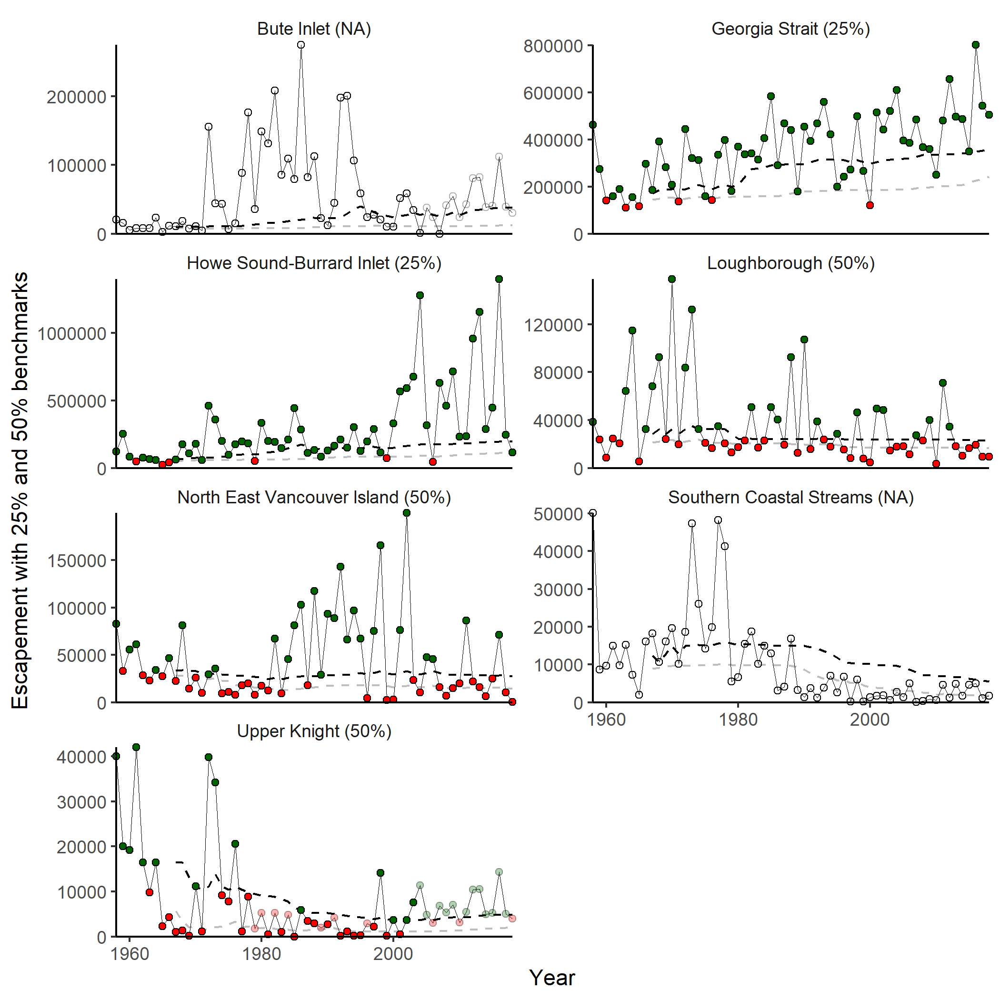

<!-- The following code should appear at the beginning of the first appendix.
After that, all subsequent sections will be turned into appendices. -->

`r if(knitr:::is_latex_output()) '\\Appendices'`

`r if(!knitr:::is_latex_output()) '# (APPENDIX) Appendix {-}'`

# SUPPORTING INFORMATION FOR INNER SOUTH COAST CHUM SALMON CASE STUDY {#app:appendix-chum}

## Data Sources and Treatment
 
### Spawner Escapement

  We used spawning escapement data from 1953-2018. Most of the escapement data comes from the NUSEDS database (a small amount from Lower Fraser Stock Assessment for Areas 28 and 29, FSC in-river catch from some First Nations, and enhanced escapement from DFO Salmon Enhancement Program). The number of Chum salmon that return to spawn is typically counted using visual surveys.  Biologists from Fisheries and Oceans Canada and First Nations including ... (Island Marine Aquatic Working Group) *\textcolor{cyan}{LW: which ones?}* generate these data by walking streams and counting fish, *\textcolor{cyan}{LW: helicopter counts?}* and using fences or weirs on some rivers. Total escapement for each stream is usually a peak counts or estimated using the area under the curve (AUC) method.

### Fishery Harvest, Genetics, and Age

  The number of chum caught in fisheries in the Inside South Coast area were taken from the DFO Clockwork Database, which includes the DFO Fishery Operating System and Sales slip databases and Genetic Stock Identification data. Age distributions for each year were taken from the Johnstone Strait fishery aggregate, as age data for specific CUs or streams was not available. Harvest data was available for 1954-2018. Age composition data was available for 1958-2018.

### Data Selection and Infilling

  We removed the summer run fish because all of the data that goes into the run reconstruction work is associated with populations that return in the fall.  

  To get wild escapement, we kept only wild spawners and removed hatchery-origin spawners (with clipped adipose fins), spawners harvested at a facility, and spawners collected for brood stock. 

  We also removed spawners for the Qualicum River, Little Qualicum River, and Puntledge River, as these systems have been nearly 100% enhanced at least since enhancement began at these locations. We made the assumption that these streams had 100% hatchery origin spawners. 

  After these removals, the steps for preparing the data for analysis were:

- Infill total and wild escapement by CU and Area, (by stream for CUs with observations, by CU for years with no observations in a CU)
- Run reconstruction: 
  - Add fishery catch by CU and Area to total escapement to estimate total returns
  - Use proportion of wild:total escapement by CU and Area to estimate number of wild returns 
  - Use age proportions of catch to estimate age of returns and get recruits by brood year for each CU. Result is wild spawners and corresponding recruits by brood year for each CU

### Infilling of Spawner Escapement Data

  The data we used had years where not all streams were counted. Missing escapement values require infilling for two purposes: 

1. To ensure that all CUs have annual estimates of wild returns for input to the run reconstruction model, which allows recruits for each brood year to be estimated.
2. To create CU-level time series of wild escapement that can be used to calculate status relative to CU-level benchmarks, as well as LRPs based on CU status.

  Two levels of infilling have previously been used for ISC Chum CUs (@holtEvaluatingBenchmarksBiological2018; Figure \@ref(fig:chum-escapement-infill)). The first level, infilling by stream, is used when a CU has some streams counted in a year.  In this case, stream-level infilling is done by borrowing information from other streams within the same CU. The second level, infilling by CU, is used when there are no counts of spawners for a CU in a given year. We had to infill by CU to get total spawners to use for the run reconstruction, but we did not use CUs with CU-level infilling to calculate LRPs because the infilling procedure assumes that escapement is correlated between CUs in a given year. 

#### Infilling by Stream

  This applies to CUs and years when there were counts in some streams in the CU in a given year. For each stream, the geometric mean of escapement over all years was calculated as the stream's average escapement. Then the total average escapement for each CU in each year was the sum of the average escapements from all streams. Then a proportion of monitored escapement in each year was the sum of average escapement of all streams with counts in a year divided by the sum of the average escapements for all streams (counted and uncounted) in that CU. The infilled escapement for a CU in given year was the sum of the observed escapements for that CU and year divided by the proportion of the monitored escapement for that CU and year. 

  Infilling by stream typically made up a small proportion of the total escapement for each CU, with the exception of Howe Sound-Burrard Inlet. This was partly due to increasing escapements in the Cheakamus River and Indian River since 2000. This method assumes that escapement among streams is correlated, which is not always the case (can have figure in appendix or quote correlation values). 

#### Infilling by CU

  If there were no counts of any streams in a CU in a given year, a second round of infilling was done with data set that had already been infilled by stream. This was the case for two CUs: Upper Knight (22 years: 1979-1980, 1982, 1984, 1989, 1991,1996,2004-18) and Bute Inlet (13 years: 2005-2006, 2008-2018). 

  Using by-stream infilled escapement summed for each CU, the CUs and years with missing data were infilled assuming the total CU escapement was correlated between CUs. The procedure was similar to that for infilling by stream, but a geometric average for each CU across all years was used to calculate the proportion of the average for each year, and then that was used to estimate escapement for the two CUs with no observations.

```{r chum-escapement-infill, fig.cap="Chum salmon escapement for the seven Conservation Units. Black points indicate actual counts, blue points are infilled by stream, and red points are infilled by Conservation Unit.", warning=FALSE, echo=FALSE, fig.align="center"}
download.file('https://github.com/Pacific-salmon-assess/SalmonLRP_RetroEval/raw/master/SCChumStudy/Figures/fig_compare_actual_infill_by_stream_and_CU.png', './figure/chum-escapement-infill.png', mode="wb")
knitr::include_graphics("figure/chum-escapement-infill.png")
```

### Run Reconstruction to Estimate Recruitment

  We reconstructed the returns for each brood year to give recruits for brood years 1955-2012 (age composition data from 1958-2018, minimum fish age was 3 years, maximum fish age was 6 years). Using CU benchmarks based on stock-recruit parameters - in this case, Sgen - requires knowing the spawners and recruits (adult offspring produced by each brood year of spawners) for each brood year (spawning year). Estimating recruits requires knowing wild spawner escapement, number of wild fish caught in fisheries, and the age of these fish. 

  To get these estimates, total (wild and hatchery origin) spawners based on the infilling methods above (both stream and CU level infilling) were calculated for each CU and Fishery Management Area (Figure \@ref(fig:chum-map)). The number of fish harvested in fisheries (wild and hatchery, by CU and Fishery Management Area) were added to the total escapement to get an estimate of totoal stock by CU and Fishery Management Area for each spawning year. This total stock number was multiplied by the proportion of wild spawners in each CU and Fishery Management Area based on the infilled wild and total spawner escapement. The product was an estimate of total wild stock (spawner escapement plus fishery harvest) by CU and Fishery Management Area for each brood year. Finally, the age composition of chum harvested in the Johnstone Strait aggregate fishery (ages 3, 4, 5 and 6) were used to assign fish from this total stock to brood years. As such, this analysis does not account for age diversity between CUs or streams.

  Note that the two CUs requiring CU-level infilling correspond to only one Fishery Management Area each, which allows the run reconstruction using fishery harvest data at this level.

```{r chum-spawner-distribution, fig.cap="Density (smoothed histogram) of chum escapement for the seven Conservation Units. Note that x axis is on logarithmic scale.", warning=FALSE, echo=FALSE, fig.align="center"}
download.file('https://github.com/Pacific-salmon-assess/SalmonLRP_RetroEval/raw/master/SCChumStudy/Figures/fig_spawner_dist.png', './figure/fig-spawner-dist.png', mode="wb")

```

## Retrospective Analysis of CU Benchmarks

  We conducted a retrospective analysis using the data for the Inside South Coast Chum to evaluate how increasing the length of the time series affected the estimates of stock recruitment parameters, S\textsubscript{gen} and percentile benchmarks. 

  In the retrospective analysis, the estimates of $\alpha$, $\beta$, and S\textsubscript{gen} changed as progressively more years of data were included (Figures \@ref(fig:chum-a-b-SMSY-Sgen-retro)). Note that these are not estimates based on a model that accounts for time-varying parameters. Rather, the estimates of $\alpha$, $\beta$, and S\textsubscript{gen} in a given year come from fitting a Ricker model to spawners and recruits for all years up to and including that year, for each CU. Each subsequent year includes another year of data. Thus, as more data is included, the estimates of $\alpha$, $\beta$, and S\textsubscript{gen} may change. These results should be interpreted with caution due to the large residuals in observed vs. predicted recruits. Since $\alpha$ and $\beta$ are correlated, the meaning of any trends in one parameter should be interpreted with the other parameter in mind, especially when model fits have large residuals. Similarly, since $\alpha$ and  $\beta$ determine S\textsubscript{MSY} and S\textsubscript{gen}, changes in these derived parameters can be challenging to interpret and can be due to changes in $\alpha$,  $\beta$, and their relative values.

```{r chum-a-b-SMSY-Sgen-retro, fig.cap="Retrospective estimates of $\\alpha$, $\\beta$, S\textsubscript{gen} (black line with gray confidence intervals) and S\textsubscript{MSY} (blue line) for five CUs in the Inside South Coast Chum SMU. Note y axis is identical across CUs for $\\alpha$ but varies for other parameters.", warning=FALSE, echo=FALSE, fig.align="center"}
download.file('https://github.com/Pacific-salmon-assess/SalmonLRP_RetroEval/raw/master/SCChumStudy/Figures/fig_a_b_SMSY_Sgen_retro.png', './figure/chum-a-b-SMSY-Sgen-retro.png',  mode="wb")
knitr::include_graphics('figure/chum-a-b-SMSY-Sgen-retro.png')
```

  Retrospective estimates of $\alpha$ and $\beta$ for Southern Coastal Streams show declines over time. S\textsubscript{MSY} and S\textsubscript{gen} increase sharply in the first few years due to large decreases in $\alpha$ and $\beta$. S\textsubscript{MSY} then decreases over time, while S\textsubscript{gen} stays relatively stable. This is because as $\alpha$ decreases below ~2.5, S\textsubscript{gen} decreases, but as $\beta$ decreases, S\textsubscript{gen} decreases, so that a simultaneous decrease in $\alpha$ and $\beta$ can cancel out. However, the lower alpha is below 2.5, the less influence $\beta$ has on S\textsubscript{gen}. *\textcolor{cyan}{This is from my work on sensitivity of Sgen and SMSY to alpha and beta. Not sure if we can include here}*

  Increasing S\textsubscript{gen} for North East Vancouver Island is mainly due to an increase in $\alpha$ from <1.5 to >2 and then a decrease in $\beta$. $\alpha$ for Loughborough showed modest decreases over time, and S\textsubscript{gen} was fairly stable. The Georgia Strait CU shows evidence of increasing $\alpha$, and its S\textsubscript{gen} estimate was fairly stable. Howe Sound-Burrard Inlet S\textsubscript{gen} was fairly stable, and then increased due to  decreases in $\alpha$ and $\beta$. 


```{r chum-perc-retro, fig.cap="Escapement with 25th and 50th percentile benchmarks shown by gray and black dotted lines, respectively. Benchmarks are calculated using escapements up to the given year. Values following the CU names indicate the appropriate percentile benchmark. Green and red points indicate status above or below benchmark, respectively. Transparent points are years with CU-level infilling.", warning=FALSE, echo=FALSE, fig.align="center"}
download.file('https://github.com/Pacific-salmon-assess/SalmonLRP_RetroEval/raw/master/SCChumStudy/Figures/fig_perc_benchmarks_annual_retro.png', './figure/chum-perc-retro.png', mode="wb")

```

```{r chum-logistic-sgen, fig.cap="Logistic regression of whether escapement of all component CUs were above their S\textsubscript{gen} benchmarks based on aggregate abundance, for Inside South Coast Chum SMU. Includes the 5 CUs without CU-level infilling (no Bute Inlet or Upper Knight)", warning=FALSE, echo=FALSE, fig.align="center"}
download.file('https://github.com/Pacific-salmon-assess/SalmonLRP_RetroEval/raw/master/SCChumStudy/Figures/AnnualRetrospective/Bern.IndivRicker_NoSurv_noCUinfill_90/LogisticMod_2012.pdf', './figure/chum-logistic-sgen.pdf', mode="wb")
knitr::include_graphics('figure/chum-logistic-sgen.pdf')
```

