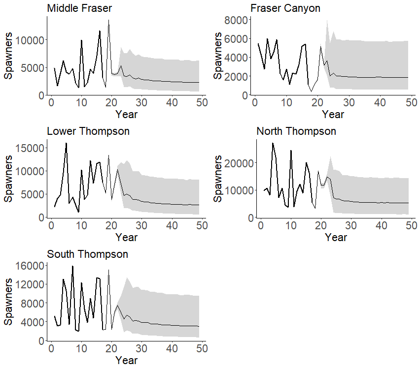
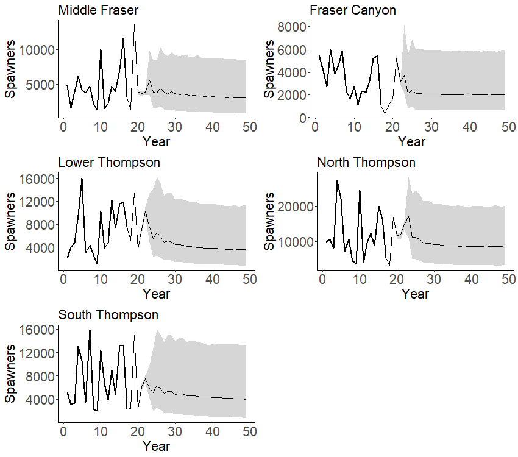

---
output:
  pdf_document: default
  html_document: default
---
<!-- The following code should appear at the beginning of the first appendix.
After that, all subsequent sections will be turned into appendices. -->


# INTERIOR FRASER RIVER COHO MODEL FITS {#app:coho-appendix}

```{r coho-SrepPrior, fig.cap="Prior distribution of SREP used when fitting the Ricker\\_priorCap model.The red dashed line shows the maximum likelihood estimate of SRep from the base Ricker model stock recruitment fit. The mean of the SRep prior was set to 1.4 times the maximum likelihood estimate", warning=FALSE, echo=FALSE, out.width = '80%',  fig.align="center"}
knitr::include_graphics("figure/coho-SrepPriorDist.png")
```


\newpage


<!--To Do: To Do: improve table formatting so that differnt number of digits for different variables
CH: could do after submission to TWG, if required at all?
-->

```{r coho-postSummary-Ricker, warning=FALSE, echo=FALSE}

dat <- as.data.frame(read.csv("data/coho-postSummary-Ricker.csv"))
options(scipen=999, digits=2)

# dat[dat$Variable == "adjProd",3:6]<-round(dat[dat$Variable == "adjProd",3:6],digits=2)
# dat[dat$Variable == "alpha",3:6]<-round(dat[dat$Variable == "alpha",3:6],digits=2)
# dat[dat$Variable == "beta",3:6]<-round(dat[dat$Variable == "beta",3:6],digits=4)
# dat[dat$Variable == "Sgen",3:6]<-round(dat[dat$Variable == "Sgen",3:6],digits=2)
# dat[dat$Variable == "sigma",3:6]<-round(dat[dat$Variable == "sigma",3:6],digits=2)
# dat[dat$Variable == "gamma",3:6]<-round(dat[dat$Variable == "gamma",3:6],digits=2)

csasdown::csas_table(dat, digits=2, booktabs = T, caption = "Summary of posterior distribution mean and quantiles (5%, 50%, and 95%) for stock recruit model parameters and Sgen lower benchmark from the Ricker model fit.")
 
```

\newpage

```{r coho-postSummary-RickerCap, warning=FALSE, echo=FALSE}

dat <- as.data.frame(read.csv("data/coho-postSummary-RickerCap.csv"))
options(scipen=999, digits=2)

csasdown::csas_table(dat, digits=2, booktabs = T, caption = "Summary of posterior distribution mean and quantiles (5%, 50%, and 95%) for stock recruit model parameters and Sgen lower benchmark from the Ricker\\_prioCap model fit.")
 
```


```{r coho-CUProjections-Ricker, fig.cap="Projected spawner abundances, for each of the five Interior Fraser Coho CUs, used to develop projection-based LRPs under the base Ricker model. The solid line shows the median spawning abundance in a projection year while the grey shading shows the 10th and 90th percentiles of spawner abundance", warning=FALSE, echo=FALSE, out.width = '80%',  fig.align="center"}

```


```{r coho-CUProjections-Ricker-priorCap, fig.cap="Projected spawner abundances, for each of the five Interior Fraser Coho CUs, used to develop projection-based LRPs under the Ricker-priorCap model. The solid line shows the median spawning abundance in a projection year while the grey shading shows the 10th and 90th percentiles of spawner abundance", warning=FALSE, echo=FALSE, out.width = '80%',  fig.align="center"}

```
