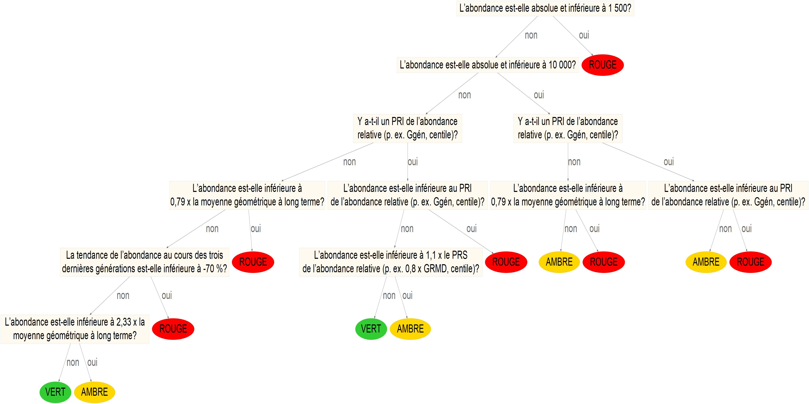
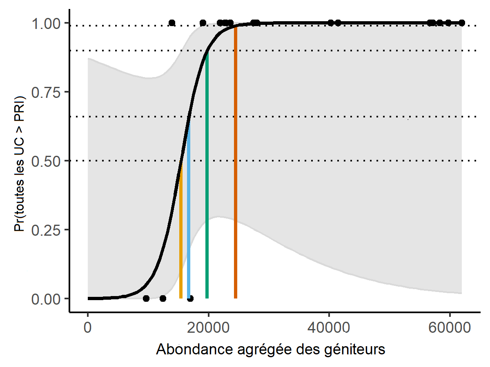

---
output:
  pdf_document: default
  html_document: default
---
# MÉTHODES D’ESTIMATION DES PRL{#MethodsChapter}

Dans la présente section, nous donnons un aperçu des méthodes utilisées pour élaborer des PRL dans le cadre des trois études de cas. Des méthodes détaillées propres à chaque étude de cas sont fournies dans les sections \@ref(IFCChapter) (saumon coho du Fraser intérieur), \@ref(WCVIchinookChapter) (saumon chinook de la côte ouest de l’île de Vancouver) et \@ref(ISCchumChapter) (saumon kéta de la côte sud intérieure, à l’exclusion des UC du Fraser). Les liens vers les dépôts GitHub ainsi que les données et le code d’analyse utilisés pour les trois études de cas sont présentés à l’annexe \@ref(app:github-appendix). Un aperçu des approches appliquées à chacune des trois études de cas est présenté au tableau \@ref(tab:lrpapproaches).


\renewcommand*{\arraystretch}{1.4}
\begin{table}[!htbp]
\setlength\heavyrulewidth{0.25ex}
\centering
\footnotesize   
\caption{Aperçu des méthodes d’évaluation des UC et des UGS appliquées pour chaque étude de cas. Les cellules comportant un «~- » au niveau de l’évaluation à l’échelle de l’UC indiquent qu’aucune méthode n’a été appliquée aux UC dans cette étude de cas.}
\begin{tabular}{p{3.2cm} p{3.2cm} p{2.4cm} p{2.4cm} p{2.4cm}}
\toprule
\multicolumn{2}{l}{} & \bf{Saumon coho du Fraser intérieur }& \bf{Saumon chinook de la COIV} & \bf{Saumon kéta de la côte sud intérieure} \\
\midrule
\multicolumn{5}{l}{ \bf{Évaluation à l’échelle de l’UC} }\\
\toprule

\multicolumn{2}{l}{\parbox{5.8cm}{Paramètre composite (Explorateur de l’état des saumons du Pacifique) }}& \cellcolor{gray!10}Oui (seulement pour les PRL fondés sur l’état des UC) &   \cellcolor{gray!10}Oui (seulement pour les PRL fondés sur l’état des UC)  &  \cellcolor{gray!10}Oui (seulement pour les PRL fondés sur l’état des UC)\\
\midrule
\multirow{3}{*}{\parbox{3.2cm}{Paramètre unique : abondance par rapport au point de référence inférieur}} & Point de référence : relation géniteur-recrutement & \cellcolor{gray!10}Oui & - & \textit{Tentative, estimations non fiables}\\
\cline{2-5}
& Point de référence : habitat & - & \cellcolor{gray!10}Oui & -\\
\cline{2-5}
& Point de référence : centile & - & - & \cellcolor{gray!10}Oui\\
\cline{1-5}
\multicolumn{2}{l}{Paramètre unique : répartition} & \cellcolor{gray!10}Oui & - & - \\
\bottomrule
\multicolumn{5}{l}{ \bf{Évaluation à l’échelle de l’UGS } }\\
\toprule

\multicolumn{2}{l}{PRL fondés sur l’état des UC (pour \textit{Loi sur les pêches})} &  \cellcolor{gray!10}Oui &   \cellcolor{gray!10}Oui &   \cellcolor{gray!10}Oui\\
\midrule
\multirow{2}{*}{\parbox{3.2cm}{PRL fondés sur l’abondance agrégée (supplémentaires)}} & Régression logistique & \cellcolor{gray!10}Oui & \textit{Tentative, données insuffisantes} &  \textit{Tentative, données non fiables} \\ 
\cline{2-5}
 & Projection & \cellcolor{gray!10}Oui  & \cellcolor{gray!10}Oui &  \textit{Aucune tentative, données jugées non fiables} \\
\bottomrule
\end{tabular}
(\#tab:lrpapproaches)
\end{table}


## APERÇU

Nous examinons deux types de PRL fondés sur deux paramètres différents.

1) Les PRL fondés sur l’état des UC (paramètre : une proportion sur laquelle les PRL sont fondés). Plus précisément, on utilise la proportion des UC à l’intérieur d’une UGS dont l’état se trouve au-dessus de la zone rouge de la PSS. Nous supposons que pour qu’une UGS demeure au-dessus de son PRL fondé sur l’état des UC, l’état de 100 % des UC doit se trouver au-dessus de la zone rouge (c’est-à-dire dans la zone ambre ou verte).

2) Les PRL fondés sur l’abondance agrégée (paramètre : l’abondance totale des géniteurs à l’échelle de l’UGS). On applique deux méthodes d’élaboration des PRL fondés sur l’abondance agrégée : (i) le PRL de régression logistique et (ii) le PRL de projection.

Nous sommes d’avis que les PRL fondés sur l’état des UC sont davantage appropriés pour les unités de gestion des saumons du Pacifique parce qu’ils correspondent plus directement aux objectifs de maintien de la biodiversité des saumons de la PSS du MPO. Toutefois, des méthodes de PRL fondés sur l’abondance agrégée peuvent être utilisées pour répondre à des exigences particulières de gestion des pêches. 


Nous mettons en œuvre des PRL fondés sur l’état des UC à l’aide d’approches élaborées pour évaluer l’état des UC dans le cadre de la PSS du MPO [@dfoCanadaPolicyConservation2005; @holtIndicatorsStatusBenchmarks2009] et mises en œuvre pour un sous-ensemble d’UC prioritaires [@dfoWildSalmonPolicy2015; @dfoIntegratedBiologicalStatus2016; @grant2017FraserSockeye2020]. Ces approches utilisent de multiples paramètres pour évaluer l’état, y compris les tendances en matière d’abondance et des paramètres de l’abondance, et une approche d’intégration axée sur l’expertise pour combiner les états selon tous les paramètres en un seul état pour chaque UC. Dans nos applications aux études de cas, nous utilisons l’Explorateur de l’état des saumons du Pacifique récemment mis au point (Pestal et al., en préparation^[Pestal, G., MacDonald, B, Grant, S, and Holt, C.,. Approximations rapides de l’état tirées des évaluations d’experts intégrées en vertu de la Politique sur le saumon sauvage du Canada. Rapp. tech. can. sci. halieut. aquat.]) afin d’effectuer des approximations rapides d’évaluations détaillées de l’état selon la PSS. L’Explorateur de l’état des saumons du Pacifique nous permet de produire rapidement des estimations à jour de l’état intégré d’UC pour toutes nos applications aux études de cas.


Lors de l’élaboration des PRL fondés sur l’abondance agrégée possibles, nous visons à maintenir la cohérence avec la PSS en définissant les PRL comme des niveaux d’abondance agrégée associés à une forte probabilité que l’état de toutes les UC se situe au-dessus de la zone rouge. Pour ces PRL, les estimations de l’état des UC sont approximatives en fonction d’une comparaison de l’abondance des géniteurs à un seul point de référence inférieur pour chaque UC. Les exceptions sont décrites dans les applications distinctes aux études de cas ci-dessous.


Nous assurons également la cohérence avec la PSS en n’incluant que les cours d’eau de fraie qui n’ont pas été l’objet d’une mise en valeur importante lors de l’évaluation de l’état à l’échelle de l’UC et de l’UGS. Nous utilisons le paramètre de l’influence naturelle proportionnelle (INP) comme base pour définir une « mise en valeur importante ». L’INP est un paramètre conçu pour estimer la force relative des écloseries et les pressions de sélection naturelles résultant du flux génétique entre les deux environnements, et il sert de base pour déterminer le risque génétique des écloseries sur les populations naturelles. Les valeurs inférieures à 0,5 indiquent des populations où la plupart des poissons proviennent d’une écloserie (classées comme des populations d’écloserie intégrées) [@withlerGeneticallyBasedTargets2018]. Nous avons défini les populations « considérablement mises en valeur » comme celles dont les valeurs de l’INP $<$ 0,5 et nous les avons exclues des analyses des études de cas. 


Les réseaux ayant des niveaux d’INP à $\geqslant$ 0,5 peuvent encore avoir une influence sur les écloseries; cependant, la dynamique est principalement d’origine naturelle. Lorsqu’une série chronologique de la proportion de poissons d’écloserie marqués présents dans les frayères est disponible (p. ex., étude de cas sur le saumon coho du Fraser intérieur), cette proportion sert à éclairer les évaluations de deux façons : premièrement, pour élaborer une série chronologique du recrutement d’origine naturelle pour l’estimation de points de référence fondés sur la relation stock-recrutement et, deuxièmement, pour élaborer une série chronologique des géniteurs d’origine naturelle pour l’évaluation de l’état par rapport aux points de référence. Lorsqu’une série chronologique fiable de la proportion de l’influence des poissons d’écloserie n’est pas disponible (saumon chinook de la COIV), le nombre total de géniteurs est utilisé pour les analyses de l’INP, à condition que le seuil de l’INP présumée de $\geqslant$ 0,5 ait été atteint.


Des descriptions plus détaillées des méthodes d’estimation du PRL sont fournies dans les sections suivantes, tandis que des directives sur le moment et la façon d’appliquer les PRL fondés sur l’état des UC et l’abondance agrégée sont fournies dans @holtGuidelinesDefiningLimitInpress. Nous recommandons aux utilisateurs de consulter @holtGuidelinesDefiningLimitInpress avant d’appliquer l’une ou l’autre des méthodes décrites dans le présent document portant sur des études de cas.

## PRL FONDÉS SUR L’ÉTAT DES UC

Un PRL fondé sur l’état des UC a été fixé à 100 % des UC dont l’état se situe au-dessus de la zone rouge. Le PRL sert donc de déclencheur qui est dépassé lorsque l’état d’une ou plusieurs UC d’une UGS est évalué comme se trouvant en zone rouge. La justification de ce choix de 100 % des UC affichant un état se situant au-dessus de la zone rouge est décrite dans @holtGuidelinesDefiningLimitInpress.


Nous comparons trois méthodes différentes d’évaluation de l’état des UC lorsque nous utilisons des PRL fondés sur l’état des UC : (i) la proportion d’UC ayant fait l’objet d’une évaluation récente de l’état selon la PSS qui se situent au-dessus de la zone rouge (p. ex., @grant2017FraserSockeye2020); (ii) la proportion d’UC ayant fait l’objet d’une évaluation récente de l’état selon l’Explorateur de l’état des saumons du Pacifique qui se situent au-dessus de la zone rouge (voir ci-dessous plus de détails); (iii) la proportion d’UC dont l’état est estimé être au-dessus du PRI d’une seule UC (G~gén~, points de référence fondés sur le centile, etc.). Nous recommandons des méthodes utilisant des paramètres composites comme (i) et (ii) pour les évaluations des UC, et nous fournissons la méthode (iii) à des fins de comparaison.


Lorsque nous évaluons l’état des UC par rapport à un seul PRI fondé sur l’abondance selon l’approche (iii), nous comparons l’abondance moyenne générationnelle des géniteurs au point de référence, tel que décrit à la section @holtGuidelinesDefiningLimitInpress.


### APPROCHE MULTIDIMENSIONNELLE DES ÉVALUATIONS DE L’ÉTAT DES UC SELON L’EXPLORATEUR DE L’ÉTAT DES SAUMONS DU PACIFIQUE {#rapidToolMethods}

L’Explorateur de l’état des saumons du Pacifique (ci-après appelé « l’Explorateur ») permet d’estimer les états selon des paramètres particuliers de la PSS et intègre également les états pour de multiples paramètres en une seule estimation de la zone d’état (rouge, ambre ou verte; Pestal et al., en préparation). En automatisant ce processus, l’Explorateur appuie la mise en œuvre de la PSS du Canada en reproduisant rapidement le processus d’évaluation de l’état de cette Politique, plus détaillé et plus complet. L’approche de l’Explorateur peut être mise en œuvre annuellement et pour un plus large éventail d’UC, étant donné qu’il faut moins de temps et de travail pour effectuer des évaluations intégrées de l’état selon la PSS. L’Explorateur a été mis au point à l’aide d’analyses de l’arbre de classification et de régression (CART) et du jugement d’experts tiré des processus intégrés d’évaluation de l’état, afin de créer des algorithmes qui se rapprochent des résultats de l’évaluation intégrée de l’état. 

Les entrées de données et les résultats des processus d’évaluation antérieurs de la PSS ont été utilisés dans les analyses auxquelles on a eu recours pour élaborer l’Explorateur : saumon rouge du fleuve Fraser, saumon coho du Fraser intérieur et saumon chinook du sud de la Colombie-Britannique [@dfoWildSalmonPolicy2015; @dfoIntegratedBiologicalStatus2016; @dfo2017FraserSockeye2018;  @grant2017FraserSockeye2020]. En bref, l’Explorateur utilise un arbre de décision pour estimer l’état des UC en fonction du type de données, de la qualité, de l’abondance et des tendances (p. ex., figure \@ref(fig:decision-tree)). L’algorithme de l’arbre de décision a été vérifié à l’aide de données et de l’expertise locale (Pestal et al. en préparation). Comme pour les autres méthodes, un examen réalisé par des experts des résultats rapides relatifs à l’état de chaque UC doit être intégré à l’application de cet outil (S. Grant, MPO, Vancouver, C.-B., comm. pers.). Un tel examen aiderait à repérer les occurrences de faux négatifs ou de faux positifs liés à l’état estimé des UC au moyen de l’opinion d’experts. Lorsque nous avons utilisé cette méthode dans l’étude de cas, nous avons pris les résultats des algorithmes à leur valeur apparente et nous ne les avons pas confirmés en nous fondant sur l’opinion d’experts. En pratique, les résultats de l’Explorateur seront validés par rapport à l’expertise locale lorsqu’ils seront mis en œuvre chaque année (S. Grant, MPO, Vancouver, C.-B., comm. pers.). 

Pour les paramètres de l’abondance absolue ou relative, l’Explorateur utilise l’abondance moyenne générationnelle des géniteurs la plus récente (calculée comme moyenne géométrique mobile) pour comparer les points de référence, y compris les seuils d’abondance absolus (p. ex., 1 500 géniteurs), les points de référence inférieurs fondés sur l’abondance (p. ex., G~gén~ ou centile) et les points de référence supérieurs fondés sur l’abondance (p. ex., 0,8G~RMD~ ou centiles). L’abondance moyenne générationnelle des géniteurs est également utilisée pour calculer les tendances de l’abondance des géniteurs au fil du temps (Pestal et al. en préparation).

## PRL FONDÉS SUR L’ABONDANCE AGRÉGÉE{#aggAbundMethods}

Les PRL fondés sur l’abondance agrégée se basent sur l’hypothèse qu’il existe une relation prévisible entre l’abondance à l’échelle de l’UGS et la probabilité que l’état de toutes les UC se situe au-dessus de la zone rouge. Pour estimer les PRL fondés sur l’abondance agrégée, on utilise l’état relatif à un seul PRI comme indicateur de l’état au-dessus de la zone rouge. On estime ensuite les PRL fondés sur l’abondance agrégée à l’aide de la relation prévue pour trouver l’abondance à l’échelle de l’UGS à laquelle il y a une probabilité prescrite que 100 % des UC (la même proportion utilisée pour les PRL fondés sur l’état des UC) se situent au-dessus du PRI. 


La définition susmentionnée des PRL fondés sur l’abondance agrégée exige qu’une décision soit prise quant à la probabilité requise que 100 % des UC se situent au-dessus leur PRI. Nous considérons quatre niveaux de probabilité de rechange pour nos études de cas qui représentent une gamme de catégories de probabilité calibrées élaborées par le Groupe d’experts intergouvernemental sur l’évolution du climat[@mastrandreaGuidanceNoteLead2010] : 50 %, 66 %, 90 % et 99 %. La valeur de 50 % représente le point milieu de la catégorie « à peu près aussi probable qu’improbable » (de 33 % à 66 %), ce qui indique qu’il y a une probabilité égale que toutes les UC seront au-dessus de leur PRI, car il y a une probabilité égale qu’elles ne le seront pas. Les valeurs de 66 % représentent la limite inférieure de la catégorie « probable » (c’est-à-dire qu’il est « probable » que toutes les UC se situeront au-dessus de leur PRI), la valeur de 90 % représente la limite inférieure de la catégorie « très probable », et la valeur de 99 % représente la catégorie « pratiquement certain ». Une analyse des considérations pour le choix du seuil de probabilité approprié lors du calcul des PRL fondés sur l’abondance est incluse dans @holtGuidelinesDefiningLimitInpress.
 
 
Nous considérons deux types de PRL fondés sur l’abondance agrégée dans nos études de cas : le PRL de régression logistique et le PRL de projection. Les deux méthodes diffèrent selon l’approche adoptée pour estimer la relation sous-jacente entre l’abondance agrégée à l’échelle de l’UGS et la probabilité que toutes les UC se situent au-dessus de leur PRI. On estime les PRL de régression logistique en ajustant les modèles statistiques aux données historiques pour estimer cette relation. Dans ce cas, les PRL sont fondés sur la covariation observée précédemment dans l’état des UC et supposent donc implicitement que le passé est une approximation raisonnable de l’avenir. En comparaison, les PRL de projection utilisent les données historiques comme base pour quantifier la dynamique de la population, puis projettent la dynamique de la population à l’aide de simulations stochastiques pour déterminer un état d’équilibre. Les résultats de la simulation servent ensuite à caractériser la relation sous-jacente entre l’abondance agrégée et la probabilité que toutes les UC se situent au-dessus de leur PRI. 


L’approche du PRL de projection permet de prendre en compte l’incertitude dans les processus actuels (ou futurs) qui pourrait avoir une incidence sur l’estimation du PRL, au moyen de scénarios de rechange. Par exemple, s’il existe des éléments de preuve de changements récents de la covariation entre les UC, possiblement en raison d’un sous-ensemble d’UC dont la productivité est réduite, cette hypothèse peut être modélisée dans les projections. En comparaison, le PRL de régression logistique se limite à l’utilisation de données observées historiquement, qui peuvent ne pas inclure suffisamment d’observations de la structure de covariation nouvelle et émergente. 

\newpage
\begin{landscape}
```{r decision-tree, fig.cap="Arbre de décision (aussi appelé algorithme multidimensionnel) utilisé dans l’Explorateur pour évaluer l’état des unités de conservation en fonction de multiples paramètres dans le cadre de la PSS (Pestal et al. en préparation)", warning=FALSE, echo=FALSE, fig.align="center",out.width = "100%" }
source("R/make_tree_diagram_fr.R")

```
\end{landscape}


Autant pour le PRL de régression logistique que pour le PRL de projection, nous caractérisons l’état annuel des UC à l’aide d’un paramètre unique, l’abondance des géniteurs par rapport à un PRI, plutôt que d’utiliser l’état selon l’algorithme multidimensionnel de l’Explorateur. Bien qu’en théorie, les estimations de l’état des UC réalisées à partir de l’approche multidimensionnelle pourraient être utilisées pour les PRL de régression logistique, nous avons trouvé peu de données probantes d’une relation statistique entre les états des UC selon l’Explorateur et l’abondance agrégée des géniteurs pour la seule étude de cas où nous avons examiné cette approche, celle du saumon coho du Fraser intérieur. Nous fournissons une analyse plus approfondie de ce résultat dans la section du présent document portant sur l’étude de cas sur le saumon coho du Fraser intérieur. De plus, les PRL de projection sont obtenus des conditions d’équilibre déterminées à partir de projections qui n’intègrent pas la dynamique temporelle requise pour l’évaluation des tendances dans l’approche multidimensionnelle. Bien que les estimations de l’état des UC par rapport à un seul PRI, comme G~gén~, soient des résultats facilement accessibles à partir de l’Explorateur, nous avons calculé ces paramètres sans avoir recours à l’outil pour nos études de cas.


Lors de l’évaluation de l’état des UC aux fins de l’estimation des PRL fondés sur l’abondance agrégée, nous avons utilisé l’abondance annuelle des géniteurs non lissée plutôt que la moyenne générationnelles Cette approche était fondée sur des analyses préliminaires de la méthode de régression logistique qui ont montré que l’utilisation de l’abondance des géniteurs non lissée a amélioré la propagation des données utilisées pour établir une relation entre l’état des UC et l’abondance agrégée des géniteurs. De plus, l’utilisation de la moyenne générationnelle dans l’approche de régression logistique a entraîné une autocorrélation considérable dans la série chronologique d’abondance agrégée, ce qui contrevient aux hypothèses de la régression logistique.


Toutefois, lorsque nous avons évalué l’état à l’échelle de l’UGS, nous avons utilisé la moyenne générationnelle (moyenne géométrique) de l’abondance agrégée des géniteurs. Cette approche a réduit la variabilité des décisions annuelles quant à savoir si un PRL avait été dépassé en raison de la variabilité des cohortes au cours d’une génération. La décision d’utiliser la moyenne générationnelle de l’abondance agrégée des géniteurs pour déterminer si un PRL est dépassé est conforme à l’approche utilisée pour les PRL fondés sur l’état des UC. Dans les deux cas, le paramètre sous-jacent qui a servi à déterminer l’état de l’UGS (abondance agrégée ou état à l’échelle de l’UC des UC constituantes pour l’approche fondée sur l’état des UC) est fondé sur les valeurs de moyenne générationnelle afin de réduire la variabilité annuelle de l’état.


### PRL de régression logistique{#logisticMethods}  


Les PRL de régression logistique sont obtenus à partir d’une relation estimée empiriquement entre l’état à l’échelle de l'UC et l’abondance agrégée à l’échelle de l’UGS. À l’aide de cette approche, le PRL représente le niveau d’abondance agrégée qui a historiquement été associé à une probabilité donnée que 100 % des UC aient un état supérieur à un PRI sélectionné. Pour chaque année de données observées, l’état à l’échelle de l’UC est quantifié sous forme de variable de Bernoulli : 1 (réussite; toutes les UC présentent un état estimé supérieur à leur PRI) et 0 (échec; toutes les UC ne présentent pas un état supérieur à leur PRI). Une régression logistique est ensuite ajustée à ces résultats pour prédire la probabilité que toutes les UC aient un état supérieur à leur PRI en fonction de l’abondance agrégée des géniteurs à l’échelle de l’UGS à l’aide de l’équation de régression logistique :


\begin{equation}
  \log(\frac{p}{1-p}) = B_0 + B_1 \sum_{i}^{i=nUC} G_{i,t}
   (\#eq:logistic)
\end{equation}

où $p$ est la probabilité, $B_0$ et $B_1$ sont des paramètres de régression logistique estimés et $G_{i,t}$ est l’abondance des géniteurs par rapport à l’UC $i$ dans l’année $t$. L’équation \@ref(eq:logistic) est ensuite réorganisée pour calculer le PRL comme l’abondance agrégée des géniteurs associée au seuil de probabilité prédéterminé de $p^*$,

\begin{equation}
  PRL = \frac{log(\frac{p^*}{1-p^*}) - B_0}{B_1}
  (\#eq:logisticLRP)
\end{equation}

Un exemple d’ajustement de régression logistique est présenté à la figure \@ref(fig:example-logisticFit). Nous montrons l’estimation des PRL en fonction de cet ajustement pour quatre seuils de probabilité possibles : $p^*$ = 0,5, 0,66, 0,90 et 0,99. Pour chaque niveau $p^*$, les estimations du PRL représentent l’abondance agrégée associée à la probabilité que toutes les UC aient un état supérieur à leur PRI. Les PRL ont été calculés à partir des paramètres du modèle de régression logistique (équation. \@ref(eq:logisticLRP)), et l’incertitude du PRL a été quantifiée en fonction d’un intervalle de confiance de 95 % pour l’estimation correspondant à un maximum de vraisemblance.  


```{r example-logisticFit, fig.cap="Régression logistique ajustée aux données annuelles de Bernoulli pour prévoir la probabilité que toutes les UC se trouvent au-dessus de leur PRI en fonction de l’abondance agrégée à l’échelle de l’UGS. Chaque point noir représente une année dans la série chronologique observée comme un indicateur de Bernoulli qui montre si l’exigence d’avoir toutes les UC au-dessus de leur PRI a été satisfaite (réussite = 1) ou non (échec = 0) en fonction de l’abondance agrégée des géniteurs à l’échelle de l’UGS. La ligne noire pleine représente l’ajustement du modèle de maximum de vraisemblance aux données de l’indicateur, et la zone grisée indique l’intervalle de confiance de 95\\% du modèle d’ajustement. Les lignes de couleur illustrent les PRL fondés sur l’abondance agrégée pour quatre seuils de probabilité différents : p* = 0,5 (jaune), 0,66 (bleu), 0,90 (vert) et 0,99 (orange) probabilité que toutes les UC soient au-dessus de leur PRI. Les lignes en pointillés horizontales croisent l’axe des y à chaque seuil de probabilité, tandis que les lignes verticales pleines montrent l’échappée agrégée correspondante qui représentera le PRL.", out.width = '60%', warning=FALSE, echo=FALSE, fig.align="center"}

```
&nbsp;


Nous avons d’abord envisagé une autre approche de régression logistique dans laquelle le PRL représente l’abondance agrégée qui a toujours été associée à une proportion prédéterminée des UC se trouvant au-dessus de leur PRI. À l’aide de cette approche, une régression logistique était ajustée pour prédire la proportion d’UC dont l’état était supérieur au PRI en fonction de l’abondance agrégée des géniteurs à l’échelle de l’UGS (c’est-à-dire l’abondance des nUC combinées). Nous ne présentons pas cette méthode pour nos études de cas, toutefois, en raison de limites inhérentes lorsque la proportion requise d’UC au‑dessus de leur PRI est de 100 %. L’équation \@ref(eq:logisticLRP) ne peut pas être résolue directement pour une proportion seuil de $p^*$ = 100 %, et les estimations du PRL étaient très sensibles au choix de la valeur $p^*$ utilisée comme approximation. L’utilisation de $p^*$ = 99 % par rapport à $p^*$ = 99,9 % par rapport à $p^*$ = 99,99 % a donné des estimations très différentes du PRL. 

Le modèle de régression logistique a été mis en œuvre dans TMB [@kristensenTMBAutomaticDifferentiation2016]. Le modèle a été statistiquement intégré, ce qui signifie que les PRI (G~gén~) propres aux UC et les paramètres de régression logistique à l’échelle de l’UGS ont été estimés dans le même modèle statistique. L’approche intégrée a permis la propagation de l’incertitude dans les estimations des paramètres de l’échelle de l’UC à l’échelle de l’UGS, ce qui a donné lieu à des intervalles d’incertitude qui saisissent mieux l’incertitude dans les points de référence ainsi que l’ajustement du modèle logistique.  


##### Diagnostics du modèle de régression logistique  


Plusieurs hypothèses sont associées à la régression logistique, dont trois sont pertinentes pour notre application aux PRL et sont énumérées ci-dessous. Les diagnostics du modèle ont été appliqués pour évaluer la mesure dans laquelle ces hypothèses ont été respectées, ainsi que la signification statistique des coefficients du modèle, la qualité de l’ajustement et l’exactitude de la classification des PRL élaborés à partir de la régression logistique. Les trois hypothèses sont les suivantes :

1. la relation entre l’abondance agrégée et les logarithmes du rapport des cotes (le logarithme des probabilités que toutes les UC se trouvent au-dessus de leur PRI) est linéaire;

2. les observations sont indépendantes les unes des autres (c’est-à-dire que les résidus ne sont pas autocorrélés);

3. il n’y a pas de valeurs aberrantes influentes. 


**Évaluation de l’hypothèse de linéarité (hypothèse 1)**

Un test Box-Tidwell a servi à évaluer la linéarité en évaluant la signification d’un terme d’interaction supplémentaire dans la régression logistique. 

\begin{equation}
  \log(\frac{p}{1-p}) = B_0 + B_1 \sum_{i}^{i=nUC} S_{i,t} + B_2 \sum_{i}^{i=nUC} G_{i,t} \times \log (\sum_{i}^{i=nUC} G_{i,t})
   (\#eq:BoxTidwelllogistic)
\end{equation}

Un terme d’interaction significatif $B_2$, indique une relation non linéaire entre l’abondance agrégée et les logarithmes du rapport des cotes, ce qui va à l’encontre de cette hypothèse [@foxAppliedRegressionAnalysis2016].


**Évaluation de l’indépendance (hypothèse 2)**

La somme des carrés résiduelle, $d$, a été estimée pour chaque année.

\begin{equation}
   d = \pm \sqrt { -2 ( y \log(\frac{\mu}{y}) + (1-y)\log(\frac{1-\mu}{1-y}) ) }
   (\#eq:DevianceResid)
\end{equation}

où $\mu$ est la probabilité prévue que toutes les UC se trouvent au-dessus de leur PRI et $y$ est l’observation (1 ou 0, indiquant toutes les UC au‑dessus de la zone rouge ou non, respectivement), au cours d’une année donnée [@foxAppliedRegressionAnalysis2016]. L’équation \@ref(eq:DevianceResid) se réduit à [@ahmadDiagnosticResidualOutliers2011] :

\begin{align}
d = 
\begin{cases}
  - \sqrt { -2 \log(1-\mu) } & \text{, si } y = 0 \\
  \sqrt { -2 \log(\mu)  }  &\text{, si } y = 1
\end{cases}
  (\#eq:DevianceResidy)
\end{align}

L’ampleur de l’autocorrélation du décalage-1 a ensuite été estimée entre la somme des carrés résiduelle et évaluée pour sa signification statistique. 


**Évaluation des valeurs aberrantes (hypothèse 3)**

Nous recommandons de repérer les valeurs aberrantes influentes au moyen de statistiques à effet de levier, dans la mesure du possible. Pour nos études de cas, nous avons détecté les valeurs aberrantes indépendantes de leur influence parce que le logiciel utilisé pour estimer les paramètres du modèle (TMB) ne fournit pas la matrice chapeau requise pour évaluer l’influence de points individuels. Nous nous sommes plutôt concentrés sur la détermination des valeurs aberrantes en nous fondant sur la règle empirique générale selon laquelle les sommes des carrés résiduelles supérieures à 2 sont considérées comme des valeurs aberrantes parce que 95\% de la répartition devrait se situer à l’intérieur de 2 écarts-types de la moyenne. Il est recommandé d’effectuer d’autres travaux pour déterminer les valeurs aberrantes influentes lorsque d’autres outils d’ajustement du modèle statistique sont employés. 


**Signification statistique des coefficients du modèle**

La signification statistique des coefficients a été évaluée à l’aide de la statistique du test de Wald, calculée à partir du ratio du coefficient du modèle $B_1$ par rapport à l’erreur type de ce coefficient, qui est supposé être distribué normalement. Les statistiques et la signification des tests ont été estimées à l’intérieur de TMB [@kristensenTMBAutomaticDifferentiation2016]. 


**Qualité de l’ajustement**

La qualité de l’ajustement a été évaluée en comparant le ratio entre la somme des carrés résiduelle et la somme des carrés nulle, semblable à un rapport de vraisemblance. On suppose que ce ratio suit une distribution du khi carré avec 1 degré de liberté calculé à partir de la différence dans le nombre de paramètres entre les modèles complets et nuls. Les valeurs p inférieures à 0,05 indiquent un manque important d’ajustement [@foxAppliedRegressionAnalysis2016].

De plus, le pseudo-$R^2$ a été calculé pour indiquer le ratio de l’ajustement du modèle par rapport au modèle nul sans variable indépendante [@dobsonIntroductionGeneralizedLinear2018]. 

\begin{equation}
   \text{pseudo-}R^2 =  1- \frac{\sum_{t}^{t=nAnnées} d}{\sum_{t}^{t=nAnnées} d_0} 
   (\#eq:psuedoR2)
\end{equation}

où $d_0$ est la somme des carrés résiduelle pour le modèle nul. Le pseudo-$R^2$ est un paramètre de la force de la relation entre l’abondance agrégée et la probabilité que toutes les UC se trouvent au-dessus de leur PRI. Contrairement aux valeurs $R^2$ pour les modèles linéaires, le pseudo -$R^2$ ne représente pas le pourcentage de variance expliqué par le modèle et n’est pas lié au coefficient de corrélation.

De plus, la longueur des séries chronologiques disponibles aura une incidence sur la puissance de détection des coefficients de modèle significatifs. Les estimations de coefficients peuvent être biaisées lorsque les séries chronologiques sont courtes. @peduzziSimulationStudyNumber1996 recommandent un minimum de 10 points de données pour le résultat le moins fréquent afin d’éviter les biais dans les coefficients du modèle, en fonction d’une étude de simulation de données épidémiologiques. Par exemple, si la fréquence des résultats était de 0,5 et 0,5 (pour 0 et 1, respectivement), une taille d’échantillon d’au moins 10/0,5 = 20 serait suffisante. La taille minimale de l’échantillon serait plus élevée si les données étaient faussées. Par exemple, si la fréquence des résultats était de 0,7 et de 0,3, la taille minimale de l’échantillon serait de 10/0,3 = 33. Une évaluation semblable de la taille de l’échantillon est justifiée afin de minimiser les biais dans le PRL de régression logistique pour les applications à la pêche. Bien qu’il soit possible d’estimer les PRL ayant une taille d’échantillon plus faible, les risques de biais dans les paramètres du modèle (et les PRL) augmentent. Nous calculons la taille minimale de l’échantillon pour nos études de cas en utilisant l’approche de @peduzziSimulationStudyNumber1996.


**Exactitude de la classification des PRL**

L’exactitude de la classification a été évaluée en fonction du ratio des classifications réussies par rapport au nombre total de points de données dans la régression logistique, aussi appelé le taux de succès. Les classifications réussies étaient le nombre d’années où le modèle a permis de prédire avec succès que toutes les UC se trouvaient au-dessus de leur PRI plus le nombre d’années où le modèle a permis de prédire avec succès qu’au moins une UC se trouvait au-dessous de son PRI. Le taux de succès tend à être orienté vers des taux de classification optimistes lorsqu’il est calculé avec le même échantillon utilisé pour ajuster le modèle logistique. Par conséquent, nous avons également envisagé une approche hors échantillon de l’exactitude de la classification, dans le cadre de laquelle la régression logistique a été estimée de façon itérative en supprimant un point de données unique, et la fréquence des réussites par rapport aux observations était fondée sur le modèle qui ne contenait pas ce point de données. 

\
&nbsp;

### PRL DE PROJECTION{#projectedMethods}

Les PRL de projection sont estimées à l’aide de l’abondance simulée à l’échelle de l’UC pour caractériser la relation entre l’abondance agrégée des géniteurs à l’échelle de l’UGS et la probabilité que toutes les UC se situent au-dessus de leur PRI (p. ex., G~gén~). Les paramètres décrivant la dynamique de la population à l’échelle de l'UC sont estimés à partir des données disponibles, puis les UC particulières sont projetées prospectivement en fonction des taux d’exploitation actuels (avec des analyses de sensibilité utilisées pour explorer d’autres taux d’exploitation). Cette approche permet de tenir compte explicitement de l’incertitude, car l’utilisateur peut préciser divers scénarios de projection pour refléter un manque d’information sur la biologie ou les pêches. La variabilité naturelle du recrutement et de l’âge à la maturité est intégrée dans les projections, tout comme l’incertitude de la mise en œuvre dans les taux d’exploitation. Comme pour le PRL de régression logistique, nous nous sommes fondés sur l’estimation de l’état à partir d’un seul paramètre plutôt que sur des estimations multidimensionnelles de l’état à partir de l’Explorateur afin d’élaborer des PRL. 


Pour nos études de cas, nous avons effectué des projections pour 30 ans après une période d’initialisation afin de déterminer l’abondance agrégée caractérisée par un état d’équilibre représenté par une distribution stable de l’abondance projetée. Nous recommandons que l’initialisation et le nombre d’années soient choisis UGS par UGS pour s’assurer que la distribution des trajectoires capture les conditions d’équilibre. Ces projections ne doivent pas être interprétées comme des prévisions de l’abondance future; elles servent plutôt à simuler la relation sous-jacente entre l’abondance à l’échelle de l’UGS et la probabilité que toutes les UC se situent au-dessus de leurs PRI. 


Nous avons utilisé l’outil de modélisation de simulation en boucle fermée samSim pour effectuer des projections stochastiques pour nos applications aux études de cas. samSim est un progiciel R qui a été élaboré pour évaluer en simulation des plans de rétablissement pour les saumons du Pacifique [@holtQuantitativeToolEvaluating2020; @freshwaterBenefitsLimitationsIncreasing2020]. Nous avons créé une version modifiée de samSim pour appuyer l’estimation des PRL. La version de SamSim pour les PRL est décrite en détail à l’annexe \@ref(app:samsim-appendix), et le code type est disponible sur GitHub (annexe \@ref(app:github-appendix)).  


Des descriptions détaillées du paramétrage de samSim pour nos deux applications aux études de cas des PRL de projection (saumon coho du Fraser intérieur et saumon chinook de la COIV) sont présentées aux sections \@ref(IFCChapter) et \@ref(WCVIchinookChapter), respectivement. Dans les deux cas, nous avons intégré l’incertitude dans la dynamique projetée des UC par la spécification des distributions de probabilité obtenues de façon empirique pour les principaux paramètres biologiques et de gestion, y compris les modèles de la relation stock-recrutement, la proportion de recrues selon l’âge et les taux d’exploitation. Les incertitudes structurelles plus importantes dans la formulation du modèle ont été représentées par l’utilisation d’analyses de sensibilité ou la spécification de structures de modèle de rechange. L’erreur d’observation n’a pas été incluse dans les projections parce que la dérivation des PRL était fondée sur les niveaux d’abondance « réels » projetés plutôt que sur l’abondance observée. 

Les étapes suivantes ont été suivies pour calculer les PRL de projection.

   1. Utiliser samSim pour projeter l’abondance des géniteurs prospectivement pour les simulations stochastiques $nAnnée$ sur $nEssai$, selon l’exploitation actuelle.
   

   2. Pour chaque combinaison simulée année-essai, caractériser l’abondance comme suit :

      * Attribuer l’abondance agrégée des géniteurs à l’échelle de l’UGS pour chaque combinaison année-essai à une tranche d’abondance (($AgrG_{tranche}$), selon des intervalles de 200 poissons. Par exemple, $AgrG_{ tranche}$ = 0:200 poisson, 201:400 poisson, 401:600 poisson, etc. 
      
      * Déterminer si toutes les UC pour cette combinaison année-essai se situaient au-dessus de leur PRI sur l’abondance à l’échelle de l'UC. Si c’est le cas, la combinaison année-essai est considérée comme une réussite (1). Si ce n’est pas le cas, la combinaison année-essai est considérée comme un échec (0).


   3. Pour chaque tranche d’abondance agrégée, $AgrG_{tranche}$ :

      * Résumer le nombre réalisé de combinaisons année-essai comprises dans cette tranche. Par exemple, si une projection a été effectuée pour 30 ans avec 1 000 répétitions, il pourrait y avoir 500 combinaisons année-essai dont l’abondance agrégée se trouvait dans la tanche de 10 000 à 10 200 poissons.

      * Résumer le nombre de combinaisons année-essai « réussies » qui se sont produites pour cette tranche. Par exemple, 125 des 500 combinaisons année-essai dans la tranche d’abondance agrégée de 10 000 à 10 200 poissons sont des réussites, toutes les UC se situant au-dessus de leur PRI. 

      * Calculer la probabilité que toutes les UC se situent au-dessus de leur PRI en tant que ratio du nombre de réussites par rapport au nombre de réalisations pour chaque tranche :
\begin{equation}
   Pr(Toutes les UC > PRI) = \frac{nombre de réussites dans GAgr_{tranche}} {Nombre de réalisations dans GAgr_{tranche}}
   (\#eq:projBins)
\end{equation}
Par exemple, si 125 des 500 réalisations comprises dans la $GAgr_{tranche}$ de 10 000 à 10 200 poissons étaient des « réussites », il y aurait une probabilité de 25 % (125/500 = 0,25) que toutes les UC soient au-dessus de leur PRI lorsque l’abondance agrégée se situe entre 10 000 et 10 200 poissons.

   4. Indiquer que le PRL est le point milieu de la tranche d’abondance agrégée, $AgrG_{tranche}$, qui se rapproche le plus du seuil de probabilité souhaité selon lequel toutes les UC se trouvent au-dessus de leur PRI.


Un exemple de dérivation d’un PRL à partir de la courbe projetée des tranches d’abondance agrégée par rapport à la probabilité que toutes les UC soient au-dessus de leur PRI est présenté à la figure \@ref(fig:example-projectedCurve) pour les quatre niveaux de probabilité utilisés dans nos études de cas (p* = 0,5, 0,66, 0,90 et 0,99).

```{r example-projectedCurve, fig.cap="Exemple de courbe de probabilité projetée obtenue à partir de projections sur 30 ans et de 10 000 simulations de Monte Carlo.  La courbe montre la probabilité projetée que toutes les UC se trouvent au-dessus de leur PRI en fonction de l’abondance agrégée à l’échelle de l’UGS, où l’abondance agrégée des géniteurs est une tranche de 200 poissons (0 à 200, 201 à 400, etc.). Chaque point de la courbe représente donc une seule tranche de 200 poissons. Les lignes de couleur illustrent comment les PRL fondés sur l’abondance agrégée sont calculés pour quatre seuils de probabilité différents : p* = 0,5 (jaune), 0,66 (bleu), 0,90 (vert) et 0,99 (orange) pour la probabilité que toutes les UC se situent au-dessus de leur PRI. Les lignes en pointillés horizontales croisent l’axe des y à chaque seuil de probabilité, tandis que les lignes verticales pleines montrent l’échappée agrégée correspondante qui représentera le PRL.", out.width = '60%', warning=FALSE, echo=FALSE, fig.align="center"}
knitr::include_graphics("figure/methods-Example-ProjectedLRP.png")
```

&nbsp;

Les intervalles d’incertitude pour les PRL ne sont pas générés par cette méthode parce qu’elle ne comprend pas d’estimation statistique et que les projections intègrent des incertitudes dans tous les paramètres sous-jacents pour déterminer les PRL avec des probabilités précises que toutes les UC se trouvent au-dessus de leur PRI. Cependant, les estimations du PRL pourraient être présentées sous forme d’une fourchette fondée sur la taille de la tranche de $GAgr_{tranche}$.


