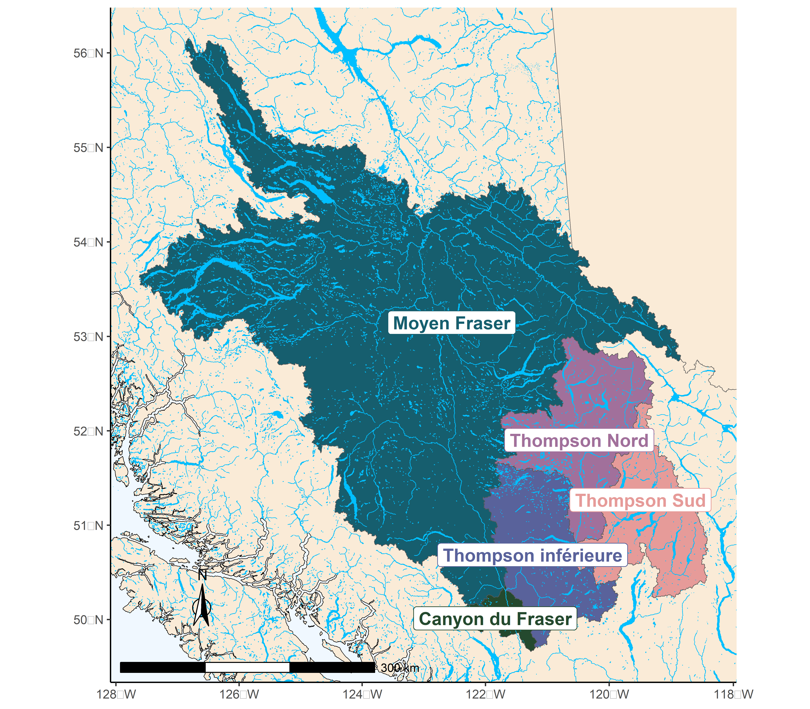
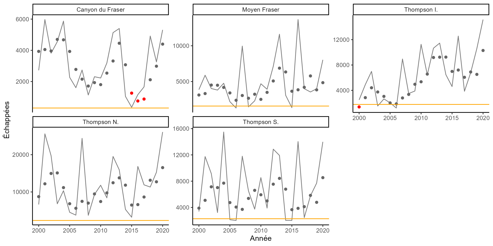
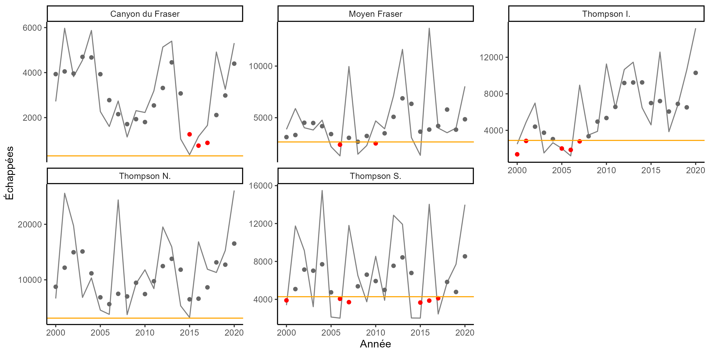
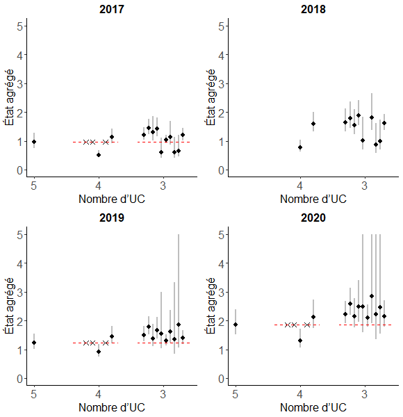

---
output:
  word_document: default
  html_document: default
  pdf_document: default
---

\
&nbsp;

# ÉTUDE DE CAS 1 : SAUMON COHO DU FRASER INTÉRIEUR{#IFCChapter}


## CONTEXTE

L’UGS du saumon coho du Fraser intérieur convient bien pour illustrer les PRL fondés sur l’abondance agrégée en raison de la longue histoire d’utilisation des cibles de rétablissement fondées sur l’abondance agrégée et des points de référence des pêches à l’échelle de l’UGS. Ceux-ci reposent sur une relation sous-jacente entre l’abondance agrégée et la répartition de l’abondance entre les sous-populations et les UC. De plus, il s’agit d’une UGS relativement riche en données avec des séries chronologiques sur la relation géniteurs-recrutement qui sont disponibles pour toutes les UC à compter de 1998.

Cette UGS comprend les saumons cohos qui fraient dans le fleuve Fraser et ses affluents en amont de Hells Gate dans le canyon du Fraser. Comme la plupart des saumons cohos, ceux du Fraser intérieur passent au moins une année complète en eau douce comme alevins avant de migrer vers l’océan comme smolts [@arbeiderInteriorFraserCoho2020]. La plupart (88 %) des saumons cohos du Fraser intérieur ont un cycle biologique de trois ans au cours duquel ils quittent l’eau douce lors de leur deuxième année et passent 18 mois en mer avant de retourner à leur réseau hydrographique natal pour frayer. Les 12 % restants ont un cycle biologique de quatre ans au cours duquel ils passent une année supplémentaire en eau douce avant de migrer en tant que smolts lors de leur troisième année. Les saumons ayant un cycle biologique de trois et de quatre ans passent 18 mois en mer. On croit que moins de 1 % des saumons cohos du Fraser intérieur reviennent à la frayère sous forme d’unibermarins (mâles matures précoces qui ne passent que six mois en mer) ou à une âge supérieur à quatre ans [@arbeiderInteriorFraserCoho2020].

Cinq UC selon la PSS ont été recensées pour le saumon coho du Fraser intérieur en fonction de la génétique et de la séparation géographique, soit celles du moyen Fraser, du canyon du Fraser, de la  Thompson inférieure, de la Thompson Nord et de la Thompson Sud (figure \@ref(fig:coho-map)) [@dfoWildSalmonPolicy2015]. Les travaux antérieurs de l’équipe de rétablissement du saumon coho du Fraser intérieur ont permis de recenser 11 sous-populations nichant dans ces cinq UC et d’élaborer des objectifs de rétablissement fondés sur le maintien de l’abondance au-dessus d’un seuil de 1 000 géniteurs dans chacune de ces sous-populations [@ifcrtConservationStrategyCoho2006, tableau \@ref(tab:cohoCU2SP)]. Les délimitations des sous-populations étaient fondées sur plusieurs facteurs, notamment la présence d’obstacles naturels, l’influence de grands lacs sur les régimes de débit en aval et les régimes thermiques, les observations de regroupements de géniteurs dans des conditions de débit différentes et la différenciation génétique. Les 11 sous-populations sont décrites en détail par le @ifcrtConservationStrategyCoho2006.

Seule la partie supérieure de l’aire de répartition de l’UC du canyon du Fraser (en amont de Hells Gate sur le fleuve Fraser) est incluse dans notre délimitation du saumon coho du Fraser intérieur. Cette délimitation est conforme aux analyses précédentes pour cette UGS (p. ex., @arbeiderInteriorFraserCoho2020). Par conséquent, Nahatlatch est la seule sous-population incluse dans notre description de l’UC du canyon du Fraser. Le ruisseau Kawkawa, situé au sud du canyon du Fraser près de Hope, en Colombie-Britannique, n’est pas inclus dans les données que nous utilisons.

\
&nbsp;
&nbsp;

```{r coho-map, fig.cap="Aire de répartition de l’UGS du saumon coho du Fraser intérieur, y compris les cinq UC qui composent l’UGS. Seule la partie supérieure de l’UC du canyon du Fraser (en amont de Hells Gate) est illustrée ici pour correspondre à l’échelle spatiale des données qui ont été utilisées pour les analyses.", out.width = '65%', warning=FALSE, echo=FALSE, fig.align="center"}

```


+-----------------------+--------------------------------+
| Unité de conservation | Sous-populations                  
+=======================+==================================================+
| Moyen Fraser          | - Moyen Fraser          
|                       | - Moyen Fraser supérieur
+-----------------------+--------------------------------------------------+    
| Canyon du Fraser      | - Nahatlatch          
+-----------------------+--------------------------------------------------+ 
| Thompson inférieure   | - Thompson inférieure          
|                       | - Nicola
+-----------------------+--------------------------------------------------+
| Thompson Nord         | - Thompson Nord inférieure      
|                       | - Moyenne Thompson
|                       | - Thompson Nord supérieure
+-----------------------+--------------------------------------------------+
| Thompson Sud          | - Bassin hydrographique de la rivière Adams      
|                       | - Cours inférieur et moyen de la rivière Shuswap
|                       | - Affluents du lac Shuswap
+-----------------------+--------------------------------------------------+

Table: (\#tab:cohoCU2SP) Unités de conservation du saumon coho du Fraser intérieur et sous-populations connexes. Veuillez noter que la définition de ces sous-populations, y compris leurs limites cartographiées, est fournie dans @ifcrtConservationStrategyCoho2006.

\newpage

La mise en valeur au moyen d’écloseries a eu lieu et continue de se produire dans certaines parties de l’UGS du saumon coho du Fraser intérieur. Deux UC sont actuellement considérées comme comportant des populations sauvages selon les critères établis par @withlerGeneticallyBasedTargets2018 (c’est-à-dire qu’il n’y a pas de programme d’écloserie; la proportion de poissons provenant d’écloseries hors du bassin hydrographique est limitée à moins de 3 % par année), tandis que les trois autres sont considérées comme comportant des populations sauvages intégrées (c’est-à-dire avec des valeurs d’influence naturelle proportionnelle, INP, de fort probablement $\geq$ 0,72; M. Arbeider, comm. pers.). Dans les populations sauvages intégrées, la plupart des poissons sont considérés comme « sauvages » selon la PSS, leurs parents étant nés dans un environnement naturel. L’UC de la Thompson inférieure présentait des niveaux plus élevés de mise en valeur au moyen d’écloseries entre 1998 et 2005, de sorte qu’on aurait probablement considéré qu’il s’agissait d’une population en transition intégrée (0,5 $\leq$ INP < 0,72) au cours de cette période.

Les cinq UC de saumon coho du Fraser intérieur ont historiquement affiché des niveaux relativement élevés de covariation dans les échappées, avec une corrélation moyenne de 0,56 dans l’abondance des géniteurs entre les UC. La similarité entre les réponses des UC aux facteurs environnementaux et anthropiques est confirmée par l’application des quatre critères proposés par @holtGuidelinesDefiningLimitInpress pour évaluer dans quelle mesure on peut déduire l’état des UC pour lesquelles les données sont insuffisantes à partir des UC pour lesquelles il y a des données. Un résumé de notre considération de ces critères pour le saumon coho du Fraser intérieur est présenté à l’annexe \@ref(app:coho-appendix). Les résultats ont montré que les UC de saumon coho du Fraser intérieur présentent de nombreuses caractéristiques communes. Nous avons trouvé peu d’indicateurs significatifs qui nous auraient empêchés de déduire l’état d’une UC à partir d’une UC voisine avant nos analyses d’études de cas.

Le saumon coho du Fraser intérieur est inclus dans le premier lot de grands stocks de poissons proposés aux fins de réglementation en vertu des dispositions sur les stocks de poissons de la *Loi sur les pêches* révisée, ce qui nécessite l’élaboration de PRL pour l’UGS correspondante.

### Évaluations précédentes


Le déclin de l’abondance des géniteurs chez le saumon coho du Fraser intérieur tout au long des années 1990 a mené à une série de mesures de gestion destinées à promouvoir le rétablissement, y compris d’importantes restrictions visant les pêches à compter de 1998 [@deckerAssessmentInteriorFraser2014]. Les données probantes d’un nouveau régime de productivité plus faible à partir de l’année de montaison de 1994 ont été bien documentées, coïncidant avec le déclin de l’abondance des géniteurs [@deckerAssessmentInteriorFraser2014]. En 2002, le Comité sur la situation des espèces en péril au Canada (COSEPAC) a désigné l’UGS de saumon coho du Fraser intérieur comme étant « en voie de disparition » en l’évaluant comme une seule « unité désignable » (UD).

Les travaux ultérieurs de l’équipe responsable du rétablissement du saumon coho du Fraser intérieur (ERCFI) ont abouti à un programme de conservation décrivant les objectifs de rétablissement à court et à long terme pour l’unité de gestion [@ifcrtConservationStrategyCoho2006]. En 2014, Decker et ses collaborateurs ont évalué l’état par rapport aux objectifs de 2006 établis par l’ERCFI et ont conclu que le saumon coho du Fraser intérieur avait dépassé la cible de rétablissement à court terme chaque année depuis 2008, et qu’il avait dépassé la cible de rétablissement à long terme au cours des deux dernières années de montaison (2012 et 2013). De plus, en 2014, le saumon coho du Fraser intérieur a été évalué selon la PSS du MPO. L’évaluation intégrée de l’état selon la PSS a classé l’état de trois de ces UC (moyen Fraser, canyon du Fraser, Thompson Sud) comme se trouvant en zone ambre et les deux autres en zone ambre/verte [basse Thompson et Thompson Nord; @dfoWildSalmonPolicy2015]. Dans le cadre de l’évaluation selon la PSS, on a estimé G~gén~ et G~RMD~ pour chaque UC et on les a utilisés avec d’autres points de référence pour déterminer l’état intégré de l’UC. Une évaluation subséquente du COSEPAC en 2016 a fait passer l’évaluation de l’état du saumon coho du Fraser intérieur de « espèce en voie de disparition » à « espèce menacée » [@cosewicCOSEWICAssessmentStatus2016]. En 2018, le MPO a entrepris une évaluation du potentiel de rétablissement (EPR) pour le saumon coho du Fraser intérieur, qui décrit l’état, l’habitat, les menaces, les facteurs limitatifs liés au rétablissement, les cibles de rétablissement possibles et les projections de l’abondance pour l’UD, ainsi que des recommandations concernant l’atténuation et les dommages admissibles [@arbeiderInteriorFraserCoho2020].

### Historique des points de référence fondés sur l’abondance agrégée

Le saumon coho du Fraser intérieur présente une forte relation positive entre sa répartition spatiale et son abondance agrégée, qui a été utilisée comme base pour déterminer les cibles de rétablissement de l’abondance agrégée et les points de référence pour le groupe de stocks. À partir de 2006, l’ERCFI a établi un objectif de rétablissement d’une ou de plusieurs sous-populations viables dans chacune des cinq « populations », où la définition d’une population correspond à celle d’une UC aux termes de la PSS [@ifcrtConservationStrategyCoho2006]. Veuillez noter qu’à partir de ce point, nous utilisons le terme « UC » plutôt que « population » lorsqu’il est question des objectifs de rétablissement établis par l’ERCFI afin d’être cohérents avec la PSS. L’ERCFI a établi un objectif de rétablissement à court terme selon lequel l’échappée moyenne sur trois ans dans au moins la moitié des sous-populations de chacune des cinq UC devait dépasser 1 000 saumons cohos géniteurs d’origine naturelle, à l’exclusion des poissons d’écloserie qui fraient à l’état sauvage. En se fondant sur l’analyse de la relation entre l’abondance agrégée et le nombre d’UC qui ont atteint cet objectif à partir des données historiques, l’ERCFI a déterminé que la cible de rétablissement à court terme de l’abondance était de 20 000 géniteurs, soit le niveau requis pour atteindre son objectif de répartition. De plus, l’ERCFI a établi une cible de rétablissement à long terme de 40 000 géniteurs, ce qui représente un niveau qui devrait maintenir 1 000 saumons cohos sauvages ou plus dans les 11 sous-populations. @deckerAssessmentInteriorFraser2014 ont mis à jour l’analyse initiale de l’ERCFI à l’aide d’une série chronologique plus longue de données sur les échappées. Ils ont également quantifié la relation entre l’abondance agrégée et la répartition en utilisant une régression logistique pour estimer la probabilité d’atteindre les objectifs de rétablissement à court et à long terme en fonction de l’abondance agrégée. Ils ont conclu que des niveaux d’abondance agrégée des géniteurs de 20 000 et de 40 000 aboutiraient à une probabilité de près de 100 % que les objectifs à court terme et les objectifs de rétablissement à long terme de l’ERCFI soient atteints, respectivement.


@kormanEvaluationFrameworkAssessing2019 ont également utilisé des régressions logistiques de la relation entre les objectifs de répartition de l’ERCFI et l’abondance agrégée lorsqu’ils ont évalué la façon dont les taux de survie liés à l’exploitation et ceux du stade de smolt au stade d’adulte ont influé sur la capacité du saumon coho du Fraser intérieur d’atteindre les objectifs de conservation. Leur approche était semblable à celle de @deckerAssessmentInteriorFraser2014, sauf qu’ils ont appliqué des régressions logistiques à l’échelle de l'UC plutôt qu’à l’échelle de l’UGS. À l’aide de cette approche, ils ont calculé la probabilité que les objectifs liés aux sous-populations établis par l’ERCFI aient été atteints en fonction de l’échappée totale par rapport aux UC dans le cadre de leur évaluation par simulation. Au moment d’évaluer dans quelle mesure les objectifs de conservation ont été atteints à l’échelle de l’UGS, ils ont choisi de se fier aux valeurs antérieures de 20 000 et 40 000 déterminées par l’ERCFI plutôt que de mettre à jour ces valeurs. Enfin, l’EPR de 2018 a utilisé une régression logistique mise à jour pour déterminer une cible de rétablissement à long terme pour le saumon coho du Fraser intérieur qui a atteint l’objectif à long terme de l’ERCFI de 1 000 géniteurs dans toutes les sous-populations [@arbeiderInteriorFraserCoho2020]. Par conséquent, @arbeiderInteriorFraserCoho2020 ont recommandé que la cible de rétablissement à long terme pour le saumon coho du Fraser intérieur soit une abondance moyenne géométrique sur trois ans de 35 935 géniteurs d’origine naturelle.


## DONNÉES{#cohoData}

Les données de cette étude de cas couvrent les années de montaison allant de 1998 à 2020. Les données antérieures à 1998 n’ont pas été utilisées en raison du manque d’uniformité des méthodes d’évaluation et de la qualité des données. Toutes les données sur le saumon coho du Fraser intérieur ont été fournies par l’unité d’évaluation des stocks du fleuve Fraser du MPO (M. Arbeider, MPO, Kamploops, C.-B., comm. pers.). Ces données comprenaient : (i) l’abondance annuelle des géniteurs par UC (1998-2020); (ii) recrues d’origine naturelle selon l’âge par UC par année (années d’éclosion 1998 à 2016); (iii) un indice du taux de survie du stade de smolt au stade d’adulte chez les individus d’écloserie; (iv) les taux d’exploitation annuels; (v) l’abondance annuelle des géniteurs pour les onze sous-populations faisant partie des cinq UC.


Deux types de séries chronologiques de l’abondance des géniteurs ont été fournis : le nombre total de géniteurs et le nombre de géniteurs d’origine naturelle en montaison (parfois appelé « remonte naturelle »). Le premier type, le nombre total de géniteurs, comprend à la fois les géniteurs d’origine naturelle et les géniteurs provenant d’écloseries, mais qui ont effectué une montaison de façon naturelle. Toutefois, il exclut les poissons retirés du cours d’eau pour utilisation dans les stocks de géniteurs des écloseries. Dans le cadre de la modélisation de la dynamique entre les géniteurs et les recrues, le nombre total de géniteurs a été jumelé au recrutement d’origine naturelle, de sorte que la productivité estimée de tous les géniteurs a été entièrement saisie. Le deuxième type de série chronologique de l’abondance des géniteurs, la remonte naturelle pour la fraie, comprenait seulement les poissons d’origine naturelle retournant à leur rivière natale pour frayer, y compris les géniteurs provenant d’écloseries. La remonte naturelle pour la fraie a été utilisée pour comparer l’abondance des géniteurs aux points de référence des UC ou aux PRL à l’échelle de l’UGS afin d’estimer l’état à l’échelle de l’UC ou de l’UGS.


Les données étaient semblables à celles décrites dans @arbeiderInteriorFraserCoho2020; les traitements, les hypothèses, le remplissage et la qualité des données sont décrits en détail dans ce document. Les mises à jour les plus récentes qui ne sont pas décrites dans @arbeiderInteriorFraserCoho2020 comprennent l’intégration de trois années supplémentaires de données (années de montaison 2018 à 2020; années d’éclosion 2014 à 2016), des mises à jour de l’indice du taux de survie du stade de smolt à celui d’adulte à l’échelle de l’UGS pour utiliser une moyenne pondérée par taille au moment du lâcher, et un examen amélioré de la qualité des données sur l’âge d’après des écailles utilisées pour calculer la proportion de recrues selon l’âge (M. Arbeider, MPO, Kamploops, C.-B., comm. pers.).


La série chronologique des taux d’exploitation est une importante source d’incertitude pour le saumon coho du Fraser intérieur. Les taux d’exploitation ne sont disponibles qu’à l’échelle de l’UGS, de sorte qu’ils sont présumés identiques dans toutes les UC. Il est peu probable que cette hypothèse soit vraie en raison des différences connues en matière de pêches en eau douce entre les UC. De plus, les modèles utilisés pour reconstituer les taux d’exploitation nécessitent un grand nombre d’hypothèses qui devraient être erronées [@arbeiderInteriorFraserCoho2020]. Étant donné que les séries chronologiques des taux d’exploitation sont utilisées pour reconstruire les séries chronologiques du recrutement, les erreurs dans les taux d’exploitation se propageront jusqu’aux estimations des paramètres de stock-recrutement, aux points de référence de l’abondance relative comme G~gén~, et à la covariation dans les résidus du recrutement. D’autres sources d’incertitude dans les ensembles de données sur le saumon coho du Fraser intérieur comprennent les erreurs d’observation dans les estimations de l’abondance des géniteurs et les estimations de l’âge au moment de l’échappée. Les estimations de l’abondance des géniteurs sont en grande partie calculées à partir de relevés visuels, pour lesquels l’efficacité des observateurs n’est pas estimée et la durée des relevés est difficile à estimer avec exactitude. Le prélèvement d’écailles pour déterminer la structure selon l’âge est incomplet à l’échelle de l’UC avec de petites tailles d’échantillon, des données manquantes et une représentation spatiale limitée au sein des UC au cours de certaines années [@kormanEvaluationFrameworkAssessing2019].


## ESTIMATION DE L’ÉTAT DES UC

Nous utilisons trois autres façons de caractériser l’état des UC lors de l’élaboration des PRL pour le saumon coho du Fraser intérieur : 1) des estimations multidimensionnelles de l’état calculées à partir de l’Explorateur, 2) l’abondance à l’échelle de l'UC par rapport à G~gén~ comme PRI de l’abondance, et 3) la répartition de l’abondance des géniteurs par rapport aux cibles de répartition établies par l’ERCFI.


La première approche, qui utilise l’Explorateur élaboré par le programme sur l’état des saumons (section \@ref(rapidToolMethods)), est conforme à la PSS du Canada. Les deux autres approches sont principalement utilisées pour élaborer des PRL fondés sur l’abondance agrégée dans la présente étude de cas, ainsi que comme point de comparaison avec l’Explorateur.


La deuxième approche consiste à comparer l’abondance actuelle et l’estimation de G~gén~ pour chaque UC, où l’état d’une UC est considéré comme étant en zone rouge lorsque l’abondance est inférieure à G~gén~. La valeur de G~gén~ représente le nombre de géniteurs requis pour le rétablissement à G~RMD~ (géniteurs au rendement maximal durable) en une génération, dans des conditions d’équilibre en l’absence de pêche [@holtIndicatorsStatusBenchmarks2009]. G~gén~ est l’un des nombreux points de référence disponibles pour l’attribution de l’état multidimensionnel d’une UC dans les évaluations intégrées de l’état selon la PSS et l’Explorateur. Il représente un PRI entre les zones d’état rouge et ambre et a été utilisé dans le cadre de l’évaluation intégrée de l’état du saumon coho du Fraser intérieur en 2014 [@dfoWildSalmonPolicy2015]. Bien que les estimations de l’état des UC par rapport à G~gén~ soient des résultats facilement accessibles à partir de l’Explorateur, nous avons calculé ce paramètre sans avoir recours à l’outil pour nos études de cas.


La troisième approche est fondée sur la répartition des échappées de géniteurs parmi les sous-populations nichant dans les UC (tableau \@ref(tab:cohoCU2SP)). Nous appliquons cette approche pour le saumon coho du Fraser intérieur afin de maintenir la cohérence avec les processus antérieurs de planification du rétablissement pour cette UGS [@ifcrtConservationStrategyCoho2006; @arbeiderInteriorFraserCoho2020]. Étant donné que la cible de répartition que nous utilisons a été initialement élaborée par l’ERCFI en 2006, nous l’appelons « cible de répartition de l’ERCFI ». Plus précisément, nous utilisons l’objectif de rétablissement à court terme de l’ERCFI selon lequel l’échappée moyenne géométrique sur trois ans dans au moins la moitié des sous-populations de chacune des cinq UC doit dépasser 1 000 géniteurs d’origine sauvage, à l’exclusion des poissons d’écloserie qui fraient à l’état sauvage. Nous avons choisi la cible de rétablissement à court terme comme approximation pour le PRI dans notre étude de cas parce que, comme l’a souligné @arbeiderInteriorFraserCoho2020, la cible à court terme a été conçue comme cible immédiate lorsqu’une population est en voie de disparition. À ce titre, elle a été interprétée comme un niveau devant empêcher la disparition ou la perte de la diversité génétique. Nous avons inclus cette troisième approche pour définir l’état des UC afin de démontrer la gamme d’approches et de paramètres qui peuvent être utilisés, et de démontrer la sensibilité du PRL au choix des paramètres pour déterminer l’état des UC. Les prochaines itérations de l’approche de l’Explorateur pourraient comprendre des paramètres de répartition comme ceux qui sont utilisés dans l’approche de l’ERCFI.


### Estimation de G~gén~{#cohoSgen}

Des estimations de G~gén~ sont nécessaires pour évaluer l’état des UC à l’aide de l’algorithme multidimensionnel de l’Explorateur et de la comparaison de l’abondance actuelle des UC à G~gén~. Alors que l’application de l’Explorateur aux UC de saumon coho du Fraser intérieur dans Pestal et al. (en préparation) s’appuie sur les estimations évaluées par les pairs de G~gén~ tirées de l’évaluation intégrée de l’état selon la PSS [@dfoWildSalmonPolicy2015], nous estimons de nouveau G~gén~ ici à l’aide des données mises à jour jusqu’en 2020. De plus, nous explorons d’autres formulations de modèles de stock-recrutement pour mieux comprendre comment les hypothèses du modèle à l’échelle de l'UC influent sur les estimations du PRL qui en résultent.


Deux formulations différentes du modèle de stock-recrutement ont été utilisées pour estimer G~gén~ : (i) un modèle de Ricker de base, qui comprend une covariable de la survie du stade de smolt à celui d’adulte, et (ii) une forme de substitution du modèle de Ricker dans laquelle une distribution a priori informative est utilisée pour augmenter G~REM~ par rapport au modèle de base, appelé « Ricker_aprioriCap ». G~REM~ est le niveau d’abondance des géniteurs auquel le stock se remplace; la relation entre G~REM~ et les paramètres du modèle de stock-recrutement de Ricker est illustrée ci-dessous (équation \@ref(eq:beta-Srep)). Ces deux modèles ont déjà été élaborés et appliqués aux UC de saumon coho du Fraser intérieur. La covariable de la survie du stade de smolt à celui d’adulte utilisée pour les deux modèles est un indice du taux de survie des smolts d’écloserie jusqu’au stade d’adulte. L’indice n’est pas propre à une UC; le même indice s’applique à toutes les UC. Un troisième modèle de Ricker, dans lequel un a priori informatif sur G~REM~ et la mortalité anticompensatoire ont été inclus, a également été utilisé par @kormanEvaluationFrameworkAssessing2019  et @arbeiderInteriorFraserCoho2020; cependant, nous ne l’avons pas inclus dans notre étude de cas par souci de simplicité. Comme l’a fait remarquer @kormanEvaluationFrameworkAssessing2019, il n’y a aucune indication dans les données disponibles d’une dynamique anticompensatoire, et l’ajustement du modèle stock-recrutement à la mortalité anticompensatoire a exigé une hypothèse très incertaine au sujet du niveau d’échappée auquel l’anticompensation a lieu. De plus, les critères officiels de sélection du modèle ont montré que l’ajout de la mortalité anticompensatoire dans les modèles entraînait une réduction de l’ajustement du modèle [@kormanEvaluationFrameworkAssessing2019].


@kormanEvaluationFrameworkAssessing2019  et @arbeiderInteriorFraserCoho2020  ont utilisé une structure de modèle hiérarchique pour les modèles Ricker de base et Ricker_aprioriCap en supposant que les paramètres de productivité à l’échelle de l'UC étaient échantillonnés à partir d’une distribution normale commune partagée par toutes les UC. À l’aide des critères officiels de sélection des modèles (c’est-à-dire les CID), @kormanEvaluationFrameworkAssessing2019 ont constaté un soutien plus élevé pour la structure hiérarchique que lorsque les paramètres de productivité étaient présumés indépendants entre les UC. Cependant, notre examen initial de l’approche hiérarchique appliquée à l’ensemble de données mis à jour nous a amenés à choisir l’approche indépendante de l’UC pour notre évaluation. Premièrement, nous avons constaté que les estimations du PRL étaient sensibles à l’écart-type présumé pour l’hyperdistribution a priori pour le paramètre de productivité. L’utilisation de l’approche de modèle particulier a éliminé l’influence a priori des résultats du modèle. Deuxièmement, une régression logistique ajustée aux estimations de l’état obtenues à l’aide du modèle hiérarchique n’a pu converger vers une solution au cours de plusieurs années entre 2015 et 2020, y compris l’année la plus récente (2020).


Les analyses futures de la relation stock-recrutement pour le saumon coho du Fraser intérieur pourraient vouloir revoir l’approche hiérarchique de la modélisation de la productivité. Les distributions bayésiennes a posteriori du paramètre de la productivité à partir des ajustements de notre modèle particulier montrent certaines différences de productivité entre les UC (en particulier pour l’UC du canyon du Fraser; annexe \@ref(app:coho-appendix)). Cependant, il y avait un chevauchement important des distributions à l’échelle de l'UC pour toutes les autres UC. Nous ne nous attendons pas à ce que notre décision d’appliquer une approche de modélisation propre au stock ait une incidence sur nos conclusions générales. Dans les analyses préliminaires, les PRL étaient semblables entre les approches de modélisation individuelle et hiérarchique.


Les formulations des deux modèles de stock-recrutement sont décrites ci-dessous.


&nbsp;


***Modèle 1 : Ricker***

La formulation du modèle de stock-recrutement de Ricker de base était la suivante :

\begin{equation}
  R_{i,a,t} = P_{i,a,t-a}S_{i,t-a}e^{log(\alpha_i) + \gamma log(m_{t-1})-\beta_i G_{i,t-a} - \sigma_{v_i}^2/2}
   (\#eq:rickerSurv-IM)
\end{equation}
\begin{equation}
  v_i \sim Normal(0,\sigma_{v_i})
\end{equation}

où

$R = le nombre prévu de recrues d’origine naturelle de l’UC $i$  de l’âge $a$  qui reviennent à la frayère dans l’année $t$ (c’est‑à‑dire les recrues produites par échappée au cours de l’année d’éclosion $t-a$)

$P_{i,a,t-a}$ = la proportion de recrutement de l’UC $i$  qui revient à la frayère à l’âge $a$  de l’année d’éclosion $t-a$

$G_{i,t-a}$  = géniteurs de l’UC $i$  dans l’année d’éclosion $t-a$

$\alpha_i$  = paramètre de productivité pour l’UC $i$

$\gamma$   = coefficient de survie du stade de smolt à celui d’adulte partagé entre les UC

$m_{t-1}$  = indice de survie des smolts d’écloserie jusqu’au stade d’adulte partagé entre les UC pour l’entrée en mer au cours de l’année t-1

$\beta_i$  = terme dépendant de la densité décrivant le taux de diminution de la survie dépendant de la densité pour l’UC $i$, avec l’augmentation de l’abondance des géniteurs

$\sigma_{v_i}$  = écart-type d’erreur de processus sur les écarts de recrutement


Le recrutement total à partir d’une année d’éclosion, $AE$, est calculé comme la somme des recrues d’âge 3 et 4 au cours d’années consécutives,

\begin{equation}
  R_{i,AE} = R_{i,a=3,AE} + R_{i,a=4,AE}
   (\#eq:rickerSurv-IM-AE)
\end{equation}

On a supposé que les observations de $ln(R_{AE} /G_{AE})$  étaient des variables aléatoires à distribution normale avec un écart-type de $\sigma_{v_i}$.

Cette formulation de modèle est similaire à celle du modèle de Ricker utilisé dans @arbeiderInteriorFraserCoho2020, mais sans structure hiérarchique imposée à $log(\alpha_i)$.. Nous avons placé les contraintes non informatives suivantes sur la fonction de probabilité pour répliquer la routine d’ajustement du modèle bayésien de @arbeiderInteriorFraserCoho2020 :

\begin{equation}
  \gamma \sim Normal(0, 10)
\end{equation}
\begin{equation}
  \sigma_{v_i} \sim Inverse Gamma (0,1, 0,1)
\end{equation}


&nbsp;

***Modèle 2 : Ricker_aprioriCap***

Pour maintenir la cohérence avec les travaux précédents sur le saumon coho du Fraser intérieur, nous envisageons également une version du modèle de Ricker qui utilise une distribution a priori informative sur G~REM~ pour augmenter la capacité de charge. @kormanEvaluationFrameworkAssessing2019 ont suggéré que le modèle de Ricker avec une covariable de la survie du stade de smolt à celui d’adulte (modèle 1) surestimait la dynamique compensatoire à une abondance élevée des géniteurs lorsqu’il n’était appliqué qu’aux données à partir de 1998. Ils ont noté que l’abondance des géniteurs depuis 1998 a été beaucoup plus faible que les niveaux historiques. Étant donné que la rareté des données sur l’abondance élevée des géniteurs rend difficile l’estimation de la capacité de charge, les estimations de base de la capacité de charge de Ricker peuvent ne pas être fiables [@kormanEvaluationFrameworkAssessing2019]. De plus, ils ont observé qu’une lignée a persisté à une abondance des géniteurs relativement plus élevée et plus stable que les deux autres, ce qu’ils ont considéré comme une preuve d’une capacité supérieure à celle que le modèle de Ricker de base avait estimée. Compte tenu de ces préoccupations, @kormanEvaluationFrameworkAssessing2019 ont proposé un modèle de Ricker de rechange qui utilisait une distribution a priori informative pour augmenter la capacité de charge (représentée par l’abondance des géniteurs à laquelle le stock se remplace, G~REM~). @arbeiderInteriorFraserCoho2020 ont suivi l’approche de @kormanEvaluationFrameworkAssessing2019  en considérant à la fois le modèle de Ricker de base et une version du modèle Ricker ayant une distribution a priori informative sur G~REM~ étant plausible lors de la prestation d’avis de gestion.


\begin{equation}
  \beta_i = \frac{\alpha_i + \gamma + log(\overline{m})}{G_{REM,i}}
   (\#eq:beta-Srep)
\end{equation}
\begin{equation}
  G_{REM,i} \sim Normal(\mu_{GREM},\sigma_{GREM})
\end{equation}


@arbeiderInteriorFraserCoho2020  et @kormanEvaluationFrameworkAssessing2019  ont établi $\mu_{G_{REM}}$ à 1,5 fois la valeur de G~REM~ estimée à partir de l’ajustement du modèle de base sans a priori sur G~REM~. Pour notre ajustement du modèle (décrit dans la section \@ref(logistic)), nous avons constaté que nous devions limiter $\mu_{GREM}$ à un maximum de 1,4 fois la valeur de G~REM~ afin de parvenir à la convergence du modèle, alors nous avons plutôt utilisé l’expansion de 1,4 fois. Nous avons établi $\sigma_{GREM}$ à $\sqrt{2} \times 1 000 = 1 414$ géniteurs, ce qui correspond à la même valeur utilisée par @arbeiderInteriorFraserCoho2020. Il est à noter que le terme "$\times 1 000$" est utilisé pour mettre à l’échelle l’abondance des géniteurs de 1/1 000 lors de l’ajustement des modèles. L’effet de l’ajout de l’a priori sur G~REM~ lors de l’ajustement de modèles particuliers aux données disponibles est illustré à la figure \@ref(fig:coho-SR-fit).

&nbsp;

***Calcul de Ggén***

L’inclusion d’une covariable du taux de survie du stade de smolt à celui d’adulte dans les deux modèles de stock-recrutement signifie que la productivité réalisée change d’une année à l’autre en fonction du taux de survie. Nous avons intégré cet ajustement dans nos calculs de G~gén~ en calculant d’abord la productivité effective de chaque UC comme suit :

\begin{equation}
  log(\alpha'_{i}) = log(\alpha_i) + \gamma log(\overline{m})
   (\#eq:adjProd)
\end{equation}

où $\overline{m}$ est le taux moyen de survie du stade de smolt à celui d’adulte au cours de la série chronologique disponible.

G~RMD~ a été calculé comme une fonction de log($\alpha_i'$)  et $\beta_i$ en utilisant :

\begin{equation}
  G_{RMD, i} = 1 - \frac{W(e^ 1-\alpha'_i)}{\beta_i}
   (\#eq:Smsy)
\end{equation}

où $W$ représente la fonction W de Lambert [@scheuerellExplicitSolutionCalculating2016]. G~gén~  a ensuite été calculé numériquement en résolvant l’équation suivante :

\begin{equation}
  G_{RMD,i} = \alpha'_{i} G_{gén,i} e^{-\beta_i \cdot S_{gen,i}}
  (\#eq:Sgen)
\end{equation}

\linebreak


```{r coho-SR-fit, echo=FALSE, fig.align="center", fig.cap="Courbes de la relation géniteurs-recrutement ajustées aux données sur les géniteurs et le recrutement à l’aide de modèles individuels pour chaque UC. Les lignes noires pleines indiquent l’ajustement de l’estimation correspondant à un maximum de vraisemblance pour le modèle de Ricker de base, tandis que les lignes bleues pleines indiquent l’ajustement de l’estimation correspondant à un maximum de vraisemblance pour le modèle de Ricker\\_aprioriCap. Les zones associées ombrées en noir et en bleu montrent les intervalles de confiance de 95 \\% des ajustements de modèle respectifs en utilisant le taux de survie moyen à long terme du stade de smolt à celui d’adulte de la série chronologique disponible. Les lignes rouges indiquent la ligne de remplacement.", out.width = '85%', warning=FALSE}

```


\linebreak


## ESTIMATION DES PRL FONDÉS SUR L’ÉTAT DES UC


### Méthodes

Pour obtenir les PRL fondés sur l’état des UC, nous avons calculé la proportion d’UC qui présentaient des états multidimensionnels selon l’Explorateur au-dessus de la zone rouge. L’état a été évalué comme étant inférieur au PRL au cours des années où l’état d’une ou de plusieurs UC a été évalué comme étant en zone rouge. Les deux formulations du modèle de Ricker décrites ci-dessus ont été utilisées pour estimer les points de référence fondés sur l’abondance (PRI = G~gén~  et PRS = 0,8G~RMD~) lors de l’évaluation de l’état selon l’Explorateur : le modèle de Ricker de base et le modèle Ricker_aprioriCap. Les estimations de G~gén~  et de G~RMD~ ont été réalisées à l’aide de toutes les données disponibles jusqu’en 2020.


À titre de comparaison, nous avons également calculé les PRL à partir de la proportion d’UC dont l’abondance moyenne générationnelle récente (trois ans) des géniteurs était supérieure à G~gén~  et de la proportion d’UC qui n’ont pas atteint la cible de répartition de l’ERCFI d’au moins la moitié de toutes les sous-populations dans chaque UC comptant plus de 1 000 géniteurs.

### Résultats

Les estimations de G~gén~ fondées sur le modèle Ricker_aprioriCap étaient plus élevées que celles fondées sur le modèle de Ricker de base pour quatre des cinq UC (moyen Fraser, Thompson inférieure, Thompson Nord et Thompson Sud) et étaient à peu près égales pour la cinquième UC (canyon du Fraser; annexe \@ref(app:coho-appendix)). Par conséquent, l’abondance moyenne générationnelle des géniteurs était plus susceptible de tomber en deçà de G~gén~ lorsqu’elle a été estimée à l’aide du modèle Ricker_aprioriCap. Selon la formulation de base du modèle de Ricker, l’abondance moyenne générationnelle des géniteurs est demeurée supérieure à G~gén~ pour toutes les années entre 2000 et 2020 (figure \@ref(fig:coho-CU-multiDim-Ricker)). À titre de comparaison, sous la formulation du modèle Ricker_aprioriCap, l’abondance moyenne générationnelle est tombée en deçà de G~gén~ pour 5 des 21 années entre 2000 et 2020. Ces événements comprenaient l’UC de la Thompson inférieure (2006), l’UC du moyen Fraser (2006, 2008) et l’UC de la Thompson Sud (2000, 2006, 2007, 2015; figure \@ref(fig:coho-CU-multiDim-Ricker-Cap)). L’abondance des géniteurs des cinq UC était supérieure à G~gén~ en 2020, peu importe le modèle géniteurs-recrutement utilisé, ce qui indique que le stock serait supérieur à un PRL fondé sur l’état des UC basé sur G~gén~.


La fréquence des années au cours desquelles la cible de répartition de l’ERCFI n’a pas été atteinte pour une ou plusieurs UC était semblable à celle observée lorsque G~gén~ basé sur le modèle Ricker_aprioriCap a été utilisé, les cibles de répartition n’ayant pas été atteintes au cours de 4 des 21 années entre 2000 et 2020 (dépassées en 2006 et de 2015 à 2017). Huit des onze sous-populations ont vu l’échappée moyenne générationnelle chuter sous le seuil de 1 000 géniteurs en une ou plusieurs années (figure \@ref(fig:coho-Subpop-timeseries)). Les sous-populations avaient tendance à différer selon l’année où elles tombaient sous le seuil de 1 000 géniteurs, ce qui signifiait que la cible de répartition d’au moins la moitié des sous-populations dans chaque UC comptant plus de 1 000 géniteurs était plus souvent atteinte qu’autrement. Les 11 sous-populations présentaient une abondance moyenne générationnelle des géniteurs supérieure à 1 000 individus en 2020, ce qui indique que le stock serait bien au-dessus d’un PRL fondé sur l’état des UC, selon la cible de répartition de l’ERCFI (figure \@ref(fig:coho-Subpop-timeseries)).

\newpage

```{r coho-CU-multiDim-Ricker, fig.cap="Séries chronologiques des échappées pour les UC de saumon coho du Fraser intérieur présentées sous forme d’échappées annuelles (lignes) et d’échappées moyennes géométriques sur trois ans (points). La première moyenne géométrique comprend les années 1998 à 2000. Les points gris indiquent les années où l’état de toutes les UC d’après une évaluation multidimensionnelle selon l’Explorateur était hors de la zone rouge lorsque G \\textsubscript{gén} a été estimé à l’aide du modèle de Ricker, tandis que les points rouges indiquent les années où l’état de l’une ou plusieurs UC était évalué comme étant en zone rouge, soit un dépassement du PRL. Les lignes orange indiquent l’estimation de G \\textsubscript{gén}.", warning=FALSE, echo=FALSE, out.width= '80%', fig.align="center"}

```

```{r coho-CU-multiDim-Ricker-Cap, fig.cap="Séries chronologiques des échappées pour les UC de saumon coho du Fraser intérieur présentées sous forme d’échappées annuelles (lignes) et d’échappées moyennes géométriques sur trois ans (points). Les points gris indiquent les années où l’état de toutes les UC d’après une évaluation multidimensionnelle selon l’Explorateur était hors de la zone rouge lorsque G\\textsubscript{gén} a été estimé à l’aide du modèle de Ricker\\_aprioriCap, tandis que les points rouges indiquent les années où l’état de l’une ou plusieurs UC était évalué comme étant en zone rouge, soit un dépassement du PRL. Les lignes orange indiquent les estimations de G\\textsubscript{gén}.", out.width= '80%', warning=FALSE, echo=FALSE, fig.align="center"}

```

\newpage


```{r coho-Subpop-timeseries, fig.cap="Séries chronologiques des échappées pour les 11 sous-populations de saumon coho du Fraser intérieur présentées sous forme d’échappées annuelles (lignes) et d’échappées moyennes géométriques sur trois ans (points). La première moyenne géométrique comprend les années 1998 à 2000. Les points gris indiquent les années où la moyenne géométrique des échappées sur trois ans était supérieure au seuil de 1 000 individus utilisé pour évaluer l’état selon la répartition, tandis que les points rouges indiquent les années où le seuil de 1 000 individus n’a pas été atteint. Les UC sont représentées par des colonnes avec des étiquettes le long de l’axe des y.", warning=FALSE, echo=FALSE, fig.align="center"}

```


L’état multidimensionnel calculé à partir de l’Explorateur est déterminé par les paramètres d’abondance de l’UGS. Étant donné que les données sur l’abondance absolue et les points de références fondés sur G~gén~ et G~RMD~ étaient disponibles, l’algorithme multidimensionnel de l’Explorateur (figure \@ref(fig:decision-tree)) attribuait le plus souvent l’état des UC en fonction de ce paramètre (figures \@ref(fig:coho-CU-multiDim-Ricker) et \@ref(fig:coho-CU-multiDim-Ricker-Cap)). Bien que l’état, dans certains cas, était également influencé par l’abondance absolue par rapport au seuil de 1 500 géniteurs. Cela s’est produit dans l’UC du canyon du Fraser entre 2015 et 2017. Au cours de ces années, la moyenne générationnelle de l’abondance absolue des géniteurs était inférieure à 1 500 géniteurs, et l’UC a été classée dans la zone d’état rouge dans le premier nœud de l’arbre décisionnel, même si l’abondance des géniteurs était supérieure à G~gén~.


Le nombre total d’années au cours desquelles un PRL aurait été dépassé au moyen de l’approche multidimensionnelle dépendait du modèle de stock-recrutement de Ricker utilisé pour estimer G~gén~. Lorsque l’état a été évalué à l’aide de points de référence fondés sur l’abondance estimés à partir du modèle de Ricker de base, un PRL fondé sur l’état des UC pour l’UGS aurait été dépassé au cours de 4 des 21 années. Pour trois de ces années, le dépassement était fondé sur le fait que l’abondance des géniteurs dans le canyon du Fraser était inférieure à 1 500 géniteurs (2015 à 2017), tandis que pour l’année supplémentaire (2000), il était attribuable au fait que l’UC de la Thompson inférieure présentait une abondance des géniteurs inférieure à G~gén~ (figure \@ref(fig:coho-CU-multiDim-Ricker)). En comparaison, lorsque l’état a été évalué à l’aide de points de référence fondés sur l’abondance à partir du modèle Ricker_aprioriCap, un PRL fondé sur l’état des UC aurait été dépassé au cours de 9 des 21 années (2000, 2001, 2005 à 2007, 2010, 2015 à 2017; figure \@ref(fig:coho-CU-multiDim-Ricker-Cap)). Pour les deux modèles de stock-recrutement, l’état multidimensionnel selon l’Explorateur était hors de la zone rouge pour toutes les UC en fonction de la moyenne générationnelle la plus récente, ce qui indique que l’UGS est actuellement au-dessus d’un PRL fondé sur l’état des UC, peu importe le modèle de stock-recrutement utilisé.


## ESTIMATION DES PRL FONDÉS SUR L’ABONDANCE AGRÉGÉE PAR RÉGRESSION LOGISTIQUE


### Méthodes{#logistic}

Nous présentons des PRL fondés sur l’abondance agrégée calculés à l’aide de la régression logistique, deux des points de référence sur le saumon coho du Fraser intérieur étant pris en compte : G~gén~ et la cible de répartition de l’ERCFI. Nous distinguons les deux modèles de stock-recrutement utilisés pour estimer G~gén~ ainsi : « Logistique : Ggén-Ricker » pour le modèles de Ricker et « Logistique : Ggén-aprioriCap » pour le modèle Ricker_aprioriCap, respectivement. Nous utilisons l’étiquette « Logistique : ERCFI » pour indiquer le cas où la cible de répartition de l’ERCFI a été utilisée pour élaborer le PRL fondé sur l’abondance agrégée au moyen de la régression logistique. Voir la section \@ref(logisticMethods) pour un aperçu de l’approche utilisée pour calculer les PRL fondés sur l’abondance agrégée à l’aide de la régression logistique.


Lors de l’estimation du PRL de régression logistique à l’aide de G~gén~, nous avons utilisé une approche de modélisation intégrée dans laquelle les valeurs de G~gén~ à l’échelle de l’UC et le PRL à l’échelle de l’UGS ont été estimés simultanément. Les modèles intégrés G~gén~-PRL avaient deux composantes :

(i) des modèles de stock-recrutement ajustés à chacune des cinq UC pour estimer G~gén~ à l’échelle de l’UC (équation \@ref(eq:rickerSurv-IM)  et équations \@ref(eq:adjProd) - \@ref(eq:Sgen));

(ii) un modèle de régression logistique ajusté aux données agrégées pour estimer le PRL comme l’abondance agrégée qui a été historiquement associée à une probabilité déterminée que toutes les UC se trouvent au-dessus de G~gén~ (équations \@ref(eq:logistic) - \@ref(eq:logisticLRP)).


Nous avons d’abord envisagé une troisième version du modèle de régression logistique, dans laquelle nous avons utilisé l’algorithme multidimensionnel de l’Explorateur pour caractériser l’état des UC. Les évaluations préliminaires du modèle nous ont amenés à exclure ce modèle en raison de son inadéquation. L’algorithme multidimensionnel repose sur la moyenne générationnelle (abondance lissée) pour évaluer l’état de chaque UC par rapport aux points de référence, tandis que notre approche de régression logistique utilise l’abondance agrégée brute (non lissée) comme variable explicative. Par conséquent, lorsque les régressions logistiques ont été ajustées aux estimations multidimensionnelles de l’état des UC, il y a eu un décalage dans le moment des hauts et des bas de l’abondance. Ce décalage a entraîné une relation faible/inexistante entre l’état à l’échelle de l’UGS et l’abondance brute (non lissée). De plus, l’utilisation de la moyenne générationnelle de l’abondance agrégée comme variable explicative dans l’ajustement de régression logistique, plutôt que celle des valeurs annuelles brutes de l’abondance, a entraîné une autocorrélation considérable des états.

&nbsp;

***Analyse rétrospective et analyse évaluant l’incidence des UC manquantes***


Nous avons utilisé des analyses rétrospectives pour examiner l’effet de la longueur des séries chronologiques sur les estimations du PRL de régression logistique. Pour chaque année entre 2010 et 2020, nous avons utilisé les données disponibles seulement jusqu’à cette année-là pour calculer les PRL et les intervalles de confiance connexes.

De plus, pour examiner l’effet des UC manquantes sur les estimations rétrospectives du PRL, nous avons calculé les PRL à l’aide des données d’un seul sous-ensemble des cinq UC de saumon coho du Fraser intérieur. Nous avons limité notre analyse aux données manquantes d’une ou de deux UC, de sorte que nous avions au moins trois UC de données disponibles pour calculer la proportion d’UC au-dessus de leurs points de référence. Pour chaque cas de données manquantes, nous avons calculé l’état agrégé à l’échelle de l’UGS comme suit :

\begin{equation}
  ÉtatAgr_t = \frac{\sum_{i}^{nCU} G_{i,t}}{PRL'_t}
   (\#eq:status)
\end{equation}

où $nUC$ correspond au nombre d’UC utilisées (3, 4 ou 5), $G_{i,t}$ correspond à l’abondance des géniteurs d’origine naturelle retournant à l’UC $i$  dans l’année $t$ (y compris les géniteurs retirés pour utilisation en écloserie), et $PRL'_t$ correspond au PRL calculé pour l’année $t$ en n’utilisant que les données de $nUC$. L’état à l’échelle de l’UGS pour une année donnée a été calculé pour toutes les combinaisons possibles d’UC disponibles (5 combinaisons lorsque $nUC$ = 4 et 10 combinaisons lorsque $nUC$ = 3) afin de permettre l’examen de la stabilité des estimations de l’état parmi les combinaisons disponibles. Les estimations de l’état à l’échelle de l’UGS par rapport aux PRL ont été utilisées pour comparer les scénarios d’UC manquantes plutôt que les estimations réelles du PRL, car l’ampleur du PRL variera selon le nombre et la combinaison des UC utilisées. Étant donné que les estimations de l’incertitude pour l’abondance des géniteurs ne sont pas disponibles, les intervalles de confiance sur l’état du PRL sont fondés uniquement sur des intervalles de confiance estimés à 95 % pour le PRL.


### Résultats


***Estimation des PRL***

Les ajustements du modèle de régression logistique en 2020 à partir des modèles intégrés Logistique : Ggén-Ricker, Logistique : Ggén-aprioriCap  et Logistique : ERCFI sont présentés à la figure \@ref(fig:coho-IM-logisticFit2020). Les trois méthodes de régression logistique concernant les PRL ont été en mesure de converger vers une solution en 2020. Les PRL obtenus pour différents seuils *p* sont indiqués sur les courbes de régression, ainsi que dans le tableau \@ref(tab:logisticLRPs2020). Il y avait beaucoup d’incertitude au sujet des courbes prévues, comme on le voit dans les grandes zones d’ombrage gris à la figure \@ref(fig:coho-IM-logisticFit2020).


```{r coho-IM-logisticFit2020, fig.cap="Ajustement de régression logistique à partir des trois modèles de régression logistique (Logistique : Ggén-Ricker, Logistique : Ggén-aprioriCap  et Logistique : ERCFI) à l’aide des données de 1998 à 2020. Les points représentent des années distinctes et le « x » représente la dernière année de la série chronologique. La ligne verticale jaune indique l’estimation du PRL en fonction de l’exigence d’une probabilité de 50\\% pour toutes les UC supérieures à Gtextsubscript{gén}, tandis que la région en jaune indique l’intervalle de confiance de 95\\% concernant le PRL. Les PRL pour trois autres seuils de probabilité, 66\\%, 90\\%, et 99\\%, sont indiqués en bleu, vert et orange, respectivement.", warning=FALSE, echo=FALSE, out.width = '90%', fig.align="center"}

```
\linebreak
  
Lorsque le modèle Logistique : Ggén-Ricker a été utilisé, les PRL fondés sur l’abondance agrégée variaient de 21 190 à 35 737 géniteurs, selon que la probabilité requise que toutes les UC se trouvent au-dessus de G~gén~ était modérée (50 %) ou très élevée (99 %) [tableau \@ref(tab:logisticLRPs2020)]. Les PRL ont augmenté à tous les niveaux de probabilité lorsque la capacité de charge a été présumée plus élevée selon le modèle Logistique : Ggén-aprioriCap  (tableau \@ref(tab:logisticLRPs2020)). Les valeurs de G~gén~ plus élevées pour la plupart des UC selon la formulation du modèle de rechange Logistique:Ggén_aprioriCap ont donné lieu à plus d’années historiques où moins de 100 % des UC étaient supérieures à G~gén~. Il en est résulté un déplacement de la courbe logistique vers la droite (figure \@ref(fig:coho-IM-logisticFit2020)). Les PRL fondés sur le modèle Logistique:Ggén_aprioriCap variaient de 23 245 à 39 200 géniteurs, selon que la probabilité requise que toutes les UC se trouvent au-dessus de G~gén~ était modérée (50 %) ou très élevée (99 %).


Lorsque l’état des UC était fondé sur la cible de répartition de l’ERCFI, l’ajustement de la courbe logistique avait une pente plus graduelle que les deux modèles liés à G~gén~ en raison d’un plus grand chevauchement des années « réussite » (toutes les UC au-dessus de la cible de répartition) et « échec » (moins de 100 % des UC  au-dessus de la cible de répartition) à une abondance agrégée faible à modérée. Au cours de trois des six années où l’abondance agrégée était inférieure à 20 000 géniteurs, la cible de répartition n’a pas été atteinte pour toutes les UC (figure \@ref(fig:coho-IM-logisticFit2020)). Les PRL fondés sur ce modèle sont également devenus de plus en plus élevés à des seuils de probabilité élevés (tableau \@ref(tab:logisticLRPs2020)). Le PRL fondé sur une probabilité de 99 % était de 44 403 géniteurs, avec un intervalle de confiance de 95 % allant de 15 102 à 73 703 géniteurs.


\renewcommand*{\arraystretch}{1.5}
\begin{table}[ht]
\caption{PRL fondés sur l’abondance agrégée (avec des intervalles de confiance de 95\%) estimés par trois modèles de régression logistique différents. Pour chaque niveau de probabilité, l’estimation du PRL représente la probabilité que toutes les UC se trouvent au-dessus de leur point de référence inférieur.}
\begin{tabular}{p{3.5cm} p{3.5cm} p{3.5cm} p{3cm}}
\hline  
 Probabilité & Ggén-Ricker  & Ggén-aprioriCap & ERCFI \\
\hline  
50\% (Aussi probable qu’improbable) & 21 190 (16 383-25 996) &23 245 (17 456-29 034) & 17 515 (9 695-25 336) \\
66\% (Probable) & 23 289 (17 364-29 215)&  25 547 (18 158-32 937) & 21 396 (13 418-29 375) \\
90\% (Très probable) & 28 145 (17 566-38 725) & 30 874 (18 129-43 620) & 30 372 (15 711-45 033)\\
99\% (Pratiquement certain) &  35 737 (16 525-54 949) & 39 200 (16 922-61 479) & 44 403 (15 102-73 703) \\
\hline
\end{tabular}
(\#tab:logisticLRPs2020)
\end{table}


&nbsp;

***Diagnostics de régression logistique***

Les diagnostics de régression logistique ont montré que les principales hypothèses de régression ont été respectées et que l’ajustement des modèles était suffisamment solide pour appuyer l’estimation des PRL à l’aide des trois modèles (tableau \@ref(tab:logisticDiagIFC2020)). L’hypothèse de la linéarité a été démontrée à partir du test Box-Tidwell. Ce test évalue la signification de l’ajout d’un terme d’interaction non linéaire à la régression logit. Nous avons constaté que ce terme d’interaction supplémentaire n’était pas significatif, appuyant l’hypothèse de linéarité (tableau \@ref(tab:logisticDiagIFC2020)). Un examen de la somme des carrés résiduelle n’a révélé aucune valeur aberrante importante, c’est-à-dire qu’aucune valeur résiduelle s’éloignait de plus de 2 écarts-types de 0 pour les trois modèles. Les observations se sont également révélées indépendantes à tous les décalages annuels examinés pour les trois modèles en fonction de l’absence d’autocorrélations significatives parmi les résidus.

Le test de Wald a montré que le coefficient du modèle logistique pour l’abondance agrégée était légèrement significatif (p < 0,10). Les statistiques pseudo-$R^2$ indiquent une relation modérément forte entre l’abondance agrégée et la probabilité que toutes les UC se trouvent au-dessus leur PRI et les statistiques sur la qualité de l’ajustement indiquaient un ajustement significatif du modèle avec une abondance agrégée par rapport au modèle nul fondé sur des valeurs p inférieures à 0,01. Enfin, les taux de réussite « hors échantillon » représentant l’exactitude de la classification comme proportion de prédictions réussies lorsqu’une année de données a été exclue itérativement de l’ajustement du modèle, étaient relativement élevés à des seuils de probabilité faibles, ce qui indique une bonne exactitude. Ce résultat est particulièrement vrai pour les modèles Logistique : Ggén-Ricker et Logistique : Ggén-aprioriCap , dont les taux de réussite se situaient entre 0,83 et 0,87 à des seuils de probabilité de 50 % et 66 %. L’exactitude de la classification était la plus faible pour tous les modèles au seuil de probabilité de 99 %.


\renewcommand*{\arraystretch}{1.5}
\begin{table}[ht]
\caption{Statistiques de diagnostic des modèles à partir des ajustements des modèles Ggén : PRL, Ggén\_aprioriCap : PRL et Rép-PRL. Une description des tests de diagnostic est fournie à la section 2. Les taux de réussite sont indiqués pour les quatre seuils de probabilité pris en compte. Le symbole \* indique un résultat qui ne répondait que légèrement aux critères recommandés pour démontrer un bon ajustement du modèle.}
\begin{tabular}{p{3.5cm} p{3cm} p{3.5cm} p{3cm}}
\hline  
 Test de diagnostic  & Ggén-Ricker  & Ggén-aprioriCap & ERCFI \\
\hline  
 Valeur p de Box-Tidwell     & 0,44  & 0,94  & 0,79   \\
 Valeur résiduelle maximale  & 1,98  & 1,81  & 1,66   \\
 AR-1                    & -0,07 & 0,09  & 0.,05   \\
 Valeur p de Wald & $0,07^*$ & $0,06^*$& $0,09^*$ \\
 Valeur p de la qualité d’ajustement & <0,01 & <0,01 & <0,01  \\
 Pseudo-$R^2$            & 0,60  & 0,61  & 0,40   \\
 Taux de réussite (p= 50\%, 66\%, 90\%, 99\%) & 0,87, 0,83, 0,74, 0,70  & 0,83, 0,83, 0,83, 0,74 &  0,76, 0,71, 0,76, 0,52 \\
\hline
\end{tabular}
(\#tab:logisticDiagIFC2020)
\end{table}


La taille des échantillons était petite en raison de la courte série chronologique disponible pour le saumon coho du Fraser intérieur; seulement 23 années d’observations étaient disponibles pour ajuster les modèles de régression logistique. @peduzziSimulationStudyNumber1996 recommandent une exigence minimale de 10 points de données pour le résultat le moins fréquent en fonction de leurs études de simulation dans le domaine de l’épidémiologie clinique. Dans notre cas, le résultat le moins fréquent a été le défaut de toutes les UC de se trouver au-dessus de leurs points de référence (c’est-à-dire 0). Nous n’avons pas été en mesure d’adapter cette exigence minimale à l’un ou l’autre de nos modèles; nous n’avions que 7, 8 et 5 points de données au résultat le moins fréquent pour les modèles Logistique : Ggén-Ricker, Logistique : Ggén-aprioriCap  et Logistique : ERCFI, respectivement. Selon le taux actuel de réussite et d’échec dans les données, les tailles d’échantillon minimales estimées qui seraient nécessaires pour répondre aux critères de @peduzziSimulationStudyNumber1996 variaient de 26 à 42 ans. Cependant, malgré la petite taille des échantillons, les taux de réussite sont élevés pour tous les modèles à p = 50%. Par conséquent, nous sommes d’avis que le PRL de régression logistique pourrait encore être utile pour l’UGS. Nous avons procédé à des analyses rétrospectives afin d’examiner dans quelle mesure les PRL fondés sur ces ajustements du modèle étaient sensibles aux variations du niveau de données disponibles.

&nbsp;

***Analyse rétrospective et analyse évaluant l’incidence des UC manquantes***

Nous avons commencé les analyses rétrospectives des trois modèles de régression logistique en 2010. Tout au long de la série chronologique, les estimations du modèle Logistique : Ggén-Ricker n’ont pas convergé lorsque les estimations ont été tronquées à 2013 et 2014. Le modèle Logistique : Ggén-aprioriCap  n’a pas convergé sur une estimation du PRL en 2018. Les trois modèles ont montré certaines fluctuations dans les estimations du PRL au fil du temps (figure \@ref(fig:coho-retroLRPs)). Le modèle  Logistique : ERCFI a eu tendance à produire les estimations les plus faibles du PRL au fil du temps, suivi des modèles Logistique : Ggén-Ricker et Logistique : Ggén-aprioriCap . Cependant, il y avait un chevauchement considérable entre l’intervalle de confiance des trois estimations du PRL (figure \@ref(fig:coho-retroLRPs)).

```{r coho-retroLRPs, fig.cap="Moyenne géométrique sur trois ans de l’abondance agrégée des géniteurs pour l’UGS de saumon coho du Fraser intérieur (ligne noire) et série chronologique connexe des PRL rétrospectifs à partir des méthodes d’estimation par régression logistique. Les PRL sont fondés sur une probabilité de 50\\% que toutes les UC si situent au-dessus de leur PRI. Les estimations annuelles des PRL sont présentées sous forme de valeurs correspondant au maximum de vraisemblance (lignes colorées) et d’intervalles de confiance connexes de 95\\% (zones grisées).", warning=FALSE, echo=FALSE, out.width = '60%', fig.align="center"}

```

\
&nbsp;

Lorsque le modèle Logistique : Ggén-Ricker a été appliqué rétrospectivement aux scénarios de données manquantes avec quatre des cinq UC, seul un sous-ensemble de scénarios présentait des estimations du PRL qui convergeaient vers une solution (figure \@ref(fig:coho-IM-missingCUs)). Les cinq combinaisons possibles de quatre UC avaient des estimations en 2017-2019, tandis que seulement quatre combinaisons avaient des estimations en 2020. Pour les scénarios dans lesquels les estimations du PRL étaient possibles, les estimations de l’état agrégé (l’équation \@ref(eq:status)) étaient souvent proches de l’estimation obtenue lorsque les cinq UC ont été utilisées, et elles chevauchaient toujours l’intervalle de confiance de 95 % de l’estimation des données complètes. Le modèle Logistique : Ggén-Ricker était moins susceptible de converger vers une solution lorsque les données de seulement trois UC étaient utilisées. Cette tendance était particulièrement vraie en 2020, alors que seulement six des dix combinaisons possibles avaient des estimations. Pour les scénarios à trois UC qui ont pu converger, les estimations de l’état agrégé ont eu tendance à être plus incertaines que les scénarios à quatre et à cinq UC, et ont montré des écarts plus importants par rapport à l’état estimé lorsque toutes les UC ont été utilisées. Un scénario de données manquantes en 2019 présentait une estimation de l’état qui se situait hors de l’intervalle de confiance de 95 % de l’estimation des données complètes. 

&nbsp;
&nbsp;

```{r coho-IM-missingCUs, fig.cap="Estimations de l’état à l’échelle de l’UGS (avec des intervalles de confiance de 95\\%) à partir du modèle Logistique : Ggén-Ricker dans différents scénarios relatifs aux UC manquantes, où l’état agrégé est caractérisé comme la moyenne générationnelle récente de l’abondance agrégée / PRL. Les PRL sont fondés sur une probabilité de 50\\% que toutes les UC se situent au-dessus de leur PRI. L’ensemble d’estimations de l’état associé à chaque nombre d’UC sur l’axe des x représente toutes les combinaisons possibles d’UC créées en sélectionnant ce nombre parmi les cinq UC disponibles. Les lignes rouges pointillées indiquent l’estimation correspondant à un maximum de vraisemblance lorsqu’aucune donnée n’est manquante (c’est-à-dire celles des cinq UC) aux fins de comparaison avec les scénarios de données manquantes. À noter que l’axe des y a été tronqué à 6, de sorte que les limites supérieures de certaines barres d’erreur ne sont pas indiquées.", warning=FALSE, echo=FALSE, out.width = '80%', fig.align="center"}

```  

\newpage
  
Lorsque le modèle Logistique : Ggén-aprioriCap  a été appliqué aux scénarios de données manquantes dans lesquels quatre UC sur cinq comportaient des données, les estimations du PRL n’étaient disponibles que pour deux des cinq combinaisons d’UC (figure \@ref(fig:coho-IMCap-missingCUs)). Pour les scénarios dans lesquels des estimations du PRL étaient disponibles, l’état a été mal estimé, l’estimation se situant souvent hors de l’intervalle de confiance de 95 % de l’estimation des données complètes. Bien que la convergence ait été plus fréquente lorsque seulement trois UC ont été utilisées, les estimations étaient très incertaines et variaient d’un scénario à l’autre. Plusieurs des estimations de l’état des scénarios à trois UC se situaient hors de l’intervalle de confiance de 95 % dans le cas des données complètes. En 2018, le modèle ne convergeait pas lorsque toutes les UC étaient incluses, mais des estimations pour les scénarios d’UC manquants étaient disponibles.


```{r coho-IMCap-missingCUs, fig.cap="Estimations de l’état des UGS (avec des intervalles de confiance de 95\\%) à partir du modèle Logistique : Ggén-aprioriCap  dans différents scénarios au sujet des UC manquantes, où l’état est caractérisé comme la moyenne générationnelle récente de l’abondance agrégée / PRL. Les PRL sont fondés sur une probabilité de 50\\% que toutes les UC si situent au-dessus de leurs points de référence inférieurs. L’ensemble d’estimations de l’état associé à chaque nombre d’UC sur l’axe des x représente toutes les combinaisons possibles d’UC créées en sélectionnant ce nombre parmi les cinq UC disponibles. Les lignes rouges pointillées indiquent l’estimation correspondant à un maximum de vraisemblance lorsqu’aucune donnée n’est manquante (c’est-à-dire les cinq UC) aux fins de comparaison avec les scénarios de données manquantes. Le modèle avec données complètes (5 UC) n’a pas réussi à converger en 2018. À noter que l’axe des y a été tronqué à 5, de sorte que les limites supérieures de certaines barres d’erreur ne sont pas indiquées.", warning=FALSE, echo=FALSE, out.width = '70%',  fig.align="center"}

```
 
 
\linebreak

Les PRL fondés sur le modèle  Logistique : ERCFI pourraient être estimés pour toutes les combinaisons de données des quatre UC pour toutes les années (figure \@ref(fig:coho-distributional-missingCUs)). Les estimations résultantes de l’état de l’UGS étaient semblables à l’estimation des données complètes pour quatre des cinq combinaisons d’UC. Les estimations de l’état étaient les plus élevées et les plus incertaines lorsque l’UC de la Thompson Sud a été éliminée de l’analyse (c’est-à-dire la dernière des cinq combinaisons de quatre UC présentées pour chaque année à la figure \@ref(fig:coho-distributional-missingCUs)). Cette tendance est attribuable au point de données de 2015 pour l’UC de la Thompson Sud, une observation influente qui a une grande incidence sur la forme de l’ajustement du modèle. L’UC de la Thompson Sud est la seule UC qui n’a pas atteint la cible de répartition en 2015, ce qui signifie que son retrait mène à une année d’« échec » (c’est-à-dire au moins une UC au-dessous de son point de référence inférieur) qui devient une « réussite » (toutes les UC au-dessus du point de référence inférieur). Ce changement entraîne une baisse du PRL et une augmentation de l’estimation de l’état. Dans les scénarios de données manquantes dans lesquels seulement trois UC ont été incluses, les estimations de l’état présentaient souvent une incertitude plus élevée que les scénarios de quatre UC ou de données complètes, et montraient une grande variabilité entre les scénarios de l’état estimé.


```{r coho-distributional-missingCUs, fig.cap="Estimations de l’état des UGS (avec des intervalles de confiance de 95\\%) à partir du modèle  Logistique : ERCFI dans différents scénarios au sujet des UC manquantes, où l’état est caractérisé comme la moyenne générationnelle récente de l’abondance agrégée / PRL. Les PRL sont fondés sur une probabilité de 50\\% que toutes les UC si situent au-dessus de leurs points de référence inférieurs. L’ensemble d’estimations de l’état associé à chaque nombre d’UC sur l’axe des x représente toutes les combinaisons possibles d’UC créées en sélectionnant ce nombre parmi les cinq UC disponibles. Les lignes rouges pointillées indiquent l’estimation correspondant à un maximum de vraisemblance lorsqu’aucune donnée n’est manquante (c’est-à-dire les cinq UC) aux fins de comparaison avec les scénarios de données manquantes. À noter que l’axe des y a été tronqué à 8, de sorte que les limites supérieures de certaines barres d’erreur ne sont pas indiquées.", warning=FALSE, echo=FALSE, out.width = '70%',  fig.align="center"}

```
\linebreak

## ESTIMATION DES PRL FONDÉS SUR L’ABONDANCE AGRÉGÉE PAR PROJECTION

### Méthodes

Les projections de chacune des cinq UC de l’UGS de saumon coho du Fraser intérieur ont été mises en œuvre à l’aide de l’outil de modélisation samSim (annexe \@ref(app:samsim-appendix)). Des projections à plus petite échelle (celle des sous-populations) n’ont pas été possibles, car les séries chronologiques de données sur la relation géniteurs-recrutement n’étaient pas disponibles à cette échelle. Par conséquent, il n’était pas possible de prévoir les PRL à l’aide de la cible de rétablissement de l’ERCFI; nous étions limités à estimer l’état à l’échelle de l'UC en fonction de G~gén~. Les paramètres caractérisant la dynamique des populations à l’échelle de l'UC, les taux de survie du stade de smolt à celui d’adulte et les taux d’exploitation ont été calculés directement à partir des ensembles de données décrits à la section \@ref(cohoData). Les paramètres du scénario de référence et les valeurs des paramètres de rechange testés dans les analyses de sensibilité sont présentés au tableau \@ref(tab:coho-BaseProjectPars). Des renseignements supplémentaires sur les principaux paramétrages du modèle et les analyses de sensibilité sont également décrits dans le texte ci-dessous.  


\newpage

\begin{longtable}[]{p{3.7cm} p{5cm} p{6.3cm}}
\caption{Paramètres utilisés pour les projections propres à l’UC de la dynamique de la population du saumon coho du Fraser intérieur.}\\
\hline
Paramètre & Valeur & Source \\ 
\hline
\endhead
\hline
Paramètres de Ricker ($\alpha$, $\beta$, $\gamma$,$\sigma$)  &  Propre à l’UC (annexe C) & D’après la valeur a posteriori de l’ajustement du modèle par la méthode de Monte Carlo par chaîne de Markov aux années d’éclosion 1998 à 2016
\\\\
 Taux de survie du stade de smolt à celui d’adulte (toutes les UC) & D’après la limite log-normale (-4,83, 1,21) entre [-9,21, -3,32]
 & Estimation fondée sur les années d’éclosion 1998 à 2016, les limites étant fixées aux observations les plus basses et les plus élevées.
\\\\
Variabilité entre les UC du coefficient de la survie du stade de smolt à celui d’adulte $\gamma$  &  $\sigma_{\gamma}$ = 0 (toutes les UC sont identiques) & Valeur présumée lors de l’ajustement des modèles. Variation entre 0 et 0,09 dans les analyses de sensibilité.
\\\\
Proportions moyennes selon l’âge à la maturité (âges 3 et 4) & MoyFR, Thompinf, ThompS = (0,86, 0,14), CanyonFR = (0,87, 0,13), ThompN = (0,88, 0,12) & Estimation à partir de séries chronologiques des proportions de recrues selon l’âge
 \\\\
Variabilité interannuelle des proportions selon l’âge (tau de la distribution logistique multivariée) & MoyFR, ThompN, ThompS = 1,0, Thompinf = 0,9, CanyonFR = 0,8 & Estimation à partir de séries chronologiques des proportions de recrues selon l’âge \\\\
Taux d’exploitation moyen & 0,125 & Estimation à partir des estimations annuelles pour les années d’éclosion 1998 à 2016. Variable dans les analyses de sensibilité (0,05 à 0,35).
 \\\\
Variabilité interannuelle des taux d’exploitation & CV = 0,442 & Estimation à partir des estimations annuelles pour les années d’éclosion 1998 à 2016. On présume que c’est une distribution bêta.
\\\\
Variabilité des taux d’exploitation entre les UC & CV = 0,221 & On suppose qu’il s’agit de la moitié de la variabilité interannuelle. Variable dans les analyses de sensibilité (0 à 0,442).
\\\\
Abondance initiale & Propre à l’UC & D’après la série chronologique de la relation géniteurs-recrutement
(\#tab:coho-BaseProjectPars)
\end{longtable}


Des projections ont été effectuées pour 30 ans dans le cadre de plus de 20 000 essais de simulation, et les projections ont été initialisées à l’aide de l’abondance des géniteurs lors des quatre années de montaison les plus récentes, de 2016 à 2020. Le nombre élevé d’essais de simulation a été nécessaire pour stabiliser les estimations du PRL étant donné le groupement par tranche des échappées agrégées à des intervalles de 200 poissons pour déterminer les PRL en fonction des seuils de probabilité. La distribution des trajectoires projetées était près de l’équilibre après quatre années de projections. Au cours des quatre premières années, les trajectoires dépendaient principalement des séries chronologiques historiques (figures \@ref(fig:coho-CUProjections-Ricker) et \@ref(fig:coho-CUProjections-Ricker-priorCap)).


&nbsp;

***Dynamique de stock-recrutement*** 

Les paramètres de stock-recrutement pour les cinq UC ont été tirés des répartitions a posteriori communes obtenues en ajustant les deux modèles de stock-recrutement décrits à la section \@ref(cohoSgen) (Ricker et Ricker_aprioriCap) aux données sur le stock-recrutement disponibles à l’aide de l’estimation bayésienne de la méthode de Monte Carlo par chaîne de Markov (MCCM). L’estimation bayésienne a été effectuée à l’aide de « tmbStan » [@kristensenTMBAutomaticDifferentiation2016], un progiciel R qui permet de tirer des échantillons MCCM d’un objet modèle TMB à l’aide de « rStan » [@standevelopmentteamRStanInterfaceStan2020]. Trois chaînes MCCM ont été exécutées pour 14 000 itérations, la première moitié de chaque chaîne étant exclue de l’échantillon a posteriori final. Les distributions a posteriori communes résultantes comprenaient 21 000 échantillons. L’échantillonnage a posteriori a été amorcé à partir des estimations correspondant à un maximum de vraisemblance pour chaque formulation du modèle. Aucun des deux modèles ne montrait de signes d’échec de la convergence en fonction de notre examen de $\hat{R}$ et des diagnostics efficaces de la taille de l’échantillon, ainsi que des inspections visuelles des distributions a posteriori marginales. Un résumé des distributions a posteriori marginales pour chaque paramètre de stock-recrutement ($\alpha$, $\beta$, $\gamma$, and $\sigma$) est fourni à l’annexe \@ref(app:coho-appendix). 

Les deux modèles de stock-recrutement (Ricker et Ricker_aprioriCap) ont été traités comme deux hypothèses alternatives au sujet de la dynamique de stock-recrutement, que nous comparons les unes aux autres. Nous avons également envisagé une approche simple de calcul de la moyenne des modèles, dans le cadre de laquelle nous avons pondéré également les deux modèles de stock-recrutement en combinant les projections avant de calculer un PRL de projection à titre de démonstration du calcul de la moyenne des modèles. D’autres analyses de sensibilité décrites ci-dessous ont été appliquées au modèle de Ricker de base. 

&nbsp;

***Covariance des résidus du recrutement***

Nous avons paramétré les corrélations dans les résidus du recrutement entre les UC à partir des prévisions des estimations correspondant à un maximum de vraisemblance des corrélations par paires des ajustements du modèle de stock-recrutement. La matrice de corrélation de l’ajustement du modèle de Ricker de base est présentée à la figure \@ref(fig:coho-recruitResid-Ricker). Les valeurs de corrélation du modèle Ricker_aprioriCap étaient semblables (non illustrées).

Nous avons d’abord tenté de réduire la covariation dans l’abondance des géniteurs entre les UC par la mise à l’échelle des corrélations dans les résidus du recrutement (c’est-à-dire les scalaires inférieurs à 1). Cependant, nous avons constaté que les scalaires avaient peu d’effet sur les corrélations projetées dans l’abondance des géniteurs entre les UC en raison du coefficient de taux de survie partagé du stade de smolt à celui d’adulte qui domine la variabilité du recrutement entre les UC. Nous avons donc utilisé des analyses de sensibilité du niveau de variabilité des coefficients de survie du stade de smolt à celui d’adulte entre les UC pour déterminer les tendances de covariation dans l’abondance des géniteurs, comme il est décrit ci-dessous. Cette approche diffère de celle adoptée pour le saumon chinook de la COIV (section \@ref(WCVIchinookChapter)).
 

```{r coho-recruitResid-Ricker, fig.cap="Graphique à bulles du coefficient des corrélations par paires dans les résidus du recrutement entre les UC à partir de l’ajustement du modèle de Ricker de base.", warning=FALSE, echo=FALSE, out.width = '50%',  fig.align="center"}

```
\linebreak


***Variabilité du coefficient de survie du stade de smolt à celui d’adulte entre les UC***

Pour l’ajustement des modèles de stock-recrutement aux données, nous avons suivi l’approche de @kormanEvaluationFrameworkAssessing2019 et @arbeiderInteriorFraserCoho2020 en supposant que toutes les UC affichaient le même taux de survie du stade de smolt à celui d’adulte pour une année d’entrée en mer donnée, et que le coefficient de survie de smolt à adulte, $\gamma$, était constante tant entre les UC qu’entre les années. Lors de la projection des UC prospectivement, nous avons maintenu cette hypothèse dans notre scénario de référence en générant un seul taux de survie de smolt à adulte pour chaque année d’entrée en mer et chaque paramètre $\sigma_{\gamma}$ = 0, où $\sigma_{\gamma}$ est l’écart-type de la variabilité entre les UC dans $\gamma$ pour que $\gamma_i \sim normal (\bar{\gamma}, \sigma_{\gamma})$. Nous avons utilisé des analyses de sensibilité sur $\sigma_{\gamma}$ pour tester l’effet des changements de la covariation dans l’abondance des géniteurs entre les UC sur les estimations projetées du PRL. Trois niveaux alternatifs de $\sigma_{\gamma}$ ont été utilisés dans les analyses de sensibilité : $\sigma_{\gamma}$ = 0,045, 0,0675 et 0,09 Nous avons sélectionné ces niveaux pour couvrir une plage comprise entre 0 et 0,09, où 0,09 était l’écart-type de la distribution a posteriori marginale estimée pour $\gamma$ à partir de notre ajustement du modèle de stock-recrutement de Ricker.

Les corrélations résultantes dans l’abondance des géniteurs à partir des projections sont présentées à la figure \@ref(fig:coho-sigGammaCorrelation). Dans les projections prospectives, les corrélations par paires de l’abondance des géniteurs projetée entre les UC pour l’hypothèse de $\sigma_{\gamma}$ = 0 du scénario de référence étaient semblables aux corrélations par paires observées dans l’abondance de géniteurs entre les UC. L’augmentation de $\sigma_{\gamma}$ a entraîné une diminution de la corrélation entre les UC pour l’abondance des géniteurs projetée.
 

```{r coho-sigGammaCorrelation, fig.cap="Distribution des corrélations de l’abondance des géniteurs entre les UC pour les données observées entre 1998 et 2020 et les séries chronologiques projetées selon d’autres hypothèses au sujet de l’écart-type sur le coefficient de survie du stade de smolt à celui d’adulte entre les UC pour la formulation du modèle de Ricker de base.", warning=FALSE, echo=FALSE, out.width = '50%',  fig.align="center"}

```

\linebreak

***Variabilité des proportions selon l’âge des recrues entre les UC***

La variabilité annuelle de la structure par âge des individus en montaison a été générée à partir d’une distribution logistique multivariée paramétrée à l’aide de séries chronologiques de proportions selon l’âge propres à l’UC. La structure par âge moyenne sous-jacente pour chaque UC a été établie à la moyenne de la série chronologique disponible (années d’éclosion 1998 à 2016), tandis que les écarts annuels par rapport aux moyennes par âge sous-jacentes ont été tirés d’une distribution logistique multivariée. Les écarts annuels ont été maintenus constants entre toutes les UC; cependant, l’échelle des écarts annuels a été contrôlée par le paramètre de variabilité $\tau$, qui a été estimé individuellement pour chaque UC. Cela signifiait que même si toutes les UC connaissaient simultanément des augmentations ou des diminutions au cours d’une année donnée, l’ampleur de l’augmentation ou de la diminution était propre à l’UC. Les écarts annuels sont demeurés constants entre les UC afin de représenter la forte covariation des proportions selon l’âge observée dans les séries chronologiques disponibles pour le saumon coho du Fraser intérieur, surtout depuis 2010 (figure \@ref(fig:coho-ageProp)). Lorsque la contrainte des écarts annuels constants a été éliminée, les données sur la proportion selon l’âge générée étaient beaucoup plus variables que les données observées, ce qui a été considéré comme irréaliste.

La variabilité annuelle de la structure par âge des recrues n’a pas été incluse dans d’autres analyses de projections récentes pour l’UGS. Tant @kormanEvaluationFrameworkAssessing2019 que @arbeiderInteriorFraserCoho2020 ont supposé une structure par âge constante au fil du temps.


```{r coho-ageProp, fig.cap="Proportion de recrues retournant à la frayère à l’âge 3 pour les années d’éclosion 1998 à 2016. Seules deux classes d’âge (âge 3 et âge 4) sont présentes dans la structure par âge, de sorte que la proportion de recrues retournant à la frayère à l’âge 4 représentera le reste des individus de chaque année d’éclosion.", warning=FALSE, echo=FALSE, out.width = '50%',  fig.align="center"}
knitr::include_graphics("figure/coho-ObsAgeProp-byCU.png")
```

\newpage


***Covariance dans l’exploitation***

Nous avons supposé un taux d’exploitation moyen de 12,5 % pour toutes les UC dans les projections prospectives fondées sur les valeurs moyennes récentes, avec une variabilité interannuelle commune des taux d’exploitation en raison des répercussions partagées des pêches entre les UC chaque année. On a supposé que la variabilité interannuelle des taux d’exploitation était une distribution bêta (limitée entre 0 et 1), l’écart-type de la distribution bêta étant paramétré à partir des taux d’exploitation estimés pour les années d’éclosion 1998 à 2016. Le coefficient de variation (CV) correspondant pour la variabilité interannuelle était de 0,44.

Les taux d’exploitation du saumon coho du Fraser intérieur ne sont disponibles qu’à l’échelle de l’UGS en raison des programmes de stocks indicateurs munis de micromarques magnétisées codées limitées (une à deux UC avec des stocks indicateurs par année) qui ont été disponibles pour l’outil Fisheries Regulation Assessment Model utilisé par la Commission du saumon du Pacifique pour le saumon coho [@pacificsalmoncommissionJointCohoTechnical2013]. Par conséquent, les estimations empiriques de la variabilité des taux d’exploitation entre les UC ne sont pas disponibles. Toutefois, il y a lieu de s’attendre à ce que les taux d’exploitation varient d’une UC à l’autre au cours d’une année donnée, y compris des différences concernant les pêches en eau douce. Nous avons supposé que la variabilité des taux d’exploitation propres à l’UC était la moitié de la variabilité interannuelle commune (CV = 0,22, à l’échelle de l’UGS), et nous avons fait varier cette valeur dans les analyses de sensibilité de 0 et 0,44 pour couvrir les limites plausibles. Les hypothèses variables au sujet de la variabilité de l’exploitation parmi les UC entre le CV de 0 et le CV de 0,44 dans les projections prospectives n’ont pas eu d’incidence sur la distribution des corrélations de l’abondance des géniteurs dans les projections (résultats non présentés).
  


### Résultats


***Estimation des PRL***

Les PRL fondés sur l’abondance agrégée estimés à l’aide du modèle de Ricker comme base pour les projections prospectives étaient inférieurs à ceux obtenus lorsque le modèle Ricker_aprioriCap a été utilisé, quel que soit le seuil de probabilité utilisé (Table \@ref(tab:projectedLRPs2020); figure \@ref(fig:coho-projLRPCurveByOM)). Ce résultat est semblable aux PRL de régression logistique, où les PRL obtenus à l’aide des estimations de G~gén~ du modèle Ricker_aprioriCap étaient plus élevés en raison des valeurs de G~gén~ plus élevées. La courbe projetée montrant la probabilité que toutes les UC se trouvent au-dessus de G~gén~ présentait une pente plus graduelle et plus éloignée de l’origine pour le modèle Ricker_aprioriCap comparativement au modèle de Ricker de base (figure \@ref(fig:coho-projLRPCurveByOM)). Lorsque les résultats de projection des deux modèles de stock-recrutement ont été combinés avant le groupement par tranche afin de créer un scénario de moyenne du modèle (avec pondération égale attribuée aux deux scénarios), la courbe de probabilité résultante se trouvait à mi-chemin entre les courbes des deux modèles particuliers. Dans tous les cas, les courbes projetées présentaient une dispersion plus élevée avec une abondance agrégée croissante, de sorte que les estimations du PRL à des seuils de probabilité de p = 0,90 et de p = 0,99 étaient instables.

Les PRL de projection étaient plus élevés que les PRL de régression logistique calculés en utilisant la même relation stock-recrutement. Bien que nous n’ayons pas exploré la cause sous-jacente de cette tendance, ou s’il s’agissait d’un résultat général ou propre à cette étude de cas, cela se produit peut-être parce que les PRL de projection représentent plus de sources d’incertitude que les PRL de régression logistique.


```{r coho-projLRPCurveByOM, fig.cap="Probabilité que toutes les UC se trouvent au-dessus de leur PRI de G\\textsubscript{gén} le long d’un gradient de l’abondance agrégée par tranches de 200 poissons pour deux options de modèles de stock-recrutement différents (Ricker et Ricker\\_aprioriCap), ainsi qu’un scénario de moyenne du modèle (combiné) dans lequel les résultats provenant des deux modèles de stock-recrutement ont reçu une pondération égale. Les résultats sont calculés à partir de projections sur 30 ans et de 20 000 essais de simulation. Chaque point correspond à la proportion d’essais de simulation où toutes les UC étaient au-dessus de leur PRI de G\\textsubscript{gén}. Les PRL possibles à p = 0,5 (jaune), 0,66 (bleu), 0,90 (vert) et 0,99 (orange) sont en surbrillance.", warning=FALSE, echo=FALSE, out.width = '50%',  fig.align="center"}

```


\renewcommand*{\arraystretch}{1.5}
\begin{table}[ht]
\caption{Projection des PRL à partir des projections prospectives selon deux modèles de stock-recrutement différents (Ricker et Ricker\_aprioriCap), et scénario de moyenne des deux modèles (combinés) dans lequel les résultats des deux modèles de stock-recrutement étaient pondérés également. Pour chaque niveau de probabilité, l’estimation du PRL représente la probabilité que toutes les UC se trouvent au-dessus de leur PRI de Ggén.}
\begin{tabular}{p{3.5cm} p{3cm} p{3.5cm} p{3cm}}
\hline  
Probabilité & Ricker & Ricker\_aprioriCap & Combinés \\
\hline  
 50\%        & 20 100        & 32 700      & 26 500 \\
 66\%        & 24 900        & 40 100      & 33 500 \\
 90\%        & 41 100        & 68 900      & 65 300 \\
 99\%        & 75 100        & 87 300      & 83 500 \\
\hline
\end{tabular}
(\#tab:projectedLRPs2020)
\end{table}


L’abondance moyenne générationnelle des géniteurs (fondée sur une moyenne géométrique sur trois ans) est demeurée supérieure à la projection du PRL calculé à l’aide du modèle de Ricker avec un seuil de probabilité de p = 0,5 pour la plupart des années entre 2000 et 2020. Il y a eu deux années où l’abondance agrégée de géniteurs a diminué sous le PRL : 2006 et 2007 (figure \@ref(fig:coho-AggEscpSeries-wProjLRP)). En comparaison, lorsque les PRL de projection ont été calculés à l’aide du modèle Ricker_aprioriCap avec p = 0,5, l’abondance agrégée des géniteurs est demeurée inférieure au PRL pendant 11 des 21 années.  


```{r coho-AggEscpSeries-wProjLRP, fig.cap="Moyenne géométrique sur trois ans de l’abondance agrégée des géniteurs d’origine naturelle pour le saumon coho du Fraser intérieur (ligne noire) par rapport aux estimations du PRL de projection à l’aide de deux formulations différentes du modèle de stock-recrutement, Ricker et Ricker\\_aprioriCap, avec un seuil de probabilité de p = 0,5. Les projections prospectives utilisées pour estimer les points de référence ont été paramétrées à l’aide des séries chronologiques de 1998 à 2020 disponibles selon les hypothèses du modèle de base.", warning=FALSE, echo=FALSE, out.width = '50%',  fig.align="center"}

```

\pagebreak


***Analyses de sensibilité***

L’augmentation de $\sigma_{\gamma}$, qui correspondait à une diminution de la corrélation entre les UC par paires dans l’abondance des géniteurs au fil du temps (Figure \@ref(fig:coho-sigGammaCorrelation)), a entraîné un aplatissement de la relation projetée entre l’abondance agrégée des géniteurs et la probabilité que toutes les UC se trouvent au-dessus de leur PRI (figure \@ref(fig:coho-projLRPCurve-bySigGamma), où $\sigma_{\gamma}$ est étiqueté « sigGamma »). Les estimations du PRL correspondant à un seuil de probabilité donné ont augmenté à mesure que $\sigma_{\gamma}$  augmentait en raison des courbes se déplaçant vers la droite et devenant plus graduelles (c’est-à-dire moins abruptes). Pour les deux scénarios les plus élevés $\sigma_{\gamma}$ examinés ($\sigma_{\gamma}$=0,0675 et 0,09), une probabilité de 99 % que toutes les UC se trouvent au-dessus leur PRI G~gén~ n’a jamais été atteinte.            

```{r coho-projLRPCurve-bySigGamma, fig.cap="Probabilité que toutes les UC se trouvent au-dessus de leur PRI de Ggén le long d’un gradient de l’abondance agrégée (dans les tranches de 200 poissons) pour d’autres scénarios sur la valeur de sigGamma. La valeur de référence utilisée pour les projections prospectives était sigGamma = 0. Les résultats sont calculés à partir de projections sur 30 ans et de 20 000 essais de simulation. Chaque point correspond à la proportion d’essais de simulation où toutes les UC étaient supérieures à G\\textsubscript{gén}. Les PRL possibles à p = 0,5 (jaune), 0,66 (bleu), 0,90 (vert) et 0,99 (orange) sont en surbrillance.", warning=FALSE, echo=FALSE, out.width = '70%',  fig.align="center"}
knitr::include_graphics("figure/coho-projLRPCurve-bySigGamma.png")
```

L’augmentation du taux d’exploitation moyen utilisé dans les projections prospectives a également entraîné un déplacement des courbes projetées vers la droite; cependant, le déplacement a été plus graduel dans l’éventail des scénarios de taux d’exploitation que nous avons examinés que l’effet de l’augmentation de $\sigma_{\gamma}$ (figure \@ref(fig:coho-projLRPCurve-byER)). L’effet de l’augmentation des taux d’exploitation était le plus faible aux seuils de faible probabilité. À p = 0,5, le PRL différait de 400 poissons entre les scénarios de taux d’exploitation de 2,5 % et de 12,5 % (plage = 19 700 à 21 000), et de moins de 4 000 poissons entre les quatre scénarios (plage = 19 700 à 24 000). Les différences étaient beaucoup plus importantes entre les quatre niveaux de taux d’exploitation examinés pour le seuil p = 0,90. Lorsque le taux d’exploitation moyen a été établi à 22,5 % ou 32,5 %, l’abondance agrégée dépassait à peine 60 000 poissons, et il n’a pas été possible d’atteindre une probabilité de 99 % que toutes les UC se trouvent au-dessus de leur PRI G~gén~.  


```{r coho-projLRPCurve-byER, fig.cap="Probabilité que toutes les UC se trouvent au-dessus de leur PRI de Ggén le long d’un gradient de l’abondance agrégée (dans les tranches de 200 poissons) pour d’autres scénarios sur le taux d’exploitation (TE) moyen des projections prospectives. La valeur de référence utilisée pour les projections prospectives était un TE de 12,5\\%. Les résultats sont calculés à partir de projections sur 30 ans et de 20 000 essais de simulation. Chaque point correspond à la proportion d’essais de simulation où toutes les UC étaient supérieures à G\\textsubscript{gén}. Les PRL possibles à p = 0,5 (jaune), 0,66 (bleu), 0,90 (vert) et 0,99 (orange) sont en surbrillance.", warning=FALSE, echo=FALSE, out.width = '70%',  fig.align="center"}

```

\linebreak

## ÉVALUATION HISTORIQUE DE L’ÉTAT SELON LES MÉTHODES RELATIVES AUX PRL

Nous avons comparé les estimations annuelles de l’état à l’échelle de l’UGS par rapport aux PRL pour la fourchette des options d’estimation des PRL envisagées dans cette étude de cas (figure \@ref(fig:coho-statusPlot-withBars)). Pour tous les PRL fondés sur l’abondance agrégée, nous illustrons les PRL estimés à partir d’un seuil de probabilité de p = 0,5 (c’est-à-dire une probabilité de 50 % que toutes les UC présentent un état se situant au-dessus du PRI). Nous avons utilisé la convention d’étiquetage suivante pour comparer les estimations historiques de l’état entre les méthodes d’estimation du PRL : *« Paramètre » : « Méthode relative aux PRL » : « Méthode pour déterminer l’état des UC »* « Paramètre » fait référence au choix de baser un PRL sur la proportion d’UC dont l’état se situe hors de la zone rouge (PRL fondé sur l’état des UC; étiqueté comme « ÉtatUC ») ou sur l’abondance agrégée à l’échelle de l’UGS (Abond). La méthode « PRL » ne s’applique qu’aux PRL fondés sur l’abondance agrégée, d’après une régression logistique (Logistique) ou une projection (Proj). Enfin, la « méthode pour déterminer l’état des UC » peut être fondée sur l’algorithme multidimensionnel de l’Explorateur, dans lequel les points de référence d’abondance de l’UC sont fondés sur l’un des deux modèles de Ricker (Explorateur-Ricker ou Explorateur-aprioriCap). Par ailleurs, lorsqu’un seul point de référence est utilisé pour caractériser l’état des UC, il peut être basé sur la valeur de Ggén ~ estimée de l’un des deux modèles de Ricker (Ggén-Ricker ou Ggén-aprioriCap) ou la cible de l’ERCFI (ERCFI). Par exemple, lorsqu’on faisait référence à un PRL fondé sur l’abondance agrégée qui est estimé au moyen d’un ajustement de régression logistique à l’état historique des UC, l’état des UC étant estimé par rapport à G~gén~ selon le modèle de Ricker de base, il était étiqueté comme suit : « Abond : Logistique : Ggén_Ricker ». À l’avenir, \@ref(fig:coho-statusPlot-withBars) pourrait être élargi pour inclure le nombre d’UC dans la zone rouge ou les noms des UC dans la zone rouge. Ce type d’information peut aider à éclairer l’élaboration de plans de rétablissement en mettant en évidence les UC qui se trouvent constamment dans la zone rouge. 


```{r coho-statusPlot-withBars, fig.cap="Évaluation historique de l’état par rapport aux options relatives aux PRL envisagées pour le saumon coho du Fraser intérieur. La ligne noire montre l’abondance agrégée moyenne générationnelle des géniteurs de 2000 à 2020 pour l’UGS. Les barres rouges indiquent les années au cours desquelles l’état à l’échelle de l’UGS aurait été évalué comme étant inférieur au PRL. Les estimations des points de référence G\\textsubscript{gén}  et le PRL fondé sur l’abondance agrégée étaient basées sur les données disponibles jusqu’en 2020.", warning=FALSE, echo=FALSE, out.width = '85%',  fig.align="center"}

```
\linebreak

Nous présentons les résultats historiques pour trois types de méthodes relatives aux PRL fondés sur l’état des UC, en utilisant la proportion d’UC dont l’état selon l’Explorateur est supérieur à rouge (p. ex., ÉtatUC : Explorateur-Ricker), en utilisant la proportion d’UC ayant une abondance supérieure à Ggén (p. ex., ÉtatUC : Ggén-Ricker), et en utilisant l’état de cible de répartition de l’ERCFI (ÉtatUC : ERCFI). @holtGuidelinesDefiningLimitInpress recommande que les états des UC soient calculés à partir d’une approche multidimensionnelle comme celle utilisée dans l’Explorateur; cependant, nous montrons les résultats pour les approches à paramètre unique G~gén~ et ERCFI afin de démontrer comment ces approches influent sur l’état à l’échelle de l’UGS. Cette comparaison est intéressante parce que nos PRL fondés sur l’abondance agrégée utilisent des estimations de l’état fondées sur un seul paramètre plutôt qu’une approche multidimensionnelle.


En plus des méthodes d’estimation du PRL présentées jusqu’à maintenant dans cette étude de cas, nous incluons l’évaluation complète selon la PSS qui a été effectuée en 2014 comme option pour estimer l’état des UC à utiliser pour un PRL fondé sur l’état des UC. Nous désignons ce cas par « ÉtatUC : PSS-2014 ». L’état à l’échelle de l’UGS aurait été évalué comme étant au-dessus du PRL à ce moment-là, car toutes les UC ont été évaluées comme étant en zone ambre ou ambre/verte.

En général, les dépassements estimés du PRL coïncidaient avec les points bas de la série chronologique de l’abondance agrégée (2000, 2005 à 2007 et 2015 à 2017). Cependant, il y avait des différences entre les méthodes au cours des années où l’état à l’échelle de l’UGS a été estimé inférieur au PRL, ainsi que pour quelques méthodes pour lesquelles l’état n’a jamais été estimé comme étant inférieur au PRL (ÉtatUC : Ggén-Ricker et Abond : Logistique : ERCFI).


La comparaison des estimations de l’état à l’échelle de l’UGS au fil du temps pour toutes les méthodes d’estimation du PRL qui utilisaient G~gén~ à partir du modèle Ricker de base a révélé des différences dans les états entre les méthodes fondées sur l’état des UC et l’abondance agrégée (barres d’état 2 à 5 dans la figure \@ref(fig:coho-statusPlot-withBars)). Selon la méthode « ÉtatUC : Explorateur-Ricker », le PRL a été dépassé en 2000 et de 2015 à 2017, mais pour la méthode « ÉtatUC : Ggén-Ricker », le PRL n’a été dépassé qu’en 2000. L’algorithme multidimensionnel de l’Explorateur comprend une étape au cours de laquelle l’état d’une UC est désigné comme étant en zone rouge lorsque l’abondance moyenne générationnelle des géniteurs est inférieure à 1 500 géniteurs (figure \@ref(fig:decision-tree)). Étant donné que l’estimation de G~gén~ est inférieure à 1 500 géniteurs pour l’UC du canyon du Fraser, il est possible que les critères de moins de 1 500 géniteurs dans une UC soient enfreints même si l’abondance dépasse G~gén~. Cette situation s’est produite pour l’UC du canyon du Fraser de 2015 à 2017. Par conséquent, les méthodes relatives aux PRL qui utilisent l’approche multidimensionnelle pour caractériser l’état à l’échelle de l’UC peuvent être plus prudentes que les méthodes qui reposent sur un seul point de référence G~gén~.


Au cours des années 2005 et 2006, l’état à l’échelle de l’UGS pour les méthodes « Abond : Proj : Ggén-Ricker » et « Abond : Logistique : Ggén-Ricker » sont tombées au-dessous du PRL, tandis que les méthodes fondées sur l’état des UC (étiquetées « ÉtatUC ») ne l’ont pas été. Les diminutions de l’abondance à l’échelle de l’UGS en 2005 et 2006 ont été causées par des diminutions dans les quatre UC plus abondantes (qui sont demeurées au-dessus de leurs estimations de G~gén~ particulières). La diminution de l’abondance de l’UC du canyon du Fraser n’a pas été aussi marquée. Par conséquent, bien que l’abondance agrégée à l’échelle de l’UGS ait chuté sous le PRL de l’abondance, l’état de l’UC du canyon du Fraser qui est passée à la zone rouge de 2015 à 2017 a dépassé 1 500 géniteurs et n’a pas dépassé la méthode « ÉtatUC : Explorateur-Ricker ». Le PRL fondé sur l’abondance agrégée de la méthode d’estimation « Abond : Proj : Ggén-Ricker » était plus élevé que celui de la méthode « Abond : Logistique : Ggén-Ricker », donc seule l’ancienne méthode a déclenché un dépassement du PRL.


Lorsque le modèle de Ricker-aprioriCap a été utilisé pour estimer G~gén~ au lieu du modèle de Ricker de base, les estimations de G~gén~ et du PRL étaient plus élevées que sous la formulation du modèle de Ricker de base. Par conséquent, les dépassements du PRL ont été plus fréquents lorsque le modèle Ricker-aprioriCap a été utilisé (barres d’état 6 à 9 dans la figure \@ref(fig:coho-statusPlot-withBars)). Parmi les méthodes « aprioriCap », on a estimé le plus souvent que l’état était inférieur au PRL lorsque la méthode « Abond : Proj : Ggén-aprioriCap » a été utilisée; pour cette méthode, le PRL a été déclenché pour 14 des 21 années entre 2000 et 2020. En comparaison, le PRL a été déclenché dans 9, 9 et 8 des 21 années pour les méthodes « ÉtatUC : Explorateur-aprioriCap », « ÉtatUC : Ggén-aprioriCap » et « Abond : Logistique : Ggén-aprioriCap », respectivement.


Enfin, l’état à l’échelle de l’UGS était au-dessous du PRL pour quatre ans (2006 et 2015 à 2017) sur les 21 ans pour la méthode « ÉtatUC : ERCFI », mais n’a été déclenché qu’en 2006 dans le cadre de la méthode « Abond : Logistique : ERCFI » (barres d’état 10 et 11 figure \@ref(fig:coho-statusPlot-withBars)). La méthode « Abond : Logistique : ERCFI » a produit le PRL le plus bas de toutes les méthodes logistiques (figure \@ref(fig:coho-IM-logisticFit2020) et tableau \@ref(tab:logisticLRPs2020)), de sorte que le PRL a eu tendance à être dépassé moins souvent.


Malgré les différences dans les estimations de l’état au cours de certaines années pour les PRL fondés sur l’état des UC et les PRL fondés sur l’abondance agrégée soulignées ci-dessus, l’état estimé tendait à correspondre dans plus d’années qu’autrement pour les méthodes fondées sur l’état des UC et l’abondance agrégée. Sur les 21 années disponibles à des fins de comparaison, le nombre d’années pour lesquelles les estimations de l’état étaient cohérentes pour les PRL fondés sur l’état des UC et les PRL fondés sur l’abondance agrégée variait de 15 à 18 ans (71 à 86 % des années), selon les méthodes exactes comparées. Pour les modèles de Ricker de base, la proportion d’années avec des estimations d’état cohérentes était la plus faible lorsque l’on comparait la méthode « ÉtatUC : Explorateur-Ricker » aux méthodes « Abond : Logistique : Ggén-Ricker » et « Abond : Proj : Ggén-Ricker » (15/21 ans; 72 % pour les deux comparaisons). Ces proportions étaient plus élevées lorsque l’on comparait les modèles Ricker_aprioriCap (86 % et 81 % pour les mêmes comparaisons).

  

## DISCUSSION


L’UGS de saumon coho du Fraser intérieur est considérée comme une UGS riche en données parce qu’elle a des séries chronologiques de stock-recrutement pour les cinq UC qui la composent, ce qui a permis l’estimation de points de référence fondés sur le stock-recrutement (G~gén~). Cependant, les séries chronologiques ont été limitées aux années après 1998, lorsque les données sur l’abondance des géniteurs ont été recueillies avec des méthodologies et une régularité plus uniformes. Cette période correspond également à la période de faible productivité [@deckerAssessmentInteriorFraser2014] lorsque l’abondance de l’UGS est considérée comme en déclin par rapport aux niveaux historiques. Malgré ces courtes séries chronologiques, le saumon coho du Fraser intérieur convient bien à l’examen de l’application de PRL fondés sur l’abondance agrégée en raison de la longue utilisation des cibles de rétablissement de l’abondance agrégée et des points de référence pour les pêches [@ifcrtConservationStrategyCoho2006; @kormanEvaluationFrameworkAssessing2019; @arbeiderInteriorFraserCoho2020]. Bien que nous ayons été en mesure d’estimer les PRL fondés sur l’abondance agrégée à l’aide d’une série de points de référence à l’échelle de l’UC et de méthodes d’estimation des PRL (régression logistique et projection), nos résultats mettent en évidence la variabilité de l’état par rapport aux PRL fondés sur l’abondance agrégée qui, dans certains cas, s’écartent de l’état par rapport à l’état des PRL fondés sur l’état des UC. Nos résultats soulignent également la sensibilité des PRL fondés sur la régression logistique à la disponibilité des données.


### Méthode des PRL fondés sur l’état des UC par rapport à celle des PRL fondés sur l’abondance agrégée

Les comparaisons de l’état entre les méthodes fondées sur l’abondance et celles fondées sur l’état des UC ont donné des résultats mitigés. Bien qu’il y ait eu des différences dans les années où les méthodes fondées sur l’état des UC et celles fondées sur l’abondance agrégée sont tombées au-dessous des PRL, l’état a eu tendance à correspondre dans plus d’années que le contraire. Sur les 21 années disponibles aux fins de comparaison, le nombre d’années pour lesquelles les estimations de l’état étaient cohérentes pour les PRL fondés sur l’état des UC et les PRL fondés sur l’abondance agrégée variait de 15 à 18 ans (72 à 86 % des années), selon les méthodes exactes comparées.

La cohérence entre les PRL fondés sur l’état des UC et les PRL fondés sur l’abondance agrégée dépendait de la méthode utilisée pour évaluer l’état des UC. Pour les méthodes utilisant le modèle de Ricker de base, l’état a eu tendance à descendre sous les PRL fondés sur l’état des UC lorsque l’abondance des UC particulières était faible (2000, 2001 et 2015 à 2017) et à chuter sous les PRL fondés sur l’abondance agrégée lorsque l’abondance agrégée était faible (2006 et 2007). Par conséquent, les PRL fondés sur l’état des UC ont été dépassés au cours des années où l’abondance était faible dans une seule UC (p. ex., 2000 et 2015 à 2017), tandis que les méthodes fondées sur l’abondance agrégée ne l’ont pas été. En comparaison, l’état était généralement le même pour les scénarios dans lesquels le modèle Ricker_aprioriCap a été utilisé avec des dépassements du PRL au cours d’années similaires. Ce résultat s’explique par le fait que les estimations des PRL de G~gén~ et de l’abondance agrégée étaient plus élevées selon le modèle Ricker_aprioriCap, ce qui a entraîné une occurrence plus fréquente des années où l’abondance agrégée était inférieure au PRL et les UC individuelles étaient inférieures aux points de référence. Enfin, lorsque la cible de répartition de l’ERCFI a été utilisée, le PRL fondé sur l’état des UC a été dépassé pendant trois ans, alors que l’abondance agrégée ne l’était pas (2015 à 2017) en raison de la faible abondance dans une UC.

En ce qui concerne les PRL fondés sur l’état des UC, les comparaisons entre l’utilisation d’un point de référence à paramètre unique pour estimer l’état des UC (c’est‑à‑dire G~gén~) et l’utilisation d’une approche multidimensionnelle ont donné des résultats semblables. Cela s’explique par le fait que l’algorithme multidimensionnel s’appuie sur des points de référence G~gén~ lorsque ceux-ci sont disponibles. Des exceptions se produisent lorsqu’une estimation de G~gén~ est inférieure au seuil absolu de 1 500 géniteurs, comme cela s’est produit pour l’UC du canyon du Fraser.


### Incertitude structurelle de la dynamique géniteurs-recrutement


La plupart des méthodes évaluées pour l’étude de cas du saumon coho du Fraser intérieur reposaient sur l’évaluation de l’état des UC par rapport à G~gén~. Par conséquent, la méthode utilisée pour estimer G~gén~ avait une grande influence sur les résultats. Les estimations de G~gén~ étaient plus élevées pour le modèle Ricker_aprioriCap que pour le modèle de Ricker de base, ce qui signifie que les PRL étaient plus fréquemment déclenchés dans le cadre de cette formulation. Cette tendance a été observée pour les quatre méthodes qui s’appuyaient sur les estimations de G~gén~ selon Ricker_aprioriCap.


Nous avons envisagé deux modèles de Ricker de rechange pour le saumon coho du Fraser intérieur afin de représenter des hypothèses différentes concernant la capacité de charge, ce qui a eu une incidence sur la productivité. Cette approche a également été utilisée dans des analyses antérieures pour cette UGS. @arbeiderInteriorFraserCoho2020  ont utilisé une approche de calcul de la moyenne des modèles avec trois modèles de stock-recrutement pondérés également pour évaluer le potentiel de rétablissement de l’UGS de saumon coho du Fraser intérieur (les modèles de Ricker de base et Ricker_aprioriCap que nous avons utilisés, ainsi qu’une troisième version intégrant la mortalité anticompensatoire que nous n’avons pas prise en considération). @kormanEvaluationFrameworkAssessing2019  ont également tenu compte de plusieurs formulations du modèle de Ricker lorsqu’ils ont estimé les points de référence pour l’UGS de saumon coho du Fraser intérieur; cependant, ils ont choisi de se concentrer sur les résultats pour le modèle de Ricker de base plutôt que d’utiliser des approches de calcul de la moyenne du modèle.


Les analyses futures visant à caractériser la dynamique du saumon coho du Fraser intérieur et à estimer les points de référence biologiques pourraient explorer davantage la structure du modèle en envisageant des approches plus variées. Par exemple, les modèles de cycle biologique qui répartissent le cycle biologique en composantes distinctes selon le milieu (marin ou dulcicole) permettent une représentation plus directe de l’abondance des smolts et de la survie subséquente en milieu marin que notre approche actuelle qui consiste à utiliser la survie du stade de smolt à celui d’adulte comme covariable dans les modèles de géniteurs-recrutement adultes à adultes. Traiter l’abondance des smolts comme une variable latente dans un modèle du cycle biologique permettrait d’appliquer directement l’indice du taux de survie de smolt à adulte à l’abondance des smolts [@ohlbergerDemographicChangesChinook2018]. On pourrait également envisager à l’avenir des cadres de modélisation qui intègrent la mise en valeur au moyen d’écloseries dans les modèles géniteurs-recrutement tout en permettant une productivité différentielle entre les géniteurs d’écloserie et d’origine naturelle [@falcyDetectingEffectsManagement2018].


La prise en compte de structures de modèles multiples nécessite une décision sur le ou les modèles qui doivent être utilisés pour évaluer l’état des stocks. Une approche pour tenir compte de l’incertitude dans la structure sous-jacente du modèle consiste à intégrer les estimations de l’état du PRL par rapport aux structures alternatives. Nous démontrons cette approche lorsque nous utilisons les estimations de projection des PRL fondés sur l’abondance agrégée, dans lesquels nous combinons les projections sous chaque scénario de modèle de stock-recrutement avant de calculer le PRL. Cette approche est essentiellement une approche de calcul de la moyenne des modèles dans laquelle les deux scénarios sont pondérés également. Cependant, d’autres méthodes d’attribution des pondérations entre les modèles sont possibles, comme la pondération fondée sur la capacité de prévision [@kellValidationStockAssessment2021]. Lors du calcul de la moyenne des modèles, il est important de tenir compte de la plausibilité de divers modèles et de la répartition des paramètres incertains (p. ex., leurs variances et leurs biais) [@dormannModelAveragingEcology2018; @millarModelAveragingStreamline2015]. Il peut être plus approprié de choisir un modèle plutôt que de faire le calcul de la moyenne des modèles lorsqu’ils fournissent des hypothèses concurrentes (c’est-à-dire des distributions bimodales) ayant des répercussions de gestion différentes [@millarModelAveragingStreamline2015].


### PRL de régression logistique

Des analyses rétrospectives des options de PRL de régression logistique ont montré que les PRL étaient sensibles à la disponibilité des données, les estimations du PRL évoluant au fil du temps à mesure que d’autres données devenaient disponibles. De plus, des changements relativement petits dans l’estimation de G~gén~ au fil du temps ont fait en sorte que les modèles logistiques fondés sur G~gén~ étaient parfois incapables de converger vers une solution, même avec plus de données. Cette absence de convergence était le résultat d’un manque de chevauchement entre les niveaux d’abondance agrégés associés aux « réussites » et aux « échecs », ce qui est une exigence pour les modèles logistiques. Cette limitation ne s’est pas produite pour l’approche de régression logistique de l’ERCFI, dans laquelle le seuil absolu utilisé pour définir l’état des UC était constant au fil du temps.

Les scénarios de données manquantes, dans lesquels une ou deux UC ont été retirées de l’ensemble de données, ont encore mis en évidence les limites de la capacité des modèles de régression logistique à converger vers une solution compte tenu des petits changements dans le schéma des « réussites » et des « échecs ». De plus, nous avons constaté que le retrait des UC dans les PRL de régression logistique a entraîné une augmentation de l’incertitude de l’état estimé. Toutefois, malgré ces limites, les intervalles de confiance de 95 % pour les scénarios de données manquantes se chevauchaient habituellement avec l’état en fonction de l’inclusion de toutes les UC. Ce résultat donne à penser que notre hypothèse de représentativité de l’UC pour l’état des stocks dans l’UGS de saumon coho du Fraser intérieur, décrite à l’annexe \@ref(app:coho-appendix), peut être appuyée. Les travaux futurs sur cette UGS (ou d’autres UGS pour lesquelles on souhaite appliquer ces méthodes) pourraient faire appel à des analyses rétrospectives des approches fondées sur l’état des UC pour déterminer si les estimations de l’état demeurent stables lorsqu’une ou deux UC sont retirées de l’ensemble de données. La mesure dans laquelle ce résultat peut être appliqué à d’autres UGS devrait dépendre du niveau de covariation de l’état des UC entre les UC dans une UGS.


Pris ensemble, ces résultats rétrospectifs soulignent qu’il faut faire preuve de prudence lorsqu’on applique des PRL de régression logistique. Bien qu’ils aient fourni des estimations semblables de l’état de l’UGS comme méthodes fondées sur l’état des UC pour plusieurs années (mais pas toutes) dans la comparaison historique, ils étaient sensibles aux réductions de la disponibilité des données. Dans le cas particulier du saumon coho du Fraser intérieur, le rendement rétrospectif pourrait s’améliorer à l’avenir à mesure que de plus en plus de données seront disponibles pour améliorer l’efficacité statistique des ajustements de régression logistique.

### PRL de projection


Les PRL de projection ont l’avantage de pouvoir intégrer l’incertitude au sujet de la population actuelle (et future) ou de la dynamique des pêches dans les estimations du PRL, tandis que les PRL de régression logistique représentent des conditions qui ont déjà été rencontrées, qui peuvent ou non persister à l’avenir. Les PRL de projection permettent également d’intégrer les principales incertitudes structurelles dans les estimations du PRL en combinant plusieurs scénarios de projection. Par exemple, dans l’application actuelle, nous avons choisi de ne pas appliquer une troisième formulation du modèle de Ricker avec la mortalité anticompensatoire qui a été utilisée précédemment [@kormanEvaluationFrameworkAssessing2019; @arbeiderInteriorFraserCoho2020]. Cependant, les applications futures des méthodes du PRL de projection pour le saumon coho du Fraser intérieur pourraient facilement intégrer l’anticompensation comme scénario supplémentaire dans une approche de moyenne du modèle si cela était considéré comme une incertitude principale à représenter.


La sensibilité des PRL de projection au taux d’exploitation signifie que ces PRL sont propres au contexte de gestion. Dans nos projections du saumon coho du Fraser intérieur, nous avons fixé les taux d’exploitation à la moyenne récente, car les restrictions de pêche sont stables depuis 1998. Dans ce cas, le PRL représente le niveau d’abondance agrégée qui serait nécessaire pour s’assurer que toutes les UC se situent au-dessus de G~gén~ compte tenu de ce taux d’exploitation constant. Cependant, le saumon coho du Fraser intérieur n’est pas géré au moyen d’une politique fixe des taux d’exploitation. Bien que les prises soient relativement constantes depuis plusieurs années, les taux de prises cibles peuvent varier d’une année à l’autre pour plusieurs raisons, y compris les plans de pêche pour d’autres espèces (p. ex., le saumon rouge du Fraser). Pour les années au cours desquelles les taux d’exploitation cibles sont augmentés, le PRL devrait également être augmenté en conséquence pour s’assurer que l’objectif sous-jacent de toutes les UC se situant au-dessus de G~gén~ puisse être atteint. Cette tendance est attribuable à la variabilité de la productivité entre les UC; lorsque des taux d’exploitation plus élevés sont appliqués, certaines UC à faible productivité nécessiteront une abondance des géniteurs plus élevée pour s’assurer qu’elles demeurent au‑dessus de G~gén~. Cet effet est démontré à l’annexe \@ref(app:ERsensitivity-appendix). Par conséquent, les PRL de projection ne sont pas des mesures statiques des dommages sérieux, comme celles qui sont couramment élaborées pour d’autres stocks et espèces.


Les PRL de projection étaient également sensibles au niveau de covariation de l’abondance des géniteurs entre les UC au fil du temps. La réduction de la covariance a entraîné une augmentation des estimations du PRL. Cette tendance se traduira par des PRL plus élevés, car la relation entre l’abondance agrégée et l’état des UC s’affaiblit parce que la dynamique aléatoire entre les UC augmentera la probabilité que l’état d’une UC soit en zone rouge. Nous recommandons que les instabilités possibles dans les projections soient évaluées pour cette UGS et pour d’autres applications pour les PRL de projection, qui pourraient survenir en raison des changements dans la covariation de l’abondance des géniteurs entre les UC en raison des UC dont les niveaux de productivité varient en fonction de l’exploitation.


### Points de référence fondés sur la répartition

La répartition de l’abondance des géniteurs entre les petites populations ou sous-populations au sein d’une UC est reconnue comme une composante importante de l’état des UC [@dfoCanadaPolicyConservation2005]. Nous nous sommes appuyés sur des cibles de répartition établies antérieurement pour le saumon coho du Fraser intérieur afin de démontrer l’élaboration de PRL fondés sur des paramètres de répartition à plus petite échelle. Ces paramètres étaient fondés sur une cible de rétablissement à court terme de 1 000 géniteurs dans au moins 50 % des sous-populations [@ifcrtConservationStrategyCoho2006]. Bien que ces cibles aient servi pour les récentes analyses de planification du rétablissement [@arbeiderInteriorFraserCoho2020], elles n’ont pas été prises en compte dans le cadre de l’évaluation de l’état selon la PSS de 2015 pour le saumon coho du Fraser intérieur [@dfoWildSalmonPolicy2015] et sont incluses dans l’Explorateur parce que les points de référence de répartition officiels n’ont pas été déterminés dans le cadre de la PSS. Nous recommandons des recherches sur l’élaboration et l’évaluation de paramètres et de points de référence pour la répartition des géniteurs dans les UC, ainsi que l’élaboration de lignes directrices sur la façon de les intégrer dans les évaluations à l’échelle de l'UC dans le cadre de la PSS.
