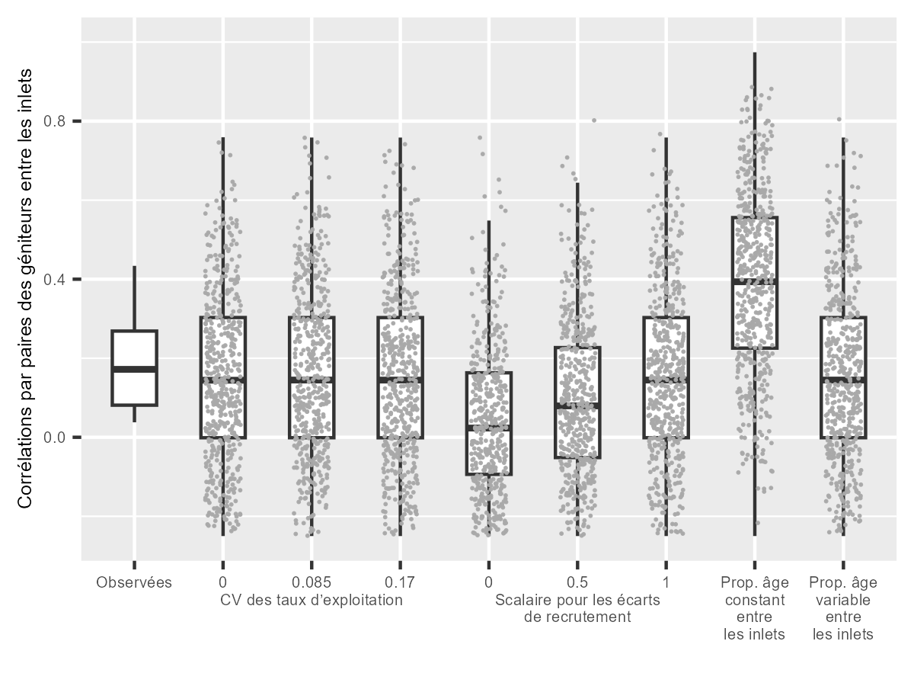
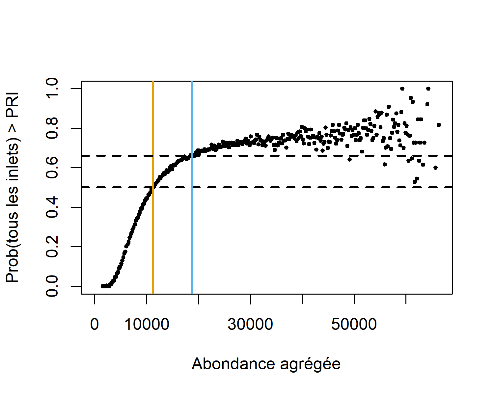
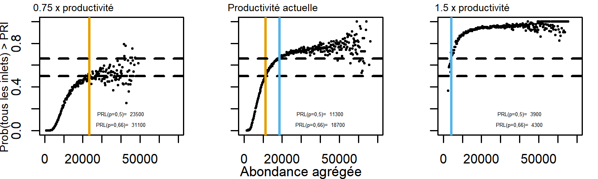

---
output:
  pdf_document: default
  html_document: default
---

\newpage
# ÉTUDE DE CAS 2 : SAUMON CHINOOK DE LA CÔTE OUEST DE L’ÎLE DE VANCOUVER {#WCVIchinookChapter}

## CONTEXTE


<!-- LW comment: there are 8 labeled inlets in Fig 22, but Esparanza and Nootka are grouped together in Table 6 and the text refers to 7 inlets. Why are Nootka and Esperanza grouped? -->


L’UGS du saumon chinook de la côte ouest de l'île de Vancouver (COIV) est composée de trois UC [@holtbyConservationUnitsPacific2007; @pacificsalmoncommissionsentinelstockscommitteePacificSalmonCommission2018; @dfoReviewUpdateSouthern2013], de sept populations de grands inlets et de 20 populations indicatrices d’échappée qui ont des séries chronologiques relativement complètes et une méthodologie d’observation uniforme (figure \@ref(fig:chinook-map), tableau \@ref(tab:chinook-Overview)) [@riddellReview2001Chinook2002]. Les écloseries produisent une part relativement importante de la production totale pour bon nombre de ces populations, où elles aident à atteindre les objectifs de récolte, de conservation et d’évaluation. Cependant, les écloseries sont également considérées comme un facteur de risque pour la durabilité à long terme des UC parce qu’elles peuvent réduire la diversité génétique et la valeur adaptative des populations sauvages [@withlerGeneticallyBasedTargets2018]. Comme il est décrit dans @holtGuidelinesDefiningLimitInpress, seules les populations indicatrices d’échappée sans mise en valeur importante (c’est-à-dire les populations dont la valeur de l’influence naturelle proportionnelle, INP, $\geqslant$ 0,5) ont été incluses dans cette analyse. Bien que la plupart des poissons de ces populations soient d’origine naturelle (c’est-à-dire qu’ils sont le résultats d’une fraie en milieu sauvage), les poissons « sauvages », définis dans la PSS comme étant des poissons d’origine naturelle de deuxième génération, peuvent être minoritaires [@withlerGeneticallyBasedTargets2018]. 


```{r chinook-map, fig.cap="Carte de l’UGS de saumon chinook de la COIV, des UC qui la composent (en rouge, bleu et jaune) et des inlets (étiquetés en noir). Il est à noter que les unités désignables définies par le COSEPAC correspondent aux UC de l’UGS.", warning=FALSE, echo=FALSE, fig.align="center"}
knitr::include_graphics("figure/chinook-map.png")
```

\renewcommand*{\arraystretch}{1.5}
\begin{table}[ht]
\centering
\caption{Aperçu de l’UGS de saumon chinook de la COIV. Les caractères en italique représentent les populations indicatrices d’échappée présentant des valeurs moyennes de l’INP $<$  0,5 qui sont exclues des analyses. Les inlets et les baies San Juan et Nitinat ne contiennent pas de populations indicatrices d’échappée ayant une INP $\geqslant$  0,5 et ne sont pas incluses dans les analyses.}
\begin{tabular}{p{0.3\textwidth}p{0.2\textwidth}p{0.4\textwidth}}
\hline
UC       &  Inlets   &  Populations indicatrices \\ 
\hline
\multirow{4}{*}{\parbox{4cm}{Ouest de l’île de Vancouver – sud (CK-31)}} & San Juan  & \emph{San Juan} \\

 & Nitinat & \emph{Nitinat}  \\
 & Barkley  & Nahmint , \emph{Sarita}, \emph{Somass}  \\
 & Clayoquot & Bedwell/Ursus , Megin , Moyeha , \emph{Tranquil} \\
\multirow{2}{*}{\parbox{4cm}{Ouest de l’île de Vancouver – Nootka \& Kyuquot (CK-32)}} & Nootka/Esperanza  & \emph{Burman}, \emph{Conuma}, \emph{Gold}, \emph{Leiner}, Tahsis  \\
&  Kyuquot &  Zeballos, Artlish, Kaouk, Tahsish \\
Ouest de l’île de Vancouver – nord(CK-33) &  Quatsino  &  \emph{Cayeghle}, Marble \\                     
\hline
\end{tabular}
(\#tab:chinook-Overview)
\end{table}


<!-- CH: Thanks for formatting this table Catarina. If we have time, I'd like to format it so that the second column as a separate row for each inlet. I could not get it work in the pdf version of the table below, and I noticed, all inlets are in a string in the table above. I can work on this next week.
-->

<!--

----------------------- ----------------------- ----------------------------------------------
CU                      Inlets                  Indicators
----------------------- ----------------------- ----------------------------------------------
West Vancouver Island-  San Juan,               *San Juan*, 
South (CK-31)           Nitinat,                *Nitinat*, 
                        Barkley,                Nahmint , *Sarita*, *Somass*, 
                        Clayoquot,              Bedwell/Ursus , Megin , Moyeha , *Tranquil*
                                                          
West Vancouver Island-  Nootka/Esperanza,       *Burman*, *Conuma*, *Gold*, *Leiner*, Tahsis,
Nootka & Kyuquot       Kyuquot                 Zeballos,
(CK-32)                                                Artlish, Kaouk, Tahsish,
                                         
West Vancouver Island-  Quatsino                Cayeghle, Marble
North (CK-33)                

----------------------- ----------------------- ----------------------------------------------            

Table: (\#tab:chinook-Overview) Overview of WCVI Chinook Stock Management Unit. Italics represent indicators with average PNI values < 0.5 and are excluded from analyses. The inlets, San Juan and Nitinat do not contain indicator stocks with PNI < 0.5 and are not included in these analyses. WCVI is West Coast of Vancouver Island. 
 -->

\newline
Cette UGS a été incluse comme étude de cas en partie pour démontrer l’élaboration de PRL dans un contexte de données limitées, à savoir lorsque des données sur le recrutement ne sont pas disponibles pour établir des points de référence fondés sur le stock-recrutement, mais qu’il existe des points de référence fondés sur l’habitat, comme c’est souvent le cas pour le saumon chinook en Colombie-Britannique. Le saumon chinook de la COIV est inclus dans le premier lot de grands stocks proposé aux fins de réglementation en vertu des dispositions sur les stocks de poissons; des PRL doivent donc être établis pour cette UGS. De plus, la population de saumon chinook de la COIV est fortement mise en valeur, mais on ne dispose pas de données complètes sur la proportion de géniteurs issus d’écloseries contribuant à la production totale, comme c’est le cas pour de nombreuses autres UGS de saumon chinook. De plus, cette UGS était unique parmi les études de cas dans la prise en compte des inlets dans les UC au niveau de l’évaluation, démontrant diverses échelles spatiales qui peuvent être intégrées aux évaluations à l’échelle de l’UGS. Cette échelle est semblable à l’échelle des sous-populations utilisée dans les analyses de sensibilité pour l’étude de cas du saumon coho du Fraser intérieur.

Presque tous les saumons chinooks de cette UGS sont de type « océanique », entrant dans l’océan entre un et trois mois après leur émergence du gravier dans les frayères [@dfoAssessmentWestCoast2012]. Les saumons chinooks de type « fluvial », ceux qui restent dans des cours d’eau pendant un an après leur émergence, sont rares dans cette UGS. Après être entré dans l’océan, le saumon chinook de la COIV migre généralement vers le nord de la Colombie-Britannique et le sud-est de l’Alaska pour se développer pendant deux à six ans, et revient frayer principalement aux âges 3, 4 et 5 [@dfoAssessmentWestCoast2012].


### Évaluations précédentes

L’état de deux des trois UC de cette UGS, celle de l’ouest de l’île de Vancouver – sud et celle de l’ouest de l’île de Vancouver – Nootka et Kyuquot, a été évalué comme étant en zone rouge dans une évaluation intégrée selon la PSS [@dfoIntegratedBiologicalStatus2016]. Dans le cas de ces UC, les évaluations étaient fondées sur des populations constituantes sans mise en valeur au moyen d’écloseries au cours des 12 dernières années, sans tenir compte des populations présentant une mise en valeur au cours de cette période. Pour l’UC de l’ouest de l’île de Vancouver – sud, l’état en zone rouge reposait principalement sur les menaces d’introgression génétique provenant des poissons échappés des écloseries à grande échelle situées à proximité. Pour l’UC de l’ouest de l’île de Vancouver – Nootka et Kyuquot, l’état en zone rouge était fondé sur un indice d’abondance très faible pour les populations non mises en valeur et les menaces d’introgression génétique provenant des poissons échappés des écloseries à grande échelle. La troisième UC, celle de l’ouest de l’île de Vancouver – nord, n’a pas été évaluée parce que son site indicateur a été mis en valeur au cours des 12 dernières années (d’autres paramètres de la mise en valeur au moyen d’écloseries, comme l’INP, n’ont pas été pris en compte). Une liste des populations indicatrices et des populations non indicatrices d’échappée dans chaque UC est disponible dans @brown2020SummaryAbundance2020. 


Le saumon chinook de la COIV a été désigné comme un stock préoccupant dans le Plan de gestion intégrée des pêches (PGIP) de 2021 pour le saumon de la côte sud, et un plan de rétablissement est en cours d’élaboration [@dfoSouthernSalmonIntegrated2021]. Les faibles taux de survie des smolts d’âge 2 et les faibles niveaux de géniteurs au cours des deux dernières décennies sont des raisons de préoccupations en matière de conservation indiquées dans le PGIP [@dfoSouthernSalmonIntegrated2021]. Depuis le milieu des années 1990, divers paramètres de gestion ont été mis en œuvre pour restreindre les prises de saumon chinook de la COIV et répondre à ces préoccupations décrites dans le PGIP [@dfoSouthernSalmonIntegrated2021].


Pour certaines populations de saumon chinook, y compris celles de la COIV, des points de référence fondés sur l’habitat ont été utilisés pour obtenir l’état de l’abondance des géniteurs [@parkenHabitatbasedMethodsEstimate2006]. Ces points de référence sont estimés à l’aide d’une relation empirique entre la zone du bassin hydrographique où se trouve l’habitat de fraie et deux points de référence pour le stock-recrutement, l’abondance des géniteurs au moment du remplacement, G~REM~ (aussi appelés géniteurs à l’équilibre G~éq~), et G~RMD~, dans une méta-analyse de 25 populations de saumon chinook en Amérique du Nord [@parkenHabitatbasedMethodsEstimate2006; @liermannUsingAccessibleWatershed2010].  À l’aide de cette relation, on peut alors prévoir des points de référence pour les populations sans données sur le stock-recrutement dans leur zone de bassin hydrographique.

En novembre 2020, @cosewicCOSEWICAssessmentStatus2020 a désigné les UD de l’ouest de l’île de Vancouver – sud et de l’ouest de l’île de Vancouver – Nootka et Kyuquot comme étant menacées, et l’UD de l’ouest de l’île de Vancouver – nord a été désigné comme ayant des données insuffisantes. Le statut d’espèce menacée reposait principalement sur les risques génétiques associés à la mise en valeur au moyen d’écloseries et les menaces pour l’habitat découlant de la foresterie. L’UD de l’ouest de l’île de Vancouver – nord a été désignée comme ayant des données insuffisantes parce qu’elle ne contient qu’une seule population indicatrice d’échappée.


## DONNÉES

### Échelle spatiale

En vertu de la PSS, les UC sont déterminées à une échelle spatiale qui permet la durabilité à long terme de l’espèce [@holtbyConservationUnitsPacific2007]. Pour le saumon chinook de la COIV, les inlets situés dans l’aire de répartition des UC constituent une autre échelle spatiale importante de la diversité, compte tenu de la séparation géographique des habitats de fraie entre les inlets et de l’errance limitée entre les inlets (D. McHugh, comm. pers., Évaluation des stocks de la côte sud du MPO). Nous avons utilisé une approche hybride dans le cadre de laquelle des PRL ont été élaborés pour préserver la diversité à l’échelle des inlets des UC. Cependant, seulement cinq des sept inlets de la COIV contenaient des populations indicatrices sans influence importante d’écloseries. Les baies de Nitinat et de San Juan, qui sont les deux plus méridionales de l’UC de la COIV – sud, comptent des écloseries à grande échelle et font l’objet d’un suivi peu fréquent des sites de fraie naturels. Ces deux baies ne comportent pas de populations indicatrices d’échappée sans influence importante d’écloseries. Étant donné que les cinq autres inlets comportant d’importantes frayères naturelles sont situés dans les trois UC de saumon chinook de la COIV, la préservation de cette biodiversité à l’échelle des inlets (cinq comportant des données) permettra également de préserver la biodiversité à l’échelle de l'UC requise en vertu de la PSS. À l’avenir, les analyses pourraient limiter l’estimation des PRL à l’échelle de l'UC ou l’étendre aux sept inlets ayant des populations indicatrices d’échappée naturelle supplémentaires pour les baies Nitinat et San Juan, s’ils sont élaborés. 

### Zones du bassin hydrographique

Afin d’obtenir des points de référence fondés sur l’habitat, les zones du bassin hydrographique ont été mise à jour pour le saumon chinook de la COIV à l’aide des méthodes décrites dans @parkenHabitatbasedMethodsEstimate2006 en déterminant des zones de 3\textsuperscript{e} ordre qui contiennent un habitat de fraie et en omettant les zones en amont d’obstacles au passage du poisson selon le [catalogue de données sur les obstacles provinciaux au passage du poisson (en anglais seulement)] (https://catalogue.data.gov.bc.ca/dataset/provincial-obstacles-to-fish-passage). Seules les zones du bassin hydrographique des populations indicatrices d’échappée ont été incluses dans l’analyse actuelle. Ces zones du bassin hydrographique ont ensuite été additionnées à l’intérieur des inlets pour obtenir des zones précises du bassin hydrographique (tableau \@ref(tab:chinook-WA)). Par conséquent, les points de référence à l’échelle de l’inlet présentés dans cette étude de cas sont sur une échelle relative; ils représentent l’abondance dans certains cours d’eau indicateurs. Dans de futures analyses, les zones du bassin hydrographique de toutes les populations reproductrices connues pourraient être incluses (en omettant les zones en amont des obstacles au passage du poisson) afin d’obtenir des points de référence fondés sur l’habitat sur une échelle d’abondance absolue. Ces points de référence pourraient être comparés aux abondances totales de chaque inlet. Cette approche n’a pas été utilisée dans cette étude de cas en raison des grandes incertitudes quant à l’abondance des populations non indicatrices qui ont empêché l’élaboration d’estimations fiables de l’abondance absolue totale.

```{r chinook-WA, warning=FALSE, echo=FALSE}

  
dat <- as.data.frame(read.csv("data/WCVIStocks.csv"))
dat <- dat %>% dplyr::filter(Stock != "Cypre") %>% 
  dplyr::filter(Enh==0) %>%
  dplyr::group_by(Inlet) %>%
  dplyr::summarize(InletWA = sum(WA) ) %>% 
  dplyr::select(c(Inlet, InletWA)) %>% 
  dplyr::mutate(InletWA = round(InletWA,0)) %>%

  dplyr::filter(InletWA != "San Juan") %>% dplyr::filter(InletWA !="Nitinat") %>% 
  dplyr::rename("Watershed Area" = InletWA)
  
  # filter(Inlet != "San Juan") %>% filter(Inlet !="Nitinat")
  # dplyr::select(c(Stock, WA)) %>% dplyr::mutate(WA = round(WA,0)) %>%
  # dplyr::rename("Zone du bassin hydrographique" = WA)
csasdown::csas_table(dat, booktabs = T, caption = "Somme des zones du bassin hydrographique des populations indicatrices d’échappée dans les inlets, en km\\textsuperscript{2}. Seules les populations indicatrices qui ne sont pas mises en valeur de façon importante (c’est-à-dire dont l’INP $\\geqslant$ 0,5) sont incluses.", col_names=c("inlets", "zone du bassin hydrographique, km\\textsuperscript{2}"))
```

### Abondance des géniteurs
Des données sur l’abondance des géniteurs ont été fournies pour 20 populations indicatrices d’échappée de la COIV (D. Dosbon et D. McHugh comm. pers.; tableau \@ref(tab:chinook-Overview); figure \@ref(fig:chinook-IndTimeSeries)). Ces séries chronologiques sont compilées chaque année par le personnel de la région de la côte sud du MPO pour une évaluation et une gestion locales et internationales. Les valeurs manquantes n’ont pas fait l’objet d’un remplissage et, dans certains cas, les méthodes de suivi ont changé au fil du temps, ce qui a limité l’estimation de l’état historique de l’UGS.  Bien que certaines séries chronologiques des échappées commencent en 1953, d’autres commencent aussi tard qu’en 1995, ce qui limite nos analyses à ces années les plus récentes qui sont fondées sur une méthodologie uniforme quant aux échappées [@pacificsalmoncommissionsentinelstockscommitteePacificSalmonCommission2018]. Des séries chronologiques ayant fait l’objet de remplissage des populations indicatrices d’échappée des inlets pourraient être élaborées dans le cadre de travaux futurs. L’abondance des géniteurs pour les populations indicatrices d’échappée est estimée à partir d’une combinaison de relevés aériens, au tuba, par navire, de promenades sur les berges et de dénombrements aux barrières, qui varient en exactitude et en précision (se référer à @dfoWestCoastVancouver2014 pour un résumé des méthodes de surveillance et d’évaluation). En particulier, les estimations des géniteurs à partir des relevés visuels sont une source d’incertitude pour cette UGS. L’abondance est généralement estimée à l’aide de la méthode de calcul de l’aire sous la courbe ou de la méthode du maximum de vraisemblance associée. Dans le cas des populations qui ne font pas l’objet d’un relevé continu pendant la saison de fraie, l’abondance est estimée à l’aide des dénombrements au moment du pic de migration ou d’une combinaison d’observations provenant de plusieurs relevés, ce qui ajoute de l’incertitude aux estimations annuelles de l’abondance. 


```{r chinook-IndTimeSeries, fig.cap="Séries chronologiques de l’abondance des géniteurs par population indicatrice d’échappée, en milliers. Les séries chronologiques en bleu foncé sont celles des populations indicatrices d’échappée où la plus grande partie de la production provient d’une fraie naturelle et dont les valeurs de l’influence naturelle proportionnelle (INP) sont généralement $\\geqslant$ 0,5; les séries chronologiques en bleu pâle sont celles des populations indicatrices d’échappée où les individus d’écloserie sont dominants et où les valeurs de l’INP sont généralement $<$ 0,5 par rapport aux séries chronologiques disponibles. Les valeurs moyennes provisoires de l’INP sont fournies dans le coin supérieur droit de chaque panneau, lorsqu’elles sont disponibles.",  warning=FALSE, echo=FALSE, fig.align="center"}


# from Watershed-Area model repository
```


### Influence naturelle proportionnelle

Le paramètre de l’influence naturelle proportionnelle (INP) est utilisé pour estimer la force relative des pressions sélectives naturelles et celles des écloseries dans les populations influencées par les écloseries [@withlerGeneticallyBasedTargets2018]. Les valeurs de l’INP de 14 populations indicatrices d’échappée de la COIV ont été fournies pour l’évaluation des stocks de la côte sud du MPO par le Programme de mise en valeur des salmonidés du MPO (J. Bokvist, comm. pers., Évaluation du saumon de la côte sud du MPO). Les populations ont été considérées comme étant considérablement mises en valeur et exclues de nos analyses si les valeurs moyennes de l’INP au cours de la série chronologique disponible où les objectifs des écloseries sont demeurés constants étaient $<$ 0,5.  Le marquage thermique a été utilisé pour déterminer la proportion de géniteurs issus d’écloseries dans les frayères afin de calculer les valeurs de l’INP. Lorsque les données sur le marquage thermique n’étaient pas disponibles, on a utilisé des micromarques magnétisées codées pour identifier les géniteurs issus d’écloseries. Bien que la population de la rivière Gold présente des valeurs moyennes de l’INP de $>$ 0,5 (0,52), on pense que la plupart des géniteurs non marqués sont des poissons d’écloserie de deuxième génération (c’est-à-dire des descendants de poissons de l’écloserie du ruisseau Robertson). Ainsi, la rivière Gold a été exclue de nos analyses. De plus, même si l’INP moyenne de la population de la rivière Artlish était légèrement $<$ 0,5 (0,46), les estimations de l’INP n’étaient disponibles que pour un an (2015) grâce aux micromarques magnétisées codées, ce qui a été jugé non représentatif de cette population, qui est relativement peu mise en valeur. Cette population a donc été retenue dans notre analyse. On ne croit pas que cinq des six populations indicatrices d’échappée restantes sans données sur l’INP soient considérablement mises en valeur : Cayeghle, Kaouk, Megin, Moyeha et Tasish (D. McHugh, comm. pers., Évaluation des stocks de la côte sud du MPO) et elles ont été retenues dans l’analyse. Une population indicatrice d’échappée sans données sur l’INP, celle de Tranquil, a été considérée comme considérablement mise en valeur et a été omise de nos analyses (D. McHugh, comm. pers., Évaluation des stocks de la côte sud du MPO). 

Au départ, nous avons envisagé une définition plus stricte de la mise en valeur au moyen d’écloseries qui incluait seulement les populations dont les valeurs de l’INP $\geqslant$ 0,72. Ce seuil plus strict a entraîné l’exclusion de la plupart des données, car des séries chronologiques fiables des valeurs de l’INP et de l’abondance des géniteurs ne sont disponibles que pour les populations indicatrices du taux d’exploitation où des micromarques magnétisées codées ont été appliquées et échantillonnées pour le rétablissement qui, dans la COIV, ont tendance à être des populations comportant des individus d’écloserie. Le seuil de l’INP de $\geqslant$ 0,5, un niveau associé à une majorité de poissons d’origine naturelle, explique le compromis entre l’évaluation de la biodiversité à l’échelle de l'UC et l’exclusion des répercussions significatives des écloseries. 

Le Programme de mise en valeur des salmonidés documente actuellement les lignes directrices et les méthodes d’estimation des valeurs de l’INP (MPO, en cours d’examen)^[MPO, en cours d’examen. Guidelines for Calculating the Proportionate Natural Influence Index as a Metric of the Genetic Influence of Enhanced Pacific Salmon on Wild Populations [lignes directrices pour le calcul de l’indice de l’influence naturelle proportionnelle comme mesure de l’influence génétique des saumons du Pacifique mis en valeur sur les populations sauvages]. Rapport du Programme de mise en valeur des salmonidés, Vancouver (C.-B.)]. Les incertitudes quant aux valeurs de l’INP découlent de la faible taille des échantillons dans les frayères pour estimer la proportion de géniteurs issus d’écloseries, des incertitudes importantes découlant des estimations des micromarques magnétisées codées pour les géniteurs issus d’écloseries en raison du marquage insuffisant des poissons d’écloserie, et du manque de données sur les proportions de géniteurs d’écloseries d’origine naturelle (et l’hypothèse que les proportions de géniteurs d’écloseries d’origine naturelle soient égales aux proportions de géniteurs d’origine naturelle). 

Étant donné que les séries chronologiques actuelles et historiques de la proportion de géniteurs issus d’écloseries n’étaient pas toujours disponibles pour les populations ayant une INP $\geqslant$ 0,5, l’abondance totale de géniteurs (c’est-à-dire les géniteurs d’origine naturelle et issus d’écloseries combinés) a été utilisée dans l’évaluation des états à l’échelle de l'UC et de l’abondance agrégée à l’échelle de l’UGS. Cela pourrait donner lieu à des évaluations optimistes de l’état. Nous recommandons la conception de programmes de marquage dans les écloseries et d’échantillonnage dans les frayères pour recueillir des données afin d’estimer la contribution des géniteurs issus d’écloseries par rapport à la production totale pour ces populations indicatrices d’échappée. L’inclusion des poissons d’écloserie dans les estimations de l’état est une principale source d’incertitude pour cette UGS, et probablement de nombreuses autres dans la région du Pacifique.


## ESTIMATION DE L’ÉTAT À L’ÉCHELLE DES INLETS ET DES UC


L’état à l’échelle des inlets a été obtenu en appliquant l’algorithme multidimensionnel de l’Explorateur à des inlets particuliers (Pestal et al., en préparation). Nous avons constaté que l’état estimé à l’aide de cet algorithme était équivalent à l’état sur un seul paramètre, l’abondance relative par rapport à un PRI estimé pour tous les inlets. Lorsque l’abondance n’est disponible qu’à une échelle relative et qu’il est possible d’estimer les points de référence de l’abondance, l’état dans l’algorithme multidimensionnel se réduit à l’abondance des géniteurs par rapport aux valeurs des points de référence fondés sur l’abondance (comme le montre la figure \@ref(fig:decision-tree)). Étant donné que les PRL résultants étaient équivalents, dans certains cas, nous ne présentons qu’un seul ensemble de résultats, étiquetés comme étant l’approche à paramètre unique qui représente également l’état en fonction de l’algorithme multidimensionnel dans ce cas. @holtGuidelinesDefiningLimitInpress  recommandent l’application de l’approche multidimensionnelle utilisée dans l’Explorateur pour calculer l’état des UC.

G~gén~ est l’abondance des géniteurs nécessaire pour atteindre G~RMD~ en une génération sans pêche dans des conditions d’équilibre, et est le PRI de l’abondance appliqué dans le cadre de la PSS. Nous avons calculé G~gén~ en optimisant l’équation de Ricker avec le recrutement réglé à G~RMD~ (l’équation \@ref(eq:Sgen) est répétée ici pour la transparence) :


\begin{equation}
  G_{RMD} = a \cdot G_{gén} \cdot e^{-b * G_{gén}}
   (\#eq:Sgen2)
\end{equation}

où 
\begin{equation}
  b = \frac{\log(a)}{G_{REM}}
   (\#eq:ricB)
\end{equation}
 

\begin{equation}
  G_{RMD} = \frac{1 - W{e^{1-\log(a)}} } {b}
   (\#eq:SMSY)
\end{equation}

et $a$ représente des recrues par géniteur à faible productivité et *W* représente une fonction de Lambert [@scheuerellExplicitSolutionCalculating2016]. Les estimations du maximum de vraisemblance des valeurs G~REM~ (et des IC à 95 %) ont été obtenues à partir du modèle de la zone du bassin hydrographique adapté de @parkenHabitatbasedMethodsEstimate2006, qui incluait une structure hiérarchique dans la méta-analyse sous-jacente tenant compte des similitudes de la productivité entre le type océanique et le type dulcicole [@liermannUsingAccessibleWatershed2010, tableau \@ref(tab:chinook-benchmarks)]. 


Les valeurs de Ricker $a$ ont été estimées à partir d’un modèle fondé sur le stade du cycle de vie qui répartit la survie entre les stades du cycle de vie en eau douce et en mer pour le saumon chinook de type océanique en fonction de données empiriques et de l’avis d’experts (W. Luedke, comm. pers. Évaluation des stocks de la côte sud du MPO). Les taux de survie propres au stade du cycle de vie ont ensuite été combinés pour calculer la survie globale des géniteurs au recrutement. Malgré les incertitudes relativement importantes concernant les taux de survie propres au stade du cycle de vie, cette approche fournit une approximation de la productivité qui est plus réaliste que l’estimation élevée précédemment calculée à partir du modèle de la zone du bassin hydrographique et déclarée pour de nombreuses autres populations de saumon chinook de type océanique ($>$ 7 recrues/géniteur, @parkenHabitatbasedMethodsEstimate2006). D’après le modèle fondé sur le stade du cycle de vie, les valeurs moyennes de $a$ ont été estimées à 2,7 recrues par géniteur, les erreurs types variant de 1,6 à 4,5. 


Notre approche pour estimer G~RMD~ (et G~gén~) différait de celle de @parkenHabitatbasedMethodsEstimate2006, parce que nous avons calculé la productivité indépendamment, alors que @parkenHabitatbasedMethodsEstimate2006  ont estimé G~RMD~ et G~REM~ à partir du modèle fondé sur le bassin hydrographique, ce qui a donné lieu à des estimations relativement élevées de la productivité, soit $a$. Ces estimations de la productivité ont été jugées irréalistes pour le saumon chinook de la COIV, d’où l’approche de rechange adoptée ici. 


Les intervalles de confiance approximatifs de G~gén~ ont été estimés par échantillonnage répété des distributions normales de G~REM~ et $\log(a)$, avec des écarts-types dans log(G~REM~) calculés à partir du modèle fondé sur la zone du bassin hydrographique. Cette méthode ne tient pas compte de la covariance entre la productivité et la capacité que l’on trouve habituellement dans la relation stock-recrutement, et surestimera l’incertitude dans les points de référence obtenus. Dans les analyses futures, nous recommandons l’estimation bayésienne des points de référence fondés sur l’habitat afin de faciliter l’intégration des incertitudes de diverses sources. 


```{r chinook-benchmarks}
inlets <- c("Barkley", "Clayoquot", "Kyuquot", "Nootka/Esperanza", "Quatsino")
 
bench <- as.data.frame(read.csv("data/wcviCK-BootstrappedRPs.csv"))
bench <- bench %>% dplyr::mutate(Value = round (Value,0), lwr = round (lwr,0), 
                                 upr = round (upr,0) )
bench <- bench %>% tidyr::pivot_wider(id_cols = Stock, 
                                      names_from = c(RP),#, lwr.name, upr.name), 
                                      names_sep = ".",
                                      values_from = c(Value,lwr,upr) ) 
bench <- bench %>% dplyr::filter(Stock != "Cypre"&
                                   Stock != "WCVI Nootka & Kyuquot"&
                                   Stock != "WCVI North"&
                                   Stock != "WCVI South") %>% 
  dplyr::rename(Sgen = Value.SGEN) %>% 
  dplyr::rename(SREP = Value.SREP) %>% 
  dplyr::rename(Sgen.lwr = lwr.SGEN) %>% 
  dplyr::rename(SREP.lwr = lwr.SREP) %>% 
  dplyr::rename(Sgen.upr = upr.SGEN) %>% 
  dplyr::rename(SREP.upr = upr.SREP) %>% 
  dplyr::filter(Stock %in% inlets) %>% 
  dplyr::rename("Population or inlet" = Stock)
  

bench <- bench %>% dplyr::select(c("Population or inlet", Sgen, Sgen.lwr, Sgen.upr, SREP, SREP.lwr, SREP.upr))
csasdown::csas_table(bench, booktabs = T, caption = "Points de référence (en nombre de géniteurs) et limites approximatives de l’intervalle de confiance de 95 % (à la droite de chaque point de référence) pour cinq inlets, incluant seulement les populations indicatrices d’échappée qui ne sont pas mises en valeur de façon importante.", col_names =c("Population ou inlets", "G\\textsubscript{gén}", "Limite sup.", "Limite inf.",  "G\\textsubscript{REM}", "Limite sup.", " Limite inf.")) %>% kableExtra::row_spec(20, hline_after=TRUE)


```

```{r chinook-InletTimeSeries, fig.cap="Séries chronologiques de l’abondance des géniteurs par inlet, seulement pour les populations indicatrices d’échappée qui ne sont pas mises en valeur de façon considérable. Les lignes jaunes horizontales représentent G\\textsubscript{gén} et les points représentent les moyennes géométriques générationnelles de l’abondance des géniteurs (en rouge quand la valeur est inférieure à G\\textsubscript{gén} et en gris quand la valeur est supérieure à G\\textsubscript{gén}).",  warning=FALSE, echo=FALSE, fig.align="center"}

#knitr::include_graphics("figure/chinook-WCVI-inlet-timeseries-nEnh-bs.png")


```


L’état des UC a été calculé à partir de la proportion de populations d’inlet les composant qui sont au-dessus de leur PRI. On s’attend à ce qu’il y ait des dommages graves lorsque la population de n’importe quel inlet dans chacune des trois UC chute sous son PRI. Nous avons supposé ici que l’état de la population indicatrice d’échappée dans l’UC de l’ouest de l’île de Vancouver – nord (rivière Marble, dans le détroit Quatsino) n’est pas sensiblement mis en valeur et qu’il est représentatif de l’UC. Toutefois, un examen plus approfondi de ces hypothèses par des experts locaux est justifié.

## ESTIMATION DES PRL FONDÉS SUR L’ÉTAT DES UC


### Méthodes

Le PRL fondé sur la proportion d’UC a été déterminé comme étant les trois UC contenant des populations d’inlet dont l’état actuel est exclusivement hors de la zone rouge. Étant donné que des populations d’inlet se trouvent au sein des UC, ce PRL tient compte de la répartition de la fraie entre les inlets dans les UC. Si une UC contenait une population d’inlet en zone rouge, le PRL était considéré comme dépassé. L’état des populations d’inlet constituantes a été calculé à partir de l’approche multidimensionnelle utilisée dans l’Explorateur, qui, pour cette UGS, a réduit à un seul paramètre l’abondance des géniteurs par rapport au PRI, G~gén~. 

Nous avons également envisagé un PRL fondé sur l’état des UC en fonction des états à l’échelle des UC obtenus d’une évaluation intégrée selon la PSS publiée antérieurement (état en 2014 seulement, @dfoIntegratedBiologicalStatus2016).

### Résultats

Au cours de la dernière année pour laquelle des données ont été recueillies, 2020, les populations de quatre des cinq inlets affichaient une abondance supérieure à leur PRI fondé sur l’abondance, G~gén~ (figure \@ref(fig:chinook-InletTimeSeries)). Par conséquent, deux des trois UC contenaient des populations d’inlet dont l’état actuel dépassait exclusivement leur PRI. Une UC, dans le sud de l’île de Vancouver, contient une population d’inlet, Clayoquot, dont l’état a toujours été au-dessous de son PRI tout au long de la série chronologique disponible. Par conséquent, cette UGS est inférieure au PRL de 100 % des UC dont l’état se situe hors de la zone rouge.


Seulement deux des trois UC constituantes ont été évaluées dans le cadre de l’évaluation selon la PSS publiée précédemment, bien que l’état de ces UC ait été évalué comme étant en zone rouge en 2014. Pour cette année, le PRL serait considéré comme dépassé parce que l’état d’au moins une UC était en zone rouge. 

## ESTIMATION DES PRL FONDÉS SUR L’ABONDANCE AGRÉGÉE PAR RÉGRESSION LOGISTIQUE

La régression logistique des PRL <!--based on the probability of all component inlets (nested within CUs) exceeded their lower benchmarks-->n’a pas pu être déterminée pour le saumon chinook de la COIV parce qu’il n’y a pas d’années où toutes les populations d’inlet étaient au-dessus de leur PRI selon les données historiques (figure \@ref(fig:chinook-InletTimeSeries)). Afin d’adapter un modèle de régression logistique aux données, il est nécessaire d’observer les réussites (années où toutes les populations d’inlet étaient $>$ à leurs points de référence) et les échecs (années où toutes les populations d’inlet étaient $>$ à leurs points de référence). L’estimation des PRL de régression logistique se limite aux UGS dont les données historiques montrent un contraste dans l’état au fil du temps.

##  ESTIMATION DES PRL FONDÉS SUR L’ABONDANCE AGRÉGÉE PAR PROJECTION

###  Méthodes

Les PRL de projection ont été calculées pour le saumon chinook de la COIV en projetant la dynamique de la population propre aux inlets à l’aide de l’outil de modélisation `samSim` (annexe \@ref(app:samsim-appendix)). Nous avons choisi de projeter une dynamique de population propre aux inlets plutôt qu’à l’UC pour refléter l’isolement démographique relatif des populations d’inlet. La dynamique de la population et les paramètres d’exploitation ont été obtenus à partir d’une reconstitution des remontes propre à l’UC précédemment élaborée pour le saumon chinook de la COIV en fonction de l’abondance des géniteurs et de la composition par âge des populations indicatrices, ainsi que des taux d’exploitation de la population indicatrice de l’écloserie du ruisseau Robertson (D. Dobson et D. McHugh, comm. pers. Évaluation des stocks de la côte sud du MPO). Étant donné que cette reconstitution des remontes n’a pas fait l’objet d’un examen par les pairs, elle n’est pas utilisée pour élaborer des points de référence, mais peut fournir des distributions plausibles pour les paramètres des projections. Les paramètres propres à l’UC ont été appliqués à toutes les populations d’inlet constituantes. Les capacités de population propres aux inlets, G~REM~, ont été estimées à partir du modèle fondé sur la zone du bassin hydrographique [@parkenHabitatbasedMethodsEstimate2006] (tableau \@ref(tab:chinook-WA)) et appliquées dans les projections de recrutement à l’aide d’un modèle stock-recrutement de Ricker. Les paramètres du scénario de référence sont présentés au tableau \@ref(tab:chinook-BaseCasePars) et les analyses de sensibilité sont décrites dans le texte ci-dessous.  


Le modèle a été initialisé à des abondances d’équilibre propres aux inlets et projeté pour une période d’initialisation de 40 ans afin de stabiliser la distribution de l’abondance des géniteurs. Le modèle a ensuite été exécuté pour une période supplémentaire de 30 ans, et l’abondance agrégée annuelle et les états propres aux inlets ont été enregistrés. Étant donné que les projections déterminent l’abondance et les états d’équilibre à long terme, les résultats sont indépendants de l’abondance initiale. Les projections ont été résumées pour plus de 50 000 essais de simulation aléatoires (MCCM). Un nombre relativement élevé d’essais de simulation a été nécessaire pour l’estimation du PRL parce que l’algorithme exigeait une taille d’échantillon suffisante dans chaque tranche supplémentaire de 200 poissons d’abondance agrégée le long d’une gamme de niveaux d’abondance réalistes (de près de zéro à la capacité de charge). Les PRL de projection ont été déterminés à partir de l’abondance agrégée, avec des probabilités précises que toutes les populations d’inlet constituantes soient au-dessus des PRI. Nous recommandons un examen des hypothèses et des paramètres du modèle par des experts locaux avant l’adoption d’un PRL de projection pour cette UGS. Nous fournissons un exemple à des fins d’illustration.


\renewcommand*{\arraystretch}{1.6}
\begin{longtable}[]{p{3.7cm} p{5cm} p{6.3cm}}
\caption{Paramètres utilisés pour les projections propres aux inlets de la dynamique des populations de saumon chinook de la COIV.}\\
\hline
Paramètre & Valeur & Source \\ 
\hline
\endhead
Ricker $log(a)$ (moyenne)  & COIV – sud = 1,14, COIV – Nootka \& Kyuquot = 1,58, COIV – nord = 1,53 & Reconstitution des remontes de saumon chinook de la COIV (de 1985 à 2019, D. Dobson et D. McHugh comm. pers.)\\

Ricker $log(a)$ (ET) & 0,5 & IC d’environ 95\% et limites du modèle propre à l’étape du cycle de vie (W. Luedke comm. pers.)\\
G\textsubscript{REM} (Géniteurs au moment du remplacement, moyenne) & Barkley = 637, Clayoquot = 7879, Nootka/Esperanza = 1 184, Kyuquot = 5 273, Quatsino = 3 384 & Estimation du maximum de vraisemblance à partir du modèle fondé sur la zone du bassin hydrographique \\

G\textsubscript{REM} (ET) Calculé à partir de l’erreur-type de l’estimation du maximum de vraisemblance d’après le modèle fondé sur la zone du bassin hydrographique \\

ET dans les résidus de Ricker (sigma) & COIV – sud = 0,80, COIV – Nootka \& Kyuquot = 0,69, COIV – nord = 0,68, &Reconstitution des remontes de saumon chinook de la COIV (de 1985 à 2019, D. Dobson \& D. McHugh comm. pers.)\\

Covariance des résidus de Ricker entre les inlets & Égal à la covariance dans la série chronologique des géniteurs entre les inlets &Covariance des géniteurs entre les inlets des populations indicatrices d’échappée de poissons sauvages (D. Dobson\& D. McHugh, comm. pers.) \\ 

Proportions moyennes selon l’âges à la maturité (âges 2, 3, 4 et 5). Les âges 5 et 6 sont regroupés. & COIV – sud = 0,02, 0,14, 0,45, 0,38; COIV – Nootka \& Kyuquot = 0,01, 0,10, 0,48, 0,40; COIV – nord = 0,02, 0,15, 0,47, 0,36 &  Proportions moyennes de la reconstitution des remontes (D. Dobson\& D. McHugh comm. pers.) \\ 

Variabilité interannuelle des proportions selon l’âge (tau de la distribution logistique multivariée) &  COIV – sud = 0,7, COIV – Nootka \& Kyuquot = 0,6, COIV – nord = 0,7 & Estimation à partir de séries chronologiques des proportions selon l’âge à la maturité de la reconstitution des remontes. Variabilité présumée entre les UC et les années. \\

Taux d’exploitation moyen & 0,30 & Moyenne des taux d’exploitation en zone pré-terminale de 2010 à 2019 pour l’indicateur de l’écloserie du ruisseau Robertson (D. Dobson\& D. McHugh comm. pers.). Variable dans les analyses de sensibilité, de 0,05 à 0,45\\.

Variabilité interannuelle des taux d’exploitation (CV) & 0,17 & Estimation à partir des taux d’exploitation en zone pré-terminale de 2010 à 2019 pour l’indicateur de l’écloserie du ruisseau Robertson. On suppose que c’est une distribution bêta, limitée entre 0 et 1.\\

Variabilité des taux d’exploitation entre les inlets (CV) & 0,085 & On suppose qu’il s’agit de la moitié de la variabilité interannuelle, variable dans une analyse de sensibilité (0 à 0,17). On suppose que c’est une distribution bêta, limitée entre 0 et 1.\\

Abondance initiale &G\textsubscript{REM} (propre aux inlets) & Estimation du maximum de vraisemblance selon le modèle fondé sur la zone du bassin hydrographique\\

\hline
(\#tab:chinook-BaseCasePars)
\end{longtable}

<!-- CH removed from table:
Extirpation threshold &  2 & Minimum abundance     required for mating \\
-->

<!--
----------------------------------------------------------------------------------------------
Paremeter               Value                       Source
----------------------- --------------------------- ------------------------------------------
Ricker $a$ (mean)       WCVI-South = 1.14,          Run reconstruction for WCVI Chinook (1985- 
                        WCVI-Nootka & Kyuquot =    2019, D. Dobson & D. McHugh pers. comm.)
                        1.58,                          
                        WCVI-North = 1.53

                                                                              
Ricker $a$ (SD)         0.5                         Approximate 95% CI and bounds from life-
                                                    stage specific model (W. 
                                                    Luedke per. comm.)

                                                    
$S_{REP}$               Barkley = 637,              MLE estimate from watershed-area model
(Spawners at            Clayoquot = 7879,
replacement, mean)      Nootka/Esperanza = 1184,
                        Kyuquot = 5273,
                        Quatsino = 3384,


$S_{REP}$ (SD)          Barkley = 0.40,             Derived from standard error of MLE 
                        Clayoquot = 0.30,           estimate from the watershed-area model
                        Nootka/Esperanza = 0.37,
                        Kyuquot = 0.31,
                        Quatsino = 0.32,

Ricker sigma            WCVI-South = 0.80,          Run reconstruction for WCVI Chinook (1985- 
                        WCVI-Nootka & Kyuquot =     019, D. Dobson & D. McHugh pers. comm.)
                        0.69,
                        WCVI- North = 0.68
                         

Covariance in Ricker    Equal to covariance in      Covariance in spawners among inlets from 
residuals among inlets  spawner time-series         wild indicator populations (D. Dobson & D. 
                        among inlets                McHugh, pers. comm.)

Ave age proportions     WCVI-South = 0.02, 0.14,    Ave ppns from run reconstruction (D. 
at maturity (age 2, 3,  0.45, 0.38;                 Dobson & D. McHugh pers. comm.)
4 and 5). Ages 5 and 6  WCVI-Nootka & Kyuquot = 
are grouped.            0.01, 0.10, 0.48, 0.40;
                        WCVI-North = 0.02, 0.15,
                        0.47, 0.36

Variability in age      WCVI-South = 0.7,           Estimated from time-series of ppns of 
ppns (tau from          WCVI-Nootka & Kyuquot =     ages-at-maturity from the run  
multivariate            0.6,                        reconstruction. Assumed variable over CUs
logistic distribution)  WCVI-North = 0.7            and years. 
                                                    
                        
Average exploitation    0.30                        Average pre-terminal ERs 2010-2019 for
rate                                                Robertson Creek hatchery indicator (D. 
                                                    Dobson & D. McHugh pers. comm.). Varied 
                                                    in sensitivity analyses 0.05 - 0.45.
                                                    
Interannual             0.17                        Estimated from pre-terminal ERs 2010-2019
variability in                                      for Robertson Creek hatchery indicator.
exploitation rates                                  Assumed to be beta distributed,
(CV)                                                constrained between 0-1.
                                                    
                                                    
Variability in          0.085                       Assumed to be half of interannual
exploitation rates                                  variability, varied in a sensitivty 
among inlets (CV)                                   analysis (0-0.17). Assumed to be beta        
                                                    distributed, constrained between 0-1.  

Initial abundances      S<sub>REP</sub> (inlet-     MLE from watershed-area model
                        specific)
                        
Extirpation threshold   2                           Mating constraint

----------------------- --------------------------- ------------------------------------------
Table: (\#tab:chinook-BaseCasePars) Parameters used for inlet-specific projections of WCVI Chinook population dynamics.
-->

Nous avons choisi les paramètres de covariance de façon à ce que les projections résultantes de l’abondance des géniteurs propres aux inlets montrent des corrélations entre les inlets qui étaient semblables à celles observées (figure \@ref(fig:chinook-RunningCorrelations)). Plus précisément, les paramètres du modèle ont été ajustés de façon à ce que les corrélations résultantes entre les inlets dans l’abondance projetée des géniteurs se rapprochent des corrélations observées dans l’abondance des géniteurs, décrites plus en détail ci-dessous.

Les corrélations par paires entre les séries chronologiques observées des géniteurs propres aux inlets étaient relativement fortes dans les années 1990 et au début des années 2000, et sont devenues légèrement plus faibles depuis 2015.  Les corrélations entre les inlets pour les périodes de 20 ans sont présentées à la figure \@ref(fig:chinook-RunningCorrelations). À partir de 1995, le premier diagramme en boîte montre la répartition des corrélations en paires entre les cinq inlets pour la période de 1995 à 2015; le deuxième diagramme montre les corrélations entre 1996 et 2016, etc. Une diminution des corrélations est évidente au cours des deux dernières périodes. Le diagramme final montre la corrélation sur l’ensemble de la série chronologique.


```{r chinook-RunningCorrelations, echo=FALSE, fig.cap = "Corrélations constantes de l’abondance des géniteurs entre les inlets sur des périodes de 20 ans, avec l’année de début de la période de 20 ans sur l’axe des x. Chaque diagramme en boîte montre la répartition des corrélations par paires entre les cinq inlets (n = 10 corrélations par paires).", out.width = '60%'}


```


\newline
Dans le modèle de projection prospective, les corrélations de l’abondance des géniteurs entre les inlets sont déterminées par trois composantes du modèle, chacune étant décrite plus en détail ci-dessous : 1) la covariance des taux d’exploitation entre les inlets, 2) la covariance des résidus du recrutement entre les inlets et 3) la covariance des proportions selon l’âge des recrues entre les inlets.  

```{r chinook-ER, echo=FALSE, fig.cap = "Taux d’exploitation en zone pré-terminale pour la population indicatrice dotée de micromarques magnétisées codées du ruisseau Robertson.", out.width = '80%'}
ERs <- read.csv("data/WCVIER.csv")
ggplot(ERs,aes(Year, ER)) + geom_point() + 
  xlab("Année") + 
  ylab("Taux d’exploitation") + 
  geom_line()
```

\newline
&nbsp;

**Covariance des taux d’exploitation**

La covariance des taux d’exploitation entre les inlets est modélisée comme une exploitation interannuelle commune paramétrée à partir de l’exploitation en zone pré-terminale du saumon chinook de la COIV provenant de l’écloserie du ruisseau Robertson, avec une variabilité supplémentaire propre aux inlets. La variabilité commune se produit en raison du chevauchement de leur répartition dans les pêches hauturières, tandis que la variabilité propre aux inlets résulte de la vulnérabilité propre aux inlets à l’exploitation dans les eaux côtières et en zone terminale dans les inlets.

Nous avons supposé un taux d’exploitation moyen observé pour le saumon chinook de la COIV au cours des dernières années (2010 à 2019, population indicatrice du ruisseau Robertson, 30 %, figure \@ref(fig:chinook-ER)). Dans les projections, on a supposé que la variabilité interannuelle des taux d’exploitation était une distribution bêta (limitée entre 0 et 1), paramétrée à partir des taux d’exploitation en zone pré-terminale estimés pour le ruisseau Robertson, avec un coefficient de variation (CV) de 0,17 (tableau \@ref(tab:chinook-BaseCasePars)). Sans données permettant de paramétrer la variabilité des taux d’exploitation propres aux inlets, nous avons supposé que la variabilité propre aux inlets était la moitié de la variabilité interannuelle commune (CV = 0,085, à l’échelle de l’UGS), et nous avons fait varier cette valeur dans les analyses de sensibilité de 0 et 0,17 pour couvrir les limites plausibles (figure \@ref(fig:chinook-ERdist)). 


```{r chinook-ERdist, echo=FALSE, fig.cap = "Variabilité des taux d’exploitation projetés au fil du temps (CV = 0,17) et entre les inlets (CV = 0,085), à partir d’une exploitation moyenne de 0,3.", out.width = '80%'}
nTrials <- 100000
canERlabel <- 0.30
set.seed(1)

# Density of ERs with cvER=0.085(either interannual or among CUs)
canER <- canERlabel
cvER <- 0.085
sigCanER <- cvER*canER
shape1 <- canER^2 * (((1-canER)/sigCanER^2)-(1/canER))
shape2 <-shape1 * (1/canER-1)
out1 <- rbeta(nTrials,shape1,shape2)

# Density of ERs with cvER=0.17
cvER <- 0.17
sigCanER <- cvER*canER
shape1 <- canER^2 * (((1-canER)/sigCanER^2)-(1/canER))
shape2 <-shape1 * (1/canER-1)
out2 <- rbeta(nTrials,shape1,shape2)


#Density of ERs with cvER=0.17 interannually and 0.085 among CUs
canER <- out2
cvER <- 0.085
sigCanER <- cvER*canER
shape1 <- canER^2 * (((1-canER)/sigCanER^2)-(1/canER))
shape2 <- shape1 * (1/canER-1)


sampBeta<-function(nTrial) {
  # If assuming among CU variability changes every year
  #x<-rbeta(1,shape1[nTrial],shape2[nTrial])
  
  # If assuming among CU variability is constant over time
  x<-qbeta(rand,shape1[nTrial],shape2[nTrial])
}

randCU <- runif(5)

rand <- randCU[1]
out3 <- sapply(1:nTrials,sampBeta)
rand <- randCU[2]
out3b <- sapply(1:nTrials,sampBeta)
rand <- randCU[3]
out3c <- sapply(1:nTrials,sampBeta)
rand <- randCU[4]
out3d <- sapply(1:nTrials,sampBeta)
rand <- randCU[5]
out3e <- sapply(1:nTrials,sampBeta)


out <- data.frame( cvER = c(rep("0.085",nTrials), rep("0.17",nTrials), 
                            rep("0.085 x 0.17",nTrials)),
                   ExploitationRate = c(out1, out2, out3) )


g2 <- out %>%  dplyr::filter(cvER=="0.085"|cvER=="0.17") %>%
  ggplot(aes(ExploitationRate, colour = cvER, fill = cvER)) +
  geom_density (alpha = 0.1) +
  xlim (0,1) +
  xlab("Taux d’exploitation") +
  ylab("Densit\u00e9") + 
  labs(colour="cvTE", fill="cvTE") +
  geom_vline (xintercept = canERlabel) +
  theme(axis.title.x = element_text(size=18),
        axis.title.y = element_text(size=18))


g2
```


Nous avons supposé que les écarts propres aux inlets par rapport au taux d’exploitation moyen à l’échelle de l’UGS étaient constants au fil des ans (p. ex., en raison de la variabilité spatiale et temporelle des schémas de migration propres aux inlets qui ont une incidence sur la vulnérabilité aux pêches), mais que cet écart a changé au cours des essais de simulation. Les analyses futures pourraient inclure des biais cohérents dans l’exploitation de certains inlets (p. ex., des biais positifs pour les inlets du sud et des biais négatifs pour ceux du nord).


Dans les projections prospectives, les corrélations par paires de l’abondance projetée des géniteurs entre les inlets étaient semblables aux corrélations par paires observées récemment dans l’abondance des géniteurs entre les inlets (figure \@ref(fig:chinook-boxplots)). Les hypothèses variables au sujet de la variabilité de l’exploitation entre les inlets entre le CV de 0 et 0,17 n’ont pas eu d’incidence sur la distribution des corrélations de l’abondance des géniteurs dans les projections.  
  

```{r chinook-boxplots, echo=FALSE, fig.cap="Distribution des corrélations de l’abondance des géniteurs entre les inlets pour les données observées au cours des 20 dernières années (n = 10 corrélations par paires, 1er diagramme en boîte) et séries chronologiques projetées selon diverses hypothèses : avec un CV des taux d’exploitation entre les inlets de 0, 0,085 ou 0,17 (0,85 est le scénario de référence; du 2e au 4e diagramme en boîte), avec un scalaire sur la covariance des résidus du recrutement de 0 (aucune corrélation dans les résidus du recrutement), 0,5 et 1 (égal aux corrélations de géniteurs observées, scénario de référence; du 5e au 7e diagramme en boîte), et des proportions selon l’âge variables ou constantes entre les inlets (le scénario de référence correspond aux proportions variables; 8e et 9e diagrammes en boîte). Pour chaque ensemble d’hypothèses, les autres variables ont été maintenues constantes aux valeurs du scénario de référence.", out.width = '80%'}
# knitr::include_graphics(here::here("figure/chinook-compareEscCor-cvER.png"))

download.file('https://github.com/Pacific-salmon-assess/SalmonLRP_RetroEval/raw/master/WCVIChinookStudy/Figures/ProjectedLRPs/compareEscCorFR.png', './figure/chinook-compareEscCor.png',  mode="wb")


# Consider adding another run with annualcvER=FALSE (cvER =0.21) in Appendix
```
\newline


**Covariance des résidus du recrutement**

Nous avons paramétré les corrélations des résidus du recrutement entre les inlets à partir des corrélations observées dans l’abondance des géniteurs entre les inlets obtenue de la reconstitution des remontes de saumon chinook de la COIV (D. Dobson et D. McHugh, comm. pers. Évaluation des stocks de la côte sud du MPO, fig.\@ref(fig:chinook-bubbleCor)). 
Cependant, l’abondance des géniteurs peut être plus faiblement corrélée que le recrutement en raison des différences d’exploitation entre les inlets et les sous-populations à l’intérieur de ceux-ci.


Dans les analyses de sensibilité, nous avons mis à l’échelle les corrélations par paires dans les résidus du recrutement entre les inlets par 0,5 et 0 des corrélations observées chez les géniteurs (0 représentant les résidus du recrutement qui n’étaient pas corrélés entre les inlets dans les projections). 
Nous avons ensuite comparé les corrélations résultantes de l’abondance projetée des géniteurs aux corrélations observées, afin d’évaluer dans quelle mesure le modèle fournissait des projections réalistes pour chaque hypothèse. 


```{r chinook-bubbleCor, echo=FALSE, fig.cap="Graphique à bulles des corrélations de l’abondance des géniteurs entre les inlets au fil du temps, de 1994 à 2020.", out.width = '50%'}


knitr::include_graphics("figure/chinook-SpawnerCorrelation.png")


```

Lorsque nous avons mis à l’échelle les corrélations des résidus du recrutement à des corrélations des géniteurs inférieures aux corrélations observées (c’est-à-dire scalaire $<$ 1), les corrélations résultantes dans l’abondance des géniteurs à partir des projections étaient inférieures aux corrélations observées (figure \@ref(fig:chinook-boxplots), mais étaient à peu près semblables lorsque les résidus du recrutement ont été mis à l’échelle à 1. Donc, pour notre scénario de référence, nous avons supposé que les corrélations des résidus du recrutement entre les inlets étaient égales aux corrélations observées entre les inlets.
\linebreak

**Variabilité des proportions selon l’âge à la maturité entre les inlets**

Pour le scénario de référence, nous avons supposé que les proportions selon l’âge à la maturité variaient au fil du temps et entre les inlets paramétrées à partir des proportions selon l’âge à la maturité calculées pour chaque UC dans la reconstitution des remontes de saumon chinook de la COIV (D. Dobson comm. pers., Secteur des sciences du MPO; les proportions selon l’âge propres aux inlets n’étaient pas disponibles; figure \@ref(fig:chinook-agePpns)). Nous avons utilisé les proportions moyennes propres à l’UC à chaque âge de la reconstitution des remontes avec des écarts annuels de ces proportions en fonction d’une distribution logistique multivariée, paramétrée à partir des séries chronologiques estimées des proportions selon l’âge.

Pour ces analyses, le recrutement a été calculé à partir de l’abondance totale des géniteurs (c’est-à-dire les géniteurs d’origine naturelle et issus d’écloseries combinés) et des prises, ce qui peut donner des proportions biaisées pour les populations influencées par les écloseries si les adultes provenant d’écloseries reviennent à la frayère à des âges différents (plus jeunes) que les saumons d’origine naturelle [@larsenMaintainingWildPhenotype2019]. Comme il a été mentionné précédemment, l’inclusion des poissons d’écloserie dans les estimations de l’état est une source principale d’incertitude pour cette UGS.


```{r chinook-agePpns, echo=FALSE, fig.cap="Séries chronologiques des proportions selon l’âge dans le recrutement harmonisées par année d’éclosion, calculée à partir de la reconstitution des remontes de saumon chinook de la COIV par UC.", out.width = '80%'}
cuAges <- read.csv("data/WCVICUages.csv")
cuAges <- cuAges %>% tidyr::pivot_longer(cols=c("age2", "age3", "age4", "age5"),
                                  names_to="Age", values_to="Proportion")

cuAges$CU_Names. <- factor(cuAges$CU_Names,
                            levels=c("Southwest_Vancouver_Island",
                                     "Nootka_Kyuquot",
                                     "Northwest_Vancouver_Island",
                                     "Westcoast_Vancouver_Island"),
                              labels=c("Sud-ouest_île_Vancouver", 
                                       "Nookta_Kyuoquot" ,
                                       "Nord-ouest_île_Vancouver",
                                       "Westcoast_Vancouver_Island"))

cuAgeData <-  cuAges %>% filter(CU_Names!="Westcoast_Vancouver_Island")
cuAgeData$Age <- factor(cuAgeData$Age, 
                        levels=c("age2", "age3", "age4", "age5"), 
                        labels=c("âge2", "âge3", "âge4", "âge5")) 

cuAgeData %>% ggplot(aes(BroodYear, Proportion, group=CU_Names., colour=CU_Names.)) +
  geom_line() +
  xlab("Année d’éclosion") + 
  labs(colour="UC Noms") + 
  # scale_fill_discrete(name="UC Noms",
  #                        breaks=c("Southwest_Vancouver_Island", "Nookta_Kyuoquot", "Northwest_Vancouver_Island"),
  #                        labels=c("Sud-ouest_île_Vancouver", "Nookta_Kyuoquot" ,"Nord-ouest_île_Vancouver")) +
 # or change CUAges$CU_Names. above to incldue a names argument with french versions
  
  facet_wrap(~Age, ncol=1)
#If required, consider adding geom_density of pairwise correlations in estimated age ppns of recruits

```

Nous avons effectué une analyse de sensibilité selon une autre hypothèse où les proportions selon l’âge variaient au fil des ans, mais étaient constantes entre les UC. Selon cette hypothèse, nous avons constaté que les corrélations par paires de l’abondance des géniteurs dans les projections étaient beaucoup plus élevées que celles observées (figure \@ref(fig:chinook-boxplots)), générant des séries chronologiques qui étaient irréalistes. 

### Résultats

Les projections des PRL ont été élaborées selon les hypothèses du scénario de base de 1) variabilité interannuelle des taux d’exploitation entre les inlets avec un CV de 0,085, 2) corrélations dans les résidus du recrutement entre les inlets égales aux corrélations de géniteurs observées entre les inlets, et 3) la variabilité des proportions selon l’âge entre les UC et les années. Nous avons déterminé un PRL provisoire de l’abondance agrégée avec p = 0,5 (probabilité de 50 % que toutes les populations d’inlet se situent au-dessus de leur PRI) égal à `r (read.csv("data/chinook-ProjectedLRPsbaseER_ALLp.csv")%>% pull(LRP))[1]` (figure \@ref(fig:chinook-baseCaseProjLRP)). Les PRL provisoires à p = 0,66 (« probable » que toutes les populations d’inlet soient au-dessus de leur PRI) sont également montrés, près de 20 000 (figure \@ref(fig:chinook-baseCaseProjLRP)). Les probabilités que toutes les populations d’inlet soient situés au-dessus de leur PRI n’ont jamais dépassé 0,9, de sorte qu’il n’a pas été possible d’estimer les PRL à des valeurs p plus élevées. À noter que le PRL à p = 0,66 nécessitait plus d’essais de simulation pour une stabilisation complète et qu’il est présenté ici à des fins de démonstration seulement.


```{r chinook-baseCaseProjLRP, echo=FALSE, fig.cap="Probabilité que toutes les populations d’inlet se trouvent au-dessus de leur PRI le long d’un gradient de l’abondance agrégée dans les tranches de 200 poissons, obtenue des projections sur 30 ans et de 50 000 essais de simulation (MCCM). Chaque point correspond à la proportion d’essais de simulation où toutes les populations d’inlet se situaient au-dessus de leur PRI. Les PRL possibles à p = 0,5 (jaune) et p = 0,66 (bleu) sont mis en évidence, où p est la probabilité que toutes les populations d’inlet soient au-dessus de leur PRI.", out.width = '60%', fig.pos='!ht'}

download.file('https://github.com/Pacific-salmon-assess/SalmonLRP_RetroEval/raw/master/WCVIChinookStudy/Figures/ProjectedLRPs/baseER-ProjLRPCurve-ALLpFR.png', './figure/chinook-baseER-ProjLRPCurve-ALLp.png',  mode="wb")



```


Les projections de PRL possibles ont été comparées à des séries chronologiques de l’abondance agrégée observées pour le saumon chinook de la COIV (somme des populations indicatrices d’échappée avec une INP $>$ 0,5), ce qui montre que l’abondance est actuellement inférieure à ces PRL et qu’elle a été proche ou inférieure au cours des séries chronologiques disponibles (figure \@ref(fig:chinook-statusProjLRP)).
```{r chinook-statusProjLRP, echo=FALSE, fig.cap="Série chronologique de l’échappée agrégée pour le saumon chinook de la COIV (populations indicatrices avec IPN >= 0,5), avec projection des PRL associés aux populations d’inlet constituantes étant au-dessus de leur PRI à p = 0,5 (jaune) et p = 0,66 (bleu). Les points rouges représentent l’échappée moyenne générationnelle (moyenne géométrique), indiquant un état inférieur aux PRL.", out.width = '60%'}


#knitr::include_graphics("figure/chinook-WCVI-SMUtimeseries.png")


```

### Analyses de sensibilité

Nous avons examiné des analyses de sensibilité sur la variabilité interannuelle des taux d’exploitation entre les inlets ayant un CV de 0 et 0,17 (figure \@ref(fig:chinook-projLRPcvER)), et nous avons constaté que les PRL à 50 % de probabilité n’étaient pas sensibles à la variabilité interannuelle des taux d’exploitation sur la plage de valeurs que nous avons prise en compte.


```{r chinook-projLRPcvER, echo=FALSE, fig.cap="Probabilité que toutes les populations d’inlet se trouvent au-dessus de leur PRI le long d’un gradient de l’abondance agrégée dans les tranches de 200 poissons, obtenue des projections sur 30 ans et de 50 000 essais de simulation (MCCM). Les projections ont supposé une variabilité des taux d’exploitation entre les inlets ayant un CV de 0, 0,085 et 0,17.", out.width = '80%'}

download.file('https://github.com/Pacific-salmon-assess/SalmonLRP_RetroEval/raw/master/WCVIChinookStudy/Figures/ProjectedLRPs/cvER-ProjLRPCurve-ALLpFR.png', './figure/chinook-cvER-ProjLRPCurve-ALLp.png',  mode="wb")


```


Nous avons également examiné les analyses de sensibilité des taux d’exploitation moyens de 5 à 45 % (figure \@ref(fig:chinook-projLRPER)), où le scénario de base était un taux d’exploitation de 30 %. À mesure que l’exploitation augmentait, le PRL associé à une probabilité donnée que toutes les populations d’inlet soient au-dessus de leur PRI augmentait également. À un taux d’exploitation élevé, des populations d’inlet individuelles tombaient plus fréquemment sous leur PRI, malgré une abondance agrégée souvent relativement élevée dans les autres populations.   


```{r chinook-projLRPER, echo=FALSE, warning=FALSE, fig.cap="Probabilité que toutes les populations d’inlet se trouvent au-dessus de leur PRI le long d’un gradient de l’abondance agrégée dans les tranches de 200 poissons, obtenue des projections sur 30 ans et de 50 000 essais de simulation (MCCM) en fonction d’une gamme de taux d’exploitation moyens de 5 à 45\\%. Les PRL possibles à p = 0,5 (jaune) et p = 0,66 (bleu) sont en surbrillance."}

download.file('https://github.com/Pacific-salmon-assess/SalmonLRP_RetroEval/raw/master/WCVIChinookStudy/Figures/ProjectedLRPs/ERs-ProjLRPCurve-ALLpFR.png', './figure/chinook-ERs-ProjLRPCurve-ALLp.png',  mode="wb")


```


Pour expliquer le résultat initialement contre-intuitif de la sensibilité des PRL de projection aux taux d’exploitation, nous avons effectué des analyses supplémentaires pour une UGS hypothétique où les paramètres géniteurs-recrutement variaient ou demeuraient constants dans les populations d’inlet (ou les UC) constituantes et les essais de simulation MCCM, et une gamme de taux d’exploitation a été appliquée (annexe \@ref(app:ERsensitivity-appendix)). En nous basant sur ces analyses de sensibilité, nous avons constaté que les différences de productivité entre les populations d’inlet constituantes entraînent une variabilité propre aux inlets de la sensibilité aux taux d’exploitation. Les populations d’inlet dont la productivité est relativement faible tombent plus fréquemment sous les PRI. Cet effet est accentué lorsque les taux d’exploitation sont élevés, ce qui entraîne des divergences d’état entre les inlets et une augmentation de l’abondance agrégée requise pour que toutes les populations d’inlet dépassent leur PRI (c’est-à-dire un PRL plus élevé). 


Compte tenu de l’incertitude de la productivité actuelle et prévue, les PRL de projection ont été évalués en fonction d’un éventail de productivités allant de 75 % à 150 % des estimations du scénario de référence, selon l’exploitation actuelle. Les scénarios où la productivité était plus faible ($<$ 0,75x estimations actuelles) présentaient une forte proportion de trajectoires où la productivité était inférieure au taux de remplacement, pour lesquelles les PRL n’ont pas pu être estimés. 

Les PRL de projection avaient tendance à augmenter en cas de faible productivité et vice versa (figure \@ref(fig:chinook-projLRPsAlpha)), une tendance à laquelle on s’attendait en raison de la relation inverse entre la productivité et les valeurs G~gén~ propres aux inlets [@holtCautionsUsingPercentilebased2015]. À faible productivité, G~gén~  tend à augmenter, devenant ainsi plus prudent. La sensibilité des PRL à la productivité met en évidence la valeur de la mise à jour des points de référence et des PRL de projection à mesure que la productivité change. Nos résultats montrent également que l’incertitude dans les projections a augmenté lorsque la productivité était faible, ce qui a probablement nécessité des essais de simulation plus aléatoires pour la stabilisation à p = 0,5. La probabilité que toutes les populations d’inlet soient au-dessus de leur PRI a rarement atteint ou dépassé 0,66 (catégorie « probable », @mastrandreaGuidanceNoteLead2010) lorsque la productivité était faible, de sorte qu’il n’a pas été possible d’estimer les PRL à ce niveau. Lorsque la productivité était élevée, la probabilité que toutes les populations d’inlet soient au-dessus de leur PRI tombait rarement sous 0,66. À productivité élevée, les PRL au niveau p = 0,5 n’ont pas pu être estimés. Des analyses plus détaillées des PRL dans l’ensemble de la gamme des productivités et de l’exploitation dépassaient la portée de cette étude de cas.


```{r chinook-projLRPsAlpha, echo=FALSE, fig.cap="PRL de projection estimés selon des hypothèses de productivité réduite (0,75x niveaux actuels) et de productivité accrue (1,5x niveaux actuels). Les PRL possibles à p = 0,5 (jaune) et p = 0,66 (bleu) sont en surbrillance. Il faut davantage d’essais de simulation MCCM pour stabiliser les PRL à faible productivité. Les PRL à p = 0,66 n’ont pas pu être estimés à faible productivité, et les PRL à p = 0,5 n’ont pas pu être estimés à productivité élevée", out.width = '80%'}

download.file('https://github.com/Pacific-salmon-assess/SalmonLRP_RetroEval/raw/master/WCVIChinookStudy/Figures/ProjectedLRPs/Alphas-ProjLRPCurve-ALLpFR.png', './figure/chinook-Alphas-ProjLRPCurve-ALLp.png',  mode="wb")



```


## ÉVALUATION HISTORIQUE DE L’ÉTAT SELON LES MÉTHODES RELATIVES AUX PRL

Nous avons évalué l’état du saumon chinook de la COIV au moyen des PRL estimés à l’aide de méthodes de projection et fondés sur l’état des UC. Nous montrons l’état par rapport à trois types de PRL fondés sur l’état des UC : un PRL fondé sur toutes les populations d’inlet constituantes dont l’état se trouve hors de la zone rouge à l’aide de l’algorithme multidimensionnel de l’Explorateur, un PRL fondé sur toutes les populations d’inlet constituantes ayant une abondance des géniteurs supérieure à G~gén~, et l’état en fonction de l’évaluation intégrée des UC selon la PSS publiée précédemment (état en 2014 seulement, @dfoIntegratedBiologicalStatus2016, figure  \@ref(fig:chinook-retro)). Les résultats de l’approche multidimensionnelle et l’abondance par rapport à G~gén~ sont identiques, mais sont présentés séparément pour plus de clarté. Bien que l’Explorateur puisse également fournir un état pour un seul paramètre d’abondance, nous les avons différenciés ici pour mettre en évidence l’approche unique des évaluations multidimensionnelles selon l’Explorateur. 

Toutes les méthodes indiquent que cette UGS se situe au-dessous de son PRL pour les années où des données sont disponibles. Nous utilisons la même nomenclature que pour le saumon coho du Fraser intérieur, où « ÉtatUC » indique des PRL fondés sur l’état des UC, « Abond » indique des PRL fondés sur l’abondance agrégée, « Explorateur » indique des évaluations à l’échelle de l’UC dérivées d’une approche multidimensionnelle dans l’Explorateur de l’état des saumons du Pacifique, « Ggén » indique les évaluations de l’UC calculées à partir d’un seul paramètre (p. ex., abondance par rapport à l’indice de référence inférieur G~gén~), et « Proj » indique les PRL de projection. 
   

```{r chinook-retro, echo=FALSE, fig.cap="Évaluation historique de l’état à l’aide des méthodes disponibles pour estimer les PRL. Les barres rouges indiquent des états sous le PRL; les x gris indiquent des états non disponibles.", out.width = '80%'}

download.file('https://github.com/Pacific-salmon-assess/SalmonLRP_RetroEval/raw/master/WCVIChinookStudy/Figures/statusPlot-withBars2020FR.png', './figure/chinook-statusPlot-withBars2020.png',  mode="wb")


```


## DISCUSSION

Quelques conclusions principales de cette étude de cas sont mises en évidence pour une plus grande pertinence. L’état était le même dans l’ensemble des méthodes relatives aux PRL qui étaient disponibles et dans une évaluation publiée antérieurement. Cette UGS est généralement gérée à des échelles plus petites que celle de l’UGS qui appuie l’application de PRL fondés sur l’état des UC afin de permettre aux décisions de gestion d’être adaptées aux états des UC ou des populations d’inlet. Cependant, l’abondance agrégée et les PRL de projection ont également été estimés ici à des fins de démonstration. Il n’a pas été possible d’estimer une régression logistique du PRL en raison du manque de contraste dans la série chronologique. 

Les PRL de projection étaient très sensibles à l’exploitation moyenne pour cette UGS. Les PRL sont calculés en supposant que les taux d’exploitation actuels ne peuvent pas être utilisés comme indicateur de préjudice grave si la procédure de gestion change. Les PRP de projection étaient également très sensibles aux productivités démographiques sous-jacentes. À mesure que la productivité diminuait, les PRL augmentaient, devenant plus prudents, reflétant les tendances des points de référence sous-jacents. Il n’a pas été possible d’estimer les PRL de projection à des niveaux de probabilité de 90 % et de 99 % pour cette UGS en raison de la covariation relativement faible de la dynamique de la population entre les UC. La probabilité que toutes les UC dépassent leurs points de référence inférieurs n’a jamais été élevée, même avec une abondance agrégée élevée. 

La contribution des poissons d’écloserie aux abondances totales constitue une incertitude principale pour cette UGS. Bien que seules les populations indicatrices d’échappée où la plus grande partie de la production provenait d’une fraie naturelle aient été incluses, les poissons d’écloserie faussent probablement les estimations de l’abondance à la hausse, ce qui donne une caractérisation optimiste de l’état comparativement à l’élimination de la contribution des écloseries. De plus, les poissons d’écloserie peuvent donner lieu à des estimations optimistes du recrutement et de la productivité, ce qui donne des PRL qui sont biaisés et faibles. Les séries chronologiques des géniteurs d’écloserie n’étaient pas disponibles pour la plupart des populations que nous avons examinées, ce qui empêchait la capacité de tenir compte de la mise en valeur quantitative des estimations de l’abondance.

Nous recommandons quelques domaines de recherche supplémentaire pertinents pour cette UGS.

– Les PRL de projection illustrés ici doivent être évalués davantage sur le plan de la sensibilité aux principales hypothèses structurelles, comme le modèle de stock-recrutement, et la présence et l’ampleur de l’anticompensation, entre autres hypothèses. Cette évaluation est particulièrement importante pour cette UGS en raison de l’absence de modèles de stock-recrutement évalués par les pairs. Nous avons fondé notre hypothèse d’une forme de Ricker de relation stock-recrutement à partir de son application à d’autres populations de saumon chinook en Colombie‑Britannique [@parkenHabitatbasedMethodsEstimate2006], mais cette forme pourrait ne pas représenter la variabilité élevée observée et la baisse de productivité qui sont maintenant courantes pour le saumon chinook. 

– Dans le cadre de l’élaboration de PRL fondés sur l’état des UC par projection, les inlets ont été choisis comme l’échelle spatiale de la biodiversité requise pour la durabilité à l’échelle de l’UGS. Dans les analyses futures, d’autres hypothèses pourraient être envisagées, y compris les PRL calculés pour maintenir la diversité à l’échelle de l'UC en projetant les abondances à l’échelle de l'UC.  De plus, nous recommandons des recherches sur l’élaboration et l’évaluation de paramètres et de points de référence pour la répartition de l’abondance des géniteurs dans les UC, et de lignes directrices sur la façon de les intégrer dans les évaluations à l’échelle de l'UC dans le cadre de la PSS.

– Les futures itérations des évaluations multidimensionnelles de l’état utilisées dans l’Explorateur pourraient comprendre des renseignements sur la répartition des géniteurs dans les inlets compris dans les UC afin d’intégrer cette plus petite échelle de la biodiversité. 

– Une évaluation plus poussée de l’influence des poissons d’écloserie sur l’abondance des géniteurs, y compris l’étendue et l’ampleur de l’errance entre les bassins hydrographiques, est justifiée pour cette UGS, ainsi que pour d’autres UGS de saumon chinook.


<!--CH:  Although time-series of pHOS don't exist for most populations, we could actually remove ppn hatchery based on a recent estimate from 6 of 11 indicator populations for abundances to compare against habitat based benchmarks. However, the most recent data I received from Jessy Jan 2021, had PNI estimates that ended in 2017 or 2018, so actually not very current. Also, because we can't remove it for all of them our aggregate abundances would be based on totals, so perhaps a disconnect between CU level status and aggregate-abundances if used to logistic regression. Also, status already below LRP, so reducing abundances wouldn't change management decision on this Q. 
Mike Bradford mentioned that Q of what to do with populations between PNI 0.5-0.72 is really a policy decision. Do we use all abundances or not? We should mention this; it's not just a question about uncertainty. 
Add note that could do a sensitivity analysis removing Artlish as this is borderline, PNI values 0.46 (included based on expert opinion). Actually leave this note out for now and mention if Q arises.-->
