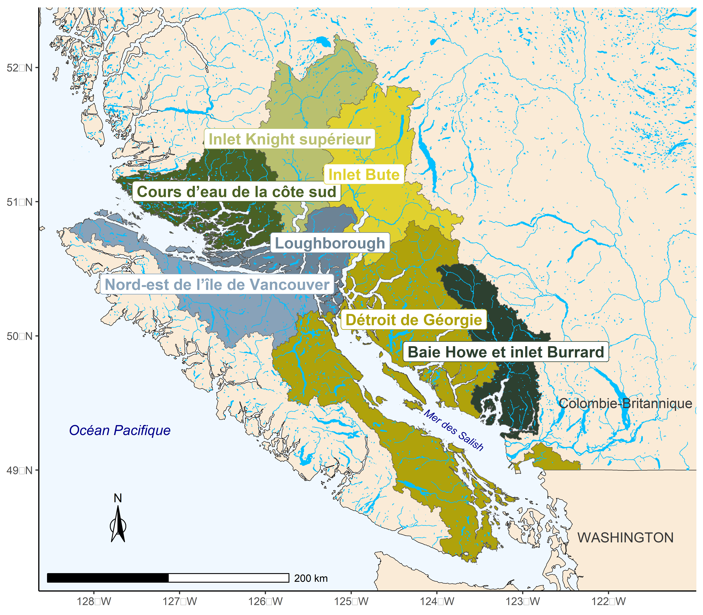
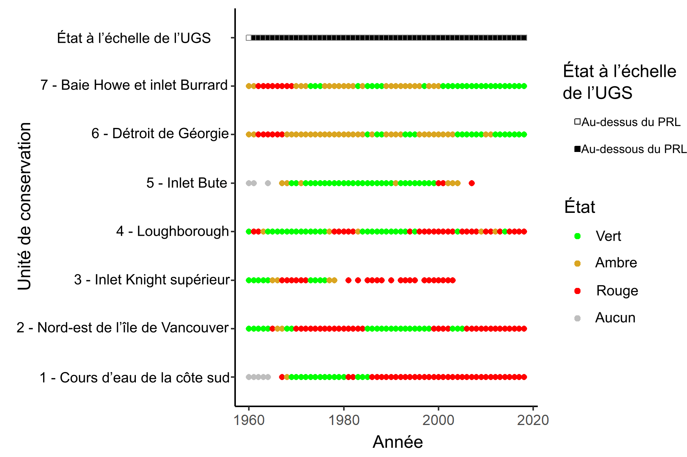
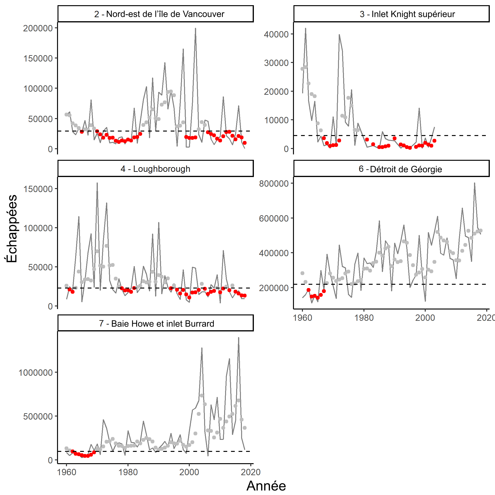
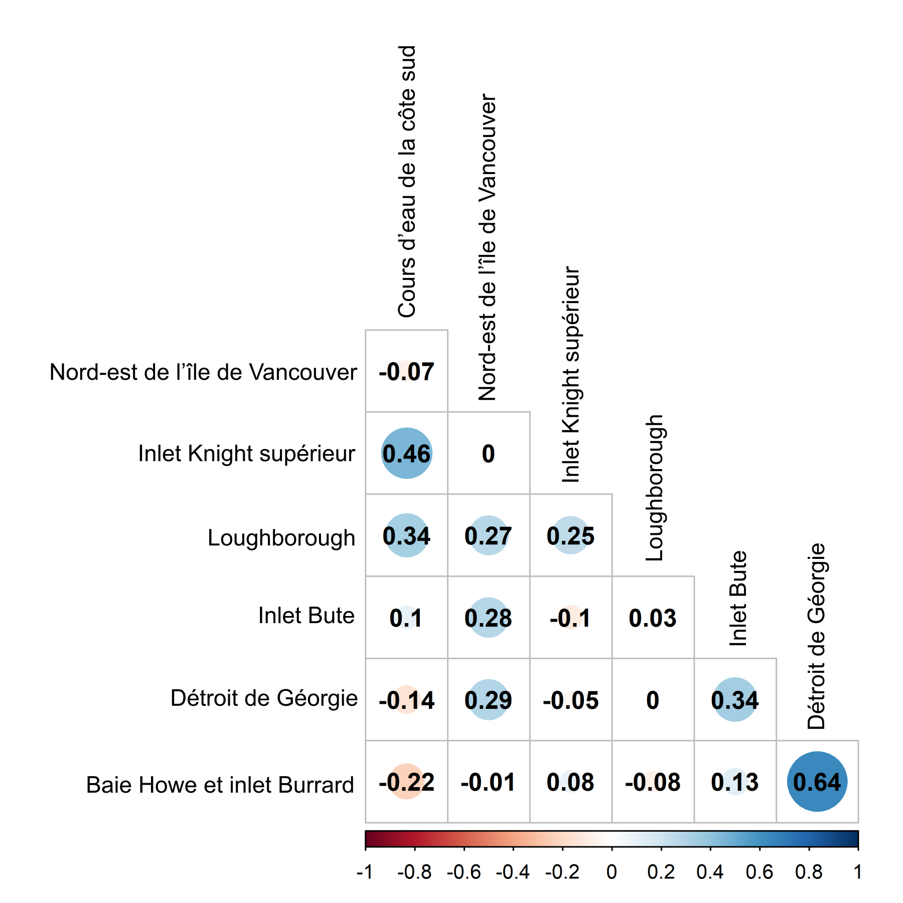
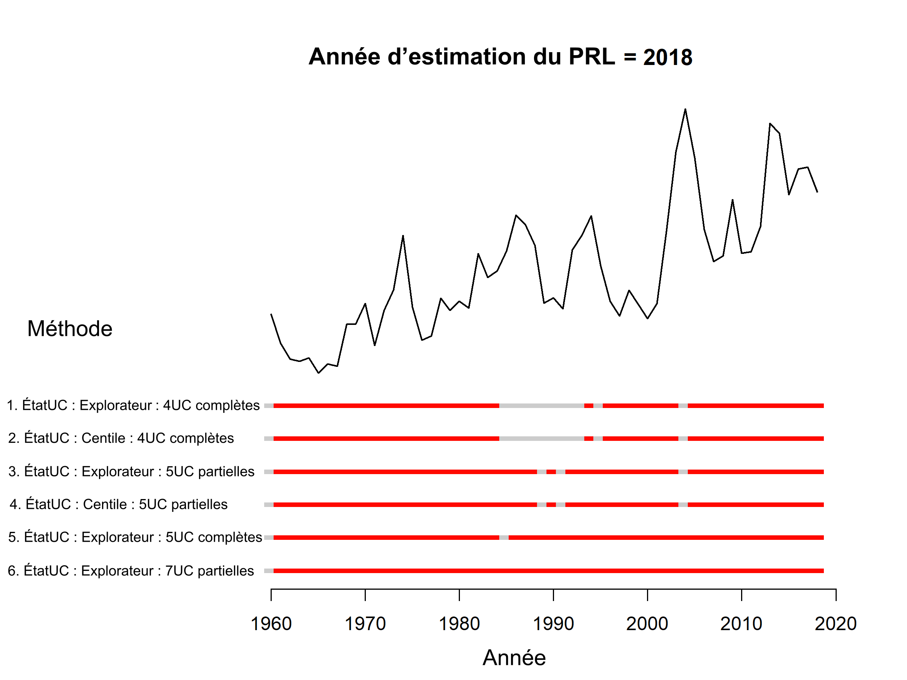

---
output:
  pdf_document: default
  html_document: default
---
\newpage
# ÉTUDE DE CAS 3 : SAUMON KÉTA DE LA CÔTE SUD INTÉRIEURE, À L’EXCLUSION DES UC DU FLEUVE FRASER{#ISCchumChapter}

## CONTEXTE {#chum-context}

L’UGS de saumon kéta de la côte sud intérieure à l’exclusion des UC du fleuve Fraser (ci-après appelé «~saumon kéta de la CSI~») comprend sept UC de saumon kéta provenant de rivières qui se déversent dans le détroit de Johnstone et la mer des Salish le long de la partie continentale de la Colombie-Britannique et de la côte est de l’île de Vancouver (figure \@ref(fig:chum-map); @holtbyConservationUnitsPacific2007). Cette zone comprend des fjords profonds, des glaciers, de grandes rivières et de petits cours d’eau côtiers. Les UC de saumon kéta frayant dans le bassin hydrographique du fleuve Fraser ne sont pas incluses dans cette UGS. Elles ont été classées comme appartenant à une UGS particulière appelée «~UGS de saumon kéta de la côte sud intérieure – Fraser~». Bien que ces deux UGS présentent un chevauchement important dans les pêches en mer, elles ont été séparées en fonction des différences relatives aux répercussions de la pêche en zone terminale et aux habitats d’eau douce.


```{r chum-map, fig.cap="Les sept unités de conservation qui composent l’unité de gestion des stocks de saumon kéta de la côte sud intérieure (à l’exclusion des unités de conservation du bas Fraser et du canyon du Fraser).", warning=FALSE, echo=FALSE, fig.align="center"}

```
\linebreak

L’UGS de saumon kéta de la CSI est considérée comme ayant des données limitées. Bien que des séries chronologiques sur les échappées soient disponibles pour de nombreux cours d’eau à partir de 1953, plusieurs séries sont incomplètes et nécessitent des hypothèses de remplissage (c’est-à-dire qu’il n’y a pas de dénombrement dans tous les cours d’eau chaque année et que certaines UC n’ont pas été l’objet d’un dénombrement certaines années). De plus, les reconstitutions des remontes et du recrutement sont incertaines, ce qui rend problématique l’élaboration de points de référence fondés sur les données sur les géniteurs et le recrutement. Il n’y a pas non plus de données sur la survie en mer (mais il y a des données sur l’échelle/la croissance dans @debertinMarineGrowthPatterns2017). Les autres caractéristiques uniques de cette UGS comprennent un contraste élevé de l’abondance entre les UC et une corrélation relativement faible de l’abondance entre les UC au fil du temps. L’UGS couvre une vaste zone comprenant de nombreux bassins hydrographiques, régimes d’écoulement et points d’entrée dans l’océan. Aucune évaluation de l’état selon la PSS n’a été effectuée pour les UC du saumon kéta de la CSI. @godboutStockStatusWild2004  ont recensé des augmentations ou une abondance variable à long terme dans le détroit de Géorgie et la baie Howe et l’inlet Burrard et des déclins dans le nord-est de l’île de Vancouver et en particulier dans l’UC des cours d’eau de la côte sud (de 1953 à 2002). @holtEvaluatingBenchmarksBiological2018  sont arrivés à des résultats similaires dans une évaluation provisoire de l’état. À l’heure actuelle, aucune évaluation de l’état selon la PSS examinée par des pairs n’a été élaborée pour le saumon kéta de la CSI.


@holtGuidelinesDefiningLimitInpress indiquent les étapes à suivre pour appliquer les PRL aux UGS de saumon, dont l’une consiste à déterminer si l’état des UC pour lesquelles les données sont insuffisantes peut être représenté par d’autres UC pour lesquelles les données sont abondantes. Cela est pertinent pour l’étude de cas du saumon kéta de la CSI parce que deux UC n’ont fait l’objet d’aucune observation certaines années (inlet Knight supérieur et inlet Bute). Pour inférer l’état des UC pour lesquelles les données sont insuffisantes à partir d’UC pour lesquelles les données sont abondantes, @holtGuidelinesDefiningLimitInpress  recommandent de fournir des éléments de preuve sur les menaces, les facteurs environnementaux, les caractéristiques biologiques et la capacité de populations semblables parmi les UC.


Les UC de l’inlet Knight supérieur et l’inlet Bute sont toutes deux associées à de longs fjords partant de l’archipel Broughton et traversant la chaîne Côtière. Ils comprennent les rivières dont le cours supérieur se trouve dans la région de Cariboo, plus à l’intérieur des terres que les autres UC de l’UGS (figure \@ref(fig:chum-map)). Les UC des cours d’eau de la côte sud, du détroit de Géorgie et de la baie Howe et l’inlet Burrard comprennent également des parties de la chaîne Côtière et certains glaciers, mais dans une moindre mesure, leurs bras de mer sont plus courts et leurs bassins hydrographiques ne vont pas aussi loin à l’intérieur des terres. Les UC de l’inlet Knight supérieur et de l’inlet Bute sont uniques en ce sens qu’elles sont les seules UC de l’UGS qui ne comprennent que des bassins hydrographiques qui se déversent dans l’extrémité supérieure de longs bras de mer. Elles sont toutes deux plus éloignées que les autres UC, ce qui explique en partie pourquoi il y a moins d’observations effectuées au fil du temps au moment de la montaison automnale pour le saumon kéta.


Les UC de saumon kéta de l’inlet Knight supérieur et de l’inlet Bute sont exposé à des menaces différentes concernant l’habitat, la survie et la productivité que les cinq autres UC lors de la phase en eau douce et au début de la phase marine. Bien que ces deux UC subissent, en moyenne, des répercussions moins importantes causées par la récolte forestière, les zones imperméables et les routes, elles subissent des répercussions plus importantes causées par la défoliation des forêts et les ravageurs [@pacificsalmonfoundationPacificSalmonExplorer2021]. Elles peuvent également être exposées à des niveaux de risque différents en raison de perturbations comme la fonte des glaciers, les avalanches, les coulées de débris et les inondations, car leurs aires de répartition comprennent de grands glaciers en fonte associés à des lacs, des pentes abruptes et des terrains instables. Dans l’aire de répartition de l’UC de l’inlet Bute, l’inondation de débordement du lac glaciaire qui a causé une coulée de débris dans la rivière Southgate en novembre 2020 est un exemple d’un tel événement. Ces événements peuvent tuer tous les œufs et les alevins d’une année d’éclosion et remodeler l’habitat, ce qui a des répercussions sur l’habitat de fraie et les écosystèmes des cours d’eau pendant de nombreuses années. Ils peuvent également modifier la qualité de l’eau dans les habitats marins à proximité du littoral. Ces événements catastrophiques sont peut-être moins probables dans les bassins hydrographiques dont la topographie est plus douce et qui ne présentent pas de glaciers ni de lacs glaciaires.


Les facteurs environnementaux, les caractéristiques biologiques et la capacité de population des UC de l’inlet Knight supérieur et de l’inlet Bute diffèrent également des cinq autres UC. L’hydrologie de ces deux UC diffère probablement de celle des autres UC dont la topographie est plus basse. Les deux plus grands bassins hydrographiques de ces UC (Homathko et Klinaklini) se trouvent dans leur propre zone adaptative d’eau douce, qui indique des conditions uniques d’habitat d’eau douce (figure 76 et tableau 52 dans @holtbyConservationUnitsPacific2007). Ces bassins hydrographiques présentent de grands glaciers et de grandes quantités d’eau de fonte, comparativement à des bassins hydrographiques côtiers à plus faible altitude ayant des hydrogrammes à plus forte prédominance de pluie. Les conditions marines que rencontrent les saumoneaux qui pénètrent dans l’océan dans ces réseaux peuvent varier de celles des cinq autres UC, car ils pénètrent dans les extrémités supérieures des grands fjords. La concurrence avec d’autres saumons dans l’océan et les conditions océaniques ont une incidence sur le saumon kéta dans cette UGS [@debertinMarineGrowthPatterns2017; @litzCompetitionOddyearPink2021], bien que les déclins des populations de saumon rose dans cette région générale puissent laisser croire que ces facteurs n’ont pas d’incidence uniquement sur ces UC. En ce qui concerne les caractéristiques biologiques, les populations de saumon kéta de l’inlet Bute et de l’inlet Knight supérieur sont proportionnellement plus élevées en été (tableau \@ref(tab:CU-summary)). Les recrues par géniteur des UC de l’inlet Knight supérieur et de l’inlet Bute (estimées à l’aide du remplissage à l’échelle de l’UC, ce qui introduit une erreur) sont plus variables que pour les autres UC de cette UGS, et présentent des années très productives (>100 recrues par géniteur) et des années de très faible productivité. Ces UC ont également une capacité d’habitat plus faible, puisqu’il y a moins de cours d’eau où les saumons kéta fraient à l’automne que dans les autres UC (tableau \@ref(tab:CU-summary)). Compte tenu de ces différences, nous ne pouvons pas déduire l’état de l’inlet Bute et de l’inlet Knight supérieur à partir des autres UC. Il convient de noter que ces critères utilisés pour évaluer si l’état peut être inféré pour ces UC s’étendent à la question de savoir si des données fiables sur l’échappée des géniteurs peuvent faire l’objet d’un remplissage à l’aide des données sur l’échappée des autres UC. Par conséquent, ces UC sont éliminées pendant les années sans données sur les géniteurs dans cette étude de cas.


\needspace{0.35\textheight}

```{r CU-summary, echo=FALSE}
 d <- read.csv("data/CU_summary_table_report.csv", check.names = FALSE)

# Add french table captions:
names(d)<-c("UC", "montaison d’automne", "montaison d’été", "PRI","PRS")


 csasdown::csas_table(d,
    align = c('l', 'c', 'c','c','c'),
    caption = #ifelse(french,
                    #"French goes here",
                    "Les sept unités de conservation dans l’UGS de saumon kéta de la CSI (autre que les UC du Fraser), et le nombre de cours d’eau empruntés lors des montaisons d’automne et d’été. À noter que seuls les cours d’eau de montaison d’automne ont été utilisés dans cette étude en raison des méthodes de reconstitution des montaisons. PRI = point de référence inférieur, PRS = point de référence supérieur obtenu au moyen de la méthode fondée sur le centile.")
             #)
```

\afterpage{\clearpage}


<!-- \begin{center} -->
<!-- \begin{longtable}{ l c c c c } -->
<!-- \caption{The seven Conservation Units in the Inside South Coast Chum Non-Fraser Stock Management Unit. Note that only fall run streams were used in this study due to run reconstruction methods. LBM = Lower Benchmark, UBM = Upper Benchmark derived using the percentile method.} \label{tab:CU-summary} \\ -->
<!-- \hline -->
<!-- CU Name & Fall run streams & Summer run streams & LBM & UBM  \\ -->
<!-- \hline -->
<!-- Southern Coastal Streams & 23 & 8 & NA & NA \\ -->
<!-- North East Vancouver Island & 17 & 0 & 50\% & 50\% \\ -->
<!-- Upper Knight & 3 & 2 & 50\% & 50\% \\ -->
<!-- Loughborough & 37 & 0 & 50\% & 50\% \\ -->
<!-- Bute Inlet & 4 & 1 & NA & NA \\ -->
<!-- Georgia Strait & 125 & 1 & 25\% & 50\% \\ -->
<!-- Howe Sound-Burrard Inlet & 66 & 0 & 25\% & 50\% \\ -->
<!-- \hline -->
<!-- \end{longtable} -->
<!-- \end{center} -->

<!-- LW: should alpha and exploitation rate be added to this table as justification for which percentile benchmarks were chosen? Also available in Holt et al. 2018.
  CW: I suggest removin the UBM estimates, as we do not use them. And I like the idea of adding alpha and ER.
  KH: Do the UBM ever get used in the Salmon Scanner tool? If so, you could leave, but if not, remove.  Also - I like the idea of including the productivity and ER values (even if a range) used to justify which percentile to use.
  LW: We do use the UBM for the salmon scanner tool. 
  
-->

Des évaluations antérieures selon la PSS des points de référence pour le saumon kéta de de la côte sud ont montré que les points de référence fondés sur le centile peuvent être comparables à ceux fondés sur les relations stock-recrutement lorsque la productivité est relativement élevée et la récolte, relativement faible [@holtEvaluatingBenchmarksBiological2018]. Cependant, dans certains cas, les points de référence fondés sur le centile peuvent être inappropriés en raison d’une faible productivité ou d’une récolte élevée, ce qui entraîne une base de référence changeante [@holtEvaluatingBenchmarksBiological2018].


Nous avons choisi l’UGS de saumon kéta de la CSI pour une étude de cas parce que nous souhaitions explorer les options de PRL pour une UGS à données limitées sans points de référence fondés sur le stock-recrutement ou l’habitat. Nous avons appliqué les PRL en fonction de deux méthodes : les proportions d’UC dont l’état se trouve au‑dessus de la zone rouge et les PRL fondés sur l’abondance agrégée estimés au moyen de l’approche de régression logistique.

## DONNÉES

Nous avons utilisé les mêmes données utilisées dans @holtEvaluatingBenchmarksBiological2018, mais mises à jour avec cinq années supplémentaires de données. Les données disponibles comprenaient des séries chronologiques sur l’abondance des géniteurs de 1959 à 2018 et le recrutement correspondant à l’échelle de l’UC estimées à partir de la reconstitution des remontes. Les séries chronologiques sur l’abondance des géniteurs dépendent fortement du remplissage; 60 % des observations (dénombrement des géniteurs pour un cours d’eau donné, au cours d’une année donnée) manquaient et devaient faire l’objet d’un remplissage. Dans la mesure du possible, nous avons choisi d’appliquer des procédures de remplissage pour cette UGS afin d’élaborer des paramètres de l’abondance des géniteurs sauvages, puisque les méthodes de remplissage pour cette UGS ont déjà fait l’objet d’un examen par les pairs [@holtEvaluatingBenchmarksBiological2018]. Cela diffère de l’approche adoptée pour le saumon chinook de la COIV, où les méthodes de remplissage n’ont pas été mises en œuvre en raison des influences élevées et variables des poissons d’écloserie. Les données de recrutement sont considérées comme très incertaines pour toutes les UC du saumon kéta de la CSI en raison des hypothèses incertaines requises pour attribuer les prises de pêche mixte aux UC dans le modèle de reconstitution des remontes. Par conséquent, nous n’avons pas considéré que les séries chronologiques du recrutement étaient suffisamment fiables pour estimer les points de référence fondés sur le stock-recrutement comme G\textsubscript{RMD} et G\textsubscript{gén}. Nous avons toutefois utilisé les ajustements du modèle fondé sur le recrutement par géniteur pour fournir des estimations approximatives de la productivité à l’échelle de l’UC, qui sont utilisées pour éclairer l’application de points de référence fondés sur le centile.


@vanwillInnerSouthCoast2014 fournissent plus de détails sur les sources de données, les procédures de remplissage et la reconstitution des remontes, qui ont été reproduites pour cette étude. Nous n’avons pas inclus les UC du saumon kéta du bas Fraser et du canyon du Fraser. Vous trouverez de plus amples renseignements à l’annexe \@ref(app:appendix-chum). Nous avons retiré trois réseaux présentant des mises en valeur importantes (la rivière Qualicum et la rivière Little Qualicum à partir des chenaux de ponte, et la rivière Puntledge à partir d’écloseries, le tout dans l’UC du détroit de Géorgie). On suppose que la contribution des poissons mis en valeur à la fraie était proche de 100 % pour ces réseaux.

## ESTIMATION DE L’ÉTAT DES UC

Pour cette étude de cas, nous examinons deux approches pour caractériser l’état des UC :
1) algorithme multidimensionnel de l’Explorateur (Pestal et al., en préparation);
2) abondance à l’échelle de l’UC par rapport à un PRI en centile.


La première approche est une approche multidimensionnelle conforme à la PSS, comme l’a recommandé @holtGuidelinesDefiningLimitInpress pour estimer l’état des UC lorsqu’on utilise l’approche du PRL fondé sur l’état des UC. La deuxième approche est présentée à des fins de comparaison avec l’approche multidimensionnelle.


Lorsque nous avons appliqué l’algorithme multidimensionnel de l’Explorateur au saumon kéta de la CSI, nous avons utilisé des points de référence fondés sur le centile lorsqu’ils étaient disponibles pour une UC. Pour les UC pour lesquelles les points de référence fondés sur le centile n’étaient pas appropriés, l’algorithme multidimensionnel a utilisé les tendances de l’abondance des géniteurs comme base pour évaluer l’état des UC (figure \@ref(fig:decision-tree)). Par conséquent, nos deux approches de l’estimation de l’état des UC dépendent au moins en partie des points de référence fondés sur le centile.


Des points de référence fondés sur le centile peuvent être appliqués pour évaluer l’état des UC lorsque d’autres données – comme des points de référence fondés sur la productivité ou l’habitat – ne sont pas disponibles ou fiables [@holtEvaluatingBenchmarksBiological2018; @clarkEvaluationPercentileApproach2014]. La pertinence des points de référence fondés sur le centile a été évaluée pour le saumon kéta de la CSI par @holtEvaluatingBenchmarksBiological2018, qui ont testé la mesure dans laquelle les points de référence fondés sur le centile correspondaient aux points de référence des paramètres de stock-recrutement, à l’aide d’analyses rétrospectives et de simulations. @holtEvaluatingBenchmarksBiological2018 ont également calculé des points de référence en fonction des paramètres du modèle de stock-recrutement pour les UC de saumon kéta de la CSI, mais ne les ont pas recommandés en raison de l’incertitude des données sur les géniteurs et le recrutement. Ils ont évalué la mesure dans laquelle un point de référence fondé sur le centile de 25 % (et des valeurs supérieures jusqu’à 50 %) se comparait aux estimations de G\textsubscript{gén}  pour ces UC. Ils ont constaté que les points de référence fondés sur le centile (de 25 % à 50 %) sous des taux de récolte modérés à élevés et une productivité faible à modérée avaient tendance à sous-estimer les valeurs « réelles » de G\textsubscript{gén} (estimées à partir des mêmes données), ce qui mènerait à des évaluations optimistes et erronées de l’état. Plus de travaux portant sur les solutions de rechange aux points de référence fondés sur le centile étaient nécessaires dans ce cas.


Pour cette étude de cas, les points de référence fondés sur le centile ont été calculés à l’aide de la série chronologique brute (c’est‑à‑dire non lissée) n’ayant pas fait l’objet d’un remplissage de l’échappée annuelle. En revanche, l’état pour l’année $i$ a été déterminé en comparant l’abondance moyenne générationnelle (moyenne géométrique sur une période de quatre ans, se terminant par l’année $i$) des géniteurs avec le point de référence. Cette approche qui consiste à utiliser les échappées brutes (non lissées) pour calculer les points de référence, et les échappées générationnelles lissées pour estimer l’état des UC par rapport aux points de référence, est conforme aux approches adoptées pour nos deux autres études de cas pour les PRL fondés sur l’abondance proportionnelle.
\needspace{0.35\textheight}

\renewcommand*{\arraystretch}{1.5}
\begin{table}[ht]
\centering
\caption{Certains PRI et PRS fondés sur le centile ont été déterminés comme ayant une valeur semblable ou supérieure aux points de référence fondés sur le stock-recrutement selon la PSS, ainsi que des gradients de productivité (Ricker $\alpha$) et des taux de récolte moyens. * Désigne le scénario de faible productivité où les PRI et PRS fondés sur le modèle de Ricker sont très proches les uns des autres, ce qui donne des PRI et PRS fondés sur le centile qui sont les mêmes. Adapté du tableau 6, Holt et al. 2018.}
\begin{tabular}{l l p{2.5cm} p{2.5cm} p{2.5cm}}
\hline       &     & \multicolumn{3}{l}{Taux d’exploitation }\\
& & <20\% & 20-40\% & 40-60 \% \\
\hline
Productivité (Ricker $\alpha$) & >4 & 25 (inférieur)  50 (supérieur) & 25 (inférieur) 50 (supérieur) & 25 (inférieur) 50 (supérieur) \\
& 2.5-4 & 25 (inférieur) 50 (supérieur) & 25 (inférieur) 50 (supérieur) & Évaluation plus poussée requise \\
& 1.5-2.5 & *50 (lower and upper) & Évaluation plus poussée requise & Évaluation plus poussée requise \\
\hline
\end{tabular}
(\#tab:holt-tab6)
\end{table}

\afterpage{\clearpage}


D’après les recommandations formulées dans@ holtEvaluatingBenchmarksBiological2018 (tableau \@ref(tab:holt-tab6)), les UC du détroit de Géorgie et de la baie Howe et de l’inlet Burrard entrent dans la catégorie de l’utilisation de 25 % comme PRI et de 50 % comme PRS (Ricker $\alpha$ 2,5 à 4, taux de récolte 20 à 40 %). Les UC de Loughborough, du nord-est de l’île de Vancouver et de l’inlet Knight supérieur ($\alpha$  1,5 à 2,5 et taux de récolte de 0 à 20 %) affichaient un PRI et PRS recommandés de 50 %. L’UC de l’inlet Bute ($\alpha$ 1,5 à 2,5, taux de récolte de 20 à 40 %) a dû faire l’objet d’une évaluation plus poussée et des points de référence fondés sur le centile n’ont pas été recommandés. Les points de référence fondés sur le centile n’ont pas été recommandés pour l’UC des cours d’eau de la côte sud en raison d’une faible productivité ($\alpha$ < 1,5; tableau \@ref(tab:CU-summary)).


Les méthodes d’évaluation multidimensionnelles de l’Explorateur sont décrites à la section \@ref(MethodsChapter). En appliquant l’approche multidimensionnelle au saumon kéta de la CSI, nous avons utilisé des points de référence fondés sur le centile, comme il est recommandé dans @holtEvaluatingBenchmarksBiological2018, pour le PRI et le PRS des cinq UC qui ont des points de référence en fondés sur le centile appropriés (comme décrit ci-dessus). Les points de référence fondés sur le centile n’étaient pas disponibles pour les UC de l’inlet Bute et des cours d’eau de la côte sud, auquel cas l’algorithme multidimensionnel a utilisé des tendances pour évaluer l’état des UC (figure \@ref(fig:decision-tree)).


## ESTIMATION DES PRL FONDÉS SUR L’ÉTAT DES UC


###  Méthodes

Pour obtenir les PRL fondés sur l’état des UC, nous avons calculé la proportion d’UC dont l’estimation de l’état se situait au-dessus de la zone rouge (ou au-dessus des PRI fondés sur le centile). Comme pour les études de cas du saumon coho du Fraser intérieur et du saumon chinook de la COIV, nous avons exigé que toutes les UC se situent au-dessus de la zone rouge pour que l’UGS de saumon kéta de la CSI soit classée au-dessus du PRL.


L’approche à paramètre unique pour évaluer l’état des UC fondé sur le centile comporte des exigences particulières en matière de données [@holtEvaluatingBenchmarksBiological2018] tandis que l’approche multidimensionnelle peut être appliquée à n’importe quelle UC ayant au moins une série chronologique cohérente de l’abondance des géniteurs. Pour comparer les PRL en fonction de l’évaluation de l’UC à partir de ces deux approches, nous avons comparé les sous-ensembles de données, y compris ceux qui utilisaient les mêmes données pour chaque méthode, et toutes les données appropriées pour chaque méthode. Nous avons évalué six combinaisons différentes de données et de méthodes relatives aux PRL (tableau \@ref(tab:LRP-scenarios)).

\needspace{0.35\textheight}

\renewcommand*{\arraystretch}{1.5}
\begin{table}[ht]
\centering
\caption{Scénarios utilisant différents sous-ensembles de données (noms des UC abrégés) et méthodes de détermination de l’état du PRL. « Y » indique une série chronologique complète, « YP » indique qu’une série chronologique a été incluse, mais qu’elle est partielle (années manquantes qui nécessitaient un remplissage à l’échelle de l’UC qui ont été omises). Les UC de l’inlet Bute et des cours d’eau de la côte sud n’ont pas de points de référence fondés sur le centile appropriés. Les scénarios « complets » utilisent seulement les années ayant des séries chronologiques ayant fait l’objet d’un remplissage (pas d’UC ayant fait l’objet d’un remplissage à l’échelle de l’UC) et les scénarios « partiels » comprennent les UC ayant fait l’objet d’un remplissage à l’échelle de l’UC, mais ils laissent tomber les années avec un remplissage à l’échelle de l’UC pour ces UC.}
\begin{tabular}{l c c c c c c c }
\hline
Nom du scénario &   \rotatebox{90}{Cours d’eau de la côte sud } &   \rotatebox{90}{ Nord-est de l’île de Vancouver } &  \rotatebox{90}{ Inlet Knight supérieur } &  \rotatebox{90}{  Loughborough } &  \rotatebox{90}{  Inlet Bute } & \rotatebox{90}{  Détroit de Géorgie} & \rotatebox{90}{  Baie Howe et inlet Burrard}\\
\hline

1. ÉtatUC : Explorateur : 4UC complètes     & - & Y & -  & Y & -  & Y & Y \\
2. ÉtatUC : Centile : 4UC                   & - & Y & -  & Y & -  & Y & Y \\
3. ÉtatUC : Explorateur : 5UC partielles    & - & Y & YP & Y & -  & Y & Y \\
4. ÉtatUC : Centile : 5UC partielles        & - & Y & YP & Y & -  & Y & Y \\
5. ÉtatUC : Explorateur : 5UC complètes     & Y & Y & -  & Y & -  & Y & Y \\
6. ÉtatUC : Explorateur : 7UC partielles    & Y & Y & YP & Y & YP & Y & Y \\
\hline
\end{tabular}
(\#tab:LRP-scenarios)
\end{table}

\afterpage{\clearpage}


Lorsque nous décrivons les scénarios de PRL pour le saumon kéta de la CSI dans le tableau \@ref(tab:LRP-scenarios) et tout au long de cette étude de cas, nous utilisons la convention d’étiquetage suivante : * Paramètre : Méthode pour déterminer l’état des UC : Scénario de données*. « Paramètre » désigne le choix de baser tous les PRL du saumon kéta de la CSI sur la proportion d’UC dont l’état se situe au-dessus de la zone rouge de l’UC (ÉtatUC). La « méthode pour déterminer l’état des UC » peut être fondée sur l’algorithme multidimensionnel de l’Explorateur ou sur un point de référence unique fondé sur le centile utilisé pour caractériser l’état des UC (centile). Enfin, le « scénario de données » indique à la fois le nombre d’UC représentées (4, 5 ou 7) et l’intégralité de la série chronologique (complète ou partielle). Les scénarios complets ne comprenaient que les UC dotés de séries chronologiques complètes (aucune UC ayant des années manquantes). Les scénarios partiels comprenaient des UC dont les séries chronologiques étaient incomplètes (les années pour lesquelles il n’y avait pas d’observations dans ces UC ont été omises). Lorsque nous avons utilisé des points de référence fondés sur le centile dans ces scénarios, nous avons utilisé des centiles fondés sur @holtEvaluatingBenchmarksBiological2018. Les points de référence ont été estimés à l’aide de la série chronologique complète.


Pour les scénarios 2 et 4 du tableau  \@ref(tab:LRP-scenarios), nous avons utilisé l’état des UC en fonction des points de référence fondés sur le centile qui sont déterminés par la productivité et l’exploitation historique, comme indiqué dans @holtEvaluatingBenchmarksBiological2018. Cette méthode a utilisé les valeurs annuelles des échappées pour calculer les points de référence et la moyenne générationnelle des échappées (moyenne géométrique sur quatre ans) pour évaluer l’état chaque année. Le scénario 2 comprend les quatre UC qui comportaient des séries chronologiques complètes (observations chaque année, pas de remplissage à l’échelle de l’UC) et qui avaient également des points de référence fondés sur le centile appropriés (tableau \@ref(tab:LRP-scenarios)). Par exemple, l’UC de l’inlet Knight supérieur a été exclue parce que sa série chronologique était incomplète, l’UC des cours d’eau de la côte sud a été exclue parce qu’elle n’avait pas de point de référence fondé sur le centile approprié, et l’UC de l’inlet Bute a été exclue pour ces deux raisons. Nous avons ensuite assoupli cette exigence pour que toutes les UC aient des données pour toutes les années et nous avons inclus toutes les UC qui respectent les contraintes de @holtEvaluatingBenchmarksBiological2018, même si elles avaient des données manquantes pour certaines années (scénario 4). Ce scénario incluait l’UC de l’inlet Knight supérieur au cours de certaines années, ce qui signifie qu’il y avait cinq UC certaines années et quatre dans d’autres. Ainsi, la puissance de détection d’un état en zone rouge a varié d’une année à l’autre dans le scénario 4, en utilisant plus de données disponibles que dans le scénario 2.

Pour les scénarios 1, 3, 5 et 6 dans le tableau \@ref(tab:LRP-scenarios), nous avons utilisé l’état basé sur l’algorithme multidimensionnel de l’Explorateur. Pour comparer les résultats entre l’état d’un seul paramètre (abondance par rapport aux points de référence fondés sur le centile) et l’approche multidimensionnelle, nous avons appliqué l’algorithme multidimensionnel aux deux mêmes ensembles de données utilisés pour les centiles, c’est-à-dire en utilisant les mêmes UC et années. Par exemple, les scénarios 1 et 2 utilisent les mêmes données, et les scénarios 3 et 4 utilisent les mêmes données. Étant donné que les évaluations multidimensionnelles n’exigent pas de points de référence fondés sur l’abondance pour attribuer l’état, cette méthode pourrait également être utilisée pour les UC qui n’avaient pas de points de référence fondés sur le centile appropriés (UC des cours d’eau de la côte sud et de l’inlet Bute). Le scénario 5 ne comprenait que des UC avec une série chronologique complète, et le scénario 6 comprenait les UC de l’inlet Knight supérieur et de l’inlet Bute, dont certaines années manquaient.


### Résultats

**État des UC fondé sur l’approche multidimensionnelle de l’Explorateur de l’état des saumons**

Si l’on utilise l’état des UC en fonction de l’approche multidimensionnelle de l’Explorateur, deux des cinq UC ayant des données pour l’année la plus récente (2018) seraient au-dessus de leur PRI (zone ambre ou verte) et trois seraient au-dessous (zone rouge; figure \@ref(fig:chum-CU-status-tree)). Au cours de la série chronologique, l’état de l’UC de la baie Howe et de l’inlet Burrard et de l’UC du détroit de Géorgie s’est amélioré, tandis que celui des autres UC a décliné ou est passé du vert au rouge à plusieurs reprises.

```{r chum-CU-status-tree, fig.cap="État des UC fondé sur l’approche multidimensionnelle de l’Explorateur. Les années avec remplissage à l’échelle de l’UC n’ont pas été incluses. La ligne du haut indique l’état global de l’UGS en fonction de l’état du PRL fondé sur l’état des UC de toutes les UC dont l’état se trouve au-dessus de la zone rouge.", warning=FALSE, echo=FALSE, fig.align="center"}

```


<!-- LW: note this figure is created in SOLV-Code/TEMP-Chum-Synoptic repo right now -->

<!--KH: added below lines to force a space before next header -->
\
&nbsp;

**État des UC en fonction des points de référence fondés sur le centile**

Deux UC sur quatre se trouvaient au-dessous de leur PRI fondé sur le centile en 2018 (figure \@ref(fig:chum-perc-status-static)). L’état des UC de la baie Howe-inlet Burrard et du détroit de Géorgie se situait au-dessus du PRI, et l’UC de l’inlet Knight supérieur n’avait pas fait l’objet d’observations en 2018. L’état des UC du nord-est de l’île de Vancouver et de Loughborough était à l’occasion au-dessus de la zone rouge avant les années 2000, mais il a été principalement en zone rouge au cours des $\sim$ 20 dernières années. L’état des UC du détroit de Géorgie et de la baie Howe et de l’inlet Burrard est au-dessus de la zone rouge chaque année depuis $\sim$  1970. L’état de l’UC de l’inlet Knight supérieur a été principalement classé en zone rouge, sauf pendant deux courtes périodes dans les années 1960 et 1970, et il n’y a eu aucune observation depuis 2004.


```{r chum-perc-status-static, fig.cap="Échappées de géniteurs (ligne noire pleine) avec la moyenne générationnelle (moyenne géométrique mobile sur quatre ans) des échappées représentée par des points. Les lignes pointillées indiquent des PRI fondés sur le centile. Les points rouges indiquent les années où la moyenne générationnelle de l’abondance était inférieure au PRI, et les points gris indiquent le moment où elle était supérieure. Les UC des cours d’eau de la côte sud et de l’inlet Bute sont omises parce qu’elles n’ont pas de points de référence fondés sur le centile appropriés en raison d’une faible productivité et d’une récolte modérée à élevée. À noter que des observations sont manquantes pour l’UC de l’inlet Knight supérieur en 1979, 1980, 1982, 1984, 1989, 1991, 1996 et 2004 à 2018.", warning=FALSE, echo=FALSE, fig.align="center", height=8}

```

<!-- LW: note this figure is created in SOLV-Code/TEMP-Chum-Synoptic repo right now -->


Dans des analyses supplémentaires, nous avons évalué rétrospectivement les points de référence fondés sur le centile pour chaque année de la série chronologique en utilisant uniquement les données antérieures à cette année-là. À mesure que d’autres années de données étaient incluses, les points de référence fondés sur le centile ont augmenté au fil du temps pour l’UC du détroit de Géorgie (en particulier le 50^e^ centile) et ont connu des augmentations modestes pour l’UC de la baie Howe et de l’inlet Burrard (figure \@ref(fig:chum-perc-retro)). Les points de référence fondés sur le centile ont un peu diminué pour les UC de Loughborough et du nord-est de l’île de Vancouver. L’UC des cours d’eau côtiers du sud montrent des signes de bases de référence changeante, car les centiles diminuent au fil du temps à la suite d’une diminution générale de l’abondance (figure \@ref(fig:chum-perc-retro)). L’UC de l’inlet Knight supérieur montre également cette tendance, mais dans une moindre mesure.


## ESTIMATION DES PRL FONDÉS SUR L’ABONDANCE AGRÉGÉE PAR RÉGRESSION LOGISTIQUE

### Méthodes

Nous avons évalué si la proportion d’UC au-dessus de leur PRI pouvait être prédite par l’abondance agrégée au moyen de modèles de régression logistique. Nous l’avons testé à l’aide de points de référence fondés sur le centile. Bien que nous ayons initialement considéré les PRL de régression logistique qui utilisaient G~gén~ comme PRI de l’UC plutôt que des centiles, nous avons décidé d’abandonner cette approche en raison de données de stock-recrutement peu fiables. L’utilisation des données de recrutement ne respecterait pas les principes de fiabilité dans @holtGuidelinesDefiningLimitInpress. Ces méthodes ont utilisé quatre UC comportant plus de 50 années de données et des points de référence fondés sur le centile appropriés (nord-est de l’île de Vancouver, Loughborough, détroit de Géorgie et baie Howe et inlet Burrard). L’abondance agrégée (variable explicative) a été calculée en n’utilisant que ces quatre UC. Nous avons omis les UC de l’inlet Bute et de l’inlet Knight supérieur (toutes deux ont fait l’objet d’un remplissage à l’échelle de l’UC au cours des dernières années) et l’UC des cours d’eau de la côte sud (aucun point de référence fondé sur le centile approprié). Voir la section \@ref(MethodsChapter) pour obtenir de plus amples détails.


En raison de mauvais ajustements des modèles logistiques utilisant l’ensemble de la série chronologique de 1953 à 2018, nous n’avons pas effectué d’analyses rétrospectives des PRL de régression logistique pour cette UGS, comme nous l’avons fait pour l’étude de cas du saumon coho du Fraser intérieur. Les caractéristiques des données qui ont entraîné de mauvais ajustements des modèles logistiques sont mises en évidence dans la section des résultats ci-dessous.


Les PRL de projection sont des PRL fondés sur l’abondance agrégée de rechange que nous n’avons pas pris en compte pour cette UGS en raison du manque d’estimations fiables des paramètres de stock-recrutement pour les UC constituantes. Toutefois, cette approche pourrait être envisagée dans les analyses futures, étant donné le consensus sur la structure du modèle et le paramétrage qui fournissent des incertitudes réalistes dans les projections de la dynamique de la population.


&nbsp;

### Résultats


Le modèle logistique prédisant si toutes les UC étaient au-dessus de leur point de référence en fonction de l’abondance agrégée correspond mal aux données (figure \@ref(fig:chum-logistic-perc)). La somme de l’abondance de toutes les UC au cours d’une année donnée n’était pas un bon indicateur pour déterminer si ces UC se situaient au-dessus de leurs points de référence cette année-là. Les années où l’abondance agrégée est élevée, mais où certaines UC se situent au-dessous de leur point de référence font qu’un modèle logistique ne convient pas pour estimer quelle abondance agrégée est liée à une forte probabilité que chaque UC constituante soit au-dessus de son PRI.

Les diagnostics de la régression logistique ont indiqué que l’ajustement du modèle était mauvais (tableau \@ref(tab:logistic-diag-chum), figure \@ref(fig:chum-logistic-perc)). Pseudo $R^2$ était faible (0,03), ce qui indique un mauvais ajustement. Le test Box-Tidwell a indiqué un manque important de linéarité dans la relation entre l’abondance agrégée et les logarithmes du rapport des cotes (valeur p = 0,02), ce qui signifie que l’hypothèse selon laquelle la relation entre l’abondance des agrégats et les logarithmes du rapport des cotes est linéaire n’a pas été respectée. L’inclusion de l’abondance agrégée dans le modèle n’a pas amélioré l’ajustement par rapport au modèle nul en fonction d’une valeur p de la qualité d’ajustement de 0,13 (> 0,05). Le ratio des bonnes classifications (ci-dessus inférieur au PRL) par rapport à toutes les classifications était de 0,7 selon le PRL à p=0,5. À noter que cette méthode a tendance à présenter des valeurs trop optimistes lorsque les données utilisées pour ajuster le modèle logistique et pour évaluer l’exactitude de la classification sont les mêmes. La valeur p de Wald n’était pas significative pour $B_{1}$ (p = 0,19, le coefficient de l’abondance agrégée). Il n’y avait aucun signe de valeurs aberrantes ou d’autocorrélation dans les écarts résiduels. Bien qu’elles satisfaisaient aux deux dernières hypothèses (pas d’autocorrélation ni de valeurs aberrantes), elles n’étaient pas suffisantes pour combler les lacunes relevées par les autres critères de diagnostic. Par conséquent, les PRL de régression logistique ne sont pas présentés ici.

&nbsp;
&nbsp;
&nbsp;


```{r chum-logistic-perc, fig.cap="Régression logistique de la question de savoir si les échappées de toutes les UC constituantes étaient supérieures à leurs points de référence fondés sur le centile en fonction de l’abondance agrégée, pour l’UGS de saumon kéta de la CSI. Comprend les UC pour lesquelles des points de référence fondés sur le centile étaient appropriés (sans les UC de l’inlet Bute, de l’inlet Knight supérieur et des cours d’eau de la côte sud).", warning=FALSE, out.width = '80%', echo=FALSE, fig.align="center"}
#if(!file.exists('figure/chum-logistic-perc.pdf'))
  download.file('https://github.com/Pacific-salmon-assess/SalmonLRP_RetroEval/raw/master/SCChumStudy/Figures/AnnualRetrospective/Bern.Percentile_noCUinfill_90/LogisticMod_2018.pdf', './figure/chum-logistic-perc.pdf', mode="wb")
knitr::include_graphics('figure/chum-logistic-perc.pdf')
```


<!--
Download diagnostic info for checking
```{r logistic-fit-diag-perc, echo=FALSE}
#download.file("https://github.com/Pacific-salmon-assess/SalmonLRP_RetroEval/raw/master/SCChumStudy/DataOut/logisticFit_2018Output.rda",'./data/chum-diagnostics.rda', mode="wb" )
#load("data/chum-diagnostics.rda")
#LRdiagOut
```
-->
\needspace{0.35\textheight}

+-------------------------------------+--------------+
| Test de diagnostic                  | Valeur       |
+=====================================+==============+
| Valeur p de Box-Tidwell             | 0.02         |
+-------------------------------------+--------------+
| Valeur résiduelle maximale          | 1.69         |
+-------------------------------------+--------------+
| AR-1                                | 0.14         |
+-------------------------------------+--------------+
| Valeur p de Wald                    | 0.19         |
+-------------------------------------+--------------+
| Valeur p de la qualité d’ajustement | 0.13         |
+-------------------------------------+--------------+
| Pseudo-$R^2$                        | 0.03         |
+-------------------------------------+--------------+
| Taux de réussite (p = 50 %)         | 0.7          |
+-------------------------------------+--------------+

Table: (\#tab:logistic-diag-chum) Statistiques diagnostiques modèles à partir du PRL de régression logistique à l’aide de points de référence fondés sur le centile. Une description des tests de diagnostic est fournie à la section 2. Les taux de réussite sont indiqués pour p = 0,5.

\afterpage{\clearpage}

Plusieurs facteurs ont mené à ces mauvais ajustements du modèle. L’UGS de saumon kéta de la CSI est composée de sept UC dont l’abondance des échappées varie. Depuis de nombreuses années, les échappées dans le détroit de Géorgie et dans la baie Howe et l’inlet Burrard sont de deux ordres de grandeur supérieure à celles des autres UC (figure \@ref(fig:chum-spawner-distribution)). De plus, la corrélation des échappées entre ces sept UC est faible (figure \@ref(fig:chum-spawner-corr)). Ces caractéristiques signifient que l’abondance agrégée peut être élevée en raison d’une ou de plusieurs UC ayant des échappées élevées, tandis qu’une UC plus petite si situe au-dessous de son point de référence. Les échappées agrégées élevées ne signifient pas que toutes les UC sont au-dessus de leur point de référence. Les faibles corrélations par paires dans les échappées des UC sont probablement dues au fait que l’UGS couvre une vaste zone, avec des nombres variables de populations touchées par des facteurs locaux et régionaux, comme décrit dansSection \@ref(chum-context).

```{r chum-spawner-corr, fig.cap="Corrélations par paires de l’abondance des géniteurs entre les unités de conservation du saumon kéta de la CSI.", warning=FALSE, out.width='80%',echo=FALSE, fig.align="center"}
#if(!file.exists('figure/chum-spawners-corr.png'))
download.file('https://github.com/Pacific-salmon-assess/SalmonLRP_RetroEval/raw/master/SCChumStudy/Figures/fig_chum_spawners_corr.png', './figure/chum-spawners-corr.png', mode="wb")

```
&nbsp;

Dans une analyse rétrospective préliminaire, les ajustements du modèle logistique étaient plus appropriés en utilisant une partie tronquée des données qui ont pris fin dans les années 1980. Bien que la régression logistique puisse être utilisée pour estimer les PRL en fonction de l’abondance agrégée dans les UGS où l’abondance est plus égale entre les UC et où les échappées sont plus corrélées, ces relations peuvent ne pas demeurer statiques et pourraient se rompre au fil du temps.


##   ÉVALUATION HISTORIQUE DE L’ÉTAT SELON LES MÉTHODES RELATIVES AUX PRL

L’UGS de saumon kéta de la CSI se situait constamment au-dessous du PRL pour de grandes parties de la série chronologique historique, peu importe la méthode d’estimation du PRL (figure \@ref(fig:chum-LRP-compare)). Bien que l’abondance agrégée à l’échelle de l’UGS ait augmenté au fil du temps, l’état à l’échelle de l’UGS est demeuré inférieur au PRL chaque année au cours des deux dernières décennies, à l’exception de 2004 pour toutes les méthodes d’estimation. Ces résultats étaient principalement attribuables à la tendance des UC du détroit de Géorgie et de l’inlet Burrard et de la baie Howe d’avoir des abondances élevées et croissantes, tandis que les UC plus petites, comme celles du nord-est de l’île de Vancouver, de Loughborough et des cours d’eau de la côte sud, sont demeurées faibles (figures \@ref(fig:chum-perc-status-static), \@ref(fig:chum-escapement-infill)).


```{r chum-LRP-compare, fig.cap="Comparaison de l’état fondé sur le PRL (rouge = inférieur au PRL, gris = supérieur au PRL) pour six scénarios. La ligne noire montre l’abondance agrégée. Les scénarios 1 à 3 et 6 ne comprennent pas les UC de l’inlet Bute ou des cours d’eau de la côte sud (aucun point de référence fondé sur le centile approprié). Les scénarios « complets » utilisent seulement les années avec des séries chronologiques ayant fait l’objet d’un remplissage (pas d’UC ayant fait l’objet d’un remplissage à l’échelle de l’UC) et les scénarios « partiels » comprennent les UC ayant fait l’objet d’un remplissage à l’échelle de l’UC, mais ils laissent tomber les années avec un remplissage à l’échelle de l’UC pour ces UC.", echo=FALSE, fig.align="center"}
#if(!file.exists('figure/chum-compare-LRP-methods.png'))
download.file('https://github.com/Pacific-salmon-assess/SalmonLRP_RetroEval/raw/master/SCChumStudy/Figures/fig_compare_LRP_methods.png', './figure/chum-compare-LRP-methods.png', mode="wb")

```
&nbsp;

Lorsqu’on utilise les mêmes données, l’état du PRL fondé sur un seul paramètre de l’abondance par rapport aux points de référence fondés sur le centile et celui de l’approche multidimensionnelle de l’Explorateur étaient identiques (figure \@ref(fig:chum-LRP-compare)). On peut voir ce résultat en comparant les scénarios 1 et 2 et les scénarios 3 et 4. Ces résultats sont identiques parce que toutes les UC des scénarios 1 à 4 ont des points de référence fondés sur le centile et ne chutent jamais sous 1 500 poissons, ce qui signifie que l’approche multidimensionnelle repose sur des points de référence fondés sur le centile pour évaluer l’état des UC pour toutes les UC pour toutes les années. Si certaines UC n’avaient pas de points de référence fondés sur le centile, ce qui nécessitait d’utiliser plutôt des tendances, ou si leur abondance absolue avait chuté sous 1 500 géniteurs, les deux approches auraient pu donner des résultats différents.

Dans cette étude de cas, l’ajout de données supplémentaires a modifié le nombre d’années pendant lesquelles l’UGS était sous le PRL. Le scénario 6 (la plupart des données) affichait le plus grand nombre d’années se situant sous le PRL, chaque année après la première étant au-dessous du PRL (figure \@ref(fig:chum-LRP-compare), tableau  \@ref(tab:LRP-scenarios)). Une comparaison des scénarios 2 et 4, qui sont tous deux basés sur des points de référence fondés sur le centile, montre que l’inclusion d’un plus grand nombre de données (scénario 4) se traduit par un plus grand nombre d’années se situant sous le PRL. Une comparaison des scénarios 5 et 6 (Explorateur) montre que l’inclusion d’un plus grand nombre d’observations fait qu’une année est passée d’un niveau supérieur au PRL à un niveau inférieur, avec l’ajout de données provenant de deux UC ayant une série chronologique partielle. Enfin, une comparaison des scénarios 4 et 6 (où le scénario 6 comportait deux UC de plus que le scénario 4) montre que trois années sont passées d’un niveau supérieur au PRL à un niveau inférieur, alors que les deux UC sans points de référence fondés sur le centile sont ajoutés.


Nous avons constaté que l’état à l’échelle de l’UGS peut être inférieur au PRL même si l’abondance agrégée augmente (figure \@ref(fig:chum-LRP-compare)). Dans le cas du saumon kéta de la CSI, cela est principalement attribuable aux années où il y avait de fortes abondances dans le détroit de Géorgie et dans la baie Howe et l’inlet Burrard, et de faibles abondances et un état en zone rouge dans d’autres UC plus petites, comme l’UC des cours d’eau de la côte sud. La corrélation modérée de l’abondance des géniteurs dans les UC du détroit de Géorgie et de la baie Howe et de l’inlet Burrard exacerbe cette tendance (figure  \@ref(fig:chum-spawner-corr)). Cela souligne l’importance d’inclure des paramètres de l’état à l’échelle de l’UC, qui influent sur l’état global de l’UGS.


## DISCUSSION


Comme elle concernait une UGS pour laquelle les données étaient limitées, l’étude de cas sur le saumon kéta de la CSI présentait des caractéristiques uniques pour éclairer les lignes directrices visant l’élaboration du PRL. Nous avons constaté que seul le PRL fondé sur l’état des UC s’appliquait à cette UGS, qui est fondé sur l’état de chaque UC. Comme il n’y avait pas d’estimations fiables des paramètres de stock-recrutement, nous nous sommes basés sur des méthodes appropriées en cas de données limitées pour estimer l’état des UC. Nous avons évalué l’état des UC en fonction de l’abondance par rapport aux points de référence fondés sur le centile seulement, ou d’une combinaison de centiles et de tendances à l’aide de l’algorithme multidimensionnel de l’Explorateur. L’utilisation de l’algorithme multidimensionnel a été particulièrement utile parce que les points de référence fondés sur le centile n’étaient pas appropriés pour deux des UC (inlet Bute et cours d’eau de la côte sud, tableau  \@ref(tab:CU-summary)). Les données manquantes nécessitaient également que des décisions soient prises au sujet des UC à inclure dans quelles années. Nous avons utilisé cette étude de cas pour déterminer dans quelle mesure les PRL fondés sur l’état des UC étaient sensibles aux décisions relatives au nombre d’UC et aux années de données à inclure dans l’analyse.


L’utilisation d’une approche multidimensionnelle nous a permis d’inclure deux UC qui n’avaient pas de points de référence fondés sur le centile appropriés (inlet Bute et cours d’eau de la côte sud). Cela a permis d’inclure les sept UC dans l’évaluation de l’état à l’échelle de l’UGS en permettant d’envisager d’autres paramètres fondés sur les tendances. Le cas des sept UC à données partielles a fourni l’état le plus pessimiste des scénarios envisagés, car cette approche utilisait le plus de données. Le résultat est que l’UGS a été au-dessous du PRL pendant le plus grand nombre d’années (figure \@ref(fig:chum-LRP-compare)). Cette approche multidimensionnelle est particulièrement utile pour les UGS sur lesquelles on  dispose d’une variété de qualités de données et de types de points de référence, y compris celles qui ont et n’ont pas de points de référence pour l’abondance relative. Comme toute approche d’évaluation des PRL, les données sous-jacentes et les points de référence appliqués (si des points de référence sur l’abondance peuvent être utilisés) doivent être vérifiés par des experts. Dans sa forme actuelle, l’algorithme multidimensionnel de l’Explorateur repose sur la question de savoir si l’abondance est $<$ 0,79$\times$ la moyenne géométrique à long terme et si les abondances sont $>$ à 1 500 $ en l’absence de points de référence fondés sur l’abondance. Il convient de noter que cette moyenne géométrique à long terme peut également être sensible aux bases de référence changeantes. C’est une autre raison pour laquelle les experts doivent examiner attentivement les données avant de procéder à une évaluation de l’état.


Cette étude de cas a mis en évidence les exigences et les limites des points de référence fondés sur le centile pour les UC sur lesquelles les données sont limitées. Les bases de référence changeantes représentent l’un des défis liés à l’application de cette méthode. Si l’abondance a diminué au fil du temps, le point de référence fondé sur le centile qui en résulte diminuera également à mesure que d’autres données seront incluses (figure \@ref(fig:chum-perc-retro)). Cela peut découler d’une diminution de l’abondance au cours de la période de données ou d’un niveau élevé d’abondance non consigné avant la période de données, suivi d’une diminution avant que les données soient disponibles. Par conséquent, l’état d’une UC ayant une faible abondance pourrait être en zone verte en fonction du point de référence actuel, mais il serait en zone rouge en fonction d’un point de référence ayant des données recueillies avant que l’abondance diminue. Il en résulte une vision trop optimiste de l’état actuel qui ne reflète pas la réalité des déclins à long terme. Deux UC (cours d’eau de la côte sud et inlet Knight supérieur) ont montré que les bases de référence changeaient à mesure que l’abondance diminuait au cours des dernières décennies (figure \@ref(fig:chum-perc-retro)). La baisse de la productivité peut exacerber cette tendance. À mesure que la productivité diminue, il faudrait une plus grande abondance des géniteurs pour produire le même nombre de recrues. Les experts doivent examiner attentivement les données historiques sur l’abondance et déterminer où les bases de référence peuvent changer, et ils peuvent rajuster les points de référence en conséquence. Dans certains cas, il peut être approprié de choisir des points de référence fondés sur des données ou des renseignements historiques recueillis avant les déclins afin d’éviter les bases de référence changeantes [@holtCautionsUsingPercentilebased2015]. Ainsi, bien qu’ils soient utiles pour les UC sur lesquelles on n’a pas de données fiables sur le stock-recrutement, ils ne peuvent pas être utilisés universellement pour les UC sur lesquelles les données sont limitées.


Les lignes directrices et les mises en garde existantes doivent être intégrées à toute analyse du PRL au moyen de points de référence fondés sur le centile. Nous avons suivi les lignes directrices de @holtEvaluatingBenchmarksBiological2018 et n’avons pas utilisé de points de référence fondés sur le centile pour les UC à faible productivité et à taux d’exploitation élevé (tableaux \@ref(tab:CU-summary), \@ref(tab:holt-tab6)). Dans leur étude de simulation, les points de référence fondés sur le centile ont surestimé l’état avec des taux de récolte de plus de 40 % et $\alpha$ <4, ou des taux de récolte de 20 % à 40 % et $\alpha$ <2,5. Dans ces cas de faible productivité et de taux de récolte élevés, on pourrait explorer davantage les points de référence de rechange. Il pourrait s’agir de points de référence fondés sur le savoir écologique traditionnel, la disponibilité de l’habitat ou d’autres renseignements. Si la productivité ou les récoltes sont inconnues, un faible contraste dans les séries chronologiques des échappées pourrait être un indicateur de cas où les points de référence fondés sur le centile pourraient ne pas être appropriés [@holtEvaluatingBenchmarksBiological2018]. Nous remarquons également que les cas comportant des PRI et PRS identiques présentent le risque de passer immédiatement de la zone verte à la zone rouge avec une période dans la zone ambre (nord-est de l’île de Vancouver, inlet Knight supérieur, Loughborough; tableau  \@ref(tab:CU-summary)). Les UC ayant des séries chronologiques plus courtes présentent également le risque de points de référence fondés sur le centile non fiables. Les intervalles de confiance pour les points de référence fondés sur le centile peuvent également être obtenus en appliquant la méthode bootstrap aux données sur les échappées, en tenant compte de l’autocorrélation dans les séries chronologiques [@peacockEvaluatingConsequencesCommon2020; @holtEvaluatingBenchmarksBiological2018].


@clarkEvaluationPercentileApproach2014 ont appliqué une approche semblable fondée sur le centile pour les populations de saumon de l’Alaska, où l’applicabilité de centiles a été classée en trois niveaux en fonction du contraste entre l’abondance des géniteurs, le taux de récolte et la précision des données sur les échappées. Ils ont testé la pertinence de cette approche à plusieurs niveaux avec des méthodes théoriques, de simulation et de méta-analyse utilisant 76 ensembles de données sur le stock-recrutement en Alaska couvrant les cinq espèces de saumons du Pacifique. L’objectif de ces niveaux était de choisir un objectif d’échappée durable (un centile supérieur et un centile inférieur) comme substitut pour maintenir l’échappée dans une fourchette qui comprend les G\textsubscript{RMD} [@clarkEvaluationPercentileApproach2014]. En Colombie-Britannique, @hilbornBritishColumbiaChum2012 ont adopté des seuils fondés sur le centile pour évaluer l’état du saumon kéta de la CSI en Colombie-Britannique aux fins de certification auprès du Marine Stewardship Council [@hilbornBritishColumbiaChum2012].


Les points de référence fondés sur le centile sont utilisés différemment en Alaska et en Colombie-Britannique. En Colombie-Britannique, les centiles sont utilisés à l’échelle de l’UC, tandis qu’en Alaska, ils sont appliqués à chaque rivière [@mckinleyReviewSalmonEscapement2020]. Le stock de saumon kéta de la CSI est présent dans 296 cours d’eau parmi les sept UC, dont 126 dans le détroit de Géorgie seulement. L’agrégation au sein des réseaux hydrographiques des UC ne tient pas compte de la répartition des géniteurs à l’intérieur de l’UC et pourrait ne pas tenir compte de la perte de certains ruisseaux, rivières ou sous-populations moins productifs au sein de l’UC. Ce risque est particulièrement pertinent dans cette étude de cas parce que les données font l’objet d’un remplissage en supposant une corrélation dans l’échappée des géniteurs dans les UC.

Une autre source d’incertitude découle des séries chronologiques sur les géniteurs, qui peuvent comprendre l’influence de la mise en valeur, ce qui introduit le risque de gonfler le nombre de géniteurs sauvages et de fournir des évaluations de l’état trop optimistes. Nous avons retiré trois réseaux présentant une mise en valeur importante (la rivière Qualicum et la rivière Little Qualicum à partir des chenaux de ponte, et la rivière Puntledge à partir des écloseries) avant de compléter les données sur les échappées des cours d’eau, mais l’influence des poissons d’écloserie peut avoir une incidence sur les séries chronologiques pour les réseaux restants par l’entremise de la production ou de l’errance. [@lynchAssessmentEnhancedChum2020].


Nous avons montré que l’augmentation du nombre d’UC incluses dans l’évaluation de l’état du PRL fondé sur l’état des UC donnait un état plus pessimiste. Cela n’est pas surprenant étant donné la faible corrélation des UC au sein de cette UGS; nous ne nous attendons pas à ce que les UC soient interchangeables. Par conséquent, l’utilisation du plus de données possible permettra d’obtenir des évaluations plus réalistes de l’état, lorsque ces données sont fiables. Pour cette UGS où l’état de deux UC à données limitées, celles de l’inlet Knight supérieur et de l’inlet Bute, ne peut pas être inféré à partir d’UC à données abondantes (voir la section \@ref(chum-context)), le fait d’omettre les UC à données limitées des analyses peut entraîner un état à l’échelle de l’UGS dont les données sont insuffisantes ou qui est inférieur au PRL, selon l’état des UC à données abondantes. Lorsque l’état d’au moins une des UC à données abondantes se trouve en zone rouge, le PRL fondé sur l’état des UC de 100 % des UC au-dessus de la zone rouge est considéré comme un dépassement. Toutefois, si l’état de toutes les UC à données abondantes se situe au-dessus de la zone rouge, l’UGS est considérée comme ayant des données insuffisantes si l’état des UC à données limitées est inconnu parce qu’il ne peut être inféré. Dans notre cas, nous pourrions évaluer l’état en fonction des tendances pour ces UC à données limitées, tel qu’elles sont appliquées dans l’Explorateur. Cependant, dans d’autres UGS, il peut y avoir des cas où les données pour estimer les tendances ne sont pas disponibles.


Nous n’avons pas été en mesure d’estimer les PRL de régression logistique de l’abondance agrégée pour le saumon kéta de la CSI en raison des mauvais ajustements du modèle des données sous-jacentes. Les données n’étaient pas adaptées à la régression logistique, et l’abondance agrégée n’était pas un bon prédicteur de l’état des UC constituantes. L’abondance de deux UC était régulièrement de deux ordres de grandeur plus grande que celle des UC plus petites (figure \@ref(fig:chum-spawner-distribution)), et la corrélation de l’abondance entre les UC était généralement faible (figure \@ref(fig:chum-spawner-corr)). Par conséquent, l’abondance agrégée peut être élevée principalement en raison des UC à abondance élevée, tandis que l’état des UC à faible abondance est en zone rouge, et l’UGS se situe donc au-dessous du PRL. Cette tendance est exacerbée parce que les deux UC les plus abondantes présentent la plus forte corrélation des échappées entre elles, et généralement une faible corrélation avec les autres UC (figure \@ref(fig:chum-spawner-corr)). Cette tendance est également la raison pour laquelle l’état de l’UGS peut être inférieur au PRL, même si l’abondance agrégée augmente (figure \@ref(fig:chum-LRP-compare)). La vaste étendue géographique de l’UGS, le nombre différent de populations dans chaque UC et la variation de la productivité, des menaces et des conditions de l’écosystème aident à expliquer ces caractéristiques des données.


Les UC dont des observations étaient manquantes certaines années et qui nécessitaient un remplissage à l’échelle de l’UC (inlet Knight supérieur et inlet Bute) n’ont pas été utilisés dans l’analyse du PRL fondé sur l’abondance agrégée parce que l’hypothèse selon laquelle les échappées sont corrélées entre les UC ne tient pas compte de la diversité entre les UC et du potentiel d’échappées non corrélées. Contrairement aux PRL fondés sur l’état des UC, nous n’avons pas tenu compte de l’état fondé sur l’algorithme multidimensionnel de l’Explorateur pour les PRL fondés sur l’abondance agrégée. Il convient également de noter que les UC de l’inlet Knight supérieur et de l’inlet Bute ne représentent pas un sous-ensemble aléatoire des sept UC de l’UGS de saumon kéta de la CSI en raison de leur emplacement, des caractéristiques du bassin hydrographique, du milieu marin à proximité du littoral, des menaces et des conditions environnementales (section \@ref(chum-context)).
