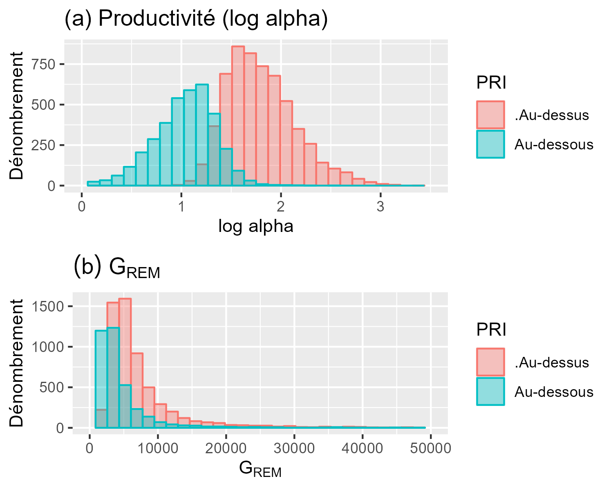
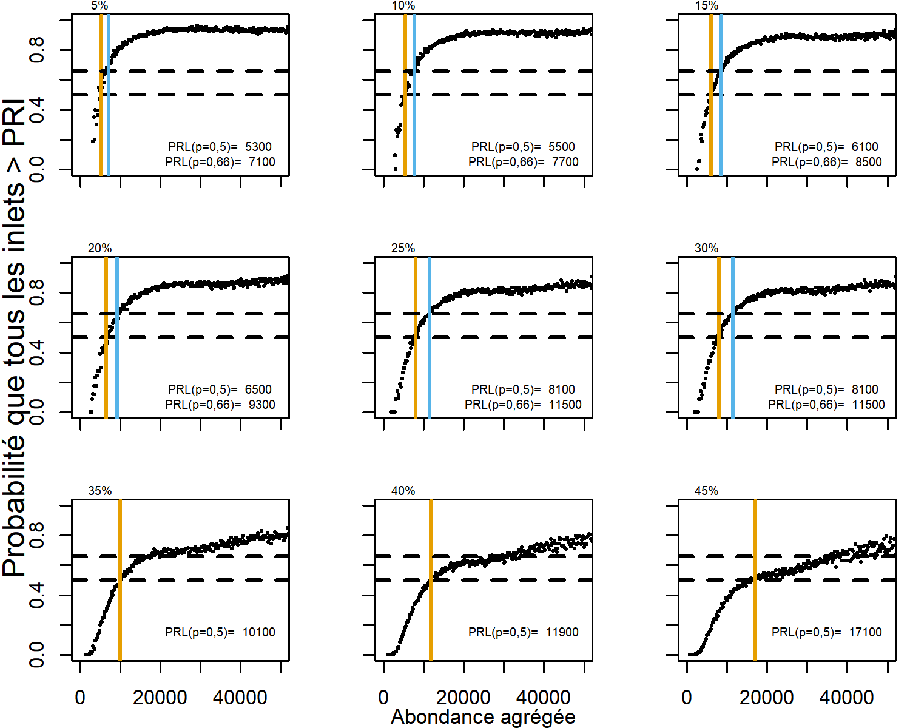
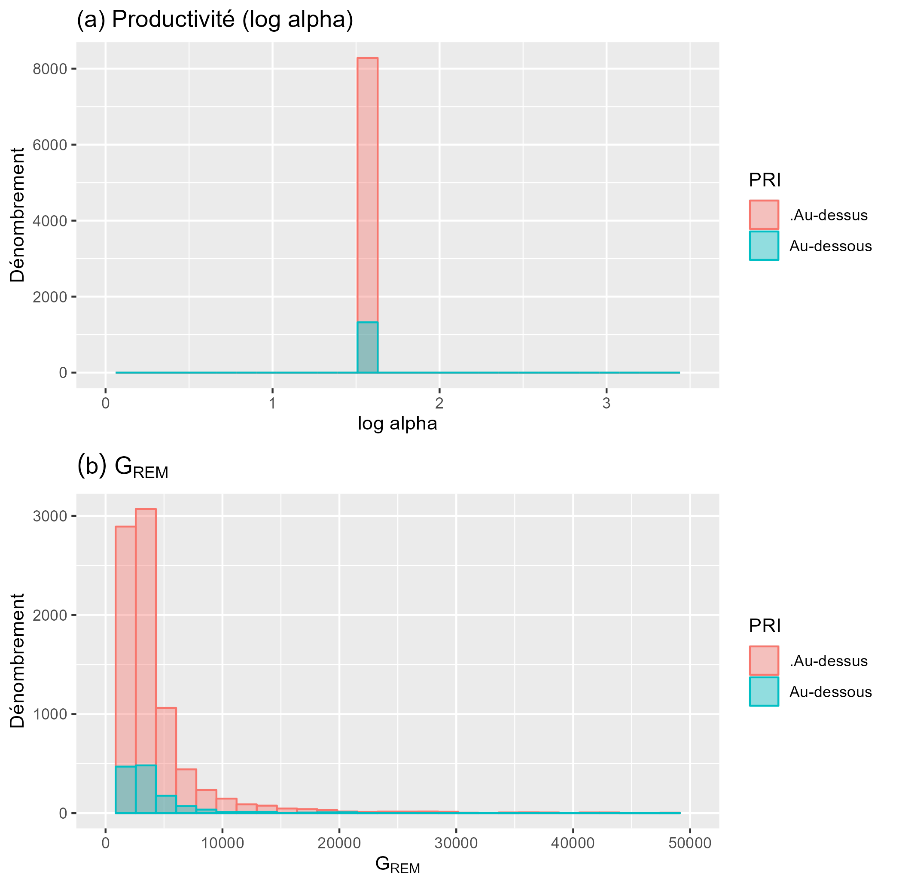
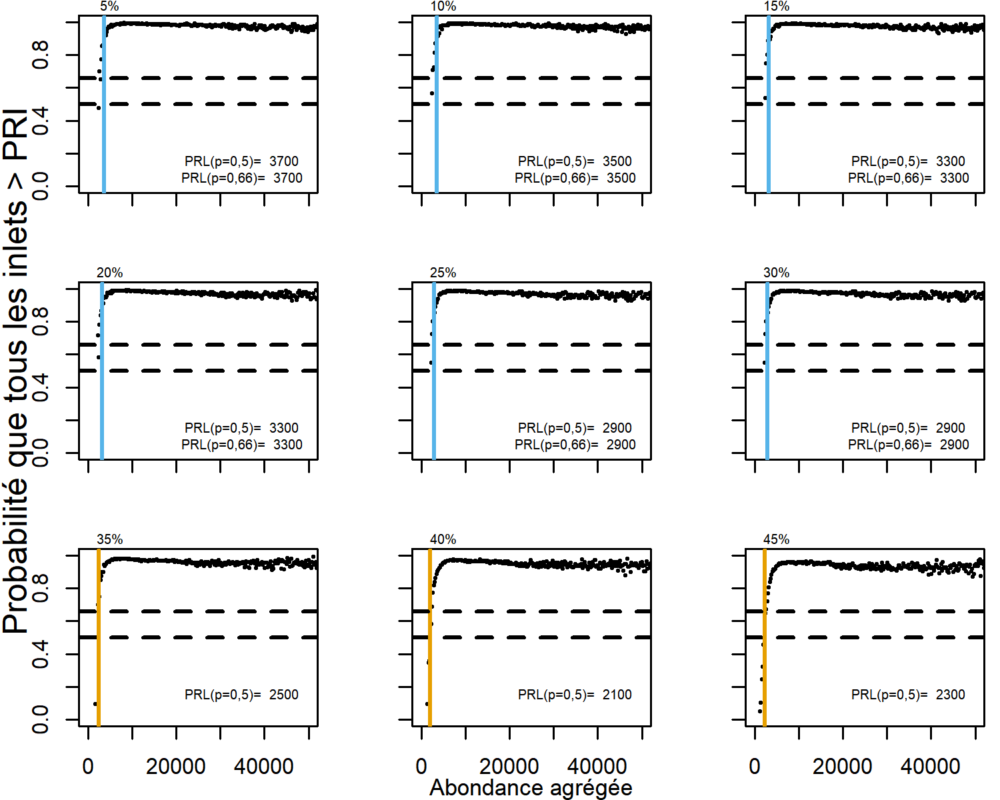
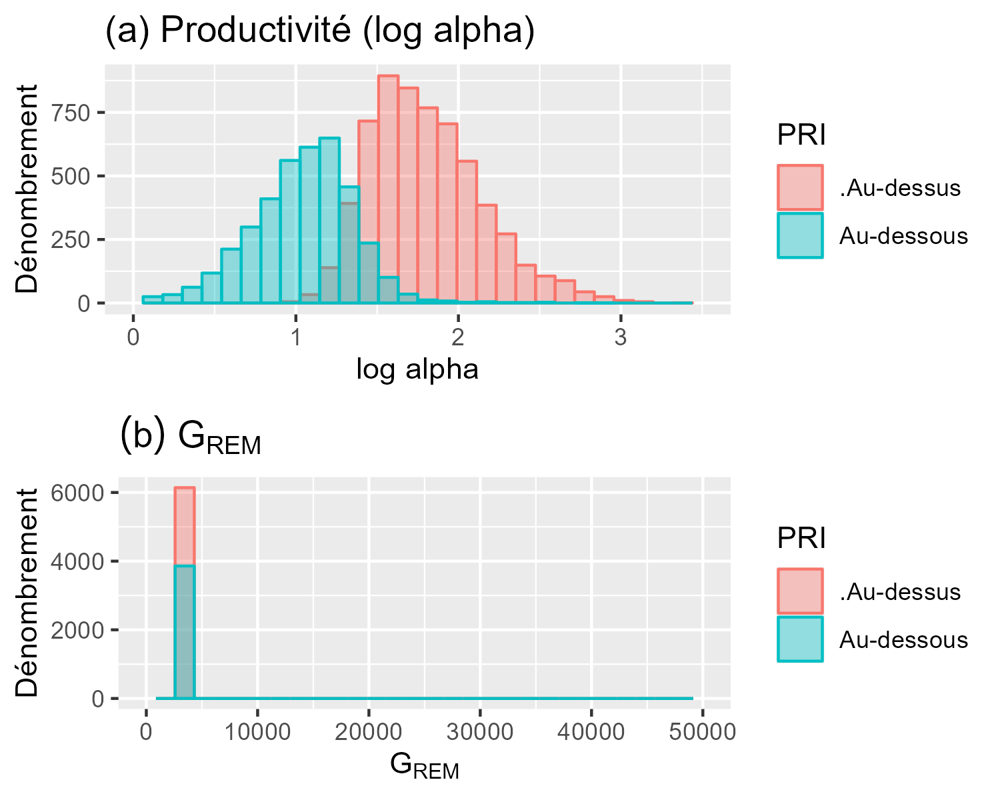
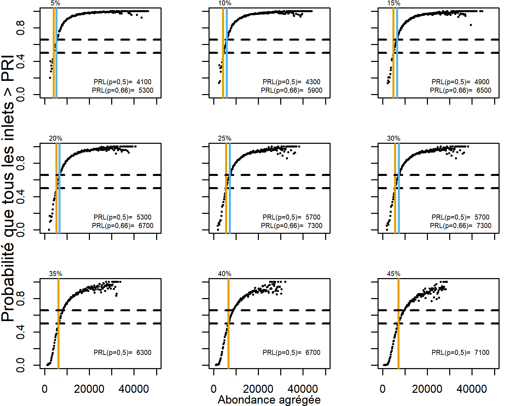

<!--
---
output:
  word_document: default
  html_document: default
---
-->

# SENSIBILITÉ DES PRL DE PROJECTION AUX TAUX D’EXPLOITATION{#app:ERsensitivity-appendix}

Pour expliquer le résultat initialement contre-intuitif de la sensibilité des PRL de projection aux taux d’exploitation, nous avons effectué une analyse supplémentaire où les paramètres de stock-recrutement, la productivité (log($alpha$)) et l’abondance des géniteurs au remplacement, G~REM~ (log($alpha$)/$beta$)  étaient soit variés, soit maintenus constants dans les inlets et les essais de simulation MCCM. 

Plus précisément, nous avons évalué la sensibilité des PRL de projection agrégés aux taux d’exploitation selon trois scénarios de rechange, comme appliqués à l’étude de cas sur le saumon chinook de la COIV.

1. On a supposé que toutes les populations d’inlet constituantes comportaient des paramètres de stock-recrutement tirés des mêmes distributions (la moyenne et l’écart-type pour la productivité et G~REM~ comme estimé pour Quatsino, COIV), mais un ensemble unique de paramètres de stock-recrutement a été établi pour chaque inlet et chaque essai (c’est-à-dire que chaque inlet était une répétition des autres avec une variabilité aléatoire). Nous avons choisi de tirer G~REM~ d’une distribution aléatoire au lieu $beta$ ou G~MAX~ de Ricker (1/$beta$) parce que la relation stock-recrutement a été paramétrée avec G~REM~ pour cette étude de cas. Dans les analyses préliminaires de sensibilité, nous avons effectué un échantillonnage à partir d’une distribution aléatoire de valeurs $beta$ et avons obtenu des résultats semblables. Nous avons supposé une forte covariation positive des résidus du recrutement entre les inlets avec des corrélations par paires égales à 0,7. 

2. Le paramètre de productivité a été fixé à la moyenne de la distribution présumée pour tous les essais et inlets. G~REM~ a été tiré de sa distribution et a permis une variation entre les inlets et les essais. La même distribution de G~REM~ a été utilisée dans les inlets et les essais, comme dans le scénario 1. 


3. G~REM~ a été fixé à la moyenne de la distribution entre les inlets et entre les essais. Le paramètre de productivité a été tiré de la distribution et a pu varier entre les inlets et les essais. La même distribution de la productivité a été utilisée pour les inlets et les essais, comme dans le scénario 1.


Nous avons constaté que la sensibilité des PRL de projection aux taux d’exploitation était due à la variabilité de la productivité et, dans une moindre mesure, à G~REM~ entre les inlets. Dans le scénario 1, lorsque nous avons appliqué un taux d’exploitation relativement élevé (45 %), la productivité et G~REM~ avaient tendance à être plus faibles pour les essais aléatoires et les populations d’inlet qui sont tombés sous le PRI pour au moins un an (figure \@ref(fig:chinook-SRHistEven)). Les essais aléatoires et les populations d’inlet dont l’abondance est demeurée au-dessus du PRI au cours de la série chronologique avaient tendance à être plus productifs et légèrement plus grands. 


```{r chinook-SRHistEven, fig.cap="Distribution (a) de la productivité (log alpha) et (b) de l’abondance des géniteurs au remplacement, G~REM~, entre les essais de MCCM, ombrée selon que l’abondance dans cet essai est demeurée au-dessus du PRI (rouge) ou non (bleu), selon un taux d’exploitation de 45\\%. La productivité et G~REM~ ont varié entre les inlets et les essais et ont été tirés de distributions communes. ", fig.align="center"}

download.file('https://github.com/Pacific-salmon-assess/SalmonLRP_RetroEval/raw/master/WCVIChinookStudy/Figures/evenhCor-SRHist.png', './figure/evenhCor-SRHist.png',  mode="wb")


# knitr::include_graphics("C:/github/SalmonLRP_RetroEval/WCVIChinookStudy/Figures/evenhCor-SRHist.png")

```

\linebreak

Les populations d’inlet et les essais de MCCM à faible productivité ont tendance à avoir des valeurs G~gén~ (PRI) relativement élevées (comme décrit à la section @holtCautionsUsingPercentilebased2015), et donc une fréquence plus élevée de chute sous le PRI. Cette variabilité de la productivité entre les inlets a été associée à des PRL de projection qui étaient sensibles aux taux d’exploitation (figure \@ref(fig:chinook-ProjLRPs-Even)).


```{r chinook-ProjLRPs-Even, fig.cap="Probabilité que toutes les populations d’inlet se trouvent au-dessus de leur PRI le long d’un gradient de l’abondance agrégée dans les tranches de 200 poissons, obtenue des projections sur 30 ans et de 10 000 essais de MCCM en fonction d’une gamme de taux d’exploitation moyens de 5 à 45\\%, en supposant que la productivité et G~REM~ variaient entre les inlets et les essais, et qu’ils sont tirés de distributions communes. Les lignes horizontales pointillées sont à 50\\% et 66\\% Les lignes verticales orange et vert pâle représentent les PRL associées à une probabilité de 50\\% et 66\\% que toutes les populations d’inlet soient au-dessus de leur PRI, respectivement. Les PRL à 66\\% de probabilité ne sont pas indiqués pour les taux d’exploitation supérieurs à 30\\% en raison de la grande incertitude dans les projections à forte abondance agrégée.", fig.align="center"}

download.file('https://github.com/Pacific-salmon-assess/SalmonLRP_RetroEval/raw/master/WCVIChinookStudy/Figures/ProjectedLRPs/ERsEven-hCor-ProjLRPCurve-ALLp.png', './figure/ERsEven-hCor-ProjLRPCurve-ALLp.png',  mode="wb")



# knitr::include_graphics("C:/github/SalmonLRP_RetroEval/WCVIChinookStudy/Figures/ProjectedLRPs/ERsEven_hCor-ProjLRPCurve-ALLp.png")

```

\linebreak

Lorsque la productivité a été fixée à la valeur moyenne parmi les essais aléatoires et les inlets dans le scénario 2, la distribution des paramètres de stock-recrutement pour les essais où les abondances ont chuté sous le PRI était la même ou semblable pour les essais qui restaient au-dessus (figure \@ref(fig:chinook-SRHistSameProd)), et le PRL était insensible au taux d’exploitation (figure \@ref(fig:chinook-ProjLRPs-SameProd)).


```{r chinook-SRHistSameProd, fig.cap="Distribution (a) de la productivité (log alpha) et (b) de l’abondance des géniteurs au remplacement, G~REM~, entre les essais de MCCM, colorées selon que l’abondance dans cet essai est demeurée au-dessus du PRI (rouge) ou non (bleu), selon une exploitation de 45\\% et une productivité constante entre les inlets et les essais. G~REM~ a été tiré d’une distribution commune entre les inlets et les essais. ", fig.align="center"}

download.file('https://github.com/Pacific-salmon-assess/SalmonLRP_RetroEval/raw/master/WCVIChinookStudy/Figures/sameProdhCor-SRHist.png', './figure/sameProdhCor-SRHist.png', mode="wb")


# knitr::include_graphics("C:/github/SalmonLRP_RetroEval/WCVIChinookStudy/Figures/sameProdhCor_SRHist.png")

```

```{r chinook-ProjLRPs-SameProd, fig.cap="Probabilité que toutes les populations d’inlet se trouvent au-dessus de leur PRI le long d’un gradient de l’abondance agrégée dans les tranches de 200 poissons, obtenue des projections sur 30 ans et de 10 000 essais de MCCM en fonction d’une gamme de taux d’exploitation moyens de 5 à 45\\% (dans les neuf panneaux), en supposant la même productivité pour chaque inlet et essai et un G~REM~ qui varie entre les inlets et les essais, tiré d’une distribution commune. Les lignes horizontales pointillées sont à 50\\% et 66\\%. Les lignes verticales orange et vert pâle représentent les PRL associées à une probabilité de 50\\% et 66\\% que toutes les populations d’inlet soient au-dessus de leur PRI, mais ils sont indifférenciables ici. ", fig.align="center"}

download.file('https://github.com/Pacific-salmon-assess/SalmonLRP_RetroEval/raw/master/WCVIChinookStudy/Figures/ProjectedLRPs/ERsSameProd-hCor-ProjLRPCurve-ALLp.png', './figure/ERsSameProd-hCor-ProjLRPCurve-ALLp.png', mode="wb")


# knitr::include_graphics("C:/github/SalmonLRP_RetroEval/WCVIChinookStudy/Figures/ProjectedLRPs/ERsSameProd_hCor-ProjLRPCurve-ALLp.png")

```


\linebreak

Lorsque G~REM~ était fixé à la valeur moyenne entre les inlets et les essais aléatoires dans le scénario 3, la productivité était plus élevée pour les inlets et les essais qui demeuraient au-dessus des PRI que pour ceux qui chutaient au-dessous, comme dans le scénario où G~REM~ et la productivité variaient (scénario 1) (figure \@ref(fig:chinook-SRHistSameSREP)). Les PRL variaient en fonction des taux d’exploitation, mais dans une moindre mesure que lorsque la productivité et G~REM~ variaient (figure \@ref(fig:chinook-ProjLRPs-SameSREP)).


```{r chinook-SRHistSameSREP, fig.cap="Distribution (a) de la productivité (log alpha) et (b) de l’abondance des géniteurs au remplacement, G~REM~, entre les essais de MCCM, colorées selon que l’abondance dans cet essai est demeurée au-dessus du PRI (rouge) ou non (bleu), selon une exploitation de 45\\% et G~REM~ constant entre les inlets et les essais. La productivité a été tirée d’une distribution commune entre les inlets et les essais. ", fig.align="center"}

download.file('https://github.com/Pacific-salmon-assess/SalmonLRP_RetroEval/raw/master/WCVIChinookStudy/Figures/sameSREPhCor-SRHist.png', './figure/sameSREPhCor-SRHist.png', mode="wb")


# knitr::include_graphics("C:/github/SalmonLRP_RetroEval/WCVIChinookStudy/Figures/sameSREPhCor_SRHist.png")

```


```{r chinook-ProjLRPs-SameSREP, fig.cap="Probabilité que toutes les populations d’inlets se trouvent au-dessus de leur PRI le long d’un gradient de l’abondance agrégée dans les tranches de 200 poissons, obtenue des projections sur 30 ans et de 10 000 essais de MCCM en fonction d’une gamme de taux d’exploitation moyens de 5 à 45\\% (dans les neuf panneaux), en supposant le même G~REM~ pour chaque inlet et essai et une productivité qui varie entre les inlets et les essais, tirée d’une distribution commune. Les lignes horizontales pointillées sont à 50\\% et 66\\%. Les lignes verticales orange et vert pâle représentent les PRL associées à une probabilité de 50\\% et 66\\% que toutes les populations d’inlet soient au-dessus de leur PRI, respectivement. ", fig.align="center"}

download.file('https://github.com/Pacific-salmon-assess/SalmonLRP_RetroEval/raw/master/WCVIChinookStudy/Figures/ProjectedLRPs/ERsSameSREP-hCor-ProjLRPCurve-ALLp.png', './figure/ERsSameSREP-hCor-ProjLRPCurve-ALLp.png', mode="wb")


# knitr::include_graphics("C:/github/SalmonLRP_RetroEval/WCVIChinookStudy/Figures/ProjectedLRPs/ERsSameSREP_hCor-ProjLRPCurve-ALLp.png")
```

\linebreak

En nous basant sur ces analyses de sensibilité, nous avons conclu que la variabilité de la productivité entre les populations d’inlet constituantes entraîne une variabilité propre aux populations d’inlet de la sensibilité aux taux d’exploitation. Les populations d’inlet dont la productivité est relativement faible tombent plus fréquemment sous leur PRI. Cet effet est accentué lorsque les taux d’exploitation sont élevés, ce qui entraîne des divergences d’état entre les populations d’inlet et une augmentation de l’abondance agrégée est requise pour que toutes les populations d’inlet dépassent leur PRI, ce qui se traduit par un PRL plus élevé. Ces résultats peuvent être généralisés à d’autres UGS dans la mesure où les productivités diffèrent d’une UC constituante à l’autre.

