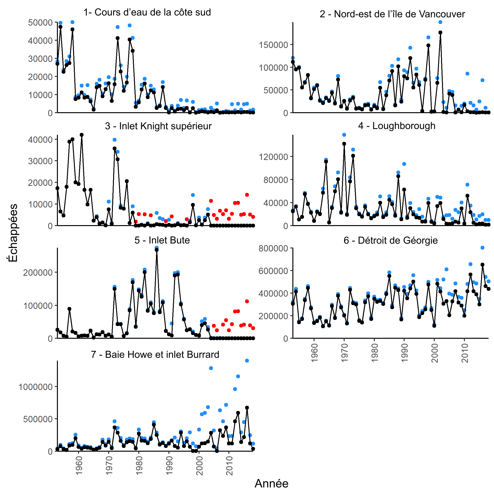
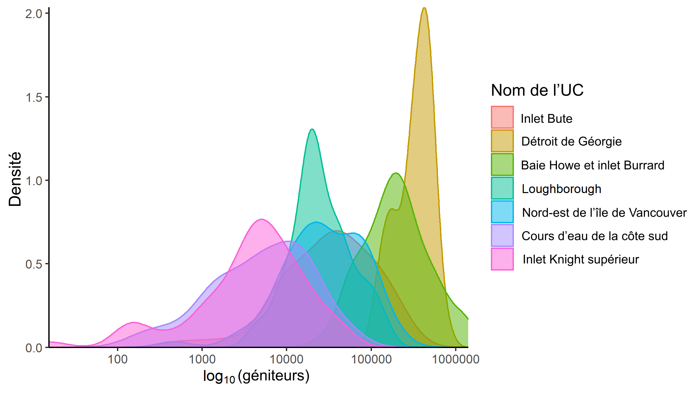
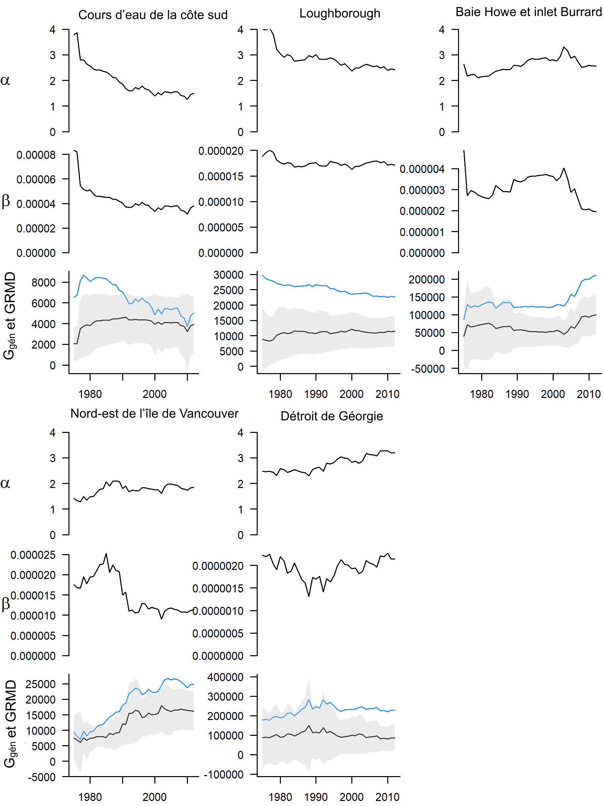
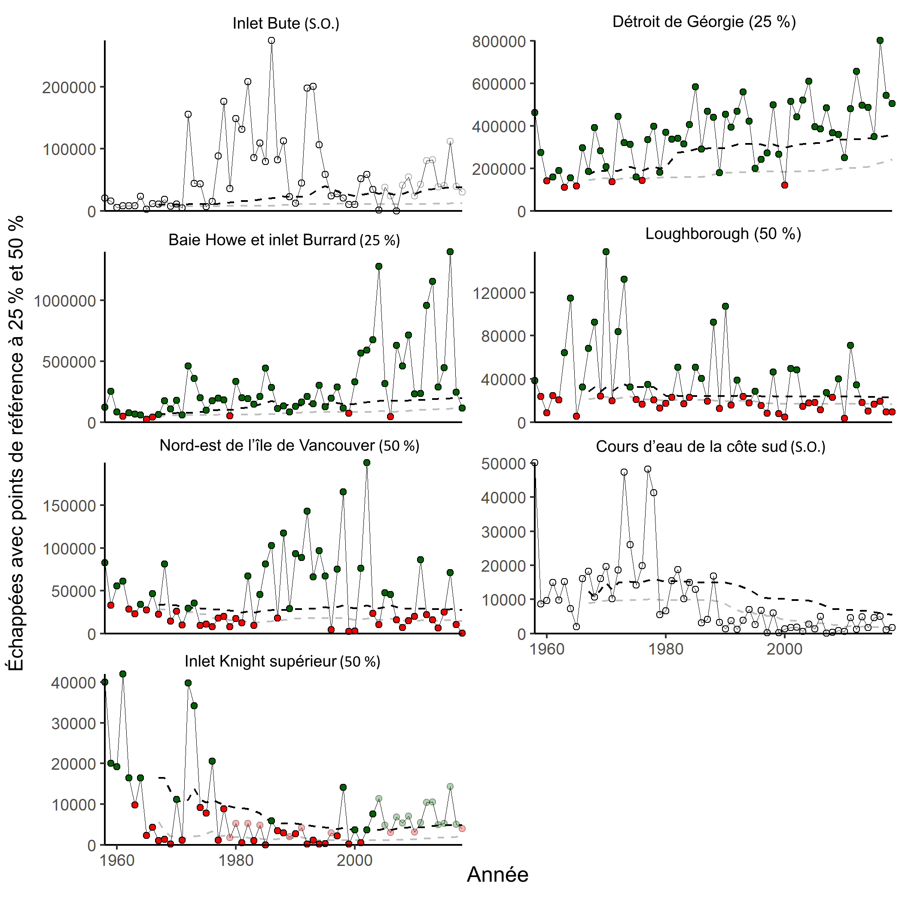

<!-- The following code should appear at the beginning of the first appendix.
After that, all subsequent sections will be turned into appendices. -->

# RENSEIGNEMENTS À L’APPUI DE L’ÉTUDE DE CAS SUR LE SAUMON KÉTA DE LA CÔTE SUD INTÉRIEURE{#app:appendix-chum}

## Sources et traitement des données
 
### Échappées de géniteurs


Nous avons utilisé les données sur les échappées de géniteurs de 1953 à 2018. La plupart des données sur les échappées proviennent de la base de données NUSEDS (une petite quantité provient de l’évaluation des stocks du bas Fraser pour les zones 28 et 29, des prises à des fins alimentaires, sociales et rituelles en cours d’eau de certaines Premières Nations et des individus provenant du Programme de mise en valeur des salmonidés du MPO). Le nombre de saumons kétas qui retourner dans leur cours d’eau natal pour frayer est habituellement calculé au moyen de relevés visuels et de barrières ou de fascines sur certains cours d’eau. Le nombre total d’échappées pour chaque cours d’eau correspond habituellement au dénombrement lors de la période de pointe ou à l’estimation de la superficie selon la méthode de calcul de l’aire sous la courbe.


### Prises des pêches, génétique et âge


Le nombre de saumons kétas capturés dans la région de la côte sud intérieure a été tiré de la base de données Clockwork du MPO, qui comprend le système d’exploitation des pêches du MPO, les bases de données des bordereaux de vente et les données d’identification génétique des stocks. Les distributions par âge pour chaque année ont été tirées de l’agrégat des pêches du détroit de Johnstone, car les données sur l’âge pour des UC ou des cours d’eau précis n’étaient pas disponibles. Les données sur les prises étaient disponibles pour la période allant de 1954 à 2019. Les données sur la composition par âge étaient disponibles pour la période allant de 1958 à 2018.

### Sélection et remplissage des données 

Nous avons retiré les poissons de la montaison estivale parce que toutes les données qui entrent dans les travaux de reconstitution des remontes sont associées aux populations qui reviennent à la frayère à l’automne. Les poissons de la montaison estivale représentent une portion relativement mineure de l’abondance totale de ces UC (tableau \@ref(tab:CU-summary)). Comme les poissons d’écloserie ne sont pas marqués de façon visible, aucune série chronologique de la proportion de poissons d’écloserie et d’origine naturelle n’était disponible. Cependant, nous avons supprimé trois cours d’eau en raison d’une mise en valeur élevée : la rivière Qualicum et la rivière Little Qualicum (chenaux de ponte) et la rivière Puntledge (écloserie). Les populations de ces cours d’eau ont été mises en valeur à presque 100 %, au moins depuis le début de la mise en valeur à ces endroits. On suppose que les poissons d’écloserie sont une composante relativement petite de la production totale dans les autres réseaux [@lynchAssessmentEnhancedChum2020]. Les géniteurs capturés pour la production en écloserie et aux plateaux a également été retirés de l’abondance des géniteurs pour obtenir des séries chronologiques d’échappées « naturelles ».


Après ces retraits, les étapes de préparation des données à analyser étaient les suivantes.

– Compléter les données sur les échappées totales et sauvages par UC et zone (par cours d’eau pour les UC avec observations, par UC pour les années sans observation dans une UC).
– Reconstituer les remontes, ce qui est nécessaire pour estimer la productivité propre à l’UC à partir des modèles de stock-recrutement :
  – ajouter les prises des pêches par UC et par zone à l’échappée totale pour estimer le nombre total d’individus en montaison;
  – utiliser la proportion échappée naturelle : échappée totale (qui comprend les géniteurs capturés pour la production en écloserie et aux plateaux, et des trois grands cours d’eau avec écloseries), par UC et par zone pour estimer le nombre de poissons sauvages en montaison; 
  – utiliser les proportions selon l’âge des prises pour estimer l’âge des poissons en montaison et inclure les recrues par année d’éclosion pour chaque UC. Résultat : géniteurs sauvages et recrues correspondantes par année d’éclosion pour chaque UC.


### Remplissage des données sur les échappées de géniteurs

Les données que nous avons utilisées comptaient des années où tous les cours d’eau n’avaient pas été l’objet d’un dénombrement. Les valeurs manquantes sur les échappées nécessitent un remplissage à deux fins. 


1. Veiller à ce que toutes les UC comportent des estimations annuelles des poissons sauvages en montaison pour alimenter le modèle de reconstitution des remontes, ce qui permet d’estimer les recrues pour chaque année d’éclosion.
2. Créer une série chronologique des échappées de poissons sauvages à l’échelle de l’UC qui peut être utilisée pour calculer l’état par rapport aux points de référence à l’échelle de l’UC, ainsi que les PRL en fonction de l’état des UC.


Deux niveaux de remplissage ont déjà été utilisés pour les UC du saumon kéta de la CSI [@holtEvaluatingBenchmarksBiological2018, figure  \@ref(fig:chum-escapement-infill)]. Le premier niveau, le remplissage par cours d’eau, est utilisé lorsqu’il y a eu un dénombrement dans certains cours d’eau d’une UC au cours d’une année. Dans ce cas, le remplissage au niveau du cours d’eau se fait en empruntant de l’information provenant d’autres cours d’eau utilisés par la même UC. Le deuxième niveau, le remplissage par UC, est utilisé lorsqu’il n’y a pas de dénombrement de géniteurs pour une UC au cours d’une année donnée. Nous avons dû procéder au remplissage par UC pour obtenir le nombre total de géniteurs à utiliser pour la reconstitution des remontes, mais nous n’avons pas utilisé les UC avec remplissage à l’échelle de l’UC pour calculer les PRL parce que la procédure de remplissage suppose que l’échappée est corrélée entre les UC au cours d’une année donnée. 

#### Remplissage par cours d’eau

Cela s’applique aux UC et aux années où il y a eu des dénombrements dans certains cours d’eau de l’UC au cours d’une année donnée. Pour chaque cours d’eau, la moyenne géométrique de l’échappée pour toutes les années a été calculée comme l’échappée moyenne du cours d’eau. Ensuite, l’échappée moyenne totale pour chaque UC de chaque année était la somme des échappées moyennes de tous les cours d’eau. Ensuite, une proportion des échappées suivies chaque année était la somme des échappées moyennes de tous les cours d’eau avec les dénombrements d’une année divisés par la somme des échappées moyennes de tous les cours d’eau (dénombrés et non dénombrés) dans cette UC. L’échappée ayant fait l’objet d’un remplissage pour une UC dans une année donnée était la somme des échappées observées pour cette UC et de l’année divisée par la proportion de l’échappée suivie pour cette UC et de l’année en question. 


Le remplissage par cours d’eau représente généralement une faible proportion de l’échappée totale pour chaque UC, à l’exception de l’UC de la baie Howe et de l’inlet Burrard. Cela s’explique en partie par l’augmentation des échappées dans la rivière Cheakamus et la rivière Indian depuis 2000. Cette méthode suppose que l’échappée entre les cours d’eau est corrélée, ce qui n’est pas toujours le cas (voir la figure  \@ref(fig:chum-spawner-corr)  pour les corrélations entre les UC).

#### Remplissage par UC

S’il n’y avait eu aucun dénombrement dans les cours d’eau utilisés par une UC au cours d’une année donnée, une deuxième ronde de remplissage a été effectuée avec un ensemble de données qui avait déjà fait l’objet d’un remplissage par cours d’eau. C’était le cas pour deux UC : inlet Knight supérieur (22 ans : 1979, 1980, 1982, 1984, 1989, 1991, 1996 et 2004 à 2018) et inlet Bute (13 ans : 2005, 2006 et 2008 à 2018). Nous décrivons ce niveau de remplissage ci-dessous, bien qu’il n’ait pas été appliqué à l’établissement des PRL, car il viole les hypothèses d’indépendance entre les UC.


À l’aide de la somme des échappées ayant fait l’objet d’un remplissage par UC pour chaque UC, les UC et les années pour lesquelles il manquait de données ont fait l’objet d’un remplissage en supposant que le nombre total d’échappées par UC était corrélé entre les UC. La procédure était semblable à celle utilisée pour le remplissage par cours d’eau, mais une moyenne géométrique pour chaque UC pour toutes les années a servi pour calculer la proportion de la moyenne pour chaque année, puis pour estimer les échappées pour les deux UC sans observation.


```{r chum-escapement-infill, fig.cap="Échappées des sept unités de conservation de saumon kéta. Les points noirs indiquent les dénombrements réels, les points bleus ont fait l’objet d’un remplissage par cours d’eau et les points rouges ont fait l’objet d’un remplissage par unité de conservation.", warning=FALSE, echo=FALSE, fig.align="center"}
download.file('https://github.com/Pacific-salmon-assess/SalmonLRP_RetroEval/raw/master/SCChumStudy/Figures/fig_compare_actual_infill_by_stream_and_CU.png', './figure/chum-escapement-infill.png', mode="wb")

```

### Reconstitution des remontes pour estimer le recrutement


Nous avons reconstitué les remontes pour chaque année d’éclosion afin d’obtenir les recrues des années d’éclosion de 1955 à 2012 (données sur la composition par âge de 1958 à 2018, l’âge minimal des poissons était 3 et l’âge maximal, 6). Dans les analyses préliminaires, nous avons estimé des points de référence fondés sur le stock-recrutement pour ces UC. L’utilisation de points de référence de l’UC fondés sur les paramètres de stock-recrutement – dans ce cas, G~gén~ – exige de connaître l’abondance des géniteurs et des recrues (progénitures adultes produites par chaque année d’éclosion des géniteurs) pour chaque année d’éclosion (année de fraie). Pour estimer les recrues, il faut connaître l’échappée des géniteurs sauvages, le nombre de poissons sauvages capturés dans les pêches et l’âge de ces poissons. 


Pour obtenir ces estimations, on a calculé le nombre total de géniteurs (d’origine sauvage et d’écloserie) selon les méthodes de remplissage décrites ci-dessus (remplissage par cours d’eau et par UC) pour chaque UC et secteur d’exploitation des pêches (figure \@ref(fig:chum-map)). Le nombre de poissons récoltés dans les pêches (d’origine sauvage et d’écloserie, par UC et secteur d’exploitation des pêches) a été ajouté aux échappées totales afin d’obtenir une estimation du nombre total d’adultes en montaison par UC et secteur d’exploitation des pêches pour chaque année de fraie. Ce nombre total d’individus en montaison a été multiplié par la proportion de géniteurs sauvages dans chaque UC et secteur d’exploitation des pêches en fonction des échappées de géniteurs sauvages et de géniteurs totaux ayant fait l’objet d’un remplissage. Le produit était une estimation des poissons sauvages en montaison (échappée de géniteurs plus prises des pêches) par UC et secteur d’exploitation des pêches pour chaque année d’éclosion. Enfin, la composition par âge du saumon kéta récolté dans la pêche agrégée du détroit de Johnstone (âges 3, 4, 5 et 6) a été utilisée pour attribuer les poissons sauvages en montaison aux années d’éclosion. Par conséquent, cette analyse ne tient pas compte de la diversité des âges entre les UC ou les cours d’eau.


À noter que les deux UC nécessitant un remplissage à l’échelle de l’UC ne correspondent qu’à un seul secteur d’exploitation des pêches chacune, ce qui permet la reconstitution des remontes à l’aide des données sur les prises à cette échelle.

```{r chum-spawner-distribution, fig.cap="Densité (histogramme lissé) des échappées pour les sept unités de conservation de saumon kéta. À noter que l’axe des x est à l’échelle logarithmique.", warning=FALSE, echo=FALSE, fig.align="center"}
download.file('https://github.com/Pacific-salmon-assess/SalmonLRP_RetroEval/raw/master/SCChumStudy/Figures/fig_spawner_dist.png', './figure/fig-spawner-dist.png', mode="wb")

```

## Analyse rétrospective des points de référence à l’échelle de l’UC

Nous avons effectué une analyse rétrospective à l’aide des données sur le saumon kéta de la CSI afin d’évaluer la façon dont les paramètres et les points de référence de stock-recrutement, G\textsubscript{gén} et les points de référence fondés sur le centile, ont changé au fil du temps. Lorsque $\alpha$, $\beta$, et G\textsubscript{gén} ont été estimés annuellement en n’utilisant que des données antérieures à cette année-là, les valeurs ont changé au fil du temps, car de plus en plus de données ont été incluses (figures \@ref(fig:chum-a-b-SMSY-Sgen-retro)). À noter qu’il ne s’agit pas d’estimations fondées sur un modèle qui tient compte de paramètres variables dans le temps. Les estimations de $\alpha$, $\beta$, et G\textsubscript{gén} au cours d’une année donnée proviennent plutôt de l’ajustement d’un modèle de Ricker aux géniteurs et aux recrues pour toutes les années jusqu’à cette année-là inclusivement, pour chaque UC. Chaque année subséquente comprend une autre année de données. Par conséquent, à mesure que d’autres données sont incluses, les estimations de $\alpha$, $\beta$, et G\textsubscript{gén} peuvent changer. Ces résultats doivent être interprétés avec prudence en raison des importants résidus dans les recrues observées par rapport aux recrues prévues. Étant donné que $\alpha$  et $\beta$  sont corrélés, la signification de toute tendance d’un paramètre doit être interprétée en tenant compte de l’autre paramètre, surtout lorsque les ajustements de modèle comportent des résidus importants. De même, comme $\alpha$ et $\beta$  déterminent G\textsubscript{RMD} et G\textsubscript{gén}, les changements de ces paramètres obtenus peuvent être difficiles à interpréter et peuvent être dus à des changements dans $\alpha$,  $\beta$, et leurs valeurs relatives.


```{r chum-a-b-SMSY-Sgen-retro, fig.cap="Estimations rétrospectives de $\\alpha$, $\\beta$, $G_{gén}$ (ligne noire avec intervalles de confiance en gris) et $G_{RMD}$ (ligne bleue) pour cinq UC dans l’UGS de saumon kéta de la CSI. À noter que l’axe des y est identique d’une UC à l’autre pour $\\alpha$, mais qu’il varie pour d’autres paramètres.", warning=FALSE, echo=FALSE, fig.align="center"}
download.file('https://github.com/Pacific-salmon-assess/SalmonLRP_RetroEval/raw/master/SCChumStudy/Figures/fig_a_b_SMSY_Sgen_retro.png', './figure/chum-a-b-SMSY-Sgen-retro.png',  mode="wb")

```


Les estimations rétrospectives de $\alpha$ et $\beta$ pour les cours d’eau de la côte sud montrent des baisses au fil du temps. G\textsubscript{RMD} et G\textsubscript{gén} augmentent fortement au cours des premières années en raison de fortes diminutions dans $\alpha$ et $\beta$. G\textsubscript{RMD} diminue ensuite au fil du temps, tandis que G\textsubscript{gén} reste relativement stable. Cela s’explique parce que lorsque as $\alpha$ diminue au-dessous d’environ 2,5, G\textsubscript{gén} diminue, mais lorsque que $\beta$$ diminue, G\textsubscript{gén} diminue, de sorte qu’une diminution simultanée de  $\alpha$ et $\beta$ peut s’annuler. Cependant, plus $\alpha$ est inférieur à 2,5, moins l’influence de $\beta$ sur G\textsubscript{gén} est importante. 

L’augmentation de G\textsubscript{gén}  pour le nord-est de l’île de Vancouver est principalement attribuable à une augmentation de $\alpha$ de < 1,5 à > 2, puis à une diminution dans $\beta$. $\alpha$ pour l’UC de Loughborough affichait des diminutions modestes au fil du temps, et G\textsubscript{gén} était relativement stable. L’UC du détroit de Géorgie montre des signes d’augmentation de $\alpha$, et son estimation de G\textsubscript{gén} était assez stable. La valeur de G\textsubscript{gén} de l’UC de la baie Howe et de l’inlet Burrard était relativement stable, puis elle a augmenté en raison de la diminution dans $\alpha$ et $\beta$. 

Malgré les grandes incertitudes entourant les données sous-jacentes sur le recrutement et les points de référence sur le stock-recrutement, nous avons estimé un modèle de régression logistique fondé sur l’abondance agrégée par rapport à l’état des UC à partir de l’abondance relative des points de référence sur le stock-recrutement. À l’instar de nos résultats pour le modèle de régression logistique basé sur les points de référence fondés sur le centile, l’ajustement du modèle était mauvais, et il ne peut pas être utilisé comme base pour estimer les PRL (figure \@ref(fig:chum-logistic-sgen)).


```{r chum-logistic-sgen, fig.cap="Régression logistique de la question de savoir si les échappées de toutes les UC constituantes se situaient au-dessus des points de référence fondés sur $G_{gén}$ d’après l’abondance agrégée, pour l’UGS de saumon kéta de la CSI. Comprend les cinq UC sans remplissage à l’échelle de l’UC (sans l’inlet Bute ni l’inlet Knight supérieur)", warning=FALSE, echo=FALSE, fig.align="center"}
download.file('https://github.com/Pacific-salmon-assess/SalmonLRP_RetroEval/raw/master/SCChumStudy/Figures/AnnualRetrospective/Bern.IndivRicker_NoSurv_noCUinfill_90/LogisticMod_2012.pdf', './figure/chum-logistic-sgen.pdf', mode="wb")
knitr::include_graphics('figure/chum-logistic-sgen.pdf')
```


Nous avons évalué l’état de façon rétrospective en fonction de points de référence fondés sur le centile, où l’état a été évalué annuellement en fonction de points de référence estimés à partir de données antérieures à cette année (figure \@ref(fig:chum-perc-retro)).


```{r chum-perc-retro, fig.cap="Les échappées avec des points de référence fondés sur les 25e et 50e centiles sont indiquées par des lignes en pointillé grises et noires, respectivement. Les points de référence sont calculés à partir des échappées jusqu’à l’année donnée. Les valeurs qui suivent les noms des UC indiquent le point de référence fondé sur le centile approprié. Les points verts et rouges indiquent l’état au-dessus ou au-dessous du point de référence, respectivement. Les points transparents sont des années avec remplissage à l’échelle de l’UC.", warning=FALSE, echo=FALSE, fig.align="center"}
download.file('https://github.com/Pacific-salmon-assess/SalmonLRP_RetroEval/raw/master/SCChumStudy/Figures/fig_perc_benchmarks_annual_retro.png', './figure/chum-perc-retro.png', mode="wb")

```

