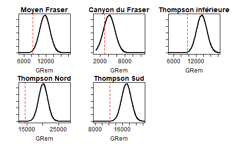

---
output:
  pdf_document: default
  html_document: default
---
<!-- The following code should appear at the beginning of the first appendix.
After that, all subsequent sections will be turned into appendices. -->


# RENSEIGNEMENTS À L’APPUI DE L’ÉTUDE DE CAS SUR LE SAUMON COHO DU FRASER INTÉRIEUR {#app:coho-appendix}


## Évaluation de la représentativité des UC selon les critères des lignes directrices

Nous avons tenu compte des quatre critères définis dans @holtGuidelinesDefiningLimitInpress pour évaluer si l’état de n’importe quelle UC dans cette UGS pouvait être déduit des autres UC; ces critères comprenaient la similarité dans (i) les menaces, (ii) les conditions et les facteurs environnementaux, (iii) le cycle biologique; (iv) la capacité de la population. Bien que des états soient disponibles pour toutes les UC de cette UGS, nous examinons l’application de ces critères pour évaluer comment les décisions sur la question de savoir si l’état d’une UC peut être déduit de celui d’autres UC en fonction de ces critères diffèrent des résultats des analyses de sensibilité présentées dans le document principal. Dans le cadre de ces analyses de sensibilité, nous avons examiné comment le retrait d’une ou de deux UC a eu une incidence sur l’estimation du PRL et les évaluations de l’état par rapport au PRL.

Dans une évaluation des menaces pour le saumon coho du Fraser intérieur réalisée dans le cadre de l’évaluation du potentiel de rétablissement de 2018, @arbeiderInteriorFraserCoho2020 ont classé un ensemble complet de menaces sur une échelle allant d’élevée à moyenne, faible et inconnue. Les principales menaces qui pèsent sur cette UGS sont les activités liées à la foresterie, aux feux de forêt, à l’agriculture et au développement urbain et rural. Les menaces particulières découlant de ces activités comprenaient la modification des surfaces de captage, les effluents de l’agriculture et de la foresterie, et le développement linéaire, qui est défini comme le redressement et la canalisation des cours d’eau [@arbeiderInteriorFraserCoho2020]. Bien que les répercussions d’une activité donnée puissent être plus élevées pour certaines UC que pour d’autres, les menaces interreliées découlant d’activités multiples, ainsi que les effets cumulatifs, signifient qu’il est difficile d’isoler une UC qui subit des menaces différemment des autres. De plus, un développement agricole et linéaire important dans le cours inférieur du Fraser, que tous les saumons cohos du Fraser intérieur empruntent lors de la dévalaison en tant que smolts et où une proportion de juvéniles se développent, signifie qu’il est possible que toutes les UC soient touchées par les menaces découlant de l’agriculture et du développement linéaire.

Lorsque nous avons évalué la similitude des conditions et des facteurs environnementaux entre les UC, nous avons examiné de multiples systèmes de classification des écosystèmes. Le premier système, celui des zones adaptatives marines, s’applique aux habitats fluviaux, estuariens et marins utilisés par les juvéniles et a servi à éclairer la délimitation des UC [@holtbyConservationUnitsPacific2007]. Pour le saumon coho du Fraser intérieur, toutes les UC appartiennent à la même zone adaptative marine, le détroit de Géorgie, ce qui suggère que les conditions et les facteurs environnementaux des habitats qui s’y trouvent sont communs à toutes les UC. Le deuxième système, celui des zones adaptatives dulcicoles, représente les unités hydrographiques écologiques d’eau douce et a également été utilisé pour délimiter les UC [@holtbyConservationUnitsPacific2007]. Dans le cas du saumon coho du Fraser intérieur, chaque UC appartient à une zone adaptative dulcicole unique, ce qui est souvent (mais pas toujours) le cas avec la délimitation des UC. Enfin, nous avons examiné les zones biogéoclimatiques obtenues à partir de la classification de la végétation. Les cinq UC du saumon coho du Fraser intérieur comprenaient un mélange de zones biogéoclimatiques et de végétation intérieure, y compris les zones du sapin de Douglas de l’intérieur, des graminées cespiteuses, de l’épinette des montagnes et de l’épinette d’Engelmann. L’UC du moyen Fraser comprenait certaines zones de végétation boréale, comme la zone sub-boréale à pin et la zone sub-boréale à pin et épinette. L’UC du canyon du Fraser était la seule UC qui comprenait un type de végétation plus côtière, la zone côtière de la pruche occidentale. Cependant, on ne comprend pas bien comment cette différence influerait sur les conditions et les facteurs environnementaux. Il reste du travail à faire pour mieux comprendre si ces différences sont suffisamment importantes pour influer sur la représentativité des UC.

Toutes les UC de saumon coho du Fraser intérieur ont le même cycle biologique de trois ans, la proportion de poissons atteignant la maturité à l’âge 3 étant semblable entre les UC.   

Enfin, nous utilisons l’estimation de G~REM~, qui est l’abondance des géniteurs à laquelle le stock se remplace, à partir d’un modèle de Ricker de base (décrit dans le corps principal du document) pour rechercher les différences de capacité d’habitat entre les UC. Les valeurs de G~REM~ variaient de 4 023 (UC du canyon du Fraser) à 14 595 (UC de la Thompson Nord), les valeurs de G~REM~ pour les trois autres UC étant espacées de façon égale dans cette plage (moyen Fraser = 6 925, Thompson inférieure = 8 614, Thompson Sud = 10 498). Étant donné qu’il n’y avait pas de valeurs aberrantes évidentes en ce qui concerne la capacité extrêmement faible ou extrêmement élevée, il n’est pas clair si ces cinq UC réagiraient différemment aux menaces en fonction de la capacité d’habitat seulement.

Selon les similitudes entre les menaces, le cycle biologique, la capacité de la population et certains facteurs environnementaux communs (c’est-à-dire le cours inférieur du fleuve Fraser, l’estuaire et les milieux marins), nous avons trouvé peu d’indicateurs significatifs qui nous auraient empêchés de déduire l’état d’une UC à partir de celui d’une UC voisine avant nos analyses d’études de cas, surtout lorsque les données de plusieurs autres UC sont disponibles pour représenter l’UC sur laquelle il manque des données. Toutefois, la grande diversité des conditions environnementales sur terre, des zones biogéoclimatiques et des événements météorologiques uniques, combinée aux vastes zones généralement comprises dans chaque UC, nécessite une attention particulière lorsqu’on déduit l’état d’une UC. Par exemple, il peut être nécessaire de tenir compte des catastrophes environnementales qui ne touchent que des UC particulières ou des parties d’UC, comme les glissements de terrain, les inondations, les sécheresses et les incendies de forêt, selon la durée des répercussions de ces événements. Un exemple d’événement catastrophique récent est le glissement de terrain de Big Bar, qui n’a touché qu’une sous-population de l’UC du moyen Fraser. Si les répercussions de ce glissement persistent sans atténuation, l’état de l’UC du moyen Fraser ne serait probablement pas couplé avec celui des UC adjacentes. Nous remarquons également que l’UC du canyon du Fraser est peut-être la plus unique en ce sens qu’elle a la plus petite capacité et une zone biogéoclimatique plus côtière, de sorte qu’une attention particulière peut être accordée aux cas où des données à l’échelle de l’UC sont manquantes pour l’UC du canyon du Fraser.


\newpage

## Estimations des paramètres du modèle bayésien de stock-recrutement


```{r coho-SrepPrior, fig.cap="Distribution a priori pour G\\textsubscript{REM} (le niveau d’abondance des géniteurs auquel le stock se remplace) utilisé lors de l’ajustement du modèle de Ricker\\_aprioriCap. La ligne rouge pointillée montre l’estimation correspondant à un maximum de vraisemblance de G\\textsubscript{REM} à partir de l’ajustement du modèle de Ricker de base sur le stock-recrutement. La moyenne de G\\textsubscript{REM} a priori a été fixée à 1,4 fois l’estimation correspondant à un maximum de vraisemblance.", warning=FALSE, echo=FALSE, out.width = '80%',  fig.align="center"}

```


\newpage

```{r coho-postSummary-Ricker, warning=FALSE, echo=FALSE}

dat <- as.data.frame(read.csv("data/coho-postSummary-Ricker.csv"))

dat$CU[dat$CU == "Middle Fraser"]<- "Moyen Fraser"
dat$CU[dat$CU == "Fraser Canyon"]<- "Canyon du Fraser"
dat$CU[dat$CU == "North Thompson"]<- "Thompson Nord"
dat$CU[dat$CU == "South Thompson"]<- "Thompson Sud"
dat$CU[dat$CU == "Lower Thompson"]<- "Thompson inférieure"

options(scipen=999, digits=5)

dat[dat$Variable == "adjProd",3:6]<-round(dat[dat$Variable == "adjProd",3:6],digits=2)
dat[dat$Variable == "alpha",3:6]<-round(dat[dat$Variable == "alpha",3:6],digits=2)
dat[dat$Variable == "beta",3:6]<-round(dat[dat$Variable == "beta",3:6],digits=4)
dat[dat$Variable == "Sgen",3:6]<-round(dat[dat$Variable == "Sgen",3:6],digits=0)
dat[dat$Variable == "sigma",3:6]<-round(dat[dat$Variable == "sigma",3:6],digits=2)
dat[dat$Variable == "gamma",3:6]<-round(dat[dat$Variable == "gamma",3:6],digits=2)

 csasdown::csas_table(dat, booktabs = T, caption = "Résumé des moyennes de distribution a posteriori et des quantiles (5 %, 50 % et 95 %) pour les paramètres du modèle de stock-recrutement et le PRI fondé sur Ggén selon l’ajustement du modèle de Ricker. Le paramètre « adjProd » est la productivité effective, $\\alpha$', de l’équation 15 dans le document principal.")

 
```
