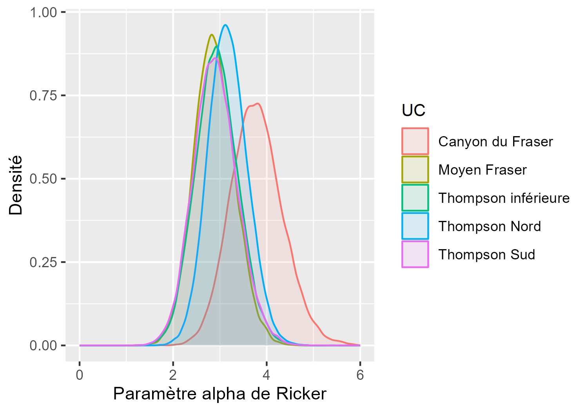
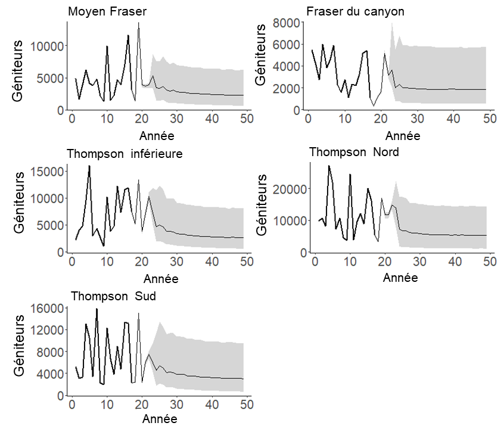
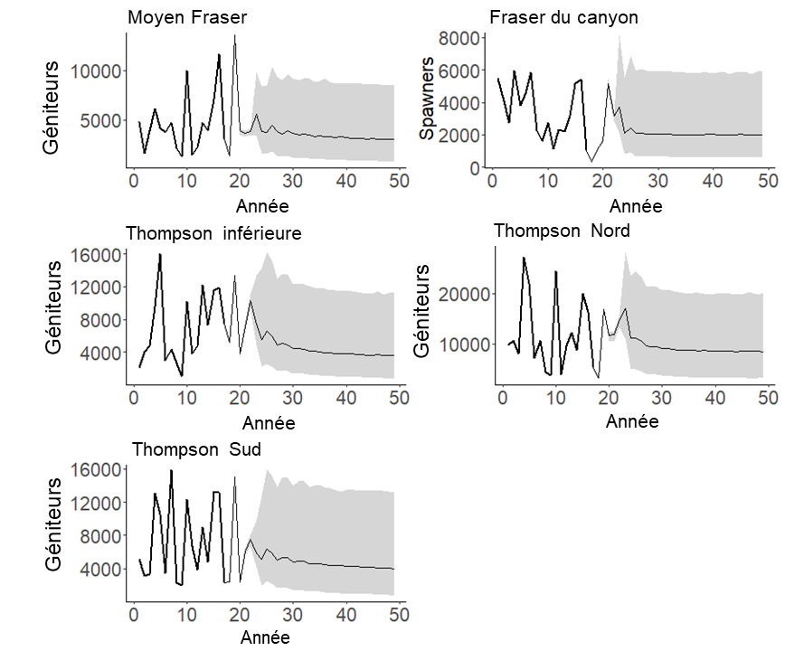

---
output:
  pdf_document: default
  html_document: default
---
<!-- The following code should appear at the beginning of the first appendix.
After that, all subsequent sections will be turned into appendices. -->


# SUPPORTING INFORMATION FOR INTERIOR FRASER COHO CASE STUDY {#app:coho-appendix}


## Assessment of CU Representativeness Based on Guidelines Criteria

We considered the 4 criteria identified in @holtGuidelinesDefiningLimitInpress to evaluate if status of any one CU within this SMU could be inferred from the remaining CUs; these criteria included similarity in (i) threats, (ii) environmental conditions and drivers, (iii) life history and (iv) population capacity. Although statuses are available for all CUs in this SMU, we consider the application of these criteria to evaluate how decisions about whether CU status can be inferred from other CUs based on these criteria differ from the results of sensitivity analyses presented in the main paper. As part of these sensitivity analyses, we explored how removing one or two CUs affected LRP estimation and status assessments against the LRP.

In an assessment of threats for Interior Fraser Coho completed as part of the 2018 Recovery Potential Assessment, @arbeiderInteriorFraserCoho2020 ranked a comprehensive set of threats on a scale of high, medium, low, and unknown.  The dominant threats to this SMU are from activities related to forestry, forest fires, agriculture, and urban and rural development. Specific threats arising from these activities included the modification of catchment surfaces, effluents from agriculture and forestry, and linear development, which is defined as the straightening and channelization of streams [@arbeiderInteriorFraserCoho2020]. While impacts from a given activity may be higher in some CUs than others, the interconnected threats stemming from multiple activities, as well as cumulative impacts, mean that it is hard to isolate one CU that experiences threats differently than another. Furthermore,  extensive agricultural and linear development in the lower Fraser River, which all Interior Fraser Coho smolts migrate through, and a proportion of juveniles rear in, means that there is a possibility that all CUs are affected by threats stemming from agriculture and linear development.

When evaluating the similarity of environmental conditions and drivers among CUs, we looked to multiple ecosystem classification schemes.  The first scheme, Marine Adaptive Zones, applies to the riverine, estuarine, and marine habitats utilized by juveniles, and were used to inform CU delineation [@holtbyConservationUnitsPacific2007]. For Interior Fraser Coho, all CUs belongs to the same Marine Adaptive Zone, Georgia Strait, suggesting that environmental conditions and drivers in these habitats are shared among all CUs.  The second scheme, Freshwater Adaptive Zones (FAZ), represents the freshwater ecological drainage units, and was also used to delineate CUs [@holtbyConservationUnitsPacific2007]. For Interior Fraser Coho, each CU belongs to a unique FAZ, which is often (but not always) the case with CU delineation.  Finally, we looked at Biogeoclimatic Zones <!-- citation needed-->derived from vegetation classification. All five Interior Fraser Coho CUs included a mix of Biogeoclimatic Zones with Interior vegetation, including Interior Douglas Fir, Bunchgrass, Montane Spruce, and Engelmann Spruce.  The Middle Fraser CU included some boreal vegetation zones, such as Sub-Boreal Pine and Sub-Boreal Pine--Spruce.  The Fraser Canyon CU was the only CU that included a more coastal vegetation type, Coastal Western Hemlock. However, it is not well understood how this difference would affect environmental conditions and drivers.  More work is needed to better understand whether these differences are substantial enough to affect the representativeness of CUs.

All Interior Fraser Coho CUs have the same predominantly 3-year life history, with the proportion maturing at age 3 similar among CUs.   

Finally, we use the estimated S~REP~, which is the spawner abundance at which the stock replaces itself, from a base Ricker model fit (described in the main body of the paper) to look for differences in habitat capacity among CUs. S~REP~ values ranged from 4023 (Fraser Canyon CU) to 14,595 (North Thompson CU), with S~REP~ values for the other three CUs evenly spaced within this range (Middle Fraser  = 6925, Lower Thompson = 8614, South Thompson = 10,498).  Given that there was no clear outlier in terms of extremely low or extremely high capacity, it is unclear whether these five CUs would respond differently to threats based on habitat capacity alone.

Based on similarities in threats, life history, population capacity, and some shared environmental drivers (i.e., lower Fraser River, estuary, and marine environments), we found few significant indicators that would have prevented us from inferring CU status for one CU from neighboring CUs prior to our case study analyses, especially when data from several other CUs are available to represent the missing CU. However, the large diversity in environmental conditions on land, Biogeoclimatic zones, and unique weather events, combined with the generally large areas encompassed by each CU, does require careful consideration when inferring CU status. For example, consideration may be required when environmental catastrophes occur that only impact individual CUs, or parts of CUs, such as landslides, floods, droughts, and forest fires; depending on the duration of the impacts of such events. An example of a recent catastrophic event is the Big Bar landslide, which only impacted one subpopulation within the Middle Fraser CU.If the impacts of this slide persist without mitigation, the status of the Middle Fraser CU would likely not be coupled with adjacent CUs. We also note that the Fraser Canyon CU may be the most unique in terms of it having the smallest capacity and a more coastal dominated biogeoclimatic zone, so special consideration may be given to cases in which CU-level data is missing from Fraser Canyon.


\newpage

## Bayesian Stock-Recruitment Model Parameter Estimates


```{r coho-SrepPrior, fig.cap="Prior distribution for S\\textsubscript{REP} (the spawner abundance level at which the stock replaces itself) used when fitting the Ricker\\_priorCap model. The red dashed line shows the maximum likelihood estimate of S\\textsubscript{REP} from the base Ricker model stock-recruitment fit. The mean of the SRep prior was set to 1.4 times the maximum likelihood estimate.", warning=FALSE, echo=FALSE, out.width = '80%',  fig.align="center"}
knitr::include_graphics("figure/coho-SrepPriorDist.png")
```


<!--To Do: improve table formatting so that different number of digits for different variables
-->


\newpage

```{r coho-postSummary-Ricker, warning=FALSE, echo=FALSE}

dat <- as.data.frame(read.csv("data/coho-postSummary-Ricker.csv"))
options(scipen=999, digits=5)

dat[dat$Variable == "adjProd",3:6]<-round(dat[dat$Variable == "adjProd",3:6],digits=2)
dat[dat$Variable == "alpha",3:6]<-round(dat[dat$Variable == "alpha",3:6],digits=2)
dat[dat$Variable == "beta",3:6]<-round(dat[dat$Variable == "beta",3:6],digits=4)
dat[dat$Variable == "Sgen",3:6]<-round(dat[dat$Variable == "Sgen",3:6],digits=0)
dat[dat$Variable == "sigma",3:6]<-round(dat[dat$Variable == "sigma",3:6],digits=2)
dat[dat$Variable == "gamma",3:6]<-round(dat[dat$Variable == "gamma",3:6],digits=2)

 csasdown::csas_table(dat, booktabs = T, caption = "Summary of posterior distribution mean and quantiles (5%, 50%, and 95%) for stock-recruit model parameters and Sgen lower benchmark from the Ricker model fit.  The 'adjProd' parameter is the effective productivity, $\\alpha$', from Equation 15 in the main document.")

 
```

\newpage

```{r coho-postSummary-RickerCap, warning=FALSE, echo=FALSE}

dat <- as.data.frame(read.csv("data/coho-postSummary-RickerCap.csv"))
options(scipen=999, digits=2)

csasdown::csas_table(dat, digits=2, booktabs = T, caption = "Summary of posterior distribution mean and quantiles (5%, 50%, and 95%) for stock-recruit model parameters and Sgen lower benchmark from the Ricker\\_priorCap model fit. The 'adjProd' parameter is the effective productivity, $\\alpha$', from Equation 15 in the main document.")
 
```

\
&nbsp;
&nbsp;
&nbsp;
&nbsp;

```{r coho-Ricker-alphaPosts, fig.cap="Posterior distributions for Ricker $\\alpha$ parameters, by CU, obtained from fitting the base Ricker stock-recruitment model.", warning=FALSE, echo=FALSE, out.width = '90%',  fig.align="center"}

```


```{r coho-Ricker-adjProdPosts, fig.cap="Posterior distributions for effective productivity ($\\alpha$') parameters, by CU, obtained from fitting the base Ricker stock-recruitment model.", warning=FALSE, echo=FALSE, out.width = '90%',  fig.align="center"}

```


```{r coho-priorCap-alphaPosts, fig.cap="Posterior distributions for Ricker $\\alpha$ parameters, by CU, obtained from fitting the Ricker\\_priorCap stock-recruitment model.", warning=FALSE, echo=FALSE, out.width = '95%',  fig.align="center"}

```

\linebreak
&nbsp;
&nbsp;
&nbsp;
&nbsp;
&nbsp;
&nbsp;
&nbsp;
&nbsp;
&nbsp;
&nbsp;


```{r coho-priorCap-adjProdPosts, fig.cap="Posterior distributions for effective productivity ($\\alpha$') parameters, by CU, obtained from fitting the Ricker\\_priorCap stock-recruitment model.", warning=FALSE, echo=FALSE, out.width = '95%',  fig.align="center"}

```

\
&nbsp;
&nbsp;


## Projected Spawner Abundances used for the Projection LRP Method

```{r coho-CUProjections-Ricker, fig.cap="Projected spawner abundances, for each of the five Interior Fraser Coho CUs, used to develop projection LRPs under the base Ricker model. The solid line shows the median spawning abundance in a projection year while the grey shading shows the 10th and 90th percentiles of spawner abundance", warning=FALSE, echo=FALSE, out.width = '80%',  fig.align="center"}

```


```{r coho-CUProjections-Ricker-priorCap, fig.cap="Projected spawner abundances, for each of the five Interior Fraser Coho CUs, used to develop projection LRPs under the Ricker\\_priorCap model. The solid line shows the median spawning abundance in a projection year while the grey shading shows the 10th and 90th percentiles of spawner abundance", warning=FALSE, echo=FALSE, out.width = '80%',  fig.align="center"}

```


