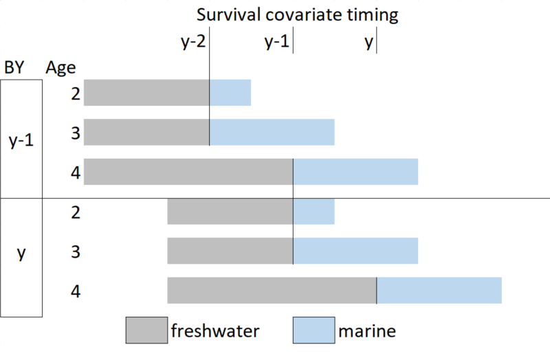

<!-- bookdown::render_book("index.Rmd")
  render code


 -->

# DOCUMENTATION DU MODÈLE SAMSIM {#app:samSim-appendix}

`samSim` est l’outil de modélisation par simulation en boucle fermée utilisé pour calculer les PRL de projection. Un aperçu de `samSim` et du code se trouve sur la [page GitHub](https://github.com/Pacific-salmon-assess/samSim/tree/LRP) du projet de PRL. samSim a déjà été utilisé pour évaluer le rendement de la règle de contrôle des prises par rapport au potentiel de rétablissement [@holtQuantitativeToolEvaluating2020; @freshwaterBenefitsLimitationsIncreasing2020]. Nous avons créé une version modifiée de samSim pour appuyer l’estimation des PRL pour le présent document. 

Voici les fonctionnalités mises à jour pour la version de SamSim servant à estimer les PRL.


* L’option d’échantillonnage des paramètres de stock-recrutement est établie directement à partir d’une distribution bayésienne a posteriori commune estimée.

* L’ajout d’une fonction de stock-recrutement qui comprend une covariable environnementale, ainsi que la spécification de la variabilité future de la covariable environnementale (requise pour l’étude de cas du saumon coho du Fraser intérieur).

* L’option d’initialiser la dynamique de la population pour chaque UC à un équilibre non atteint lorsque des données historiques sur le recrutement ne sont pas disponibles. Bien que cette option ne soit pas appropriée pour les projections visant à estimer le rétablissement à partir de l’état actuel, elle peut être utilisée pour estimer les PRL de projection parce que nous ne nous intéressons qu’à la relation sous-jacente entre l’abondance agrégée et la probabilité que chaque UC dépasse son PRI à des niveaux d’équilibre.

* L’option d’inclure un facteur de correction du biais log-normal de $-\sigma^2 / 2$ pour le recrutement projeté à l’aide de l’un des deux modèles de stock-recrutement de Ricker disponibles. Cette option a été ajoutée pour tenir compte des cas où l’outil samSim est paramétré à l’aide des paramètres de stock-recrutement qui ont été corrigés pour le biais log-normal afin de représenter les paramètres prévus (moyens). La correction du biais log-normal est couramment appliquée dans la modélisation stock-recrutement parce que la valeur attendue de *e*^$\sigma$ est *e*^$\sigma^2 / 2$  plutôt que zéro lorsque les écarts de recrutement sont normalement distribués[@coxCandidateLimitReference2019; @ohlbergerBayesianLifecycleModel2019; @olmosEvidenceSpatialCoherence2019; @forrestAssessmentPacificCod2020]. Lorsque les paramètres d’entrée ont été corrigés pour ce biais log-normal, la correction du biais doit également être ajoutée aux projections (comme dans Weir et al. (sous presse)^[ Weir, L., et al. Recovery Potential Assessment for 11 Designatable Units of Chinook Salmon, Oncorhynchus tshawytscha, Part 2: Elements 12 to 22. DFO Can. Sci. Advis. Sec. Res. Doc. En préparation]. Nous utilisons un facteur de correction du biais log-normal pour toutes nos analyses d’études de cas.

* Spécification de la variabilité des taux d’exploitation en fonction de la variabilité entre les années et de la variabilité entre les UC.

Cette annexe décrit les équations et la structure du modèle `samSim`. Nous nous efforçons de fournir des descriptions détaillées des options de modélisation utilisées pour les études de cas sur les PRL, mais nous mentionnons brièvement d’autres extensions de modèle déjà mises en œuvre dans `samSim`. `samSim` comprend deux échelles de population, qui peuvent être appliquées à une unité de conservation (UC; appelée Conservation Unit, CU, dans le code `samSim`) avec des populations reproductrices constituantes ou à une unité de gestion des stocks (UGS; appelée Management Unit, MU, dans le code `samSim`) avec des UC constituantes. Pour l’analyse des PRL de projection, deux UGS et leurs UC constituantes ont été utilisées comme cas à l’étude, soit l’UGS de saumon chinook de la côte ouest de l’île de Vancouver (COIV; qui comporte trois UC) et l’UGS du saumon coho du Fraser intérieur (qui comporte cinq UC). Les sections suivantes de la présente annexe sont organisées de la même façon que le code `samSim`, c’est pourquoi les sous-titres de cette annexe peuvent être interprétés comme des pseudo-codes. Le modèle de simulation comporte deux phases principales : amorçage du modèle et projection. La phase d’amorçage du modèle recrée les données des années précédentes, soit en remplissant les objets avec les données observées, soit en générant des tendances démographiques fondées sur les paramètres d’entrée. La phase de projection génère des données pour les années à venir en fonction des données et des paramètres d’entrée ainsi que des scénarios et des procédures de gestion définis par l’utilisateur. Les indices de modèle sont définis au tableau \@ref(tab:indtab), les paramètres de modèle et les données d’entrée sont définis au tableau \@ref(tab:paramtab),  et les quantités modélisées sont définies au tableau \@ref(tab:modtab). Des définitions détaillées des données et des paramètres d’entrée sont fournies dans le fichier [README](https://github.com/Pacific-salmon-assess/samSim/tree/LRP#readme). 


\begin{table}[ht]
\centering
\caption{Liste des indices de modèle utilisés dans \texttt{samSim}}
\begin{tabular}{l l}
\hline
Symbole & Définition \\
\hline
$y$ & Année \\
$nPrime$ & Nombre d’années dans la phase d’amorçage\\
$Y$ & Nombre d’années dans la phase de projection \\
$j$ & Âge \\
$J$ & Âge maximal \\
$i$ & Unité de conservation (UC)\\
$I$ & Nombre d’unités de conservation\\
$n$ & Pays : États-Unis ou Canada \\
\hline
\end{tabular}
(\#tab:indtab)
\end{table}


<!--CH: I added 1/spawners at maximum recruitment to beta defn.-->
\newpage

\begin{longtable}[]{l p{13.5cm}}
\caption{Liste des paramètres de modèle et des variables entrées par l’utilisateur dans \texttt{samSim}.}\\
\hline
Symbole & Définition \\
\hline
\endhead
$\alpha_{i}$ & Paramètre de productivité de Ricker \\
$\beta_{i}$ & Paramètre de capacité inverse de Ricker ou 1/géniteurs au recrutement maximal \\
$\sigma_{i}$ & Écart-type pour l’erreur de recrutement\\
$\rho$ & Coefficient d’autocorrélation temporel dans les résidus du recrutement\\
$\gamma$ & Scalaire de la covariable de survie \\
$covMat$ & Matrice de covariance utilisée pour générer des écarts de recrutement avec corrélation entre les UC\\
$\overline{ER}_{n}$ & Taux d’exploitation moyen à long terme propre au pays\\
$\overline{p}_{i,j}$ & Proportion moyenne de recrues selon l’âge\\
$\tau_{i}$ & Paramètre de variabilité logistique multivariée pour les proportions de recrues selon l’âge\\
$\overline{sv}$ & Covariable moyenne de survie \\
$\sigma_{sv}$ & Écart-type pour la covariable de survie\\
$\Upsilon$ & Scalaire pour plafonner les valeurs de recrutement \\
$\varphi$ & Paramètre de variabilité logistique multivariée pour les proportions observées de recrues selon l’âge\\
$\overline{\omega}$ & Moyenne pour l’erreur log-normale de prévision\\
$\sigma_{\omega}$ & Variance pour l’erreur log-normale de prévision\\
$CV(\overline{ER}_{n})$ & CV pour la variabilité du taux d’exploitation propre à l’UGS \\
$CV(ER_{y,i,n})$ & CV pour la variabilité du taux d’exploitation propre à l’UC\\
$\psi$ & Proportion des prises associées aux prises provenant de stocks mixtes\\
$ERagg_{y,i}$ & Taux d’exploitation totaux\\
$\kappa$ & Paramètre de variabilité logistique multivariée associé à l’attribution des prises dans les pêches ciblant des stocks mixtes à la bonne UC\\
$\hat{\alpha}_{y,i}$ & Paramètre de productivité de Ricker estimé \\
$\hat{\beta}_{y,i}$ & Paramètre de capacité inverse de Ricker estimé \\
\hline
(\#tab:paramtab)
\end{longtable}


<!--CH: In samSim, I think we call calendar recruitment, 'returns'. I've added this in parentheses below to help with cross-checking against code. -->
\newpage

\begin{longtable}[]{l p{13.5cm}}
\caption{Liste des paramètres de modèle et des variables entrées par l’utilisateur dans \texttt{samSim}.}\\
\hline
Symbole & Définition \\
\hline
\endhead
\hline
$G_{y,i}$ & Géniteurs\\
$Geq_{i}$ & Géniteurs à l’équilibre\\
$RY_{y,i}$ & Recrues pour l’année civile (individus en montaison)\\
$p_{y,i,j}$ & Proportion des individus en montaison selon l’âge\\
$R_{y,i}$ & Recrues de l’année d’éclosion \\
$Ra_{y,i,j}$ & Recrues en fonction de l’année d’éclosion\\
$w_{y,i}$ & Écarts de recrutement avec autocorrélation temporelle\\
$v_{y,i}$ & Écarts de recrutement\\
$sv_{y,j}$ & Covariable de survie pour l’année d’éclosion\\
$svCY_{y}$ & Covariable de survie pour l’année civile \\
$wsv_{y}$ & Covariable de survie sans correction du biais\\
$GRMD_{i}$ & Géniteurs qui produisent le rendement maximal durable \\
$Ggén_{i}$ & Nombre de géniteurs requis pour le rétablissement à $GRMD_{i}$ en une génération en l’absence de pêche \\
${\alpha^\prime}_{i}$ & Paramètres ajustés$\alpha_{i}$ pour le calcul des points de référence de gestion invariants dans le temps\\
$obsp_{y,i,j}$ & Proportions observées de recrues selon l’âge\\
$f(R_{y,i})$ &  Prévision du recrutement pour l’année civile\\
$ER^{MU}_{y,n}$ & Taux d’exploitation incluant uniquement la variabilité propre à l’UGS\\
$d1$, $d2$ & Paramètres de forme pour la distribution bêta utilisés pour générer la variabilité propre à l’UGS\\
$\vartheta$ & Écart-type pour la variabilité du taux d’exploitation propre à l’UGS\\
$ER_{y,i,n}$ & Taux d’exploitation incluant la variabilité propre à l’UC et à l’UGS\\
$o1$, $o2$ & Paramètres de forme pour la distribution bêta utilisés pour générer la variabilité propre à l’UC\\
$\phi_{y,i,n}$ & Écart-type pour la variabilité du taux d’exploitation propre à l’UC\\
${C}_{y,i,n}$ & Prises \\
${mC}_{y,i}$ & Prises des pêches canadiennes ciblant des stocks mixtes \\
${sC}_{y,i}$ & Prises des pêches canadiennes ciblant des stocks uniques\\
$ERagg_{y,i}$ & Taux d’exploitation agrégés\\
${obsC}_{y,i,n}$ & Prises observées par pays \\
${obsmC}_{y,i}$ & Prises des pêches canadiennes ciblant des stocks mixtes observées\\
${obssC}_{y,i}$ & Prises des pêches canadiennes ciblant des stocks uniques observées\\
$u_{y,i,n}$ & Composante d’erreur log-normale des prises observées\\
$pCU_{y,i}$ & Proportion des prises provenant de chaque UC\\
$obspCU_{y,i}$ & Proportion observée des prises provenant de chaque UC \\
${obsS}_{y,i,n}$ & Géniteurs observés \\
$z_{y,i}$ & Composante de l’erreur log-normale des géniteurs observés\\
${obsRY}_{y,i,n}$ & Recrues observées pour l’année civile \\
${obsER}_{y,i,n}$ & Taux d’exploitation observés \\
\hline
(\#tab:modtab)
\end{longtable}


## AMORÇAGE DU MODÈLE


La phase d’amorçage, ou l’initialisation du modèle, représente la modélisation des données antérieures des UC. Elle est utilisée pour représenter l’abondance réelle et observée avant de commencer les essais de projection. Cette phase couvre plusieurs années précédentes ('nPrime') et reconstitue les séries chronologiques de recrutement de ces années. Les simulations peuvent être initialisées de deux façons : avec les données sur le recrutement existantes ou avec les paramètres définis par l’utilisateur, si des données sur le recrutement ne sont pas disponibles.

### Des données sur le recrutement sont disponibles

Si des données sur le stock-recrutement sont disponibles, le nombre d’années d’initialisation 'nPrime' est défini en fonction de la longueur de la série chronologique de l’UC la plus longue disponible. Les objets géniteurs, recrues, prises et taux d’exploitation sont remplis avec les données d’entrée. Si des données sur les prises ou le taux d’exploitation ne sont pas disponibles, ces valeurs sont réglées à zéro.

### Des données sur le recrutement ne sont pas disponibles{#recruitment-data-are-not-available}

Lorsque des données sur le recrutement ne sont pas disponibles, 'nPrime' est réglé à 10 fois l’âge maximal des recrues. La première étape de cette méthode consiste à récupérer les paramètres de stock-recrutement. L’utilisateur a la possibilité de fournir soit un ensemble de valeurs à utiliser pour tous les essais, soit de nombreux ensembles d’estimations de paramètres, habituellement à partir d’échantillons MCCM. Si de tels échantillons sont fournis, un ensemble différent de paramètres est utilisé pour chaque essai de simulation.

Les paramètres de stock-recrutement peuvent être modifiés en fonction des scénarios définis par l’utilisateur, par exemple, pour simuler des changements de régime. `samSim` comprend des options pour ajuster le paramètre de productivité, $\alpha_{i}$, le paramètre de capacité $\beta_{i}$,  et les écarts-types de recrutement, $\sigma_{i}$.  Les études de cas sur le PRL ne comprennent pas les ajustements ou les changements de productivité au fil du temps; par conséquent, nous ne décrirons pas les options d’ajustement des paramètres dans cette annexe. On suppose que le recrutement est corrélé entre les UC, où la matrice variance-covariance est calculée en fonction des variances de recrutement propres à l’UC et de la matrice de corrélation dans les résidus du recrutement précisés dans un fichier d’entrée.


Une fois les paramètres de stock-recrutement définis, le nombre de géniteurs est initialisé. Le nombre de géniteurs est établi à l’équilibre pour les six premières années (le nombre maximal possible de classes d’âge), puis calculé en fonction des taux de recrutement et d’exploitation des années précédentes (équation \@ref(eq:Seqinit)). Si le nombre calculé de géniteurs est inférieur au seuil d’extinction entré par l’utilisateur, alors le nombre de géniteurs est réglé à zéro. L’erreur de recrutement est donnée par une distribution normale multivariée reflétant la covariance du recrutement entre les UC.


\begin{equation}
G_{y,i} =
 \begin{cases}
   Geq_{i} &\text{ if } y = \leq 6\\
   RY_{y,i} \cdot (1 - \overline{ER}_{n}) &\text{ otherwise}
  \end{cases}
  (\#eq:Seqinit)
\end{equation}

\begin{equation}
Geq_{i} = \alpha_{i}/\beta_{i}
(\#eq:Seq)
\end{equation}


La structure par âge du recrutement par année d’éclosion est calculée en suivant une structure d’erreur logistique multivariée fondée sur la structure par âge moyen à long terme pour chaque UC, $\overline{p}_{i,j}$ et le paramètre de variabilité propre à l’UC $\tau_i$ [@schnuteInfluenceErrorPopulation1995] (équation \@ref(eq:mat). L’erreur de structure par âge peut varier ou demeurer constante entre les UC. Le recrutement par année civile est ensuite calculé après la sixième année de la phase d’amorçage. C’est le produit du recrutement par l’année d’éclosion et de la structure par âge des recrues (équation \@ref(eq:RY)).

<!--CH: I think this is the same thing but I just wanted to be clear that the multivariate logistic aging error was applied to recruitment by BY, not calendar year Returns. Total returns are calculated in the 2nd eqn below.
-->
\begin{equation}
  p_{y,i,j} \sim \text{Multivariate Logistic}(\overline{p}_{i,j},\tau_{i})
  (\#eq:mat)
\end{equation}

if y>6:
\begin{align}
  RY_{y,i} = \sum_j(R_{y-j,i} \cdot p_{y-j,i,j})
  (\#eq:RY)
\end{align}

<!-- Le calcul du recrutement par année d’éclosion suit la courbe de recrutement choisie. Pour la version de `samSim` servant à estimer les PRL, trois options pour la courbe de recrutement sont disponibles : une courbe de Ricker simple (équation \@ref(eq:Rickersimple) quand $\rho = 0$), une courbe de Ricker avec autocorrélation temporelle dans l’erreur de recrutement (équation  \@ref(eq:Rickersimple)) et une courbe de Ricker avec covariable de survie du stade de smolt à celui d’adulte (équations \@ref(eq:Rickersurv) et \@ref(eq:Rickersurvsum), également décrites au chapitre \@ref(IFCChapter)). On suppose que l’erreur de recrutement est corrélée entre les UC pour toutes les versions de la courbe de Ricker. Des écarts aléatoires de recrutement peuvent être générés avec des distributions multivariées t ou des distributions normales multivariées, qui peuvent être symétriques ou asymétriques. Les cas à l’étude utilisés dans ce rapport supposent tous que les écarts aléatoires de recrutement proviennent d’une distribution normale multivariée symétrique (équation \@ref(eq:CUautocorr)).  -->

\begin{equation}
  R_{y,i} = G_{y,i} \cdot e^{\alpha{i} - \beta{i} \cdot G_{y,i} + w_{y,i} - \frac{\sigma_{i}^{2}}{2}}
  (\#eq:Rickersimple)
\end{equation}

\begin{equation}
 w_{y,i} =
\begin{cases}
 v_{y,i} & \text{if } y = 1 \\
 w_{y-1,i} * \rho + v_{y,i} & \text{if } y > 1
\end{cases}
\end{equation}

\begin{equation}
  v_{y,i} \sim N(\mu=0,covMat)
  (\#eq:CUautocorr)
\end{equation}


\begin{align}
  Ra_{y,i,j} = p_{y,i,j} \cdot G_{y,i} \cdot e^{\alpha_{i} - \beta_{i} \cdot G_{y,i} + \gamma_{i} \cdot sv_{y,j} + v_{y,i} - \frac{\sigma_{i}^{2}}{2}}
  (\#eq:Rickersurv)
\end{align}

\begin{equation}
  R_{y,i} = \sum_{j}Ra_{y,i,j}
  (\#eq:Rickersurvsum)
\end{equation}


Pour le modèle de Ricker avec covariable de survie du stade de smolt à celui d’adulte, les covariables pour chaque année civile sont générées suivant une distribution normale avec la moyenne et la variance définies par l’utilisateur (équation \@ref(eq:survCY)). La distribution des covariables de survie est tronquée entre les valeurs maximales et minimales fournies dans les fichiers d’entrée. Les covariables de survie de l’année d’éclosion, $Surv_{y,j}$ sont actuellement remplies selon les principaux types de cycle biologique du saumon coho du Fraser intérieur. Pour ce stock, les poissons ayant un cycle biologique de trois ans diffèrent de ceux ayant un cycle biologique de quatre ans en raison du nombre d’années passées en eau douce en tant que juvéniles, c’est-à-dire 18 mois par rapport à 30 mois; les poissons des deux cycles biologiques passent 18 mois en mer avant de revenir frayer. Les poissons dont le cycle biologique est de deux ans passent 18 mois en eau douce et seulement 6 mois en mer avant de revenir sous forme d’unibermarins. Ce cycle biologique entraîne un retard d’un an de la covariable de survie pour les âges 2 et 3 (équation \@ref(eq:surv)). Les deux premières années sont une exception de la boucle d’amorçage, lorsqu’aucun décalage n’est appliqué aux covariables.


\begin{equation}
sv_{y,j} =
\begin{cases}
 svCY_{y-1} & \text{if } j\leq 3 \\
 svCY_{y} & \text{otherwise}
\end{cases}
 (\#eq:surv)
\end{equation}

\begin{align}
  svCY_{y} &= wsv_{y} - \dfrac{{\sigma_{sv}}^2}{2}\\
  wsv_{y} &\sim N(\overline{sv},\sigma_{sv})
  (\#eq:survCY)
\end{align}


<!--


```{r cohosurvivaldiagram, fig.cap="Diagram of Interior Fraser coho dominant life history, gray indicates freshwater stages and blue indicates marine stage. brood year is marked in the rows and delays in the survival covariate are marked in the columns", warning=FALSE, echo=FALSE, fig.align="center"}

```
-->

Les nombres de recrues produites avec l’une ou l’autre formulation du modèle de Ricker sont plafonnés. La valeur maximale du recrutement par défaut est de $3 \cdot G_{eq}$, mais le scalaire peut être modifié par l’utilisateur par la $\Upsilon$ variable (équation \@ref(eq:reccapscalar)). De plus, si le nombre de recrues généré est inférieur au seuil d’extinction défini par l’utilisateur, alors le recrutement est réglé à zéro.

\begin{equation}
  R_{y,i} = min(R_{y,i}, \Upsilon \cdot Seq_{i})
  (\#eq:reccapscalar)
\end{equation}

<!--CH addition below-->
Bien que dans notre mise en œuvre de `samSim` pour le saumon coho du Fraser intérieur avec la covariable de survie du stade de smolt à celui d’adulte les données aient été utilisées pour amorcer le modèle, les équations pour la simulation de la dynamique au cours de cette période sont fournies ici par souci d’exhaustivité. Les équations de simulation de la dynamique des populations sont également utilisées dans la phase de projection du modèle (voir ci-dessous).

### Calcul des quantités et des points de référence de gestion{#compute-management-quantities-and-benchmarks}

Dans la boucle d’amorçage, les quantités et les points de référence de gestion sont calculés uniquement sur les deux dernières générations. Les points de référence de gestion sont calculés selon trois options : « stock-recrutement », « centile » et « habitat ». `samSim`  a la capacité d’estimer les quantités et les points de référence de gestion sur une base annuelle, en s’appuyant sur les données obtenues depuis le début de la série chronologique jusqu’à l’année de simulation en cours. Toutefois, aux fins des cas à l’étude sur les PRL, on a utilisé des points de référence de gestion invariants dans le temps. C’est pourquoi nous omettons l’indice de temps $y$, de la notation utilisée pour les quantités de gestion.


Si l’option fondée sur le « stock-recrutement » est utilisée, les quantités de gestion sont $GRMD_{i}$ et $Ggén_{i}$  calculées en fonction des paramètres de stock-recrutement. Lorsque le modèle avec covariable de survie est utilisé, le paramètre $\alpha_{i}$  est modifié pour intégrer la composante de survie (équation \@ref(eq:alphamb)). Afin de maintenir les points de référence de gestion constants au fil du temps, on utilise la moyenne à long terme de la covariable de survie. $GRMD_{i}$ est calculé selon la solution explicite fournie par @scheuerellExplicitSolutionCalculating2016 utilisant la fonction W de Lambert (équation \@ref(eq:smsysamSim). $Ggén_{i}$ est estimé en résolvant l’équation \@ref(eq:SgensamSim)  numériquement, comme décrit par @holtIndicatorsStatusBenchmarks2009. Le PRI est établi à $Ggén_{i}$  et le PRS est établi à 80\% de $GRMD_{i}$.


\begin{equation}
{\alpha^\prime}_{i} =
\begin{cases}
\alpha_{i} + \gamma_{i}\cdot \overline{sv} & \text{for Ricker with survival} \\
\alpha_{i}  & \text{for simple Ricker}
\end{cases}
  (\#eq:alphamb)
\end{equation}

\begin{equation}
  GRMD_{i} = \dfrac{1 - W(e^{1-{\alpha^\prime}_{i}})}{\beta_{i}}
  (\#eq:smsysamsim)
\end{equation}


\begin{equation}
  GRMD_{i} = Ggén_{i} \cdot  e^{{\alpha^\prime}_{i}- \beta_{i} \cdot Ggén_{i}}
  (\#eq:Sgensamsim)
\end{equation}


Si l’option du point de référence fondé sur le « centile » est choisie, le PRS est établi au 50^e^ centile de l’abondance des géniteurs historiques ($G_{1:y,i}$). Le PRI est établi au 25^e^ centile de l’abondance des géniteurs historiques. Il est à noter que les points de référence fondés sur le centile n’ont pas été mis en œuvre dans nos études de cas pour les PRL de projection. Les demandes futures pourraient faire varier les centiles utilisés comme PRI et PRS, comme il est recommandé dans @holtEvaluatingBenchmarksBiological2018. Si l’option de référence fondé sur l’« habitat » est choisie, les points de référence sont calculés selon la même approche que dans l’option fondées sur le « stock-recrutement ». La différence réside dans l’origine des paramètres de stock-recrutement, c’est-à-dire à partir du modèle fondé sur l’habitat plutôt que sur la courbe stock-recrutement.


### Remplissage des données manquantes

La dernière étape de l’amorçage du modèle est le remplissage, qui n’est pertinent que si des données sur le stock-recrutement sont disponibles et qu’il y a des lacunes au cours des 12 dernières années de la série chronologique. Toute donnée manquante dans les 12 dernières années de la série chronologique des géniteurs et des recrues fait l’objet d’un remplissage avec la moyenne géométrique de toute la période d’amorçage. Dans la phase d’amorçage, nous supposons que toutes les variables sont connues sans erreur, de sorte que toutes les observations sont réglées aux valeurs de simulation réelles, c’est-à-dire qu’aucune erreur d’observation n’est ajoutée.


## PROJECTIONS DU MODÈLE

La phase de projection du modèle est utilisée pour représenter les résultats possibles futurs. Les étapes de cette phase dépendront des scénarios et des procédures de gestion sélectionnés par l’utilisateur, et varieront donc selon l’application du modèle. Dans la section suivante, nous énumérons toutes les étapes dans l’ordre où elles apparaissent dans le code et indiquons dans le texte si l’étape a été utilisée pour les études de cas sur les PRL. Comme pour la phase d’amorçage, les sous-titres de cette section peuvent être interprétés comme des pseudo-codes. Les projections sont exécutées pour chaque essai de l’année `nPrime + 1` à `Y’, cette dernière étant le nombre d’années de projection défini par l’utilisateur.

### Préciser les paramètres de stock-recrutement

Comme pour la phase d’amorçage, la première étape de la boucle de projection consiste à définir les paramètres de stock-recrutement. Les paramètres $\beta_{i}$ et $\sigma_{i}$  sont fixés dans le temps et ont déjà été définis dans la phase d’amorçage. Toutefois, si l’utilisateur précise les changements de productivité au fil du temps, le paramètre de productivité $\alpha_{y,i}$ est ajusté chaque année selon une tendance linéaire. Une description détaillée de l’algorithme utilisé pour générer les tendances de la productivité ne fait pas partie de la portée de ce document, car les cas à l’étude ne comprennent pas de scénarios comportant des changements de la productivité. Comme le paramètre de productivité est maintenu constant dans les cas à l’étude, nous continuerons d’utiliser la notation temps-invariant ($\alpha_{i}$) pour le paramètre dans les sections à suivre.

### Points de référence de gestion du projet

Une fois que $\alpha_{i}$  est précisé, les quantités réelles de gestion $GRMD_{i}$ et $Ggén_{i}$  pour l’année de projection sont calculées selon les équations \@ref(eq:smsysamSim) et \@ref(eq:SgensamSim). Les points de références de gestion peuvent être estimés de nouveau chaque année ou fixés par la période normative, c’est-à-dire la dernière année de la phase d’amorçage, `nPrime`. Les cas à l’étude présentés dans ce document utilisent les points de référence de gestion de la période normative.

### Recrutement observé du projet

À cette étape, nous calculons les proportions observées d’individus en montaison selon l’âge et le recrutement observé pour chaque année d’éclosion. L’erreur d’observation pour les proportions d’individus en montaison selon l’âge est donnée par une structure d’erreur logistique multivariée comme décrite par @schnuteInfluenceErrorPopulation1995. L’erreur d’observation pour les proportions d’individus en montaison selon l’âge n’est pas incluse dans les cas à l’étude sur les PRL, c’est‑à‑dire que le paramètre de variabilité, $\varphi$, est réglé à zéro.


\begin{equation}
  obsp_{y,i,j} \sim \text{Multivariate Logistic}(p_{y,i,j}, \varphi)
  (\#eq:obsppn)
\end{equation}


Le recrutement observé par année d’éclosion est récupéré en multipliant le recrutement réel selon l’âge pour chaque année civile par le vecteur des proportions observées selon l’âge dans les remontes (équation \@ref(eq:obsR)).


\begin{equation}
  obsR_{y-j,i} = \sum^j (RY_{y-j,i} \cdot obsp_{y-j,i,j})
  (\#eq:obsR)
\end{equation}


### Prévision du recrutement du projet

Lorsque l’erreur de prévision est incluse dans les scénarios de projection, elle est générée en ajoutant une erreur log-normale au niveau du recrutement de l’année civile (équations  \@ref(eq:FctR)  et  \@ref(eq:Fct)). La distribution des erreurs est également tronquée entre les quantiles 0,0001 et 0,9999 afin d’éviter les valeurs de prévisions extrêmes. L’erreur de prévision n’est pas prise en compte dans les cas à l’étude sur les PRL.


\begin{equation}
  f(RY_{y,i}) = RY_{y,i} \cdot exp(\omega_{y,i})
  (\#eq:FctR)
\end{equation}

\begin{equation}
  \omega_{y,i} \sim N(\overline{\omega},\sigma_{\omega})
  (\#eq:Fct)
\end{equation}


### Prises réalisées du projet

L’étape suivante consiste à calculer les prises réalisées en suivant une règle de contrôle des prises. Les deux cas à l’étude dans ce document utilisent la règle de contrôle des prises du taux d’exploitation fixe. Dans cette option, les prises sont le produit des recrues de l’année civile et du taux d’exploitation fixe pour toutes les années de projection (équation \@ref(eq:Catagg)). Cependant, même si la règle de contrôle des prises précise un taux d’exploitation fixe, les taux d’exploitation réalisés varient d’une année à l’autre en raison des changements dans la répartition de la population et la dynamique des pêches. Dans cette section, nous décrivons les couches de variabilité ajoutées aux prises simulées. Deux couches de variabilité sont prises en compte dans `samSim`; elles représentent la variabilité propre à l’UGS et la variabilité propre à l’UC. Les deux couches d’incertitude sont mises en œuvre par l’extraction des valeurs du taux d’exploitation à partir des distributions bêta. À l’heure actuelle, seules les prises canadiennes comprennent la variabilité ajoutée annuelle. Dans les cas à l’étude sur les PRL, les prises des États-Unis provenant de stocks uniques et celles du Canada sont toutes deux réglées à zéro; par conséquent, seules les prises canadiennes provenant de stocks mixtes sont mises en œuvre.


La première couche de variabilité des prises est mise en œuvre à l’échelle de l’UGS. L’erreur est censée être la même pour toutes les UC d’une UGS. La moyenne et la variance de l’erreur à l’échelle de l’UGS sont définies dans les fichiers d’entrée puis transformées en paramètres de forme pour l’extraction à partir de la distribution bêta (équations \@ref(eq:ERMU)-\@ref(eq:deER1)).


\begin{equation}
ER^{MU}_{y,n}
\begin{cases}
  \sim Beta(d1,d2) & \text{n=Canada} \\
   = \overline{ER}_{n}  & \text{n=U.S.}
\end{cases}
  (\#eq:ERMU)
\end{equation}


\begin{equation}
(\#eq:deER1)
   d1 = {\overline{ER}_{n}}^2 \cdot \left(\frac{1-\overline{ER}_{n}}{\vartheta^{2}}-\frac{1}{\overline{ER}_{n}}\right)
\end{equation}


\begin{equation}
   d2 = d1 \cdot \frac{1}{\overline{ER}_{n}-1}
\end{equation}

\begin{equation}
   \vartheta = CV(\overline{ER}_{n}) \cdot \overline{ER}_{n}
  (\#eq:deER)
\end{equation}

Dans la deuxième couche, les taux d’exploitation propres aux UC sont extraits d’une distribution bêta en utilisant le taux d’exploitation de sortie de la première couche comme moyenne et le CV propre à l’UC définis dans les fichiers d’entrée. La moyenne et les CV sont transformés en paramètres de forme pour les extractions à partir de la distribution bêta (équations \@ref(eq:ERCU)-\@ref(eq:oERCU)). Les prises sont ensuite calculées en multipliant les $ER$ propres aux UC et les recrues de l’année civile (équation \@ref(eq:Catagg)).

\begin{equation}
ER_{y,i,n}
\begin{cases}
 \sim Beta(o1_{y,i},o2_{y,i}) & \text{n=Canada} \\
 =\overline{ER}_{n}  & \text{n=U.S.}
\end{cases}
  (\#eq:ERCU)
\end{equation}


\begin{equation}
   o1_{y,i} = ({ER^{MU}_{y,n}})^2 \cdot \left(\frac{1-ER^{MU}_{y,n}}{\phi_{y,i,n}^{2}}-\frac{1}{ER^{MU}_{y,n}}\right)
\end{equation}


\begin{equation}
   o2_{y,i} = o1_{y,i} \cdot \dfrac{1}{ER^{MU}_{y,n}-1}
\end{equation}

\begin{equation}
   \phi_{y,i,n} = CV(ER_{y,i,n}) \cdot ER^{MU}_{y,n}
   (\#eq:oERCU)
\end{equation}


\begin{equation}
  {C}_{y,i,n} = ER_{y,i,n} \cdot RY_{y,i}
  (\#eq:Catagg)
\end{equation}


Les prises du Canada sont divisées en deux parties, soit les pêches ciblant des stocks mixtes et les pêches ciblant des stocks uniques (équations \@ref(eq:tacmix) et \@ref(eq:tacsingle)). Les pêches ciblant des stocks uniques n’ont pas été incluses dans nos analyses du PRL, paramètre $psi_{y,i}$ = 1, où :


\begin{equation}
(\#eq:tacmix)
  {mC}_{y,i} =  C_{y,i,n=Canada} \cdot \psi_{y,i}
\end{equation}

\begin{equation}
  {sC}_{y,i} = C_{y,i,n=Canada} \cdot (1- \psi_{y,i})
  (\#eq:tacsingle)
\end{equation}


L’étape suivante consiste à calculer le taux d’exploitation agrégé et le nombre restant de géniteurs (équations \@ref(eq:eragg) et \@ref(eq:spawners)).


\begin{equation}
  (\#eq:eragg)
  ERagg_{y,i} = \dfrac{\sum^n C_{y,i,n}}{RY_{y,i}}
\end{equation}


\begin{equation}
  S_{y,i} = RY_{y,i} \cdot(1-ERagg_{y,i})
   (\#eq:spawners)
\end{equation}


### Données observées du projet

À cette étape, l’erreur d’observation est ajoutée aux quantités calculées au pas de temps courant. Les erreurs d’observation n’ont pas été incluses dans notre mise en œuvre pour les PRL parce que les PRL étaient obtenus à partir de la dynamique réelle de la population sous-jacente sans erreur d’observation et que la procédure de gestion appliquée (taux d’exploitation constants) ne nécessitait pas d’information sur les abondances observées. 

L’erreur d’observation des prises est donnée par une distribution log-normale (équations \@ref(eq:obsC)-\@ref(eq:obssingleC)), la distribution est tronquée entre les quantiles 0,0001 et 0,9999. Si les prises sont récoltées dans une pêche ciblant des stocks mixtes, une autre erreur logistique multivariée est introduite pour tenir compte de l’incertitude dans le processus d’attribution des stocks (équation \@ref(eq:obspCU)).


\begin{equation}
obsC_{y,i,n} =
 \begin{cases}
   C_{y,i,n} \cdot u_{y,i,n} &\text{ n=U.S.}\\
   {obsmC}_{y,i} +{obssC}_{y,i} &\text{ n=Canada}
  \end{cases}
  (\#eq:obsC)
\end{equation}


Prises des pêches canadiennes ciblant des stocks mixtes observées :
\begin{equation}
  {obsmC}_{y,i} = {mC}_{y,i} \cdot u_{y,i,n} \cdot obspCU_{y,i}
  (\#eq:obsmixC)
\end{equation}


Prises des pêches canadiens ciblant des stocks uniques observées :

\begin{equation}
  {obssC}_{y,i} = {sC}_{y,i} \cdot u_{y,i,n}
  (\#eq:obssingleC)
\end{equation}


\begin{equation}
u_{y,i,n} \sim logN(0,\sigma_{C})
\end{equation}

\begin{equation}
  obspCU_{y,i}  \sim \text{Multivariate Logistic}(pCU_{y,i},\kappa)
  (\#eq:obspCU)
\end{equation}

\begin{equation}
  pCU_{y,i} = \dfrac{{mC}_{y,i}}{\sum^i {mC}_{y,i}}
\end{equation}


Le nombre observé de géniteurs est donné par une distribution log-normale tronquée entre les quantiles 0,0001 et 0,9999 (équation  \@ref(eq:obsS)). Le recrutement observé est la somme des prises observées et du nombre de géniteurs observés (équation \@ref(eq:obsRY)). Le taux d’exploitation observé est directement calculé en divisant les prises observées par le recrutement observé (équation \@ref(eq:obsER)).

\begin{equation}
(\#eq:obsS)
  obsS_{y,i} = S_{y,i} \cdot  \cdot z_{y,i}
\end{equation}

\begin{equation}
(\#eq:obsSz)
  z_{y,i} \sim logN(0,\sigma_{S})
\end{equation}


\begin{equation}
  obsRY_{y,i} = \sum^{n}obsC_{y,i,n} + obsS_{y,i}
   (\#eq:obsRY)
\end{equation}


\begin{equation}
  obsER_{y,i} = \frac{\sum_{n}obsC_{y,i,n}}{obsRY_{y,i}}
  (\#eq:obsER)
\end{equation}


### Exécution de l’évaluation des stocks et calcul des quantités de gestion{#run-stock-assessment-and-calculate-management-quantities}

Cette prochaine phase de la boucle de projection simule l’analyse de l’évaluation des stocks de saumon. La courbe linéaire simple du stock-recrutement de Ricker est ajustée aux données observées et $\hat{a}_{y,i}$ et $\hat{b}_{y,i}$ sont estimés. Encore une fois, cette étape n’a pas été mise en œuvre pour les analyses des PRL, qui utilisaient des points de référence calculés à partir de paramètres sous-jacents réels fournis comme entrées (c’est-à-dire à partir d’une période normative).


\begin{equation}
  log \left( \dfrac{obsR_{1:y,i}}{obsS_{1:y,i}}\right) = \hat{\alpha}_{y,i}-\hat{\beta}_{y,i} \cdot  obsS_{y,i}
  (\#eq:obslogRS)
\end{equation}

Les quantités de gestion, c’est-à-dire $Ggén$ et $GRMD$ ou les quantiles des géniteurs, peuvent ensuite être recalculées en fonction des paramètres estimés de stock-recrutement et de la série chronologique observée des géniteurs à l’aide de la même procédure décrite à la section \@ref(compute-management-quantities-and-benchmarks). 


### Dynamique des populations du projet


Dans cette section, le recrutement pour l’année d’éclosion en cours est calculé. La première étape consiste à produire les estimations de la survie du stade de smolt à celui d’adulte qui sont utilisées pour projeter le recrutement lorsque le modèle de Ricker avec des covariables de survie est appliqué. Les covariables de survie sont générées à l’aide de la méthode décrite dans la section \@ref(recruitment-data-are-not-available) et les équations  \@ref(eq:survCY) et \@ref(eq:surv). Les covariables de survie du stade de smolt à celui d’adulte sont considérées comme constantes dans l’ensemble des UC.

L’étape suivante consiste à calculer la structure par âge des individus en montaison avec une erreur aléatoire, qui suit la même procédure décrite à la section \@ref(recruitment-data-are-not-available). La structure par âge suit une distribution avec la structure par âge moyen et l’écart-type pour chaque UC donnée dans les fichiers d’entrée.

À l’étape suivante, on génère des écarts de recrutement, qui sont calculés avec une distribution normale multivariée, reflétant la covariance du recrutement entre les UC. Le recrutement est ensuite calculé en suivant la même procédure décrite à la section \@ref(recruitment-data-are-not-available) et en utilisant l’équation \@ref(eq:Rickersimple) pour le modèle de Ricker simple, ou l’équation \@ref(eq:Rickersurv) pour le modèle de Ricker avec des covariables de survie. 

La dernière étape de la boucle de projection consiste à calculer les PRI et PRS réels et observés, qui sont basés sur les quantités de gestion décrites à la section précédente (section \@ref(run-stock-assessment-and-calculate-management-quantities). Il s’agit soit de points de référence fondé sur le stock-recrutement, soit de points de référence fondés sur le centile, comme il est décrit à la section \@ref(compute-management-quantities-and-benchmarks), calculés en fonction de l’abondance réelle et observée des géniteurs. 


