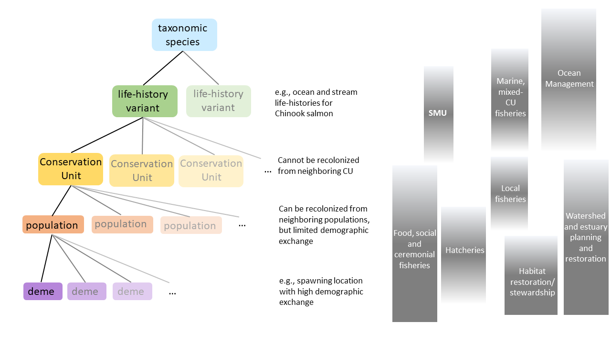

# INTRODUCTION {#intro}

<!--Footnotes:
^[Holt *et. al.* Guidelines for Defining Limit Reference Points for Pacific Salmon Stock Management Units. CSAS Working Paper. In review]   

^[Holt *et al.* Case Study Applications of LRP Estimation Methods to Pacific Salmon Stock Management Units. CSAS Working Paper. In review]

^[Pestal, G., MacDonald, B, Grant, S, and Holt, C. Rapid Status Approximations from Integrated Expert Assessments Under Canada’s Wild Salmon Policy. Can. Tech. Rep. Fish. Aquat. Sci. In prep.]

^[Marentette, J.R., Barrett, T., Cogliati, K.M., Ings, D., Ladell, J., Thiess, M.  Operationalizing Serious Harm: Existing Guidance and Contemporary Canadian Practices. Can. Sci Avis. Secr. Working Paper In prep.]

^[COSEWIC. Designatable Units for Chinook Salmon *Oncorhynchus tshawytscha* in Canada
In Press]
-->

## BACKGROUND


\begin{tcolorbox}[sharp corners, boxrule=0.2mm]
\subsection*{Key Points:}
\begin{itemize}
\item The revised \emph{Fisheries} Act includes new Fish Stocks provisions that introduced legal
obligations to identify limit reference points (LRPs) for major fish stocks prescribed under regulation.
\item Under DFO's Precautionary Approach Framework, LRPs define the stock status below which serious harm is expected to occur to the stock.
\item Canada's Wild Salmon Policy (WSP) includes an objective to safeguard the genetic diversity of wild Pacific salmon by maintaining and protecting Conservation Units (CUs), the focus of biological assessments under the WSP.
\item The revised \emph{Fisheries Act} indicates that a single LRP is required for each "Major Fish Stock",  defined as Stock Management Units (SMUs) for Pacific salmon, which are groups of CUs managed as a unit to achieve joint status.  
\item This provision created the need for the development of methodologies to estimate LRPs for assessment and management at the SMU level, while considering the need to maintain CUs within an SMU above their lower benchmarks under the WSP.
\end{itemize}
\end{tcolorbox}

Amendments to the Canadian *Fisheries Act* (2019) include new Fish Stocks provisions that introduce legal obligations to manage stocks to promote sustainability and avoid biological limit reference points, LRPs [@dfoScienceAdvicePrecautionary2021]. The provisions also require plans to rebuild fish stocks that have declined to, or below, an LRP while taking into account the biology of the fish and environmental conditions experienced by the stock. These obligations apply to major fish stocks that are prescribed under regulations. They reinforce the previously established DFO policies to manage stocks consistent with the precautionary approach. These include [The Fishery Decision Making Framework Incorporating the Precautionary Approach](https://www.dfo-mpo.gc.ca/reports-rapports/regs/sff-cpd/precaution-eng.htm) [@dfoFisheryDecisionmakingFramework2009], also known as DFO's Precautionary Approach Framework within the [Sustainable Fisheries Framework](https://www.dfo-mpo.gc.ca/reports-rapports/regs/sff-cpd/overview-cadre-eng.html) and Canada's [Wild Salmon Policy](https://www.pac.dfo-mpo.gc.ca/fm-gp/salmon-saumon/wsp-pss/policy-politique-eng.html) [@dfoCanadaPolicyConservation2005].

Under DFO's Precautionary Approach Framework, LRPs represent the stock status below which serious harm is expected to occur to the stock.   Definitions of serious harm within the DFO literature tend to focus on impaired productivity, although other aspects of serious harm are sometimes captured (see grey box below, adapted from Marentette et al. (In prep)^[Marentette, J.R., Barrett, T., Cogliati, K.M., Ings, D., Ladell, J., Thiess, M.  Operationalizing Serious Harm: Existing Guidance and Contemporary Canadian Practices. Can. Sci Avis. Secr. Working Paper In prep.]). 

<!--CH comment: send this grey box to Julie M. for her review 30 March-->
\begin{tcolorbox}[sharp corners, boxrule=0.2mm]
\subsection{Interpretations of serious harm}
Serious harm has been interpreted as any changes to the biological properties of the stock that make growth or rebuilding to target levels cease to be considered rapid and secure\textsuperscript{1}. These changes are considered difficult to reverse\textsuperscript{2,3}, and can be associated with: 

\begin{itemize}
\item	impaired productivity\textsuperscript{1-6} resulting from changes to biological processes such as recruitment, growth, maturation and survival\textsuperscript{1,4}; 
\item	a loss of resilience\textsuperscript{5} (an impaired ability to rebuild or to recover from perturbation\textsuperscript{6});
\item	increased risk of depensation or Allee effects\textsuperscript{4}; and/or
\item	more generally, states where population dynamics cease to be well-understood\textsuperscript{4}.

\end{itemize}

At this status level, there may also be resultant impacts to the ecosystem, associated species and a long-term loss of fishing opportunities\textsuperscript{6}.Serious harm may be due to fishing, other human-induced mortality, or other changes in population dynamics unrelated to fishing\textsuperscript{4}.

\end{tcolorbox}

\footnotesize\textsuperscript{1}[@dfoProceedingsNationalPeer2016a]; \textsuperscript{2}[@kronlundSelectionRoleLimit2018]; \textsuperscript{3}[@sheltonLimitsOverfishingReference2002]; \textsuperscript{4}[@dfoHarvestStrategyCompliant2006]; \textsuperscript{5}[@smithTechnicalGuidelinesProvision2012]; \textsuperscript{6}[@dfoFisheryDecisionmakingFramework2009]


\normalsize The definition of serious harm from @dfoFisheryDecisionmakingFramework2009 indicates that LRPs should be *above* the level where serious harm is expected to occur, not at the level where it is occurring, and that long-term losses of fishing opportunities may occur below that level.  Defining the level before serious harm occurs to a species or ecosystem is a pervasive challenge as harm is often not identified until it is already occurring [@hilbornQuantitativeFisheriesStock1986] and population dynamics are not well understood at low population sizes [@dfoHarvestStrategyCompliant2006; @keithPopulationDynamicsMarine2012]<!--[but see @chenIncorporatingAlleeEffects2002]-->. Also, this definition of serious harm includes possible impacts on other ecosystem components, which are often challenging to identify because of limited data and poor understanding of ecosystem linkages and dynamics [but see @chagarisEcologicalReferencePoints2020].
 
 
<!--CH omit: Serious harm can result from over-fishing, other human induced mortality, or changes in population dynamics not related to fishing [@dfoHarvestStrategyCompliant2006].-->
 
 <!--Marentette's description of serious harm (CH included in above revised text)
 "In the context of fisheries, serious harm can be interpreted as any undesirable changes to the biological attributes of the stock that make growth to target1 levels cease to be considered rapid and secure,1 and would thus encompass stock states before extinction is a concern.2,3 These changes can be associated with:
•	a loss of resilience4 (an impaired ability to rebuild, exceed replacement5 or to recover from perturbation6);
•	impaired productivity1-8 (resulting from changes to biological processes such as recruitment, growth, maturation and survival1,3); 
•	increased risk of depensation or Allee effects3,7; and/or
•	more generally, states where population dynamics cease to be well-understood.3 
Serious harm may be irreversible or slow to be reversed over the long-term,5 and may due to fishing, other human-induced mortality, or other changes in population dynamics.3 When a stock is estimated to be at risk of serious harm, there may also be resultant impacts to the broader socio-ecological system, such as the ecosystem, associated or dependent species, and a long-term loss of fishing opportunities.6 Economic inefficiencies such as growth overfishing or reduced yield, however, do not in and of themselves constitute serious harm to the stock.5
The LRP is a reference point that generally represents a threshold to stock states considered at rapidly increasing risk of serious harm.1,2 Under Canada’s PA Policy, the LRP is the boundary between the Critical and Cautious zones, and the LRP also often functions as an operational control point (points at which management measures change) in harvest strategies.6,8"
 -->

Pacific salmon are unique among marine fish species due to their high levels of intraspecific diversity which gives rise to a large range in data availability, considerations, and approaches for assessments and LRP development.  These differences necessitate guidance on LRP methods that is specific to Pacific salmon, while being consistent with the principles for LRP development across species (Marentette et al. In prep.).

Canada's Wild Salmon Policy, WSP, represents DFO's implementation of the Precautionary Approach Framework for Pacific salmon. The goal of the WSP is to restore and maintain healthy and diverse salmon populations and their habitats for the benefit and enjoyment of the people of Canada in perpetuity [@dfoCanadaPolicyConservation2005]. One objective of the WSP is to safeguard the genetic diversity of wild Pacific salmon by maintaining and protecting Conservation Units (CUs), where a CU is defined as a "group of wild salmon sufficiently isolated from other groups that, if extirpated is very unlikely to recolonize naturally within an acceptable time frame, such as a human lifetime or a specified number of salmon generations" (DFO 2005). 


Genetic and phenotypic diversity among CUs is important because it allows for diversity in responses to threats and environmental drivers, contributing to the sustainability of the species and the ecosystem services they provide [@pricePortfolioSimplificationArising2021a].  Portfolio effects have been shown to dampen interannual variance in aggregate-level abundances due to independent dynamics among component populations or CUs [@schindlerPopulationDiversityPortfolio2010a]. Population and life-history diversity may buffer species from environmental variability and contribute to long-term stability through differing responses to environmental changes. However, deterioration of portfolio effects have been observed for Pacific salmon in Canada due to synchronous declining trends in abundances related to changes in climate and marine and freshwater habitats, as well as fishing practices that have historically overfished weak populations [@pricePortfolioSimplificationArising2021a].

Under the WSP, the status of individual CUs is inferred by comparing status indicators to biological benchmarks delineating three zones: Green, Amber, and Red. These zones represent increasing conservation concern from Green to Red requiring increasing management intervention. The lower benchmark, delineating the Red and Amber zones, is intended to be at the level to "ensure there is a substantial buffer between it and any level of abundance that could lead to a CU being considered at risk of extinction by COSEWIC", where COSEWIC is the Committee on the Status of Endangered Wildlife in Canada [@holtIndicatorsStatusBenchmarks2009; @dfoCanadaPolicyConservation2005]. In practice, CUs in the WSP Red zone tend to align with Endangered or Threatened COSEWIC statuses, and Green with Not at Risk COSEWIC categories.<!--CH: added this for Sue. However, I don't think we can comment on the presence or size of buffer  


KH: Is the last sentence always true?  IF coho are assessed as Threatened by COSEWIC, but all CUs are either Amber or Green/Amber in the WSP assessment. 
CH: you're right about IFR coho, but they do 'tend' to in my experience. --> 


### SPATIAL SCALES OF ASSESSMENT

Salmon have a complex hierarchical populations structure that extends from taxonomic species to local demes or spawning locations (Fig. \@ref(fig:DiversitySchematic)). CUs are nested within major life-history variants of a taxonomic species, such as ocean- and stream-type Chinook Salmon, *Oncorhynchus tshawytscha*, and populations are nested within CUs [@dfoCanadaPolicyConservation2005].
While the assessment of Pacific salmon under the WSP has focused on setting benchmarks for individual salmon CUs [@dfoCanadaPolicyConservation2005], the revised *Fisheries Act* indicates that a single LRP is required for each "Major Fish Stock"[@dfoScienceAdvicePrecautionary2021]. In the context of Pacific salmon, "Major Fish Stocks" are defined as Stock Management Units (SMUs), which are groups of CUs that are managed as a unit to achieve joint status [@dfoPreliminary2021Salmon2021].  This provision created the need for the development of methodologies to estimate LRPs for the assessment and management of fisheries at the SMU level, while considering the need to maintain all CUs within an SMU in Amber or Green zones, i.e., above Red status. 

```{r DiversitySchematic, fig.cap="Schematic representation of hierarchical population structure of Pacific salmon (left) with the spatial scales of a selection of uses and management activities alighed with those scales, including the scale of Stock Management Units, SMUs (right)", out.width = '100%', warning=FALSE, echo=FALSE, fig.align="center"}

```


In addition to intrinsic biological reasons for assessing status at the CU scale, this scale is also relevant for various uses and management activities for Pacific salmon, e.g., local or terminal fisheries, food, social and ceremonial fisheries, hatchery enhancement, and watershed restoration and planning (Fig. \@ref(fig:DiversitySchematic)). While the Fish Stocks provisions pertain to fisheries at scales relevant to marine harvest management, for many SMUs those fisheries have been restricted in recent decades [@grantStateCanadianPacific2020], such that habitat and hatchery management are playing an increasingly dominant role in management responses. Food, Social and Ceremonial use of salmon by First Nations occur at a variety of scales, often within CUs at the level of populations or specific spawning locations. Threats and management responses also extend to larger regional scales, e.g., mitigating climate impacts. Therefore, stock assessments are required at a hierarchy of spatial scales from within CUs to aggregates of CUs at regional scales, sometimes across Pacific salmon species. Assesments of SMUS against LRPs cannot capture the impacts of threats or management actions at these other scales.  

Given the existing framework for assessing status of Pacific salmon by CU [@holtIndicatorsStatusBenchmarks2009] and the similar intent between LRPs defined by DFO's Precautionary Approach Framework and lower benchmarks under the WSP, status against lower benchmarks can be used as proxies for status against LRPs but applied at the scale of CUs instead of SMUs. The present work expands on assessment methods developed under the WSP by providing guidance on establishing LRPs at the scale of Pacific salmon SMUs by integrating across CU-level statuses within an SMU. While CUs are consistently nested within SMUs across species of Pacific salmon, the number of CUs within each SMU does vary among species. For example, SMUs for Sockeye Salmon, *O. nerka*, tend to contain a larger number of CUs than those for other salmon species because of the high levels of biodiversity among Sockeye Salmon spawning at different lakes and the relatively small spatial scale of Sockeye CUs compared with other species. At finer spatial scales within CUs, the existing framework for CU assessments includes consideration of the distribution of spawners within CUs, e.g., at the stream level [@dfoIntegratedBiologicalStatus2016]. Here we also consider the distribution of populations within CUs in the assessment when it is considered to be important for the sustainability of the CU or SMU. Identifying relevant spatial scales within CUs when assessing status can be challenging due to variability in meta-population dynamics and uncertain impacts of those dynamics on long-term viability, which represents a key source of uncertainty when defining LRPs.

Alternative spatial scales of assessment and management are used by agencies outside of DFO for Pacific salmon, including Designatable Units used by COSEWIC which largely align with DFO's CUs, and Stock Groups under the Pacific Salmon Treaty, which align to some extent with SMUs. These units are not considered further here. Although the LRPs presented here are intended to be applied at the SMU scale, these methods could also be applied at smaller or larger scales to inform a variety of management decisions.

We highlight previous recommendations to develop Integrated Management Processes where management objectives (including those related to biodiversity and sustainability) and management actions are integrated across biological and socio-econoic relevant spatial scales, sectors, and decision-making bodies, which allow the system to adaptively respond to statuses from routine assessments at those scales [@withlerGeneticallyBasedTargets2018].
 
## GOALS, COMPONENTS, and SCOPE OF THE WORKING PAPER

\begin{tcolorbox}[sharp corners, boxrule=0.2mm]
\subsection*{Key Points:}
\begin{itemize}
\item The goals of this Working Paper are summarized as:
\begin{itemize}
\item Develop candidate methods for identifying LRPs for Pacific salmon that are consistent with the WSP objective of conserving biodiversity.
\item Document candidate methods for developing LRPs including data requirements and assumptions. 
\item Document key uncertainties that affect LRP estimates.
\item Provide guidance and recommendations on the application of candidate methods over a range of data types and availability.
\end{itemize}
\item The sections of this Working Paper are as follows:
\begin{itemize}
\item \textbf{Section 1.} Introduction: background and goals
\item \textbf{Section 2.} A review of reference points and their roles for Pacific salmon
\item \textbf{Section 3.} Principles for the development of LRPs for Pacific salmon
\item \textbf{Section 4.} Proposed LRP methods for Pacific salmon
\item \textbf{Section 5.} Guidelines on the implementation of LRPs including recommendations on when, and when not to use candidate LRP methods
\item \textbf{Section 6.} Recommendations on future research
\end{itemize}
\item This paper is scoped to focus on the estimation of LRPs with corresponding guidelines, and does not include a full quantitative evaluation of those LRPs. That step is included as important area of future research.
\end{itemize}
\end{tcolorbox}

### Goals

The goals of this and the companion working paper, Holt et al. (In review)^[Holt, K., Holt, C.A., Warkentin, L., Wor, C., Davis, B., Arbeider, M., Bokvist, J., Crowley, S., Grant, S., Luedke, W., McHugh, D., Picco, C., and Van Will, P.. Guidelines for Defining Limit Reference Points for Pacific Salmon Stock Management Units. CSAS Working Paper In review] as outlined in the Terms of Reference, were to:

- Develop candidate methods for identifying SMU-level LRPs for Pacific salmon that are consistent with the WSP objective of conserving biodiversity by maintaining CUs above lower biological benchmarks.  These candidate methods include LRPs based on the status of component CUs and aggregate abundance over multiple CUs, where CU assessments can be developed using a multidimensional or single-metric approaches, as appropriate. (Section \@ref(est-methods))

- Document candidate methods for developing LRPs at the SMU-level, including data requirements and assumptions. (Section \@ref(est-methods) and Appendix \@ref(app:links)). More details are provided in Holt et al. (In review).

- Document key uncertainties that affect LRP estimates for each method considered, including uncertainties arising from missing or limited CU-level data. (Section \@ref(recommendations))

- Provide guidance and recommendations on the application of candidate methods over a range of data types and availability. (Section \@ref(guidelines))

### What's in this paper?

This working paper addresses these four goals, while the companion Working Paper (Holt et al. In review) provides a more detailed and technical descriptions of candidate methods for developing LRPs and more fully demonstrates their implementation on three case studies. Summaries of methods are included here for the completeness of these guidelines.


In particular, this paper has six sections: 

1. Introduction

2. A review of reference points and their roles for Pacific salmon

3. Principles for the development of LRPs for Pacific salmon

4. A description of candidate LRP methods, with further details in Holt et al. (In review). Appendix \@ref(app:case-studies) summarizes their application to three case studies.

5. Guidelines on the implementation of LRPs including recommendations on when, and when not to use each candidate LRP method

6. Discussion of uncertainties and recommendations on future research 

This work was supported by a technical working group composed of DFO and First Nations analysts with analytical expertise on the biological basis of serious harm. The technical working group was not intended to be a venue for consultation or to capture stakeholder perspectives or socioeconomic objectives. While these considerations are relevant when developing management responses to stock assessments, they were not considered necessary for the development of analytical methods for LRPs. 


### Scope


<!--CH: Sue suggested omitting: The LRPs considered here focus on characterizing serious harm to the stock based on levels of and/or trends in spawner abundance. We have not included metrics or benchmarks of the status of salmon habitat [@stalbergCanadaPolicyConservation2009] or the ecosystem as a whole, though future analyses could include a more thorough characterization of the nature of serious harm to salmon [as in @dfoUpdateAssessmentFramework2016].-->


While candidate LRPs were evaluated to an extent through sensitivity analyses and retrospective analyses, a more rigorous closed-loop simulation evaluation of candidate LRPs was beyond the scope of both working papers, and is recommended as a next step. Also, our applications of LRP methods to case studies are for illustrative purposes only, and are not meant to be a formal estimation of LRPs for those SMUs. Furthermore, additional LRP methods could be developed in the future, aligned with the key principles outlined here (Section \@ref(principles)).

Time-varying population processes, such as changes in productivity, have important impacts on biological benchmarks, LRPs, and assessment against LRPs. While we describe some recent approaches for considering those impacts in Section \@ref(recommendations), a comprehensive review and evaluation of the impacts of time-varying parameters on LRPs is beyond the scope of this study. This theme is an important area for future research.

When developing LRPs, we follow the recommendations of @withlerGeneticallyBasedTargets2018 on biological assessments of hatchery-influenced populations under the WSP, as described in Section \@ref(est-methods). Following recent WSP assessments, we removed the demographic influence of hatchery production from time-series of abundances when data on the proportion of hatchery- vs. natural-origin fish on the spawning grounds were available in our case studies. A evaluation of methods for estimating proportion of hatchery-origin spawners or accounting for them in biological assessments was beyond the scope of this study.

Here we follow the recommendation of @holtIndicatorsStatusBenchmarks2009 to assess status of CUs using multiple metrics, and have implemented this approach using the Pacific Salmon Status Scanner tool (or, Salmon Scanner), documented in Pestal et al. (In prep.)^[Pestal, G., MacDonald, B, Grant, S, and Holt, C. Rapid Status Approximations from Integrated Expert Assessments Under Canada’s Wild Salmon Policy. Can. Tech. Rep. Fish. Aquat. Sci. In prep.]. The Salmon Scanner was developed from the implementation of formal, peer-reviewed WSP assessments for Pacific salmon CUs in Canada (Section \@ref(est-methods)). A peer-review of the Salmon Scanner is planned for 2022 and is beyond the scope of this paper. <!-- Furthermore, a review of individual benchmarks of CU status is beyond the scope of this paper.-->

Decisions about prioritizing CUs for conservation within an SMU (e.g., evaluating the costs and benefits of conserving individual CUs given differential vulnerability to climate change or other stressors) is also beyond our scope, and requires broader discussion with managers, First Nations, and stakeholders.

While one role of LRPs is to trigger the development of rebuilding plans under the Fish Stocks provisions, the content and implementation of rebuilding plans is beyond the scope of this paper. A full review of how LRPs can be integrated into salmon management processes outside of the Fish Stocks provisions (e.g., including management of habitat and hatcheries) is also beyond our scope, and is a gap that warrants further discussion.  We highlight a few possible roles for LRPs in Section \@ref(roleLRPs). Lastly, we do not review the current definition of 'major stock' as a SMU for Pacific salmon under the Fish Stocks provisions.

<!--CH: Not sure is the R chunk below is necessary? If we remove, do we need to add gpplot2, knitr, bookdown, devtools to index file? Leave for now-->

```{r load_pkgs, message=FALSE, echo=FALSE}
# List of packages required for this analysis
pkg <- c("dplyr", "ggplot2", "knitr", "bookdown", "devtools")
# Check if packages are not installed and assign the
# names of the packages not installed to the variable new.pkg
new.pkg <- pkg[!(pkg %in% installed.packages())]
# If there are any packages in the list that aren't installed,
# install them
if (length(new.pkg)) {
  install.packages(new.pkg, repos = "http://cran.rstudio.com")
}
library(csasdown)
library(ggplot2)
```

