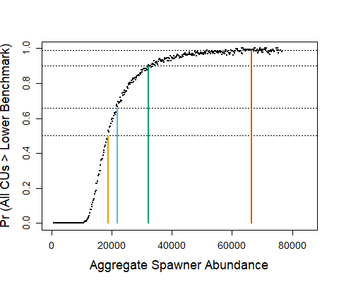

# LRP METHODS FOR PACIFIC SALMON {#est-methods}


<!--CH:  ask Julie and Danny Ings for advice on making these principles and LRPs as consistent as possible with NHQ guidance. If helpful, we could mention in the text that the 6 principles we adapted from an NHQ are a subset of 6 principles designed for the implementation of LRPs. The additional 2 principles focuse on changing LRP methods and communication, which are addressed within principle 2 (science is not static) and 4 (clarity in communication is required to be operational).  -->

Here we outline principles for developing LRPs for Pacific salmon, adapted from those developed for national-level guidance on LRPs (Marentette et al. in prep). That guidance allows for flexibility in the development of LRPs to respect differences in species contexts and data types, quantities, and qualities, and is not meant to be prescriptive. By following similar principles, Pacific salmon LRPs will be aligned with national direction while accounting for unique characteristics of salmon species and data. 

**Principle 1**. LRPs should be consistent with the goal of avoiding serious harm to the stock, as described in @dfoFisheryDecisionMakingFramework2009, and Section \@ref(intro). The LRP should be set above where serious harm is occurring, and should avoid long-term losses, such as those associated with fishing and ecosystem components. 

**Principle 2**. LRPs should be selected based on the best available information for the stock. Criteria for evaluating best scientific information developed for US National Standards may be applicable here for identifying best available information for LRPs [@USCodeFederal2021]. These criteria are: relevance, inclusiveness, objectivity, transparency and openness, timeliness, verification and validation, and peer review [@USCodeFederal2021].  In addition, scientific information should include an evaluation of uncertainties and identify gaps in our understanding or information. When uncertainty arises from multiple LRPs or from various assumptions within a single LRP, these should be acknowledged and considered when providing LRP recommendations. Where the weight-of-evidence supports a set of assumptions or hypotheses associated with one LRP, then this LRP can be recommended. Where evidence is inconclusive, this uncertainty should be integrated into stock assessment and clearly communicated.

Within this principle, it is recognized that science is not static and new findings continually advance our understanding of best available information. In particular, peer-review is necessary to ensure that the quality and credibility of data and methods for LRP development meet the standards of the scientific community. When determining whether to conduct a peer review, the level of novelty and complexity, and any previous reviews should be considered. Although routine updates may not need formal peer review, new LRPS or the application of benchmarks and LRPs to new CUs and SMUs assessments may require peer review.  

Similarly, best practices, or practices that have been demonstrated to work well can be used to inform reference points, as defined by @sainsburyBestPracticeReference2008. "The ‘best practice’ concept is based on the best practice that has been demonstrated through use, and recognizes that views of what is ‘best’ will continuously improve with experience. Best practice is not an absolute or fixed entity, or a guarantee of adequacy. It is based on experience to date and it is expected to evolve over time." [@sainsburyBestPracticeReference2008]


**Principle 3**. LRPs should be operational. They should be feasible to calculate based on data that are available and relevant to the policy context and management of the stock. Data availability varies widely among CUs and SMUs, requiring a variety of approaches for CU and SMU-level assessments. No one method will be operational across all cases. To be operational, LRPs should also be easy to communicate to managers and stakeholders in a way that can be understood and used to inform decisions.

**Principle 4**. LRPs should be reliably estimated. In other words, to the extend possible LRPs should capture underlying true levels of serious harm instead of noise or observation errors. Reliable estimation will depend on the quality and frequency of data collection and the evidence to support underlying relationships and population dynamics used to derive LRPs. Where there is coherence in LRP estimates among analytical methods, this brings additional reliability to the LRP recommendation.

<!--RE: pgh below
CW: 'statistically integrated' or sequential Bayes? i.e. sampling from posterior. 
CH: I think the point of Staton et al. 2017 is that for salmon, statistical integration wasn't always essential and the standard sequential approach may be sufficient in many cases (though underestimating uncertainty). I don't think they necessarily recommended Bayes over frequentest. For the watershed-area model, I used TMB, but draw random draws from 95%CI of SREP to get uncertainties in benchmarks. We used TMB to minimize estimation time as we thought we would be running simulation evaluations.  So, I'd prefer not to include recommendation on Bayes vs Freq analyses. However, instead of recommending integrated analyses always,  we could recommend that it be considered--> 

Where possible, a statistically integrated approach for estimating LRPs should be considered in order to propagate uncertainties throughout analyses and to be consistent with current best practices in fisheries stock assessments [@puntEssentialFeaturesNextgeneration2020a]. @statonSequentialIntegratedBayesian2017a and @defilippoImprovingShorttermRecruitment2021 provide recent examples of integrated models used for salmon assessments. Both studies show that uncertainty propagation increases realism of model estimates and associated uncertainty. However, @statonSequentialIntegratedBayesian2017a demonstrated that similar point estimates of current status can be achieved by using sequential estimation approaches and the benefits of statistically integrated approaches may not be large enough to warrant an integrated analysis in all cases. 


<!--CH suggestion: I've added another 2 principles from NHQ's list. Let me know what you think.-->

**Principle 5**. When selecting among multiple methods for determining LRPs, the choice should take into account risk. Candidate methods for LRPs vary in how and the extent to which they account for uncertainty in underlying data, population dynamics (parameters and model structure), and derivation of CU-level statuses. These uncertainties create risks of LRPs providing a misleading threshold of serious harm. All else being equal, methods that do not rely on highly uncertain data or assumptions or that explicitly account for those uncertainties should be preferred. <!--CH: This principle supports use of ppn-based LRPs over aggregate-abundance based LRPs (b/c of uncertain assumptions in LR), with some justification for considering aggregate-abundance based LRPs that are statistically integrated so account of uncertainty in CU benchmarks. I have added to chapter on guidelines  -->


**Principle 6**. Consider the use of alternative paradigms for developing LRPs. LRP estimates that converge when derived using different approaches, increases support that the methods capture underlying population dynamics despite differing assumptions and use of available data.


**Principle 7**.  In addition to principles derived for marine fish species in general (Principles 1-6), for Pacific salmon, LRPs should be consistent with the goals and objectives of the WSP. The WSP framework for defining biological units and assessing their status along biological metrics with lower benchmarks to avoid risks of extinction is consistent with avoiding serious harm to the CU. Above the lower benchmarks (above red status), irreversible or slowly reversible impacts are avoided.  Ignoring CU-level status can result in serial depletion (or loss) of weak component CUs within an SMU, resulting in a possibly misleading indication of serious harm and status. Therefore, to be consistent with the WSP, LRPs should consider status of component CUs.

For marine fish species LRPs are typically estimated as a minimum level of spawning biomass that should not be breached (Kronlund et al. 2018), LRPs that consider the distribution of abundances among component CUs and alternative metrics of status within CUs such as trends in abundances and distribution of spawning are considered here to be consistent with previous status assessments under the WSP. Furthermore, DFO's Precautionary Approach Framework identifies additional metrics such as catch rate indices, size and age profiles, and sex ratios that "can and should be considered for use in defining serious harm and guiding decision-making in relation to stock condition” [@dfoFisheryDecisionMakingFramework2009]. Our goal is to provide overall guidelines on LRP development while providing flexibility in application of these methods due to differences in local biological characteristics, data qualities and data quantities, among other factors. We demonstrate the extent to which the candidate LRP methods are aligned with Principles 1-4 from Marentette et al. (in prep.), and Principle 7 for Pacific salmon. We further develop guidelines for implementing these methods (Section \@ref(guidelines)) aligned with Principles 5-6 from Marentette et al. (in prep.).  Alternative LRP methods aligned with the key principles above may be developed in the future to capture a broader range of data availability, quality, and types, and/or dimensions of biological status.


<!-- Julie Marentette: There’s actually a list of 8 draft criteria/principles (supported by a number of sub-principles) we are working with right now for WP1; we only carried the first 4 into this workshop and exercises for a few reasons (because 8 is a lot, and the latter 4 are rather more to do with best practices for actions as opposed to outright characteristics or descriptors of the LRPs and indicators).

Principle 1: Stock status indicators and LRPs should be consistent with an objective to avoid serious harm to the stock.
Principle 2: Stock status indicators and LRPs should be selected based on the best available information for the stock. The US link for best available information was this one: see pt. 6 https://www.ecfr.gov/current/title-50/chapter-VI/part-600/subpart-D/section-600.315
Principle 3: Stock status, indicators and LRPs should be operational (feasible and relevant to the management of the stock).
-CH  note: tractable to calculate, easy to communicate
Principle 4: Stock status indicators and LRPs should be reliably estimable.
-CH notes: data quality and frequency of collection; is SR sound basis for LRP; weight of evidence among different options, coherence in methods; looking for ways to account for uncertainty
Principle 5: When selecting from multiple alternatives, the choice of stock status indicators and LRPs should take into account risk.
Principle 6: If all else fails, consider the use of alternative paradigms.
Principle 7: Consider whether reference points or indicators should be changed.
Principle 8: Clearly communicate advice on stock status and reference points.
-->


Our intention is to describe approaches for deriving CU status applicable over a range of data qualities and types, and provide LRPs that integrate the CU-level information to the scale of SMUs.  Below methods for estimating CU status are described, as implemented in previous status assessments under the WSP. Then candidate LRPs that integrate CU statuses are briefly described falling into two categories: those based on the proportion of component CUs above the red zone and those based on aggregate abundances.  A more detailed description of LRPs with technical details is included Working Paper 2. Guidelines on how to choose among LRPs is described in Section \@ref(guidelines). 


## Estimation of CU Status {#cu-est-methods}


To be consistent with the multidimensional approach to WSP status assessments described in @holtIndicatorsStatusBenchmarks2009a, we recommend that CU-level status consider multiple metrics, either integrated through expert-driven processes or the through the Rapid Multidimensional Scanning Tool (Pestal et al. in prep.), where possible.  This approach allows for the assessment of status across a wide range of data availability; when data for a single metric is not available other metrics can be used to inform status. Although the Rapid Multidimensional Scanning Tool can provide provisional assessments under data limitations, uncertainties resulting from data limitations are not currently integrated into the provision of recommended status. Ongoing improvements to the tool will consider those uncertainties.  


One metric within the multidimensional approach is spawner abundances relative to <!--CH: "estimated" to distinguish for SoS's absolute or non-estimated benchmarks--> abundance-based benchmarks. Various types of benchmarks have been identified along this metric to account for differences in data types, quantities and qualities among CUs. For data-rich CUs where spawner-recruitment relationships can be reliably estimated, the abundance resulting in recovery to $S_{MSY}$ in one salmon generation under equilibrium conditions, $S_{gen}$ is recommended by @holtEvaluationBenchmarksConservation2009. Where recruitment time-series are not available and productivity is assumed to be moderate or high and harvest rates moderate or low, specified percentiles of observed spawner time-series, (e.g., 25th) can be used as a proxy for spawner-recruitment benchmarks [@holtEvaluatingBenchmarksBiological2018]. For Chinook and Coho Salmon where production is often limited by the quantity of freshwater habitat, equilibrium spawner abundances can be predicted from habitat characteristics to inform abundance-based benchmarks [@nobleHabitatbasedEscapementBenchmarks2015; @parkenHabitatbasedMethodsEstimate2006]. For example, @parkenHabitatbasedMethodsEstimate2006 use the relationship between watershed area and spawner-recruitment based reference points in a meta-analysis of Chinook Salmon stocks across the Pacific region to predict reference points for Chinook stocks without recruitment data.

In addition, metrics on the distribution of spawning within a CU can be considered in WSP assessments [@peacockReviewMetricsDistribution2010a; peacockMetricsSamplingDesigns2012]. Although benchmarks along metrics of distribution have not been identified for WSP assessment, for Interior Fraser River Coho Salmon, short and long-term recovery targets along a metric of spawning distribution among sub-populations was identified [@ifcrtinteriorfrasercohorecoveryteamConservationStrategyCoho2006], and forms a basis for management of this SMU.

The metrics and benchmarks described above are a subset of those considered within Rapid Multidimensional Scanning Tool (which also include short and long-term trends over time, and abundances relative to absolute conservation threshold). For the purposes of LRP development, individual metrics on spawner abundances are applied both within the Rapid Multidimensional Scanning Tool and independently of the Tool to demonstrate the consistency (and occasional inconsistency) with status on multidimensional vs single-metric approaches. When only a single metric is applied to derive status, there is a risk of providing a misleading assessment if overall status is informed from additional metrics which diverge from abundance-based metrics but are not considered.

When assessing CU status relative to abundance-based lower benchmarks, we use generational mean spawner abundances as a basis for determining whether each CU is above or below its lower benchmark. Generational smoothing integrates status over cohorts within a generation, which are tend to exhibit relatively independent dynamics. This approach reduces noise in annual CU status determination due to annual fluctuations in CU abundances from any single cohort. It also makes our determination of CU status consistent with the approach taken for abundance-based benchmarks in WSP assessments and the Rapid Multidimensional Scanning Tool.

## Estimation of LRPs: Aggregating CU benchmarks and status to the SMU-level

<!--CH suggest removing:
### Report status relative to benchmarks for individual CUs
- i.e., no roll-up
- A benefit to no roll up is that it focuses attention directly on CUs with low status.  However, emerging policy (from NHQ) suggests that each stock should have a single established LPR (one stock = 1 LRP).
-->
### Proportion-based LRPs

Proportion-based LRPs are calculated from the proportion of CUs within an SMU that are assessed as being above the red WSP status zone. To be consistent with the intent of the WSP of preserving biodiversity at the CU-level, we identify an LRP at 100% of CUs having status estimates above red (i.e., either amber or green). When any individual CU falls into the red zone, then the LRP is considered breached. See section \@ref(guidelines) for a step-wise approach for identifying LRPs that further considers data limitations when identifying the proportion of CUs above the red zone. CU statuses are derived using the approaches described in Section \@ref(cu-est-methods), and are submitted to peer review, as described in Section \@ref(guidelines).

Proportion-based LRPs are aligned with Principle 1 to the extent that serious harm is indicated by status of any one CU being in the red zone under the WSP. These LRPs are also based on the best available information by incorporating multiple dimensions of status through formal, peer reviewed WSP status assessments or the Rapid Multidimensional Scanning Tool with peer review. By using status derived from the annual implementation of the Rapid Multidimensional Scanning Tool, relevant and timely information is used to inform status is up to date, in a way that is transparent and open. Proportion-based LRPs are operational (Principle 3) as they are simple to calculate and communicate as a proportion of CU statuses. However, they are not easily incorporated into harvest based management, e.g., harvest control rules at the aggregate level. Reliability of estimation (Principle 4) depends in part on the underlying data and is CU- and SMU-dependent. Uncertainties are not currently propagated from CU level benchmarks to CU statuses, LRPs and SMU statuses.  Proportion-based LRPs are well aligned with Principle 7, being derived directly from WSP metrics of status for CUs.

A further advantage of this method is that is easily scalable to other spatial scales under which Pacific salmon is managed. For example, CUs can be assessed individually when threats and responses are local in nature and can be aggregated at larger scales and across species when threats and responses are cross-cutting (e.g., as seen for Big Bar landslide of 2019). 

### Logistic regression-based LRPs{#logisticMethods}

We considered two LRPs based on aggregate-abundances of the SMU that rely on the relationship between observed aggregate abundances and statuses of component CUs, logistic regression-based LRPs and projection-based LRPs (\@ref(projectedMethods)). The reliability of aggregate-abundance based LRPs and their ability to avoid serious harm at the CU level depends on the strength of that underlying relationship as exhibited in observed data. These two LRPs are probabilistic in nature, identifying the aggregate abundances associated with a desired probability of all CUs achieving status above the red zone. To some extent uncertainty in the underlying relationship between observed aggregate abundances and CU-level statuses is captured in the probabilistic nature of these LRPs; larger uncertainties results in higher LRP values and vice versa, with all else remaining equal. <!--CH comment. This last sentence might be too much information at the beginning of the section? though the 2nd sentence of this pgh could misleading without this caveat. Could consider moving...?--> 


Logistic regression-based LRPs are derived from an empirically estimated relationship between CU-level statuses and aggregate SMU abundance. This method for deriving LRPs extends proportion-based LRPs by identifying the aggregate abundance level that has historically been associated with a given probability of 100% of CUs having status above the red zone, as approximated from status on a single metric of spawner abundances relative to a lower benchmark. For each year of observed data, CU-level status is quantified as a Bernoulli variable: 1 (success) = all CUs have estimated status greater than the lower benchmark and 0 (failure) = all CUs did not have status greater than the lower benchmark, or a least one CU was assessed below the lower benchmark. A logistic regression is then fit to these outcomes to estimate the probability that all CUs will have statuses greater than red as a function of aggregate SMU spawner abundances. The following logistic regression equation is used to estimate LRPs,

\begin{equation}
  \log(\frac{p}{1-p}) = B_0 + B_1 \sum_{i}^{i=nCUs} S_{i,t}
   (\#eq:logistic)
\end{equation}

where, $p$ is probability, $B_0$ and $B_1$ are estimated logistic regression parameters and $S_{i,t}$ is spawner abundance to CU $i$ in year $t$. Equation \@ref(eq:logistic) is then re-arranged to calculate the LRP as the aggregate spawner abundance associated with the pre-specified probability threshold of $p^*$,

\begin{equation}
  LRP = \frac{log(\frac{p^*}{1-p^*}) - B_0}{B_1}
  (\#eq:logisticLRP)
\end{equation}

An example logistic regression fit is shown in Figure \@ref(fig:example-logisticFit), with LRPs associated with four probability thresholds, 0.5, 0.66, 0.90, 0.99, representing levels associated with being more likely than not, likely, very likely, and virtually certain as defined by the International Panel on Climate Change, IPCC [@mastrandreaGuidanceNoteLead2010]. We do not recommend a specific probability level here, and instead demonstrate the implication of various choices. Although LRPs are intended to be identified by Science to represent the best scientific estimate of level below which serious harm is occurring [@dfoScienceAdvicePrecautionary2021] without necessarily introducing additional precaution under uncertainty <!--ref?-->, there is no scientific basis to choose one probability over others. Uncertainty in logistic-regression based LRP estimates can be quantified based on a 95% confidence interval on the maximum likelihood estimate, MLE (see our application to Interior Fraser Coho Salmon (Holt et al. in review).  


```{r example-logisticFit, fig.cap="Logistic regression fit to annual Bernoulli data to predict the probability of all CUs being above their lower benchmark (LBM) as a function of aggregate SMU abundance. Each black dot represent a year in the observed time series as a Bernoulli indicator showing whether the requirement of all CUs above their lower benchmark, LBM was met (success = 1) or not (failure = 0) as a function of aggregate spawning abundance to the SMU. The black solid line is the maximum likelihood model fit to indicator data, and the grey shaded region shows the 95\\% confidence interval around the fit model. Coloured lines illustrate aggregate abundance LRPs for 4 different probability thresholds: p* = 0.5 (yellow), 0.66 (blue), 0.90 (green), and 0.99 (orange) probability that all CUs > LBM. Horizontal dotted lines intersect the y-axis at each probability threshold, while the solid vertical lines show the corresponding aggregate escapement that will represent the LRP.", out.width = '60%', warning=FALSE, echo=FALSE, fig.align="center"}
knitr::include_graphics("figure/methods-Example-LogisticLRP.png")
```

We recommend evaluating the fit of the logistic regression prior to the development of LRPs to identify its reliability in determining serious harm to component CUs. Diagnostics commonly used for logistic regression of Bernoulli distributed data are provided in Holt et al. (in review), for example, evaluating the assumptions that the aggregate abundances is linearly related to log-odds of all CUs being above their lower benchmarks, observations are independent, and there are no influential outliers. In addition, the statistical significance of the predictor variable, aggregate abundances and the goodness-of-fit of the logistic model can inform its reliability for determining LRPs. Furthermore, the classification accuracy of LRPs developed from a logistic regression can be evaluated on the observed data using the performance metric, hit ratio. This ratio represents the proportion of successful classifications above or below the logistic regression-derived LRP, relative to the total number classifications or years.  Out-of-sample cross-validation methods can be applied so that model-based LRPs do not include the observed data used for evaluation in this performance metric.


We applied a single metric on spawner abundances to approximate CU-status because multidimensional approaches for WSP assessments include  generational smoothing of spawner abundance and metrics of temporal trends, which introduces autocorrelation in observed CU statuses, violating an assumption of the logistic regression model. Future research could consider logistic regression-based models that include autocorrelated residuals to develop LRPs based on CU-statuses provided from the Rapid Multidimensional Scanning Tool.

Using a single-metric proxy for CU status also allowed us to use a statistically integrated estimation approach, where CU-level stock-recruitment models and associated CU-level benchmarks were estimated in the same model as the logistic regression and LRP derivation. In this way, the uncertainty from CU-level assessments can be propagated to the development of the LRP and the assessment against that LRP. The model provides the probability of being below the LRP in the current year that explicitly accounts for uncertainty in CU-level assessments against their lower benchmarks.  


Furthermore, structural uncertainty in underlying assumptions about the basis of CU-level benchmarks, such as spawner-recruitment relationship can be addressed in at least three ways. First, the weight of evidence for various assumptions can be identified to identify the assumptions with the most support for underlying CU dynamics and CU status, which is then used for LRP development. Second, various assumptions can be provided as sensitivity analyses demonstrating the impact of assumptions about CU dynamics on LRPs estimates and current status, if possible with a narrative describing which is considered a base case. Third, LRPs can be averaged by, for example, combining posterior probability estimates. When averaging, LRPs can be weighted according to the strength of evidence for each hypothesis based on statistical criteria (e.g., AIC), retrospective performance, or expert opinion [@rossiInferringFisheriesStock2019; @jardimOperationalizingEnsembleModels2021].

Logistic regression-based LRPs are aligned with Principle 1 to the extent that serious harm is indicated by status of any one CU being in the red zone under the WSP and that the estimated relationship between aggregate abundances and probability of all CUs being above their lower benchmark holds. Logistic regression-based LRPs use only one metric of spawner abundances, and therefore do not use the best available information (Principle 2) when CUs statuses rely on other metrics, such as trends in data-limited contexts. Also, logistic regression-LRPs approximate CU status by comparing annual spawner abundances to benchmarks instead of generationally smoothed spawner abundances and so may capture noise in abundance trends instead of true status that is likely autocorrelated over time (see Holt et al. (in review) for more details). In some cases, status based on the single metric on spawner abundances may diverge with that based on multidimensional approaches, e.g., the Rapid Multidimensional Scanning Tool.

Logistic regression-based LRPs are operational (Principle 3) to some extent when harvest management occurs at the aggregate level and require aggregate-abundance based LRP to inform management decisions. However, they are more difficult to communicate being derived from model outputs, and they require the choice of probability of all CUs being above their lower benchmarks which is difficult to justify. <!--CH removed since it's mostly repeated in the next pgh: "Logistic-regression based LRPs may not be appropriate operationally if new management procedures are applied that result in changes in covariance among CUs. For fisheries without a history of weak-stock management the assumption of stationarity in covariance in exploitation may hold, as in Interior Fraser River Coho, supporting their application of logistic regression approaches to identify recovery targets."-->


Reliability of estimation (Principle 4) depends on the reliability of underlying data and the fit of logistic regression as described by model diagnostics. For this method, uncertainties can be propagated from CU-level benchmarks and status to LRPs.  One assumption of this method is that the relationship between aggregate abundances and CU-level status observed historically represents the current relationship. If the covariance among CUs or relative productivities and capacities of CUs is non-stationary, logistic regression-based LRPs may be unreliable. Furthermore, LRPs may be unreliable if harvest strategies change over time such that relative exploitation of CUs changes (e.g., due to change towards weak stock management).  Logistic regression-based LRPs are aligned with Principle 7 to the extent that aggregate abundances are a reliable predictor of CU level statuses, with the caveat that CU status on a single metric may deviate from multidimensional approach recommended under the WSP.

<!--CH: moved to uncertainties section in last chapter "Also, it is not possible to assess sensitivity of LRPs to  structural assumptions about covariance in population dynamics among CU and the relationship between aggregate abundances and CU statuses, as the LRP depends only on the logistic fit to observed data." -->

### Projection-based LRPs {#projectedMethods}

Similar to logistic regression-based LRPs, projection-based LRPs rely on an underlying relationship between aggregate abundances and status of component CUs. However, unlike for logistic regression-based LRPs, for projection-based LRPs the aggregate abundances where there is a high probability of all CUs being above their lower benchmark is identified from forward projections instead of historical data.  

The projection-based LRP approach uses population parameters of individual CUs within an SMU to project abundances forward with natural variability in recruitment and ages-at-maturity under current exploitation rates characterized with annual implementation uncertainty. Projections are run for 30 years after an initialization period to remove the impacts of initial conditions and identify aggregate abundances characterized by an equilibrium state represented by stable distribution of projected abundances. Projection-based LRPs are then estimated using these projected CU abundances to characterize the relationship between aggregate SMU-level spawner abundance and the probability that all CUs will be above their lower benchmarks (e.g. $S_{gen}$). We developed projection-based LRPs for SMUs that are managed under constant exploitation rates, though more complicated management procedures that also include an observation component could also be included in future iterations <!--CH: is this true???-->. As for logistic regression-based LRPs, we relied on status estimated from a single metric rather than the Rapid Multidimensional Scanner Tool because the projections are meant to capture equilibrium conditions and are not appropriate for identifying status on temporal trends which are included as metrics in the Tool.

One advantage of the approach for projection-based LRPs is that it allows for explicit consideration of uncertainty in underlying assumptions about model parameters and the covariance among CUs by including those uncertainties as random components of the projections. Furthermore, unlike logistic regression-based LRPs, this method is not limited by historical data on CU status. To implement projection-based LRPs, we adapted a previously developed R package for performing closed-loop simulation modelling, samSim [@holtQuantitativeToolEvaluating2020; @freshwaterBenefitsLimitationsIncreasing2020], as described in the Appendix to Holt et al. (in review) and provided online (see Appendix \@ref(app:first-appendix)).  

After providing parameter distributions describing the CU-level population dynamics and exploitation to samSim, the projections included 4 main steps:

1. Project spawner abundances forward for 30 years after an initialization period and over $nTrial$ stochastic simulations, where nTrials was choosen to stabilize results.
   
2. For each simulated year-trial combination after initialization, characterize abundances as follows:

      * Assign aggregate SMU level spawner abundance for each year-trial combination to an abundance bin based on intervals of 200 fish, e.g., 0:200, 201:400, 401:600, etc.

      * Determine whether all CUs for each year-trial combination were above their CU-level lower benchmarks on abundances, or not.
      
3. For each aggregate abundance bin, calculate the proportion for year-trial combinations where all CUs were above their lower benchmark relative to all year-trial combinations falling in that bin. These proportions are then ploted against the aggregated abundances for year bin (taken as the mid-point of the bin).
      
4. Identify the LRP as the mid-point of the aggregate abundance bin with a proportion of CUs above their lower benchmark that is closest to the desired probability threshold (e.g., 0.5, 0.66, 0.9, or 0.99).

An example of candidate projection-based LRPs derived from the aggregate abundance of each bin plotted against the proportion of year-trial combinations where all CUs were above their lower benchmark is shown in Figure \@ref(fig:example-projectedCurve). The choice of 200 fish bin was a trade-off between increasing smoothness of the curve with bins covering smaller range in aggregate abundances and computational limitations of small bins requiring a very large numbers of stochastic simulations to allow for a sufficient number of year-trial combinations within each bin to stabilize results. Also, for our case studies, 200 fish was within the range of uncertainty in observed spawner abundances. <!--Kendra: does this make sense?-->


```{r example-projectedCurve, fig.cap="Example of projected probability curve derived from projections over 30 years and 10,000 MC trials.  The curve shows the projected proportions of year-trial combinaions where all CUs were above their lower benchmark as a function of aggregate SMU abundance, where aggregate abundances are shown in bins of 200 fish. Each dot in the curve represents a single combination of year and simulation trial. Coloured lines represent candidate LRPs calculated for 4 different probability thresholds, 0.5 (yellow), 0.66 (blue), 0.90 (green), and 0.99 (orange). Horizontal dotted lines intersect the y-axis at each probability threshold, while the solid vertical lines show the corresponding aggregate escapement that will represent the LRP.", out.width = '60%', warning=FALSE, echo=FALSE, fig.align="center"}

```


Similar to logistic regression-based LRPs, for projection-based LRPs the uncertainty in CU benchmarks and status are explicitly accounted for when deriving the probability of all CUs being above their lower benchmarks, but unlike logistic regression-based LRPs, there is no estimation uncertainty in projection-based LRPs because a logistic regression (or other model) is not required. Probabilities are derived directly from projections and underlying uncertainties are integrated directly into the overall probably. Therefore 95% CIs are not provided. 

Also, similar to logistic regression based LRPs, structural uncertainty in underlying population dynamics can be considered through sensitivity analyses or model averaging by combining results form stochastic random trials across those structural assumptions. See our implementation for Interior Fraser Coho Salmon in Holt et al. (in review) for more details.

Similar to logistic regression-based LRPs, projection-based LRPs are aligned with Principle 1 to the extent that serious harm is indicated by status of any one CU being in the red zone under the WSP and that the emergent (projected) relationship between aggregate abundances and probability of all CUs being above their lower benchmark holds. Also, similar to logistic regression-based LRPs, projection-based LRPs use only one metric of annual estimates of spawner abundances, and therefore do not use the best available information (Principle 2) when CUs statuses rely on other metrics, such as trends in data-limited contexts.

Similar to logistic regression-based LRPs, projection-based LRPs are operational (Principle 3) to some extent when harvest management occurs at the aggregate level and require aggregate-abundance based LRP to inform management decisions. However, like logistic regression-based LRPs they are more difficult to communicate being derived from projections under assumptions of equilibrium, and they require the choice of probability of all CUs being above their lower benchmarks which is difficult to justify. <!--CH moved to CH6 of case study paper to simplify text here, and b/c showing the sensitivity to ER actually makes this methods more useful/operational, not less, at least according to Wilf. "Furthermore, projection-based LRPs are sensitive to exploitation rates, being higher under high exploitation rates and vice versa. Therefore an projection-based LRP developed under current exploitation cannot be used as a basis for evaluating alternative management procedures. However demonstrating the changes in aggregate abundances required for all CUs to be above lower benchmarks (i.e. changes in projection-based LRP) under different exploitation scenarios may help analysts and managers understand the implications of changing exploitation rates on the ability to achieve WSP objectives."--> Reliability of estimation (Principle 4) depends on the underlying parameter distributions and model structure capturing the plausible range true underlying dynamics. Similar to logistic regression-based LRPs, for this method, uncertainties can be propagated from CU-level benchmarks and status to LRPs. But unlike logistic regression-based LRPs, this method can integrate plausible ranges of parameter and structural uncertainties that may differ from those observed historically. Reliability of LRP estimates depends on the reliability of underlying model parameters and structure.

Similar to logistic regression-based LRPs, Projection-based LRPs are aligned with Principle 7 to the extent that aggregate abundances are a reliable predictor of CU level statuses, with the caveat that CU status on a single metric may deviate from multidimensional approach recommended under the WSP.


<!-- OLD TEXT NOT NEEDED-->

<!-- CW: What exactly is this approach (below)? Just summing the lower benchmarks of all CUs? Or adding all the SR time series and estimating a single Sgen? Or something else? -->

<!--remove 
### Simple Aggregate Abundance LRPs
- There may be cases where SMU-level limit reference points may be based on analyses on the aggregate abundances, without defining finer spatial scales
= For example, for SMUs containing only one CU, LRP can be defined as the lower biological benchmark for the CU. 

- Although it may be possible to estimate LRPs based on aggregate data for SMUs that contains multiple CUs with very high covariance, in practice, natural variability in population dynamics among CUs within SMUs is generally high enough such that risks of CUS being depleted below lower benchmarks with this approach are not negligible (i.e., above acceptable levels). 
- This approach should only be considered in exceptional circumstances when there is evidence for high covariance in dynamics among CUs within and SMU and risks of individual CUs being depleted below lower benchmarks has been evaluated, e.g., through simulation evaluation. 

Evidence for covariation in CU-level dynamics can be derived from fisheries that are sampled for GSI, i.e., CU-proportions have not changed over time suggesting that smaller CUs are not being over harvested
- Also, available escapement data suggests CUs are stable,
- evidence of covariance in spawner time-series (or productivity time-series where available), >>0.5?


## Considerations When Selecting a LRP Estimation Method

- We propose a step-wise approach for identifying status relative to LRPs, which is based on the proportion of CUs status greater than red under the Wild Salmon Policy. 
- This LRP is recommended as the default for evaluating status under the Fish Stock Provisions of the Fisheries Act for Pacific Salmon, with additional aggregate-abundance based LRPs developed as required for local or international management and are supplemental.
- This stepwise approach is described in more detail in section \@ref(guidelines).
-->


