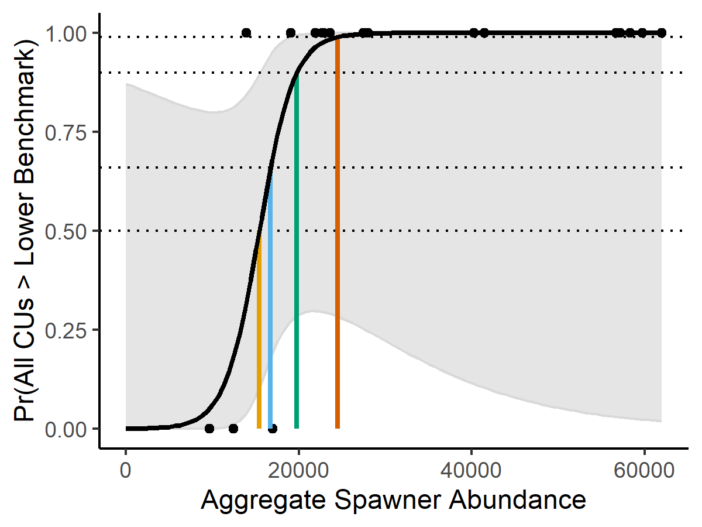

# LRP METHODS FOR PACIFIC SALMON {#est-methods}

## ESTIMATION OF CU STATUS {#cu-est-methods}


To be consistent with the multidimensional approach to WSP status assessments described in @holtIndicatorsStatusBenchmarks2009, we recommend that CU-level status consider multiple metrics, either integrated through formal status assessments or the through the Pacific Salmon Status Scanner (Pestal et al. in prep., Table \@ref(tab:SSmetrics)), where possible.  This approach allows for the assessment of status across a wide range of data availability. When data for a single metric are not available other metrics can be used to inform status. Although the Pacific Salmon Status Scanner can provide provisional assessments under data limitations, uncertainties resulting from data limitations are not currently integrated into the provision of recommended status. Ongoing improvements to the tool will consider those uncertainties.  

\renewcommand*{\arraystretch}{1.4}
\begin{table}[!htbp]
\centering
\footnotesize   
\caption{Metrics currently used in the Pacific Salmon Status Scanner}
\begin{tabular}{p{3.2cm} p{3.2cm} p{5.2cm} p{4.2cm}}
\multicolumn{2}{l}{}\\
\toprule
\multicolumn{2}{l}{Metrics on abundances} & Absolute spawner abundances relative to absolute abundance benchmark (e.g., 1500 spawner) \\

\multicolumn{2}{l}{} & Absolute or index of spawner abundances relative to estimated benchmarks (e.g., stock-recruitment based benchmark) \\
\midrule
\multicolumn{2}{l}{Metrics on trends} & Percent change over recent 3 generations relative to benchmarks \\
\multicolumn{2}{l}{} & Ratio of current generational geometric mean to geometric mean over the time-series relative to benchmarks \\

\bottomrule
\end{tabular}
(\#tab:SSmetrics)
\end{table}


One metric within the Pacific Salmon Status Scanner is spawner abundances relative to <!--CH: "estimated" to distinguish for SoS's absolute or non-estimated benchmarks?--> abundance-based benchmarks. Various types of benchmarks have been identified along this metric to account for differences in data types, quantities and qualities among CUs. For data-rich CUs where spawner-recruitment relationships can be reliably estimated, the abundance resulting in recovery to S~MSY~ in one salmon generation under equilibrium conditions, S~gen~ is recommended by @holtEvaluationBenchmarksConservation2009. Where recruitment time-series are not available and productivity is assumed to be moderate or high and harvest rates moderate or low, specified percentiles of observed spawner time-series, (e.g., 25^th^) can be used as a proxy for spawner-recruitment benchmarks [@holtEvaluatingBenchmarksBiological2018]. For Chinook and Coho Salmon where production is often limited by the quantity of freshwater habitat, equilibrium spawner abundances can be predicted from habitat characteristics to inform abundance-based benchmarks [@nobleHabitatbasedEscapementBenchmarks2015; @parkenHabitatbasedMethodsEstimate2006]. For example, @parkenHabitatbasedMethodsEstimate2006 use the relationship between watershed area and spawner-recruitment based reference points in a meta-analysis of Chinook Salmon stocks across the Pacific region to predict reference points for Chinook stocks without recruitment data.


In addition, metrics on the distribution of spawning within a CU can be considered in WSP assessments [@peacockReviewMetricsDistribution2010a; @peacockMetricsSamplingDesigns2012]. Benchmarks for spatial distribution have not been formally integrated into WSP assessments, but have been applied to salmon SMUs. For example, there are recovery targets for the distribution of spawners among sub-populations in the Interior Fraser River Coho Salmon SMU  [@ifcrtConservationStrategyCoho2006].


The metrics and benchmarks described above are a subset of those considered within Pacific Salmon Status Scanner (which also include short- and long-term trends over time, and abundances relative to absolute conservation threshold) <!--CW: Although the PSSS does not include the distributional metric LW: I would add that as a note, that it currently doesn't include the distribution metric, but could be adapted to for CUs where this is important. CH: I'll leave out for now, as it might be implied by the reworded pgh above, but can include later if need be-->. For the purposes of LRP development, individual metrics on spawner abundances are applied both within the Pacific Salmon Status Scanner and independently of the Salmon Scanner to demonstrate the consistency (and occasional inconsistency) with status on multidimensional vs single-metric approaches. When only a single metric is applied to derive status, there is a risk of providing a misleading assessment if other metrics that would have also been used in a multidimensional assessment diverge in status from the single abundance-based metric, but are not considered.

<!-- 
KH: I revised the last sentence of the above paragraph because I got hung up on the term 'overall status'. The original version was:
When only a single metric is applied to derive status, there is a risk of providing a misleading assessment if overall status is informed from additional metrics which diverge from abundance-based metrics but are not considered. -->

When assessing CU status relative to abundance-based lower benchmarks, we use generational mean spawner abundances as a basis for determining whether each CU is above or below its lower benchmark. Generational smoothing integrates status over cohorts within a generation, which can exhibit relatively independent dynamics <!--is there a good reference for this? CH: not sure, but can look for one later-->. This approach reduces noise in annual CU status determination due to annual fluctuations in CU abundances from any single cohort. It also makes our determination of CU status consistent with the approach taken for abundance-based benchmarks in WSP assessments and the Pacific Salmon Status Scanner.


## ESTIMATION OF LRPS: AGGREGATING CU BENCHMARKS AND STATUS TO SMUS

### Proportion-based LRPs

Proportion-based LRPs are calculated from the proportion of CUs within an SMU that are assessed as being above the red WSP status zone. To be consistent with the intent of the WSP of preserving biodiversity at the CU-level, we identify an LRP at 100% of CUs having status estimates above red (i.e., either amber or green). When any individual CU falls into the red zone, then the LRP is considered breached. See Section \@ref(guidelines) for a step-wise approach for identifying LRPs that further considers data limitations when identifying the proportion of CUs above the red zone, and Section \@ref(recommendations) for a description of associated uncertainties. CU statuses are derived using the approaches described in Section \@ref(cu-est-methods), and are submitted to peer review, as described in Section \@ref(guidelines). See.

<!--CH: revserse order of principles in each section to align with Julie's new numbering-->
Proportion-based LRPs are aligned with Principle 2 to the extent that serious harm is indicated by status of any one CU being in the red zone under the WSP, recognizing that risk of loss of stock structure can itself be a form of serious harm. These LRPs are also based on the best available information (Principle 1) by incorporating multiple dimensions of status through formal, peer reviewed WSP status assessments or the Pacific Salmon Status Scanner with peer review. By using status derived from the annual implementation of the Salmon Scanner, relevant and timely information is used to inform status in a way that is transparent and open. Proportion-based LRPs are operational (Principle 3) as they are simple to calculate and communicate as a proportion of CU statuses. However, they are not easily incorporated into harvest based management, e.g., harvest control rules at the aggregate level. Reliability of estimation (Principle 4) depends in part on the underlying data and is CU- and SMU-dependent. Uncertainties are not currently propagated from CU level benchmarks to CU statuses, LRPs and SMU statuses.  Proportion-based LRPs are well aligned with Principle 6, being derived directly from WSP metrics of status for CUs.

A further advantage of this method is that it is easily scalable to other spatial scales under which Pacific salmon are managed. For example, CUs can be assessed individually when threats and responses are local in nature and can be aggregated at larger scales and across species when threats and responses are cross-cutting (e.g., as seen for the Big Bar landslide of 2019). 


In addition to proportion-based LRPs, we considered two LRPs based on aggregate abundances of the SMU that rely on the relationship between observed aggregate abundances and statuses of component CUs: (1) logistic regression-based LRPs and (2) projection-based LRPs (Section \@ref(projectedMethods)), described in the following 2 Sections. The reliability of aggregate-abundance based LRPs and their ability to represent thresholds to serious harm at the CU level depends on the strength of that underlying relationship as exhibited in observed data. These two LRPs are probabilistic in nature, identifying the aggregate abundances associated with a desired probability of all CUs achieving status above the red zone. To some extent uncertainty in the underlying relationship between observed aggregate abundances and CU-level statuses is represented in the probabilistic nature of these LRPs; larger uncertainties results in higher LRP values and vice versa, with all else remaining equal. 

### Logistic regression-based LRPs {#logisticMethods}

Logistic regression-based LRPs are derived from an empirically estimated relationship between CU-level statuses and aggregate SMU abundance. This method for deriving LRPs extends proportion-based LRPs by identifying the aggregate abundance level that has historically been associated with a specified probability of all component CUs having status above the red zone, as approximated from status on a single metric of spawner abundances relative to a lower benchmark. For each year of observed data, CU-level status is quantified as a Bernoulli variable: 1 (success) = all CUs have estimated status greater than the lower benchmark and 0 (failure) = all CUs did not have status greater than the lower benchmark, or at least one CU was assessed below the lower benchmark. A logistic regression is then fit to these outcomes to estimate the probability that all CUs will have statuses greater than red as a function of aggregate SMU spawner abundances. The following logistic regression equation is used to estimate LRPs,

\begin{equation}
  \log(\frac{p}{1-p}) = B_0 + B_1 \sum_{i}^{i=nCUs} S_{i,t}
   (\#eq:logistic)
\end{equation}

where, $p$ is probability, $B_0$ and $B_1$ are estimated logistic regression parameters and $S_{i,t}$ is spawner abundance to CU $i$ in year $t$. Equation \@ref(eq:logistic) is then re-arranged to calculate the LRP as the aggregate spawner abundance associated with the pre-specified probability threshold of $p^*$,

\begin{equation}
  LRP = \frac{log(\frac{p^*}{1-p^*}) - B_0}{B_1}
  (\#eq:logisticLRP)
\end{equation}

An example logistic regression fit is shown in Figure \@ref(fig:example-logisticFit), with LRPs associated with four probability thresholds, 0.5, 0.66, 0.90, 0.99, representing levels associated with being more likely than not, likely, very likely, and virtually certain as defined by the International Panel on Climate Change, IPCC [@mastrandreaGuidanceNoteLead2010]. We recommend that positioning LRPs as thresholds with at least a 50% probability of all component CUs being above red status, but do not recommend a specific probability level above that, and instead demonstrate various choices. Although LRPs are intended to be identified by Science to represent the best scientific estimate of level below which serious harm occurs [@dfoScienceAdvicePrecautionary2021] without necessarily introducing additional precaution under uncertainty <!--ref? CH: I realize this would benefit from a reference, but all I have is Rob Kronlund pers. comm....-->, there is no scientific basis to choose one probability over others. 

<!-- 
Also, based on the IUCN probability categories in case studies paper section 2.3, wouldn't we at least recommend that a probability over 50% be chosen, since 50% is 'as likely as not'? Wouldn't the precautionary principle lead us to recommend at least something in the 'likely' category >66%? This would be informed by the precautionary approach, and http://publications.gc.ca/collections/Collection/CP22-70-2003E.pdf.  I find it hard to justify the statement that there is no scientific basis to choose one probability over the others, since we have other guidance to go on. Additionally, the idea that the LRP should be above the level where serious harm is occurring makes me think that something at least in the likely category, if not the 90% very likely category, be recommended.
CH: good points Luke. Also, rebuilding guidance (DFO 2021) suggests precaution should be built into the management system and not the trigger for rebuilding.  i.e., 10% probability of breaching the LRP is not a breach. They suggest 50% probability is appropriate, which makes me wary about choosing a higher %. However, as you suggested, I have revised the text to say we recommend at least a 50% probability. 
Another challenge when applying these choices to logistic regression-based LRPs is that high probabilities, the curve is quite flat, so the difference between an LRP at p=0.9 and 0.95 can be double or more in value for LRP-- so really hard to justify one value over the other. However at p=0.5, the curve is steep, so changing from p=0.4-0.6 doesn't really matter for the LRP.
-->
Uncertainty in logistic-regression based LRP estimates can be quantified based on confidence or credible intervals on the LRP estimate (see our application to Interior Fraser Coho Salmon (Holt et al. in review)).


```{r example-logisticFit, fig.cap="Logistic regression fit to annual Bernoulli data to predict the probability of all CUs being above their lower benchmark (LBM) as a function of aggregate SMU abundance. Each black dot represent a year in the observed time series as a Bernoulli indicator showing whether the requirement of all CUs above their lower benchmark, LBM was met (success = 1) or not (failure = 0) as a function of aggregate spawning abundance to the SMU. The black solid line is the maximum likelihood model fit to indicator data, and the grey shaded region shows the 95\\% confidence interval around the fit model. Coloured lines illustrate aggregate abundance LRPs for 4 different probability thresholds: p* = 0.5 (yellow), 0.66 (blue), 0.90 (green), and 0.99 (orange) probability that all CUs > LBM. Horizontal dotted lines intersect the y-axis at each probability threshold, while the solid vertical lines show the corresponding aggregate escapement that will represent the LRP.", out.width = '60%', warning=FALSE, echo=FALSE, fig.align="center"}

```


We recommend evaluating the fit of the logistic regression prior to the development of LRPs to identify its reliability in determining serious harm to component CUs (Principle 4). Diagnostics commonly used for logistic regression of Bernoulli distributed data are provided in Holt et al. (in review). For example, evaluating the assumptions that aggregate abundances are linearly related to log-odds of all CUs being above their lower benchmarks, observations are independent, and there are no influential outliers. In addition, the statistical significance of the predictor variable (aggregate abundance) and the goodness-of-fit of the logistic model can inform its reliability for determining LRPs. Furthermore, the classification accuracy of LRPs developed from a logistic regression can be evaluated on the observed data using a performance metric called the hit ratio. This ratio represents the proportion of successful classifications above or below the logistic regression-derived LRP, relative to the total number classifications or years.  Out-of-sample cross-validation methods can be applied so that model-based LRPs do not include the observed data used for evaluation in this performance metric.


We applied a single metric on spawner abundances to approximate CU-status when using the logistic regression approach because multidimensional approaches for WSP assessments include  generational smoothing of spawner abundance and metrics of temporal trends, which introduces autocorrelation in observed CU statuses, violating an assumption of the logistic regression model. Future research could consider logistic regression-based models that include autocorrelated residuals to develop LRPs based on CU-statuses provided from the Pacific Salmon Status Scanner.

Using a single-metric proxy for CU status also allowed the use of statistically integrated estimation approach, where CU-level stock-recruitment models and associated CU-level benchmarks were estimated in the same model as the logistic regression and LRP derivation. In this way, the uncertainty from CU-level assessments can be propagated to the development of the LRP and the assessment against that LRP. The fit logistic model allows the probability of being below the LRP in a given year to be predicted based on aggregate abundance, with the predicted probability explicitly accounting for uncertainty in CU-level assessments against their lower benchmarks.  

Furthermore, structural uncertainty in underlying assumptions made when developing CU-level benchmarks, such as the form of the spawner-recruitment relationship, can be addressed in at least three ways. First, the weight of evidence for various assumptions can be evaluated to identify the assumption with the most support, which is then used for LRP development. This can include relying on support for various model forms provided in previous stock assessments or from meta-analyses. Second, various assumptions can be provided as sensitivity analyses demonstrating the impact of assumptions about CU dynamics on LRPs estimates and current status. Third, LRPs can be averaged by, for example, combining posterior probability estimates. When averaging, LRPs can be weighted according to the inverse of the variances, the strength of evidence for each hypothesis based on statistical criteria (e.g., AIC), retrospective performance, or expert opinion [@rossiInferringFisheriesStock2019; @jardimOperationalizingEnsembleModels2021].

Logistic regression-based LRPs are partly aligned with Principle 1, the of use best available information, because they use only one metric of spawner abundances omitting metrics on trends which are useful in data-limited contexts. CUs that do not have abundance-based benchmarks are omitted from consideration of serous harm in this approach even when trends are available to estimate status. Also, logistic regression-LRPs approximate CU status by comparing annual spawner abundances to benchmarks instead of generationally smoothed spawner abundances and so may capture random noise in abundance trends instead of true status that is likely autocorrelated over time (see Holt et al. (in review) for more details). In some cases, status based on the single metric on spawner abundances may diverge with that based on multidimensional approaches, e.g., the Pacific Salmon Status Scanner. Logistic regression-based LRPs are aligned with Principle 2 to the extent that serious harm is indicated by status of any one CU being in the red zone under the WSP and that the estimated relationship between aggregate abundances and probability of all CUs being above their lower benchmark holds. 

Logistic regression-based LRPs are operational (Principle 3) to some extent when harvest management occurs at the aggregate level and requires aggregate abundance-based LRPs to inform management decisions. However, they are more difficult to communicate being derived from model outputs, and they require the choice of probability of all CUs being above their lower benchmarks which is difficult to justify from a science perspective. <!--CH removed since it's mostly repeated in the next pgh: "Logistic-regression based LRPs may not be appropriate operationally if new management procedures are applied that result in changes in covariance among CUs. For fisheries without a history of weak-stock management the assumption of stationarity in covariance in exploitation may hold, as in Interior Fraser River Coho, supporting their application of logistic regression approaches to identify recovery targets."-->


Reliability of estimation (Principle 4) depends on the reliability of underlying data and the fit of logistic regression as described by model diagnostics. For this method, uncertainties can be propagated from CU-level benchmarks and status to LRPs.  One assumption of this method is that the relationship between aggregate abundance and CU-level status observed historically represents the current (and future) relationship. If the covariance among CUs or relative productivities and capacities of CUs is non-stationary, logistic regression-based LRPs may be unreliable to represent current or future conditions. Furthermore, LRPs may be unreliable if harvest strategies change over time such that relative exploitation of CUs varies (e.g., due to change towards weak stock management or when exploitation varies with the abundance of other species).  Logistic regression-based LRPs are aligned with Principle 6 to the extent that aggregate abundances are an acceptably reliable predictor of CU level statuses, with the caveat that CU status on a single metric may deviate from the multidimensional approach recommended under the WSP.

<!--CH: moved to uncertainties section in last chapter "Also, it is not possible to assess sensitivity of LRPs to  structural assumptions about covariance in population dynamics among CU and the relationship between aggregate abundances and CU statuses, as the LRP depends only on the logistic fit to observed data." -->

**Projection-based LRPs** {#projectedMethods}

Similar to logistic regression-based LRPs, projection-based LRPs rely on an underlying relationship between aggregate abundances and status of component CUs to identify an LRP based on aggregate abundance. However, unlike logistic regression-based LRPs, for projection-based LRPs the aggregate abundances where there is a high probability of all CUs being above their lower benchmark is identified from forward projections instead of historical data.  

The projection-based LRP approach uses population parameters of individual CUs within an SMU to project abundances forward with natural variability in recruitment and ages-at-maturity under current exploitation rates characterized with annual implementation uncertainty. Projections are run over an initialization period to remove the impacts of initial conditions, and then over multiple generations to identify aggregate abundances characterized by an equilibrium state where the distribution of abundances are stable. Projection-based LRPs are then estimated using these projected CU abundances to characterize the relationship between aggregate SMU-level spawner abundance and the probability that all CUs exceed their lower benchmarks (e.g., S~gen~). We developed projection-based LRPs for SMUs that are managed under constant exploitation rates with implementation error, though more realistic management procedures that include escapement goals and exploitation limits, or a fixed series of exploitation rates that vary with abundances could be considered in future iterations.  <!-- CW: many salmon stocks are managed through input (effort) control rather than output control (e.g. TACs), so perhaps okay to model MP with a fixed ER model + implementation uncertainty, even though the fixed ER HCR is not actually part of the management objective-->As for logistic regression-based LRPs, status was estimated from a single metric rather than the Rapid Multidimensional Scanner Tool because the projections are meant to capture equilibrium conditions and are not appropriate for identifying status on temporal trends which are included as metrics in the Tool.

One advantage of the approach for projection-based LRPs over logistic regression-based LRPs is that it allows for explicit consideration of uncertainty in underlying assumptions about model parameters and the covariance among CUs by including those uncertainties as random components of the projections. Furthermore, unlike logistic regression-based LRPs, this method is not limited by historical data on CU status. To implement projection-based LRPs, we adapted a previously developed R package for performing closed-loop simulation modelling, samSim [@holtQuantitativeToolEvaluating2020; @freshwaterBenefitsLimitationsIncreasing2020], as described in the Appendix to Holt et al. (in review) and provided online (see Appendix \@ref(app:first-appendix)).  

After providing parameter distributions describing the CU-level population dynamics and exploitation to samSim, the projections included 4 main steps:

1. Project spawner abundances forward for 30 years after an initialization period and over $nTrial$ stochastic simulations, where $nTrials$ was chosen to stabilize results.
   
2. For each simulated year-trial combination after initialization, characterize abundances as follows:

      * Assign aggregate SMU level spawner abundance for each year-trial combination to an abundance bin based on intervals of 200 fish, e.g., 0:200, 201:400, 401:600, etc.

      * Determine whether all CUs for each year-trial combination were above their CU-level lower benchmarks on abundances, or not.
      
3. For each aggregate abundance bin, calculate the proportion for year-trial combinations where all CUs were above their lower benchmark relative to all year-trial combinations falling in that bin. These proportions are then plotted against the aggregated abundances for year bin (taken as the mid-point of the bin).
      
4. Identify the LRP as the mid-point of the aggregate abundance bin with a proportion of CUs above their lower benchmark that is closest to the desired probability threshold (e.g., 0.5, 0.66, 0.9, or 0.99).

An example of candidate projection-based LRPs derived from the aggregate abundance of each bin plotted against the proportion of year-trial combinations where all CUs were above their lower benchmark is shown in Figure \@ref(fig:example-projectedCurve). The choice of 200 fish bins was a trade-off between increasing smoothness of the curve with bins covering smaller range in aggregate abundances and computational limitations of small bins requiring a very large numbers of stochastic simulations to allow for a sufficient number of year-trial combinations within each bin to stabilize results. Also, for our case studies, 200 fish was within the range of uncertainty in observed spawner abundances. 


```{r example-projectedCurve, fig.cap="Example of projected probability curve derived from projections over 30 years and 10,000 MC trials.  The curve shows the projected proportions of year-trial combinaions where all CUs were above their lower benchmark as a function of aggregate SMU abundance, where aggregate abundances are shown in bins of 200 fish. Each dot in the curve represents a single combination of year and simulation trial. Coloured lines represent candidate LRPs calculated for 4 different probability thresholds, 0.5 (yellow), 0.66 (blue), 0.90 (green), and 0.99 (orange). Horizontal dotted lines intersect the y-axis at each probability threshold, while the solid vertical lines show the corresponding aggregate escapement that will represent the LRP.", out.width = '60%', warning=FALSE, echo=FALSE, fig.align="center"}
knitr::include_graphics("figure/methods-Example-ProjectedLRP.png")
```


Similar to logistic regression-based LRPs, for projection-based LRPs the uncertainty in CU benchmarks and status are explicitly accounted for when deriving the probability of all CUs being above their lower benchmarks. However, unlike logistic regression-based LRPs, there is no estimation uncertainty in projection-based LRPs because a logistic regression (or other model) is not required. Probabilities are derived directly from projections and underlying uncertainties are integrated directly into the overall probability. Therefore, confidence intervals are not provided. 

Also, similar to logistic regression based LRPs, structural uncertainty in underlying population dynamics can be considered through sensitivity analyses or model averaging by combining results from stochastic random trials across those structural assumptions. See our implementation for Interior Fraser Coho Salmon in Holt et al. (in review) for more details.

Similar to logistic regression-based LRPs, projection-based LRPs are aligned with Principle 2 to the extent that serious harm is indicated by status of any one CU being in the red zone under the WSP and that the emergent (projected) relationship between aggregate abundances and probability of all CUs being above their lower benchmark holds. Also, similar to logistic regression-based LRPs, projection-based LRPs use only one metric of annual estimates of spawner abundances, and therefore do not use the best available information (Principle 1) when CUs statuses rely on other metrics, such as trends in data-limited contexts.

Similar to logistic regression-based LRPs, projection-based LRPs are operational (Principle 3) to some extent when harvest management occurs at the aggregate level and require aggregate-abundance based LRP to inform management decisions. However, like logistic regression-based LRPs they are more difficult to communicate being derived from projections under assumptions of equilibrium, and they require the choice of probability of all CUs being above their lower benchmarks which is difficult to justify. <!--CH moved to CH6 of case study paper to simplify text here, and b/c showing the sensitivity to ER actually makes this methods more useful/operational, not less, at least according to Wilf. "Furthermore, projection-based LRPs are sensitive to exploitation rates, being higher under high exploitation rates and vice versa. Therefore an projection-based LRP developed under current exploitation cannot be used as a basis for evaluating alternative management procedures. However demonstrating the changes in aggregate abundances required for all CUs to be above lower benchmarks (i.e. changes in projection-based LRP) under different exploitation scenarios may help analysts and managers understand the implications of changing exploitation rates on the ability to achieve WSP objectives."--> Reliability of estimation (Principle 4) depends on the underlying parameter distributions and model structure capturing the plausible range of true underlying dynamics. Similar to logistic regression-based LRPs, for this method, uncertainties can be propagated from CU-level benchmarks and status to LRPs. But unlike logistic regression-based LRPs, this method can integrate plausible ranges of parameter and structural uncertainties that may differ from those observed historically. Reliability of LRP estimates depends on the reliability of underlying model parameters and structure.

Similar to logistic regression-based LRPs, projection-based LRPs are aligned with Principle 6 to the extent that aggregate abundances are a reliable predictor of CU level statuses, with the caveat that CU status on a single metric may deviate from multidimensional approach recommended under the WSP.


<!-- OLD TEXT NOT NEEDED-->

<!-- CW: What exactly is this approach (below)? Just summing the lower benchmarks of all CUs? Or adding all the SR time series and estimating a single Sgen? Or something else? -->

<!--remove 
### Simple Aggregate Abundance LRPs
- There may be cases where SMU-level limit reference points may be based on analyses on the aggregate abundances, without defining finer spatial scales
= For example, for SMUs containing only one CU, LRP can be defined as the lower biological benchmark for the CU. 

- Although it may be possible to estimate LRPs based on aggregate data for SMUs that contains multiple CUs with very high covariance, in practice, natural variability in population dynamics among CUs within SMUs is generally high enough such that risks of CUS being depleted below lower benchmarks with this approach are not negligible (i.e., above acceptable levels). 
- This approach should only be considered in exceptional circumstances when there is evidence for high covariance in dynamics among CUs within and SMU and risks of individual CUs being depleted below lower benchmarks has been evaluated, e.g., through simulation evaluation. 

Evidence for covariation in CU-level dynamics can be derived from fisheries that are sampled for GSI, i.e., CU-proportions have not changed over time suggesting that smaller CUs are not being over harvested
- Also, available escapement data suggests CUs are stable,
- evidence of covariance in spawner time-series (or productivity time-series where available), >>0.5?


## Considerations When Selecting a LRP Estimation Method

- We propose a step-wise approach for identifying status relative to LRPs, which is based on the proportion of CUs status greater than red under the Wild Salmon Policy. 
- This LRP is recommended as the default for evaluating status under the Fish Stock Provisions of the Fisheries Act for Pacific Salmon, with additional aggregate-abundance based LRPs developed as required for local or international management and are supplemental.
- This stepwise approach is described in more detail in section \@ref(guidelines).
-->


