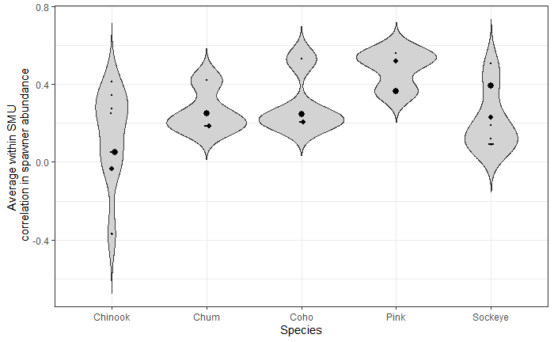

# APPENDIX 2{#app:second-appendix}

## Meta analysis of correlations in spawner abundances among CUs within SMUs


```{r lrp-smu-corr-plot, fig.cap="Distributiion of mean pairwise correlations between CUs for 40 SMUs of Pacific salmon arrange by species. Points are scaled to the number of CUs within a SMU with the largest point equal to 25 CUs. ", warning=FALSE, echo=FALSE, fig.align="center"}


```
Data are taken from the [Pacific Salmon Explorer](https://www.salmonexplorer.ca/), provided by E. Hertz (Pacific Salmon Foundation, July 2020). Links to Githup Repository containing code were developed by B. Connors <!--CH: if Brendan is a co-author this mention may be out of place, but thought I'd include anyways unless there are objections--> and are provided in Appendix \@ref(first-appendix).
