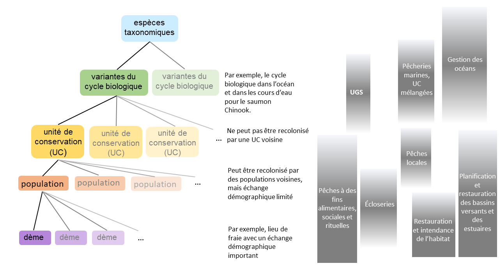

---
output:
  word_document: default
  html_document: default
---

# INTRODUCTION {#intro}

```{=html}
<!--Footnotes:
^[Holt *et. al.* Guidelines for Defining Limit Reference Points for Pacific Salmon Stock Management Units. CSAS Working Paper. In review]   

^[Holt *et al.* Case Study Applications of LRP Estimation Methods to Pacific Salmon Stock Management Units. CSAS Working Paper. In review]

^[Pestal, G., MacDonald, B, Grant, S, and Holt, C. Rapid Status Approximations from Integrated Expert Assessments Under Canada’s Wild Salmon Policy. Can. Tech. Rep. Fish. Aquat. Sci. In prep.]

^[Marentette, J.R., Barrett, T., Cogliati, K.M., Ings, D., Ladell, J., Thiess, M.  Operationalizing Serious Harm: Existing Guidance and Contemporary Canadian Practices. Can. Sci Avis. Secr. Working Paper In prep.]

^[COSEWIC. Designatable Units for Chinook Salmon *Oncorhynchus tshawytscha* in Canada
In Press]
-->
```
## CONTEXTE

```{=tex}
\begin{tcolorbox}[standard jigsaw,opacityback=0.8,colframe=black,boxrule=0.7pt,left=0.1in, sharp corners]

\subsection*{Key Points:}
\begin{itemize}
\item La \emph{Loi sur les pêches} révisée comprend de nouvelles dispositions sur les stocks de poissons qui introduit l’obligation légale de déterminer des points de référence limites (PRL) pour les principaux stocks de poissons prescrits par règlement.
\item Aux termes du cadre de l’approche de précaution du MPO, les PRL définissent l’état du stock en deçà duquel on s’attend à ce que le stock subisse des dommages graves.
\item L’un des objectifs de la Politique concernant le saumon sauvage (PSS) du Canada est de préserver de la diversité génétique du saumon sauvage du Pacifique par le maintien et la protection des unités de conservation (UC), qui font l’objet d’évaluations biologiques dans le cadre de la PSS.
\item La version révisée de la \emph{Loi sur les pêches} indique qu’un seul PRL est nécessaire pour chaque stock de poisson important, défini comme unités de gestion des stocks (UGS) pour le saumon du Pacifique, qui sont des groupes d’UC gérées comme une unité pour atteindre un état commun.
\item Cette disposition a créé le besoin d’élaborer des méthodes pour estimer des PRL aux fins de l’évaluation et de la gestion au niveau de l’UGS, tout en considérant la nécessité de maintenir les UC au sein d’une UGS au-dessus de leurs points de référence inférieurs dans le cadre de la PSS.
\end{itemize}
\end{tcolorbox}
```
Les modifications apportées à la *Loi sur les pêches* (2019) du Canada comprennent de nouvelles dispositions sur les stocks de poissons qui introduisent l’obligation légale de gérer les stocks de manière à en favoriser la durabilité et d’éviter les PRL biologiques [@dfoScienceAdvicePrecautionary2021]. Les dispositions exigent également des plans de rétablissement des stocks de poissons qui ont diminué jusqu’à un PRL ou en dessous de ce dernier, tout en tenant compte de la biologie du poisson et des conditions environnementales rencontrées par le stock. Ces obligations s’appliquent aux principaux stocks de poissons visés par règlement. Elles renforcent les politiques du MPO établies précédemment pour gérer les stocks conformément à l’approche de précaution. Il s’agit notamment du [Cadre décisionnel pour les pêches intégrant l’approche de précaution](https://www.dfo-mpo.gc.ca/reports-rapports/regs/sff-cpd/precaution-eng.htm) [@dfoFisheryDecisionmakingFramework2009], également connu sous le nom de Cadre de l’approche de précaution du MPO au sein du [Cadre pour la pêche durable](https://www.dfo-mpo.gc.ca/reports-rapports/regs/sff-cpd/overview-cadre-eng.htm) et de la [Politique concernant le saumon sauvage](https://www.pac.dfo-mpo.gc.ca/fm-gp/salmon-saumon/wsp-pss/policy-politique-eng.html) [@dfoCanadaPolicyConservation2005] du Canada.

Aux termes du Cadre de l’approche de précaution du MPO, les PRL représentent l’état du stock en deçà duquel on s’attend à ce que le stock subisse des dommages graves. Les définitions de « dommage grave » dans la documentation du MPO ont tendance à se concentrer sur la productivité réduite, mais d’autres aspects des dommages graves sont parfois pris en compte (voir l’encadré gris ci-dessous, adapté de Marentette et al. (en cours de révision)[^1]).

[^1]: Marentette, J.R., Barrett, T., Cogliati, K.M., Ings, D., Ladell, J., Thiess, M. Operationalizing Serious Harm: Existing Guidance and Contemporary Canadian Practices. Can. Sci Avis. Secr. Res. Doc. In revision

```{=tex}
\begin{tcolorbox}[standard jigsaw,opacityback=0.8,colframe=black,boxrule=0.7pt,left=0.1in, sharp corners]
\subsection{Interprétations de la notion de dommage grave}

Un dommage grave a été interprété comme tout changement des propriétés biologiques du stock qui fait que la croissance ou le rétablissement aux niveaux cibles cesse d’être considéré comme rapide et sécuritaire\textsuperscript{1}. Ces changements sont considérés comme difficiles à inverser\textsuperscript{2,3}, et peuvent être associés à ce qui suit: 

\begin{itemize}
\item   une baisse de la productivité\textsuperscript{1-6} résultant de changements dans les processus biologiques tels que le recrutement, la croissance, la maturation et la survie\textsuperscript{1,4}; 
\item   une perte de résilience\textsuperscript{5} (une capacité réduite à se rétablir ou à se remettre d’une perturbation)\textsuperscript{6});
\item   un risque accru d’anticompensation ou d’effets Allee\textsuperscript{4}; et/ou
\item   plus généralement, les états où la dynamique des populations cesse d’être bien comprise\textsuperscript{4}.

\end{itemize}

Lorsque le stock atteint ce niveau, il peut également y avoir des répercussions sur l’écosystème et sur les espèces associées, ainsi qu’une diminution à long terme des possibilités de pêche. Les dommages graves peuvent être dus à la pêche, à une autre mortalité d’origine humaine ou à des changements dans la dynamique des populations sans rapport avec la pêche\textsuperscript{4}.

\end{tcolorbox}
```
\footnotesize\textsuperscript{1}[@dfoProceedingsNationalPeer2016]; \textsuperscript{2}[@kronlundSelectionRoleLimit2018]; \textsuperscript{3}[@sheltonLimitsOverfishingReference2002]; \textsuperscript{4}[@dfoHarvestStrategyCompliant2006]; \textsuperscript{5}[@smithTechnicalGuidelinesProvision2012]; \textsuperscript{6}[@dfoFisheryDecisionmakingFramework2009]

\normalsize La définition des dommages graves figurant dans le @dfoFisheryDecisionmakingFramework2009 indique que les PRL doivent se situer *au-dessus* du niveau où l’on s’attend à ce que le dommage grave se produise, et non au niveau où il se produit, et que les pertes à long terme des possibilités de pêche peuvent se produire en dessous de ce niveau. Définir le niveau avant qu’un dommage grave ne soit causé à une espèce ou à un écosystème est un défi omniprésent, car le dommage n’est souvent pas détecté avant qu’il se produise [@hilbornQuantitativeFisheriesStock1992] et la dynamique des populations n’est pas bien comprise à de faibles tailles de population [@dfoHarvestStrategyCompliant2006;@keithPopulationDynamicsMarine2012]<!--[but see @chenIncorporatingAlleeEffects2002]-->. En outre, cette définition des dommages graves inclut les répercussions possibles sur d’autres composants de l’écosystème, qui sont souvent difficiles à identifier en raison des données limitées et de la mauvaise compréhension des liens et de la dynamique des écosystèmes [mais voir @chagarisEcologicalReferencePoints2020].

<!--CH omit: Serious harm can result from over-fishing, other human induced mortality, or changes in population dynamics not related to fishing [@dfoHarvestStrategyCompliant2006].-->

```{=html}
<!--Marentette's description of serious harm (CH included in above revised text)
 "In the context of fisheries, serious harm can be interpreted as any undesirable changes to the biological attributes of the stock that make growth to target1 levels cease to be considered rapid and secure,1 and would thus encompass stock states before extinction is a concern.2,3 These changes can be associated with:
•   a loss of resilience4 (an impaired ability to rebuild, exceed replacement5 or to recover from perturbation6);
•   impaired productivity1-8 (resulting from changes to biological processes such as recruitment, growth, maturation and survival1,3); 
•   increased risk of depensation or Allee effects3,7; and/or
•   more generally, states where population dynamics cease to be well-understood.3 
Serious harm may be irreversible or slow to be reversed over the long-term,5 and may due to fishing, other human-induced mortality, or other changes in population dynamics.3 When a stock is estimated to be at risk of serious harm, there may also be resultant impacts to the broader socio-ecological system, such as the ecosystem, associated or dependent species, and a long-term loss of fishing opportunities.6 Economic inefficiencies such as growth overfishing or reduced yield, however, do not in and of themselves constitute serious harm to the stock.5
The LRP is a reference point that generally represents a threshold to stock states considered at rapidly increasing risk of serious harm.1,2 Under Canada’s PA Policy, the LRP is the boundary between the Critical and Cautious zones, and the LRP also often functions as an operational control point (points at which management measures change) in harvest strategies.6,8"
 -->
```
Le saumon du Pacifique est unique parmi les espèces de poissons marins en raison de son haut niveau de diversité intraspécifique, ce qui donne lieu à un large éventail de données disponibles, de considérations et d’approches pour les évaluations et l’élaboration du PRL. Ces différences nécessitent une orientation sur les méthodes de PRL qui soit propre au saumon du Pacifique, tout en étant cohérente avec les principes d’élaboration du PRL pour toutes les espèces (Marentette et al. en cours de révision).

La PSS du Canada représente la mise en œuvre par le MPO du cadre de l’approche de précaution pour le saumon du Pacifique. L’objectif de la PSS est de rétablir et maintenir des populations de saumon diversifiées et en bonne santé, ainsi que leur habitat, pour le bénéfice et le plaisir perpétuels des Canadiens [@dfoCanadaPolicyConservation2005]. L’un des objectifs de la PSS est de préserver la diversité génétique du saumon sauvage du Pacifique en maintenant et en protégeant les UC, une UC étant définie comme un « groupe de saumons sauvages suffisamment isolé des autres groupes qui, s’il disparaît, a très peu de chances de se recoloniser naturellement dans un délai acceptable, comme la durée d’une vie humaine ou un nombre précis de générations de saumons » (MPO 2005).

La diversité génétique et phénotypique entre les UC est importante, car elle permet de diversifier les réponses aux menaces et aux facteurs environnementaux, contribuant ainsi à la durabilité des espèces et des services écosystémiques qu’elles fournissent [@pricePortfolioSimplificationArising2021a]. Il a été démontré que les effets de portefeuille atténuent l’écart interannuel des abondances au niveau des agrégats en raison de la dynamique indépendante des populations ou des UC qui les composent [@schindlerPopulationDiversityPortfolio2010a]. La diversité des populations et des cycles biologiques peut protéger les espèces de la variabilité environnementale et contribuer à la stabilité à long terme grâce à des réponses différentes aux changements environnementaux. Cependant, une détérioration des effets de portefeuille a été observée pour le saumon du Pacifique au Canada en raison de tendances synchrones à la baisse des abondances liées aux changements climatiques et aux habitats marins et d’eau douce, ainsi qu’aux pratiques de pêche dans le cadre desquelles on a indiqué une surpêche historique des faibles populations [@pricePortfolioSimplificationArising2021a].

Dans le cadre de la PSS, l’état des UC individuelles est déduit en comparant les indicateurs d’état aux repères biologiques délimitant trois zones: vert, ambre et rouge. Ces zones représentent une préoccupation croissante en matière de conservation, du vert au rouge, nécessitant une intervention de gestion croissante. Le point de référence inférieur, qui délimite les zones rouge et ambre, est censé se situer au niveau permettant de « garantir qu'il y a une zone tampon substantielle entre ce niveau et tout autre niveau d'abondance qui pourrait amener à conclure qu'une UC est considérée en péril ou menacée de disparaître selon le COSEPAC», le COSEPAC étant le Comité sur la situation des espèces en péril au Canada [@holtIndicatorsStatusBenchmarks2009; @dfoCanadaPolicyConservation2005]. En pratique, les UC de la zone rouge de la PSS ont tendance à s’harmoniser avec les statuts « menacé » ou « en voie de disparition » du COSEPAC, et la zone verte avec les catégories du COSEPAC correspondant au statut « non en péril ».<!--CH: added this for Sue. However, I don’t think we can comment on the presence or size of buffer  


KH: Is the last sentence always true?  IF coho are assessed as Threatened by COSEWIC, but all CUs are either Amber or Green/Amber in the WSP assessment. 
CH: you're right about IFR coho, but they do 'tend' to in my experience. -->

### ÉCHELLES SPATIALES D’ÉVALUATION

Le saumon possède une structure hiérarchique complexe de populations qui s’étend des espèces taxonomiques aux dèmes locaux ou aux lieux de fraie (fig. \@ref(fig:DiversitySchematic)). Les UC sont imbriquées dans les espèces taxonomiques et les principales variantes du cycle biologique, comme le type d’océan et le type de cours d’eau pour le saumon chinook, *Oncorhynchus tshawytscha*, et les populations sont imbriquées dans les UC [@dfoCanadaPolicyConservation2005].
Alors que les évaluations du saumon du Pacifique dans le cadre de la PSS se sont concentrées sur l’établissement de points de référence pour les UC de saumon individuelles [@dfoCanadaPolicyConservation2005], la version révisée de la *Loi sur les pêches* indique qu’un seul PRL est nécessaire pour chaque stock de poisson principal [@dfoScienceAdvicePrecautionary2021]. Dans le contexte du saumon du Pacifique, les principaux stocks de poissons sont définis comme des UGS, qui sont des groupes d’UC gérées comme une unité pour atteindre un état commun [@dfoPreliminary2021Salmon2021]. La délimitation des UGS était en partie une réponse à l’exigence nationale de délimiter les principaux stocks de saumon du Pacifique prévue par la *Loi sur les pêches*. Cette disposition a créé le besoin d’élaborer des méthodologies pour estimer les PRL pour l’évaluation et la gestion des pêches au niveau de l’UGS, tout en considérant la nécessité de maintenir toutes les UC au sein d’une UGS dans les zones ambre ou verte, c’est-à-dire au-dessus de l’état rouge. 

En plus des raisons biologiques intrinsèques de l’évaluation de l’état à l’échelle de l’UC, cette échelle est également pertinente pour diverses utilisations et activités de gestion du saumon du Pacifique, par exemple les pêches locales ou terminales, les pêches à des fins alimentaires, sociales et rituelles, la mise en valeur des écloseries, ainsi que la restauration et la planification des bassins hydrographiques (fig. \@ref(fig:DiversitySchematic)). Alors que les dispositions relatives aux stocks de poissons concernent les pêches à des échelles pertinentes pour la gestion des récoltes marines, pour de nombreuses UGS, ces pêches ont été restreintes au cours des dernières décennies [@grantStateCanadianPacific2020], de sorte que la gestion de l’habitat et des écloseries joue un rôle de plus en plus dominant dans les réponses de gestion. L’utilisation du saumon à des fins alimentaires, sociales et rituelles par les Premières Nations se fait à diverses échelles, souvent au sein des UC au niveau des populations ou des lieux de fraie précis. En outre, les menaces et les mesures d’intervention de gestion s’étendent à des échelles plus grandes, régionales ou globales de l’UGS, et entre les espèces, par exemple dans le cas des répercussions liées aux changements climatiques. Par conséquent, l’évaluation et la gestion des stocks sont nécessaires à une hiérarchie d’échelles spatiales allant de l’intérieur des UC aux échelles régionales, pour toutes les espèces. 

Étant donné le cadre existant pour l’évaluation de la situation du saumon du Pacifique par UC [@holtIndicatorsStatusBenchmarks2009] et l’intention similaire entre les PRL définis par le cadre de l’approche de précaution du MPO et les repères inférieurs en vertu de la PSS, la situation par rapport aux repères inférieurs peut être utilisée comme une approximation de la situation par rapport aux PRL, mais appliquée à l’échelle des UC au lieu des UGS. Le présent travail élargit les méthodes d’évaluation élaborées dans le cadre de la PSS en intégrant les états des UC au sein d’une UGS et en fournissant des conseils sur l’établissement des PRL à l’échelle des UGS de saumon du Pacifique. Bien que les UC soient imbriquées dans les UGS, le nombre d’UC dans chaque UGS varie selon les espèces de saumon. Par exemple, les UGS du saumon rouge, *Oncorhynchus nerka*, ont tendance à contenir un plus grand nombre d’UC que celles des autres espèces de saumon en raison des niveaux relativement élevés d’adaptation locale et de biodiversité parmi les populations de fraie, et de la petite échelle spatiale des UC du saumon rouge par rapport aux autres espèces.

```{r DiversitySchematic, fig.cap="Schéma de la structure hiérarchique et imbriquée de la population de saumon du Pacifique (à gauche) avec les échelles spatiales des utilisations et des activités de gestion sélectionnées harmonisées avec ces échelles, y compris l’échelle de l’UGS (à droite)", out.width = '100%', warning=FALSE, echo=FALSE, fig.align="center"}

```

<!--CH: the following 2 lines give a line break before the next pgh after figure-->

\
 

Le cadre existant pour les évaluations des UC comprend la prise en compte de la répartition à petite échelle des géniteurs au sein des UC, par exemple au niveau des cours d’eau [@dfoIntegratedBiologicalStatus2016]. Nous prenons également en compte la répartition des populations au sein des UC dans l’évaluation lorsqu’elle est considérée comme importante pour la durabilité de l’UC ou de l’UGS. La détermination d’échelles spatiales pertinentes au sein des UC lors de l’évaluation de l’état peut s’avérer difficile en raison de l’incertitude et de la variabilité temporelle de la dynamique des métapopulations et des répercussions de cette dynamique sur la viabilité à long terme, ce qui représente une source d’incertitude clé lors de la définition des PRL.

D’autres échelles spatiales d’évaluation et de gestion sont utilisées par des organismes autres que le MPO pour le saumon du Pacifique, notamment les unités désignables utilisées par le COSEPAC, qui s’harmonisent en grande partie avec les UC du MPO, et les groupes de stocks en vertu du Traité sur le saumon du Pacifique, qui cadrent dans une certaine mesure avec les UGS. Ces unités ne sont pas examinées plus avant ici. Bien que les PRL présentés soient destinés à être appliqués à l’échelle de l’UGS, ces méthodes pourraient également être appliquées à des échelles plus petites ou plus grandes pour éclairer diverses décisions de gestion.

Nous soulignons les recommandations précédentes visant à élaborer des processus de gestion intégrée où les objectifs de gestion (y compris ceux liés à la biodiversité et à la durabilité) et les mesures de gestion sont intégrés à l’ensemble des échelles biologiques et socio-économiques pertinentes, des secteurs et organes décisionnels [@withlerGeneticallyBasedTargets2018]. Surtout, @withlerGeneticallyBasedTargets2018 recommande des systèmes de gestion qui répondent de manière adaptative aux états obtenus des évaluations périodiques à des échelles spatiales pertinentes.

## OBJECTIFS, COMPOSANTES ET PORTÉE DU DOCUMENT DE RECHERCHE

```{=tex}
\begin{tcolorbox}[standard jigsaw,opacityback=0.8,colframe=black,boxrule=0.7pt,left=0.1in, sharp corners]
\subsection*{Principaux points :}
\begin{itemize}
\item Les objectifs de ce document de recherche sont résumés comme suit :
\begin{itemize}
\item Élaborer des méthodes potentielles de détermination des PRL pour le saumon du Pacifique qui sont compatibles avec l’objectif de conservation de la biodiversité du PSS.
\item Documenter les méthodes potentielles d’élaboration des PRL, y compris les exigences en matière de données et les hypothèses. 
\item Documenter les principales incertitudes qui ont une incidence sur les estimations du PRL.
\item Fournir des conseils et des recommandations sur l’application des méthodes potentielles relativement à un éventail de types et de disponibilités de données.
\end{itemize}
\item Les sections du présent document sont les suivantes :
\begin{itemize}
\item \textbf{Section 1.} Introduction: contexte et objectifs
\item \textbf{Section 2.} Un examen des points de référence et de leurs rôles pour le saumon du Pacifique
\item \textbf{Section 3.} Principes d’élaboration des PRL pour le saumon du Pacifique
\item \textbf{Section 4.} Méthodes proposées d’établissement des PRL pour le saumon du Pacifique
\item \textbf{Section 5.} Lignes directrices sur la mise en œuvre des PRL, y compris des recommandations concernant le choix d’utiliser ou non les méthodes potentielles de détermination des  PRL.
\item \textbf{Section 6.} Recommandations sur les recherches futures
\end{itemize}
\item Le présent document est axé sur l’estimation des PRL avec les lignes directrices correspondantes, et ne comprend pas une évaluation quantitative complète de ces PRL. Cette étape est incluse en tant que domaine important de recherche future.
\end{itemize}
\end{tcolorbox}
```
### Objectifs

Les objectifs du présent document de recherche décrits dans le cadre de référence sont les suivants :

- Mettre au point des méthodes possibles de détermination des PRL à l’échelle de l’UGS pour les saumons du Pacifique qui sont compatibles avec l’objectif de la PSS de conserver la biodiversité en maintenant les UC au-dessus des points de référence biologiques inférieurs. Ces méthodes possibles comprennent des PRL fondés sur l’état des UC visées et sur l’abondance agrégée dans plusieurs UC, et où les évaluations des UC pourront être élaborées au moyen d’approches multidimensionnelles ou à mesure unique, selon le cas. (Section \@ref(est-methods))

- Documenter les méthodes potentielles de détermination de PRL à l’échelle des UGS, y compris les exigences et les hypothèses en matière de données. (Section \@ref(est-methods) et annexe \@ref(app:links)). Plus de détails sont fournis dans @holtCaseStudyApplicationsInpress<!--Holt et al. (In review)-->.

- Documenter les principales incertitudes qui influent sur les estimations du PRL pour chaque méthode envisagée, notamment les incertitudes découlant de données manquantes à l’échelle des UC. (Section \@ref(recommendations))

- Fournir des conseils et des recommandations sur l’application des méthodes potentielles relativement à un éventail de types et de disponibilités de données. (Section \@ref(guidelines))

### Que contient le présent document de recherche? 

Le présent document de recherche aborde ces quatre objectifs, tandis que le document de recherche complémentaire [@holtCaseStudyApplicationsInpress]<!--(Holt et al. In review)--> fournit une description plus détaillée et technique des méthodes possibles pour l’élaboration des PRL et démontre de manière plus complète leur mise en œuvre dans trois études de cas. Les résumés des méthodes sont inclus ici pour l’exhaustivité de ces directives.


En particulier, ce document comporte six sections: 


1. Introduction

2. Un examen des points de référence et de leurs rôles pour le saumon du Pacifique

3. Principes d’élaboration des PRL pour le saumon du Pacifique

4. Une description des méthodes potentielles de détermination des PRL, avec plus de détails dans @holtCaseStudyApplicationsInpress<!--Holt et al. (In review)-->. L’annexe \@ref(app:case-studies) résume leur application à trois études de cas.

5. Lignes directrices sur la mise en œuvre des PRL, y compris des recommandations concernant le choix d’utiliser ou non chaque méthode potentielle de détermination des PRL.

6. Discussion des incertitudes et recommandations sur les recherches futures 


Ce travail a été soutenu par un groupe de travail technique composé d’analystes du MPO et des Premières Nations ayant une expertise analytique en matière d’évaluation des stocks et du fondement biologique des dommages graves. Le groupe de travail technique n’était pas destiné à être un lieu de consultation ou à saisir les perspectives des parties prenantes et les objectifs socio-économiques. Bien que ces considérations soient pertinentes lors de l’élaboration de réponses de gestion aux évaluations de stocks, elles n’ont pas été jugées nécessaires pour l’élaboration de méthodes analytiques pour les PRL. 

### Portée

<!--CH: Sue suggested omitting: The LRPs considered here focus on characterizing serious harm to the stock based on levels of and/or trends in spawner abundance. We have not included metrics or benchmarks of the status of salmon habitat [@stalbergCanadaPolicyConservation2009] or the ecosystem as a whole, though future analyses could include a more thorough characterization of the nature of serious harm to salmon [as in @dfoUpdateAssessmentFramework2016].-->

Bien que les PRL potentiels aient été évalués dans une certaine mesure au moyen d’analyses de sensibilité et d’analyses rétrospectives, une évaluation plus rigoureuse par simulation en boucle fermée des PRL potentiels, qui dépassait la portée des deux documents de recherche, est recommandée comme prochaine étape. De plus, nos applications des méthodes de PRL aux études de cas ne sont données qu’à titre d’exemple et ne constituent pas une estimation officielle des PRL pour ces UGS. D’autres méthodes de PRL pourraient être élaborées à l’avenir, selon les principes clés décrits ici (section \@ref(principles)).

Les processus de population qui varient dans le temps, tels que les changements de productivité, ont une incidence importante sur les points de référence biologiques, les PRL et l’évaluation par rapport aux PRL. Bien que nous décrivions certaines approches récentes pour prendre en compte ces répercussions dans la section \@ref(recommendations), un examen et une évaluation complets des répercussions des paramètres variables dans le temps sur les PRL dépassent le cadre de cette étude. Ce thème est un domaine important pour les futurs travaux de recherche.

Lors de l’élaboration des PRL, nous suivons les recommandations de @withlerGeneticallyBasedTargets2018 pour retirer les populations influencées par les écloseries des évaluations biologiques dans le cadre de la PSS lorsque la production des écloseries prédomine sur la production naturelle, comme il est décrit dans la section \@ref(est-methods). En suivant les évaluations récentes de la PSS, nous avons également retiré l’influence démographique de la production des écloseries des séries chronologiques d’abondance lorsque des données sur la proportion de poissons d’écloserie par rapport aux poissons d’origine naturelle dans les frayères étaient disponibles dans nos études de cas. Une évaluation des méthodes permettant d’estimer la proportion de géniteurs issus d’écloseries ou de les prendre en compte dans les évaluations biologiques dépassait le cadre de cette étude.

Nous suivons ici la recommandation de @holtIndicatorsStatusBenchmarks2009 d’évaluer l’état des UC à l’aide de plusieurs mesures, et nous avons mis en œuvre cette approche en utilisant l’outil, soit l’explorateur de l’état des saumons du Pacifique (ou l’explorateur des saumons), documenté dans Pestal et al. (en révision)^[ Pestal, G., MacDonald, B, Grant, S, and Holt, C. Rapid Status Approximations from Integrated Expert Assessments Under Canada’s Wild Salmon Policy. Can. Tech. Rep. Fish. Aquat. Sci. In revision]. L’explorateur des saumons a été créé à partir de la mise en œuvre d’évaluations officielles, revues par les pairs, de la PSS pour les UC de saumon du Pacifique au Canada (section \@ref(est-methods)). Un examen par les pairs de l’explorateur des saumons est prévu pour 2022 et dépasse le cadre du présent document. <!-- Furthermore, a review of individual benchmarks of CU status is beyond the scope of this paper.-->

[^2]: Pestal, G., MacDonald, B, Grant, S, and Holt, C. Rapid Status Approximations from Integrated Expert Assessments Under Canada's Wild Salmon Policy. Can. Tech. Rep. Fish. Aquat. Sci. In revision

Les décisions concernant la hiérarchisation des UC pour une intervention de gestion au sein d’une UGS dépassaient également notre champ d’action, et nécessitent une discussion plus large avec les gestionnaires, les Premières Nations et les intervenants. Il s’agit notamment d’évaluer les coûts et les avantages de la conservation des UC individuelles compte tenu de leur vulnérabilité différentielle au changement climatique ou à d’autres menaces.

Si l’un des rôles des PRL est de déclencher l’élaboration de plans de rétablissement en vertu des dispositions relatives aux stocks de poissons, le contenu et la mise en œuvre des plans de rétablissement dépassent le cadre du présent document. Un examen complet de la façon dont les PRL peuvent être intégrés dans les processus de gestion du saumon en dehors des dispositions sur les stocks de poissons (p. ex. y compris la gestion de l’habitat et des écloseries) dépasse également notre portée et constitue une lacune qui mérite une discussion plus approfondie. Nous soulignons quelques rôles possibles pour les PRL dans la section \@ref(roleLRPs). Enfin, nous ne révisons pas la définition actuelle de « grand stock de poisson » en tant qu’UGS pour le saumon du Pacifique en vertu des dispositions sur les stocks de poisson.

<!--CH: Not sure is the R chunk below is necessary? If we remove, do we need to add gpplot2, knitr, bookdown, devtools to index file? Leave for now-->

```{r load_pkgs, message=FALSE, echo=FALSE}
# List of packages required for this analysis
pkg <- c("dplyr", "ggplot2", "knitr", "bookdown", "devtools")
# Check if packages are not installed and assign the
# names of the packages not installed to the variable new.pkg
new.pkg <- pkg[!(pkg %in% installed.packages())]
# If there are any packages in the list that aren't installed,
# install them
if (length(new.pkg)) {
  install.packages(new.pkg, repos = "http://cran.rstudio.com")
}
library(csasdown)
library(ggplot2)
```
