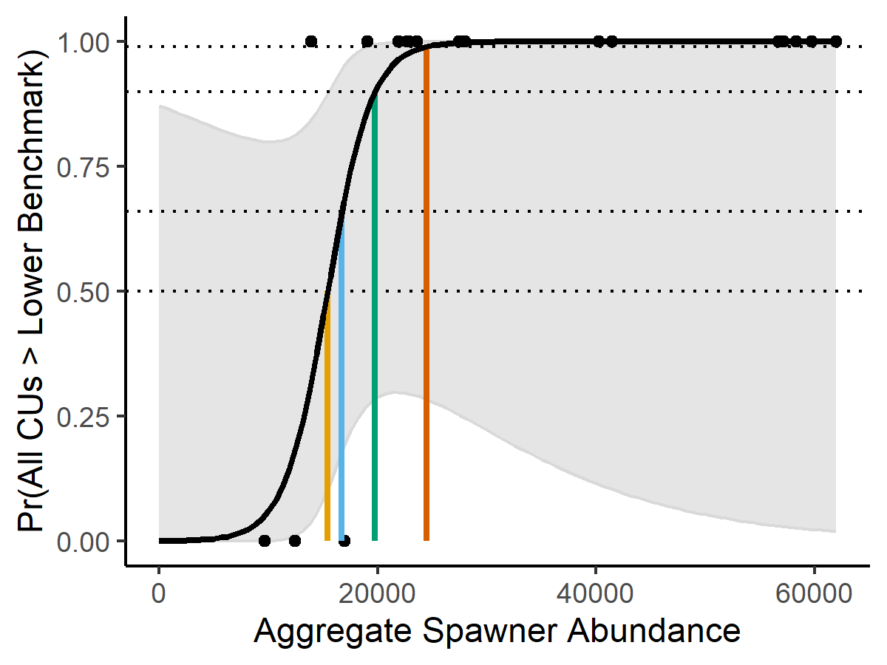
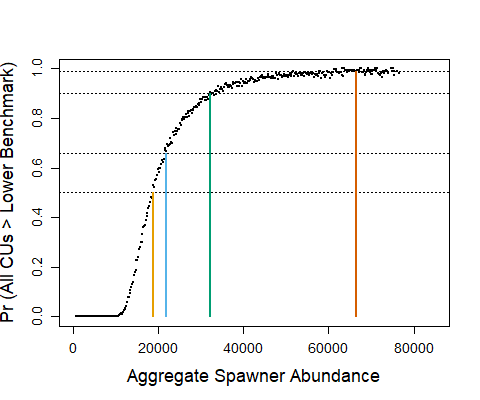

---
output:
  pdf_document: default
  html_document: default
---
# MÉTHODES PROPOSÉES DE DÉTERMINATION DES POINTS DE RÉFÉRENCE LIMITES (PRL) POUR LE SAUMON DU PACIFIQUE {#est-methods}

Les méthodes de détermination des PRL nécessitent des évaluations de l’état à l’échelle des unités de conservation (UC). Les données d’abondance requises pour les évaluations des UC sont parfois influencées par l’aménagement des stocks au moyen de poissons d’écloserie, ce qui nécessite des considérations supplémentaires. Cette section comprend les méthodes recommandées pour déterminer l’état des UC et estimer les PRL. Dans les évaluations de l’état des UC, nous décrivons d’abord notre approche pour tenir compte de l’apport des écloseries.<!--CH omit? Candidate LRPs are based on either the proportion of CUs with status above the Red zone or aggregate abundances to the SMU. -->

## CONTRIBUTION DES ÉCLOSERIES

\begin{tcolorbox}[standard jigsaw,opacityback=0.8,colframe=black,boxrule=0.7pt,left=0.1in, sharp corners]
\subsection*{Principaux points:}
\begin{itemize} 
\item Bien que les écloseries soient un outil utile pour accroître la production aux fins de la récolte et de la conservation, elles peuvent réduire la diversité génétique et la valeur adaptative des espèces sauvages et sont considérées comme un facteur de risque pour la persistance à long terme des UC.
\item Les saumons provenant des écloseries ne sont pas considérés comme « sauvages » au sens de la Politique concernant le saumon sauvage et ne sont généralement pas inclus dans les évaluations de l’état biologique.
\item Les données utilisées pour évaluer la contribution des écloseries à la fraie sont associées à de fortes incertitudes liées à la méthode de marquage utilisée, aux taux d’échantillonnage, à l’incertitude entourant la survie des poissons d’origine naturelle par rapport aux poissons d’écloserie, et aux erreurs d’observation.
\item Les populations dominées par des poissons sauvages, mais influencées par des saumons d’écloserie provenant de l’extérieur du bassin sont généralement incluses dans l’évaluation des UC, mais ces poissons errants peuvent biaiser les estimations de la production naturelle et les évaluations qui en découlent. 
\item Suivant les évaluations précédentes de l’état selon la PSS, lorsque les données sont disponibles, l’influence démographique de la production des écloseries peut être retirée des séries chronologiques d’abondance. Cette étape s’applique aux populations incluses dans les analyses, après avoir éliminé les populations fortement influencées par les écloseries. Lorsque les données permettant de différencier les géniteurs d’origine naturelle des géniteurs d’écloserie ne sont pas disponibles, l’abondance totale des géniteurs inclut les poissons provenant des écloseries, ce qui représente une source clé d’incertitude pour les populations influencées par les écloseries.
\item Les méthodes de traitement des données sur les contributions des écloseries dans le cadre des évaluations et les lignes directrices sur les pratiques exemplaires au sein du MPO continuent d’évoluer.
\end{itemize}
\end{tcolorbox}

Les écloseries contribuent à l’abondance des géniteurs chez de nombreuses populations de saumon et peuvent être utilisées comme un outil de conservation et un moyen d’augmenter la disponibilité des poissons pour la récolte. Les écloseries peuvent également réduire la diversité génétique et la valeur adaptative des espèces sauvages, définies comme le succès de la reproduction entre adultes, et sont considérées comme un facteur de risque pour la persistance à long terme des UC [@withlerGeneticallyBasedTargets2018]. Les saumons issus d’écloseries, ainsi que leur progéniture, ne sont pas considérés comme « sauvages » au sens de la Politique concernant le saumon sauvage. Généralement, seules les populations dominées par le saumon sauvage sont incluses dans les évaluations de l’état biologique. Cependant, il est difficile de distinguer l’influence des écloseries dans les séries chronologiques de l’abondance des géniteurs et du recrutement, en partie parce que les saumons provenant des écloseries ne sont souvent pas marqués, par exemple par des entailles sur les nageoires ou au moyen d’étiquettes à poisson, et ne peuvent donc pas être distingués des géniteurs d’origine naturelle. De plus, de nombreux programmes d’échappées de saumons, comme ceux où les géniteurs sont comptés depuis des hélicoptères [@parkenIncorporatingUncertaintyArea2003], ne disposent pas de programmes d’échantillonnage biologique permettant de recueillir des données de marquage sur des saumons individuels.  

### Prise en compte des risques génétiques de la production en écloserie

Conformément à @withlerGeneticallyBasedTargets2018, nous recommandons de n’inclure que les populations sans apport important des écloseries dans les analyses de l’état biologique des UC et de l’unité de gestion des stocks (UGS), conformément à la Politique concernant le saumon sauvage (PSS). L’influence naturelle proportionnelle, INP, est une mesure du risque génétique des écloseries sur les populations naturelles, les valeurs $<$ 0,5 indiquant des populations d’écloseries intégrées, où plus de la moitié des géniteurs sont issus d’écloseries, les valeurs $\geqslant$ 0,5 et $<$ 0,72 indiquant des populations de transition intégrées où les poissons d’origine naturelle prédominent, et les valeurs $\geqslant$ 0,72 indiquant des populations sauvages intégrées, où plus de la moitié des géniteurs sont considérés comme «sauvages» dans le cadre de la PSS [@withlerGeneticallyBasedTargets2018]. Bien que ces lignes directrices aient été proposées pour le saumon chinook, où l’amélioration des écloseries est la plus courante, elles sont également applicables à d’autres espèces de saumon [@withlerGeneticallyBasedTargets2018]. <!--(Table \@ref(tab:PNIcategories)). -->

<!--
\renewcommand*{\arraystretch}{1.6}
\begin{longtable}[]{p{3.2cm} p{5.2cm} }
\caption{Potential guidelines for the inclusion of integrated hatchery populations in WSP assessments
based on their biological designation, adapted from Withler et al. (2018)}
\hline
Designation & PNI (Inclusion in WSP assessment) \\
\hline
\endhead
Wild & na (Yes) \\

Wild-stray influenced & na (Provisional) \\

Integrated-wild & $\geq$ 0.72 (Yes \\

Integrated-transition & $\geq$ to 0.5, $<$ 0.72 (Provisional) \\

Integrated-hatchery & $<$ 0.5 (No) \\
\hline
(\#tab:PNIcategories)
\end{longtable}
-->

\renewcommand*{\arraystretch}{1.6}
\begin{longtable}[]{p{3.7cm} p{3cm} p{4.3cm}}
\caption{Lignes directrices potentielles pour la mise en œuvre de populations d’écloseries intégrées dans les évaluations de la PSS en fonction de leur désignation biologique et de leur INP, tirées de Withler et al. (2018).}\\
\hline
Désignation & INP & Inclusion dans les évaluations de la PSS \\ 
\hline
\endhead
Sauvage & Sans objet & Oui\\
Sauvage–influencée par les saumons errants & Sans objet & Provisoire\\
Intégrée–sauvage  & $\geq$ 0,72 & Oui \\
Intégrée–transition  & $\geq$ 0,5, $<$ 0,72 & Provisoire\\
Intégrée–écloserie  & $<$ 0,5 & Non \\
\hline
(\#tab:PNIcategories)
\end{longtable}


Lors de l’évaluation de l’état des populations, @withlerGeneticallyBasedTargets2018 recommandent d’inclure les populations sauvages intégrées dans les évaluations biologiques effectuées dans le cadre de la PSS, et provisoirement, les populations intégrées en transition (c’est-à-dire, INP $\geqslant$ 0,5). Par conséquent, seules les populations présentant des valeurs d’INP $\geqslant$ 0,5 ont été incluses dans l’évaluation de l’état des UC et de l’UGS dans nos applications d’étude de cas. Des définitions plus strictes de l’amélioration des écloseries peuvent être envisagées en n’incluant que les populations ayant des valeurs d’INP $\geqslant$ 0,72. En pratique, l’application de ce seuil plus strict pour notre étude de cas sur le saumon chinook a entraîné l’exclusion de la plupart des données, car des séries chronologiques fiables de valeurs d’INP et d’abondances de géniteurs ne sont disponibles que pour les populations indicatrices du taux d’exploitation<!--where coded-wire tags have been applied and sampled for recoveries-->, qui sont généralement des populations disposant d’écloseries. L’adoption d’un seuil de $\geqslant$ 0,5, un niveau associé à plus de la moitié des géniteurs d’origine naturelle, a été le résultat d’un compromis entre l’évaluation de la biodiversité restante au niveau des UC et l’exclusion des répercussions significatives des écloseries. Pour certaines populations, les premières périodes il y a un apport important de poissons d’écloserie peuvent être supprimées des séries chronologiques et les évaluations peuvent se concentrer sur les périodes récentes sans apport important [@grantEvaluationUncertaintyFraser2012]. Dans le cas des écloseries visant à rétablir des populations gravement appauvries, la production peut être dominée par des poissons provenant d’écloseries pendant une période jusqu’à ce que les abondances soient supérieures aux seuils de conservation inférieurs. Des lignes directrices sur l’évaluation et la gestion de ces écloseries de conservation sont actuellement élaborées par le Programme de mise en valeur des salmonidés du ministère des Pêches et des Océans (MPO), y compris des évaluations régulières de la proportion de la fraie associée aux poissons d’écloserie.


Les données utilisées pour évaluer la contribution des écloseries à la fraie et estimer les valeurs d’IPN sont associées à de fortes incertitudes. Pour notre étude de cas sur le saumon chinook, <!--KH: coho uses CWTs, so perhaps just leave as WCVI chinook since this is the focus on this paragraph? Or, could add a follow-up sentence about CWT for coho?? CH: will leave for now-->, les proportions de géniteurs issus d’écloseries ont été déterminées à partir des relevés sur les frayères pour le marquage thermique des saumons issus d’écloseries. Lorsque les données sur le marquage thermique n’étaient pas disponibles, des micromarques magnétisées codées (MMC) ont été utilisées pour indiquer les géniteurs issus d’écloseries, mais elles étaient associées à une incertitude accrue. Une grande variabilité interannuelle de la proportion de géniteurs issus d’écloseries peut résulter de la variabilité naturelle de la survie des géniteurs issus d’écloseries par rapport aux géniteurs d’origine naturelle, de faibles taux d’échantillonnage des géniteurs issus d’écloseries et d’erreurs d’observation élevées, ce qui nécessite des décisions sur le calcul de la moyenne temporelle. Pour l’étude de cas sur le saumon chinook de la côte ouest de l’île de Vancouver, nous avons établi une moyenne sur les séries chronologiques disponibles où les objectifs des écloseries sont restés constants, mais nous recommandons des recherches supplémentaires pour quantifier les sources d’incertitudes et évaluer la sensibilité des résultats aux diverses périodes de calcul de la moyenne (p. ex. la génération récente par rapport à la période entière).

En plus des lignes directrices sur les évaluations biologiques prévues par la PSS, @withlerGeneticallyBasedTargets2018 recommandent également d’élaborer des objectifs biologiques pour les populations influencées par les écloseries et de documenter les compromis entre d’une part le risque génétique accru que pose la production en écloserie pour les populations sauvages, et d’autre part l’abondance accrue requise pour soutenir d’autres objectifs. Des plans de mise en valeur sont en cours d’élaboration pour les populations influencées par les écloseries par le Programme de mise en valeur des salmonidés du MPO, qui comprend des objectifs liés à l’IPN, à la récolte, à l’évaluation et à l’intendance ainsi que des mesures pour atteindre les objectifs. Une fois élaborés, les plans de mise en valeur peuvent être intégrés à la planification de la récolte et de l’habitat dans le cadre de plans de gestion intégrée et/ou de rétablissement. Les lignes directrices et les méthodes d’estimation des valeurs de l’IPN sont également documentées par le Programme de mise en valeur des salmonidés du MPO (MPO, en révision)^[DFO In revision. Guidelines for Calculating the Proportionate Natural Influence Index as a Metric of the Genetic Influence of Enhanced Pacific Salmon on Wild Populations. Report of the Salmonid Enhancement Program, Vancouver, BC]. 

### Populations sauvages influencées par les saumons errants provenant d’écloseries

En outre, @withlerGeneticallyBasedTargets2018 recommandent que les populations dominées par des poissons sauvages, mais influencées par la présence de poissons d’écloserie (appelées populations « sauvages–influencées par les saumons errants ») soient incluses dans les évaluations des UC dans le cadre de la PSS. Ces populations reçoivent des poissons errants provenant de programmes d’écloserie hors bassin, mais ne contiennent pas d’écloseries elles-mêmes. Bien que la majorité des poissons puissent être sauvages dans ces populations, la modélisation du flux génétique unidirectionnel laisse entendre qu’au fil du temps, les valeurs d’INP diminueront jusqu’à des niveaux compatibles avec les systèmes dominés par les écloseries, avec une errance continue. Dans la pratique, l’errance des écloseries hors bassin et les impacts génétiques ne sont généralement pas suivis ou évalués, et les errances hors bassin sont donc incluses dans les abondances totales dans les évaluations biologiques. Cependant, cela représente une lacune dans notre connaissance des impacts des écloseries et dans notre capacité à mettre en œuvre les recommandations de @withlerGeneticallyBasedTargets2018. Deux exceptions: @candyPatternsHomingStraying2000 qui décrivent les modèles d’errance du saumon chinook dans le bassin hydrographique du Fraser et sur l’île de Vancouver, et plus en détail sur la côte ouest de l’île de Vancouver où des études estimant l’étendue de l’errance du saumon chinook sont en cours et peuvent éclairer l’évaluation des répercussions des écloseries dans les évaluations biologiques futures (W. Luedke, comm. pers.) 


### Supprimer l’influence démographique de la production en écloserie

Pour certaines évaluations de la PSS qui incluent des populations intégrées-transition et intégrées-sauvages, l’influence démographique de la production d’écloserie est supprimée des séries chronologiques d’abondance lorsque des données sur la proportion de poissons provenant d’écloseries par rapport aux poissons d’origine naturelle dans les frayères sont disponibles [p. ex, à partir du marquage des poissons d’écloserie ou d’autres données sur la survie relative des poissons d’écloserie, @dfoWildSalmonPolicy2015]. Plus précisément, la contribution de la production d’écloserie est supprimée à la fois de l’estimation de référence et de la mesure de l’abondance des géniteurs. Pour les points de référence fondés sur les valeurs de stock-recrutement, la contribution des poissons provenant des écloseries est retirée des estimations du recrutement, mais pas de l’échappée, car on suppose que tous les géniteurs naturels se reproduisent avec succès dans la nature et contribuent à la production naturelle. De cette façon, la relation géniteur-recrues représente la production dérivée des géniteurs dans l’environnement naturel. Pour la mesure de l’abondance des géniteurs, la contribution des poissons provenant d’écloseries peut être retirée des séries chronologiques des géniteurs afin de réduire l’influence de la variabilité de la production annuelle des écloseries sur l’état [@dfoWildSalmonPolicy2015]. Bien que le fait de retirer les poissons provenant d’écloseries des analyses soit incompatible avec la recommandation de @withlerGeneticallyBasedTargets2018 d’inclure tous les géniteurs dans les évaluations biologiques lorsque la fraie naturelle prédomine (INP $\geqslant$ 0,5), cela est cohérent avec les évaluations de la PSS publiées sur lesquelles nos analyses se sont appuyées, et l’élaboration de nouvelles séries chronologiques dépassait la portée de cette étude.


Dans la plupart des cas où les poissons originaires d’écloseries ne sont pas marqués ou échantillonnés dans les frayères, les données sur la proportion de géniteurs originaires d’écloseries ne sont pas disponibles. Dans ces cas, les évaluations de la PSS s’appuient généralement sur l’abondance totale des géniteurs, y compris la contribution des écloseries, tant que l’on estime que l’abondance des géniteurs est principalement d’origine naturelle (p. ex. INP $\geqslant$ 0,5) [p. ex. le saumon chinook du sud de la Colombie-Britannique, @dfoIntegratedBiologicalStatus2016], conformément aux recommandations de @withlerGeneticallyBasedTargets2018. Dans ces cas, il peut y avoir un risque que l’état actuel soit confondu par la production en écloserie, laquelle peut masquer les changements dans la production naturelle et embrouiller les inférences pour les populations non aménagées dans l’UC. Ce risque est partiellement atténué, mais pas éliminé, par l’exclusion des évaluations des populations dominées par des poissons provenant d’écloseries. En général, nous recommandons une certaine souplesse dans la prise en compte des populations influencées par les écloseries dans les évaluations, alors que les méthodes de prise en compte des poissons d’écloserie et les directives connexes évoluent.


<!--CH remove, replaced with pgh above: In addition, some populations without hatcheries may be influenced by straying from hatcheries from neighbouring populations ('out-of-basin' strays). In this case, a very large fraction of fish may be wild, however, if straying continues over time , gene flow modelling shows that that the genetic influence of hatcheries will increase as well [@withlerGeneticallyBasedTargets2018].The impact of these strays is generally excluded in assessments in part because of the absence of marking and spawning ground sampling for hatchery fish or genetic analyses to determine their influence, and so out-of-basin strays are included in total abundances. Studies evaluating the extent of straying for Chinook Salmon for the West Coast of Vancouver Island are on-going (W. Luedke pers. comm.) and previous research by Candy and Beacham (2000) described the patterns in Southern BC. 
 -->

<!--CH removed: "Recruitment data are generally not available for these stocks, so stock-recruitment analyses are usually not implemented. In one exception for Pitt River Sockeye Salmon,  spawner abundances were determined from brood take plus total spawners in the natural environment and recruitment was total recruits from both hatchery and natural environment (Pitt River, Grant et al. 2011)".-->
## ESTIMATION DE L’ÉTAT DES UC {#cu-est-methods}

\begin{tcolorbox}[standard jigsaw,opacityback=0.8,colframe=black,boxrule=0.7pt,left=0.1in, sharp corners]
\subsection*{Principaux points:}
\begin{itemize} 
\item Nous recommandons que l’état au niveau des UC prenne en compte plusieurs paramètres, qui seront intégrés au moyen d’évaluations officielles de l’état ou de \textbf{l’explorateur de l’état des saumons du Pacifique}, également appelé l’explorateur des saumons.
\item L’explorateur des saumons fournit un état à partir d’un ensemble de paramètres et de points de référence sur l’abondance des géniteurs, ainsi que les tendances à long et à court terme de l’abondance des géniteurs.
\item Divers points de référence sur l’abondance des géniteurs ont été déterminés pour tenir compte des différences entre les UC en ce qui a trait aux types de données, à la quantité de données et la qualité des données, dont ceux basés sur les relations stock-recrutement, les centiles des abondances historiques de géniteurs et la capacité de fraie et d’alevinage en eau douce.
\item Des paramètres de répartition de la fraie ont été inclus dans les évaluations officielles de la PSS.
\item Aux fins de l’élaboration des PRL, l’état des UC a été déterminé de deux façons: en utilisant divers paramètres appliqués dans l’explorateur des saumons et un seul paramètre sur l’abondance des géniteurs afin de démontrer la cohérence dans ces approches et de mettre en évidence les différences.
\end{itemize}
\end{tcolorbox}
<!--CH removed from bullet 4 on distribution: ", but have not yet been incorporated into the Salmon Scanner, in part due to a lack of rigorous benchmarks on these metrics"-->

<!-- KH: I have expanded on the following paragraph as a revision from CSAS meeting-->
Pour être cohérent avec l’approche multidimensionnelle des évaluations de l’état de la PSS décrite dans @holtIndicatorsStatusBenchmarks2009, nous recommandons que l’état au niveau des UC prenne en compte plusieurs paramètres, qui seront intégrés au moyen d’évaluations officielles de l’état [@grantIntegratedBiologicalStatus2013; @grant2017FraserSockeye2020; @dfoWildSalmonPolicy2015; @dfoIntegratedBiologicalStatus2016] ou d’autres approches multidimensionnelles comme l’explorateur de l’état des saumons du Pacifique (Pestal et al. en révision). Dans les applications de notre étude de cas @holtCaseStudyApplications2023, nous démontrons l’application de l’outil, soit l’explorateur de l’état des saumons du Pacifique, comme moyen d’estimer rapidement des évaluations plus détaillées de l’état de la PSS. L’explorateur des saumons i) estime les états pour les paramètres individuels de la PSS et ii) applique un algorithme d’arbre de décision pour intégrer les estimations d’état multiples dans une seule estimation d’état (par exemple, rouge, ambre, vert) basée sur le type de données et la disponibilité des données. En utilisant plusieurs paramètres (tableau \@ref(tab:SSmetrics)), l’explorateur de l’état des saumons permet d’évaluer l’état à partir d’un large éventail de données disponibles. Lorsque les données d’un seul paramètre ne sont pas disponibles, d’autres paramètres peuvent être utilisés pour éclairer l’état. L’algorithme de l’arbre de décision a été vérifié à l’aide de données et de l’expertise locale (Pestal et al. en révision). Il est prévu d’intégrer à l’application de cet outil un examen par des experts des résultats rapides de l’état pour chaque UC (S. Grant, comm. pers.)  L’explorateur des saumons peut fournir des évaluations dans les contextes où les données sont limitées, et des méthodes pour tenir compte des incertitudes résultant de ces limitations de données sont en cours d’intégration dans l’explorateur. 

<!--KH: if these methods to account for uncertainties haven't been developed yet (i.e., aren't yet written up in a draft paper), I'm not sure we should mention them.   
CH: the challenge is I had original text saying the Salmon Scanner did not incorporate uncertainties in underlying metrics, but Sue mentioned that its being developed and so it's not really a disadvantage-->

\renewcommand*{\arraystretch}{1.4}
\begin{table}[!htbp]
\centering
\footnotesize   
\caption{Paramètres actuellement utilisés dans l’explorateur de l’état du saumon du Pacifique}
\begin{tabular}{p{4.2cm} p{4.2cm} p{4.2cm} p{4.2cm} p{4.2cm} p{3.2cm} }
\multicolumn{3}{l}{}\\
\toprule
\multicolumn{3}{l}{Catégorie} & Paramètres & Exemples de points de référence (citations démontrant des niveaux supérieurs à ceux associés à un dommage grave)\\
\midrule
\multicolumn{3}{l}{Paramètres relatifs à l’abondance} & Abondance absolue de géniteurs par rapport au point de référence d’abondance absolue & 1 000 géniteurs (1,2)\\

\multicolumn{3}{l}{} & Abondance absolue ou indice d’abondance de géniteurs par rapport aux points de référence estimés & Ggén (3) ou 25e centile des abondances de géniteurs observées (4)\\
\midrule
\multicolumn{3}{l}{Paramètres relatifs à la tendance} & Variation en pourcentage de l’abondance des géniteurs au cours des trois dernières générations & déclin de 25\% (1,5)\\
\multicolumn{3}{l}{} & Rapport entre la moyenne géométrique de la génération actuelle et la moyenne géométrique de la série chronologique & 0,5 (5,6,7) \\

\bottomrule
\end{tabular}
(\#tab:SSmetrics)
\end{table}


\scriptsize (1) [@cosewicCOSEWICWildlifeSpecies2021; @maceQuantificationExtinctionRisk2008]; (2) [@cultussockeyerecoveryteamNationalConservationStrategy2005]; (3) [@holtEvaluationBenchmarksConservation2009]; (4) [@holtEvaluatingBenchmarksBiological2018]; (5) [@holtIndicatorsStatusBenchmarks2009] (6) [@grantIntegratedBiologicalStatus2013]; (7) [@porsztReliabilityIndicatorsDecline2012]


\normalsize Divers points de référence sur l’abondance des géniteurs ont été établis pour tenir compte des différences entre les UC quant au type de données, à la quantité de données et à la qualité des données. Pour les UC riches en données où les relations géniteur-recrutement peuvent être estimées de manière fiable, @holtEvaluationBenchmarksConservation2009 recommande un point de référence inférieur, à savoir l’abondance qui permet le rétablissement à l’abondance des géniteurs au rendement maximal durable, G~RMD~, en une génération de saumons dans des conditions d’équilibre, G~gén~. Lors de l’application des analyses stock-recrutement, l’échelle spatiale de la densité-dépendance doit être soigneusement considérée, celle-ci pouvant être plus petite ou plus grande que l’UC. Lorsque les séries chronologiques de recrutement ne sont pas disponibles et que la productivité est supposée être modérée ou élevée, et les taux de récolte modérés ou faibles, des centiles précis des séries chronologiques de géniteurs observés (p. ex., 25^e^) peuvent être utilisés comme une approximation des points de référence de la relation géniteur-recrutement [@holtEvaluatingBenchmarksBiological2018]. Pour le saumon chinook, le saumon rouge et le saumon coho, dont la production est souvent limitée par la quantité d’habitat d’eau douce, l’abondance des géniteurs à l’équilibre peut être prédite à partir des caractéristiques de l’habitat afin d’établir des points de référence fondés sur l’abondance [@nobleHabitatbasedEscapementBenchmarks2015; @parkenHabitatbasedMethodsEstimate2006]. Par exemple, @parkenHabitatbasedMethodsEstimate2006 utilisent la relation entre la superficie du bassin versant et les points de référence fondés sur le recrutement des géniteurs dans une méta-analyse des populations de saumon chinook<!--LW: changed from stocks. Paper uses the word stock but I think they are different than SMUs or CUs (pre-CU and SMU definitions)--> de toute la région Pacifique pour prédire les points de référence des populations de saumon chinook<!--LW: changed from stocks--> sans données de recrutement. De plus, l’information sur la capacité de l’habitat en eau douce peut être utilisée pour créer des valeurs a priori informatives pour les points de référence du stock-recrutement estimés avec des techniques bayésiennes (p. ex., @atlasLandscapeBiophysicalControls2020 pour le saumon rouge).

De même, des paramètres et des points de référence sur les tendances à long terme et à court terme de l’abondance des géniteurs sont inclus dans l’explorateur des saumons. Les tendances à long terme sont mesurées par le rapport entre la moyenne géométrique de l’abondance des géniteurs des générations récentes et la moyenne géométrique à long terme, et les tendances à court terme sont mesurées par le pourcentage de changement dans l’abondance des géniteurs sur trois générations, la période utilisée dans les évaluations du Comité sur la situation des espèces en péril au Canada (COSEPAC) [@holtEvaluationBenchmarksConservation2009]. Les points de référence inférieurs de ces paramètres représentent des niveaux en dessous desquels le risque de disparition est accru [@holtIndicatorsStatusBenchmarks2009]. <!--CH: I feel like this is repetitive given the table, but Sue asked for a more balanced description of metrics and benchmarks, covering all categories...-->

De plus, les paramètres de la répartition de la fraie au sein d’une UC peuvent être prises en compte dans les évaluations de la PSS [@peacockReviewMetricsDistribution2010; @peacockMetricsSamplingDesigns2012; @dfoIntegratedBiologicalStatus2016], mais ne sont pas forcément nécessaires pour toutes les espèces de saumon et n’ont pas encore été incluses dans l’explorateur des saumons. Dans un exemple, la répartition des géniteurs entre les sites de fraie et les  réductions de cette répartition au fil du temps ont été examinées dans une évaluation de la PSS visant le saumon chinook du sud de la Colombie-Britannique [@dfoIntegratedBiologicalStatus2016]. En outre, les objectifs de rétablissement du saumon coho du Fraser intérieur tiennent compte de la répartition des géniteurs entre les sous-populations [@interiorfrasercohorecoveryteamConservationStrategyCoho2006]. L’un des défis de l’application de paramètres de répartition consiste à indiquer des points de référence permettant de distinguer les populations présentant un risque accru de disparition.

Aux fins de l’élaboration des PRL, l’état des UC pour les applications des études de cas ont été déterminés de deux façons, en utilisant plusieurs paramètres appliquées dans l’explorateur des saumons et un seul paramètre sur l’abondance des géniteurs. Nous avons appliqué les deux afin de démontrer la cohérence de ces approches et de souligner les différences éventuelles. Lorsqu’un seul paramètre est appliqué pour déterminer l’état, il existe un risque de fournir une évaluation trompeuse si d’autres paramètres qui auraient été utilisés dans une approche multidimensionnelle fournissent des informations contraires, mais ne sont pas inclus. Une revue complète de l’explorateur des saumons sera fournie dans Pestal et al. (en révision).

<!--CH omitting becuase it pertains only to sensitivity analysis on proportinal LRPs, not aggregate abundance LRPs, which is confusing!  I've revised this text to refer to generational mean of SMU abundances relative to LRP, and moved to Step 9 of the Guidelines.

When assessing CU status relative to abundance-based lower benchmarks, we use generational mean spawner abundances as a basis for determining whether each CU is above or below its lower benchmark. Taking the generational mean integrates status over cohorts within a generation, which can exhibit relatively independent dynamics in some species. This approach reduces noise in annual CU status determination due to annual fluctuations in CU abundances from any single cohort. It also makes our determination of CU status consistent with the approach taken for abundance-based benchmarks in WSP assessments and the Pacific Salmon Status Scanner.
-->

## ESTIMATION DES PRL

\begin{tcolorbox}[standard jigsaw,opacityback=0.8,colframe=black,boxrule=0.7pt,left=0.1in, sharp corners]
\subsection*{Principaux points:}
\begin{itemize} 
\item \textbf{Les PRL basés sur l’état des UC} sont calculés à partir de la proportion d’UC au sein d’une UGS qui sont évaluées comme étant au-dessus de l’état « rouge », avec 100\% comme PRL recommandé.
\item Les PRL basés sur l’état des UC sont recommandés comme approche par défaut pour estimer les PRL du saumon du Pacifique et déclencher les plans de rétablissement en vertu de la \textit{Loi sur les pêches}.
\item Les PRL le long d’un gradient d’abondances agrégées au niveau de l’UGS (\textbf{PRL fondés sur l’abondance globale}) peuvent être nécessaires pour les décisions de gestion des pêches à l’échelle de l’UGS, et sont considérés comme complémentaires aux PRL fondés sur l’état des UC.
\item Deux types de PRL fondés sur l’abondance globale sont indiqués: \textbf{PRL de régression logistique} et \textbf{PRL de projection}. 
\begin{itemize} 
\item Les deux s’appuient sur la relation entre les abondances globales observées et les états des UC composantes, mais les PRL de régression logistique s’appuient directement sur des données empiriques alors que les PRL de projection sont dérivés de projections de la dynamique des populations au niveau des UC, généralement paramétrées à partir de données empiriques. 
\item Les deux PRL d’abondance globale sont de nature probabiliste, indiquant les abondances globales associées à une probabilité acceptable que toutes les UC atteignent un état supérieur à « rouge ».
\end{itemize}
\item Une hypothèse des PRL de régression logistique est que la relation entre l’abondance globale et l’état au niveau des UC observé historiquement représente la relation actuelle (et future). Si la covariance de la dynamique de la population parmi les UC n’est pas stationnaire, les PRL par régression logistique peuvent ne pas représenter des niveaux supérieurs à celui associé à des dommages graves. 
\item Les PRL de projection peuvent intégrer des fourchettes plausibles d’incertitudes des paramètres qui peuvent différer de celles observées historiquement, contrairement aux PRL de régression logistique.
 
\end{itemize} 
\end{tcolorbox}


<!--
Additional points to add for the SAR:
\item Advantages of CU status-based LRPs include that they are consistent with the established framework for status assessments under the WSP, they are easy to communicate, and the spatial scale of CU status-based LRPs can be easily adapted to match the scale at which management decisions are required.
\item For projection LRPs, there is no uncertainty from statistical estimation, unlike logistic regression LRPs. Probabilities are derived directly from projections and underlying uncertainties are integrated directly into the overall probability.
\item For both aggregate abundance LRPs, uncertainties in CU-level benchmarks and assessments can be accounted for explicitly and quantitatively.
\item Also for both aggregate abundance LRPs, structural uncertainty in underlying population dynamics can be considered through sensitivity analyses or model averaging across structural assumptions.


-->
Dans cette section, des PRL qui intègrent les états des UC composantes sont proposés. Ces PRL se divisent en deux catégories: ceux basés sur la proportion d’UC composantes au-dessus de la zone rouge, appelés PRL fondés sur l’état des UC, et ceux basés sur les abondances globales, appelés PRL fondés sur l’abondance globale. Les PRL d’abondance globale sont ensuite subdivisés en PRL de régression logistique et PRL de projection (fig. \@ref(fig:LRP-types)). Une description plus détaillée des PRL est présentée dans @holtCaseStudyApplications2023. 


\begin{figure}[ht]
\centering
\begin{tikzpicture}
\tikzstyle{box} = [rectangle, rounded corners, text centered, draw=black]
\tikzstyle{arrow} = [thick,->,>=stealth]
\node(1) [box, minimum width=10 cm, minimum height=1 cm, fill=yellow!10] at(0,0) {PRL fondés sur l’état des UC};
\node(2) [box,  minimum width=10 cm, minimum height=1 cm, fill=blue!10] at(0,-2) {PRL fondés sur l’abondance globale};
\node(2a) [box, minimum width=4 cm, minimum height=1 cm, fill=blue!10] at(-3,-3.5) {PRL de régression logistique};
\node(2b) [box, minimum width=4 cm, minimum height=1 cm, fill=blue!10] at(3,-3.5) {PRL de projection};
\draw[arrow] (2.south -| 2a) -- (2a);
\draw[arrow] (2.south -| 2b) -- (2b);
\end{tikzpicture}
\caption{Types de PRL pour le saumon du Pacifique, montrant la nature imbriquée des PRL de régression logistique et de projection dans la catégorie des PRL d’abondance globale.}  
(\#fig:LRP-types)
\end{figure}


### PRL fondés sur l’état des UC

Les PRL fondés sur l’état des UC sont calculés à partir de la proportion d’UC au sein d’une UGS qui sont évaluées comme étant au-dessus de l’état « rouge » (fig. \@ref(fig:CU-status-based-LRP)). Pour être cohérent avec l’intention de la PSS de préserver la biodiversité au niveau des UC, nous indiquons un PRL à 100 % des UC ayant un état supérieur à rouge (c.-à-d. ambre ou vert). <!--CH Sue suggested removing as she wasn’t sure what happened when LRP is breached, I think. I agree the act of breaching is not entirely relevant here, but I did think it might help explain the CU status-based LRP “When any individual CU falls into the Red zone, then the LRP is considered breached.”--> Voir la section \@ref(guidelines) pour une approche progressive de l’identification des PRL qui prend davantage en compte les limitations des données lors de l’identification de la proportion d’UC au-dessus de la zone rouge, et la section \@ref(recommendations) pour une description des incertitudes connexes. Les états des UC sont déterminés au moyen des approches décrites à la section \@ref(cu-est-methods), et sont soumis à un examen par les pairs, comme il est décrit à la section \@ref(guidelines).


<!--CH: the following 2 lines give a line break before the next heading-->
\
&nbsp;
*Harmonisation avec les principes de PRL*

Les PRL fondés sur l’état des UC peuvent être basés sur la meilleure information disponible (principe 1) en incorporant de multiples dimensions de l’état au moyen d’évaluations officielles de l’état des UC examinées par les pairs, ou par l’utilisation de l’explorateur des saumons avec un examen par les pairs. En utilisant l’état dérivé de la mise en œuvre annuelle de l’explorateur des saumons, des informations pertinentes et opportunes sont utilisées pour informer l’état d’une manière qui est transparente et ouverte. Les PRL fondés sur l’état des UC représentent un dommage grave (principe 2), comme l’indique l’état de n’importe quelle UC composant l’UGS qui se trouve dans la zone rouge de la PSS, étant donné que la détérioration de la structure du stock (c’est-à-dire la perte de diversité) peut elle-même être une forme de dommage grave. Les PRL fondés sur l’état des UC sont opérationnels (principe 3), car ils sont simples à calculer et à communiquer en tant que proportion des états des UC. Pour les UGS où la récolte est gérée à l’échelle globale de l’UGS, cependant, les PRL fondés sur l’état des UC ne sont pas facilement incorporés dans les règles de contrôle des prises à cette échelle. La fiabilité de l’estimation (principe 4) dépend en partie des données sous-jacentes et dépend des UC et de l’UGS. Les incertitudes ne sont pas actuellement propagées des points de référence et états au niveau des UC de l’explorateur des saumons, aux PRL et aux états de l’UGS (principe 5). Les PRL fondés sur l’état des UC sont bien harmonisés avec le principe 6, étant donné qu’ils sont directement dérivés des paramètres d’état des UC de la PSS.

Un autre avantage de cette méthode est qu’elle peut facilement être étendue à d’autres échelles spatiales dans lesquelles le saumon du Pacifique est géré. Par exemple, les UC peuvent être évaluées individuellement lorsque les menaces et les réponses sont localisées dans des bassins versants spécifiques, comme c’est le cas par exemple des habitats de fraie et d’alevinage du saumon rouge du lac Cultus, sur lesquels pèsent de menaces uniques. L’état des UC peut également être agrégé à diverses échelles et pour plusieurs espèces lorsque les menaces et les réponses sont plus larges, par exemple pour la gestion de nombreuses espèces de saumon et d’UC touchées par le glissement de terrain de Big Bar survenu en 2019. 
 

<!--CH: the following 2 lines give a line break before the next heading-->
\
&nbsp;
En plus des PRL fondés sur l’état des UC, nous avons élaboré des PRL le long d’un gradient d’abondance agrégé au niveau de l’UGS en tenant compte des états au niveau des UC composantes. Ces « PRL fondés sur l’abondance globale » peuvent être nécessaires pour les décisions de gestion des pêches à l’échelle de l’UGS, mais sont considérés comme complémentaires aux LPR fondés sur l’état des UC aux fins des dispositions relatives aux stocks de poissons. Nous avons indiqué deux types de PRL d’abondance globale: (1) PRL de régression logistique et (2) PRL de projection (fig. \@ref(fig:LRP-types)). Les deux PRL s’appuient sur la relation entre les abondances globales observées et les états des UC composantes, mais ils diffèrent en ce que les PRL de régression logistique s’appuient directement sur des données empiriques, alors que les PRL de projection sont dérivés de projections de la dynamique des populations au niveau des UC, habituellement paramétrées à partir de données empiriques. De plus, les deux PRL sont de nature probabiliste, indiquant les abondances globales associées à une probabilité acceptable que toutes les UC atteignent un état supérieur à la zone rouge. Dans une certaine mesure, l’incertitude dans la relation sous-jacente entre les abondances globales observées et les états au niveau des UC composantes est représentée dans la nature probabiliste de ces PRL; des incertitudes plus grandes entraînent des valeurs de PRL plus élevées et vice versa, toutes choses restant égales. La capacité des PRL d’abondance globale à représenter de manière fiable les seuils de dommages graves au niveau des UC dépend de la force de la relation sous-jacente entre l’abondance globale et les états des UC, telle que déduite des données observées.

<!-- LW: change colours back to Green4, Orange1, and Red1 when I figure out how to pass option x11names to package xcolor-->
\begin{figure}[ht]
\centering
\begin{tikzpicture} [ font=\sffamily]
 
\tikzstyle{gstat} = [circle, minimum width = 0.9 cm, fill=green!90]
\tikzstyle{gstatf} = [circle, minimum width = 0.9 cm, fill=green!5]
\tikzstyle{astat} = [circle, minimum width = 0.9 cm, fill=orange!90]
\tikzstyle{astatf} = [circle, minimum width = 0.9 cm, fill=orange!10]
\tikzstyle{rstat} = [circle, minimum width = 0.9 cm, fill=red!90]
\tikzstyle{rstatf} = [circle, minimum width = 0.9 cm, fill=red!5]
\tikzstyle{UGS} = [rectangle, rounded corners, dashed, draw=gray]

\node at (2,4.75) {UC1}; 
\node at (3,4.75) {UC2}; 
\node at (4,4.75) {UC3}; 
\node at (5,4.75) {UC4}; 

\node() [gstat] at (2,4) {};
\node() [gstat] at (3,4) {};
\node() [gstatf] at (4,4) {};
\node() [gstatf] at (5,4) {};

\node() [astatf] at (2,3) {};
\node() [astatf] at (3,3) {};
\node() [astatf] at (4,3) {};
\node() [astat] at (5,3) {};

\node() [rstatf] at (2,2) {};
\node() [rstatf] at (3,2) {};
\node() [rstat] at (4,2) {};
\node() [rstatf] at (5,2) {};

\node() [UGS, minimum width=5cm, minimum height=4.5 cm] at (3.5, 3.25) {};
\node at (3.5,5.75) {Unité de gestion des stocks A};  

\draw [line width = 1 mm] (1,2.5) -- (6,2.5);
\node() [align=center] at (7,2.5) {PRL-\\fondés sur\\ l’état\\ des UC};


\node() [single arrow, shape border rotate=270, draw, minimum height=0.6 cm, minimum width=0.7 cm, single arrow head extend=0.1cm] at (3.5, 0.65) {}; 
\node() at (3.5, 0) {État de l’UGS = inférieur au PRL};

\node at (9,4.75) {UC5}; 
\node at (10,4.75) {UC6}; 
\node at (11,4.75) {UC7}; 

\node() [gstatf] at (9,4) {};
\node() [gstat] at (10,4) {};
\node() [gstat] at (11,4) {};

\node() [astat] at (9,3) {};
\node() [astatf] at (10,3) {};
\node() [astatf] at (11,3) {};

\node() [rstatf] at (9,2) {};
\node() [rstatf] at (10,2) {};
\node() [rstatf] at (11,2) {};

\node() [UGS, minimum width=4cm, minimum height=4.5 cm] at (10, 3.25) {};
\node at (10,5.75) {Unité de gestion des stocks B}; 

\draw [line width = 1 mm] (8,2.5) -- (12,2.5);

\node() [single arrow, shape border rotate=270, draw, minimum height=0.6 cm, minimum width=0.7 cm, single arrow head extend=0.1cm] at (10, 0.65) {}; 
\node() at (10, 0) {État de l’UGS = supérieur au PRL};


\end{tikzpicture}
\caption{Schéma du « PRL fondé sur l’état des UC » appliqué à deux exemples d’UGS. L’unité de gestion des stocks A (à gauche) se compose de quatre UC, dont deux ont un état vert, une un état orange et une un état rouge. L’unité de gestion des stocks B (à droite) se compose de trois UC, dont deux ont un état vert et une un état ambre. L’« unité de gestion des stocks A » serait évaluée comme étant inférieure au PRL, tandis que l’« unité de gestion des stocks B » serait évaluée comme étant supérieure au PRL.}
(\#fig:CU-status-based-LRP)
\end{figure}


### PRL fondés sur l’abondance agrégée

**PRL fondés sur la régression logistique**

Les PRL fondés sur la régression logistique peuvent être dérivés d’une relation estimée empiriquement entre les états au niveau des UC et l’abondance globale de l’UGS. Cette méthode étend le PRL fondé sur l’état des UC en indiquant le niveau d’abondance globale qui a historiquement été associé à toutes les UC composantes ayant un état supérieur à la zone rouge, tel qu’estimé à partir de l’état sur un seul paramètre d’abondance des géniteurs par rapport à un point de référence inférieur. Pour chaque année de données observées, l’état au niveau de l’UGS est quantifié comme une variable de Bernoulli: 1 (succès) = toutes les UC ont un état estimé supérieur au point de référence inférieur et 0 (échec) = toutes les UC n’ont pas eu un état supérieur au point de référence inférieur, c’est-à-dire qu’au moins une UC a été évaluée en dessous du point de référence inférieur. Une régression logistique est ensuite ajustée à ces résultats afin d’estimer la probabilité que toutes les UC aient des abondances supérieures à leurs points de référence inférieurs en fonction des abondances globales de géniteurs au niveau de l’UGS. Étant donné la différence dans le nombre d’UC composantes entre les espèces de saumon (plus pour le saumon rouge que pour les autres espèces), la probabilité qu’au moins une UC composante ait l’état rouge est plus grande pour le saumon rouge. L’équation de régression logistique suivante est utilisée pour estimer les PRL,

\begin{equation}
  \log(\frac{p}{1-p}) = B_0 + B_1 \sum_{i}^{i=nCUs} S_{i,t}
   (\#eq:logistic)
\end{equation}

où, $p$ est la probabilité, $B_0$ et $B_1$ sont les paramètres estimés de la régression logistique et $S_{i,t}$ est l’abondance des géniteurs pour l’UC $i$ au cours de l’année $t$. L’équation \@ref(eq:logistic) est ensuite réarrangée pour calculer le PRL comme l’abondance globale des géniteurs associée au seuil de probabilité préétabli de $p^*$,

\begin{equation}
  LRP = \frac{log(\frac{p^*}{1-p^*}) - B_0}{B_1}
  (\#eq:logisticLRP)
\end{equation}

Un exemple d’ajustement de régression logistique est présenté à la figure \@ref(fig:example-logisticFit), avec les PRL associés à quatre seuils de probabilité, soit 0,5, 0,66, 0,90 et 0,99, qui représentent les niveaux minimaux au-dessus desquels le niveau de probabilité est respectivement plus probable qu’improbable, probable, très probable et pratiquement certain, comme le définit le Groupe d’experts intergouvernemental sur l’évolution du climat, GIEC [@mastrandreaGuidanceNoteLead2010, tableau \@ref(tab:LikelihoodsIPCC)]. @mastrandreaGuidanceNoteLead2010 mettent également en évidence la fourchette 33 % à 66 % comme représentant « aussi probable qu’improbable », englobant des probabilités légèrement supérieures à la moyenne (50 % à 66 %). Le point médian de 50 % représente une probabilité égale que toutes les UC soient au-dessus de l’état rouge et qu’elles ne le soient pas. <!-- CH omit: While DFO’s Precautionary Approach Framework [@dfoFisheryDecisionMakingFramework2009] provides draft risk categories, with ~50% described as neutral, 50-75% described as ‘moderately high’, and “75%-95% as ‘high’, these pertain to specifically to preventable declines and may not be relevant for LRP estimation. -->Un autre élément à prendre en compte dans cette étape est le seuil de probabilité de déclenchement des PRL décrit dans les lignes directrices pour la mise en œuvre des plans de rétablissement du MPO [@dfoScienceGuidelinesSupport2021]. Selon les lignes directrices, à moins d’indication contraire dans les cadres de l’approche de précaution propres aux stocks, le PRL devrait être considéré comme dépassé si l’indicateur d’état des stocks pour l’année terminale est égal ou inférieur au PRL avec une probabilité supérieure à 50 %, ou si l’indicateur d’état des stocks projeté bascule sous le PRL avec une probabilité supérieure à 50 % dans une projection sur un an avec un scénario de prises nulles. Bien que l’utilisation d’un seuil de probabilité de 50 % pour qu’une ou plusieurs UC aient un état rouge ne soit pas directement analogue, dans les deux cas, le seuil de probabilité choisi représente la probabilité que le stock évite un dommage grave.

Nous recommandons de positionner les PRL comme des seuils avec une probabilité d’au moins 50 % que toutes les UC composantes soient au-dessus de l’état rouge, mais nous ne recommandons pas un niveau de probabilité précis au-dessus de ce minimum. Au lieu de cela, nous démontrons les PRL avec différents choix de niveaux de probabilité. Bien que les PRL déterminés par les Sciences sont censés représenter la meilleure estimation scientifique du niveau en dessous duquel un dommage grave est susceptible de se produire [@dfoScienceAdvicePrecautionary2021] sans nécessairement introduire une précaution supplémentaire en cas d’incertitude,<!--ref? CH: I realize this would benefit from a reference, but all I have is Rob Kronlund pers. comm....--> il n’existe aucune base scientifique pour choisir une probabilité plutôt qu’une autre. Nous distinguons la base biologique d’un dommage grave (n’importe quelle UC ayant un état rouge) de la probabilité que cela se produise, ce qui implique de prendre une décision sur la tolérance au risque.


<!--KH: when descibing our propbability thresholds above and in the following table, it may be worth noting that the values we selected were either mid-points or lower ends of the IPCC probability ranges.  Text from the case study paper that does this is as follows:

"The 50% value represents the mid-point of the "About as likely as not" category (33 - 66%), indicating that there is an equal probability that all CUs will be above their LBMs as there is that they will not. The 66% values represents the lower end of the "Likely" category (i.e., it is "Likely" that all CUs will be above their LBMs), the 90% value represents the lower end of the "Very Likely" category, and the 99% value represents the "Virtually Certain" category." 

I will leave it to you to change the table if you agree though because I don't want to make a mess.

CH: I think the inital description covers this? ".5, 0.66, 0.90, 0.99, representing minimum levels above which probabilities are more likely than not, likely, very likely, and virtually certain, respectively,". I have added another row to the table.
-->

\renewcommand*{\arraystretch}{1.6}
\begin{longtable}[]{p{3.7cm} p{6.3cm}}
\caption{Définitions des probabilités adaptées du Groupe d’experts intergouvernemental sur l’évolution du climat.}\\
\hline
Probabilité & Définition \\ 
\hline
\endhead
33\%-66\% & fourchette correspondant à « environ aussi probable qu’improbable » que toutes les UC soient au-dessus de leur point de référence inférieur\\
50\% & point central de la fourchette 33\%-66\%\\
$>$50\% & plus probable qu’improbable que toutes les UC soient au-dessus de leur point de référence inférieur \\
$>$66\% & probable que toutes les UC soient au-dessus de leur point de référence inférieur\\
$>$90\% & très probable que toutes les UC soient au-dessus de leur point de référence inférieur\\
$>$99\% & pratiquement certain que toutes les UC sont au-dessus de leur point de référence inférieur\\

\hline
(\#tab:LikelihoodsIPCC)
\end{longtable}


<!-- 
Also, based on the IUCN probability categories in case studies paper section 2.3, wouldn't we at least recommend that a probability over 50% be chosen, since 50% is 'as likely as not'? Wouldn't the precautionary principle lead us to recommend at least something in the 'likely' category >66%? This would be informed by the precautionary approach, and http://publications.gc.ca/collections/Collection/CP22-70-2003E.pdf.  I find it hard to justify the statement that there is no scientific basis to choose one probability over the others, since we have other guidance to go on. Additionally, the idea that the LRP should be above the level where serious harm is occurring makes me think that something at least in the likely category, if not the 90% very likely category, be recommended.
CH: good points Luke. Also, rebuilding guidance (DFO 2021) suggests precaution should be built into the management system and not the trigger for rebuilding.  i.e., 10% probability of breaching the LRP is not a breach. They suggest 50% probability is appropriate, which makes me wary about choosing a higher %. However, as you suggested, I have revised the text to say we recommend at least a 50% probability. 
Another challenge when applying these choices to logistic regression-based LRPs is that high probabilities, the curve is quite flat, so the difference between an LRP at p=0.9 and 0.95 can be double or more in value for LRP-- so really hard to justify one value over the other. However at p=0.5, the curve is steep, so changing from p=0.4-0.6 doesn't really matter for the LRP.
-->
L’incertitude des estimations de PRL par régression logistique peut être quantifiée au moyen d’intervalles de confiance ou de crédibilité sur l’estimation du PRL. Voir en exemple notre application au saumon coho du Fraser intérieur @holtCaseStudyApplications2023.


```{r example-logisticFit, fig.cap="Régression logistique ajustée aux données annuelles de Bernoulli pour prédire la probabilité que toutes les UC composantes soient au-dessus de leur point de référence inférieur (PRI) en fonction de l’abondance globale de l’UGS. Chaque point noir représente une année dans la série temporelle observée en tant qu’indicateur de Bernoulli montrant si l’exigence de «toutes les UC au-dessus de leur PRI» a été satisfaite (succès = 1) ou non (échec = 0) en fonction de l’abondance de géniteurs agrégée de l’UGS. La ligne noire continue représente l’ajustement du modèle de vraisemblance maximale, et la région grisée montre l’intervalle de confiance à 95\\% concernant le modèle ajusté. Les lignes colorées illustrent les PRL d’abondance globale pour 4 seuils de probabilité différents : p* = 0,5 (jaune), 0,66 (bleu), 0,90 (vert) et 0,99 (orange) – probabilité que toutes les UC composantes soient supérieures à leur PRI respectif. Les lignes horizontales en pointillés coupent l’axe des y à chaque seuil de probabilité, tandis que les lignes verticales pleines indiquent l’échappée globale correspondante qui représentera le PRL.", out.width = '60%', warning=FALSE, echo=FALSE, fig.align="center"}

```


Nous recommandons d’évaluer l’ajustement de la régression logistique avant l’élaboration des PRL afin de déterminer sa fiabilité pour la détermination des dommages graves aux UC composantes. Les diagnostics couramment utilisés pour la régression logistique de données distribuées suivant la loi de Bernoulli sont fournis dans @holtCaseStudyApplications2023. Par exemple, les diagnostics peuvent évaluer les hypothèses selon lesquelles: a) les abondances globales sont linéairement liées aux cotes logarithmiques que toutes les UC soient supérieures à leurs points de référence inférieurs, b) les observations sont indépendantes, et c) il n’y a pas de valeurs aberrantes influentes. En outre, la signification statistique de la variable prédictive (abondance globale) et la qualité de l’ajustement du modèle logistique peuvent renseigner sur sa fiabilité pour déterminer les PRL. En outre, l’exactitude de la classification des PRL élaborés à partir d’une régression logistique peut être évaluée sur les données observées à l’aide d’un paramètre de rendement appelé le taux de réussite. Ce ratio représente la proportion de classifications réussies au-dessus ou au-dessous du PRL dérivé de la régression logistique, par rapport au nombre total de classifications ou d’années. Des méthodes de validation croisée hors échantillon peuvent également être appliquées afin que les PRL basés sur des modèles n’incluent pas les données observées utilisées pour l’évaluation dans cette mesure de rendement.


Nous avons utilisé une seule mesure de l’abondance annuelle des géniteurs pour estimer l’état des UC lors de l’utilisation de l’approche de régression logistique, bien que les évaluations de la PSS utilisent généralement plusieurs paramètres, notamment les tendances de l’abondance, et appliquent un lissage générationnel. L’incorporation de paramètres sur les tendances et le lissage des séries chronologiques d’abondance avant de déterminer l’état d’une UC introduit une autocorrélation dans les états d’UC observés, ce qui contrevient à l’hypothèse d’observations indépendantes dans le modèle de régression logistique. Cela crée une différence systématique dans le calcul des PRL selon la façon dont l’état des UC est évalué. Les recherches futures pourraient envisager des modèles de régression logistique qui incluent des résidus autocorrélés pour élaborer des PRL fondés sur des états des UC dérivés de paramètres multiples (p. ex. l’explorateur de l’état du saumon du Pacifique).


L’un des avantages des PRL à régression logistique est que les incertitudes des points de référence et des évaluations au niveau des UC peuvent être prises en compte explicitement. Nous avons utilisé une approche d’estimation statistiquement intégrée, où les modèles de stock-recrutement au niveau des UC et les points de référence connexes au niveau des UC ont été estimés dans le même modèle que la régression logistique et la dérivation du PRL. De cette façon, les incertitudes des points de références et des évaluations au niveau des UC ont été propagées dans l’estimation du PRL. Bien que les méthodes d’estimation bayésiennes n’aient été appliquées pour l’approche de régression logistique intégrée dans aucune de nos applications d’étude de cas, cette extension pourrait être faite à l’avenir. <!--CH omit? : The probability of all CUs being above their lower benchmarks in a given year can be predicted from aggregate abundance, with the predicted probability explicitly accounting for uncertainty in CU-level assessments against lower benchmarks.-->  

En outre, les incertitudes structurelles dans les hypothèses sous-jacentes<!--required when developing CU-level benchmarks--> telles que la forme de la relation géniteur-recrutement, peuvent être traitées d’au moins trois manières. Tout d’abord, le poids de la preuve pour diverses hypothèses peut être évalué afin de déterminer l’hypothèse la plus soutenue, qui est ensuite utilisée pour l’élaboration du PRL. Il peut s’agir de s’appuyer sur le soutien de diverses formes de modèles fournies dans des évaluations de stocks antérieures ou à partir de méta-analyses. Deuxièmement, diverses hypothèses peuvent être fournies sous forme d’analyses de sensibilité démontrant l’incidence des hypothèses concernant la dynamique des UC sur les estimations du PRL et l’état actuel. Troisièmement, on peut calculer la moyenne des PRL, par exemple en combinant les estimations de probabilité postérieure. Lors du calcul de la moyenne, les PRL peuvent être pondérés en fonction de l’inverse des variances, de la force de la preuve pour chaque hypothèse selon des critères statistiques (p. ex. critère d’information d’Akaike [CIA]), de la performance rétrospective ou de l’opinion d’un expert [@rossiInferringFisheriesStock2019; @jardimOperationalizingEnsembleModels2021]. Un exemple simple de moyenne de modèles, dans lequel deux autres modèles ont été pondérés de façon égale, a été démontré pour les PRL de projection dans l’étude de cas sur le saumon coho du Fraser intérieur. Lors du calcul de la moyenne des modèles, il est important de prendre en compte la plausibilité des différents modèles et la répartition des paramètres incertains (par exemple, leurs variances et leurs biais)[@dormannModelAveragingEcology2018; @millarModelAveragingStreamline2015]. Il peut être plus approprié de sélectionner un modèle plutôt que de faire la moyenne des modèles lorsqu’ils fournissent des hypothèses concurrentes (c’est-à-dire des distributions bimodales) avec des répercussions de gestion différentes [@millarModelAveragingStreamline2015].
<!--CH: the following 2 lines give a line break before the next heading-->

\
&nbsp;
*Harmonisation avec les principes de PRL*

Les PRL de régression logistique n’utilisent pas les meilleurs renseignements disponibles pour les états des UC dans tous les cas (principe 1), parce qu’ils n’utilisent qu’une seule mesure de l’abondance des géniteurs, omettant les mesures sur les tendances qui peuvent être particulièrement informatives dans des contextes où les données sont limitées. Les UC qui n’ont pas de points de référence fondés sur l’abondance sont exclues de la prise en compte des dommages graves dans cette approche, même lorsque des tendances sont disponibles pour estimer l’état. De plus, les PRL de régression logistique se rapprochent de l’état des UC en comparant les abondances annuelles de géniteurs à des points de référence au lieu des abondances de géniteurs lissées de génération en génération et peuvent donc capturer le bruit aléatoire dans les tendances d’abondance au lieu de l’état réel qui est probablement autocorrélé dans le temps. Dans certains cas, l’état basé sur la seule mesure de l’abondance des géniteurs peut diverger de celui basé sur des approches multidimensionnelles, par exemple, l’explorateur de l’état du saumon du Pacifique. Les PRL de régression logistique sont harmonisés avec le principe 2 dans la mesure où un dommage grave est indiqué par l’état de toute UC se trouvant dans la zone rouge de la PSS et que la relation estimée entre les abondances globales et la probabilité que toutes les UC soient au-dessus de leur point de référence inférieur se maintient. 

Les PRL de régression logistique sont opérationnels (principe 3) lorsque la gestion de la récolte se fait au niveau agrégé et nécessite des PRL d’abondance agrégée pour éclairer les décisions de gestion. Cependant, ils sont plus difficiles à communiquer étant donné qu’ils sont dérivés de sorties de modèles, et ils nécessitent le choix de la probabilité que toutes les UC soient au-dessus de leurs points de référence inférieurs, ce qui est difficile à justifier d’un point de vue scientifique. <!--CH removed since it’s mostly repeated in the next pgh: “Logistic-regression based LRPs may not be appropriate operationally if new management procedures are applied that result in changes in covariance in dynamics among CUs. For fisheries without a history of weak-stock management the assumption of stationarity in covariance in exploitation may hold, as in Interior Fraser River Coho, supporting their application of logistic regression approaches to identify recovery targets.”-->


La fiabilité de l’estimation (principe 4) dépend de la fiabilité des données sous-jacentes et de l’ajustement de la régression logistique tel qu’il est décrit par les diagnostics du modèle. <!--For this method, uncertainties can be propagated from CU-level benchmarks and status to LRPs. -->Une hypothèse de cette méthode est que la relation entre l’abondance globale et l’état au niveau des UC observée historiquement représente la relation actuelle (et future). Si la covariance de la dynamique entre les UC ou les productivités ou capacités relatives des UC ne sont pas stationnaires, un phénomène de plus en plus courant pour le saumon du Pacifique, les PRL de régression logistique peuvent ne pas représenter de manière fiable les dommages graves dans les conditions actuelles ou futures. De plus, les PRL peuvent ne pas être fiables si les stratégies de récolte changent au fil du temps de telle sorte que l’exploitation relative des UC varie (par exemple, en raison de changements vers une gestion des stocks faibles ou lorsque l’exploitation varie avec l’abondance d’autres espèces). Les incertitudes concernant l’état des UC sont prises en compte de manière explicite lorsque les modèles au niveau des UC et des UGS sont intégrés statistiquement, et les intervalles de confiance ou crédibles peuvent fournir des mesures quantitatives de l’incertitude de l’estimation (principe 5). Les PRL de régression logistique sont harmonisés avec le principe 6 dans la mesure où les abondances globales sont un prédicteur fiable et acceptable des états au niveau des UC, avec la mise en garde que l’état des UC sur un seul paramètre peut s’écarter de l’approche multidimensionnelle recommandée dans le cadre de la PSS.

<!--CH: moved to uncertainties section in last chapter "Also, it is not possible to assess sensitivity of LRPs to  structural assumptions about covariance in population dynamics among CU and the relationship between aggregate abundances and CU statuses, as the LRP depends only on the logistic fit to observed data." -->
<!--CH: the following 2 lines give a line break before the next heading-->
\
&nbsp;
**PRL fondés de projection**

Tout comme le PRL de régression logistique, les PRL fondés sur la projection reposent sur la relation sous-jacente entre les abondances globales et l’état des UC composantes. Cependant, à la différence des PRL de régression logistique, l’abondance agrégée pour laquelle il existe une probabilité spécifiée que toutes les UC soient au-dessus de leurs points de référence inférieurs est indiquée à partir de projections plutôt que directement à partir de données historiques. 

Dans cette approche, la dynamique de la population des UC individuelles est projetée avec la variabilité naturelle des processus de population (par exemple, le recrutement et les âges à maturité) et avec la covariance entre les UC. Les projections sont faites en utilisant les taux d’exploitation actuels caractérisés par une incertitude de mise en œuvre annuelle. D’autres scénarios d’exploitation peuvent également être envisagés. Les projections sont exécutées sur une période d’initialisation pour éliminer les répercussions des conditions de départ, puis sur plusieurs générations pour déterminer les abondances agrégées caractérisées par un état d’équilibre où la répartition des abondances est stable. Les PRL projetés sont ensuite estimés en utilisant ces abondances projetées d’UC pour caractériser la relation entre l’abondance globale des géniteurs au niveau de l’UGS et la probabilité que toutes les UC dépassent leurs points de référence inférieurs (p. ex. G~gén~). Pour les UGS que nous avons considérées pour nos études de cas, nous avons estimé l’approche de gestion avec des taux d’exploitation constants avec une erreur de mise en œuvre, bien que des procédures de gestion plus réalistes qui comprennent des objectifs d’échappement et des limites d’exploitation, ou une série fixe de taux d’exploitation qui varient avec les abondances pourraient être considérées dans des itérations futures. <!-- CW: many salmon stocks are managed through input (effort) control rather than output control (e.g. TACs), so perhaps okay to model MP with a fixed ER model + implementation uncertainty, even though the fixed ER HCR is not actually part of the management objective-->Comme pour les PRL de régression logistique, l’état a été estimé à partir d’un seul paramètre plutôt qu’à partir de l’approche multidimensionnelle de l’explorateur des saumons. <!--KH: I would take out the following part of this sentence. Because we always had abundance-based benchmarks for our true populations (i.e., er knew Sgen), we wouldn’t have applied trends even if we used the multidimensional approach. Plus, we could have chosen to apply the absolute thresholds of 1500 fish in projections, but we didn’t --> <!--omitted text: because the projections are meant to capture equilibrium conditions and are not appropriate for identifying status on temporal trends which are included as metrics in the Scanner. -->


Un avantage des PRL fondés sur la projection par rapport au PRL de régression logistique est que les projections permettent de prendre en compte explicitement l’incertitude des hypothèses sous-jacentes concernant les paramètres du modèle et la covariance entre les UC en incluant ces incertitudes comme composantes aléatoires des projections. En outre, contrairement aux PRL de régression logistique, cette méthode n’est pas limitée par les données historiques sur l’état des UC. Pour mettre en œuvre les PRL de projection, nous avons adapté un progiciel en R précédemment élaboré pour réaliser des modèles de simulation en boucle fermée, samSim [@holtQuantitativeToolEvaluating2020; @freshwaterBenefitsLimitationsIncreasing2020], tel que décrit dans l’annexe pour @holtCaseStudyApplications2023 et fourni en ligne (voir annexe \@ref(app:links)). 

Après avoir fourni des répartitions de paramètres décrivant la dynamique de la population et l’exploitation au niveau des UC à samSim, les projections comprenaient quatre étapes principales:

1. Projeter les abondances de géniteurs sur 30 ans après une période d’initialisation et sur $nTrial$ simulations stochastiques, où $nTrials$ a été choisi pour stabiliser les résultats. Dans des analyses préliminaires, nous avons fait des projections sur 100 ans et avons trouvé des résultats similaires. 
   
2. Pour chaque combinaison année-essai simulée après initialisation, caractérisez les abondances comme suit:

      * Attribuer l’abondance globale des géniteurs au niveau de l’UGS pour chaque combinaison année-essai à une case d’abondance basée sur des intervalles de 200 poissons, par exemple, 0:200, 201:400, 401:600, etc.

      * Déterminer si toutes les UC pour chaque combinaison année-essai étaient au-dessus de leurs points de référence inférieurs au niveau des UC sur les abondances, ou non.
      
3. Pour chaque case d’abondance globale, calculez la proportion des combinaisons d’essais annuels où toutes les UC étaient supérieures à leur point de référence inférieur par rapport à toutes les combinaisons d’essais annuels tombant dans cette case. Ces proportions sont ensuite tracées par rapport aux abondances agrégées pour la case annuelle (prise comme point médian de la case).
      
4. Indiquer le PRL comme étant le point médian de la case d’abondance globale dont la proportion d’UC au-dessus de leur point de référence inférieur est la plus proche du seuil de probabilité souhaité (p. ex. 0,5, 0,66, 0,9 ou 0,99).

Des exemples de projection des PRL dérivés de l’abondance globale de chaque case tracée en fonction de la proportion de combinaisons année-essai où toutes les UC étaient supérieures à leur point de référence inférieur sont présentés à la figure \@ref(fig:example-projectedCurve). Le choix de 200 poissons a été un compromis entre l’augmentation de la régularité de la courbe avec des segments couvrant une plus petite gamme d’abondances globales et les limitations informatiques des petits bacs nécessitant un très grand nombre de simulations stochastiques pour permettre un nombre suffisant de combinaisons année-essai dans chaque bac pour stabiliser les résultats. De plus, pour nos études de cas, 200 poissons se situaient dans la plage d’incertitude des abondances de géniteurs observées. 


```{r example-projectedCurve, fig.cap="Exemple de courbe de probabilité prévisionnelle dérivée de projections sur 30 ans et 10 000 essais de Monte Carlo. La courbe montre les proportions projetées des combinaisons année-essai où toutes les UC étaient au-dessus de leur point de référence inférieur en fonction de l’abondance globale de l’UGS, où les abondances globales sont indiquées par tranches de 200 poissons. Chaque point de la courbe représente une seule combinaison d’année et d’essai de simulation. Les lignes colorées représentent les PRL candidats calculés pour 4 seuils de probabilité différents, 0,5 (jaune), 0,66 (bleu), 0,90 (vert) et 0,99 (orange). Les lignes horizontales en pointillés coupent l’axe des y à chaque seuil de probabilité, tandis que les lignes verticales pleines montrent l’échappée globale correspondante qui représente le PRL.", out.width = '60%', warning=FALSE, echo=FALSE, fig.align="center"}

```


Comme dans le cas du PRL de régression logistique, l’incertitude des points de référence et de l’état des UC est explicitement prise en compte dans le PRL fondé sur la projection lors du calcul de la probabilité que toutes les UC soient au-dessus de leurs points de référence inférieurs. Cependant, contrairement au PRL de régression logistique, il n’y a pas d’incertitude d’estimation dans le PRL fondé sur la projection, car l’estimation du modèle statistique n’est pas nécessaire. Les probabilités sont dérivées directement des projections et les incertitudes sous-jacentes sont intégrées directement dans la probabilité globale. Par conséquent, les intervalles de confiance ne sont pas fournis. 

De plus, comme dans le cas des PRL de régression logistique, l’incertitude structurelle de la dynamique sous-jacente de la population peut être prise en compte au moyen d’analyses de sensibilité ou de moyennes de modèles en combinant les résultats des essais aléatoires stochastiques pour ces hypothèses structurelles. Voir notre mise en œuvre pour le saumon coho du Fraser intérieur dans @holtCaseStudyApplications2023 pour plus de détails.

<!--CH: the following 2 lines give a line break before the next heading-->
\
&nbsp;
*Harmonisation avec les principes de PRL*

Comme pour le PRL de régression logistique, le PRL fondé sur la projection n’utilise qu’un seul paramètre (l’abondance annuelle des géniteurs) et n’utilise donc pas nécessairement les meilleurs renseignements disponibles (principe 1) si les états des UC peuvent être estimés à l’aide d’autres paramètres. Également semblables aux PRL de régression logistique, les PRL fondés sur la projection représentent des niveaux supérieurs à celui associé à un dommage grave (principe 2) tel qu’indiqué par l’état de toute UC se trouvant dans la zone rouge en vertu de la PSS, étant donné la relation basée sur la projection entre les abondances globales et la probabilité que toutes les UC soient au-dessus de leur point de référence inférieur.  

Tout comme le PRL de régression logistique, le PRL de projection est opérationnel (principe 3) lorsque la gestion de l’exploitation se fait au niveau de l’ensemble des UGS et qu’un PRL d’abondance globale est nécessaire pour éclairer les décisions. Cependant, cette forme de PRL peut être plus difficile à communiquer, car elle est dérivée de projections avec des hypothèses d’équilibre, et elle nécessite de choisir la probabilité que toutes les UC soient au-dessus de leurs points de référence inférieurs, un choix difficile à justifier sur une base purement scientifique. <!--CH moved to CH6 of case study paper to simplify text here, and b/c showing the sensitivity to ER actually makes this methods more useful/operational, not less, at least according to Wilf. “Furthermore, projection LRPs are sensitive to exploitation rates, being higher under high exploitation rates and vice versa. Therefore an projection LRP developed under current exploitation cannot be used as a basis for evaluating alternative management procedures. However demonstrating the changes in aggregate abundances required for all CUs to be above lower benchmarks (i.e. changes in projection LRP) under different exploitation scenarios may help analysts and managers understand the implications of changing exploitation rates on the ability to achieve WSP objectives.”--> La fiabilité de l’estimation (principe 4) dépend des distributions des paramètres sous-jacents et de la structure du modèle capturant la gamme plausible de la véritable dynamique sous-jacente.<!--Reliability of LRP estimates depends on the reliability of underlying model parameters and structure. --> Comme pour les PRL de régression logistique, les incertitudes peuvent être propagées des points de référence et de l’état au niveau des UC aux PRL (principe 5). Cependant, contrairement aux PRL de régression logistique, cette méthode peut également intégrer des plages plausibles ou des attentes futures des paramètres et des incertitudes structurelles qui peuvent différer de celles observées historiquement. Comme pour le PRL de régression logistique, le PRL fondé sur la projection est harmonisé avec le principe 6 dans la mesure où les abondances globales sont un prédicteur fiable des états des UC, avec la mise en garde que l’état des UC sur une seule mesure peut s’écarter de l’approche multidimensionnelle recommandée dans le cadre de la PSS. Tout comme les PRL de régression logistique, les PRL basés sur la projection sont harmonisés avec le principe 6 dans la mesure où les abondances globales sont capables de prédire de façon fiable les états au niveau des UC.


<!-- OLD TEXT NOT NEEDED-->

<!-- CW: What exactly is this approach (below)? Just summing the lower benchmarks of all CUs? Or adding all the SR time series and estimating a single Sgen? Or something else? -->

<!--remove 
### Simple Aggregate Abundance LRPs
- There may be cases where SMU-level limit reference points may be based on analyses on the aggregate abundances, without defining finer spatial scales
= For example, for SMUs containing only one CU, LRP can be defined as the lower biological benchmark for the CU. 

- Although it may be possible to estimate LRPs based on aggregate data for SMUs that contains multiple CUs with very high covariance, in practice, natural variability in population dynamics among CUs within SMUs is generally high enough such that risks of CUS being depleted below lower benchmarks with this approach are not negligible (i.e., above acceptable levels). 
- This approach should only be considered in exceptional circumstances when there is evidence for high covariance in dynamics among CUs within and SMU and risks of individual CUs being depleted below lower benchmarks has been evaluated, e.g., through simulation evaluation. 

Evidence for covariation in CU-level dynamics can be derived from fisheries that are sampled for GSI, i.e., CU-proportions have not changed over time suggesting that smaller CUs are not being over harvested
- Also, available escapement data suggests CUs are stable,
- evidence of covariance in spawner time-series (or productivity time-series where available), >>0.5?


## Considerations When Selecting a LRP Estimation Method

- We propose a step-wise approach for identifying status relative to LRPs, which is based on the proportion of CUs status greater than red under the Wild Salmon Policy. 
- This LRP is recommended as the default for evaluating status under the Fish Stock Provisions of the Fisheries Act for Pacific Salmon, with additional aggregate-abundance based LRPs developed as required for local or international management and are supplemental.
- This stepwise approach is described in more detail in section \@ref(guidelines).
-->


