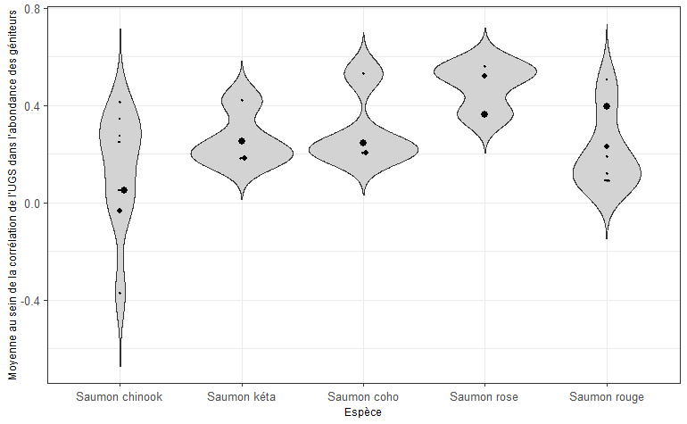

# MÉTA-ANALYSE DES CORRÉLATIONS DANS L’ABONDANCE DES GÉNITEURS ENTRE LES UNITÉS DE CONSERVATION (UC) AU SEIN DES UNITÉS DE GESTION DES STOCKS (UGS) {#app:meta-analysis-appendix}


```{r lrp-smu-corr-plot, fig.cap="Répartition des corrélations moyennes par paire entre les UC pour 40 UGS de saumon du Pacifique classées par espèce. Les points sont proportionnels au nombre d’UC d’une UGS, le point le plus élevé étant égal à 25 UC.", warning=FALSE, echo=FALSE, fig.align="center"}


```


Dans une méta-analyse des séries chronologiques sur les géniteurs des diverses espèces de saumons du Pacifique dans toute la Colombie-Britannique, les corrélations par paires dans les abondances de géniteurs entre les UC au sein des UGS avaient tendance à être positives pour le saumon rose, le saumon kéta, le saumon coho et le saumon rouge. Pour le saumon chinook, les corrélations étaient plus variables entre les UC et parfois négatives, en partie en raison de l’influence confusionnelle de la production en écloserie dans certains de ces systèmes. Un problème omniprésent dans les analyses de corrélation pour les saumons du Pacifique est que les populations disposant de séries chronologiques ont tendance à être plus fortement gérées ou à se prêter à des relevés moins coûteux sur les géniteurs, et peuvent ne pas représenter celles qui ne disposent pas de données, qui ont tendance à être éloignées, coûteuses pour les relevés sur les géniteurs, et sans intervention directe de gestion. Les données sont tirées de l’outil [Pacific Salmon Explorer](https://www.salmonexplorer.ca/), fourni par E. Hertz (Fondation du saumon du Pacifique, juillet 2020). Un lien vers le dépôt GitHub contenant le code pour effectuer ces analyses est fourni à l’annexe \@ref(app:links).
